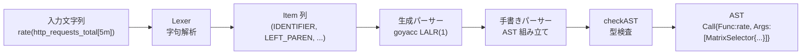

# 第9章 PromQL パーサーと AST

> 本章で読むソース
>
> - [`promql/parser/lex.go`](https://github.com/prometheus/prometheus/blob/v3.12.0/promql/parser/lex.go)
> - [`promql/parser/parse.go`](https://github.com/prometheus/prometheus/blob/v3.12.0/promql/parser/parse.go)
> - [`promql/parser/generated_parser.y`](https://github.com/prometheus/prometheus/blob/v3.12.0/promql/parser/generated_parser.y)
> - [`promql/parser/ast.go`](https://github.com/prometheus/prometheus/blob/v3.12.0/promql/parser/ast.go)
> - [`promql/parser/printer.go`](https://github.com/prometheus/prometheus/blob/v3.12.0/promql/parser/printer.go)
> - [`promql/parser/functions.go`](https://github.com/prometheus/prometheus/blob/v3.12.0/promql/parser/functions.go)

## この章の狙い

PromQL のクエリ文字列がどのように字句解析され、構文解析され、AST（抽象構文木）に変換されるかを理解する。

## 前提

読者は第7章で説明した PromQL の型体系（instant vector / range vector / scalar / string / matrix）を理解していること。

## 字句解析（Lexer）

Lexer は入力文字列を一連のトークン（Item）に分割する。

Lexer は状態機械として実装されており、`stateFn` 型の関数が現在の状態を表す。

// https://github.com/prometheus/prometheus/blob/v3.12.0/promql/parser/lex.go#L284-L284

```go
type stateFn func(*Lexer) stateFn
```

Lexer 構造体は入力バッファと位置情報を保持する。

// https://github.com/prometheus/prometheus/blob/v3.12.0/promql/parser/lex.go#L296-L318

```go
type Lexer struct {
	input       string       // The string being scanned.
	state       stateFn      // The next lexing function to enter.
	pos         posrange.Pos // Current position in the input.
	start       posrange.Pos // Start position of this Item.
	width       posrange.Pos // Width of last rune read from input.
	lastPos     posrange.Pos // Position of most recent Item returned by NextItem.
	itemp       *Item        // Pointer to where the next scanned item should be placed.
	scannedItem bool         // Set to true every time an item is scanned.

	parenDepth  int  // Nesting depth of ( ) exprs.
	braceOpen   bool // Whether a { is opened.
	bracketOpen bool // Whether a [ is opened.
	gotColon    bool // Whether we got a ':' after [ was opened.
	gotDuration bool // Whether we got a duration after [ was opened.
	stringOpen  rune // Quote rune of the string currently being read.

	// series description variables for internal PromQL testing framework as well as in promtool rules unit tests.
	// see https://prometheus.io/docs/prometheus/latest/configuration/unit_testing_rules/#series
	seriesDesc     bool           // Whether we are lexing a series description.
	histogramState histogramState // Determines whether or not inside of a histogram description.
}
```

Lexer は `next()` / `peek()` / `backup()` / `emit()` という基本操作で 1 文字ずつ読み進める。

// https://github.com/prometheus/prometheus/blob/v3.12.0/promql/parser/lex.go#L320-L349

```go
// next returns the next rune in the input.
func (l *Lexer) next() rune {
	if int(l.pos) >= len(l.input) {
		l.width = 0
		return eof
	}
	r, w := utf8.DecodeRuneInString(l.input[l.pos:])
	l.width = posrange.Pos(w)
	l.pos += l.width
	return r
}

// peek returns but does not consume the next rune in the input.
func (l *Lexer) peek() rune {
	r := l.next()
	l.backup()
	return r
}

// backup steps back one rune. Can only be called once per call of next.
func (l *Lexer) backup() {
	l.pos -= l.width
}

// emit passes an Item back to the client.
func (l *Lexer) emit(t ItemType) {
	*l.itemp = Item{t, l.start, l.input[l.start:l.pos]}
	l.start = l.pos
	l.scannedItem = true
}
```

キーワードとアグリゲーターの対応は `key` マップに定義されている。

// https://github.com/prometheus/prometheus/blob/v3.12.0/promql/parser/lex.go#L107-L150

```go
var key = map[string]ItemType{
	// Operators.
	"and":    LAND,
	"or":     LOR,
	"unless": LUNLESS,
	"atan2":  ATAN2,

	// Aggregators.
	"sum":          SUM,
	"avg":          AVG,
	"count":        COUNT,
	"min":          MIN,
	"max":          MAX,
	"group":        GROUP,
	"stddev":       STDDEV,
	"stdvar":       STDVAR,
	"topk":         TOPK,
	"bottomk":      BOTTOMK,
	"count_values": COUNT_VALUES,
	"quantile":     QUANTILE,
	"limitk":       LIMITK,
	"limit_ratio":  LIMIT_RATIO,

	// Keywords.
	"offset":      OFFSET,
	"smoothed":    SMOOTHED,
	"anchored":    ANCHORED,
	"by":          BY,
	"without":     WITHOUT,
	"on":          ON,
	"ignoring":    IGNORING,
	"group_left":  GROUP_LEFT,
	"group_right": GROUP_RIGHT,
	"fill":        FILL,
	"fill_left":   FILL_LEFT,
	"fill_right":  FILL_RIGHT,
	"bool":        BOOL,

	// Preprocessors.
	"start": START,
	"end":   END,
	"step":  STEP,
	"range": RANGE,
}
```

## 構文解析（Parser）

Parser は字句解析済みのトークン列を受け取り、AST を構築する。

PromQL のパーサーは 2 層構造を持つ。
上位層は手書きの再帰下降パーサー（`parse.go`）、下位層は goyacc 生成の LALR(1) パーサー（`generated_parser.y`）である。

// https://github.com/prometheus/prometheus/blob/v3.12.0/promql/parser/parse.go#L143-L167

```go
type parser struct {
	lex Lexer

	inject    ItemType
	injecting bool

	// functions contains all functions supported by the parser instance.
	functions map[string]*Function

	// Everytime an Item is lexed that could be the end
	// of certain expressions its end position is stored here.
	lastClosing posrange.Pos

	yyParser yyParserImpl

	generatedParserResult any
	parseErrors           ParseErrors

	// lastHistogramCounterResetHintSet is set to true when the most recently
	// built histogram had a counter_reset_hint explicitly specified.
	// This is used to populate CounterResetHintSet in SequenceValue.
	lastHistogramCounterResetHintSet bool

	options Options
}
```

### パースの流れ

`ParseExpr()` がエントリポイントである。

// https://github.com/prometheus/prometheus/blob/v3.12.0/promql/parser/parse.go#L70-L74

```go
func (pql *promQLParser) ParseExpr(input string) (Expr, error) {
	p := newParser(input, pql.options)
	defer p.Close()
	return p.parseExpr()
}
```

`parseExpr()` は生成パーサーを起動し、結果に対して型検査 `checkAST()` を実行する。

// https://github.com/prometheus/prometheus/blob/v3.12.0/promql/parser/parse.go#L196-L215

```go
func (p *parser) parseExpr() (expr Expr, err error) {
	defer p.recover(&err)

	parseResult := p.parseGenerated(START_EXPRESSION)

	if parseResult != nil {
		expr = parseResult.(Expr)
	}

	// Only typecheck when there are no syntax errors.
	if len(p.parseErrors) == 0 {
		p.checkAST(expr)
	}

	if len(p.parseErrors) != 0 {
		err = p.parseErrors
	}

	return expr, err
}
```

### Lex インターフェース

生成パーサーは `yyLexer` インターフェースを通じてパーサー構造体の `Lex()` メソッドを呼び出す。
`Lex()` は lexer からトークンを取得し、コメントをスキップして生成パーサーに渡す。

// https://github.com/prometheus/prometheus/blob/v3.12.0/promql/parser/parse.go#L367-L401

```go
func (p *parser) Lex(lval *yySymType) int {
	var typ ItemType

	if p.injecting {
		p.injecting = false
		return int(p.inject)
	}
	// Skip comments.
	for {
		p.lex.NextItem(&lval.item)
		typ = lval.item.Typ
		if typ != COMMENT {
			break
		}
	}

	switch typ {
	case ERROR:
		pos := posrange.PositionRange{
			Start: p.lex.start,
			End:   posrange.Pos(len(p.lex.input)),
		}
		p.addParseErr(pos, errors.New(p.yyParser.lval.item.Val))

		// Tells yacc that this is the end of input.
		return 0
	case EOF:
		lval.item.Typ = EOF
		p.InjectItem(0)
	case RIGHT_BRACE, RIGHT_PAREN, RIGHT_BRACKET, DURATION, NUMBER:
		p.lastClosing = lval.item.Pos + posrange.Pos(len(lval.item.Val))
	}

	return int(typ)
}
```

### 生成パーサーの役割

`generated_parser.y` は演算子の優先順位と文法規則を定義する yacc ファイルである。
例えば二項演算子の結合、関数呼び出し `func()`、ラベルマッチャー `{label="value"}` などはここで処理される。

手書きパーサー側は `newBinaryExpression()` や `newAggregateExpr()` などのヘルパーを提供し、生成パーサーが AST ノードを組み立てるときに呼び出す。

### プールによるパーサーの再利用

パーサーは `sync.Pool` で管理され、毎回のパースでゼロアロケーションに近い再利用が行われる。

// https://github.com/prometheus/prometheus/blob/v3.12.0/promql/parser/parse.go#L37-L41

```go
var parserPool = sync.Pool{
	New: func() any {
		return &parser{}
	},
}
```

## AST（抽象構文木）

すべての AST ノードは `Node` インターフェースを実装する。

// https://github.com/prometheus/prometheus/blob/v3.12.0/promql/parser/ast.go#L38-L50

```go
type Node interface {
	// String representation of the node that returns the given node when parsed
	// as part of a valid query.
	String() string

	// Pretty returns the prettified representation of the node.
	// It uses the level information to determine at which level/depth the current
	// node is in the AST and uses this to apply indentation.
	Pretty(level int) string

	// PositionRange returns the position of the AST Node in the query string.
	PositionRange() posrange.PositionRange
}
```

`Statement` と `Expr` はその下位インターフェースである。

// https://github.com/prometheus/prometheus/blob/v3.12.0/promql/parser/ast.go#L52-L85

```go
// Statement is a generic interface for all statements.
type Statement interface {
	Node

	// PromQLStmt ensures that no other type accidentally implements the interface
	PromQLStmt()
}

// Expr is a generic interface for all expression types.
type Expr interface {
	Node

	// Type returns the type the expression evaluates to. It does not perform
	// in-depth checks as this is done at parsing-time.
	Type() ValueType
	// PromQLExpr ensures that no other types accidentally implement the interface.
	PromQLExpr()
}
```

### 主要な AST ノード

**EvalStmt** はクエリ全体の評価文脈（時間範囲、インターバル、lookback delta）を保持する。

// https://github.com/prometheus/prometheus/blob/v3.12.0/promql/parser/ast.go#L62-L72

```go
// EvalStmt holds an expression and information on the range it should
// be evaluated on.
type EvalStmt struct {
	Expr Expr // Expression to be evaluated.

	// The time boundaries for the evaluation. If Start equals End an instant
	// is evaluated.
	Start, End time.Time
	// Time between two evaluated instants for the range [Start:End].
	Interval time.Duration
	// Lookback delta to use for this evaluation.
	LookbackDelta time.Duration
}
```

**VectorSelector** は instant vector の選択を表す。

// https://github.com/prometheus/prometheus/blob/v3.12.0/promql/parser/ast.go#L205-L235

```go
// VectorSelector represents a Vector selection.
type VectorSelector struct {
	Name string
	// OriginalOffset is the actual offset calculated from OriginalOffsetExpr.
	OriginalOffset time.Duration
	// OriginalOffsetExpr is the actual offset that was set in the query.
	OriginalOffsetExpr *DurationExpr
	// Offset is the offset used during the query execution
	// which is calculated using the original offset, at modifier time,
	// eval time, and subquery offsets in the AST tree.
	Offset               time.Duration
	Timestamp            *int64
	SkipHistogramBuckets bool     // Set when decoding native histogram buckets is not needed for query evaluation.
	StartOrEnd           ItemType // Set when @ is used with start() or end()
	LabelMatchers        []*labels.Matcher

	// The unexpanded seriesSet populated at query preparation time.
	UnexpandedSeriesSet storage.SeriesSet
	Series              []storage.Series

	// BypassEmptyMatcherCheck is true when the VectorSelector isn't required to have at least one matcher matching the empty string.
	// This is the case when VectorSelector is used to represent the info function's second argument.
	BypassEmptyMatcherCheck bool

	// Anchored is true when the VectorSelector is anchored.
	Anchored bool
	// Smoothed is true when the VectorSelector is smoothed.
	Smoothed bool

	PosRange posrange.PositionRange
}
```

**MatrixSelector** は range vector の選択を表す。

// https://github.com/prometheus/prometheus/blob/v3.12.0/promql/parser/ast.go#L131-L139

```go
// MatrixSelector represents a Matrix selection.
type MatrixSelector struct {
	// It is safe to assume that this is an VectorSelector
	// if the parser hasn't returned an error.
	VectorSelector Expr
	Range          time.Duration
	RangeExpr      *DurationExpr
	EndPos         posrange.Pos
}
```

**Call** は関数呼び出しを表す。

// https://github.com/prometheus/prometheus/blob/v3.12.0/promql/parser/ast.go#L123-L129

```go
// Call represents a function call.
type Call struct {
	Func *Function   // The function that was called.
	Args Expressions // Arguments used in the call.

	PosRange posrange.PositionRange
}
```

**AggregateExpr** は集約操作を表す。

// https://github.com/prometheus/prometheus/blob/v3.12.0/promql/parser/ast.go#L90-L98

```go
// AggregateExpr represents an aggregation operation on a Vector.
type AggregateExpr struct {
	Op       ItemType // The used aggregation operation.
	Expr     Expr     // The Vector expression over which is aggregated.
	Param    Expr     // Parameter used by some aggregators.
	Grouping []string // The labels by which to group the Vector.
	Without  bool     // Whether to drop the given labels rather than keep them.
	PosRange posrange.PositionRange
}
```

**BinaryExpr** は二項演算を表す。

// https://github.com/prometheus/prometheus/blob/v3.12.0/promql/parser/ast.go#L100-L111

```go
// BinaryExpr represents a binary expression between two child expressions.
type BinaryExpr struct {
	Op       ItemType // The operation of the expression.
	LHS, RHS Expr     // The operands on the respective sides of the operator.

	// The matching behavior for the operation if both operands are Vectors.
	// If they are not this field is nil.
	VectorMatching *VectorMatching

	// If a comparison operator, return 0/1 rather than filtering.
	ReturnBool bool
}
```

**VectorMatching** は二項演算におけるラベルマッチングの方式を指定する。

// https://github.com/prometheus/prometheus/blob/v3.12.0/promql/parser/ast.go#L307-L323

```go
// VectorMatching describes how elements from two Vectors in a binary
// operation are supposed to be matched.
type VectorMatching struct {
	// The cardinality of the two Vectors.
	Card VectorMatchCardinality
	// MatchingLabels contains the labels which define equality of a pair of
	// elements from the Vectors.
	MatchingLabels []string
	// On includes the given label names from matching,
	// rather than excluding them.
	On bool
	// Include contains additional labels that should be included in
	// the result from the side with the lower cardinality.
	Include []string
	// Fill-in values to use when a series from one side does not find a match on the other side.
	FillValues VectorMatchFillValues
}
```

**SubqueryExpr** はサブクエリを表す。

// https://github.com/prometheus/prometheus/blob/v3.12.0/promql/parser/ast.go#L141-L160

```go
// SubqueryExpr represents a subquery.
type SubqueryExpr struct {
	Expr      Expr
	Range     time.Duration
	RangeExpr *DurationExpr
	// OriginalOffset is the actual offset that was set in the query.
	OriginalOffset time.Duration
	// OriginalOffsetExpr is the actual offset expression that was set in the query.
	OriginalOffsetExpr *DurationExpr
	// Offset is the offset used during the query execution
	// which is calculated using the original offset, offset expression, at modifier time,
	// eval time, and subquery offsets in the AST tree.
	Offset     time.Duration
	Timestamp  *int64
	StartOrEnd ItemType // Set when @ is used with start() or end()
	Step       time.Duration
	StepExpr   *DurationExpr

	EndPos posrange.Pos
}
```

### Walk / Inspect

AST を巡回するための Visitor パターンが用意されている。

// https://github.com/prometheus/prometheus/blob/v3.12.0/promql/parser/ast.go#L340-L342

```go
type Visitor interface {
	Visit(node Node, path []Node) (w Visitor, err error)
}
```

`Walk()` は深さ優先で AST を巡回し、`Inspect()` はその簡易ラッパーである。

### ChildrenIter

各ノードの子ノードをイテレートする `ChildrenIter()` は型スイッチで実装されている。
コメントにもある通り、インターフェースの動的ディスパッチより型スイッチの方が有意に速い。

// https://github.com/prometheus/prometheus/blob/v3.12.0/promql/parser/ast.go#L401-L450

```go
// ChildrenIter returns an iterator over all child nodes of a syntax tree node.
func ChildrenIter(node Node) func(func(Node) bool) {
	return func(yield func(Node) bool) {
		// According to lore, these switches have significantly better performance than interfaces
		switch n := node.(type) {
		case *EvalStmt:
			yield(n.Expr)
		case Expressions:
			for _, e := range n {
				if !yield(e) {
					return
				}
			}
		case *AggregateExpr:
			if n.Expr != nil {
				if !yield(n.Expr) {
					return
				}
			}
			if n.Param != nil {
				yield(n.Param)
			}
		case *BinaryExpr:
			if !yield(n.LHS) {
				return
			}
			yield(n.RHS)
		case *Call:
			for _, e := range n.Args {
				if !yield(e) {
					return
				}
			}
		// ... (中略) ...
		}
	}
}
```

## Prettier / Printer

各 AST ノードは `String()` メソッドを持ち、AST を元の PromQL 文字列に戻す。

例えば `Call` の `String()` は単純に関数名と引数を連結する。

// https://github.com/prometheus/prometheus/blob/v3.12.0/promql/parser/printer.go#L249-L251

```go
func (node *Call) String() string {
	return node.Func.Name + "(" + node.Args.String() + ")"
}
```

`VectorSelector` の `String()` はメトリクス名、ラベルマッチャー、`@` 修飾子、`offset` などを整形する。

## Function 定義

`parser/functions.go` の `Function` 構造体は各関数の名前、引数型、戻り値型を保持する。

// https://github.com/prometheus/prometheus/blob/v3.12.0/promql/parser/functions.go#L18-L24

```go
type Function struct {
	Name         string
	ArgTypes     []ValueType
	Variadic     int
	ReturnType   ValueType
	Experimental bool
}
```

`Functions` マップは70以上の関数定義を持つ。

## パースフロー



入力文字列は Lexer でトークン列に変換され、生成パーサーが文法に従って構造を決定し、手書きパーサーが具体的な AST ノードを組み立てる。
最後に `checkAST()` で型の一貫性を検証し、完成した AST が評価エンジンに渡される。

## 高速化の工夫：sync.Pool によるパーサーの再利用

`parserPool`（`parse.go:37`）は `sync.Pool` を使ってパーサー構造体を再利用する。
クエリごとにパーサーを新規確保すると GC 負荷が高くなるが、プールから取得して `Close()` で返却することでアロケーションを削減している。

## まとめ

PromQL パーサーは Lexer（状態機械）＋ 生成パーサー（goyacc）＋ 手書きパーサーの 3 層構成でクエリ文字列から AST を構築する。
AST は `Node` → `Expr` / `Statement` のインターフェース階層を持ち、`Walk` / `Inspect` で巡回できる。
Printer は AST から元の PromQL 文字列を復元する。

## 関連する章

- 第7章（PromQL の型体系: instant vector / range vector / scalar / string）
- 第10章（PromQL エンジン: AST を実行しクエリ結果を生成する）
