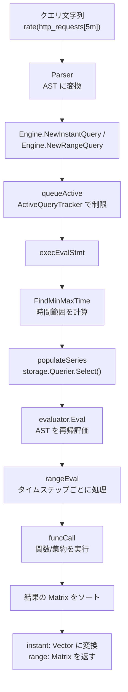

# 第10章 PromQL エンジン

> 本章で読むソース
>
> - [`promql/engine.go`](https://github.com/prometheus/prometheus/blob/v3.12.0/promql/engine.go)

## この章の狙い

パース済みの AST を受け取り、ストレージからデータを取得し、クエリ結果を計算する評価エンジンの内部構造を理解する。

## 前提

読者は第9章（PromQL パーサーと AST）を理解し、AST ノードの種類と構造を知っていること。

## Engine 構造体

`Engine` はクエリのライフサイクル全体を管理する中心的な構造体である。

// <https://github.com/prometheus/prometheus/blob/v3.12.0/promql/engine.go#L348-L365>

```go
type Engine struct {
    logger                   *slog.Logger
    metrics                  *engineMetrics
    timeout                  time.Duration
    maxSamplesPerQuery       int
    activeQueryTracker       QueryTracker
    queryLogger              QueryLogger
    queryLoggerLock          sync.RWMutex
    lookbackDelta            time.Duration
    noStepSubqueryIntervalFn func(rangeMillis int64) int64
    enableAtModifier         bool
    enableNegativeOffset     bool
    enablePerStepStats       bool
    enableDelayedNameRemoval bool
    enableTypeAndUnitLabels  bool
    useStartTimestamps       bool
    parser                   parser.Parser
}

```

### EngineOpts

`EngineOpts` はエンジン生成時の設定値を保持する。

// <https://github.com/prometheus/prometheus/blob/v3.12.0/promql/engine.go#L298-L344>

```go
type EngineOpts struct {
    Logger             *slog.Logger
    Reg                prometheus.Registerer
    MaxSamples         int
    Timeout            time.Duration
    ActiveQueryTracker QueryTracker
    LookbackDelta time.Duration

    NoStepSubqueryIntervalFn func(rangeMillis int64) int64

    EnableAtModifier bool

    EnableNegativeOffset bool

    EnablePerStepStats bool

    EnableDelayedNameRemoval bool
    EnableTypeAndUnitLabels bool

    UseStartTimestamps bool

    FeatureRegistry features.Collector

    Parser parser.Parser
}

```

`MaxSamples` はクエリが一度にメモリ上に展開できるサンプル数の上限である。
`Timeout` はクエリ全体のタイムアウトを指定する。

`LookbackDelta` は instant vector 評価時に現在時刻よりどれだけ過去までサンプルを探すかを決める。
デフォルト値は 5 分である。

// <https://github.com/prometheus/prometheus/blob/v3.12.0/promql/engine.go#L59-L64>

```go
const (
    namespace            = "prometheus"
    subsystem            = "engine"
    queryTag             = "query"
    env                  = "query execution"
    defaultLookbackDelta = 5 * time.Minute
)

```

## クエリの作成と実行

### クエリの作成

`NewInstantQuery()` と `NewRangeQuery()` がクエリ作成のエントリポイントである。

// <https://github.com/prometheus/prometheus/blob/v3.12.0/promql/engine.go#L536-L553>

```go
func (ng *Engine) NewInstantQuery(ctx context.Context, q storage.Queryable, opts QueryOpts, qs string, ts time.Time) (Query, error) {
    pExpr, qry := ng.newQuery(q, qs, opts, ts, ts, 0*time.Second)
    finishQueue, err := ng.queueActive(ctx, qry)
    if err != nil {
        return nil, err
    }
    defer finishQueue()
    expr, err := ng.parser.ParseExpr(qs)
    if err != nil {
        return nil, err
    }
    if err := ng.validateOpts(expr); err != nil {
        return nil, err
    }
    *pExpr, err = PreprocessExpr(expr, ts, ts, 0)
    return qry, err
}

```

`newQuery()` は `EvalStmt` を生成しクエリ構造体を作る。
パーサーで式をパースした後、`validateOpts()` で `@` 修飾子や負の offset が有効か検証する。
`PreprocessExpr()` はクエリコンテキスト関数（`start()`, `end()`, `step()`, `range()`）を数値リテラルに畳み込む。

### ActiveQueryTracker による並行制御

`ActiveQueryTracker` インターフェースはアクティブなクエリを追跡し、最大同時実行数を制限する。

// <https://github.com/prometheus/prometheus/blob/v3.12.0/promql/engine.go#L283-L296>

```go
type QueryTracker interface {
    io.Closer
    GetMaxConcurrent() int
    Insert(ctx context.Context, query string) (int, error)
    Delete(insertIndex int)
}

```

`queueActive()` はクエリ実行前に `Insert()` を呼び出し、最大同時実行数に達している場合はブロックする。

// <https://github.com/prometheus/prometheus/blob/v3.12.0/promql/engine.go#L759-L767>

```go
func (ng *Engine) queueActive(ctx context.Context, q *query) (func(), error) {
    if ng.activeQueryTracker == nil {
        return func() {}, nil
    }
    queueSpanTimer, _ := q.stats.GetSpanTimer(ctx, stats.ExecQueueTime, ng.metrics.queryQueueTime, ng.metrics.queryQueueTimeHistogram)
    queryIndex, err := ng.activeQueryTracker.Insert(ctx, q.q)
    queueSpanTimer.Finish()
    return func() { ng.activeQueryTracker.Delete(queryIndex) }, err
}

```

### クエリ実行の流れ

`exec()` はクエリ実行のトップレベル関数である。

// <https://github.com/prometheus/prometheus/blob/v3.12.0/promql/engine.go#L678-L755>

```go
func (ng *Engine) exec(ctx context.Context, q *query) (v parser.Value, ws annotations.Annotations, err error) {
    ng.metrics.currentQueries.Inc()
    defer func() {
        ng.metrics.currentQueries.Dec()
        ng.metrics.querySamples.Add(float64(q.sampleStats.TotalSamples))
    }()

    ctx, cancel := context.WithTimeout(ctx, ng.timeout)
    q.cancel = cancel

    // ... (中略) ...

    execSpanTimer, ctx := q.stats.GetSpanTimer(ctx, stats.ExecTotalTime)
    defer execSpanTimer.Finish()

    finishQueue, err := ng.queueActive(ctx, q)
    // ... (中略) ...
    evalSpanTimer, ctx := q.stats.GetSpanTimer(ctx, stats.EvalTotalTime)
    defer evalSpanTimer.Finish()

    switch s := q.Statement().(type) {
    case *parser.EvalStmt:
        return ng.execEvalStmt(ctx, q, s)
    case parser.TestStmt:
        return nil, nil, s(ctx)
    }
    panic(fmt.Errorf("promql.Engine.exec: unhandled statement of type %T", q.Statement()))
}

```

`exec()` はコンテキストにタイムアウトを設定し、`ActiveQueryTracker` による待機を行い、`execEvalStmt()` を呼び出す。

### execEvalStmt

`execEvalStmt()` は評価文を実際に実行する。

// <https://github.com/prometheus/prometheus/blob/v3.12.0/promql/engine.go#L778-L896>

```go
func (ng *Engine) execEvalStmt(ctx context.Context, query *query, s *parser.EvalStmt) (parser.Value, annotations.Annotations, error) {
    prepareSpanTimer, ctxPrepare := query.stats.GetSpanTimer(ctx, stats.QueryPreparationTime, ng.metrics.queryPrepareTime, ng.metrics.queryPrepareTimeHistogram)
    mint, maxt := FindMinMaxTime(s)
    querier, err := query.queryable.Querier(mint, maxt)
    // ... (中略) ...
    ng.populateSeries(ctxPrepare, querier, s)
    prepareSpanTimer.Finish()

    setOffsetForAtModifier(timeMilliseconds(s.Start), s.Expr)
    evalSpanTimer, ctxInnerEval := query.stats.GetSpanTimer(ctx, stats.InnerEvalTime, ng.metrics.queryInnerEval, ng.metrics.queryInnerEvalHistogram)

    if s.Start.Equal(s.End) && s.Interval == 0 {
        // ... (中略) ...
    }

    // ... (中略) ...
    ng.sortMatrixResult(ctx, query, mat)
    return mat, warnings, nil
}

```

主な処理の流れは次の通りである。

1. `FindMinMaxTime()` でクエリが必要とする時間範囲を計算する。
2. `Querier()` でストレージのクエリインターフェースを取得する。
3. `populateSeries()` で AST を巡回し、各 `VectorSelector` に対して `storage.Querier.Select()` を呼び出して series を取得する。
4. `setOffsetForAtModifier()` で `@` 修飾子のオフセットを設定する。
5. `evaluator.Eval()` で式を評価する。
6. 結果をソートして返す。

## Evaluator

`evaluator` 構造体は 1 つのクエリ評価の状態を保持する。

// <https://github.com/prometheus/prometheus/blob/v3.12.0/promql/engine.go#L1145-L1160>

```go
type evaluator struct {
    startTimestamp int64 // Start time in milliseconds.
    endTimestamp   int64 // End time in milliseconds.
    interval       int64 // Interval in milliseconds.

    maxSamples               int
    currentSamples           int
    logger                   *slog.Logger
    lookbackDelta            time.Duration
    samplesStats             *stats.QuerySamples
    noStepSubqueryIntervalFn func(rangeMillis int64) int64
    enableDelayedNameRemoval bool
    enableTypeAndUnitLabels  bool
    useStartTimestamps       bool
    querier                  storage.Querier
}

```

### Eval メソッド

`Eval()` は AST のルートから評価を開始する。

// <https://github.com/prometheus/prometheus/blob/v3.12.0/promql/engine.go#L1197-L1205>

```go
func (ev *evaluator) Eval(ctx context.Context, expr parser.Expr) (v parser.Value, ws annotations.Annotations, err error) {
    defer ev.recover(expr, &ws, &err)
    v, ws = ev.eval(ctx, expr)
    if ev.enableDelayedNameRemoval {
        v = ev.cleanupMetricLabels(v)
    }
    return v, ws, nil
}

```

### eval メソッド（ディスパッチ）

`eval()` は式の型に応じて処理を分岐させる。

// <https://github.com/prometheus/prometheus/blob/v3.12.0/promql/engine.go#L1916-L2435>

```go
func (ev *evaluator) eval(ctx context.Context, expr parser.Expr) (parser.Value, annotations.Annotations) {
    switch e := expr.(type) {
    case *parser.AggregateExpr:
    case *parser.Call:
    case *parser.ParenExpr:
    case *parser.UnaryExpr:
    case *parser.BinaryExpr:
    case *parser.NumberLiteral:
    case *parser.StringLiteral:
    case *parser.VectorSelector:
    case *parser.MatrixSelector:
    case *parser.SubqueryExpr:
    case *parser.StepInvariantExpr:
    }
}

```

### rangeEval

`rangeEval()` は range クエリの各タイムステップで関数を実行するための汎用ループである。

// <https://github.com/prometheus/prometheus/blob/v3.12.0/promql/engine.go#L1401-L1401>

```go
func (ev *evaluator) rangeEval(ctx context.Context, matching *parser.VectorMatching, funcCall func([]Vector, Matrix, [][]EvalSeriesHelper, *EvalNodeHelper) (Vector, annotations.Annotations), exprs ...parser.Expr) (Matrix, annotations.Annotations) {

```

`rangeEval()` は以下の手順で動作する。

1. 引数の式を事前に評価し、`Matrix` のスライスを得る。
2. 各タイムステップで、各 `Matrix` からその時刻の `Vector` を切り出す。
3. 切り出した `Vector` 群を `funcCall` に渡す。
4. 結果を出力 `Matrix` に集約する。

## EvalNodeHelper

`EvalNodeHelper` は単一ノードの評価におけるコンテキストとキャッシュを提供する。

// <https://github.com/prometheus/prometheus/blob/v3.12.0/promql/engine.go#L1219-L1253>

```go
type EvalNodeHelper struct {
    // Evaluation timestamp.
    Ts int64
    // Vector that can be used for output.
    Out Vector

    // Caches.
    // funcHistogramQuantile and funcHistogramFraction for classic histograms.
    signatureToMetricWithBuckets map[string]*metricWithBuckets
    nativeHistogramSamples       []Sample
    // funcHistogramQuantiles for histograms.
    quantileStrs                  map[float64]string
    signatureToLabelsWithQuantile map[string]map[float64]labels.Labels

    lb           *labels.Builder
    lblBuf       []byte
    lblResultBuf []byte

    // For binary vector matching.
    rightSigs          []Sample
    sigsPresent        []bool
    matchedSigs        []map[uint64]struct{}
    matchedSigsPresent []bool
    resultMetric       map[string]labels.Labels
    numSigs            int

    // For info series matching.
    rightStrSigs map[string]Sample

    // Additional options for the evaluation.
    enableDelayedNameRemoval bool

    // StartTimestamps optionally provides sample start timestamps aligned with matrix samples.
    StartTimestamps *StartTimestamps
}

```

`Out` は出力ベクトルとして再利用され、毎ステップのアロケーションを回避する。
`resetHistograms()` はヒストグラム関数のキャッシュを初期化し、classic bucket と native histogram を振り分ける。

## populateSeries（データ準備）

`populateSeries()` は AST を巡回し、各 `VectorSelector` に対して `storage.Querier.Select()` を呼び出して series を事前取得する。

// <https://github.com/prometheus/prometheus/blob/v3.12.0/promql/engine.go#L1036-L1065>

```go
func (ng *Engine) populateSeries(ctx context.Context, querier storage.Querier, s *parser.EvalStmt) {
    var evalRange time.Duration
    parser.Inspect(s.Expr, func(node parser.Node, path []parser.Node) error {
        switch n := node.(type) {
        case *parser.VectorSelector:
            start, end := getTimeRangesForSelector(s, n, path, evalRange)
            interval := ng.getLastSubqueryInterval(path)
            if interval == 0 {
                interval = s.Interval
            }
            hints := &storage.SelectHints{
                Start: start,
                End:   end,
                Step:  durationMilliseconds(interval),
                Range: durationMilliseconds(evalRange),
                Func:  extractFuncFromPath(path),
            }
            evalRange = 0
            hints.By, hints.Grouping = extractGroupsFromPath(path)
            n.UnexpandedSeriesSet = querier.Select(ctx, false, hints, n.LabelMatchers...)
        case *parser.MatrixSelector:
            evalRange = n.Range
        }
        return nil
    })
}

```

`extractFuncFromPath()` は AST パスを上方向に辿り、最初に見つけた関数名または集約名を `SelectHints.Func` にセットする。
これによりストレージ層が関数の種類を認識し、最適化（例: `rate()` の場合は不要なサンプルをスキップ）を行える。

## クエリ評価パイプライン



## 高速化の工夫：SelectHints によるストレージ最適化

`populateSeries()` は `SelectHints.Func` に関数名をセットする。
ストレージ実装（TSDB）はこのヒントを使って、`rate()` などの範囲ベクトル関数に対して「範囲の両端のサンプルだけが必要」と判断し、範囲内の全サンプルをスキャンするコストを削減できる。

## まとめ

Engine はクエリのパース、同時実行制御、タイムアウト管理、ストレージからのデータ取得、式の評価という一連の流れを統括する。
Evaluator は AST を再帰的に評価し、各タイムステップで関数や集約を適用する。
`ActiveQueryTracker` は最大同時実行数を制御し、`EngineOpts` は豊富な設定オプションを提供する。

## 関連する章

- 第9章（PromQL パーサーと AST: Engine が受け取る AST の構造）
- 第11章（関数とアグリゲーション: エンジンから呼び出される関数実装）
