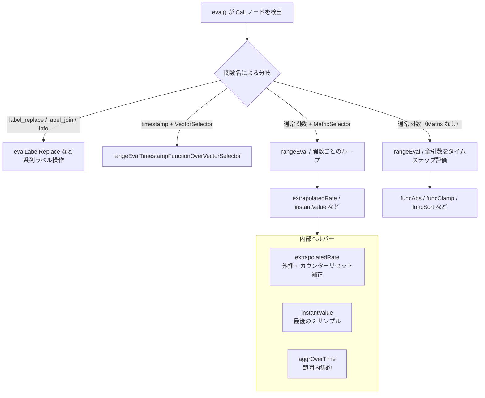

# 第11章 関数とアグリゲーション

> 本章で読むソース
>
> - [`promql/functions.go`](https://github.com/prometheus/prometheus/blob/v3.12.0/promql/functions.go)
> - [`promql/quantile.go`](https://github.com/prometheus/prometheus/blob/v3.12.0/promql/quantile.go)
> - [`promql/engine.go`](https://github.com/prometheus/prometheus/blob/v3.12.0/promql/engine.go)（集約・二項演算・サブクエリの評価）
> - [`promql/parser/functions.go`](https://github.com/prometheus/prometheus/blob/v3.12.0/promql/parser/functions.go)

## この章の狙い

PromQL の関数呼び出し、集約操作、二項演算、サブクエリの実装パターンを理解する。

## 前提

読者は第10章（PromQL エンジン）の `eval()` ディスパッチと `rangeEval()` の仕組みを理解していること。

## FunctionCall 型

PromQL の全関数は `FunctionCall` 型の関数として実装されている。

// <https://github.com/prometheus/prometheus/blob/v3.12.0/promql/functions.go#L60-L60>

```go
type FunctionCall func(vectorVals []Vector, matrixVals Matrix, args parser.Expressions, enh *EvalNodeHelper) (Vector, annotations.Annotations)

```

`vectorVals` は instant vector 引数の評価結果、`matrixVals` は range vector 引数の評価結果である。
`args` は元の AST 引数で文字列リテラルなどにもアクセスできる。
`enh` は `EvalNodeHelper` で、出力ベクトル `Out` の再利用や各種キャッシュを提供する。

### 関数のディスパッチ

`FunctionCalls` マップは関数名から実装への対応付けを持つ。

// <https://github.com/prometheus/prometheus/blob/v3.12.0/promql/functions.go#L2248-L2336>

```go
var FunctionCalls = map[string]FunctionCall{
    "abs":                          funcAbs,
    "absent":                       funcAbsent,
    "absent_over_time":             funcAbsentOverTime,
    "avg_over_time":                funcAvgOverTime,
    "changes":                      funcChanges,
    "clamp":                        funcClamp,
    "delta":                        funcDelta,
    "deriv":                        funcDeriv,
    "double_exponential_smoothing": funcDoubleExponentialSmoothing,
    "histogram_avg":                funcHistogramAvg,
    "histogram_count":              funcHistogramCount,
    "histogram_fraction":           funcHistogramFraction,
    "histogram_quantile":           funcHistogramQuantile,
    "histogram_quantiles":          funcHistogramQuantiles,
    "histogram_sum":                funcHistogramSum,
    "histogram_stddev":             funcHistogramStdDev,
    "histogram_stdvar":             funcHistogramStdVar,
    "idelta":                       funcIdelta,
    "increase":                     funcIncrease,
    "irate":                        funcIrate,
    "label_replace":                nil, // evalLabelReplace not called via this map.
    "label_join":                   nil, // evalLabelJoin not called via this map.
    "rate":                         funcRate,
    "resets":                       funcResets,
    "sort":                         funcSort,
    "sort_desc":                    funcSortDesc,
    "sort_by_label":                funcSortByLabel,
    "sort_by_label_desc":           funcSortByLabelDesc,
    "time":                         funcTime,
    "timestamp":                    funcTimestamp,
    "vector":                       funcVector,
}

```

`label_replace` と `label_join` は通常の関数呼び出しパスを通らず、`eval()` 内で特別に処理される。

## レート関数：rate / irate / increase / delta

### extrapolatedRate

`rate()`、`increase()`、`delta()` は内部で `extrapolatedRate()` を呼び出す。

// <https://github.com/prometheus/prometheus/blob/v3.12.0/promql/functions.go#L460-L471>

```go
func funcDelta(_ []Vector, matrixVals Matrix, args parser.Expressions, enh *EvalNodeHelper) (Vector, annotations.Annotations) {
    return extrapolatedRate(matrixVals, args, enh, false, false)
}

func funcRate(_ []Vector, matrixVals Matrix, args parser.Expressions, enh *EvalNodeHelper) (Vector, annotations.Annotations) {
    return extrapolatedRate(matrixVals, args, enh, true, true)
}

func funcIncrease(_ []Vector, matrixVals Matrix, args parser.Expressions, enh *EvalNodeHelper) (Vector, annotations.Annotations) {
    return extrapolatedRate(matrixVals, args, enh, true, false)
}

```

`extrapolatedRate()` は範囲内の最初と最後のサンプルを使って値を計算し、サンプル間隔に基づいて外挿（extrapolation）を行う。
カウンターリセットの検出と補正もここで処理される。

// <https://github.com/prometheus/prometheus/blob/v3.12.0/promql/functions.go#L188-L315>

```go
func extrapolatedRate(vals Matrix, args parser.Expressions, enh *EvalNodeHelper, isCounter, isRate bool) (Vector, annotations.Annotations) {
    ms := args[0].(*parser.MatrixSelector)
    vs := ms.VectorSelector.(*parser.VectorSelector)
    if vs.Anchored || vs.Smoothed {
        return extendedRate(vals, args, enh, isCounter, isRate)
    }

    // ... (中略) ...

    // Duration between first/last samples and boundary of range.
    durationToStart := float64(firstT-rangeStart) / 1000
    durationToEnd := float64(rangeEnd-lastT) / 1000
    sampledInterval := float64(lastT-firstT) / 1000
    averageDurationBetweenSamples := sampledInterval / float64(numSamplesMinusOne)

    // ... (中略) ...

    extrapolationThreshold := averageDurationBetweenSamples * 1.1
    if durationToStart >= extrapolationThreshold {
        durationToStart = averageDurationBetweenSamples / 2
    }

    // ... (中略) ...

    factor := (sampledInterval + durationToStart + durationToEnd) / sampledInterval
    if isRate {
        factor /= ms.Range.Seconds()
    }

    // ... (中略) ...
}

```

### irate / idelta

`irate()` と `idelta()` は範囲内の最後の 2 サンプルだけを使って瞬間的なレートを計算する。

// <https://github.com/prometheus/prometheus/blob/v3.12.0/promql/functions.go#L475-L482>

```go
func funcIrate(_ []Vector, matrixVals Matrix, args parser.Expressions, enh *EvalNodeHelper) (Vector, annotations.Annotations) {
    return instantValue(matrixVals, args, enh, true)
}

func funcIdelta(_ []Vector, matrixVals Matrix, args parser.Expressions, enh *EvalNodeHelper) (Vector, annotations.Annotations) {
    return instantValue(matrixVals, args, enh, false)
}

```

## 集約関数

アグリゲーションは `AggregateExpr` として AST に現れ、`eval()` 内で `rangeEvalAgg()` により処理される。

// <https://github.com/prometheus/prometheus/blob/v3.12.0/promql/engine.go#L1580-L1580>

```go
func (ev *evaluator) rangeEvalAgg(ctx context.Context, aggExpr *parser.AggregateExpr, sortedGrouping []string, inputMatrix Matrix, params *fParams) (Matrix, annotations.Annotations) {

```

主なアグリゲーションの種類は以下の通りである。

- **sum / avg / min / max / count / stddev / stdvar**: 標準的な統計集約
- **group**: シグネチャが一致する系列を 1 つにまとめる（値は 1）
- **topk / bottomk**: 上位/下位 k 個の系列を保持
- **quantile**: 指定されたパーセンタイルを計算
- **count_values**: 値ごとの出現回数をカウント
- **limitk / limit_ratio**: 出力系列数を制限する実験的機能

パラメーター付き集約（`topk`, `bottomk`, `quantile`, `count_values`, `limitk`, `limit_ratio`）は `AggregateExpr.Param` にパラメーターを持つ。

## Over-Time 関数

`*_over_time` 関数は range vector を受け取り、範囲内の全サンプルに対する集約値を返す。

// <https://github.com/prometheus/prometheus/blob/v3.12.0/promql/functions.go#L852-L859>

```go
func aggrOverTime(matrixVal Matrix, enh *EvalNodeHelper, aggrFn func(Series) float64) Vector {
    if len(matrixVal) == 0 {
        return enh.Out
    }
    el := matrixVal[0]

    return append(enh.Out, Sample{F: aggrFn(el)})
}

```

`avg_over_time()` はカハン加算（Kahan summation）を用いて浮動小数点誤差を抑えた平均を計算する。
直接平均とインクリメンタル平均をオーバーフローの有無で切り替える。

## ヒストグラム関連関数

### histogram_quantile

`histogram_quantile()` は classic histogram（`le` ラベルを持つ bucket）と native histogram の両方をサポートする。

classic histogram のパスでは `BucketQuantile()`（`quantile.go:105`）が呼ばれる。
bucket の単調性が保障されていない場合、`ensureMonotonicAndIgnoreSmallDeltas()` が補正する。

// <https://github.com/prometheus/prometheus/blob/v3.12.0/promql/quantile.go#L105-L170>

```go
func BucketQuantile(q float64, buckets Buckets) (
    quantile float64,
    forcedMonotonic, fixedPrecision bool,
    minBucket, maxBucket, maxDiff float64,
) {
    // ... (中略) ...
    slices.SortFunc(buckets, func(a, b Bucket) int {
        if a.UpperBound < b.UpperBound {
            return -1
        }
        if a.UpperBound > b.UpperBound {
            return +1
        }
        return 0
    })
    if !math.IsInf(buckets[len(buckets)-1].UpperBound, +1) {
        quantile = math.NaN()
        return quantile, forcedMonotonic, fixedPrecision, minBucket, maxBucket, maxDiff
    }

    buckets = coalesceBuckets(buckets)
    forcedMonotonic, fixedPrecision, minBucket, maxBucket, maxDiff = ensureMonotonicAndIgnoreSmallDeltas(buckets, smallDeltaTolerance)

    // ... (中略) ...
}

```

native histogram のパスでは `HistogramQuantile()`（`quantile.go:222`）が呼ばれる。
指数バケットとカスタムバケットで補間方法が異なり、指数バケットの場合は対数スケールで補間する。

### histogram_sum / histogram_count / histogram_avg

`histogram_sum` と `histogram_count` は native histogram からそれぞれ Sum と Count フィールドを抽出する。
`histogram_avg` は histogram_sum / histogram_count を計算する。

### histogram_fraction

`histogram_fraction()` は指定された lower から upper の範囲に含まれる観測値の割合を計算する。
`HistogramFraction()`（`quantile.go:394`）が本体で、classic / native 両方のヒストグラムをサポートする。

## 二項演算

二項演算は `BinaryExpr` として AST に現れる。

`eval()` 内で `BinaryExpr` が処理される際、左右の式を再帰評価した後、`VectorMatching` に従って結果を結合する。

`VectorMatching` は 3 種類のカーディナリティを指定できる。

// <https://github.com/prometheus/prometheus/blob/v3.12.0/promql/parser/ast.go#L286-L291>

```go
const (
    CardOneToOne VectorMatchCardinality = iota
    CardManyToOne
    CardOneToMany
    CardManyToMany
)

```

マッチング方式は `on()` と `ignoring()` の 2 種類があり、`group_left` / `group_right` で多対一や一対多を実現する。

`fill` 修飾子は experimental feature であり、`EnableBinopFillModifiers` が無効なら parse error になる。
有効にすると、マッチしなかった側にデフォルト値を補完できる（`VectorMatchFillValues`）。

// <https://github.com/prometheus/prometheus/blob/v3.12.0/promql/parser/ast.go#L329-L334>

```go
type VectorMatchFillValues struct {
    // RHS is the fill value to use for the right-hand side.
    RHS *float64
    // LHS is the fill value to use for the left-hand side.
    LHS *float64
}

```

## サブクエリと offset

### サブクエリ

サブクエリは `SubqueryExpr` として AST に現れ、`eval()` 内の `evalSubquery()` で処理される。

// <https://github.com/prometheus/prometheus/blob/v3.12.0/promql/engine.go#L1863-L1913>

```go
func (ev *evaluator) evalSubquery(ctx context.Context, subq *parser.SubqueryExpr) (*parser.MatrixSelector, int, annotations.Annotations) {
    samplesStats := ev.samplesStats
    ev.samplesStats = ev.samplesStats.NewChild()
    val, ws := ev.eval(ctx, subq)
    samplesStats.UpdatePeakFromSubquery(ev.samplesStats)
    ev.samplesStats = samplesStats
    mat := val.(Matrix)
    vs := &parser.VectorSelector{
        OriginalOffset: subq.OriginalOffset,
        Offset:         subq.Offset,
        Series:         make([]storage.Series, 0, len(mat)),
        Timestamp:      subq.Timestamp,
    }

    // ... (中略) ...

    return ms, mat.TotalSamples(), ws
}

```

サブクエリは内部で再帰的に `eval()` を呼び出し、結果を `MatrixSelector` に変換して上位の関数（例: `rate()`）に渡す。
サブクエリのステップ幅が指定されていない場合は `noStepSubqueryIntervalFn` で自動計算される。

### offset 修飾子

`offset` 修飾子は `VectorSelector.OriginalOffset` または `OriginalOffsetExpr` に格納される。
評価時に `Offset` フィールドが計算され、サンプル選択の時間範囲をずらす。

// <https://github.com/prometheus/prometheus/blob/v3.12.0/promql/engine.go#L968-L1021>

```go
func getTimeRangesForSelector(s *parser.EvalStmt, n *parser.VectorSelector, path []parser.Node, evalRange time.Duration) (int64, int64) {
    start, end := timestamp.FromTime(s.Start), timestamp.FromTime(s.End)
    subqOffset, subqRange, subqTs := subqueryTimes(path)

    // ... (中略) ...

    offsetMilliseconds := durationMilliseconds(n.OriginalOffset)
    start -= offsetMilliseconds
    end -= offsetMilliseconds

    return start, end
}

```

## 特殊関数

### time / start / end / step / range

`time()` は評価時刻を返す。
`start()`、`end()`、`step()`、`range()` はクエリコンテキスト関数であり、`PreprocessExpr()` で `NumberLiteral` に畳み込まれるため、ランタイムでは実行されない。

// <https://github.com/prometheus/prometheus/blob/v3.12.0/promql/functions.go#L65-L67>

```go
func funcQueryContext(_ []Vector, _ Matrix, _ parser.Expressions, _ *EvalNodeHelper) (Vector, annotations.Annotations) {
    panic("query context functions must be folded during preprocessing and must never be evaluated")
}

```

### absent / absent_over_time

`absent()` は引数のベクトルが空の場合に 1 を返し、ラベルマッチャーで指定されたラベルを保持する。

### label_replace / label_join

これらは通常の関数ディスパッチパスを通らず、`eval()` 内で直接呼び出される。
AST 引数から正規表現やラベル名を読み取り、系列のラベルを操作する。

## 関数ディスパッチの流れ



関数の呼び出しは `eval()` 内の `*parser.Call` 節で処理される。
`rangeEval()` が各タイムステップで引数を `Vector` に切り出し、`FunctionCalls[name]` を呼び出す。

## 高速化の工夫：EvalNodeHelper.Out の再利用

`EvalNodeHelper.Out` は出力ベクトルとして使い回される。
`enh.Out = result[:0]` でスライスをリセットし、毎ステップのメモリアロケーションを削減する。
これによりガベージコレクションの負荷が軽減される。

## まとめ

PromQL の関数は `FunctionCall` 型の第一級関数として実装され、70 以上の関数が `FunctionCalls` マップで管理される。
`extrapolatedRate()` は rate / increase / delta の共通基盤であり、外挿とカウンターリセット補正を提供する。
ヒストグラム関数は classic と native の両方を透過的に扱い、`quantile.go` に分離された計算ロジックを使用する。
二項演算は `VectorMatching` により柔軟なラベルマッチングを実現し、サブクエリは再帰評価によって range vector をシミュレートする。

## 関連する章

- 第9章（PromQL パーサーと AST: Call / AggregateExpr / BinaryExpr の AST 表現）
- 第10章（PromQL エンジン: eval() ディスパッチと rangeEval の仕組み）
