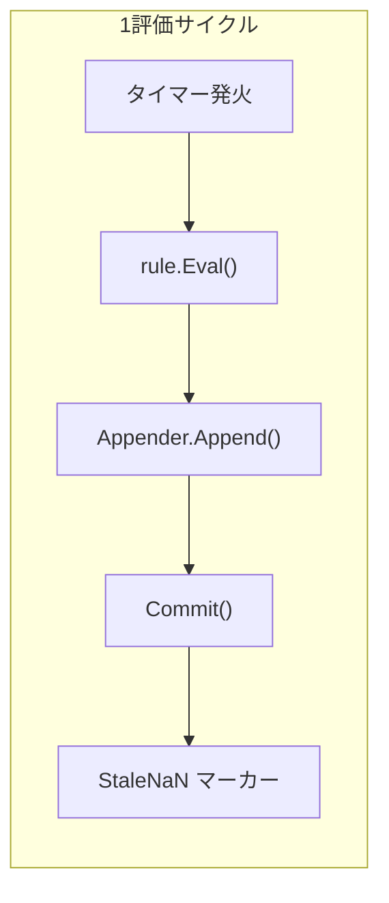

# 第12章 ルール評価

> 本章で読むソース
>
> - [`rules/manager.go`](https://github.com/prometheus/prometheus/blob/v3.12.0/rules/manager.go)
> - [`rules/group.go`](https://github.com/prometheus/prometheus/blob/v3.12.0/rules/group.go)
> - [`rules/recording.go`](https://github.com/prometheus/prometheus/blob/v3.12.0/rules/recording.go)
> - [`rules/alerting.go`](https://github.com/prometheus/prometheus/blob/v3.12.0/rules/alerting.go)

## この章の狙い

Prometheus は設定されたルール（レコーディングルールとアラートルール）を定期的に評価し、その結果を TSDB に書き込む。
本章では、ルールの管理と評価の一連の流れを Manager、Group、Rule の3層構造として読み解く。

## 前提

- 第2部（TSDB）の Appender インターフェースを理解していること
- 第3部（PromQL）のクエリ実行の流れを理解していること

## 3層構造の全体像

ルール評価は Manager → Group → Rule の3層で構成される。

**Manager**（[`rules/manager.go`](https://github.com/prometheus/prometheus/blob/v3.12.0/rules/manager.go)）はルールグループの集合を管理するトップレベルの構造体である。
Manager は起動時に `Run()`（L208）を呼び出し、`Update()`（L245）で設定ファイルの変更を反映する。

**Group**（[`rules/group.go`](https://github.com/prometheus/prometheus/blob/v3.12.0/rules/group.go)）は同じ評価間隔を持つルールの集合である。
Group は自身の `run()` メソッド（L208）でタイマー駆動のループを実行し、一定間隔ごとにグループ内の全ルールを評価する。

**Rule** は `Rule` インターフェースを実装する個々のルールである。
レコーディングルール（`RecordingRule`）とアラートルール（`AlertingRule`）の2種類が存在する。




デフォルトは逐次評価である。
並行評価は `concurrent-rule-eval` feature が有効な場合に `SplitGroupIntoBatches` によって行われる。

## Manager：ルールグループの管理

Manager 構造体は [`rules/manager.go` `L97-L107`](https://github.com/prometheus/prometheus/blob/v3.12.0/rules/manager.go#L97-L107) で定義される。

```go
type Manager struct {
	opts                 *ManagerOptions
	groups               map[string]*Group
	mtx                  sync.RWMutex
	block                chan struct{}
	done                 chan struct{}
	restored             bool
	restoreNewRuleGroups bool

	logger *slog.Logger
}
```

`block` はゼロ値のチャネルであり、`Run()` が呼ばれるまで閉じられない。
これにより、`Update()` で生成されたグループはストレージが起動し切る前にクエリを発行しない。

Manager の `Run()` は [`rules/manager.go` `L208-L212`](https://github.com/prometheus/prometheus/blob/v3.12.0/rules/manager.go#L208-L212) で定義される。

```go
func (m *Manager) Run() {
	m.logger.Info("Starting rule manager...")
	m.start()
	<-m.done
}
```

`start()` は `block` チャネルを閉じるだけの処理である。
つまり `Run()` の実体は、待機していた各 Group の評価ループを一斉に解放することにある。

`Update()` は設定再読み込み時に呼ばれ、新旧グループの diff を取りながらグループの追加、削除、置き換えを行う。
新旧のグループ判定と状態引き継ぎの中心部分は [`rules/manager.go` `L266-L294`](https://github.com/prometheus/prometheus/blob/v3.12.0/rules/manager.go#L266-L294) にある。

```go
	var wg sync.WaitGroup
	for _, newg := range groups {
		// If there is an old group with the same identifier,
		// check if new group equals with the old group, if yes then skip it.
		// If not equals, stop it and wait for it to finish the current iteration.
		// Then copy it into the new group.
		gn := GroupKey(newg.file, newg.name)
		oldg, ok := m.groups[gn]
		delete(m.groups, gn)

		if ok && oldg.Equals(newg) {
			groups[gn] = oldg
			continue
		}

		wg.Add(1)
		go func(newg *Group) {
			if ok {
				oldg.stop()
				newg.CopyState(oldg)
			}
			wg.Done()
			// Wait with starting evaluation until the rule manager
			// is told to run. This is necessary to avoid running
			// queries against a bootstrapping storage.
			<-m.block
			newg.run(m.opts.Context)
		}(newg)
	}
```

新旧グループが内容まで一致する場合（`oldg.Equals(newg)`）は、稼働中の Group をそのまま流用する。
一致しない場合は、古い Group を停止してから `CopyState()` で評価済みの系列情報を新しい Group に引き継ぎ、あらためて `run()` を起動する。
この引き継ぎにより、ルールファイルの再読み込みのたびに評価履歴が失われることを防いでいる。

`LoadGroups()`（L345）はルールファイルをパースし、`AlertingRule` と `RecordingRule` のインスタンスを生成する。
各ルールは `Rule` インターフェースとして統一的に扱われる。

## Group：スケジュール駆動の評価

Group 構造体は [`rules/group.go` `L45-L77`](https://github.com/prometheus/prometheus/blob/v3.12.0/rules/group.go#L45-L77) で定義される。

```go
type Group struct {
	name                  string
	file                  string
	interval              time.Duration
	queryOffset           *time.Duration
	limit                 int
	rules                 []Rule
	seriesInPreviousEval  []map[string]labels.Labels // One per Rule.
	staleSeries           []labels.Labels
	opts                  *ManagerOptions
	// ...
	evalIterationFunc GroupEvalIterationFunc
	// ...
}
```

Group の `run()` メソッドは、起動時に `EvalTimestamp()` で計算した最初の評価時刻まで待機し、その後 `time.NewTicker(g.interval)` で定期的に評価を実行する。
シャットダウン時の対応や `for` 状態の復元処理を挟んだあとの本体ループは [`rules/group.go` `L277-L296`](https://github.com/prometheus/prometheus/blob/v3.12.0/rules/group.go#L277-L296) にある。

```go
	for {
		select {
		case <-g.done:
			return
		default:
			select {
			case <-g.done:
				return
			case <-tick.C:
				missed := (time.Since(evalTimestamp) / g.interval) - 1
				if missed > 0 {
					g.metrics.IterationsMissed.WithLabelValues(GroupKey(g.file, g.name)).Add(float64(missed))
					g.metrics.IterationsScheduled.WithLabelValues(GroupKey(g.file, g.name)).Add(float64(missed))
				}
				evalTimestamp = evalTimestamp.Add((missed + 1) * g.interval)

				g.evalIterationFunc(ctx, g, evalTimestamp)
			}
		}
	}
```

外側の `select` はまず `g.done` だけを非ブロッキングで確認し、停止要求が来ていれば `tick.C` を待たずに即座に抜ける。
`missed` は、前回の評価時刻からの経過時間を評価間隔で割った値から1を引いたものであり、正であれば取りこぼした評価回数を表す。
取りこぼしがあった場合は `IterationsMissed` と `IterationsScheduled` の両方を取りこぼし分だけ加算してから、次の評価時刻を計算し直す。

評価開始時刻は `EvalTimestamp()`（[`rules/group.go` `L422-L445`](https://github.com/prometheus/prometheus/blob/v3.12.0/rules/group.go#L422-L445)）によってグループごとにハッシュベースで分散される。

```go
func (g *Group) EvalTimestamp(startTime int64) time.Time {
	var (
		offset = int64(g.hash() % uint64(g.interval))

		// This group's evaluation times differ from the perfect time intervals by `offset` nanoseconds.
		// But we can only use `% interval` to align with the interval. And `% interval` will always
		// align with the perfect time intervals, instead of this group's. Because of this we add
		// `offset` _after_ aligning with the perfect time interval.
		//
		// There can be cases where adding `offset` to the perfect evaluation time can yield a
		// timestamp in the future, which is not what EvalTimestamp should do.
		// So we subtract one `offset` to make sure that `now - (now % interval) + offset` gives an
		// evaluation time in the past.
		adjNow = startTime - offset

		// Adjust to perfect evaluation intervals.
		base = adjNow - (adjNow % int64(g.interval))

		// Add one offset to randomize the evaluation times of this group.
		next = base + offset
	)

	return time.Unix(0, next).UTC()
}
```

`g.hash()` はグループ名とファイル名から計算される値であり、評価間隔で割った余りを `offset` として使う。
これにより、複数のグループが同じ評価間隔を持っていても、実際の評価タイミングはグループごとにずれる。

## Rule インターフェースと2種類の実装

`Rule` インターフェースは `Eval()`、`String()`、`Health()` などのメソッドを規定する。
2つの具象型がこのインターフェースを実装する。

### RecordingRule

RecordingRule は [`rules/recording.go` `L38-L54`](https://github.com/prometheus/prometheus/blob/v3.12.0/rules/recording.go#L38-L54) で定義される。

```go
type RecordingRule struct {
	name   string
	vector parser.Expr
	labels labels.Labels
	health *atomic.String
	evaluationTimestamp *atomic.Time
	lastError *atomic.Error
	evaluationDuration *atomic.Duration
	// ...
}
```

`Eval()` メソッド（[`rules/recording.go` `L85-L122`](https://github.com/prometheus/prometheus/blob/v3.12.0/rules/recording.go#L85-L122)）は以下の処理を行う。

```go
func (rule *RecordingRule) Eval(ctx context.Context, queryOffset time.Duration, ts time.Time, query QueryFunc, _ *url.URL, limit int) (promql.Vector, error) {
	ctx = NewOriginContext(ctx, NewRuleDetail(rule))
	vector, err := query(ctx, rule.vector.String(), ts.Add(-queryOffset))
	if err != nil {
		return nil, err
	}

	lb := labels.NewBuilder(labels.EmptyLabels())
	for i := range vector {
		sample := &vector[i]
		lb.Reset(sample.Metric)
		lb.Set(labels.MetricName, rule.name)
		rule.labels.Range(func(l labels.Label) {
			lb.Set(l.Name, l.Value)
		})
		sample.Metric = lb.Labels()
	}

	if vector.ContainsSameLabelset() {
		return nil, ErrDuplicateRecordingLabelSet
	}

	numSeries := len(vector)
	if limit > 0 && numSeries > limit {
		return nil, fmt.Errorf("exceeded limit of %d with %d series", limit, numSeries)
	}

	rule.SetHealth(HealthGood)
	rule.SetLastError(err)
	return vector, nil
}
```

クエリ結果の各サンプルに対し、メトリクス名をルール名で上書きし、追加ラベルを付与する。
同一ラベルセットの重複や、出力系列数の上限をチェックする。

### AlertingRule

AlertingRule は [`rules/alerting.go` `L116-L157`](https://github.com/prometheus/prometheus/blob/v3.12.0/rules/alerting.go#L116-L157) で定義される。

```go
type AlertingRule struct {
	// The name of the alert.
	name string
	// The vector expression from which to generate alerts.
	vector parser.Expr
	// The duration for which a labelset needs to persist in the expression
	// output vector before an alert transitions from Pending to Firing state.
	holdDuration time.Duration
	// The amount of time that the alert should remain firing after the
	// resolution.
	keepFiringFor time.Duration
	// Extra labels to attach to the resulting alert sample vectors.
	labels labels.Labels
	// Non-identifying key/value pairs.
	annotations labels.Labels
	// External labels from the global config.
	externalLabels map[string]string
	// The external URL from the --web.external-url flag.
	externalURL string
	// true if old state has been restored. We start persisting samples for ALERT_FOR_STATE
	// only after the restoration.
	restored *atomic.Bool
	// ... (中略) ...
	// A map of alerts which are currently active (Pending or Firing), keyed by
	// the fingerprint of the labelset they correspond to.
	active map[uint64]*Alert
	// ... (中略) ...
}
```

アラートルールの `Eval()`（L387-L551）は、Pending → Firing → Resolved の状態遷移を管理する。
アラートの状態は4つ定義される（[`rules/alerting.go` `L56-L67`](https://github.com/prometheus/prometheus/blob/v3.12.0/rules/alerting.go#L56-L67)）。

```go
const (
	StateUnknown  AlertState = iota
	StateInactive
	StatePending
	StateFiring
)
```

### アラート状態遷移の処理フロー

`Eval()` は PromQL クエリの結果ベクトルから Pending 状態の候補を作り、既存の `active` マップと突き合わせて状態を更新する。
条件から外れたアラートに対する分岐は [`rules/alerting.go` `L482-L519`](https://github.com/prometheus/prometheus/blob/v3.12.0/rules/alerting.go#L482-L519) にある。

```go
	for fp, a := range r.active {
		if _, ok := resultFPs[fp]; !ok {
			// There is no firing alerts for this fingerprint. The alert is no
			// longer firing.

			// Use keepFiringFor value to determine if the alert should keep
			// firing.
			var keepFiring bool
			if a.State == StateFiring && r.keepFiringFor > 0 {
				if a.KeepFiringSince.IsZero() {
					a.KeepFiringSince = ts
				}
				if ts.Sub(a.KeepFiringSince) < r.keepFiringFor {
					keepFiring = true
				}
			}

			// If the alert is resolved (was firing but is now inactive) keep it for
			// at least the retention period. This is important for a number of reasons:
			//
			// 1. It allows for Prometheus to be more resilient to network issues that
			//    would otherwise prevent a resolved alert from being reported as resolved
			//    to Alertmanager.
			//
			// 2. It helps reduce the chance of resolved notifications being lost if
			//    Alertmanager crashes or restarts between receiving the resolved alert
			//    from Prometheus and sending the resolved notification. This tends to
			//    occur for routes with large Group intervals.
			if a.State == StatePending || (!a.ResolvedAt.IsZero() && ts.Sub(a.ResolvedAt) > resolvedRetention) {
				delete(r.active, fp)
			}
			if a.State != StateInactive && !keepFiring {
				a.State = StateInactive
				a.ResolvedAt = ts
			}
			if !keepFiring {
				continue
			}
		} else {
			// The alert is firing, reset keepFiringSince.
			a.KeepFiringSince = time.Time{}
		}
```

クエリ結果に含まれなかったフィンガープリントは、まず `keepFiringFor` の猶予があるかどうかを確認する。
猶予もなく Pending だったアラート、または解決から `resolvedRetention`（15分）を過ぎたアラートは `active` マップから削除される。
それ以外は状態を Inactive に落とし `ResolvedAt` を記録するだけで、マップには残す。
解決直後のアラートを一定時間 `active` に残すのは、Alertmanager への解決通知が途中で失われても次回以降の評価で再送できるようにするためである。

Pending から Firing への遷移、および `holdDuration` が設定変更で伸びた場合の巻き戻しは [`rules/alerting.go` `L526-L537`](https://github.com/prometheus/prometheus/blob/v3.12.0/rules/alerting.go#L526-L537) で行われる。

```go
	if a.State == StatePending && ts.Sub(a.ActiveAt) >= r.holdDuration {
		a.State = StateFiring
		a.FiredAt = ts
	}

	// If the alert is firing and the active time is less than the new hold duration, set the state to pending.
	if a.State == StateFiring && ts.Sub(a.ActiveAt) < r.holdDuration {
		a.State = StatePending
		a.FiredAt = time.Time{}
		a.LastSentAt = time.Time{}
		a.KeepFiringSince = time.Time{}
	}
```

条件の持続時間が `holdDuration` 以上になった時点で Pending から Firing に遷移する。
逆に、設定の再読み込みで `holdDuration` が伸びた結果、経過時間がそれを下回ってしまった場合は Firing から Pending に巻き戻す。
この巻き戻しがあるため、ルール設定の変更が既存の Firing アラートを不整合な状態のまま残さない。

## グループ評価の実行

`Group.Eval()`（L504-L691）は、各ルールを評価してクエリを実行し、結果を TSDB に書き込む入口関数である。
ルールごとの評価クロージャの中心部分は [`rules/group.go` `L533-L554`](https://github.com/prometheus/prometheus/blob/v3.12.0/rules/group.go#L533-L554) にある。

```go
		vector, err := rule.Eval(ctx, ruleQueryOffset, ts, g.opts.QueryFunc, g.opts.ExternalURL, g.Limit())
		if err != nil {
			rule.SetHealth(HealthBad)
			rule.SetLastError(err)
			sp.SetStatus(codes.Error, err.Error())
			g.metrics.EvalFailures.WithLabelValues(GroupKey(g.File(), g.Name())).Inc()

			// Canceled queries are intentional termination of queries. This normally
			// happens on shutdown and thus we skip logging of any errors here.
			var eqc promql.ErrQueryCanceled
			if !errors.As(err, &eqc) {
				logger.Warn("Evaluating rule failed", "rule", rule, "err", err)
			}
			return
		}
		rule.SetHealth(HealthGood)
		rule.SetLastError(nil)
		samplesTotal.Add(float64(len(vector)))

		if ar, ok := rule.(*AlertingRule); ok {
			ar.sendAlerts(ctx, ts, g.opts.ResendDelay, g.interval, g.opts.NotifyFunc)
		}
```

クエリ失敗時は `HealthBad` を設定してトレーシングにエラーを記録し、キャンセルエラー以外だけログに残して打ち切る。
成功時は `HealthGood` に戻し、対象ルールが `AlertingRule` であれば `sendAlerts()` を呼んで通知処理へ引き渡す。
`sendAlerts()` の呼び出しは、TSDB への書き込みより前に行われる点に注意が要る。
つまりアラート通知は、サンプルの Appender 書き込みが成功したかどうかに関わらず実行される。

サンプルの書き込み時に発生する順序エラーの分類は [`rules/group.go` `L592-L604`](https://github.com/prometheus/prometheus/blob/v3.12.0/rules/group.go#L592-L604) で行われる。

```go
				switch {
				case errors.Is(unwrappedErr, storage.ErrOutOfOrderSample):
					numOutOfOrder++
					logger.Debug("Rule evaluation result discarded", "err", err, "sample", s)
				case errors.Is(unwrappedErr, storage.ErrTooOldSample):
					numTooOld++
					logger.Debug("Rule evaluation result discarded", "err", err, "sample", s)
				case errors.Is(unwrappedErr, storage.ErrDuplicateSampleForTimestamp):
					numDuplicates++
					logger.Debug("Rule evaluation result discarded", "err", err, "sample", s)
				default:
					logger.Warn("Rule evaluation result discarded", "err", err, "sample", s)
				}
```

順序違反や重複タイムスタンプは想定内の事象として `Debug` レベルでログに残すだけにとどめ、それ以外の書き込みエラーだけを `Warn` で警告する。
これは、複数のルールが同じ系列を生成しうる状況（依存関係を持つルール同士が同じ評価サイクルで重なって書き込む場合など）を、異常として扱わないための切り分けである。

並行評価が有効な場合のバッチ分割と実行制御は [`rules/group.go` `L648-L687`](https://github.com/prometheus/prometheus/blob/v3.12.0/rules/group.go#L648-L687) で行われる。

```go
	batches := ctrl.SplitGroupIntoBatches(ctx, g)
	if len(batches) == 0 {
		// Sequential evaluation when batches aren't set.
		// This is the behaviour without a defined RuleConcurrencyController
		for i, rule := range g.rules {
			// Check if the group has been stopped.
			select {
			case <-g.done:
				return
			default:
			}
			eval(i, rule, nil)
		}
	} else {
		// Concurrent evaluation.
		for _, batch := range batches {
			for _, ruleIndex := range batch {
				// Check if the group has been stopped.
				select {
				case <-g.done:
					wg.Wait()
					return
				default:
				}
				rule := g.rules[ruleIndex]
				if len(batch) > 1 && ctrl.Allow(ctx, g, rule) {
					wg.Add(1)

					go eval(ruleIndex, rule, func() {
						wg.Done()
						ctrl.Done(ctx)
					})
				} else {
					eval(ruleIndex, rule, nil)
				}
			}
			// It is important that we finish processing any rules in this current batch - before we move into the next one.
			wg.Wait()
		}
	}
```

`batches` が空であれば従来どおりの逐次評価にフォールバックする。
バッチが存在する場合は、バッチ内のルール数が2つ以上かつ `ctrl.Allow()` が並行実行枠を確保できたルールだけをゴルーチンで評価し、それ以外は同じバッチ内でも逐次評価する。
バッチをまたぐ `wg.Wait()` は必須であり、これによって次のバッチが前のバッチの結果に依存しても安全に評価できる。

## 高速化・最適化の工夫

ルール評価の負荷分散には2つの機構がある。

第一に、Group の `EvalTimestamp()` はグループ名とファイル名のハッシュ値を評価間隔で割った余りをオフセットとして使う。
これにより、多数のグループの評価タイミングが分散され、TSDB への書き込みが集中するのを防ぐ。

第二に、`RuleConcurrencyController` はルール間の依存関係を静的に解析し、独立したルールだけを並行実行の対象に絞る。
3種類のバッチへの分類は [`rules/manager.go` `L554-L588`](https://github.com/prometheus/prometheus/blob/v3.12.0/rules/manager.go#L554-L588) で行われる。

```go
func (*concurrentRuleEvalController) SplitGroupIntoBatches(_ context.Context, g *Group) []ConcurrentRules {
	// Using the rule dependency controller information (rules being identified as having no dependencies or no dependants),
	// we can safely run the following concurrent groups:
	// 1. Concurrently, all rules that have no dependencies
	// 2. Sequentially, all rules that have both dependencies and dependants
	// 3. Concurrently, all rules that have no dependants

	var noDependencies []int
	var dependenciesAndDependants []int
	var noDependants []int

	for i, r := range g.rules {
		switch {
		case r.NoDependencyRules():
			noDependencies = append(noDependencies, i)
		case !r.NoDependentRules() && !r.NoDependencyRules():
			dependenciesAndDependants = append(dependenciesAndDependants, i)
		case r.NoDependentRules():
			noDependants = append(noDependants, i)
		}
	}

	var order []ConcurrentRules
	if len(noDependencies) > 0 {
		order = append(order, noDependencies)
	}
	for _, r := range dependenciesAndDependants {
		order = append(order, []int{r})
	}
	if len(noDependants) > 0 {
		order = append(order, noDependants)
	}

	return order
}
```

依存を持たないルール群と、被依存を持たないルール群はそれぞれまとめて並行実行できる。
依存と被依存の両方を持つルールは1件ずつ独立したバッチとして逐次実行され、前段の結果が後段に伝わってから評価される。
依存関係の判定は `buildDependencyMap()`（`group.go` L1123-L1211）が担い、ワイルドカードセレクタのように依存を静的に決定できないクエリが1つでも含まれると、グループ全体を逐次評価に倒す。
これは、並行実行による速度向上よりも評価結果の正しさを優先する設計判断である。

## まとめ

Prometheus のルール評価は Manager → Group → Rule の3層構造で実装される。
Manager は設定変更に応じてグループを追加、削除し、Group はタイマー駆動で定期的に評価を実行し、Rule はクエリ実行と結果の加工を行う。
アラートルールは Pending、Firing、Inactive の間を遷移しながら `active` マップで状態を保持し、評価タイミングの分散と依存関係に基づく並行実行によってスケーラビリティが確保されている。

## 関連する章

- 第6章 WAL：ルール評価結果の書き込み先
- 第10章 PromQL エンジン：ルール内で使われるクエリ実行
- 第13章 アラート通知：AlertingRule から Alertmanager への通知
