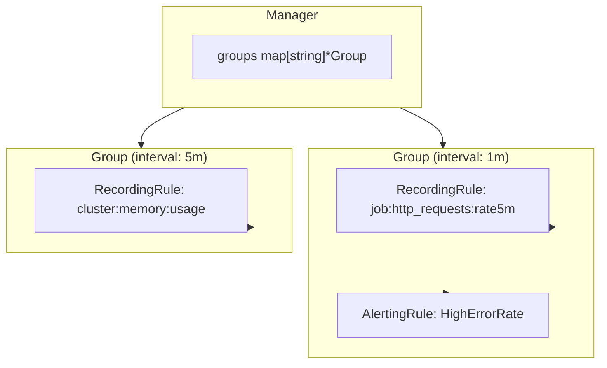
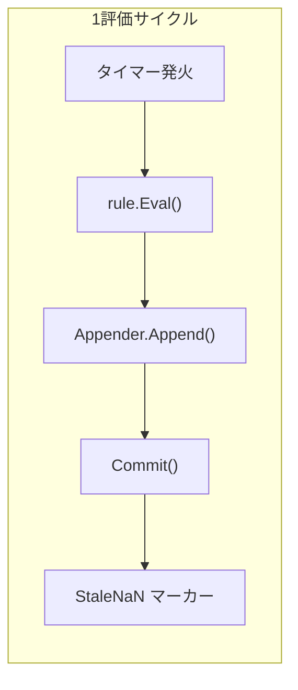

# 第12章 ルール評価

> 本章で読むソース
>
> - [`rules/manager.go`](https://github.com/prometheus/prometheus/blob/v3.12.0/rules/manager.go)
> - [`rules/group.go`](https://github.com/prometheus/prometheus/blob/v3.12.0/rules/group.go)
> - [`rules/recording.go`](https://github.com/prometheus/prometheus/blob/v3.12.0/rules/recording.go)
> - [`rules/alerting.go`](https://github.com/prometheus/prometheus/blob/v3.12.0/rules/alerting.go)

## この章の狙い

Prometheus は設定されたルール（レコーディングルールとアラートルール）を定期的に評価し、その結果を TSDB に書き込む。
本章では、ルールの管理と評価の一連の流れを Manager、Group、Rule の3層構造として読み解く。

## 前提

- 第2部（TSDB）の Appender インターフェースを理解していること
- 第3部（PromQL）のクエリ実行の流れを理解していること

## 3層構造の全体像

ルール評価は Manager → Group → Rule の3層で構成される。

**Manager**（[`rules/manager.go`](https://github.com/prometheus/prometheus/blob/v3.12.0/rules/manager.go)）はルールグループの集合を管理するトップレベルの構造体である。
Manager は起動時に `Run()`（L208）を呼び出し、`Update()`（L245）で設定ファイルの変更を反映する。

**Group**（[`rules/group.go`](https://github.com/prometheus/prometheus/blob/v3.12.0/rules/group.go)）は同じ評価間隔を持つルールの集合である。
Group は自身の `run()` メソッド（L208）でタイマー駆動のループを実行し、一定間隔ごとにグループ内の全ルールを評価する。

**Rule** は `Rule` インターフェースを実装する個々のルールである。
レコーディングルール（`RecordingRule`）とアラートルール（`AlertingRule`）の2種類が存在する。





デフォルトは逐次評価である。
並行評価は `concurrent-rule-eval` feature が有効な場合に `SplitGroupIntoBatches` によって行われる。

## Manager：ルールグループの管理

Manager 構造体は [`rules/manager.go` `L97-L107`](https://github.com/prometheus/prometheus/blob/v3.12.0/rules/manager.go#L97-L107) で定義される。

```go
type Manager struct {
	opts                 *ManagerOptions
	groups               map[string]*Group
	mtx                  sync.RWMutex
	block                chan struct{}
	done                 chan struct{}
	restored             bool
	restoreNewRuleGroups bool

	logger *slog.Logger
}
```

Manager はグループ名とファイル名の複合キー（`GroupKey(file, name)`）でグループを管理する。
`Update()`（L245）は設定再読み込み時に呼ばれ、新旧グループの diff を取りながらグループの追加・削除・置き換えを行う。

`LoadGroups()`（L345）はルールファイルをパースし、`AlertingRule` と `RecordingRule` のインスタンスを生成する。
各ルールは `Rule` インターフェースとして統一的に扱われる。

## Group：スケジュール駆動の評価

Group 構造体は [`rules/group.go` `L45-L77`](https://github.com/prometheus/prometheus/blob/v3.12.0/rules/group.go#L45-L77) で定義される。

```go
type Group struct {
	name                  string
	file                  string
	interval              time.Duration
	queryOffset           *time.Duration
	limit                 int
	rules                 []Rule
	seriesInPreviousEval  []map[string]labels.Labels // One per Rule.
	staleSeries           []labels.Labels
	opts                  *ManagerOptions
	// ...
	evalIterationFunc GroupEvalIterationFunc
	// ...
}
```

Group の `run()` メソッド（L208）は、起動時に `EvalTimestamp()`（L422）で計算した最初の評価時刻まで待機し、その後 `time.NewTicker(g.interval)` で定期的に評価を実行する。

```go
func (g *Group) run(ctx context.Context) {
	defer close(g.terminated)

	evalTimestamp := g.EvalTimestamp(time.Now().UnixNano()).Add(g.interval)
	select {
	case <-time.After(time.Until(evalTimestamp)):
	case <-g.done:
		return
	}

	tick := time.NewTicker(g.interval)
	defer tick.Stop()

	// ...restore処理...

	for {
		select {
		case <-g.done:
			return
		default:
			select {
			case <-g.done:
				return
			case <-tick.C:
				missed := (time.Since(evalTimestamp) / g.interval) - 1
				if missed > 0 {
					g.metrics.IterationsMissed.WithLabelValues(...).Add(float64(missed))
				}
				evalTimestamp = evalTimestamp.Add((missed + 1) * g.interval)
				g.evalIterationFunc(ctx, g, evalTimestamp)
			}
		}
	}
}
```

評価開始時刻は `EvalTimestamp()` によってグループごとにハッシュベースで分散される（L422-L445）。
これにより、大量のグループが同時に評価を開始するのを防ぎ、TSDB への書き込み負荷を平滑化する。

## Rule インターフェースと2種類の実装

`Rule` インターフェースは `Eval()`、`String()`、`Health()` などのメソッドを規定する。
2つの具象型がこのインターフェースを実装する。

### RecordingRule

RecordingRule は [`rules/recording.go` `L38-L54`](https://github.com/prometheus/prometheus/blob/v3.12.0/rules/recording.go#L38-L54) で定義される。

```go
type RecordingRule struct {
	name   string
	vector parser.Expr
	labels labels.Labels
	health *atomic.String
	evaluationTimestamp *atomic.Time
	lastError *atomic.Error
	evaluationDuration *atomic.Duration
	// ...
}
```

`Eval()` メソッド（L85-L122）は以下の処理を行う。

```go
func (rule *RecordingRule) Eval(ctx context.Context, queryOffset time.Duration, ts time.Time, query QueryFunc, _ *url.URL, limit int) (promql.Vector, error) {
	ctx = NewOriginContext(ctx, NewRuleDetail(rule))
	vector, err := query(ctx, rule.vector.String(), ts.Add(-queryOffset))
	if err != nil {
		return nil, err
	}

	lb := labels.NewBuilder(labels.EmptyLabels())
	for i := range vector {
		sample := &vector[i]
		lb.Reset(sample.Metric)
		lb.Set(labels.MetricName, rule.name)
		rule.labels.Range(func(l labels.Label) {
			lb.Set(l.Name, l.Value)
		})
		sample.Metric = lb.Labels()
	}

	if vector.ContainsSameLabelset() {
		return nil, ErrDuplicateRecordingLabelSet
	}

	numSeries := len(vector)
	if limit > 0 && numSeries > limit {
		return nil, fmt.Errorf("exceeded limit of %d with %d series", limit, numSeries)
	}

	rule.SetHealth(HealthGood)
	rule.SetLastError(err)
	return vector, nil
}
```

クエリ結果の各サンプルに対し、メトリクス名をルール名で上書きし、追加ラベルを付与する。
同一ラベルセットの重複や、出力系列数の上限をチェックする。

### AlertingRule

AlertingRule は [`rules/alerting.go` `L116-L157`](https://github.com/prometheus/prometheus/blob/v3.12.0/rules/alerting.go#L116-L157) で定義される。

```go
type AlertingRule struct {
	// The name of the alert.
	name string
	// The vector expression from which to generate alerts.
	vector parser.Expr
	// The duration for which a labelset needs to persist in the expression
	// output vector before an alert transitions from Pending to Firing state.
	holdDuration time.Duration
	// The amount of time that the alert should remain firing after the
	// resolution.
	keepFiringFor time.Duration
	// Extra labels to attach to the resulting alert sample vectors.
	labels labels.Labels
	// Non-identifying key/value pairs.
	annotations labels.Labels
	// External labels from the global config.
	externalLabels map[string]string
	// The external URL from the --web.external-url flag.
	externalURL string
	// true if old state has been restored. We start persisting samples for ALERT_FOR_STATE
	// only after the restoration.
	restored *atomic.Bool
	// ... (中略) ...
	// A map of alerts which are currently active (Pending or Firing), keyed by
	// the fingerprint of the labelset they correspond to.
	active map[uint64]*Alert
	// ... (中略) ...
}
```

アラートルールの `Eval()`（L387-L551）は、Pending → Firing → Resolved の状態遷移を管理する。
アラートの状態は4つ定義される（L56-L67）。

```go
const (
	StateUnknown  AlertState = iota
	StateInactive
	StatePending
	StateFiring
)
```

`Eval()` の処理の流れは次の通りである。

1. PromQL クエリを実行し、条件に一致するベクトルを得る。
2. 各ベクトル要素に対し、テンプレート展開を含むラベル・アノテーションを構築し、Pending 状態の Alert を作成する。
3. 既存の active マップと照合し、状態を更新する。
4. 条件が `holdDuration` 以上継続していれば Pending → Firing に遷移する（L526-L529）。
5. 条件から外れたアラートは Inactive に戻し、`ResolvedAt` を記録する（L513-L516）。

```go
if a.State == StatePending && ts.Sub(a.ActiveAt) >= r.holdDuration {
	a.State = StateFiring
	a.FiredAt = ts
}
```

解決済みアラートは最低 `resolvedRetention`（15分）だけ active マップに保持される（L510）。
これは Alertmanager への解決通知が失われるのを防ぐための工夫である。

## グループ評価の実行

`Group.Eval()`（L504-L691）は、バッチ分割と並行実行制御を行う。

```go
batches := ctrl.SplitGroupIntoBatches(ctx, g)
if len(batches) == 0 {
	for i, rule := range g.rules {
		eval(i, rule, nil)
	}
} else {
	for _, batch := range batches {
		for _, ruleIndex := range batch {
			rule := g.rules[ruleIndex]
			if len(batch) > 1 && ctrl.Allow(ctx, g, rule) {
				wg.Add(1)
				go eval(ruleIndex, rule, func() {
					wg.Done()
					ctrl.Done(ctx)
				})
			} else {
				eval(ruleIndex, rule, nil)
			}
		}
		wg.Wait()
	}
}
```

`RuleConcurrencyController` は依存関係分析に基づいてルールを3つのバッチに分割する（`manager.go` L554-L588）。

1. **依存なしルール**：並行実行可能。
2. **中継ルール**（依存あり＆被依存あり）：逐次実行。
3. **被依存なしルール**：並行実行可能。

各ルールの評価後、結果は `Appender.Append()` で TSDB に書き込まれる。
以前の評価で存在したが今回出現しなかった系列には、StaleNaN マーカーが書き込まれる（L620-L639）。

## 高速化・最適化の工夫

ルール評価の負荷分散には2つの機構がある。

第一に、Group の `EvalTimestamp()`（L422-L445）はグループ名とファイル名のハッシュ値を評価間隔で割った余りをオフセットとして使う。
これにより、多数のグループの評価タイミングが分散され、TSDB への書き込みが集中するのを防ぐ。

第二に、`RuleConcurrencyController` はルール間の依存関係を静的に解析する（`buildDependencyMap()`、`group.go` L1125-L1211）。
独立したルールは並行実行され、CPU コアを有効活用する。
依存グラフが不明確なワイルドカードセレクタが含まれる場合は、安全側に倒して全ルールを逐次実行する。

## まとめ

Prometheus のルール評価は Manager → Group → Rule の3層構造で実装される。
Manager は設定変更に応じてグループを追加・削除し、Group はタイマー駆動で定期的に評価を実行し、Rule はクエリ実行と結果の加工を行う。
評価タイミングの分散と依存関係に基づく並行実行により、スケーラビリティが確保されている。

## 関連する章

- 第6章 WAL：ルール評価結果の書き込み先
- 第10章 PromQL エンジン：ルール内で使われるクエリ実行
- 第13章 アラート通知：AlertingRule から Alertmanager への通知
