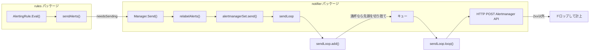

# 第13章 アラート通知

> 本章で読むソース
>
> - [`notifier/manager.go`](https://github.com/prometheus/prometheus/blob/v3.12.0/notifier/manager.go)
> - [`notifier/sendloop.go`](https://github.com/prometheus/prometheus/blob/v3.12.0/notifier/sendloop.go)
> - [`notifier/alert.go`](https://github.com/prometheus/prometheus/blob/v3.12.0/notifier/alert.go)
> - [`notifier/alertmanagerset.go`](https://github.com/prometheus/prometheus/blob/v3.12.0/notifier/alertmanagerset.go)
> - [`rules/alerting.go`](https://github.com/prometheus/prometheus/blob/v3.12.0/rules/alerting.go)

## この章の狙い

AlertingRule が生成したアラートは、Alertmanager へ送信されて初めて通知として機能する。
本章では、notifier パッケージがアラートをキューイングし、バッチにまとめて Alertmanager へ HTTP POST するまでの流れと、再送やドロップの判断を読む。

## 前提

- 第12章の AlertingRule の評価サイクルと状態遷移を理解していること

## アラート通知の全体像

アラート通知は次の流れで動作する。



AlertingRule の評価サイクルごとに `sendAlerts()`（[`rules/alerting.go` `L618-L633`](https://github.com/prometheus/prometheus/blob/v3.12.0/rules/alerting.go#L618-L633)）が呼ばれる。

```go
func (r *AlertingRule) sendAlerts(ctx context.Context, ts time.Time, resendDelay, interval time.Duration, notifyFunc NotifyFunc) {
	alerts := []*Alert{}
	r.ForEachActiveAlert(func(alert *Alert) {
		if alert.needsSending(ts, resendDelay) {
			alert.LastSentAt = ts
			// Allow for two Eval or Alertmanager send failures.
			delta := max(interval, resendDelay)
			alert.ValidUntil = ts.Add(4 * delta)
			anew := *alert
			// The notifier re-uses the labels slice, hence make a copy.
			anew.Labels = alert.Labels.Copy()
			alerts = append(alerts, &anew)
		}
	})
	notifyFunc(ctx, r.vector.String(), alerts...)
}
```

`active` マップ内の全アラートを走査し、`needsSending()` が真を返したものだけを通知対象に選ぶ。
`ValidUntil` には評価間隔と再送間隔の大きい方の4倍を加えた時刻が入り、この猶予の分だけ2回連続の評価失敗や送信失敗を許容する。

送信要否の判定は `needsSending()`（[`rules/alerting.go` `L102-L113`](https://github.com/prometheus/prometheus/blob/v3.12.0/rules/alerting.go#L102-L113)）で行われる。

```go
func (a *Alert) needsSending(ts time.Time, resendDelay time.Duration) bool {
	if a.State == StatePending {
		return false
	}

	// if an alert has been resolved since the last send, resend it
	if a.ResolvedAt.After(a.LastSentAt) {
		return true
	}

	return a.LastSentAt.Add(resendDelay).Before(ts)
}
```

Pending 状態のアラートは通知対象外である。
解決済みのアラートは、解決時刻が前回送信時刻より後であれば即座に再送対象となり、解決の事実が確実に伝わるようにする。
それ以外の Firing 状態のアラートは、前回送信から `resendDelay` が経過していれば再送対象になる。

## Manager：アラートの受付と振り分け

Manager 構造体は [`notifier/manager.go` `L53-L65`](https://github.com/prometheus/prometheus/blob/v3.12.0/notifier/manager.go#L53-L65) で定義される。

```go
type Manager struct {
	opts *Options

	metrics *alertMetrics

	mtx sync.RWMutex

	stopOnce      *sync.Once
	stopRequested chan struct{}

	alertmanagers map[string]*alertmanagerSet
	logger        *slog.Logger
}
```

`Send()`（[`notifier/manager.go` `L254-L273`](https://github.com/prometheus/prometheus/blob/v3.12.0/notifier/manager.go#L254-L273)）はルール側から呼ばれるエントリポイントである。

```go
func (n *Manager) Send(alerts ...*Alert) {
	// If we've been asked to stop, that takes priority over accepting new alerts.
	select {
	case <-n.stopRequested:
		return
	default:
	}

	n.mtx.RLock()
	defer n.mtx.RUnlock()

	alerts = relabelAlerts(n.opts.RelabelConfigs, n.opts.ExternalLabels, alerts)
	if len(alerts) == 0 {
		return
	}

	for _, ams := range n.alertmanagers {
		ams.send(alerts...)
	}
}
```

停止要求が来ていれば新規アラートの受付を止める。
受け取ったアラートに対しリラベリングを適用し、結果が0件になれば以降の処理をスキップする。
その後、設定されたすべての `alertmanagerSet` に対してアラートが送られる。

`Manager.Run()`（[`notifier/manager.go` `L205-L215`](https://github.com/prometheus/prometheus/blob/v3.12.0/notifier/manager.go#L205-L215)）はサービスディスカバリーの更新ループを起動する。

```go
func (n *Manager) Run(tsets <-chan map[string][]*targetgroup.Group) {
	n.targetUpdateLoop(tsets)

	n.mtx.Lock()
	defer n.mtx.Unlock()
	for _, ams := range n.alertmanagers {
		ams.mtx.Lock()
		ams.cleanSendLoops(ams.ams...)
		ams.mtx.Unlock()
	}
}
```

`targetUpdateLoop()` はブロッキング呼び出しであり、`Run()` はそこから戻ってきた時点（つまりシャットダウン時）に全 `alertmanagerSet` の送信ループを後始末する。
`reload()`（[`notifier/manager.go` `L238-L250`](https://github.com/prometheus/prometheus/blob/v3.12.0/notifier/manager.go#L238-L250)）はターゲットグループの更新を受け取る。

```go
func (n *Manager) reload(tgs map[string][]*targetgroup.Group) {
	n.mtx.Lock()
	defer n.mtx.Unlock()

	for id, tgroup := range tgs {
		am, ok := n.alertmanagers[id]
		if !ok {
			n.logger.Error("couldn't sync alert manager set", "err", fmt.Sprintf("invalid id:%v", id))
			continue
		}
		am.sync(tgroup)
	}
}
```

設定に存在しない ID のターゲットグループが来た場合はエラーを記録するだけで処理を続行し、他の Alertmanager 設定への反映を止めない。

`ApplyConfig()` は設定変更時に呼ばれ、古い設定と新しい設定のハッシュを比較する。
変更のない Alertmanager 設定に対しては送信ループを再利用する処理が [`notifier/manager.go` `L163-L178`](https://github.com/prometheus/prometheus/blob/v3.12.0/notifier/manager.go#L163-L178) にある。

```go
		if oldAmSet, ok := configToAlertmanagers[hash]; ok {
			ams.ams = oldAmSet.ams
			ams.droppedAms = oldAmSet.droppedAms
			// Only transfer sendLoops to the first new config with this hash.
			// Subsequent configs with the same hash should not share the sendLoops
			// map reference, as that would cause shared mutable state between
			// alertmanagerSets (cleanup in one would affect the other).
			oldAmSet.mtx.Lock()
			if oldAmSet.sendLoops != nil {
				ams.mtx.Lock()
				ams.sendLoops = oldAmSet.sendLoops
				oldAmSet.sendLoops = nil
				ams.mtx.Unlock()
			}
			oldAmSet.mtx.Unlock()
		}
```

ハッシュが一致する古い `alertmanagerSet` が見つかった場合、その `sendLoops` マップをそのまま新しい `alertmanagerSet` に移し替える。
`oldAmSet.sendLoops = nil` によって元の参照を消しているのは、同じハッシュを持つ複数の新設定に同じ `sendLoops` を二重に渡さないためである。
これにより、設定再読み込みの瞬間にキュー内のアラートが失われることを防いでいる。

## relabelAlerts：アラートのラベル加工

`relabelAlerts()` 関数は [`notifier/alert.go` `L71-L102`](https://github.com/prometheus/prometheus/blob/v3.12.0/notifier/alert.go#L71-L102) で実装される。

```go
func relabelAlerts(relabelConfigs []*relabel.Config, externalLabels labels.Labels, alerts []*Alert) []*Alert {
	lb := labels.NewBuilder(labels.EmptyLabels())
	var relabeledAlerts []*Alert

	for _, a := range alerts {
		lb.Reset(a.Labels)
		externalLabels.Range(func(l labels.Label) {
			if a.Labels.Get(l.Name) == "" {
				lb.Set(l.Name, l.Value)
			}
		})

		keep := relabel.ProcessBuilder(lb, relabelConfigs...)
		if !keep {
			continue
		}

		if !labels.Equal(a.Labels, lb.Labels()) {
			a = &Alert{
				Labels:       lb.Labels(),
				Annotations:  a.Annotations,
				StartsAt:     a.StartsAt,
				EndsAt:       a.EndsAt,
				GeneratorURL: a.GeneratorURL,
			}
		}

		relabeledAlerts = append(relabeledAlerts, a)
	}
	return relabeledAlerts
}
```

外部ラベルはアラートに同名のラベルが存在しない場合のみ追加される。
リラベリング結果が `keep=false` となったアラートは削除される。
ラベルが変更された場合は、イミュータビリティを保つために新しい `Alert` 構造体が作成される。

## alertmanagerSet：Alertmanager ごとの送信ループ管理

`alertmanagerSet` は Alertmanager の設定単位で作成され、サービスディスカバリーによって動的にエンドポイントが管理される。
`send()`（[`notifier/alertmanagerset.go` `L134-L148`](https://github.com/prometheus/prometheus/blob/v3.12.0/notifier/alertmanagerset.go#L134-L148)）は、その設定に紐づくすべての `sendLoop` へアラートを配る。

```go
func (s *alertmanagerSet) send(alerts ...*Alert) {
	s.mtx.Lock()
	defer s.mtx.Unlock()

	if len(s.cfg.AlertRelabelConfigs) > 0 {
		alerts = relabelAlerts(s.cfg.AlertRelabelConfigs, labels.Labels{}, alerts)
		if len(alerts) == 0 {
			return
		}
	}

	for _, sendLoop := range s.sendLoops {
		sendLoop.add(alerts...)
	}
}
```

`alertmanagerSet` ごとに追加のリラベリング設定（`AlertRelabelConfigs`）を適用できる。
`Manager.Send()` のリラベリングとは別に、Alertmanager 設定単位でもう一段のラベル加工を挟める構造になっている。
1つの `alertmanagerSet` の配下には、サービスディスカバリーで見つかったエンドポイントの数だけ `sendLoop` が存在し、同じアラート集合がそれぞれのキューに複製されて渡される。

## sendLoop：キューイングと HTTP 送信

`sendLoop` 構造体は [`notifier/sendloop.go` `L30-L46`](https://github.com/prometheus/prometheus/blob/v3.12.0/notifier/sendloop.go#L30-L46) で定義される。

```go
type sendLoop struct {
	alertmanagerURL string

	cfg    *config.AlertmanagerConfig
	client *http.Client
	opts   *Options

	metrics *alertMetrics

	mtx      sync.RWMutex
	queue    []*Alert
	hasWork  chan struct{}
	stopped  chan struct{}
	stopOnce sync.Once

	logger *slog.Logger
}
```

各 Alertmanager エンドポイントに対して1つの `sendLoop` が存在する。

`add()`（[`notifier/sendloop.go` `L75-L113`](https://github.com/prometheus/prometheus/blob/v3.12.0/notifier/sendloop.go#L75-L113)）はキューへの追加を行う。

```go
func (s *sendLoop) add(alerts ...*Alert) {
	select {
	case <-s.stopped:
		return
	default:
	}

	s.mtx.Lock()
	defer s.mtx.Unlock()

	var dropped int
	// Queue capacity should be significantly larger than a single alert
	// batch could be.
	if d := len(alerts) - s.opts.QueueCapacity; d > 0 {
		s.logger.Warn("Alert batch larger than queue capacity, dropping alerts", "count", d)
		dropped += d
		alerts = alerts[d:]
	}

	// If the queue is full, remove the oldest alerts in favor
	// of newer ones.
	if d := (len(s.queue) + len(alerts)) - s.opts.QueueCapacity; d > 0 {
		s.logger.Warn("Alert notification queue full, dropping alerts", "count", d)
		dropped += d
		s.queue = s.queue[d:]
	}

	s.queue = append(s.queue, alerts...)

	// Notify sending goroutine that there are alerts to be processed.
	// If we cannot send on the channel, it means the signal already exists
	// and has not been consumed yet.
	s.notifyWork()

	s.metrics.queueLength.WithLabelValues(s.alertmanagerURL).Set(float64(len(s.queue)))
	if dropped > 0 {
		s.metrics.dropped.WithLabelValues(s.alertmanagerURL).Add(float64(dropped))
	}
}
```

停止済みの `sendLoop` には新規アラートを追加しない。
1回のバッチ自体がキュー容量を超える場合は、そのバッチの先頭から溢れた分を切り捨てる。
それでもキューが容量を超えるなら、既存のキューの先頭（＝古いアラート）から溢れた分を切り捨てる。
どちらの切り捨ても `dropped` カウンタに積算され、あとでまとめてメトリクスに反映される。

送信ゴルーチンへの通知は `notifyWork()`（[`notifier/sendloop.go` `L115-L122`](https://github.com/prometheus/prometheus/blob/v3.12.0/notifier/sendloop.go#L115-L122)）で行われる。

```go
func (s *sendLoop) notifyWork() {
	select {
	case <-s.stopped:
		return
	case s.hasWork <- struct{}{}:
	default:
	}
}
```

`hasWork` はバッファサイズ1のチャネルである。
`default` 節があるため、すでに送信予約が入っている場合は送信できずに即座に抜け、二重に通知が積み上がることはない。

`loop()`（[`notifier/sendloop.go` `L186-L207`](https://github.com/prometheus/prometheus/blob/v3.12.0/notifier/sendloop.go#L186-L207)）はキューを監視し、アラートが到着するたびに `sendOneBatch()` を呼び出す。

```go
func (s *sendLoop) loop() {
	s.logger.Debug("Starting send loop")
	for {
		// If we've been asked to stop, that takes priority over sending any further notifications.
		select {
		case <-s.stopped:
			return
		default:
			select {
			case <-s.stopped:
				return
			case <-s.hasWork:
				s.sendOneBatch()

				// If the queue still has items left, kick off the next iteration.
				if s.queueLen() > 0 {
					s.notifyWork()
				}
			}
		}
	}
}
```

`sendOneBatch()` のあとにキューがまだ残っていれば、`notifyWork()` を自分で呼び直して次の送信を予約する。
これにより、キューに大量のアラートが溜まっていても `hasWork` の1回の通知だけで全件が処理されるまでループし続ける。

`nextBatch()`（[`notifier/sendloop.go` `L159-L174`](https://github.com/prometheus/prometheus/blob/v3.12.0/notifier/sendloop.go#L159-L174)）はキューから最大 `MaxBatchSize`（デフォルト `DefaultMaxBatchSize` = 256）のアラートを取り出す。

```go
func (s *sendLoop) nextBatch() []*Alert {
	s.mtx.Lock()
	defer s.mtx.Unlock()

	var alerts []*Alert
	if maxBatchSize := s.opts.MaxBatchSize; len(s.queue) > maxBatchSize {
		alerts = append(make([]*Alert, 0, maxBatchSize), s.queue[:maxBatchSize]...)
		s.queue = s.queue[maxBatchSize:]
	} else {
		alerts = append(make([]*Alert, 0, len(s.queue)), s.queue...)
		s.queue = s.queue[:0]
	}
	s.metrics.queueLength.WithLabelValues(s.alertmanagerURL).Set(float64(len(s.queue)))

	return alerts
}
```

キューがバッチサイズを超えていれば先頭からバッチサイズ分だけを切り出し、残りはキューに留める。
超えていなければキュー全体を1バッチとして取り出す。

`sendAll()`（[`notifier/sendloop.go` `L209-L249`](https://github.com/prometheus/prometheus/blob/v3.12.0/notifier/sendloop.go#L209-L249)）は実際の HTTP 送信を行う。

```go
func (s *sendLoop) sendAll(alerts []*Alert) bool {
	if len(alerts) == 0 {
		return true
	}

	begin := time.Now()

	var payload []byte
	var err error
	switch s.cfg.APIVersion {
	case config.AlertmanagerAPIVersionV2:
		openAPIAlerts := alertsToOpenAPIAlerts(alerts)
		payload, err = json.Marshal(openAPIAlerts)
		if err != nil {
			s.logger.Error("Encoding alerts for Alertmanager API v2 failed", "err", err)
			return false
		}

	default:
		s.logger.Error(
			fmt.Sprintf("Invalid Alertmanager API version '%v', expected one of '%v'", s.cfg.APIVersion, config.SupportedAlertmanagerAPIVersions),
			"err", err,
		)
		return false
	}

	ctx, cancel := context.WithTimeout(context.Background(), time.Duration(s.cfg.Timeout))
	defer cancel()

	if err := s.sendOne(ctx, s.client, s.alertmanagerURL, payload); err != nil {
		s.logger.Error("Error sending alerts", "count", len(alerts), "err", err)
		s.metrics.errors.WithLabelValues(s.alertmanagerURL).Add(float64(len(alerts)))
		return false
	}
	durationSeconds := time.Since(begin).Seconds()
	s.metrics.latencySummary.WithLabelValues(s.alertmanagerURL).Observe(durationSeconds)
	s.metrics.latencyHistogram.WithLabelValues(s.alertmanagerURL).Observe(durationSeconds)
	s.metrics.sent.WithLabelValues(s.alertmanagerURL).Add(float64(len(alerts)))

	return true
}
```

対応する API バージョンは v2 のみであり、それ以外の設定値は送信前にエラーとして弾かれる。
JSON エンコードに失敗した場合と HTTP 送信に失敗した場合はいずれも `false` を返し、成功時だけ送信件数とレイテンシをメトリクスに記録する。

`sendOne()`（[`notifier/sendloop.go` `L251-L273`](https://github.com/prometheus/prometheus/blob/v3.12.0/notifier/sendloop.go#L251-L273)）は HTTP POST リクエストを送信する。

```go
func (s *sendLoop) sendOne(ctx context.Context, c *http.Client, url string, b []byte) error {
	req, err := http.NewRequest(http.MethodPost, url, bytes.NewReader(b))
	if err != nil {
		return err
	}
	req.Header.Set("User-Agent", userAgent)
	req.Header.Set("Content-Type", contentTypeJSON)
	resp, err := s.opts.Do(ctx, c, req)
	if err != nil {
		return err
	}
	defer func() {
		io.Copy(io.Discard, resp.Body)
		resp.Body.Close()
	}()

	// Any HTTP status 2xx is OK.
	if resp.StatusCode/100 != 2 {
		return fmt.Errorf("bad response status %s", resp.Status)
	}

	return nil
}
```

レスポンスボディは成否にかかわらず最後まで読み切ってからクローズする。
これは、コネクションを再利用可能な状態でプールに返すための後始末である。
2xx 以外のステータスはエラーとして扱われ、`sendAll()` に戻ったあとメトリクスに計上されるだけで、アラート自体が再送用にキューへ戻されることはない。
つまり1回の送信失敗は、次の評価サイクルで `needsSending()` が再び真を返すまで補われない。

## サービスディスカバリーと Alertmanager 検出

`Manager` は `Run()` 内で `targetUpdateLoop()` を起動し、サービスディスカバリーの更新チャネル `tsets` を監視する。
`reload()` はターゲットグループの更新を受け取り、対応する `alertmanagerSet` の `sync()` を呼び出す。
`sync()` は新しい Alertmanager エンドポイントのリストを反映し、URL が重複するエンドポイントを除いたうえで新規追加分に送信ループを起動し、リストから消えたエンドポイントの `sendLoop` を停止する。

## Alert 構造体

通知で使われる `Alert` 構造体は [`notifier/alert.go` `L25-L37`](https://github.com/prometheus/prometheus/blob/v3.12.0/notifier/alert.go#L25-L37) で定義される。

```go
type Alert struct {
	// Label value pairs for purpose of aggregation, matching, and disposition
	// dispatching. This must minimally include an "alertname" label.
	Labels labels.Labels `json:"labels"`

	// Extra key/value information which does not define alert identity.
	Annotations labels.Labels `json:"annotations"`

	// The known time range for this alert. Both ends are optional.
	StartsAt     time.Time `json:"startsAt,omitempty"`
	EndsAt       time.Time `json:"endsAt,omitempty"`
	GeneratorURL string    `json:"generatorURL,omitempty"`
}
```

この構造体は `rules.Alert` から変換される。
変換は `SendAlerts()`（`rules/manager.go` L470-L493）で行われ、`FiredAt` が `StartsAt` に、`ResolvedAt` が `EndsAt` にマッピングされる。
`GeneratorURL` にはルール式へのリンクが設定される。

## 高速化・最適化の工夫

バッチ送信（`MaxBatchSize` = 256）により、個別の HTTP リクエストをまとめてネットワーク効率を向上させている。
キューが満杯の場合は古いアラートから切り捨て、新しいアラートを優先する。
これにより、Alertmanager が一時的に応答不能になっても、最新のアラート状態が維持される。

もう1つの工夫は `hasWork` チャネルによる送信予約の合流である。
バッファサイズ1のチャネルに対して `default` 節つきの非ブロッキング送信を使うことで、短時間に何度 `add()` が呼ばれても送信予約は高々1件しか積み上がらない。
`loop()` 側は1回の起床でキューが空になるまで送信を続けるため、通知の取りこぼしなく、かつゴルーチンを起こしすぎない形で送信頻度を抑えられる。

シャットダウン時には `stop()` が `DrainOnShutdown` オプションを確認し、有効であれば `drainQueue()` を呼んでキュー内の残りアラートを全て送信してから停止する（`sendloop.go` L124-L135、`drainQueue()` は L146-L150）。

## まとめ

notifier パッケージは、ルール評価で生成されたアラートをリラベリングし、Alertmanager ごとにキューイングしてバッチ HTTP POST で送信する。
再送は `needsSending()` による評価サイクルごとの再判定に委ねられており、送信失敗そのものをリトライする仕組みは持たない。
キューイングとバッチ送信、および満杯時の切り捨てにより、Alertmanager の負荷変動や一時的な不通に対して堅牢な通知システムが実現されている。

## 関連する章

- 第12章 ルール評価：AlertingRule の評価とアラート生成
- 第14章 リモート書き込み：類似のキューイング機構を持つリモートストレージ
