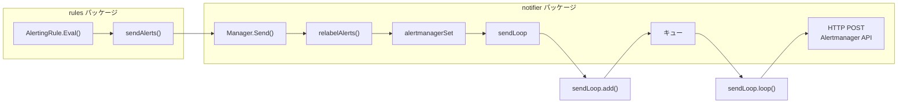

# 第13章 アラート通知

> 本章で読むソース
>
> - [`notifier/manager.go`](https://github.com/prometheus/prometheus/blob/v3.12.0/notifier/manager.go)
> - [`notifier/sendloop.go`](https://github.com/prometheus/prometheus/blob/v3.12.0/notifier/sendloop.go)
> - [`notifier/alert.go`](https://github.com/prometheus/prometheus/blob/v3.12.0/notifier/alert.go)

## この章の狙い

AlertingRule が生成したアラートは、Alertmanager へ送信されて初めて通知として機能する。
本章では、notifier パッケージがアラートをキューイングし、バッチにまとめて Alertmanager へ HTTP POST するまでの流れを読む。

## 前提

- 第12章の AlertingRule の評価サイクルと状態遷移を理解していること

## アラート通知の全体像

アラート通知は次の流れで動作する。



AlertingRule の評価サイクルごとに `sendAlerts()`（`alerting.go` L618-L633）が呼ばれる。
実装は `needsSending()` で再送間隔や解決時刻を見て送信対象を絞り、Firing および Resolved 状態のアラートを `NotifyFunc` を通じて notifier に送る。

## Manager：アラートの受付と振り分け

Manager 構造体は [`notifier/manager.go` `L53-L65`](https://github.com/prometheus/prometheus/blob/v3.12.0/notifier/manager.go#L53-L65) で定義される。

```go
type Manager struct {
	opts *Options

	metrics *alertMetrics

	mtx sync.RWMutex

	stopOnce      *sync.Once
	stopRequested chan struct{}

	alertmanagers map[string]*alertmanagerSet
	logger        *slog.Logger
}
```

`Send()`（L254-L273）はルール側から呼ばれるエントリポイントである。

```go
func (n *Manager) Send(alerts ...*Alert) {
	select {
	case <-n.stopRequested:
		return
	default:
	}

	n.mtx.RLock()
	defer n.mtx.RUnlock()

	alerts = relabelAlerts(n.opts.RelabelConfigs, n.opts.ExternalLabels, alerts)
	if len(alerts) == 0 {
		return
	}

	for _, ams := range n.alertmanagers {
		ams.send(alerts...)
	}
}
```

受け取ったアラートに対し、まずリラベリングが適用される。
リラベリングでは、外部ラベルの付与と `relabel.ProcessBuilder()` によるラベルの追加・削除・変更が行われる。
リラベリング後にアラートが0件になれば、以降の処理はスキップされる。

その後、設定されたすべての Alertmanager セットに対してアラートが送られる。
`alertmanagerSet` は Alertmanager の設定単位で作成され、サービスディスカバリーによって動的にエンドポイントが管理される。

`ApplyConfig()`（L126-L198）は設定変更時の処理である。
古い設定と新しい設定のハッシュを比較し、変更のない Alertmanager 設定に対しては `sendLoops`（後述の送信ループ）を再利用する。
これにより、設定再読み込み時に送信中だったアラートが失われるのを防ぐ。

## relabelAlerts：アラートのラベル加工

`relabelAlerts()` 関数は [`notifier/alert.go` `L71-L102`](https://github.com/prometheus/prometheus/blob/v3.12.0/notifier/alert.go#L71-L102) で実装される。

```go
func relabelAlerts(relabelConfigs []*relabel.Config, externalLabels labels.Labels, alerts []*Alert) []*Alert {
	lb := labels.NewBuilder(labels.EmptyLabels())
	var relabeledAlerts []*Alert

	for _, a := range alerts {
		lb.Reset(a.Labels)
		externalLabels.Range(func(l labels.Label) {
			if a.Labels.Get(l.Name) == "" {
				lb.Set(l.Name, l.Value)
			}
		})

		keep := relabel.ProcessBuilder(lb, relabelConfigs...)
		if !keep {
			continue
		}

		if !labels.Equal(a.Labels, lb.Labels()) {
			a = &Alert{
				Labels:       lb.Labels(),
				Annotations:  a.Annotations,
				StartsAt:     a.StartsAt,
				EndsAt:       a.EndsAt,
				GeneratorURL: a.GeneratorURL,
			}
		}

		relabeledAlerts = append(relabeledAlerts, a)
	}
	return relabeledAlerts
}
```

外部ラベルはアラートに同名のラベルが存在しない場合のみ追加される。
リラベリング結果が `keep=false` となったアラートは削除される。
ラベルが変更された場合は、イミュータビリティを保つために新しい `Alert` 構造体が作成される。

## sendLoop：キューイングと HTTP 送信

`sendLoop` 構造体は [`notifier/sendloop.go` `L30-L46`](https://github.com/prometheus/prometheus/blob/v3.12.0/notifier/sendloop.go#L30-L46) で定義される。

```go
type sendLoop struct {
	alertmanagerURL string

	cfg    *config.AlertmanagerConfig
	client *http.Client
	opts   *Options

	metrics *alertMetrics

	mtx      sync.RWMutex
	queue    []*Alert
	hasWork  chan struct{}
	stopped  chan struct{}
	stopOnce sync.Once

	logger *slog.Logger
}
```

各 Alertmanager エンドポイントに対して1つの `sendLoop` が存在する。

`add()`（L75-L113）はキューへの追加を行う。

```go
func (s *sendLoop) add(alerts ...*Alert) {
	// ...
	s.mtx.Lock()
	defer s.mtx.Unlock()

	var dropped int
	if d := len(alerts) - s.opts.QueueCapacity; d > 0 {
		alerts = alerts[d:]
	}

	if d := (len(s.queue) + len(alerts)) - s.opts.QueueCapacity; d > 0 {
		s.queue = s.queue[d:]
	}

	s.queue = append(s.queue, alerts...)

	s.notifyWork()

	s.metrics.queueLength.WithLabelValues(s.alertmanagerURL).Set(float64(len(s.queue)))
}
```

キューが容量を超えた場合は、古いアラートから切り捨てられる。
`hasWork` チャネルへの通知により、送信ゴルーチンが起動される。

`loop()`（L186-L207）はキューを監視し、アラートが到着するたびに `sendOneBatch()` を呼び出す。

```go
func (s *sendLoop) loop() {
	for {
		select {
		case <-s.stopped:
			return
		default:
			select {
			case <-s.stopped:
				return
			case <-s.hasWork:
				s.sendOneBatch()
				if s.queueLen() > 0 {
					s.notifyWork()
				}
			}
		}
	}
}
```

`nextBatch()`（L159-L174）はキューから最大 `MaxBatchSize`（デフォルト256）のアラートを取り出す。

`sendAll()`（L209-L249）は実際の HTTP 送信を行う。

```go
func (s *sendLoop) sendAll(alerts []*Alert) bool {
	begin := time.Now()

	var payload []byte
	var err error
	switch s.cfg.APIVersion {
	case config.AlertmanagerAPIVersionV2:
		openAPIAlerts := alertsToOpenAPIAlerts(alerts)
		payload, err = json.Marshal(openAPIAlerts)
		// ...
	}

	ctx, cancel := context.WithTimeout(context.Background(), time.Duration(s.cfg.Timeout))
	defer cancel()

	if err := s.sendOne(ctx, s.client, s.alertmanagerURL, payload); err != nil {
		s.metrics.errors.WithLabelValues(s.alertmanagerURL).Add(float64(len(alerts)))
		return false
	}
	// ...
	return true
}
```

`sendOne()`（L251-L273）は HTTP POST リクエストを送信する。

```go
func (s *sendLoop) sendOne(ctx context.Context, c *http.Client, url string, b []byte) error {
	req, err := http.NewRequest(http.MethodPost, url, bytes.NewReader(b))
	// ...
	req.Header.Set("Content-Type", contentTypeJSON)
	resp, err := s.opts.Do(ctx, c, req)
	// ...
	if resp.StatusCode/100 != 2 {
		return fmt.Errorf("bad response status %s", resp.Status)
	}
	return nil
}
```

2xx 以外のステータスはエラーとして扱われ、アラートは再送されずにドロップされる。

## サービスディスカバリーと Alertmanager 検出

`Manager` は `Run()`（L205-L215）内で `targetUpdateLoop()` を起動し、サービスディスカバリーの更新チャネル `tsets` を監視する。

```go
func (n *Manager) Run(tsets <-chan map[string][]*targetgroup.Group) {
	n.targetUpdateLoop(tsets)

	n.mtx.Lock()
	defer n.mtx.Unlock()
	for _, ams := range n.alertmanagers {
		ams.mtx.Lock()
		ams.cleanSendLoops(ams.ams...)
		ams.mtx.Unlock()
	}
}
```

`reload()`（L238-L250）はターゲットグループの更新を受け取り、対応する `alertmanagerSet` の `sync()` を呼び出す。
`sync()` は新しい Alertmanager エンドポイントのリストを反映し、不要になったエンドポイントの `sendLoop` を停止する。

## Alert 構造体

通知で使われる `Alert` 構造体は [`notifier/alert.go` `L25-L37`](https://github.com/prometheus/prometheus/blob/v3.12.0/notifier/alert.go#L25-L37) で定義される。

```go
type Alert struct {
	// Label value pairs for purpose of aggregation, matching, and disposition
	// dispatching. This must minimally include an "alertname" label.
	Labels labels.Labels `json:"labels"`

	// Extra key/value information which does not define alert identity.
	Annotations labels.Labels `json:"annotations"`

	// The known time range for this alert. Both ends are optional.
	StartsAt     time.Time `json:"startsAt,omitempty"`
	EndsAt       time.Time `json:"endsAt,omitempty"`
	GeneratorURL string    `json:"generatorURL,omitempty"`
}
```

この構造体は `rules.Alert` から変換される。
変換は `SendAlerts()`（`manager.go` L470-L493）で行われ、`FiredAt` が `StartsAt` に、`ResolvedAt` が `EndsAt` にマッピングされる。
`GeneratorURL` にはルール式へのリンクが設定される。

## 高速化・最適化の工夫

バッチ送信（`MaxBatchSize` = 256）により、個別の HTTP リクエストをまとめてネットワーク効率を向上させている。
キューが満杯の場合は古いアラートから切り捨て、新しいアラートを優先する。
これにより、Alertmanager が一時的に応答不能になっても、最新のアラート状態が維持される。

シャットダウン時には `DrainOnShutdown` オプションに従い、キュー内の残りアラートを全て送信してから停止する（L129-L150）。

## まとめ

notifier パッケージは、ルール評価で生成されたアラートをリラベリングし、Alertmanager ごとにキューイングしてバッチ HTTP POST で送信する。
キューイングとバッチ送信により、Alertmanager の負荷変動に対して堅牢な通知システムが実現されている。

## 関連する章

- 第12章 ルール評価：AlertingRule の評価とアラート生成
- 第14章 リモート書き込み：類似のキューイング機構を持つリモートストレージ
