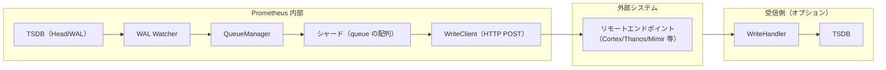
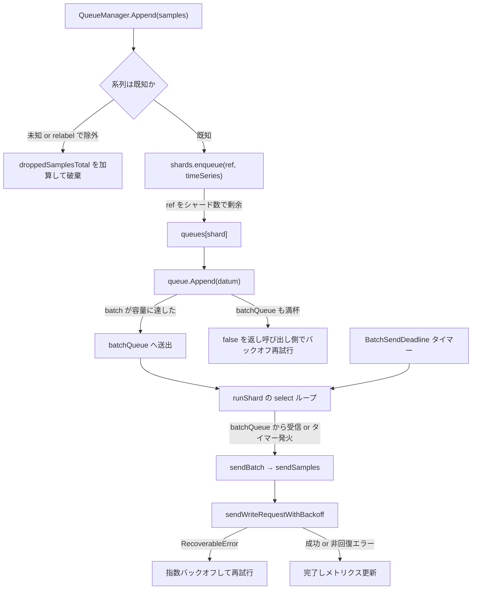
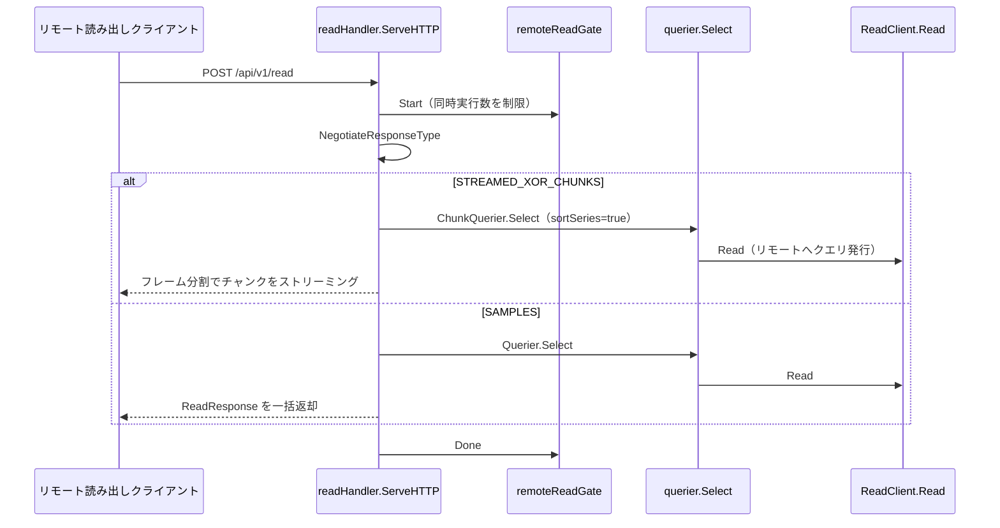

# 第14章 リモート書き込み・読み出し

> 本章で読むソース
>
> - [`storage/remote/storage.go`](https://github.com/prometheus/prometheus/blob/v3.12.0/storage/remote/storage.go)
> - [`storage/remote/write.go`](https://github.com/prometheus/prometheus/blob/v3.12.0/storage/remote/write.go)
> - [`storage/remote/queue_manager.go`](https://github.com/prometheus/prometheus/blob/v3.12.0/storage/remote/queue_manager.go)
> - [`storage/remote/write_handler.go`](https://github.com/prometheus/prometheus/blob/v3.12.0/storage/remote/write_handler.go)
> - [`storage/remote/read_handler.go`](https://github.com/prometheus/prometheus/blob/v3.12.0/storage/remote/read_handler.go)
> - [`storage/remote/read.go`](https://github.com/prometheus/prometheus/blob/v3.12.0/storage/remote/read.go)

## この章の狙い

Prometheus はスクレイプしたデータをローカルの TSDB に保存するだけでなく、外部システムへ送信（リモート書き込み）し、外部システムからデータを読む（リモート読み出し）機能を持つ。
`storage/remote` パッケージのアーキテクチャを、Storage から WriteStorage、QueueManager、WAL Watcher を経てリモートエンドポイントへサンプルが送られるまでの経路として読み解く。
特に QueueManager のシャーディングと送信ループ、およびリモート読み出しの2種類のレスポンスモードを、実装本体まで追う。

## 前提

第6章（Head と WAL）の WAL の構造と読み取りを理解していること。
リラベリングの基本（`relabel.ProcessBuilder`）を知っていると、系列のフィルタリングが読みやすい。

## リモート書き込みの全体像

リモート書き込みのパイプラインは次の通りである。



WAL Watcher が WAL を監視し、追記された系列とサンプルを QueueManager へ渡す。
QueueManager はシャード化したキューでサンプルをバッファリングし、バッチ単位でリモートエンドポイントへ HTTP POST する。
受信側では WriteHandler がリクエストを受け取り、自身の TSDB へ書き込む。

## Storage：リモートストレージのトップレベル管理

`Storage` 構造体は書き込み用の `WriteStorage` と、読み出し用の `queryables` スライスをまとめる。

[`storage/remote/storage.go L54-L64`](https://github.com/prometheus/prometheus/blob/v3.12.0/storage/remote/storage.go#L54-L64)

```go
type Storage struct {
	deduper *logging.Deduper
	logger  *slog.Logger
	mtx     sync.Mutex

	rws *WriteStorage

	// For reads.
	queryables             []storage.SampleAndChunkQueryable
	localStartTimeCallback startTimeCallback
}
```

`Storage` は `storage.Storage` インターフェースを実装し、Prometheus 本体からは単一のストレージとして見える。
`ApplyConfig()` が設定変更のたびに読み出しクライアントを再構築し、書き込み側の設定は `WriteStorage.ApplyConfig()` へ委譲する。

## WriteStorage：書き込み先の管理

`WriteStorage` はリモート書き込み先の設定単位で `QueueManager` を管理する。

[`storage/remote/write.go L60-L81`](https://github.com/prometheus/prometheus/blob/v3.12.0/storage/remote/write.go#L60-L81)

```go
type WriteStorage struct {
	logger *slog.Logger
	reg    prometheus.Registerer
	mtx    sync.Mutex

	watcherMetrics    *wlog.WatcherMetrics
	liveReaderMetrics *wlog.LiveReaderMetrics
	externalLabels    labels.Labels
	dir               string
	queues            map[string]*QueueManager
	samplesIn         *ewmaRate
	flushDeadline     time.Duration
	interner          *pool
	scraper           ReadyScrapeManager
	quit              chan struct{}

	recordBuf *record.BuffersPool

	// For timestampTracker.
	highestTimestamp        *maxTimestamp
	enableTypeAndUnitLabels bool
}
```

`queues` マップのキーは書き込み先設定のハッシュであり、設定変更で内容が変わった書き込み先だけを作り直す。
`samplesIn` はすべての書き込み先で共有する流入レートの指数加重移動平均（EWMA）であり、後述のシャード数計算の入力になる。

## QueueManager：シャード化キュー

`QueueManager` は1つのリモート書き込み先に対応し、シャード群と WAL Watcher、送信クライアントを束ねる。

[`storage/remote/queue_manager.go L436-L464`](https://github.com/prometheus/prometheus/blob/v3.12.0/storage/remote/queue_manager.go#L436-L464)

```go
	watcher                 *wlog.Watcher
	metadataWatcher         *MetadataWatcher

	clientMtx   sync.RWMutex
	storeClient WriteClient
	protoMsg    remoteapi.WriteMessageType
	compr       compression.Type

	seriesMtx      sync.Mutex // Covers seriesLabels, seriesMetadata, droppedSeries and builder.
	seriesLabels   map[chunks.HeadSeriesRef]labels.Labels
	seriesMetadata map[chunks.HeadSeriesRef]*metadata.Metadata
	droppedSeries  map[chunks.HeadSeriesRef]struct{}
	builder        *labels.Builder

	seriesSegmentMtx     sync.Mutex // Covers seriesSegmentIndexes - if you also lock seriesMtx, take seriesMtx first.
	seriesSegmentIndexes map[chunks.HeadSeriesRef]int

	shards      *shards
	numShards   int
	reshardChan chan int
	quit        chan struct{}
	wg          sync.WaitGroup

	dataIn, dataDropped, dataOut, dataOutDuration *ewmaRate

	metrics              *queueManagerMetrics
	interner             *pool
	highestRecvTimestamp *maxTimestamp
}
```

`seriesLabels` は系列参照 `HeadSeriesRef` からリラベリング後のラベルへの対応表である。
`shards` が実際の送信を担い、`numShards` が現在のシャード数、`reshardChan` がリシャーディングの指示チャネルになる。
`dataIn` と `dataOut`、`dataDropped`、`dataOutDuration` の4つの EWMA が、シャード数の動的調整に使われる。

### WAL Watcher と StoreSeries

`QueueManager` は起動時に WAL Watcher を作り、WAL に追記された系列レコードを `StoreSeries()` で受け取る。

[`storage/remote/queue_manager.go L1010-L1029`](https://github.com/prometheus/prometheus/blob/v3.12.0/storage/remote/queue_manager.go#L1010-L1029)

```go
func (t *QueueManager) StoreSeries(series []record.RefSeries, index int) {
	t.seriesMtx.Lock()
	defer t.seriesMtx.Unlock()
	t.seriesSegmentMtx.Lock()
	defer t.seriesSegmentMtx.Unlock()
	for _, s := range series {
		// Just make sure all the Refs of Series will insert into seriesSegmentIndexes map for tracking.
		t.seriesSegmentIndexes[s.Ref] = index

		t.builder.Reset(s.Labels)
		processExternalLabels(t.builder, t.externalLabels)
		keep := relabel.ProcessBuilder(t.builder, t.relabelConfigs...)
		if !keep {
			t.droppedSeries[s.Ref] = struct{}{}
			continue
		}
		lbls := t.builder.Labels()
		t.seriesLabels[s.Ref] = lbls
	}
}
```

系列ごとに外部ラベルの付加と `write_relabel_configs` によるリラベリングを済ませ、残す系列だけを `seriesLabels` に登録する。
`ProcessBuilder()` が偽を返した系列は `droppedSeries` に記録され、以後その系列のサンプルは送信前に破棄される。
ラベル計算を系列登録の1回だけに寄せることで、サンプルごとにリラベリングを繰り返す無駄を避けている。

## 処理フロー：サンプルがシャードへ振り分けられ送信されるまで

WAL Watcher が読み取ったサンプルは、`Append()` を入口に、シャード選択、バッチ化、タイマー駆動の送信という順で流れる。



### Append：キューへの投入とバックオフ

`Append()` は WAL Watcher から呼ばれ、サンプルを1件ずつシャードへ投入する。

[`storage/remote/queue_manager.go L727-L785`](https://github.com/prometheus/prometheus/blob/v3.12.0/storage/remote/queue_manager.go#L727-L785)

```go
func (t *QueueManager) Append(samples []record.RefSample) bool {
	currentTime := time.Now()
outer:
	for _, s := range samples {
		if isSampleOld(currentTime, time.Duration(t.cfg.SampleAgeLimit), s.T) {
			t.metrics.droppedSamplesTotal.WithLabelValues(reasonTooOld).Inc()
			continue
		}
		t.seriesMtx.Lock()
		lbls, ok := t.seriesLabels[s.Ref]
		// ... (中略) ...
		meta := t.seriesMetadata[s.Ref]
		t.seriesMtx.Unlock()
		// Start with a very small backoff. This should not be t.cfg.MinBackoff
		backoff := model.Duration(5 * time.Millisecond)
		for {
			select {
			case <-t.quit:
				return false
			default:
			}
			if t.shards.enqueue(s.Ref, timeSeries{
				seriesLabels:   lbls,
				metadata:       meta,
				startTimestamp: s.ST,
				timestamp:      s.T,
				value:          s.V,
				sType:          tSample,
			}) {
				continue outer
			}

			t.metrics.enqueueRetriesTotal.Inc()
			time.Sleep(time.Duration(backoff))
			backoff *= 2
			if backoff > t.cfg.MaxBackoff {
				backoff = t.cfg.MaxBackoff
			}
		}
	}
	return true
}
```

`seriesLabels` に登録がない系列と、`SampleAgeLimit` を超えて古いサンプルは、ここで数える対象を分けて破棄する。
`enqueue()` が偽を返すのはシャードが満杯かリシャーディング中の場合であり、初期値5ミリ秒から始めて2倍ずつ増やすバックオフでスリープしながら再試行する。
バックオフの上限は `MaxBackoff` で頭打ちにする。

### enqueue：剰余によるシャード選択

`enqueue()` は系列参照をシャード数で割った剰余で投入先を決める。

[`storage/remote/queue_manager.go L1359-L1387`](https://github.com/prometheus/prometheus/blob/v3.12.0/storage/remote/queue_manager.go#L1359-L1387)

```go
func (s *shards) enqueue(ref chunks.HeadSeriesRef, data timeSeries) bool {
	s.mtx.RLock()
	defer s.mtx.RUnlock()
	shard := uint64(ref) % uint64(len(s.queues))
	select {
	case <-s.softShutdown:
		return false
	default:
		appended := s.queues[shard].Append(data)
		if !appended {
			return false
		}
		switch data.sType {
		case tSample:
			s.qm.metrics.pendingSamples.Inc()
			s.enqueuedSamples.Inc()
		// ... (中略) ...
		}
		s.qm.metrics.highestTimestamp.Set(float64(data.timestamp / 1000))
		return true
	}
}
```

`uint64(ref) % uint64(len(s.queues))` により、同じ系列は常に同じシャードへ入る。
同一系列のサンプルを1つのシャードに固定することで、リモートエンドポイントへ届く時系列内の順序が保たれる。
`softShutdown` チャネルが閉じている間は偽を返し、`Append()` 側のバックオフ再試行に処理を戻す。

### queue.Append：バッチへの蓄積

各シャードの `queue` はサンプルを部分バッチに貯め、容量に達したらチャネルへまとめて送出する。

[`storage/remote/queue_manager.go L1442-L1462`](https://github.com/prometheus/prometheus/blob/v3.12.0/storage/remote/queue_manager.go#L1442-L1462)

```go
func (q *queue) Append(datum timeSeries) bool {
	q.batchMtx.Lock()
	defer q.batchMtx.Unlock()
	q.batch = append(q.batch, datum)
	if len(q.batch) == cap(q.batch) {
		select {
		case q.batchQueue <- q.batch:
			q.batch = q.newBatch(cap(q.batch))
			return true
		default:
			// Remove the sample we just appended. It will get retried.
			q.batch = q.batch[:len(q.batch)-1]
			return false
		}
	}
	return true
}
```

`batch` の容量は `MaxSamplesPerSend` であり、満杯になった時点で `batchQueue` へ渡してから新しいバッチに切り替える。
`batchQueue` も満杯なら直前に追加したサンプルを取り消して偽を返し、`Append()` のバックオフに委ねる。
新しいバッチは `newBatch()` が保持するプールから再利用し、送信ごとのスライス確保を避ける。

### runShard：バッチとタイマーによる送信ループ

各シャードのゴルーチン `runShard()` は、満杯になったバッチの到着と締め切りタイマーの両方を待つ。

[`storage/remote/queue_manager.go L1581-L1654`](https://github.com/prometheus/prometheus/blob/v3.12.0/storage/remote/queue_manager.go#L1581-L1654)

```go
	timer := time.NewTimer(time.Duration(s.qm.cfg.BatchSendDeadline))
	// ... (中略) ...
	for {
		select {
		case <-ctx.Done():
			// In this case we drop all samples in the buffer and the queue.
			// ... (中略) ...
			return

		case batch, ok := <-batchQueue:
			if !ok {
				return
			}

			sendBatch(batch, s.qm.protoMsg, s.qm.compr, false)
			queue.ReturnForReuse(batch)

			stop()
			timer.Reset(time.Duration(s.qm.cfg.BatchSendDeadline))

		case <-timer.C:
			batch := queue.Batch()
			if len(batch) > 0 {
				sendBatch(batch, s.qm.protoMsg, s.qm.compr, true)
			}
			queue.ReturnForReuse(batch)
			timer.Reset(time.Duration(s.qm.cfg.BatchSendDeadline))
		}
	}
```

`batchQueue` から満杯のバッチが届けば即座に送信し、タイマーを張り直す。
サンプルが `MaxSamplesPerSend` に満たないままでも、`BatchSendDeadline` が経過すればタイマー経路で貯まっている分を送り出す。
この2経路の組み合わせにより、高流入時はバッチをまとめて HTTP リクエスト数を減らしつつ、低流入時でも締め切りで送信遅延を抑える。
送信を終えたバッチは `ReturnForReuse()` でプールへ戻し、次のバッチで再利用する。

### sendWriteRequestWithBackoff：指数バックオフ再試行

`sendBatch` は `sendSamples` を経て `sendWriteRequestWithBackoff()` に至り、回復可能なエラーの間だけ再試行する。

[`storage/remote/queue_manager.go L2027-L2089`](https://github.com/prometheus/prometheus/blob/v3.12.0/storage/remote/queue_manager.go#L2027-L2089)

```go
func (t *QueueManager) sendWriteRequestWithBackoff(ctx context.Context, attempt func(int) error, onRetry func()) error {
	backoff := t.cfg.MinBackoff
	sleepDuration := model.Duration(0)
	try := 0

	for {
		select {
		case <-ctx.Done():
			return ctx.Err()
		default:
		}

		err := attempt(try)

		if err == nil {
			return nil
		}

		// If the error is unrecoverable, we should not retry.
		var backoffErr RecoverableError
		if !errors.As(err, &backoffErr) {
			return err
		}

		sleepDuration = backoff
		switch {
		case backoffErr.retryAfter > 0:
			sleepDuration = backoffErr.retryAfter
			t.logger.Info("Retrying after duration specified by Retry-After header", "duration", sleepDuration)
		case backoffErr.retryAfter < 0:
			t.logger.Debug("retry-after cannot be in past, retrying using default backoff mechanism")
		}
		// ... (中略) ...
		select {
		case <-ctx.Done():
		case <-time.After(time.Duration(sleepDuration)):
		}

		onRetry()
		t.logger.Warn("Failed to send batch, retrying", "err", err)

		backoff = min(sleepDuration*2, t.cfg.MaxBackoff)

		try++
	}
}
```

`RecoverableError` に該当しないエラーは再試行せず即座に返し、該当する場合だけスリープしてから再試行する。
待機時間は `MinBackoff` から始め、毎回2倍にして `MaxBackoff` で頭打ちにする指数バックオフである。
受信側が `Retry-After` ヘッダを返した場合は、その値を待機時間として優先する。
`attempt()` は同じ `req` を送り直すため、成功するまでキューの先頭が進まず、順序が保たれる。

## シャードの動的調整

`Start()` は `updateShardsLoop()` と `reshardLoop()` の2つのゴルーチンを起動し、負荷に応じてシャード数を変える。

[`storage/remote/queue_manager.go L1102-L1127`](https://github.com/prometheus/prometheus/blob/v3.12.0/storage/remote/queue_manager.go#L1102-L1127)

```go
func (t *QueueManager) updateShardsLoop() {
	defer t.wg.Done()

	ticker := time.NewTicker(shardUpdateDuration)
	defer ticker.Stop()
	for {
		select {
		case <-ticker.C:
			desiredShards := t.calculateDesiredShards()
			if !t.shouldReshard(desiredShards) {
				continue
			}
			// Resharding can take some time, and we want this loop
			// to stay close to shardUpdateDuration.
			select {
			case t.reshardChan <- desiredShards:
				t.logger.Info("Remote storage resharding", "from", t.numShards, "to", desiredShards)
				t.numShards = desiredShards
			default:
				t.logger.Info("Currently resharding, skipping.")
			}
		case <-t.quit:
			return
		}
	}
}
```

`shardUpdateDuration`（10秒）ごとに `calculateDesiredShards()` で目標値を計算し、変更が必要なら `reshardChan` へ送る。
`reshardChan` への送信はノンブロッキングであり、前回のリシャーディングがまだ進行中なら今回は見送る。

### calculateDesiredShards：EWMA による目標値計算

目標シャード数は、流入レートと1サンプルあたりの送信時間から算出する。

[`storage/remote/queue_manager.go L1181-L1229`](https://github.com/prometheus/prometheus/blob/v3.12.0/storage/remote/queue_manager.go#L1181-L1229)

```go
	var (
		// When behind we will try to catch up on 5% of samples per second.
		backlogCatchup = 0.05 * dataPending
		// Calculate Time to send one sample, averaged across all sends done this tick.
		timePerSample = dataOutDuration / dataOutRate
		desiredShards = timePerSample * (dataInRate*dataKeptRatio + backlogCatchup)
	)
	// ... (中略) ...
	var (
		lowerBound = float64(t.numShards) * (1. - shardToleranceFraction)
		upperBound = float64(t.numShards) * (1. + shardToleranceFraction)
	)
	// ... (中略) ...
	desiredShards = math.Ceil(desiredShards) // Round up to be on the safe side.
	if lowerBound <= desiredShards && desiredShards <= upperBound {
		return t.numShards
	}

	numShards := int(desiredShards)
	// Do not downshard if we are more than ten seconds back.
	if numShards < t.numShards && delay > 10.0 {
		t.logger.Debug("Not downsharding due to being too far behind")
		return t.numShards
	}

	switch {
	case numShards > t.cfg.MaxShards:
		numShards = t.cfg.MaxShards
	case numShards < t.cfg.MinShards:
		numShards = t.cfg.MinShards
	}
	return numShards
}
```

`timePerSample`（送信レートあたりの所要時間）に、流入レートと未送信分の追いつき量を掛けて目標値を出す。
`shardToleranceFraction`（0.3）の帯の中に収まる変化は無視し、細かい増減での過剰なリシャーディングを避ける。
10秒以上遅れているときはシャードを減らさず、最終的に `MinShards` と `MaxShards` の範囲へ丸める。

### reshardLoop：停止してから再起動

実際のリシャーディングは、古いシャードを完全に停止してから新しいシャードを起動する順で行う。

[`storage/remote/queue_manager.go L1231-L1246`](https://github.com/prometheus/prometheus/blob/v3.12.0/storage/remote/queue_manager.go#L1231-L1246)

```go
func (t *QueueManager) reshardLoop() {
	defer t.wg.Done()

	for {
		select {
		case numShards := <-t.reshardChan:
			// We start the newShards after we have stopped (the therefore completely
			// flushed) the oldShards, to guarantee we only every deliver samples in
			// order.
			t.shards.stop()
			t.shards.start(numShards)
		case <-t.quit:
			return
		}
	}
}
```

`stop()` が古いシャードのバッファをフラッシュしきってから `start()` が新しいシャードを立てるため、シャード割り当てが変わっても系列内の順序が乱れない。

## WriteHandler：受信側の HTTP ハンドラ

受信側の Prometheus は `writeHandler` でリモート書き込みを受け取り、自身の TSDB へ書き込む。

[`storage/remote/write_handler.go L41-L51`](https://github.com/prometheus/prometheus/blob/v3.12.0/storage/remote/write_handler.go#L41-L51)

```go
type writeHandler struct {
	logger     *slog.Logger
	appendable storage.Appendable

	samplesWithInvalidLabelsTotal  prometheus.Counter
	samplesAppendedWithoutMetadata prometheus.Counter

	ingestSTZeroSample      bool
	enableTypeAndUnitLabels bool
	appendMetadata          bool
}
```

`Store()` はプロトコルバージョンに応じて処理を分岐する。

[`storage/remote/write_handler.go L95-L147`](https://github.com/prometheus/prometheus/blob/v3.12.0/storage/remote/write_handler.go#L95-L147)

```go
func (h *writeHandler) Store(r *http.Request, msgType remoteapi.WriteMessageType) (*remoteapi.WriteResponse, error) {
	// Store receives request with decompressed content in body.
	body, err := io.ReadAll(r.Body)
	// ... (中略) ...
	wr := remoteapi.NewWriteResponse()
	if msgType == remoteapi.WriteV1MessageType {
		// PRW 1.0 flow has different proto message and no partial write handling.
		var req prompb.WriteRequest
		if err := proto.Unmarshal(body, &req); err != nil {
			// ... (中略) ...
		}
		if err = h.write(r.Context(), &req); err != nil {
			// ... (中略) ...
		}
		return wr, nil
	}

	// Remote Write 2.x proto message handling.
	var req writev2.Request
	if err := proto.Unmarshal(body, &req); err != nil {
		// ... (中略) ...
	}

	respStats, errHTTPCode, err := h.writeV2(r.Context(), &req)
	// Add stats required X-Prometheus-Remote-Write-Written-* response headers.
	wr.Add(respStats)
	// ... (中略) ...
	return wr, nil
}
```

PRW 1.0 では `prompb.WriteRequest` をデコードし、`write()` で TSDB へ一括追記する。
PRW 2.x では `writev2.Request` をデコードし、`writeV2()` が部分書き込みと統計情報の返却を担う。
`write()` は各系列のラベルを検証し、`maxAheadTime`（10分）を超える未来のタイムスタンプを持つサンプルを拒否する。

## リモート読み出しの経路

リモート読み出しは `readHandler` が受け付け、`AcceptedResponseTypes` に応じて2種類のモードで応答する。

[`storage/remote/read_handler.go L35-L44`](https://github.com/prometheus/prometheus/blob/v3.12.0/storage/remote/read_handler.go#L35-L44)

```go
type readHandler struct {
	logger                    *slog.Logger
	queryable                 storage.SampleAndChunkQueryable
	config                    func() config.Config
	remoteReadSampleLimit     int
	remoteReadMaxBytesInFrame int
	remoteReadGate            *gate.Gate
	queries                   prometheus.Gauge
	marshalPool               *sync.Pool
}
```



### ServeHTTP：同時実行制御とモード選択

`ServeHTTP()` は同時実行数を絞ってからリクエストをデコードし、レスポンス形式を交渉する。

[`storage/remote/read_handler.go L71-L114`](https://github.com/prometheus/prometheus/blob/v3.12.0/storage/remote/read_handler.go#L71-L114)

```go
func (h *readHandler) ServeHTTP(w http.ResponseWriter, r *http.Request) {
	ctx := r.Context()
	if err := h.remoteReadGate.Start(ctx); err != nil {
		http.Error(w, err.Error(), http.StatusInternalServerError)
		return
	}
	h.queries.Inc()

	defer h.remoteReadGate.Done()
	defer h.queries.Dec()

	req, err := DecodeReadRequest(r)
	// ... (中略) ...
	responseType, err := NegotiateResponseType(req.AcceptedResponseTypes)
	if err != nil {
		http.Error(w, err.Error(), http.StatusBadRequest)
		return
	}

	switch responseType {
	case prompb.ReadRequest_STREAMED_XOR_CHUNKS:
		h.remoteReadStreamedXORChunks(ctx, w, req, externalLabels, sortedExternalLabels)
	default:
		// On empty or unknown types in req.AcceptedResponseTypes we default to non streamed, raw samples response.
		h.remoteReadSamples(ctx, w, req, externalLabels, sortedExternalLabels)
	}
}
```

`remoteReadGate.Start()` は `gate.Gate` で同時実行クエリ数を上限まで待たせ、リモート読み出しが TSDB のクエリ資源を占有しすぎないようにする。
`NegotiateResponseType()` がクライアントの受理可能な形式から `STREAMED_XOR_CHUNKS` を選べれば、ストリーミング経路へ進む。
どちらの経路でも、まず外部ラベルに一致する等値マッチャーを取り除いてからクエリを組み立てる。

### ストリーミングチャンク経路

`remoteReadStreamedXORChunks()` は `ChunkQuerier` からチャンクを取り、フレームに分けて逐次書き出す。

[`storage/remote/read_handler.go L188-L235`](https://github.com/prometheus/prometheus/blob/v3.12.0/storage/remote/read_handler.go#L188-L235)

```go
func (h *readHandler) remoteReadStreamedXORChunks(ctx context.Context, w http.ResponseWriter, req *prompb.ReadRequest, externalLabels map[string]string, sortedExternalLabels []prompb.Label) {
	w.Header().Set("Content-Type", "application/x-streamed-protobuf; proto=prometheus.ChunkedReadResponse")

	f, ok := w.(http.Flusher)
	if !ok {
		http.Error(w, "internal http.ResponseWriter does not implement http.Flusher interface", http.StatusInternalServerError)
		return
	}

	for i, query := range req.Queries {
		if err := func() error {
			// ... (中略) ...
			querier, err := h.queryable.ChunkQuerier(query.StartTimestampMs, query.EndTimestampMs)
			// ... (中略) ...
			ws, err := StreamChunkedReadResponses(
				NewChunkedWriter(w, f),
				int64(i),
				// The streaming API has to provide the series sorted.
				querier.Select(ctx, true, hints, filteredMatchers...),
				sortedExternalLabels,
				h.remoteReadMaxBytesInFrame,
				h.marshalPool,
			)
			// ... (中略) ...
		}(); err != nil {
			// ... (中略) ...
		}
	}
}
```

`StreamChunkedReadResponses()` は `remoteReadMaxBytesInFrame` ごとにフレームを区切り、`http.Flusher` で逐次フラッシュする。
全結果をメモリに積まずに送るため、大規模なクエリ結果でも受信側のメモリ使用量を一定に保てる。
これに対し `remoteReadSamples()` は全サンプルを1つの `ReadResponse` に詰めて返すため、結果が大きいとメモリ消費が膨らむ。

### querier.Select：リモートエンドポイントへのクエリ発行

`querier.Select()` は外部ラベルのマッチャーを補ってからリモートエンドポイントへ問い合わせる。

[`storage/remote/read.go L141-L173`](https://github.com/prometheus/prometheus/blob/v3.12.0/storage/remote/read.go#L141-L173)

```go
func (q *querier) Select(ctx context.Context, sortSeries bool, hints *storage.SelectHints, matchers ...*labels.Matcher) storage.SeriesSet {
	if len(q.requiredMatchers) > 0 {
		// ... (中略) ...
	}

	m, added := q.addExternalLabels(matchers)
	query, err := ToQuery(q.mint, q.maxt, m, hints)
	if err != nil {
		return storage.ErrSeriesSet(fmt.Errorf("toQuery: %w", err))
	}

	res, err := q.client.Read(ctx, query, sortSeries)
	if err != nil {
		return storage.ErrSeriesSet(fmt.Errorf("remote_read: %w", err))
	}
	return newSeriesSetFilter(res, added)
}
```

`requiredMatchers` が設定され、かつクエリのマッチャーがそれに一致しない場合は、リモートへ問い合わせずに空の結果を返す。
補った外部ラベルは `newSeriesSetFilter()` が結果から取り除き、クライアントには元のラベル集合だけが返る。

### preferLocalStorage：ローカルで足りる範囲は問い合わせない

`Querier()` はクエリ範囲がローカル TSDB で完結するかを先に確かめ、無駄なリモート読み出しを避ける。

[`storage/remote/read.go L106-L124`](https://github.com/prometheus/prometheus/blob/v3.12.0/storage/remote/read.go#L106-L124)

```go
func (c *sampleAndChunkQueryableClient) preferLocalStorage(mint, maxt int64) (cmaxt int64, noop bool, err error) {
	localStartTime, err := c.callback()
	if err != nil {
		return 0, false, err
	}
	cmaxt = maxt

	// Avoid queries whose time range is later than the first timestamp in local DB.
	if mint > localStartTime {
		return 0, true, nil
	}
	// Query only samples older than the first timestamp in local DB.
	if maxt > localStartTime {
		cmaxt = localStartTime
	}
	return cmaxt, false, nil
}
```

クエリ範囲がローカル TSDB の最古のタイムスタンプより新しければ、`noop` を返してリモート読み出しそのものを省く。
一部だけ古い場合は `maxt` をローカルの開始時刻まで縮め、ローカルで答えられる区間をリモートへ問い合わせない。

## 高速化・最適化の工夫

この章からは4つの機構を指摘できる。

1つ目は **シャード数の動的調整** である。
`calculateDesiredShards()` は流入レートと送信レートの EWMA を比較し、`shardToleranceFraction` の帯を超える変化のときだけリシャーディングする。
平滑化した値を使うことで、瞬間的な変動での過剰なシャード増減を防ぎつつ、リモートエンドポイントの性能変化にスループットを合わせられる。

2つ目は **バッチ送信による HTTP リクエスト削減** である。
`queue.Append()` はサンプルを `MaxSamplesPerSend` 件まで貯め、満杯になったバッチだけをチャネルへ渡す。
`runShard()` は満杯バッチの到着と `BatchSendDeadline` タイマーの2経路を選択待ちし、高流入時は1リクエストに多数のサンプルをまとめ、低流入時でも締め切りで送信遅延を抑える。

3つ目は **バッファの再利用によるアロケーション削減** である。
送信し終えたバッチスライスは `ReturnForReuse()` でプールへ戻し、次のバッチが `newBatch()` でそれを取り出す。
サンプルが流れ続ける経路でスライスを毎回確保し直さないため、GC 負荷を抑える。

4つ目は **リモート読み出しのストリーミングとローカル優先** である。
`remoteReadStreamedXORChunks()` は結果を `remoteReadMaxBytesInFrame` ごとのフレームに分けてフラッシュし、大規模クエリでもメモリを一定に保つ。
`preferLocalStorage()` はローカル TSDB で完結する範囲のリモート問い合わせを省き、`remoteReadGate` が同時実行数を絞ってクエリ資源の枯渇を防ぐ。

## まとめ

`storage/remote` パッケージは、WAL Watcher でのデータ捕捉、QueueManager でのシャーディングとバッチ化、WriteClient での指数バックオフ付き送信という段階でリモート書き込みを実現する。
サンプルは系列参照の剰余で固定のシャードへ振り分けられ、満杯バッチと締め切りタイマーの両経路でまとめて送られる。
リモート読み出しは、全サンプルを一括で返す SAMPLES モードと、フレーム分割でチャンクを送るストリーミングモードの2種類を持つ。
シャードの動的調整、バッチ送信、バッファ再利用、ストリーミング転送が、ネットワーク負荷とメモリ使用量のバランスを取る工夫である。

## 関連する章

- 第6章 Head と WAL：WAL Watcher が監視する WAL の構造
- 第15章 HTTP API：リモート書き込み・読み出しのエンドポイント登録
