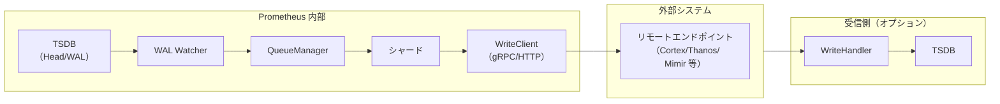

# 第14章 リモート書き込み・読み出し

> 本章で読むソース
>
> - [`storage/remote/storage.go`](https://github.com/prometheus/prometheus/blob/v3.12.0/storage/remote/storage.go)
> - [`storage/remote/write.go`](https://github.com/prometheus/prometheus/blob/v3.12.0/storage/remote/write.go)
> - [`storage/remote/queue_manager.go`](https://github.com/prometheus/prometheus/blob/v3.12.0/storage/remote/queue_manager.go)
> - [`storage/remote/write_handler.go`](https://github.com/prometheus/prometheus/blob/v3.12.0/storage/remote/write_handler.go)
> - [`storage/remote/read_handler.go`](https://github.com/prometheus/prometheus/blob/v3.12.0/storage/remote/read_handler.go)

## この章の狙い

Prometheus はスクレイプしたデータを TSDB に保存するだけでなく、外部システムへ送信（リモート書き込み）したり、外部システムからデータを読んだり（リモート読み出し）できる。
本章では `storage/remote` パッケージのアーキテクチャを、Storage → QueueManager → WAL Watcher → WriteHandler/ReadHandler の順に読み解く。

## 前提

- 第5章（TSDB アーキテクチャ）の WAL 構造を理解していること
- 第6章（Head と WAL）の WAL の読み取りを理解していること

## リモート書き込みの全体像

リモート書き込みのパイプラインは次の通りである。



WAL Watcher が WAL を監視し、新しいサンプルを QueueManager に渡す。
QueueManager はシャード化されたキューでバッファリングし、リモートエンドポイントへ HTTP POST で送信する。
受信側では WriteHandler がリクエストを受け取り、自身の TSDB に書き込む。

## Storage：リモートストレージのトップレベル管理

`Storage` 構造体は [`storage/remote/storage.go` `L54-L64`](https://github.com/prometheus/prometheus/blob/v3.12.0/storage/remote/storage.go#L54-L64) で定義される。

```go
type Storage struct {
	deduper *logging.Deduper
	logger  *slog.Logger
	mtx     sync.Mutex

	rws *WriteStorage

	queryables             []storage.SampleAndChunkQueryable
	localStartTimeCallback startTimeCallback
}
```

`Storage` は `storage.Storage` インターフェースを実装し、Prometheus 本体からは単一のストレージとして見える。
内部では書き込み用の `WriteStorage` と、読み出し用の `queryables` スライスを保持する。

`NewStorage()`（L69-L83）は `WriteStorage` を作成し、`run()` ゴルーチン（`write.go` L118）で定期的なキュー管理を開始する。

`ApplyConfig()`（L90-L147）は設定変更時に読み出しクライアントを再構築する。
重複したリモート読み出し設定を防ぐため、設定のハッシュによる重複チェックが行われる（L108-L111）。

## WriteStorage：書き込み先の管理

`WriteStorage` 構造体は [`storage/remote/write.go` `L60-L81`](https://github.com/prometheus/prometheus/blob/v3.12.0/storage/remote/write.go#L60-L81) で定義される。

```go
type WriteStorage struct {
	logger *slog.Logger
	reg    prometheus.Registerer
	mtx    sync.Mutex

	watcherMetrics    *wlog.WatcherMetrics
	liveReaderMetrics *wlog.LiveReaderMetrics
	externalLabels    labels.Labels
	dir               string
	queues            map[string]*QueueManager
	samplesIn         *ewmaRate
	flushDeadline     time.Duration
	interner          *pool
	scraper           ReadyScrapeManager
	quit              chan struct{}

	recordBuf *record.BuffersPool

	highestTimestamp        *maxTimestamp
	enableTypeAndUnitLabels bool
}
```

`queues` マップはリモート書き込み先の設定単位で `QueueManager` を管理する。

## QueueManager：シャード化キュー

`QueueManager` 構造体は [`storage/remote/queue_manager.go` `L421-L464`](https://github.com/prometheus/prometheus/blob/v3.12.0/storage/remote/queue_manager.go#L421-L464) で定義される。

```go
type QueueManager struct {
	// ...
	watcher         *wlog.Watcher
	metadataWatcher *MetadataWatcher

	clientMtx   sync.RWMutex
	storeClient WriteClient

	shards      *shards
	numShards   int
	reshardChan chan int
	quit        chan struct{}
	wg          sync.WaitGroup

	dataIn, dataDropped, dataOut, dataOutDuration *ewmaRate

	metrics              *queueManagerMetrics
	highestRecvTimestamp *maxTimestamp
}
```

`Append()`（L727）は WAL Watcher から呼ばれ、サンプルをキューに追加する。
追加されたサンプルは系列参照 `ref` の剰余でシャードを決めるため、同じ系列は同じシャードに入る。

### シャードの動的調整

`Start()`（L970-L988）はシャードを起動し、`updateShardsLoop()` と `reshardLoop()` の2つのゴルーチンを開始する。

`calculateDesiredShards()`（L1156）は EWMA（指数加重移動平均）でデータ流入速度と送信速度を計測し、適切なシャード数を計算する。

```go
func (t *QueueManager) calculateDesiredShards() int {
	t.dataIn.Tick()
	t.dataDropped.Tick()
	t.dataOut.Tick()
	t.dataOutDuration.Tick()

	var (
		dataInRate          = t.dataIn.Rate()
		dataOutRate         = t.dataOut.Rate()
		dataOutDurationRate = t.dataOutDuration.Rate()
		// ...
	)

	actualShards := t.numShards
	// ...

	desiredShards := math.Ceil(dataInRate / (dataOutRate / float64(actualShards)))
	// Apply tolerance...
	return int(desiredShards)
}
```

流入速度に対して送信速度が不足している場合、シャード数を増やして並列度を上げる。
逆に余裕がある場合はシャード数を減らしてリソースを節約する。
この動的調整により、リモートエンドポイントの性能変動に適応できる。

## WAL Watcher：WAL からのデータ読み出し

`QueueManager` は起動時に `wlog.NewWatcher()`（L541）で WAL Watcher を作成する。
WAL Watcher は TSDB の WAL を監視し、新しいレコードが書き込まれるたびに `QueueManager` の `Append()` を呼び出す。

`StoreSeries()`（L1010-L1029）は、WAL から読み取った系列情報を保持する。
保持されたラベルは、後続のサンプル送信時に `relabel.ProcessBuilder()` でリラベリングされる。
`droppedSeries` マップで管理され、リラベリングで削除された系列のサンプルは送信されない。

## WriteHandler：受信側の HTTP ハンドラ

`writeHandler` 構造体は [`storage/remote/write_handler.go` `L41-L51`](https://github.com/prometheus/prometheus/blob/v3.12.0/storage/remote/write_handler.go#L41-L51) で定義される。

```go
type writeHandler struct {
	logger     *slog.Logger
	appendable storage.Appendable

	samplesWithInvalidLabelsTotal  prometheus.Counter
	samplesAppendedWithoutMetadata prometheus.Counter

	ingestSTZeroSample      bool
	enableTypeAndUnitLabels bool
	appendMetadata          bool
}
```

`NewWriteHandler()`（L60-L82）はリモート書き込みリクエストを受け付ける HTTP ハンドラを作成する。
`Store()` メソッド（L95-L147）は、リクエストのプロトコルバージョン（PRW 1.0 / 2.x）に応じて処理を分岐する。

PRW 1.0 の場合（L104-L128）、`prompb.WriteRequest` をデコードし、`write()` で TSDB に追記する。
PRW 2.x の場合（L131-L146）、`writev2.Request` をデコードし、`writeV2()` で部分書き込みと統計情報の返却を行う。

`write()`（L149-L218）は各時系列のラベルを検証し、サンプル・ヒストグラム・エグザンプラを順に `Appender` に追加する。
`maxAheadTime`（L53、10分）を超える未来のタイムスタンプは拒否される。

## ReadHandler：リモート読み出しの HTTP ハンドラ

`readHandler` 構造体は [`storage/remote/read_handler.go` `L35-L44`](https://github.com/prometheus/prometheus/blob/v3.12.0/storage/remote/read_handler.go#L35-L44) で定義される。

```go
type readHandler struct {
	logger                    *slog.Logger
	queryable                 storage.SampleAndChunkQueryable
	config                    func() config.Config
	remoteReadSampleLimit     int
	remoteReadMaxBytesInFrame int
	remoteReadGate            *gate.Gate
	queries                   prometheus.Gauge
	marshalPool               *sync.Pool
}
```

`ServeHTTP()`（L71-L114）はリモート読み出しリクエストを処理する。
`remoteReadGate` で同時実行クエリ数を制限し、`DecodeReadRequest()` でリクエストをデコードする。

レスポンス形式は `AcceptResponseTypes` に応じて2種類に分かれる。

1. **SAMPLES モード**（`remoteReadSamples()`、L116-L186）：全サンプルを `ReadResponse` に詰めて返す。
2. **STREAMED_XOR_CHUNKS モード**（`remoteReadStreamedXORChunks()`、L188-L253）：チャンクを分割してストリーミングで返す。

ストリーミングモードでは `StreamChunkedReadResponses()` が使われ、`remoteReadMaxBytesInFrame` ごとにフレームを区切る。
これにより、大規模なクエリ結果でもメモリ使用量を抑えられる。

`filterExtLabelsFromMatchers()`（L259-L280）は、外部ラベルに一致するマッチャーを空ラベルのマッチャーに変換する。
これは外部ラベルがクエリ先のストレージには保存されていないためである。

## 高速化・最適化の工夫

リモート書き込みの最大の最適化は、シャード数の動的調整である。
`calculateDesiredShards()` は EWMA を用いて平滑化された流入・送出レートを比較し、過剰なシャード追加を防ぎながらスループットを最大化する。

リモート読み出しでは、ストリーミングモードによるチャンク転送が大規模クエリのメモリ使用量を削減する。
また、`remoteReadGate` による同時実行制御は、リモート読み出しが TSDB のクエリプールを枯渇させるのを防ぐ。

## まとめ

`storage/remote` パッケージは、WAL Watcher でのデータ捕捉、QueueManager でのキューイングとシャーディング、WriteClient での送信という3段階のパイプラインでリモート書き込みを実現する。
リモート読み出しは、サンプルモードとストリーミングチャンクモードの2種類の転送方式をサポートする。
シャードの動的調整とストリーミング転送により、ネットワーク負荷とメモリ使用量のバランスが取られている。

## 関連する章

- 第6章 Head と WAL：WAL Watcher が監視する WAL の構造
- 第15章 HTTP API：リモート書き込み・読み出しのエンドポイント登録
