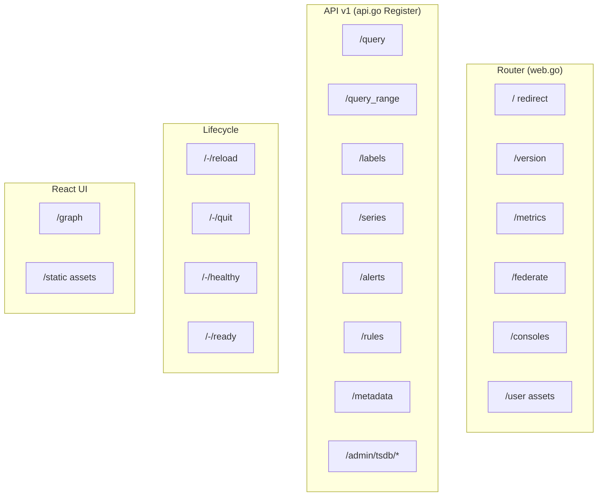
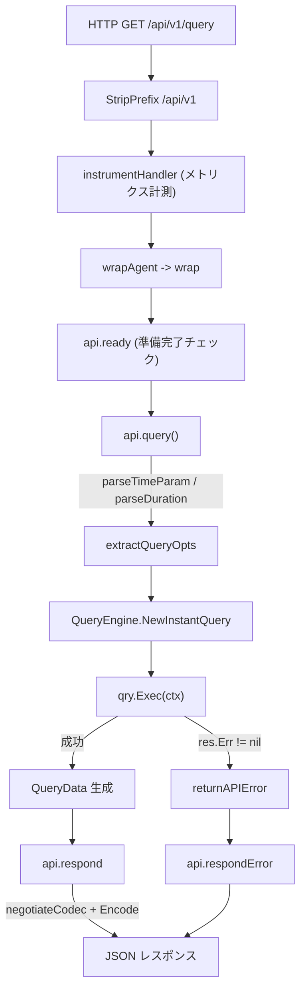

# 第15章 HTTP API

> 本章で読むソース
>
> - [`web/web.go`](https://github.com/prometheus/prometheus/blob/v3.12.0/web/web.go)
> - [`web/api/v1/api.go`](https://github.com/prometheus/prometheus/blob/v3.12.0/web/api/v1/api.go)
> - [`web/api/v1/json_codec.go`](https://github.com/prometheus/prometheus/blob/v3.12.0/web/api/v1/json_codec.go)
> - [`web/federate.go`](https://github.com/prometheus/prometheus/blob/v3.12.0/web/federate.go)

## この章の狙い

Prometheus は HTTP サーバーとして動作し、メトリクスのクエリや管理操作のための API を提供する。
`web` パッケージのルーティング設定から、API v1 のエンドポイントがリクエストを受けて PromQL エンジンを呼び出し、JSON レスポンスを返すまでの経路をたどる。
即時クエリ `GET /api/v1/query` を主な題材にして、共通ラッパー、クエリ実行、エラー分類、レスポンスのエンコードまでの HTTP レイヤーの処理を追う。
Federation エンドポイントとライフサイクルエンドポイントの構成も併せて読む。

PromQL エンジンの評価ロジックそのものは第10章、ルール評価は第12章が扱う。
本章は HTTP レイヤーがそれらをどう呼び出し、結果をどう整形するかに焦点を当てる。

## 前提

- 第9章（PromQL パーサー）のクエリパース
- 第10章（PromQL エンジン）のクエリ実行
- 第14章（リモート書き込み）の `/api/v1/write` の実装

## HTTP API のルート構造

`web.Handler` は複数のエンドポイント群をひとつのルーターにまとめる。
ルート直下の管理用パス、API v1、ライフサイクル、デバッグ、React UI がそれぞれ別の接頭辞で登録される。



## Handler の初期化とルーターの構築

`Handler` は [`web/web.go` の `New()` 関数（L326-L614）](https://github.com/prometheus/prometheus/blob/v3.12.0/web/web.go#L326-L614) で構築される。
ルーターには `github.com/prometheus/common/route` パッケージが使われ、`route.New()` の戻り値に2つのインストルメンテーションがチェーンされる。

[`web/web.go L335-L337`](https://github.com/prometheus/prometheus/blob/v3.12.0/web/web.go#L335-L337)

```go
	router := route.New().
		WithInstrumentation(m.instrumentHandler).
		WithInstrumentation(setPathWithPrefix(""))
```

`WithInstrumentation` はルーターに登録される全ハンドラを指定の関数でラップする仕組みである。
`m.instrumentHandler` はメトリクス計測を、`setPathWithPrefix` はメトリクスのラベルに使うパスの設定を担う。

API v1 のハンドラは `api_v1.NewAPI()` で作られる。
この呼び出しには、クエリエンジン、ストレージ、ターゲット取得関数、ルール取得関数など、Prometheus 内部の各コンポーネントが引数として渡される。

[`web/web.go L391-L437`](https://github.com/prometheus/prometheus/blob/v3.12.0/web/web.go#L391-L437)

```go
	h.apiV1 = api_v1.NewAPI(h.queryEngine, h.storage, app, appV2, h.exemplarStorage, factorySPr, factoryTr, factoryAr,
		func() config.Config {
			h.mtx.RLock()
			defer h.mtx.RUnlock()
			return *h.config
		},
		o.Flags,
		api_v1.GlobalURLOptions{
			ListenAddress: o.ListenAddresses[0],
			Host:          o.ExternalURL.Host,
			Scheme:        o.ExternalURL.Scheme,
		},
		h.testReady,
		h.options.LocalStorage,
		// ... (中略) ...
		o.Parser,
	)
```

ターゲット取得関数 `factoryTr` やルール取得関数 `FactoryRr` はいずれも `func(context.Context) ...Retriever` の形をとる。
`NewAPI` にコンポーネントの実体ではなくファクトリー関数を渡すことで、リクエストごとに最新の Scrape Manager や Rule Manager を取得できる。

API v1 のルート群は、ルート直下のルーターとは別のサブルーターに登録され、`/api/v1` の接頭辞で親ルーターへマウントされる。

[`web/web.go L752-L757`](https://github.com/prometheus/prometheus/blob/v3.12.0/web/web.go#L752-L757)

```go
	av1 := route.New().
		WithInstrumentation(h.metrics.instrumentHandlerWithPrefix("/api/v1")).
		WithInstrumentation(setPathWithPrefix(apiPath + "/v1"))
	h.apiV1.Register(av1)

	mux.Handle(apiPath+"/v1/", http.StripPrefix(apiPath+"/v1", av1))
```

サブルーター `av1` には API v1 専用のインストルメンテーションが付く。
`http.StripPrefix` によって `/api/v1` を取り除いた残りのパスが `av1` に渡るため、`Register` 側は `/query` のような接頭辞なしのパスだけを扱えばよい。

ルートパス `/` は `/query`（または旧 UI では `/graph`）へリダイレクトされる。

[`web/web.go L477-L479`](https://github.com/prometheus/prometheus/blob/v3.12.0/web/web.go#L477-L479)

```go
	router.Get("/", func(w http.ResponseWriter, r *http.Request) {
		http.Redirect(w, r, path.Join(o.ExternalURL.Path, homePage), http.StatusFound)
	})
```

## API v1 の登録と共通ラッパー

API v1 のエンドポイントは [`web/api/v1/api.go` の `Register()`（L393-L485）](https://github.com/prometheus/prometheus/blob/v3.12.0/web/api/v1/api.go#L393-L485) で登録される。
`Register` は冒頭で `wrap` と `wrapAgent` という2つのクロージャを定義し、これらで各ハンドラを包んでからルーターへ登録する。

[`web/api/v1/api.go L393-L424`](https://github.com/prometheus/prometheus/blob/v3.12.0/web/api/v1/api.go#L393-L424)

```go
func (api *API) Register(r *route.Router) {
	wrap := func(f apiFunc) http.HandlerFunc {
		hf := http.HandlerFunc(func(w http.ResponseWriter, r *http.Request) {
			httputil.SetCORS(w, api.CORSOrigin, r)
			result := setUnavailStatusOnTSDBNotReady(f(r))
			if result.finalizer != nil {
				defer result.finalizer()
			}
			if result.err != nil {
				api.respondError(w, result.err, result.data)
				return
			}

			if result.data != nil {
				api.respond(w, r, result.data, result.warnings, r.FormValue("query"))
				return
			}
			w.WriteHeader(http.StatusNoContent)
		})
		return api.ready(httputil.CompressionHandler{
			Handler: api.openAPIBuilder.WrapHandler(hf),
		}.ServeHTTP)
	}

	wrapAgent := func(f apiFunc) http.HandlerFunc {
		return wrap(func(r *http.Request) apiFuncResult {
			if api.isAgent {
				return apiFuncResult{nil, &apiError{errorExec, errors.New("unavailable with Prometheus Agent")}, nil, nil}
			}
			return f(r)
		})
	}
```

`wrap` は各エンドポイントに共通する処理を1か所に集約する。
CORS ヘッダーの付与、TSDB 未準備時のステータス変換、`finalizer` の遅延実行、エラー時は `respondError`、成功時は `respond`、データが空なら 204 No Content という分岐を、すべてのエンドポイントで同じ形にそろえる。
`api.ready` でラップして起動完了前のアクセスを弾き、`CompressionHandler` でレスポンスの gzip 圧縮に対応させるのも共通処理である。

`wrapAgent` は `wrap` の内側に Agent モードの判定を1枚追加したものである。
Agent モードでは TSDB を持たないため、クエリや管理系のエンドポイントは `errorExec` を返して即座に拒否する。

登録されるルートは、同じ関数を GET と POST の両方に割り当てる形が多い。

[`web/api/v1/api.go L426-L434`](https://github.com/prometheus/prometheus/blob/v3.12.0/web/api/v1/api.go#L426-L434)

```go
	r.Options("/*path", wrap(api.options))

	r.Get("/query", wrapAgent(api.query))
	r.Post("/query", wrapAgent(api.query))
	r.Get("/query_range", wrapAgent(api.queryRange))
	r.Post("/query_range", wrapAgent(api.queryRange))
	r.Get("/query_exemplars", wrapAgent(api.queryExemplars))
	r.Post("/query_exemplars", wrapAgent(api.queryExemplars))
```

クエリ、メタデータ、ステータス、管理の各エンドポイントが同じ `Register` の中で連続して登録される。
ラベル一覧の `/labels`、系列一覧の `/series`、メタデータの `/metadata`、アラートの `/alerts`、ルールの `/rules` はいずれも `wrapAgent` で包まれる。
管理系の `/admin/tsdb/delete_series`、`/admin/tsdb/clean_tombstones`、`/admin/tsdb/snapshot` は POST と PUT の両方に登録される。

## 全エンドポイント共通の結果型

各エンドポイントの本体は `http.HandlerFunc` ではなく `apiFunc` 型として実装される。
`apiFunc` は `*http.Request` を受け取り `apiFuncResult` を返す関数であり、ヘッダー書き込みやエンコードは `wrap` 側に任せる。

[`web/api/v1/api.go L199-L206`](https://github.com/prometheus/prometheus/blob/v3.12.0/web/api/v1/api.go#L199-L206)

```go
type apiFuncResult struct {
	data      any
	err       *apiError
	warnings  annotations.Annotations
	finalizer func()
}

type apiFunc func(r *http.Request) apiFuncResult
```

`data` が成功時のレスポンスデータ、`err` がエラー、`warnings` がクエリ実行時の警告、`finalizer` が後始末の関数である。
クエリ系のエンドポイントは `finalizer` に `qry.Close` を渡し、レスポンス送出後にクエリのリソースを解放させる。
この共通型により、各エンドポイントは HTTP の詳細を意識せず、結果とエラーを値として返すだけでよくなる。

## 処理フロー：即時クエリの実行

`GET /api/v1/query` の本体は `query()` である。
パラメーターのパース、タイムアウトの設定、クエリのコンパイル、エンジンでの評価、結果の整形という流れをたどる。

[`web/api/v1/api.go L503-L570`](https://github.com/prometheus/prometheus/blob/v3.12.0/web/api/v1/api.go#L503-L570)

```go
func (api *API) query(r *http.Request) (result apiFuncResult) {
	limit, err := parseLimitParam(r.FormValue("limit"))
	if err != nil {
		return invalidParamError(err, "limit")
	}
	ts, err := parseTimeParam(r, "time", api.now())
	if err != nil {
		return invalidParamError(err, "time")
	}
	ctx := r.Context()
	if to := r.FormValue("timeout"); to != "" {
		var cancel context.CancelFunc
		timeout, err := parseDuration(to)
		if err != nil {
			return invalidParamError(err, "timeout")
		}

		ctx, cancel = context.WithDeadline(ctx, api.now().Add(timeout))
		defer cancel()
	}

	opts, err := extractQueryOpts(r)
	if err != nil {
		return apiFuncResult{nil, &apiError{errorBadData, err}, nil, nil}
	}
	qry, err := api.QueryEngine.NewInstantQuery(ctx, api.Queryable, opts, r.FormValue("query"), ts)
	if err != nil {
		return invalidParamError(err, "query")
	}

	// From now on, we must only return with a finalizer in the result (to
	// be called by the caller) or call qry.Close ourselves (which is
	// required in the case of a panic).
	defer func() {
		if result.finalizer == nil {
			qry.Close()
		}
	}()

	ctx = httputil.ContextFromRequest(ctx, r)

	res := qry.Exec(ctx)
	if res.Err != nil {
		return apiFuncResult{nil, returnAPIError(res.Err), res.Warnings, qry.Close}
	}

	warnings := res.Warnings
	if limit > 0 {
		var isTruncated bool

		res, isTruncated = truncateResults(res, limit)
		if isTruncated {
			warnings = warnings.Add(errors.New("results truncated due to limit"))
		}
	}
	// Optional stats field in response if parameter "stats" is not empty.
	sr := api.statsRenderer
	if sr == nil {
		sr = DefaultStatsRenderer
	}
	qs := sr(ctx, qry.Stats(), r.FormValue("stats"))

	return apiFuncResult{&QueryData{
		ResultType: res.Value.Type(),
		Result:     res.Value,
		Stats:      qs,
	}, nil, warnings, qry.Close}
}
```

処理の流れは次の通りである。

まず `limit`、`time`、`timeout` の各パラメーターをパースし、不正なら `invalidParamError` で `errorBadData` を返す。
`timeout` が指定された場合は `context.WithDeadline` でリクエストのコンテキストに期限を設定し、`defer cancel()` でリソースを確実に解放する。
このコンテキストは次の `NewInstantQuery` と `Exec` に伝わり、期限が過ぎるとエンジン側の評価がキャンセルされる。

`api.QueryEngine.NewInstantQuery` で PromQL 式をコンパイルし、実行可能な `qry` を得る。
`qry.Exec(ctx)` が実際の評価を行い、結果 `res` を返す。
評価がエラーなら `returnAPIError` でエラー種別を分類し、`finalizer` に `qry.Close` を載せて返す。

成功時は `limit` によるトランケート、`stats` パラメーターに応じた統計情報の付与を行い、`QueryData` を組み立てて返す。
`QueryData` の `finalizer` にも `qry.Close` を渡し、レスポンス送出後にクエリを閉じる。
`defer` の中で `result.finalizer == nil` のときだけ `qry.Close()` を呼ぶのは、パニックなどで `finalizer` を設定せずに抜けた場合の保険である。

このリクエストからレスポンスまでの一連の流れを図にすると次のようになる。



## 範囲クエリのパラメーター検証

`GET /api/v1/query_range` の本体 `queryRange()` は、即時クエリと同じ骨格に、範囲クエリ固有の検証を加える。

[`web/api/v1/api.go L604-L647`](https://github.com/prometheus/prometheus/blob/v3.12.0/web/api/v1/api.go#L604-L647)

```go
func (api *API) queryRange(r *http.Request) (result apiFuncResult) {
	limit, err := parseLimitParam(r.FormValue("limit"))
	if err != nil {
		return invalidParamError(err, "limit")
	}
	start, err := parseTime(r.FormValue("start"))
	if err != nil {
		return invalidParamError(err, "start")
	}
	end, err := parseTime(r.FormValue("end"))
	if err != nil {
		return invalidParamError(err, "end")
	}
	if end.Before(start) {
		return invalidParamError(errors.New("end timestamp must not be before start time"), "end")
	}

	step, err := parseDuration(r.FormValue("step"))
	if err != nil {
		return invalidParamError(err, "step")
	}

	if step <= 0 {
		return invalidParamError(errors.New("zero or negative query resolution step widths are not accepted. Try a positive integer"), "step")
	}

	// For safety, limit the number of returned points per timeseries.
	// This is sufficient for 60s resolution for a week or 1h resolution for a year.
	if end.Sub(start)/step > 11000 {
		err := errors.New("exceeded maximum resolution of 11,000 points per timeseries. Try decreasing the query resolution (?step=XX)")
		return apiFuncResult{nil, &apiError{errorBadData, err}, nil, nil}
	}

	ctx := r.Context()
	if to := r.FormValue("timeout"); to != "" {
		var cancel context.CancelFunc
		timeout, err := parseDuration(to)
		if err != nil {
			return invalidParamError(err, "timeout")
		}

		ctx, cancel = context.WithTimeout(ctx, timeout)
		defer cancel()
	}
```

範囲クエリでは `start` と `end` の順序、`step` が正であること、そして返却点数の上限を検証する。
`end.Sub(start)/step > 11000` の判定は、1系列あたりの返却点数を 11,000 に制限し、過大なメモリ確保と長時間の評価を未然に防ぐ。
この判定を評価の前に置くことで、無理な範囲のクエリをエンジンに渡す前に `errorBadData` で弾ける。
検証を通った後の `NewRangeQuery` から `Exec`、結果整形までの流れは即時クエリと同じである。

## エラーの分類

`qry.Exec` が返すエラーは、`returnAPIError` によって API のエラー種別へ変換される。

[`web/api/v1/api.go L735-L757`](https://github.com/prometheus/prometheus/blob/v3.12.0/web/api/v1/api.go#L735-L757)

```go
func returnAPIError(err error) *apiError {
	if err == nil {
		return nil
	}

	var eqc promql.ErrQueryCanceled
	var eqt promql.ErrQueryTimeout
	var es promql.ErrStorage
	switch {
	case errors.As(err, &eqc):
		return &apiError{errorCanceled, err}
	case errors.As(err, &eqt):
		return &apiError{errorTimeout, err}
	case errors.As(err, &es):
		return &apiError{errorInternal, err}
	}

	if errors.Is(err, context.Canceled) {
		return &apiError{errorCanceled, err}
	}

	return &apiError{errorExec, err}
}
```

`errors.As` でエンジン固有のエラー型を判別し、キャンセル、タイムアウト、ストレージ障害をそれぞれ別の種別に振り分ける。
どれにも当てはまらないコンテキストキャンセルは `errorCanceled`、それ以外は評価エラーの `errorExec` として扱う。
このエラー種別は、後述の `respondError` で HTTP ステータスコードへ対応づけられる。

エラー種別の全体は `errorNum` の列挙で定義される。

[`web/api/v1/api.go L87-L97`](https://github.com/prometheus/prometheus/blob/v3.12.0/web/api/v1/api.go#L87-L97)

```go
const (
	ErrorNone errorNum = iota
	ErrorTimeout
	ErrorCanceled
	ErrorExec
	ErrorBadData
	ErrorInternal
	ErrorUnavailable
	ErrorNotFound
	ErrorNotAcceptable
)
```

## レスポンスの整形とコンテントネゴシエーション

成功時のレスポンスは `respond()` が組み立てる。

[`web/api/v1/api.go L2136-L2165`](https://github.com/prometheus/prometheus/blob/v3.12.0/web/api/v1/api.go#L2136-L2165)

```go
func (api *API) respond(w http.ResponseWriter, req *http.Request, data any, warnings annotations.Annotations, query string) {
	statusMessage := statusSuccess
	warn, info := warnings.AsStrings(query, 10, 10)

	resp := &Response{
		Status:   statusMessage,
		Data:     data,
		Warnings: warn,
		Infos:    info,
	}

	codec, err := api.negotiateCodec(req, resp)
	if err != nil {
		api.respondError(w, &apiError{errorNotAcceptable, err}, nil)
		return
	}

	b, err := codec.Encode(resp)
	if err != nil {
		api.logger.Error("error marshaling response", "url", req.URL, "err", err)
		http.Error(w, err.Error(), http.StatusInternalServerError)
		return
	}

	w.Header().Set("Content-Type", codec.ContentType().String())
	w.WriteHeader(http.StatusOK)
	if n, err := w.Write(b); err != nil {
		api.logger.Error("error writing response", "url", req.URL, "bytesWritten", n, "err", err)
	}
}
```

`respond` はまず結果を `Response` 構造体に詰める。
`warnings.AsStrings(query, 10, 10)` は警告と情報メッセージをそれぞれ最大10件に切り詰め、レスポンスの肥大を防ぐ。
次に `negotiateCodec` がリクエストの `Accept` ヘッダーを見て、登録済みのコーデックから使えるものを選ぶ。
選ばれたコーデックで `Encode` してバイト列を得て、Content-Type を設定して書き出す。

コーデックの選択は `Accept` ヘッダーの各節と、`InstallCodec` で登録した順序に従う。
先に登録したコーデックがワイルドカードに対して優先され、`Accept` を満たせない場合は先頭のコーデックがフォールバックになる。
`NewAPI` は初期化時に `JSONCodec` を最初に登録するため、既定では JSON が返る。

[`web/api/v1/api.go L376-L378`](https://github.com/prometheus/prometheus/blob/v3.12.0/web/api/v1/api.go#L376-L378)

```go
func (api *API) InstallCodec(codec Codec) {
	api.codecs = append(api.codecs, codec)
}
```

エラー時は `respondError` が種別を HTTP ステータスコードへ対応づける。

[`web/api/v1/api.go L2184-L2214`](https://github.com/prometheus/prometheus/blob/v3.12.0/web/api/v1/api.go#L2184-L2214)

```go
func (api *API) respondError(w http.ResponseWriter, apiErr *apiError, data any) {
	json := jsoniter.ConfigCompatibleWithStandardLibrary
	b, err := json.Marshal(&Response{
		Status:    statusError,
		ErrorType: apiErr.typ.str,
		Error:     apiErr.err.Error(),
		Data:      data,
	})
	if err != nil {
		api.logger.Error("error marshaling json response", "err", err)
		http.Error(w, err.Error(), http.StatusInternalServerError)
		return
	}

	var code int
	if api.overrideErrorCode != nil {
		if newCode, override := api.overrideErrorCode(apiErr.typ.num, apiErr.err); override {
			code = newCode
		} else {
			code = getDefaultErrorCode(apiErr.typ)
		}
	} else {
		code = getDefaultErrorCode(apiErr.typ)
	}

	w.Header().Set("Content-Type", "application/json")
	w.WriteHeader(code)
	if n, err := w.Write(b); err != nil {
		api.logger.Error("error writing response", "bytesWritten", n, "err", err)
	}
}
```

エラーレスポンスは `status` を `"error"` にし、`errorType` に種別の文字列（`bad_data` や `timeout` など）、`error` にメッセージを入れる。
HTTP ステータスコードは `getDefaultErrorCode` が種別ごとに決め、`errorBadData` は 400、`errorExec` は 422、`errorTimeout` は 503 などに対応づける。
`overrideErrorCode` が設定されていれば、この既定の対応を上書きできる。
`wrap` から `respondError` までを1本にまとめたことで、どのエンドポイントも同じ形のエラー JSON を返す。

## JSON エンコードの最適化

レスポンスの JSON 化には、標準の `encoding/json` ではなく `json-iterator/go` を使い、PromQL の値型に専用のエンコーダーを登録する。

[`web/api/v1/json_codec.go L27-L52`](https://github.com/prometheus/prometheus/blob/v3.12.0/web/api/v1/json_codec.go#L27-L52)

```go
func init() {
	jsoniter.RegisterTypeEncoderFunc("promql.Vector", unsafeMarshalVectorJSON, neverEmpty)
	jsoniter.RegisterTypeEncoderFunc("promql.Matrix", unsafeMarshalMatrixJSON, neverEmpty)
	jsoniter.RegisterTypeEncoderFunc("promql.Series", unsafeMarshalSeriesJSON, neverEmpty)
	jsoniter.RegisterTypeEncoderFunc("promql.Sample", unsafeMarshalSampleJSON, neverEmpty)
	jsoniter.RegisterTypeEncoderFunc("promql.FPoint", unsafeMarshalFPointJSON, neverEmpty)
	jsoniter.RegisterTypeEncoderFunc("promql.HPoint", unsafeMarshalHPointJSON, neverEmpty)
	jsoniter.RegisterTypeEncoderFunc("exemplar.Exemplar", marshalExemplarJSON, neverEmpty)
	jsoniter.RegisterTypeEncoderFunc("labels.Labels", unsafeMarshalLabelsJSON, labelsIsEmpty)
}

// JSONCodec is a Codec that encodes API responses as JSON.
type JSONCodec struct{}

func (JSONCodec) ContentType() MIMEType {
	return MIMEType{Type: "application", SubType: "json"}
}

func (JSONCodec) CanEncode(*Response) bool {
	return true
}

func (JSONCodec) Encode(resp *Response) ([]byte, error) {
	json := jsoniter.ConfigCompatibleWithStandardLibrary
	return json.Marshal(resp)
}
```

`RegisterTypeEncoderFunc` で `promql.Vector` や `promql.Series`、`labels.Labels` といった頻出の型に、リフレクションを介さない専用の書き出し関数を割り当てる。
系列を書き出す `marshalSeriesJSON` は、値の配列を `stream` へ直接書き込む。

[`web/api/v1/json_codec.go L76-L91`](https://github.com/prometheus/prometheus/blob/v3.12.0/web/api/v1/json_codec.go#L76-L91)

```go
func marshalSeriesJSON(s promql.Series, stream *jsoniter.Stream) {
	stream.WriteObjectStart()
	stream.WriteObjectField(`metric`)
	marshalLabelsJSON(s.Metric, stream)

	for i, p := range s.Floats {
		stream.WriteMore()
		if i == 0 {
			stream.WriteObjectField(`values`)
			stream.WriteArrayStart()
		}
		marshalFPointJSON(p, stream)
	}
	if len(s.Floats) > 0 {
		stream.WriteArrayEnd()
	}
```

この方式が速いのは、汎用のリフレクションによる型解析を避け、型ごとに手書きした最短経路でバイト列へ書き込むためである。
`unsafeMarshal...` 系の関数は `unsafe.Pointer` を経由して中間の構造体コピーも省く。
クエリ結果は大量のサンプルを含むため、系列とサンプルの書き出しがそのままレスポンス生成のコストを決める。
専用エンコーダーはこのホットパスからリフレクションとコピーを取り除く。

## Federation エンドポイント

Federation エンドポイントは `web/web.go` で `/federate` として登録され、本体は `web/federate.go` の `federation()` にある。

[`web/web.go L495-L497`](https://github.com/prometheus/prometheus/blob/v3.12.0/web/web.go#L495-L497)

```go
	router.Get("/federate", readyf(httputil.CompressionHandler{
		Handler: http.HandlerFunc(h.federation),
	}.ServeHTTP))
```

`federation()` は `match[]` パラメーターで指定されたラベルマッチャーに一致する系列の最新サンプルを、exposition 形式で返す。
上位の Prometheus が下位の Prometheus からデータを収集するためのエンドポイントである。

[`web/federate.go L72-L104`](https://github.com/prometheus/prometheus/blob/v3.12.0/web/federate.go#L72-L104)

```go
	var (
		mint   = timestamp.FromTime(h.now().Time().Add(-h.lookbackDelta))
		maxt   = timestamp.FromTime(h.now().Time())
		format = expfmt.Negotiate(req.Header)
		enc    = expfmt.NewEncoder(w, format)
	)
	w.Header().Set("Content-Type", string(format))

	q, err := h.localStorage.Querier(mint, maxt)
	if err != nil {
		federationErrors.Inc()
		if errors.Is(err, tsdb.ErrNotReady) {
			http.Error(w, err.Error(), http.StatusServiceUnavailable)
			return
		}
		http.Error(w, err.Error(), http.StatusInternalServerError)
		return
	}
	defer q.Close()

	vec := make(promql.Vector, 0, 8000)

	hints := &storage.SelectHints{Start: mint, End: maxt}

	var sets []storage.SeriesSet
	for _, mset := range matcherSets {
		s := q.Select(ctx, true, hints, mset...)
		sets = append(sets, s)
	}

	set := storage.NewMergeSeriesSet(sets, 0, storage.ChainedSeriesMerge)
	it := storage.NewBuffer(int64(h.lookbackDelta / 1e6))
	var chkIter chunkenc.Iterator
```

クエリ対象の時間範囲は `[now - lookbackDelta, now]` に絞られる。
`storage.NewMergeSeriesSet` で複数のマッチャー結果をマージし、各系列について `it.Seek(maxt)` で `lookbackDelta` 内の最新サンプルを1点だけ取り出す。
取り出したサンプルは `vec`（`promql.Vector`）へ積まれ、マッチした全系列の最新値がいったんメモリー上に集まる。
`expfmt.NewEncoder(w, format)` はレスポンスライターを直接受け取るエンコーダーで、この `vec` を組み立て終えたあとの出力段で使う。

収集した系列は、メトリクス名でソートしてから外部ラベルを付与する。

[`web/federate.go L167-L181`](https://github.com/prometheus/prometheus/blob/v3.12.0/web/federate.go#L167-L181)

```go
	slices.SortFunc(vec, func(a, b promql.Sample) int {
		ni := a.Metric.Get(labels.MetricName)
		nj := b.Metric.Get(labels.MetricName)
		return strings.Compare(ni, nj)
	})

	externalLabels := h.config.GlobalConfig.ExternalLabels.Map()
	if _, ok := externalLabels[model.InstanceLabel]; !ok {
		externalLabels[model.InstanceLabel] = ""
	}
	externalLabelNames := make([]string, 0, len(externalLabels))
	for ln := range externalLabels {
		externalLabelNames = append(externalLabelNames, ln)
	}
	sort.Strings(externalLabelNames)
```

メトリクス名でソートするのは、同名の系列を1つの `MetricFamily` にまとめてエンコードするためである。
外部ラベルは配下の Prometheus を識別するために付与され、`instance` ラベルが無い場合は空文字で補われる。
最終的に、`vec` を走査しながら `MetricFamily` を組み立て、`enc.Encode` でレスポンスライターへ直接書き出す。

## ライフサイクルエンドポイント

ライフサイクルエンドポイントは `web/web.go` で登録される。
`/-/reload` と `/-/quit` は `--web.enable-lifecycle` フラグが有効なときだけ実処理を行い、無効なら 403 を返す。

[`web/web.go L572-L586`](https://github.com/prometheus/prometheus/blob/v3.12.0/web/web.go#L572-L586)

```go
	if o.EnableLifecycle {
		router.Post("/-/quit", h.quit)
		router.Put("/-/quit", h.quit)
		router.Post("/-/reload", h.reload)
		router.Put("/-/reload", h.reload)
	} else {
		forbiddenAPINotEnabled := func(w http.ResponseWriter, _ *http.Request) {
			w.WriteHeader(http.StatusForbidden)
			w.Write([]byte("Lifecycle API is not enabled."))
		}
		router.Post("/-/quit", forbiddenAPINotEnabled)
		router.Put("/-/quit", forbiddenAPINotEnabled)
		router.Post("/-/reload", forbiddenAPINotEnabled)
		router.Put("/-/reload", forbiddenAPINotEnabled)
	}
```

`/-/healthy` は常に 200 を返すヘルスチェック、`/-/ready` は準備完了チェックである。
`/-/ready` に渡される `readyf` は `testReady()` を指し、サーバーの準備状態に応じて応答を変える。

[`web/web.go L672-L690`](https://github.com/prometheus/prometheus/blob/v3.12.0/web/web.go#L672-L690)

```go
func (h *Handler) testReady(f http.HandlerFunc) http.HandlerFunc {
	return func(w http.ResponseWriter, r *http.Request) {
		switch ReadyStatus(h.ready.Load()) {
		case Ready:
			f(w, r)
		case NotReady:
			w.Header().Set("X-Prometheus-Stopping", "false")
			w.WriteHeader(http.StatusServiceUnavailable)
			fmt.Fprintf(w, "Service Unavailable")
		case Stopping:
			w.Header().Set("X-Prometheus-Stopping", "true")
			w.WriteHeader(http.StatusServiceUnavailable)
			fmt.Fprintf(w, "Service Unavailable")
		default:
			w.WriteHeader(http.StatusInternalServerError)
			fmt.Fprintf(w, "Unknown state")
		}
	}
}
```

準備状態は `Ready`、`NotReady`、`Stopping` の3値をアトミックに読み出して判定する。
`Ready` のときだけ本来のハンドラ `f` を実行し、それ以外は 503 を返す。
シャットダウン中は `X-Prometheus-Stopping` ヘッダーを `true` にして、ロードバランサーにトラフィックの切り離しを促す。
`api.ready` もこの `testReady` を指すため、API v1 の各エンドポイントは準備完了前のアクセスを同じ仕組みで弾く。

## インストルメンテーション

HTTP ハンドラは `metrics` 構造体でインストルメンテーションされる。

[`web/web.go L141-L146`](https://github.com/prometheus/prometheus/blob/v3.12.0/web/web.go#L141-L146)

```go
type metrics struct {
	requestCounter  *prometheus.CounterVec
	requestDuration *prometheus.HistogramVec
	responseSize    *prometheus.HistogramVec
	readyStatus     prometheus.Gauge
}
```

`instrumentHandler` は `promhttp` のミドルウェアを3層重ね、リクエスト数、処理時間、レスポンスサイズを計測する。

[`web/web.go L195-L207`](https://github.com/prometheus/prometheus/blob/v3.12.0/web/web.go#L195-L207)

```go
func (m *metrics) instrumentHandler(handlerName string, handler http.HandlerFunc) http.HandlerFunc {
	m.requestCounter.WithLabelValues(handlerName, "200")
	return promhttp.InstrumentHandlerCounter(
		m.requestCounter.MustCurryWith(prometheus.Labels{"handler": handlerName}),
		promhttp.InstrumentHandlerDuration(
			m.requestDuration.MustCurryWith(prometheus.Labels{"handler": handlerName}),
			promhttp.InstrumentHandlerResponseSize(
				m.responseSize.MustCurryWith(prometheus.Labels{"handler": handlerName}),
				handler,
			),
		),
	)
}
```

`MustCurryWith` で `handler` ラベルを固定した計測器を作り、ハンドラを包む。
この関数が `route.New().WithInstrumentation` に渡されるため、ルーターに登録した全ハンドラが自動的に計測される。
これにより `prometheus_http_requests_total`、`prometheus_http_request_duration_seconds`、`prometheus_http_response_size_bytes` が収集され、API 自体のパフォーマンスも監視できる。

## React UI

静的ファイルは `ui.Assets` から提供される。
新しい UI（Mantine）と旧 UI（React）が `o.UseOldUI` フラグで切り替わり、`index.html` 内のプレースホルダーは実行時に置き換えられる。

[`web/web.go L516-L521`](https://github.com/prometheus/prometheus/blob/v3.12.0/web/web.go#L516-L521)

```go
		replacedIdx := bytes.ReplaceAll(idx, []byte("CONSOLES_LINK_PLACEHOLDER"), []byte(h.consolesPath()))
		replacedIdx = bytes.ReplaceAll(replacedIdx, []byte("TITLE_PLACEHOLDER"), []byte(h.options.PageTitle))
		replacedIdx = bytes.ReplaceAll(replacedIdx, []byte("AGENT_MODE_PLACEHOLDER"), []byte(strconv.FormatBool(h.options.IsAgent)))
		replacedIdx = bytes.ReplaceAll(replacedIdx, []byte("READY_PLACEHOLDER"), []byte(strconv.FormatBool(h.isReady())))
		replacedIdx = bytes.ReplaceAll(replacedIdx, []byte("LOOKBACKDELTA_PLACEHOLDER"), []byte(model.Duration(h.options.LookbackDelta).String()))
		w.Write(replacedIdx)
```

ページタイトルやコンソールへのリンク、Agent モードの有無、準備状態などをサーバー側の値で埋め込み、静的な `index.html` を配信する。

## 高速化・最適化の工夫

本章からは3つの機構レベルの最適化を挙げられる。

1つ目は **専用 JSON エンコーダーによるホットパスの短縮** である。
`json_codec.go` は `promql.Vector` や `labels.Labels` に手書きのエンコード関数を登録し、汎用リフレクションと構造体コピーを避ける。
クエリ結果は系列とサンプルが大量に並ぶため、この書き出しがレスポンス生成コストを決める。
リフレクションを介さない最短経路で `stream` へ書き込むことで、そのコストを削る。

2つ目は **`wrap` によるリクエスト処理の一元化** である。
CORS、準備完了チェック、圧縮、`finalizer` の実行、エラー種別から HTTP ステータスへの対応づけを `wrap` と `respond` / `respondError` に集約する。
各エンドポイントは結果とエラーを値で返すだけでよく、HTTP の詳細やクエリのリソース解放漏れを個別に気にせずに済む。
`finalizer` を1か所で `defer` 実行することで、レスポンス送出後に確実にクエリを閉じる。

3つ目は **返却点数の事前上限と Federation の1点抽出** である。
範囲クエリは評価前に1系列あたり 11,000 点の上限を検査し、過大なクエリをエンジンに渡さない。
Federation は時間範囲を `lookbackDelta` に絞ったうえで、各系列から最新のサンプル1点だけを `vec` へ抽出する。
系列ごとの全サンプルではなく最新1点に絞ることで、`vec` が保持するデータ量とソート、エンコードのコストを抑える。
`expfmt.NewEncoder` は最終出力をレスポンスライターへ直書きする出力段の仕組みであり、全一致系列の最新値を `vec` に保持すること自体を不要にするものではない。

## まとめ

Prometheus の HTTP API は、`web/web.go` でルーティングと共通処理を、`web/api/v1/api.go` で API v1 の本体を、`web/federate.go` で Federation を担当する。
API v1 の各エンドポイントは `apiFunc` として実装され、`Register` の `wrap` / `wrapAgent` が CORS、準備完了チェック、エラー整形などの共通処理を一括で被せる。
即時クエリは、パラメーター検証、タイムアウト付きコンテキストの生成、`NewInstantQuery` から `Exec` への評価、`returnAPIError` によるエラー分類、`respond` によるコンテントネゴシエーションとエンコードという流れをたどる。
JSON エンコードは専用エンコーダーでリフレクションを避け、Federation は各系列から最新1点だけを抽出してメモリ使用量を抑える。

## 関連する章

- 第9章 PromQL パーサー：`api.parser.ParseExpr` によるクエリのパース
- 第10章 PromQL エンジン：`NewInstantQuery` / `Exec` によるクエリ実行
- 第12章 ルール評価：`/api/v1/rules` のデータソース
- 第14章 リモート書き込み：`/api/v1/write` の実装
