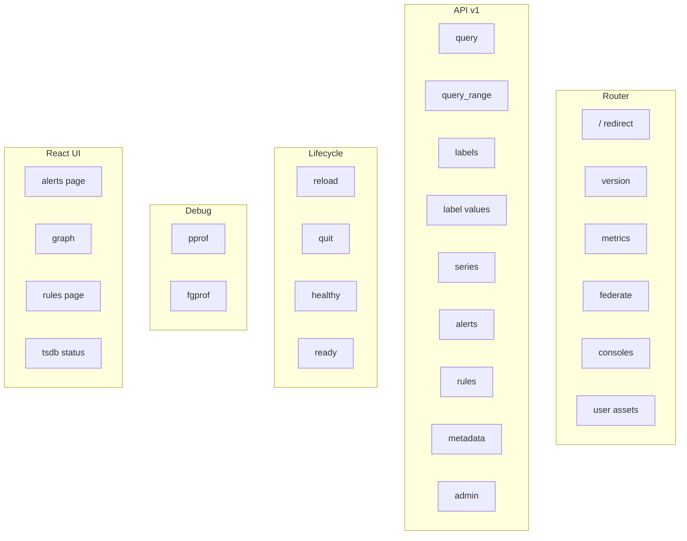

# 第15章 HTTP API

> 本章で読むソース
>
> - [`web/web.go`](https://github.com/prometheus/prometheus/blob/v3.12.0/web/web.go)
> - [`web/api/v1/api.go`](https://github.com/prometheus/prometheus/blob/v3.12.0/web/api/v1/api.go)
> - [`web/federate.go`](https://github.com/prometheus/prometheus/blob/v3.12.0/web/federate.go)

## この章の狙い

Prometheus は HTTP サーバーとして動作し、メトリクスのクエリや管理操作のための API を提供する。
本章では、`web` パッケージのルーティング設定、API v1 のエンドポイント一覧、Federation エンドポイント、およびライフサイクルエンドポイントの構成を読む。

## 前提

- 第9章（PromQL パーサー）のクエリパース
- 第10章（PromQL エンジン）のクエリ実行

## HTTP API のルート構造



## Handler：HTTP サーバーの初期化

`Handler` は [`web/web.go` の `New()` 関数（L326-L614）](https://github.com/prometheus/prometheus/blob/v3.12.0/web/web.go#L326-L614) で構築される。

ルーターには `github.com/prometheus/common/route` パッケージが使われる。
`route.New()` で作成されたルーターに、インストルメンテーション（メトリクス計測）がラップされる（L335-L337）。

```go
router := route.New().
	WithInstrumentation(m.instrumentHandler).
	WithInstrumentation(setPathWithPrefix(""))
```

API v1 のハンドラは `api_v1.NewAPI()`（L391-L437）で作成される。
`NewAPI()` には、クエリエンジン、ストレージ、ターゲット取得関数、ルール取得関数など、Prometheus 内部の各コンポーネントが注入される。

```go
h.apiV1 = api_v1.NewAPI(h.queryEngine, h.storage, app, appV2, h.exemplarStorage,
	factorySPr, factoryTr, factoryAr,
	func() config.Config { ... },
	o.Flags,
	api_v1.GlobalURLOptions{...},
	h.testReady,
	// ...
)
```

ルートパス `/` は `/query`（または旧UIでは `/graph`）へリダイレクトされる（L477-L479）。

```go
router.Get("/", func(w http.ResponseWriter, r *http.Request) {
	http.Redirect(w, r, path.Join(o.ExternalURL.Path, homePage), http.StatusFound)
})
```

## API v1 のエンドポイント

API v1 のエンドポイントは [`web/api/v1/api.go`](https://github.com/prometheus/prometheus/blob/v3.12.0/web/api/v1/api.go) 内で登録される。
主要なエンドポイントは次の通りである。

### クエリエンドポイント

- `GET /api/v1/query`：即時クエリ。`query` パラメーターに PromQL 式を受け取り、その時刻での評価結果を返す。
- `GET /api/v1/query_range`：範囲クエリ。`query`、`start`、`end`、`step` パラメーターを受け取り、一定間隔ごとの評価結果を返す。
- `GET /api/v1/query_exemplars`：エグザンプラクエリ。

### メタデータエンドポイント

- `GET /api/v1/labels`：ラベル名の一覧を返す。
- `GET /api/v1/label/:name/values`：特定ラベルの値の一覧を返す。
- `GET /api/v1/series`：特定のラベルマッチャーに一致する系列の一覧を返す。
- `GET /api/v1/metadata`：メトリクスのメタデータを返す。

### ステータスエンドポイント

- `GET /api/v1/alerts`：現在のアラート一覧を返す。
- `GET /api/v1/rules`：ルール一覧を返す。
- `GET /api/v1/status/runtimeinfo`：ランタイム情報を返す。
- `GET /api/v1/status/buildinfo`：ビルド情報を返す。
- `GET /api/v1/status/tsdb`：TSDB のステータス情報を返す。
- `GET /api/v1/status/walreplay`：WAL リプレイの進行状況を返す。

### 管理エンドポイント（`--web.enable-admin-api` が必要）

- `POST /api/v1/admin/tsdb/snapshot`：TSDB のスナップショットを作成する。
- `POST /api/v1/admin/tsdb/delete_series`：特定の系列を削除する。
- `POST /api/v1/admin/tsdb/clean_tombstones`：トゥームストーンを掃除する。

### リモート書き込みエンドポイント

- `POST /api/v1/write`：リモート書き込みリクエストを受け付ける（`--web.enable-remote-write-receiver` が必要）。
- `POST /api/v1/otlp/v1/metrics`：OTLP 書き込みリクエストを受け付ける（`--web.enable-otlp-write-receiver` が必要）。

レスポンスはすべて共通の JSON ラッパー形式で返される。

```json
{
  "status": "success",
  "data": { ... }
}
```

エラー時は `status` が `"error"` となり、`error` フィールドにエラー種別、`errorType` にエラーの種類が含まれる（L87-L97）。

```go
const (
	ErrorNone errorNum = iota
	ErrorTimeout
	ErrorCanceled
	ErrorExec
	ErrorBadData
	ErrorInternal
	ErrorUnavailable
	ErrorNotFound
	ErrorNotAcceptable
)
```

## Federation エンドポイント

Federation エンドポイントは [`web/federate.go` `L55-L311`](https://github.com/prometheus/prometheus/blob/v3.12.0/web/federate.go#L55-L311) に実装される。

`GET /federate` は、`match[]` パラメーターで指定されたラベルマッチャーに一致する最新のサンプルを、Prometheus  exposition format で返す。

```go
func (h *Handler) federation(w http.ResponseWriter, req *http.Request) {
	matcherSets, err := h.options.Parser.ParseMetricSelectors(req.Form["match[]"])
	// ...
	q, err := h.localStorage.Querier(mint, maxt)
	// ...
	for set.Next() {
		s := set.At()
		// 最新サンプルの取得
		valueType := it.Seek(maxt)
		// ...
		vec = append(vec, promql.Sample{...})
	}
	// ソートとエンコード
	enc.Encode(protMetricFam)
}
```

Federation は上位の Prometheus が下位の Prometheus からデータを収集するためのエンドポイントである。
外部ラベルの付与と、`lookbackDelta` 内の最新サンプル選択が特徴である。

## ライフサイクルエンドポイント

ライフサイクルエンドポイントは [`web/web.go` `L572-L612`](https://github.com/prometheus/prometheus/blob/v3.12.0/web/web.go#L572-L612) で登録される。

- `POST/PUT /-/reload`：設定ファイルの再読み込みをトリガーする。
- `POST/PUT /-/quit`：Prometheus プロセスの終了をトリガーする。
- `GET /-/healthy`：ヘルスチェック。常に 200 OK を返す。
- `GET /-/ready`： readiness チェック。起動完了後は 200 OK、起動中は 503 Service Unavailable を返す。

`testReady()`（[`web/web.go` L672-L690](https://github.com/prometheus/prometheus/blob/v3.12.0/web/web.go#L672-L690)）は readiness チェックを実装するラッパーである。

```go
func (h *Handler) testReady(f http.HandlerFunc) http.HandlerFunc {
	return func(w http.ResponseWriter, r *http.Request) {
		switch ReadyStatus(h.ready.Load()) {
		case Ready:
			f(w, r)
		case NotReady:
			w.Header().Set("X-Prometheus-Stopping", "false")
			w.WriteHeader(http.StatusServiceUnavailable)
			fmt.Fprintf(w, "Service Unavailable")
		case Stopping:
			w.Header().Set("X-Prometheus-Stopping", "true")
			w.WriteHeader(http.StatusServiceUnavailable)
			fmt.Fprintf(w, "Service Unavailable")
		default:
			w.WriteHeader(http.StatusInternalServerError)
			fmt.Fprintf(w, "Unknown state")
		}
	}
}
```

`SetReady()`（L655-L664）は起動処理完了後に `Ready` に設定される。
シャットダウン時は `Stopping` に遷移し、ロードバランサーにトラフィックを切り離させる。

`/-/lifecycle` と `/-/reload` は `--web.enable-lifecycle` フラグが有効な場合のみ実際の処理を行い、無効の場合は 403 Forbidden を返す（L572-L586）。

## インストルメンテーション

HTTP ハンドラは `metrics` 構造体（L141-L146）でインストルメンテーションされる。

```go
type metrics struct {
	requestCounter  *prometheus.CounterVec
	requestDuration *prometheus.HistogramVec
	responseSize    *prometheus.HistogramVec
	readyStatus     prometheus.Gauge
}
```

`instrumentHandler()`（L195）は `promhttp.InstrumentHandlerCounter` と `promhttp.InstrumentHandlerDuration` で各ハンドラをラップする。
これにより、`prometheus_http_requests_total`、`prometheus_http_request_duration_seconds`、`prometheus_http_response_size_bytes` のメトリクスが自動的に収集される。

## React UI

静的ファイルは `ui.Assets` から提供される（L501-L566）。
新しい UI（Mantine）と旧 UI（React）が切り替え可能で、`o.UseOldUI` フラグで制御される。
`index.html` 内のプレースホルダーは実行時に置き換えられる（L516-L521）。

```go
replacedIdx := bytes.ReplaceAll(idx, []byte("CONSOLES_LINK_PLACEHOLDER"), []byte(h.consolesPath()))
replacedIdx = bytes.ReplaceAll(replacedIdx, []byte("TITLE_PLACEHOLDER"), []byte(h.options.PageTitle))
```

## 高速化・最適化の工夫

API レスポンスのシリアライズには `json-iterator/go` が使われ、標準ライブラリの `encoding/json` より高速な JSON エンコード・デコードが可能である。

Federation エンドポイントでは、`sort.Slice` による系列のソートと `expfmt.NewEncoder` によるストリーミングエンコードにより、大規模なデータセットでもメモリ使用量を抑えながらレスポンスを生成する。

## まとめ

Prometheus の HTTP API は、クエリ実行、メタデータ取得、管理操作、Federation、ライフサイクル管理を一貫した JSON インターフェースで提供する。
`web/web.go` でルーティングと共通処理を、`web/api/v1/api.go` で API v1 の具体的なロジックを、`web/federate.go` で Federation のロジックをそれぞれ担当する。
インストルメンテーションにより、API 自体のパフォーマンスも監視可能である。

## 関連する章

- 第10章 PromQL エンジン：API 経由のクエリ実行
- 第12章 ルール評価：`/api/v1/rules` のデータソース
- 第14章 リモート書き込み：`/api/v1/write` の実装
