# 第16章 promtool

> 本章で読むソース
>
> - [`cmd/promtool/main.go`](https://github.com/prometheus/prometheus/blob/v3.12.0/cmd/promtool/main.go)

## この章の狙い

promtool は Prometheus の運用・開発を支援する CLI ツールである。
設定ファイルの検証、クエリのテスト、TSDB の分析、データのバックフィルなど、多岐にわたる機能を1つのバイナリにまとめる。
本章では、promtool のコマンド体系と代表的な機能の実装を読む。

## 前提

- 第2章（設定と起動フロー）の設定ファイル構成
- 第5章（TSDB アーキテクチャ）のブロック構造
- 第12章（ルール評価）のルールファイルフォーマット

## サブコマンド体系

promtool は kingpin ライブラリでコマンドライン引数をパースする。
`main()` 関数（[`cmd/promtool/main.go` `L99`](https://github.com/prometheus/prometheus/blob/v3.12.0/cmd/promtool/main.go#L99)）は、すべてのサブコマンドの定義とディスパッチを行う。

```mermaid
flowchart TD
    promtool["promtool"]
    promtool --> check["check"]
    promtool --> query["query"]
    promtool --> debug["debug"]
    promtool --> test["test"]
    promtool --> tsdb["tsdb"]
    promtool --> push["push"]
    promtool --> promql["promql\n（--experimental）"]

    check --> check_config["config"]
    check --> check_rules["rules"]
    check --> check_metrics["metrics"]
    check --> check_sd["service-discovery"]
    check --> check_web["web-config"]
    check --> check_health["healthy"]
    check --> check_ready["ready"]

    query --> query_instant["instant"]
    query --> query_range["range"]
    query --> query_series["series"]
    query --> query_labels["labels"]
    query --> query_analyze["analyze"]

    debug --> debug_pprof["pprof"]
    debug --> debug_metrics["metrics"]
    debug --> debug_all["all"]

    test --> test_rules["rules\n（ユニットテスト）"]

    tsdb --> tsdb_bench["bench write"]
    tsdb --> tsdb_analyze["analyze"]
    tsdb --> tsdb_list["list"]
    tsdb --> tsdb_dump["dump"]
    tsdb --> tsdb_import["create-blocks-from"]

    push --> push_metrics["metrics"]

    promql --> promql_format["format"]
    promql --> promql_labels["label-matchers"]
```



## check 系：静的検証

`check` サブコマンドは、Prometheus の設定やルールファイルの妥当性を検証する（L113-L175）。

### check config

`check config`（L126-L139）は Prometheus 設定ファイルを読み込み、構文エラーや論理的な問題を報告する。
`--lint` フラグで重複ルールの検出や、スクレイプ間隔のレート計算との不整合をチェックできる。

```go
checkConfigCmd := checkCmd.Command("config", "Check if the config files are valid or not.")
configFiles := checkConfigCmd.Arg("config-files", "The config files to check.").Required().ExistingFiles()
checkConfigLint := checkConfigCmd.Flag("lint", "...").Default(lintOptionDuplicateRules).String()
```

### check rules

`check rules`（L155-L167）はルールファイルを検証する。
YAML のパース、PromQL 式の構文チェック、重複ルールの検出を行う。
`lint` オプションで検出レベルを制御できる。

### check metrics

`check metrics`（L169-L174）は Prometheus  exposition format のメトリクスを標準入力から読み取り、promlint ルールに従って問題を報告する。
`--extended` フラグでカーディナリティ情報を出力する。

### check service-discovery

`check service-discovery`（L121-L124）は指定されたジョブ名でサービスディスカバリーを実行し、検出されたターゲットとリラベリング結果を表示する。
タイムアウトは `--timeout` で指定する。

```go
sdCheckCmd := checkCmd.Command("service-discovery", "Perform service discovery for the given job name...")
sdConfigFile := sdCheckCmd.Arg("config-file", "The prometheus config file.").Required().ExistingFile()
sdJobName := sdCheckCmd.Arg("job", "The job to run service discovery for.").Required().String()
```

### check web-config / healthy / ready

`check web-config`（L141-L142）は Web 設定ファイルの検証を行う。
`check healthy`（L147-L149）と `check ready`（L151-L153）は HTTP 経由で Prometheus サーバーのヘルスチェックと readiness チェックを実行する。

## query 系：リモートクエリ

`query` サブコマンドは、HTTP API を通じてリモートの Prometheus サーバーにクエリを実行する（L177-L222）。

`query instant`（L181-L185）は即時クエリ、`query range`（L187-L193）は範囲クエリ、`query series`（L195-L199）は系列クエリを実行する。
出力形式は `-o` フラグで `promql`（デフォルト）または `json` を選べる（L178）。

`query analyze`（L217-L222）はヒストグラムの使用パターンを分析する。
指定された時間範囲内のヒストグラムメトリクスのバケット分布を集計し、推奨設定値を提案する。

## test 系：ルールのユニットテスト

`test rules`（L237-L247）はルールのユニットテスト機能である。
テストケースは YAML ファイルで記述し、入力データと期待される出力を定義する。

```go
testRulesCmd := testCmd.Command("rules", "Unit tests for rules.")
testRulesRun := testRulesCmd.Flag("run", "If set, will only run test groups whose names match the regular expression.").Strings()
testRulesFiles := testRulesCmd.Arg("test-rule-file", "The unit test file.").Required().ExistingFiles()
```

テストは `promqltest.LazyLoader` を使って仮想的な時系列データを作成し、ルールを評価して期待値と比較する（L424-L436）。
`--debug` フラグで詳細な実行ログを出力でき、`--diff` フラグで期待値との差分を色付きで表示できる。

```go
os.Exit(RulesUnitTestResult(results,
	promqltest.LazyLoaderOpts{
		EnableAtModifier:         true,
		EnableNegativeOffset:     true,
		// ...
	},
	promtoolParser,
	*testRulesRun, *testRulesDiff, *testRulesDebug,
	*testRulesIgnoreUnknownFields,
	*testRulesFiles...),
)
```

## tsdb 系：TSDB 分析ツール

`tsdb` サブコマンドは TSDB の分析と操作を行う（L250-L305）。

### tsdb bench write

`tsdb bench write`（L252-L257）は書き込み性能のベンチマークを実行する。
指定されたメトリクス数とスクレイプ回数で疑似データを生成し、TSDB への書き込みパフォーマンスを計測する。

### tsdb analyze

`tsdb analyze`（L259-L264）は TSDB ブロックを分析し、ラベルペアのカーディナリティ、チャーンレート、コンパクション効率を報告する。
`--extended` フラグでより詳細な分析結果を出力する。
`--limit` フラグで表示件数を制御できる。

```go
tsdbAnalyzeCmd := tsdbCmd.Command("analyze", "Analyze churn, label pair cardinality and compaction efficiency.")
analyzePath := tsdbAnalyzeCmd.Arg("db path", "Database path (default is data/).").Default(defaultDBPath).String()
analyzeLimit := tsdbAnalyzeCmd.Flag("limit", "How many items to show in each list.").Default("20").Int()
```

### tsdb list

`tsdb list`（L266-L268）は TSDB のブロック一覧を表示する。
各ブロックの範囲、サイズ、系列数を人間可読な形式で出力する。

### tsdb dump / dump-openmetrics

`tsdb dump`（L270-L276）と `tsdb dump-openmetrics`（L278-L283）は TSDB のデータをダンプする。
`--match` フラグで出力する系列をフィルターでき、`--min-time` / `--max-time` で時間範囲を指定できる。

### tsdb create-blocks-from

`create-blocks-from` サブコマンド（L285-L305）は、OpenMetrics 形式の入力や既存の Prometheus サーバーのデータから TSDB ブロックを作成する。
`openmetrics` サブサブコマンド（L289-L292）は OpenMetrics ファイルを入力とし、`rules` サブサブコマンド（L293-L305）はリモートの Prometheus サーバーからデータをバックフィルする。

```go
importRulesCmd := importCmd.Command("rules", "Create blocks of data for new recording rules.")
importRulesCmd.Flag("url", "The URL for the Prometheus API...").Default("http://localhost:9090").URLVar(&serverURL)
importRulesStart := importRulesCmd.Flag("start", "The time to start backfilling...").Required().String()
```

`import rules` は新しいレコーディングルールを過去に遡って評価し、結果を TSDB ブロックとして保存する。
これにより、新規ルール追加後も過去のデータに対してルール評価結果を得られる。

## push 系：テストデータの送信

`push metrics`（L224-L235）はメトリクスをリモート書き込みエンドポイントに送信する。
テスト用途を想定しており、ファイルからメトリクスを読み込んで Prometheus Remote Write プロトコルで送信する。

```go
pushMetricsCmd := pushCmd.Command("metrics", "Push metrics to a prometheus remote write (for testing purpose only).")
pushMetricsCmd.Arg("remote-write-url", "Prometheus remote write url to push metrics.").Required().URLVar(&remoteWriteURL)
metricFiles := pushMetricsCmd.Arg("metric-files", "The metric files to push...").ExistingFiles()
```

PRW 1.0 と PRW 2.x の両方のプロトコルをサポートしており、`--protobuf_message` フラグで選択できる（L235）。

## promql 系：PromQL 編集（実験的）

`promql` サブコマンド（L307-L321）は `--experimental` フラグが必要である。
`promql format` は PromQL 式を整形し、`promql label-matchers` はラベルマッチャーの追加・削除を行う。

```go
promQLFormatCmd := promQLCmd.Command("format", "Format PromQL query to pretty printed form.")
promQLFormatQuery := promQLFormatCmd.Arg("query", "PromQL query.").Required().String()
```

これらのコマンドは `checkExperimental()`（L483-L488）でフラグの有無を確認する。

## debug 系：デバッグ情報の取得

`debug` サブコマンド（L201-L207）は、動作中の Prometheus サーバーからデバッグ情報を取得する。
`debug pprof` は pprof プロファイルを、`debug metrics` は `/metrics` の出力を、`debug all` は両方を含むすべてのデバッグ情報を取得する。

## 高速化・最適化の工夫

promtool は kingpin の `ExistingFiles()` バリデーターを使い、引数で指定されたファイルの存在をパース時に確認する。
これにより、不正な引数で処理が進むのを早期に防ぐ。

`tsdb bench write` は事前生成したサンプルデータを再利用可能な形で持ち、ベンチマークの再現性を確保している。
`tsdb analyze` はラベルカーディナリティの分析時に、各ラベルペアの出現頻度を効率的に集計する。

## まとめ

promtool は1つのバイナリに7つの主要サブコマンドを内包するマルチツールである。
check 系は設定の静的検証、query 系はリモートクエリ、test 系はルールのユニットテスト、tsdb 系は TSDB の分析と操作、push 系はテストデータの送信、promql 系は PromQL の編集、debug 系はサーバーのデバッグ情報取得を担当する。
これらはすべて `cmd/promtool/main.go` の kingpin 定義で統一的に管理され、各サブコマンドの実装関数にディスパッチされる。

## 関連する章

- 第2章 設定と起動フロー：`check config` の検証対象
- 第7章 ブロックフォーマット：`tsdb list`、`tsdb analyze` の分析対象
- 第12章 ルール評価：`check rules`、`test rules` の検証対象
- 第15章 HTTP API：`query`、`debug` の通信先
