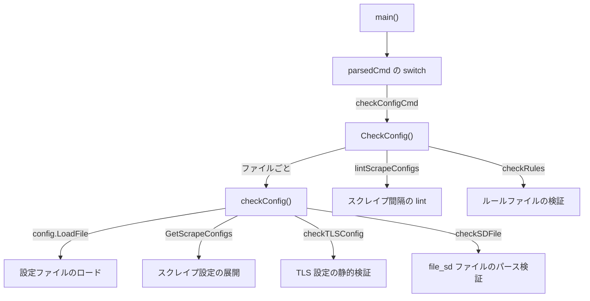

# 第16章 promtool

> 本章で読むソース
>
> - [`cmd/promtool/main.go`](https://github.com/prometheus/prometheus/blob/v3.12.0/cmd/promtool/main.go)
> - [`cmd/promtool/tsdb.go`](https://github.com/prometheus/prometheus/blob/v3.12.0/cmd/promtool/tsdb.go)
> - [`cmd/promtool/query.go`](https://github.com/prometheus/prometheus/blob/v3.12.0/cmd/promtool/query.go)
> - [`cmd/promtool/sd.go`](https://github.com/prometheus/prometheus/blob/v3.12.0/cmd/promtool/sd.go)
> - [`cmd/promtool/unittest.go`](https://github.com/prometheus/prometheus/blob/v3.12.0/cmd/promtool/unittest.go)

## この章の狙い

promtool は Prometheus の運用と開発を支援する CLI ツールである。
設定ファイルの検証、リモートサーバーへのクエリ、TSDB の分析、データのバックフィルなど、多岐にわたる機能を1つのバイナリにまとめる。
promtool のコマンド体系と、代表的なサブコマンドが入口の `main()` から実処理関数まで何をするかをたどる。

## 前提

- 第2章（設定と起動フロー）の設定ファイル構成
- 第7章（ブロックフォーマット）の TSDB ブロック構造
- 第12章（ルール評価）のルールファイルフォーマット
- 第15章（HTTP API）のクエリ API v1

## サブコマンド体系

promtool は kingpin ライブラリでコマンドライン引数をパースする。
`main()` 関数が、すべてのサブコマンドの定義と、パース結果に応じたディスパッチを1か所で行う。

```mermaid
flowchart TD
    promtool["promtool"]
    promtool --> check["check"]
    promtool --> query["query"]
    promtool --> debug["debug"]
    promtool --> test["test"]
    promtool --> tsdb["tsdb"]
    promtool --> push["push"]
    promtool --> promql["promql（--experimental）"]

    check --> check_config["config"]
    check --> check_rules["rules"]
    check --> check_metrics["metrics"]
    check --> check_sd["service-discovery"]
    check --> check_web["web-config"]
    check --> check_health["healthy / ready"]

    query --> query_instant["instant"]
    query --> query_range["range"]
    query --> query_series["series"]
    query --> query_labels["labels"]
    query --> query_analyze["analyze"]

    debug --> debug_pprof["pprof / metrics / all"]

    test --> test_rules["rules（ユニットテスト）"]

    tsdb --> tsdb_bench["bench write"]
    tsdb --> tsdb_analyze["analyze"]
    tsdb --> tsdb_list["list"]
    tsdb --> tsdb_dump["dump / dump-openmetrics"]
    tsdb --> tsdb_import["create-blocks-from"]

    push --> push_metrics["metrics"]

    promql --> promql_format["format"]
    promql --> promql_labels["label-matchers"]
```



`main()` は最後に `parsedCmd` で分岐し、選ばれたサブコマンドの実処理関数を呼んで `os.Exit()` する。

[`cmd/promtool/main.go L373-L393`](https://github.com/prometheus/prometheus/blob/v3.12.0/cmd/promtool/main.go#L373-L393)

```go
	switch parsedCmd {
	case sdCheckCmd.FullCommand():
		os.Exit(CheckSD(*sdConfigFile, *sdJobName, *sdTimeout, prometheus.DefaultRegisterer))

	case checkConfigCmd.FullCommand():
		os.Exit(CheckConfig(*agentMode, *checkSyntaxOnly, newConfigLintConfig(*checkConfigLint, *checkConfigLintFatal, *checkConfigIgnoreUnknownFields, model.UTF8Validation, model.Duration(*checkLookbackDelta)), promtoolParser, *configFiles...))

	case checkServerHealthCmd.FullCommand():
		os.Exit(checkErr(CheckServerStatus(serverURL, checkHealth, httpRoundTripper)))

	case checkServerReadyCmd.FullCommand():
		os.Exit(checkErr(CheckServerStatus(serverURL, checkReadiness, httpRoundTripper)))

	case checkWebConfigCmd.FullCommand():
		os.Exit(CheckWebConfig(*webConfigFiles...))

	case checkRulesCmd.FullCommand():
		os.Exit(CheckRules(newRulesLintConfig(*checkRulesLint, *checkRulesLintFatal, *checkRulesIgnoreUnknownFields, model.UTF8Validation), promtoolParser, *ruleFiles...))

	case checkMetricsCmd.FullCommand():
		os.Exit(CheckMetrics(*checkMetricsExtended, *checkMetricsLint))
```

各 `case` の右辺が実処理関数であり、返り値の終了コードをそのまま `os.Exit()` に渡す。
以降の節では、この各関数がファイルを読み、検証や実行を行う中身を追う。

## check 系：設定とルールの静的検証

`check` サブコマンドは、Prometheus の設定やルールファイルの妥当性を、サーバーを動かさずに検証する。

### 処理フロー：check config

`check config` の引数定義は次のとおりである。
`ExistingFiles()` バリデーターにより、指定ファイルが存在しなければパース段階で失敗する。

[`cmd/promtool/main.go L126-L139`](https://github.com/prometheus/prometheus/blob/v3.12.0/cmd/promtool/main.go#L126-L139)

```go
	checkConfigCmd := checkCmd.Command("config", "Check if the config files are valid or not.")
	configFiles := checkConfigCmd.Arg(
		"config-files",
		"The config files to check.",
	).Required().ExistingFiles()
	checkConfigSyntaxOnly := checkConfigCmd.Flag("syntax-only", "Only check the config file syntax, ignoring file and content validation referenced in the config").Bool()
	checkConfigLint := checkConfigCmd.Flag(
		"lint",
		"Linting checks to apply to the rules/scrape configs specified in the config. Available options are: "+strings.Join(lintConfigOptions, ", ")+". Use --lint=none to disable linting",
	).Default(lintOptionDuplicateRules).String()
```

`main()` は `CheckConfig()` を呼ぶ。
`CheckConfig()` は指定ファイルを1つずつ処理するループであり、各ファイルを `checkConfig()` に渡してルールファイル一覧とスクレイプ設定を取り出す。
構文チェックのみでなければ、`lintScrapeConfigs()` と `checkRules()` を続けて呼び、失敗の種類に応じて終了コードを分ける。

[`cmd/promtool/main.go L604-L637`](https://github.com/prometheus/prometheus/blob/v3.12.0/cmd/promtool/main.go#L604-L637)

```go
func CheckConfig(agentMode, checkSyntaxOnly bool, lintSettings configLintConfig, p parser.Parser, files ...string) int {
	failed := false
	hasErrors := false

	for _, f := range files {
		ruleFiles, scrapeConfigs, err := checkConfig(agentMode, f, checkSyntaxOnly)
		if err != nil {
			fmt.Fprintln(os.Stderr, "  FAILED:", err)
			hasErrors = true
			failed = true
		} else {
			if len(ruleFiles) > 0 {
				fmt.Printf("  SUCCESS: %d rule files found\n", len(ruleFiles))
			}
			fmt.Printf(" SUCCESS: %s is valid prometheus config file syntax\n", f)
		}
		fmt.Println()

		if !checkSyntaxOnly {
			scrapeConfigsFailed := lintScrapeConfigs(scrapeConfigs, lintSettings)
			failed = failed || scrapeConfigsFailed
			rulesFailed, rulesHaveErrors := checkRules(ruleFiles, lintSettings.rulesLintConfig, p, logger)
			failed = failed || rulesFailed
			hasErrors = hasErrors || rulesHaveErrors
		}
	}
	if failed && hasErrors {
		return failureExitCode
	}
	if failed && lintSettings.fatal {
		return lintErrExitCode
	}
	return successExitCode
}
```

`hasErrors` と `failed` を分けているのは、構文エラーと lint 違反で終了コードを変えるためである。
構文エラーがあれば `failureExitCode`、lint 違反のみで `--lint-fatal` が指定されていれば `lintErrExitCode` を返す。

検証の本体は `checkConfig()` である。
`config.LoadFile()` で設定を読み込み、`RuleFiles` を glob 展開し、`GetScrapeConfigs()` でスクレイプ設定を確定させる。

[`cmd/promtool/main.go L666-L703`](https://github.com/prometheus/prometheus/blob/v3.12.0/cmd/promtool/main.go#L666-L703)

```go
func checkConfig(agentMode bool, filename string, checkSyntaxOnly bool) ([]string, []*config.ScrapeConfig, error) {
	fmt.Println("Checking", filename)

	cfg, err := config.LoadFile(filename, agentMode, logger)
	if err != nil {
		return nil, nil, err
	}

	var ruleFiles []string
	// ... (中略：cfg.RuleFiles を filepath.Glob で展開し、明示ファイルの存在を確認) ...

	var scfgs []*config.ScrapeConfig
	if checkSyntaxOnly {
		scfgs = cfg.ScrapeConfigs
	} else {
		var err error
		scfgs, err = cfg.GetScrapeConfigs()
		if err != nil {
			return nil, nil, fmt.Errorf("error loading scrape configs: %w", err)
		}
	}
```

続いて `checkConfig()` は各スクレイプ設定を走査し、認証情報ファイルと TLS 設定、サービスディスカバリー設定を検証する。
TLS 設定の検証は `checkTLSConfig()` が担う。
証明書と鍵の片方だけが指定されている組み合わせを弾き、`checkSyntaxOnly` なら実ファイルへアクセスせず戻る。

[`cmd/promtool/main.go L793-L813`](https://github.com/prometheus/prometheus/blob/v3.12.0/cmd/promtool/main.go#L793-L813)

```go
func checkTLSConfig(tlsConfig promconfig.TLSConfig, checkSyntaxOnly bool) error {
	if tlsConfig.CertFile != "" && tlsConfig.KeyFile == "" {
		return fmt.Errorf("client cert file %q specified without client key file", tlsConfig.CertFile)
	}
	if tlsConfig.KeyFile != "" && tlsConfig.CertFile == "" {
		return fmt.Errorf("client key file %q specified without client cert file", tlsConfig.KeyFile)
	}

	if checkSyntaxOnly {
		return nil
	}

	if err := checkFileExists(tlsConfig.CertFile); err != nil {
		return fmt.Errorf("error checking client cert file %q: %w", tlsConfig.CertFile, err)
	}
	if err := checkFileExists(tlsConfig.KeyFile); err != nil {
		return fmt.Errorf("error checking client key file %q: %w", tlsConfig.KeyFile, err)
	}

	return nil
}
```

`file_sd` を使うスクレイプ設定では、参照先のターゲットファイルを `checkSDFile()` がパースする。
拡張子に応じて JSON か YAML としてデコードし、`nil` のターゲットグループが混じっていないかまで確認する。

[`cmd/promtool/main.go L815-L849`](https://github.com/prometheus/prometheus/blob/v3.12.0/cmd/promtool/main.go#L815-L849)

```go
func checkSDFile(filename string) ([]*targetgroup.Group, error) {
	fd, err := os.Open(filename)
	if err != nil {
		return nil, err
	}
	defer fd.Close()

	content, err := io.ReadAll(fd)
	if err != nil {
		return nil, err
	}

	var targetGroups []*targetgroup.Group

	switch ext := filepath.Ext(filename); strings.ToLower(ext) {
	case ".json":
		if err := json.Unmarshal(content, &targetGroups); err != nil {
			return nil, err
		}
	case ".yml", ".yaml":
		if err := yaml.UnmarshalStrict(content, &targetGroups); err != nil {
			return nil, err
		}
	default:
		return nil, fmt.Errorf("invalid file extension: %q", ext)
	}

	for i, tg := range targetGroups {
		if tg == nil {
			return nil, fmt.Errorf("nil target group item found (index %d)", i)
		}
	}

	return targetGroups, nil
}
```

以上の入口から実処理までの流れを図にすると次のようになる。



### check rules

`check rules` は `CheckRules()` を経て `checkRules()` に至る。
`checkRules()` は各ファイルを `rulefmt.ParseFile()` で読み、YAML パースと PromQL 式の構文検証を行ってから、`checkRuleGroups()` で重複ルールを検出する。

[`cmd/promtool/main.go L910-L942`](https://github.com/prometheus/prometheus/blob/v3.12.0/cmd/promtool/main.go#L910-L942)

```go
func checkRules(files []string, ls rulesLintConfig, p parser.Parser, logger *slog.Logger) (bool, bool) {
	failed := false
	hasErrors := false
	for _, f := range files {
		fmt.Println("Checking", f)
		rgs, errs := rulefmt.ParseFile(f, ls.ignoreUnknownFields, ls.nameValidationScheme, p, logger)
		if errs != nil {
			failed = true
			fmt.Fprintln(os.Stderr, "  FAILED:")
			for _, e := range errs {
				fmt.Fprintln(os.Stderr, e.Error())
				hasErrors = hasErrors || !errors.Is(e, errLint)
			}
			if hasErrors {
				continue
			}
		}
		if n, errs := checkRuleGroups(rgs, ls); errs != nil {
			fmt.Fprintln(os.Stderr, "  FAILED:")
			for _, e := range errs {
				fmt.Fprintln(os.Stderr, e.Error())
			}
			failed = true
			for _, err := range errs {
				hasErrors = hasErrors || !errors.Is(err, errLint)
			}
		} else {
			fmt.Printf("  SUCCESS: %d rules found\n", n)
		}
		fmt.Println()
	}
	return failed, hasErrors
}
```

`errors.Is(e, errLint)` で lint 由来のエラーとそれ以外を選り分けている点が、終了コードの分岐に対応する。
ファイル引数が空の場合は `checkRulesFromStdin()` に切り替わり、標準入力からルール定義を読む。

### check metrics

`check metrics` は標準入力から exposition 形式のメトリクスを読み、`promlint` で問題を報告する。
`--extended` を付けると、`checkMetricsExtended()` がメトリクスごとのカーディナリティを集計する。
メトリクスの型に応じてカーディナリティの数え方を変えるのが要点で、ヒストグラムはバケット数、サマリーは分位数を加味する。

[`cmd/promtool/main.go L1110-L1151`](https://github.com/prometheus/prometheus/blob/v3.12.0/cmd/promtool/main.go#L1110-L1151)

```go
func checkMetricsExtended(r io.Reader) ([]metricStat, int, error) {
	// Lacking information about what the intended validation scheme is, use the
	// deprecated library bool.
	//nolint:staticcheck
	p := expfmt.NewTextParser(model.NameValidationScheme)
	metricFamilies, err := p.TextToMetricFamilies(r)
	if err != nil {
		return nil, 0, fmt.Errorf("error while parsing text to metric families: %w", err)
	}

	var total int
	stats := make([]metricStat, 0, len(metricFamilies))
	for _, mf := range metricFamilies {
		var cardinality int
		switch mf.GetType() {
		case dto.MetricType_COUNTER, dto.MetricType_GAUGE, dto.MetricType_UNTYPED:
			cardinality = len(mf.Metric)
		case dto.MetricType_HISTOGRAM:
			// Histogram metrics includes sum, count, buckets.
			buckets := len(mf.Metric[0].Histogram.Bucket)
			cardinality = len(mf.Metric) * (2 + buckets)
		case dto.MetricType_SUMMARY:
			// Summary metrics includes sum, count, quantiles.
			quantiles := len(mf.Metric[0].Summary.Quantile)
			cardinality = len(mf.Metric) * (2 + quantiles)
		default:
			cardinality = len(mf.Metric)
		}
		stats = append(stats, metricStat{name: mf.GetName(), cardinality: cardinality})
		total += cardinality
	}

	for i := range stats {
		stats[i].percentage = float64(stats[i].cardinality) / float64(total)
	}

	sort.SliceStable(stats, func(i, j int) bool {
		return stats[i].cardinality > stats[j].cardinality
	})

	return stats, total, nil
}
```

集計後に `sort.SliceStable()` でカーディナリティ降順に並べ替え、寄与の大きいメトリクスを先頭に出す。

### check service-discovery

`check service-discovery` は `CheckSD()` に至る。
設定ファイルから対象ジョブのスクレイプ設定を取り出し、そのサービスディスカバリー設定ごとに Discoverer を起動して、タイムアウトまで検出結果を集める。

[`cmd/promtool/sd.go L76-L100`](https://github.com/prometheus/prometheus/blob/v3.12.0/cmd/promtool/sd.go#L76-L100)

```go
	targetGroupChan := make(chan []*targetgroup.Group)
	ctx, cancel := context.WithTimeout(context.Background(), sdTimeout)
	defer cancel()

	for _, cfg := range scrapeConfig.ServiceDiscoveryConfigs {
		reg := prometheus.NewRegistry()
		refreshMetrics := discovery.NewRefreshMetrics(reg)
		metrics := cfg.NewDiscovererMetrics(reg, refreshMetrics)
		err := metrics.Register()
		if err != nil {
			fmt.Fprintln(os.Stderr, "Could not register service discovery metrics", err)
			return failureExitCode
		}

		d, err := cfg.NewDiscoverer(discovery.DiscovererOptions{Logger: logger, Metrics: metrics})
		if err != nil {
			fmt.Fprintln(os.Stderr, "Could not create new discoverer", err)
			return failureExitCode
		}
		go func() {
			d.Run(ctx, targetGroupChan)
			metrics.Unregister()
			refreshMetrics.Unregister()
		}()
	}
```

集めたターゲットグループは `getSDCheckResult()` に渡され、`scrape.PopulateDiscoveredLabels()` と `scrape.PopulateLabels()` を通して、リラベリング前後のラベル集合を JSON で出力する。
これにより、実際にスクレイプする前にリラベリング結果を確認できる。

## query 系：リモートサーバーへのクエリ

`query` サブコマンドは、HTTP API v1 クライアント経由でリモートの Prometheus サーバーにクエリを実行する。
`query instant` の実処理 `QueryInstant()` は、`newAPI()` でクライアントを作り、`api.Query()` を呼んで結果を印字する。

[`cmd/promtool/query.go L64-L91`](https://github.com/prometheus/prometheus/blob/v3.12.0/cmd/promtool/query.go#L64-L91)

```go
func QueryInstant(url *url.URL, roundTripper http.RoundTripper, headers map[string]string, query, evalTime string, p printer) int {
	api, err := newAPI(url, roundTripper, headers)
	if err != nil {
		fmt.Fprintln(os.Stderr, "error creating API client:", err)
		return failureExitCode
	}

	eTime := time.Now()
	if evalTime != "" {
		eTime, err = parseTime(evalTime)
		if err != nil {
			fmt.Fprintln(os.Stderr, "error parsing evaluation time:", err)
			return failureExitCode
		}
	}

	// Run query against client.
	ctx, cancel := context.WithTimeout(context.Background(), 2*time.Minute)
	val, _, err := api.Query(ctx, query, eTime) // Ignoring warnings for now.
	cancel()
	if err != nil {
		return handleAPIError(err)
	}

	p.printValue(val)

	return successExitCode
}
```

クエリには2分のタイムアウトが付き、`p.printValue()` が `-o` フラグに応じて promql 形式か JSON 形式で出力する。
`query range` の `QueryRange()`、`query series` の `QuerySeries()` も同じ `newAPI()` を共有し、`api.QueryRange()` や `api.Series()` を呼ぶ。
`query analyze` はヒストグラムの使用パターンを分析する。

## test 系：ルールのユニットテスト

`test rules` はルールのユニットテストを実行する。
実処理 `RulesUnitTestResult()` は、テストファイルを1つずつ `ruleUnitTest()` に渡し、結果を JUnit XML に書き出す。

[`cmd/promtool/unittest.go L54-L84`](https://github.com/prometheus/prometheus/blob/v3.12.0/cmd/promtool/unittest.go#L54-L84)

```go
func RulesUnitTestResult(results io.Writer, queryOpts promqltest.LazyLoaderOpts, p parser.Parser, runStrings []string, diffFlag, debug, ignoreUnknownFields bool, files ...string) int {
	failed := false
	junit := &junitxml.JUnitXML{}

	var run *regexp.Regexp
	if runStrings != nil {
		run = regexp.MustCompile(strings.Join(runStrings, "|"))
	}

	for _, f := range files {
		if errs := ruleUnitTest(f, queryOpts, p, run, diffFlag, debug, ignoreUnknownFields, junit.Suite(f)); errs != nil {
			fmt.Fprintln(os.Stderr, "  FAILED:")
			for _, e := range errs {
				fmt.Fprintln(os.Stderr, e.Error())
				fmt.Println()
			}
			failed = true
		} else {
			fmt.Println("  SUCCESS")
		}
		fmt.Println()
	}
	err := junit.WriteXML(results)
	if err != nil {
		fmt.Fprintf(os.Stderr, "failed to write JUnit XML: %s\n", err)
	}
	if failed {
		return failureExitCode
	}
	return successExitCode
}
```

`--run` フラグは正規表現に変換され、テストグループ名のフィルターに使う。
テストの実体は `testGroup.test()` にある。
`promqltest.NewLazyLoader()` で入力系列を仮想ストレージに読み込み、`rules.NewManager()` でルールをロードして評価する。

[`cmd/promtool/unittest.go L236-L261`](https://github.com/prometheus/prometheus/blob/v3.12.0/cmd/promtool/unittest.go#L236-L261)

```go
	// Setup testing suite.
	// Set the start time from the test group.
	queryOpts.StartTime = tg.StartTimestamp.Time
	suite, err := promqltest.NewLazyLoader(tg.seriesLoadingString(), queryOpts)
	if err != nil {
		return []error{err}
	}
	defer func() {
		err := suite.Close()
		if err != nil {
			outErr = append(outErr, err)
		}
	}()
	suite.SubqueryInterval = evalInterval

	// Load the rule files.
	opts := &rules.ManagerOptions{
		QueryFunc:  rules.EngineQueryFunc(suite.QueryEngine(), suite.Storage()),
		Appendable: suite.Storage(),
		Context:    context.Background(),
		NotifyFunc: func(context.Context, string, ...*rules.Alert) {},
		Logger:     promslog.NewNopLogger(),
		Parser:     tg.parser,
	}
	m := rules.NewManager(opts)
	groupsMap, ers := m.LoadGroups(time.Duration(tg.Interval), tg.ExternalLabels, tg.ExternalURL, nil, ignoreUnknownFields, ruleFiles...)
```

`LazyLoader` は入力系列の記述文字列を受け取り、評価時刻ごとに `WithSamplesTill()` で必要な範囲までサンプルを供給する。
コメント「This avoids storing them in memory, as the number of evals might be high.」が示すとおり、全評価分のアラートをメモリに保持せず、時刻を進めながら遅延評価する。

## tsdb 系：TSDB の分析と操作

`tsdb` サブコマンドは、ローカルの TSDB ブロックを分析、一覧、ダンプし、ベンチマークやバックフィルを行う。

### tsdb list

`tsdb list` の実処理 `listBlocks()` は、読み取り専用で TSDB を開き、各ブロックのメタ情報を tabwriter で整形出力する。

[`cmd/promtool/tsdb.go L332-L346`](https://github.com/prometheus/prometheus/blob/v3.12.0/cmd/promtool/tsdb.go#L332-L346)

```go
func listBlocks(path string, humanReadable bool) error {
	db, err := tsdb.OpenDBReadOnly(path, "", nil)
	if err != nil {
		return err
	}
	defer func() {
		err = errors.Join(err, db.Close())
	}()
	blocks, err := db.Blocks()
	if err != nil {
		return err
	}
	printBlocks(blocks, true, humanReadable)
	return nil
}
```

### tsdb analyze

`tsdb analyze` の引数定義は次のとおりで、`--limit` が各ランキングの表示件数を決める。

[`cmd/promtool/main.go L259-L264`](https://github.com/prometheus/prometheus/blob/v3.12.0/cmd/promtool/main.go#L259-L264)

```go
	tsdbAnalyzeCmd := tsdbCmd.Command("analyze", "Analyze churn, label pair cardinality and compaction efficiency.")
	analyzePath := tsdbAnalyzeCmd.Arg("db path", "Database path (default is "+defaultDBPath+").").Default(defaultDBPath).String()
	analyzeBlockID := tsdbAnalyzeCmd.Arg("block id", "Block to analyze (default is the last block).").String()
	analyzeLimit := tsdbAnalyzeCmd.Flag("limit", "How many items to show in each list.").Default("20").Int()
	analyzeRunExtended := tsdbAnalyzeCmd.Flag("extended", "Run extended analysis.").Bool()
	analyzeMatchers := tsdbAnalyzeCmd.Flag("match", "Series selector to analyze. Only 1 set of matchers is supported now.").String()
```

実処理 `analyzeBlock()` は、ブロックのインデックスから全系列を走査する。
系列ごとに、ブロックの時間範囲のうちその系列がカバーしない区間 `uncovered` を求め、ラベル名とラベルペアを鍵とする複数のマップへ加算していく。

[`cmd/promtool/tsdb.go L473-L521`](https://github.com/prometheus/prometheus/blob/v3.12.0/cmd/promtool/tsdb.go#L473-L521)

```go
	labelsUncovered := map[string]uint64{}
	labelpairsUncovered := map[string]uint64{}
	labelpairsCount := map[string]uint64{}
	entries := 0
	var (
		postings index.Postings
		refs     []storage.SeriesRef
	)
	// ... (中略：--match 指定時は PostingsForMatchers で対象系列を絞り込む) ...

	chks := []chunks.Meta{}
	builder := labels.ScratchBuilder{}
	for postings.Next() {
		if err = ir.Series(postings.At(), &builder, &chks); err != nil {
			return err
		}
		// Amount of the block time range not covered by this series.
		uncovered := uint64(meta.MaxTime-meta.MinTime) - uint64(chks[len(chks)-1].MaxTime-chks[0].MinTime)
		builder.Labels().Range(func(lbl labels.Label) {
			key := lbl.Name + "=" + lbl.Value
			labelsUncovered[lbl.Name] += uncovered
			labelpairsUncovered[key] += uncovered
			labelpairsCount[key]++
			entries++
		})
	}
	if postings.Err() != nil {
		return postings.Err()
	}
	fmt.Printf("Postings (unique label pairs): %d\n", len(labelpairsUncovered))
	fmt.Printf("Postings entries (total label pairs): %d\n", entries)
```

集計後は、マップの各エントリを `postingInfo` のスライスに移し、`printInfo()` が `slices.SortFunc()` で降順ソートして上位 `limit` 件だけを印字する。
チャーンレート、共通ラベルペア、ラベル値長の累積、カーディナリティといったランキングを、この1回の走査で得たマップから順に生成する。

### tsdb bench write

`tsdb bench write` の実処理 `benchmarkWrite()` は、サンプルファイルからラベル集合を読み、`ingestScrapes()` で疑似スクレイプを繰り返して書き込み速度を計測する。
`ingestScrapes()` は、ラベル集合を最大1000件のバッチに切り分け、ゴルーチンで並行に書き込む。

[`cmd/promtool/tsdb.go L151-L176`](https://github.com/prometheus/prometheus/blob/v3.12.0/cmd/promtool/tsdb.go#L151-L176)

```go
func (b *writeBenchmark) ingestScrapes(lbls []labels.Labels, scrapeCount int) (uint64, error) {
	var total atomic.Uint64

	for i := 0; i < scrapeCount; i += 100 {
		var wg sync.WaitGroup
		lbls := lbls
		for len(lbls) > 0 {
			l := min(len(lbls), 1000)
			batch := lbls[:l]
			lbls = lbls[l:]

			wg.Go(func() {
				n, err := b.ingestScrapesShard(batch, 100, int64(timeDelta*i))
				if err != nil {
					// exitWithError(err)
					fmt.Println(" err", err)
				}
				total.Add(n)
			})
		}
		wg.Wait()
	}
	fmt.Println("ingestion completed")

	return total.Load(), nil
}
```

外側のループは1度に100スクレイプ分をまとめ、内側でラベルをシャードに分割して並行投入する。
バッチ境界で `wg.Wait()` するため、シャード間の書き込みは並行でも、100スクレイプ単位では順序が保たれる。

### tsdb dump / create-blocks-from

`tsdb dump` と `tsdb dump-openmetrics` は、`dumpTSDBData()` で系列とサンプルをテキスト出力する。
`--match` で系列を絞り、`--min-time` と `--max-time` で時間範囲を限定する。
`create-blocks-from openmetrics` は OpenMetrics ファイルから、`create-blocks-from rules` はリモートサーバーの過去データから TSDB ブロックを生成する。
後者は新しいレコーディングルールを過去に遡って評価し、結果をブロックとして保存する。

## push 系：テストデータの送信

`push metrics` は、ファイルまたは標準入力から読んだメトリクスを、Remote Write プロトコルでエンドポイントへ送る。
テスト用途を想定し、PRW 1.0 と PRW 2.x を `--protobuf_message` フラグで選べる。

## promql 系：PromQL の編集（実験的）

`promql` サブコマンドは `--experimental` フラグを要求する。
`promql format` は式を整形し、`promql label-matchers` はラベルマッチャーの追加や削除を行う。
ディスパッチ時に `checkExperimental()` を先に呼び、フラグが無ければメッセージを出して終了する。

## debug 系：サーバーのデバッグ情報取得

`debug pprof`、`debug metrics`、`debug all` は、動作中の Prometheus サーバーから pprof プロファイルや `/metrics` 出力を取得し、tar.gz に固める。
取得対象のエンドポイントは `pprofEndpoints` と `metricsEndpoints` にマップで定義され、pprof プロファイルは取得後に `profile.Parse()` で展開して保存する。

## 高速化・最適化の工夫

promtool の検証系には、機構レベルで指摘できる工夫が3つある。

1つ目は、ネットワークアクセスを伴わない静的検証である。
`checkConfig()` は `config.LoadFile()`、`checkTLSConfig()`、`checkSDFile()` を通して、設定ファイルとその参照先を読むだけで妥当性を判定する。
`checkTLSConfig()` は `checkSyntaxOnly` なら実ファイルのアクセスすら省き、`checkSDFile()` は SD ファイルをパースするだけでターゲットの実在確認は行わない。
これにより、Prometheus サーバーを起動せず、監視対象へも接続せずに設定の誤りを早期に検出できる。

2つ目は、`checkDuplicates()` のソートによる重複検出である。
全ルールをメトリクス名とラベルの組にしてスライスに集め、`sort.Sort()` で並べ替えてから隣接要素だけを比較する。

[`cmd/promtool/main.go L998-L1027`](https://github.com/prometheus/prometheus/blob/v3.12.0/cmd/promtool/main.go#L998-L1027)

```go
func checkDuplicates(groups []rulefmt.RuleGroup) []compareRuleType {
	var duplicates []compareRuleType
	var cRules compareRuleTypes

	for _, group := range groups {
		for _, rule := range group.Rules {
			cRules = append(cRules, compareRuleType{
				metric: ruleMetric(rule),
				label:  rules.FromMaps(group.Labels, rule.Labels),
			})
		}
	}
	if len(cRules) < 2 {
		return duplicates
	}
	sort.Sort(cRules)

	last := cRules[0]
	for i := 1; i < len(cRules); i++ {
		if compare(last, cRules[i]) == 0 {
			// Don't add a duplicated rule multiple times.
			if len(duplicates) == 0 || compare(last, duplicates[len(duplicates)-1]) != 0 {
				duplicates = append(duplicates, cRules[i])
			}
		}
		last = cRules[i]
	}

	return duplicates
}
```

総当たり比較なら組の数の2乗に比例するが、ソート後に隣接比較すれば計算量は並べ替えの `O(n log n)` に収まる。
重複は必ず隣り合うため、直前の要素との一致だけを見れば全重複を拾える。

3つ目は、`analyzeBlock()` のマップ集計による1パス分析である。
全系列の走査は1回にまとめ、ラベル名とラベルペアを鍵とする複数のマップへ同時に加算する。
チャーンレートやカーディナリティなど複数のランキングを、系列を読み直さずに1度の走査でまとめて求められる点が再走査を避ける工夫である。
一方、ランキング抽出そのものは top-k ヒープのような省略を行わない。
各カテゴリの全エントリを `postingInfo` のスライスへ移してから `slices.SortFunc()` で全体をソートし、表示だけを `limit` で打ち切る。

## まとめ

promtool は、1つのバイナリに check、query、test、tsdb、push、promql、debug の主要サブコマンドを内包するマルチツールである。
`main()` がすべてのコマンドを定義し、`parsedCmd` の分岐で実処理関数へディスパッチする。
check 系は設定とルールを静的に検証し、query 系は HTTP API v1 でリモートサーバーへ問い合わせ、test 系は `LazyLoader` でルールを仮想評価し、tsdb 系はブロックの分析と操作を行う。
検証系はサーバーを動かさずに設定の誤りを検出でき、分析系は1パスのマップ集計とソートで大きなブロックのカーディナリティを効率よく要約する。

## 関連する章

- [第2章 設定と起動フロー](../part00-overview/02-config-and-startup.md)：`check config` が読み込む設定ファイルの構造
- [第7章 ブロックフォーマットとコンパクション](../part02-tsdb/07-block-format-and-compaction.md)：`tsdb list`、`tsdb analyze` が読む対象
- [第12章 ルール評価](../part04-rules/12-rule-evaluation.md)：`check rules`、`test rules` が検証するルールの評価エンジン
- [第15章 HTTP API](15-http-api.md)：`query`、`debug` の通信先
