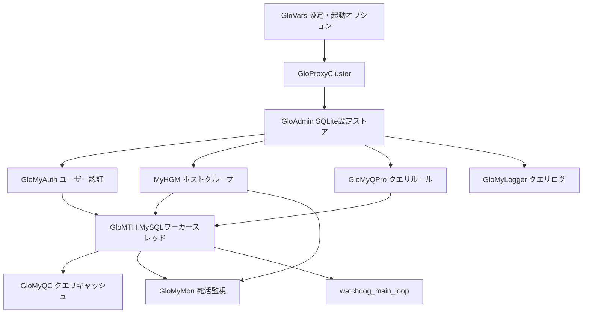

# 第1章 ProxySQL のアーキテクチャと起動シーケンス

> **本章で読むソース**
>
> - [`src/main.cpp`](https://github.com/sysown/proxysql/blob/v3.0.9/src/main.cpp)
> - [`include/proxysql_glovars.hpp`](https://github.com/sysown/proxysql/blob/v3.0.9/include/proxysql_glovars.hpp)
> - [`include/proxysql.h`](https://github.com/sysown/proxysql/blob/v3.0.9/include/proxysql.h)
> - [`include/MySQL_Thread.h`](https://github.com/sysown/proxysql/blob/v3.0.9/include/MySQL_Thread.h)

## この章の狙い

ProxySQL は、アプリケーションと MySQL と PostgreSQL のバックエンドサーバーの間に入る**プロキシ**である。

クライアントからは1台の MySQL サーバーに見えるが、内部ではクエリを解析し、ルールに従って複数のバックエンドへ振り分け、コネクションを使い回す。

本章では、`src/main.cpp` の `main()` 関数を起点に、ProxySQL がどのモジュールをどの順序で起動するかを追う。

各モジュールの内部実装は第1部以降の各章に譲り、本章は全体地図を作ることに専念する。

## ProxySQL が担う役割

ProxySQL は主に次の4つの役割を持つミドルウェアである。

- **プロトコルプロキシ**：MySQL と PostgreSQL のワイヤプロトコルをクライアント側とバックエンド側の双方で扱う。
- **コネクションプール**：バックエンドへの接続を維持し、複数のクライアントセッションで使い回す（**多重化**）。
- **ルーティング**：クエリの内容やユーザー、送信元に応じて、クエリルールに基づき接続先の**ホストグループ**を決める。
- **HA（高可用性）**：バックエンドの死活監視とレプリケーショントポロジの追跡を行い、障害時に自動でフェイルオーバーする。

これらの役割は単一のプロセス内で、複数のスレッドプールと共有オブジェクト群によって実現されている。

## グローバルオブジェクトの全体像

ProxySQL の各モジュールはシングルトンに近い形のグローバルポインタとして保持され、モジュール間の連携はこれらのポインタ経由で行われる。

主なグローバルオブジェクトは次のとおりである。

- **`GloVars`**（`ProxySQL_GlobalVariables` の実体）：起動オプション、設定ファイル、データディレクトリなどプロセス全体の設定を保持する。
- **`GloMTH`**（`MySQL_Threads_Handler`）：MySQL 用ワーカースレッドプールとリスナーを管理する（第2章）。
- **`GloPTH`**（`PgSQL_Threads_Handler`）：PostgreSQL 用の同等物である。
- **`MyHGM`**（`MySQL_HostGroups_Manager`）：ホストグループとバックエンドサーバーの状態を管理する（第13章）。
- **`GloMyQC`**（`MySQL_Query_Cache`）：クエリ結果のキャッシュを担う（第11章）。
- **`GloMyAuth`**（`MySQL_Authentication`）：ユーザー認証情報を保持する（第5章）。
- **`GloMyQPro`**（`MySQL_Query_Processor`）：クエリルールに基づくルーティングを担う（第9章）。
- **`GloMyMon`**（`MySQL_Monitor`）：バックエンドのヘルスチェックとレプリケーション監視を行う（第17章）。
- **`GloAdmin`**（`ProxySQL_Admin`）：Admin インターフェイスと SQLite バックエンドの設定ストアを提供する（第20章）。
- **`GloProxyCluster`**（`ProxySQL_Cluster`）：複数の ProxySQL インスタンス間で設定を同期する（第22章）。
- **`GloMyLogger`**（`MySQL_Logger`）：クエリログと監査ログを扱う（第23章）。

`GloPTH` 以下 `PgSQL_` 系のオブジェクトは PostgreSQL 経路向けの対応物であり、対応関係はほぼ1対1である（第7部）。

これらの宣言のうち、`GloVars` は
[`include/proxysql_structs.h` L1432](https://github.com/sysown/proxysql/blob/v3.0.9/include/proxysql_structs.h#L1432)
で、`GloMTH` は
[`include/proxysql_utils.h` L409](https://github.com/sysown/proxysql/blob/v3.0.9/include/proxysql_utils.h#L409)
で `extern` 宣言されている。

```cpp
extern MySQL_Threads_Handler *GloMTH;
```

`GloMTH` はポインタとして宣言される一方、`GloVars` は実体（`ProxySQL_GlobalVariables`）として宣言される。

`GloVars` はプロセス起動の最初期、他のどのモジュールよりも先に値を持つ必要があるため、動的確保に頼らず静的な実体として持たせている。

`GloVars` の構造は
[`include/proxysql_glovars.hpp` L69-L215](https://github.com/sysown/proxysql/blob/v3.0.9/include/proxysql_glovars.hpp#L69-L215)
で定義される `ProxySQL_GlobalVariables` クラスで確認できる。

```cpp
class ProxySQL_GlobalVariables {
	public:
	ez::ezOptionParser *opt;
	ProxySQL_ConfigFile *confFile;
	bool configfile_open;
	char *__cmd_proxysql_config_file;
	char *__cmd_proxysql_datadir;
	char *__cmd_proxysql_uuid;
	int __cmd_proxysql_nostart;
	int __cmd_proxysql_foreground;
	int __cmd_proxysql_gdbg;
	bool __cmd_proxysql_initial;
	bool __cmd_proxysql_reload;
```

コマンドラインオプション（`__cmd_proxysql_*`）、設定ファイルのパース結果（`confFile`）、データディレクトリ（`datadir`）が同じクラスにまとまっており、起動シーケンスの各段階はこの構造体を読み書きしながら進む。

## 起動シーケンス

`main()` は
[`src/main.cpp` L2731](https://github.com/sysown/proxysql/blob/v3.0.9/src/main.cpp#L2731)
から始まる。

デーモン化やグループレプリケーションのブートストラップモードなど分岐は多いが、通常起動の骨格は次の4フェーズに整理できる。

1. `ProxySQL_Main_init_phase2___not_started`：主要モジュールのインスタンス化と Admin モジュールの初期化。
2. `ProxySQL_Main_init_phase3___start_all`：スレッドプールの起動とリスナーの開始。
3. `watchdog_main_loop`：常駐監視ループ。
4. `ProxySQL_Main_init_phase4___shutdown`：シャットダウン処理。

フェーズ2とフェーズ3の呼び出しは
[`src/main.cpp` L3189-L3218](https://github.com/sysown/proxysql/blob/v3.0.9/src/main.cpp#L3189-L3218)
に現れる。

```cpp
__start_label:
	{
		cpu_timer t;
		ProxySQL_Main_init_phase2___not_started(bootstrap_info);
#ifdef DEBUG
		std::cerr << "Main init phase2 completed in ";
#endif
	}
	if (glovars.shutdown) {
		goto __shutdown;
	}

	{
		cpu_timer t;
		if (ProxySQL_Main_init_phase3___start_all() == false) {
			goto finish;
		}
#ifdef DEBUG
		std::cerr << "Main init phase3 completed in ";
#endif
	}
#ifdef DEBUG
		std::cerr << "WARNING: this is a DEBUG release and can be slow or perform poorly. Do not use it in production" << std::endl;
#endif
	proxy_info("For information about products and services visit: https://proxysql.com/\n");
	proxy_info("For online documentation visit: https://proxysql.com/documentation/\n");
	proxy_info("For support visit: https://proxysql.com/services/support/\n");
	proxy_info("For consultancy visit: https://proxysql.com/services/consulting/\n");

	watchdog_main_loop();
```

`__start_label` はシャットダウン後の設定リロード（`goto __start_label`）でも再利用されるラベルである。

つまり ProxySQL の「起動」は、リロード時に同じ手順を再実行する処理でもある。

### フェーズ2：主要モジュールのインスタンス化

`ProxySQL_Main_init_phase2___not_started` は
[`src/main.cpp` L1519-L1581](https://github.com/sysown/proxysql/blob/v3.0.9/src/main.cpp#L1519-L1581)
にある。

```cpp
void ProxySQL_Main_init_phase2___not_started(const bootstrap_info_t& boostrap_info) {
	std::string msg;
	ProxySQL_create_or_load_TLS(false, msg);

	LoadPlugins();

	ProxySQL_Main_init_main_modules();

// GenAI init moved entirely to the genai plugin's init/start
// callbacks (Steps 4.C and 5).  No core invocation needed.

#ifdef PROXYSQL40
	// Four-phase plugin lifecycle (chassis only — v3.x has no plugin
	// loader at all):
	//   Phase A+B: dlopen + register_schemas (plugin-declared schemas
	//              populate the pending-tables list).
	//   Phase C:   admin module init merges plugin-declared schemas into
	//              tables_defs_{admin,config,stats} and runs the DDL via
	//              check_and_build_standard_tables, all on the same
	//              first-boot/reload code path as the core tables.
	//   Phase D:   init() with full services (live DB handles pointing at
	//              a schema that already contains the plugin's own tables).
	//   Phase E:   start() launches the plugin's threads / accept loops.
	LoadConfiguredPlugins();
	ProxySQL_Main_init_Admin_module(boostrap_info);
	InitConfiguredPlugins();
	StartConfiguredPlugins();
#else  /* !PROXYSQL40 */
	// v3.0/v3.1 builds: no plugin loader.  Plain admin init only.
	ProxySQL_Main_init_Admin_module(boostrap_info);
#endif /* PROXYSQL40 */
	GloMTH->print_version();
```

`PROXYSQL40` はプラグインチャシー機構を囲むコンパイル時マクロであり、v3.0.9 の標準ビルドでは定義されない。

このマクロが未定義のときは `#else` 側の `ProxySQL_Main_init_Admin_module` が直接呼ばれ、素の Admin 初期化だけが行われる。

このフェーズの中核は `ProxySQL_Main_init_main_modules` である。

[`src/main.cpp` L920-L962](https://github.com/sysown/proxysql/blob/v3.0.9/src/main.cpp#L920-L962)
を見ると、ホストグループ管理、スレッドハンドラ、ロガー、ステートメントマネージャが、この時点でまとめて生成されることがわかる。

```cpp
void ProxySQL_Main_init_main_modules() {
	GloMyQC=NULL;
	GloPgQC=NULL;
	GloMyQPro=NULL;
	GloMTH=NULL;
	GloMyAuth=NULL;
	GloPgAuth=NULL;
	GloPTH=NULL;
// MCP_Threads_Handler / GenAI_Threads_Handler / AI_Features_Manager
// are all constructed by the genai plugin's init() callback now
// (Steps 4.C and 5).  Core has no PROXYSQL40 plugin-dedicated initializers here.
#ifdef PROXYSQLCLICKHOUSE
	GloClickHouseAuth=NULL;
#endif /* PROXYSQLCLICKHOUSE */
	GloMyMon=NULL;
	GloMyLogger=NULL;
	GloPgSQL_Logger = NULL;
	GloMyStmt=NULL;
	GloPgStmt = NULL;
	// initialize libev
	if (!ev_default_loop (EVBACKEND_POLL | EVFLAG_NOENV)) {
		fprintf(stderr,"could not initialise libev");
		exit(EXIT_FAILURE);
	}

	MyHGM=new MySQL_HostGroups_Manager();
	MyHGM->init();

	MySQL_Threads_Handler * _tmp_GloMTH = NULL;
	_tmp_GloMTH=new MySQL_Threads_Handler();
	GloMTH = _tmp_GloMTH;
	GloMyLogger = new MySQL_Logger();
	GloMyLogger->print_version();
	GloPgSQL_Logger = new PgSQL_Logger();
	GloPgSQL_Logger->print_version();
	GloMyStmt=new MySQL_STMT_Manager_v14();
	GloPgStmt=new PgSQL_STMT_Manager();
	PgHGM = new PgSQL_HostGroups_Manager();
	PgHGM->init();
	PgSQL_Threads_Handler* _tmp_GloPTH = NULL;
	_tmp_GloPTH = new PgSQL_Threads_Handler();
	GloPTH = _tmp_GloPTH;
}
```

この時点ではまだ `MySQL_Threads_Handler::init()`（実際にワーカースレッドを立ち上げる処理）は呼ばれていない。

生成されるのはハンドラのインスタンスだけであり、スレッドの起動はフェーズ3に持ち越される。

次いで `ProxySQL_Main_init_Admin_module` が Cluster モジュールと Admin モジュールを生成する。

[`src/main.cpp` L964-L981](https://github.com/sysown/proxysql/blob/v3.0.9/src/main.cpp#L964-L981)

```cpp
void ProxySQL_Main_init_Admin_module(const bootstrap_info_t& bootstrap_info) {
	// cluster module needs to be initialized before
	GloProxyCluster = new ProxySQL_Cluster();
	GloProxyCluster->init();
	GloProxyCluster->print_version();
	GloProxyStats = new ProxySQL_Statistics();
	//GloProxyStats->init();
	GloProxyStats->print_version();
	GloAdmin = new ProxySQL_Admin();
	if (!GloAdmin->init(bootstrap_info)) {
		proxy_error("Admin module initialization failed\n");
		exit(EXIT_FAILURE);
	}
	GloAdmin->print_version();
	if (binary_sha1) {
		proxy_info("ProxySQL SHA1 checksum: %s\n", binary_sha1);
	}
}
```

コメントの `cluster module needs to be initialized before` が示すとおり、`GloProxyCluster` は `GloAdmin` より先に生成する必要がある。

`ProxySQL_Admin::init` は SQLite 上の設定テーブルを読み込みながら Cluster 側のフックを利用するため、Cluster オブジェクトが未生成だとこの依存が満たせない。

フェーズ2の最後には認証モジュール（`ProxySQL_Main_init_Auth_module`）が起動し、Admin が読み込んだユーザー定義を `GloMyAuth` へ反映する。

### フェーズ3：スレッドプールとリスナーの起動

`ProxySQL_Main_init_phase3___start_all` は
[`src/main.cpp` L1594-L1594](https://github.com/sysown/proxysql/blob/v3.0.9/src/main.cpp#L1594)
以降にあり、Query Processor、MySQL/PostgreSQL のスレッドハンドラ、Query Cache を初期化したうえでリスナーを開き、最後に Monitor を起動する。

呼び出し順序は次のとおりである（
[`src/main.cpp` L1613-L1727](https://github.com/sysown/proxysql/blob/v3.0.9/src/main.cpp#L1613-L1727)
）。

```cpp
	// Initialized monitor, no matter if it will be started or not
	GloMyMon = new MySQL_Monitor();
	GloPgMon = new PgSQL_Monitor();
	// load all mysql servers to GloHGH
	{
		cpu_timer t;
		GloAdmin->init_mysql_servers();
		GloAdmin->init_pgsql_servers();
		GloAdmin->init_proxysql_servers();
		GloAdmin->load_scheduler_to_runtime();
#ifdef DEBUG
		std::cerr << "Main phase3 : GloAdmin initialized in ";
#endif
	}
	{
		cpu_timer t;
		ProxySQL_Main_init_Query_module();
#ifdef DEBUG
		std::cerr << "Main phase3 : Query Processor initialized in ";
#endif
	}
	{
		cpu_timer t;
		ProxySQL_Main_init_MySQL_Threads_Handler_module();
#ifdef DEBUG
		std::cerr << "Main phase3 : MySQL Threads Handler initialized in ";
#endif
	}
```

`GloAdmin->init_mysql_servers()` によって、SQLite に保存されたバックエンドサーバー一覧が `MyHGM`（ホストグループマネージャ）へロードされる。

これはワーカースレッドがまだ1本も走っていない段階で行われる。

つまり、ワーカースレッドが最初のクライアント接続を受け付ける時点で、ルーティング先のバックエンド一覧はすでに揃っている。

続いて `ProxySQL_Main_init_MySQL_Threads_Handler_module` が実際にワーカースレッドを生成する。

[`src/main.cpp` L1010-L1031](https://github.com/sysown/proxysql/blob/v3.0.9/src/main.cpp#L1010-L1031)

```cpp
void ProxySQL_Main_init_MySQL_Threads_Handler_module() {
	unsigned int i;
	GloMTH->init();
	load_ = 1;
	load_ += GloMTH->num_threads;
#ifdef IDLE_THREADS
	if (GloVars.global.idle_threads) {
		load_ += GloMTH->num_threads;
	} else {
		proxy_warning("proxysql instance running without --idle-threads : most workloads benefit from this option\n");
		proxy_warning("proxysql instance running without --idle-threads : enabling it can potentially improve performance\n");
	}
#endif // IDLE_THREADS
	for (i=0; i<GloMTH->num_threads; i++) {
		GloMTH->create_thread(i,mysql_worker_thread_func, false);
#ifdef IDLE_THREADS
		if (GloVars.global.idle_threads) {
			GloMTH->create_thread(i,mysql_worker_thread_func_idles, true);
		}
#endif // IDLE_THREADS
	}
}
```

`GloMTH->num_threads` 本のワーカースレッドが `mysql_worker_thread_func` を実行して立ち上がる（詳細は第2章）。

PostgreSQL 側も `ProxySQL_Main_init_PgSQL_Threads_Handler_module` で対になる処理が行われる。

その後、リスナーソケットのオープン前に、Admin と MySQL と PostgreSQL の各インターフェイス設定同士でポートが衝突していないかを検証する処理が入る。

[`src/main.cpp` L1663-L1695](https://github.com/sysown/proxysql/blob/v3.0.9/src/main.cpp#L1663-L1695)

```cpp
	{
		char* admin_mysql_ifaces = GloAdmin->get_variable((char*)"mysql_ifaces");
		char* admin_pgsql_ifaces = GloAdmin->get_variable((char*)"pgsql_ifaces");
		char* admin_telnet_ifaces = GloAdmin->get_variable((char*)"telnet_admin_ifaces");
		char* admin_stats_ifaces = GloAdmin->get_variable((char*)"telnet_stats_ifaces");
		char* mysql_ifaces = GloMTH->get_variable((char*)"interfaces");
		char* pgsql_ifaces = GloPTH->get_variable((char*)"interfaces");

		std::vector<proxysql_listen_validator::module_listener_config> modules {
			{ "Admin", admin_mysql_ifaces },
			{ "Admin PostgreSQL", admin_pgsql_ifaces },
			{ "Admin Telnet", admin_telnet_ifaces },
			{ "Admin Stats Telnet", admin_stats_ifaces },
			{ "MySQL", mysql_ifaces },
			{ "PostgreSQL", pgsql_ifaces },
		};
		std::string error {};
		bool valid = proxysql_listen_validator::validate_module_listener_conflicts(modules, error);
```

検証に失敗すると `ProxySQL_Main_init_phase3___start_all` は `false` を返し、`main()` はリスナーを開かないまま起動を中断する。

検証を通過すると、`GloMTH->start_listeners()` と `GloPTH->start_listeners()` がそれぞれの待受ソケットを開く。

最後に Monitor モジュールが起動する。

[`src/main.cpp` L1720-L1727](https://github.com/sysown/proxysql/blob/v3.0.9/src/main.cpp#L1720-L1727)

```cpp
	if (GloVars.global.my_monitor==true)
		{
			cpu_timer t;
			ProxySQL_Main_init_MySQL_Monitor_module();
#ifdef DEBUG
			std::cerr << "Main phase3 : MySQL Monitor initialized in ";
#endif
		}
```

Monitor はワーカースレッドやリスナーが起動し終えた後に開始される。

バックエンドの死活監視はクライアントを受け付ける前提のホストグループ一覧が確定して初めて意味を持つため、この順序になっていると考えられる（第17章）。

### フェーズ4以降：常駐ループとシャットダウン

すべてのモジュールが起動すると、`watchdog_main_loop` が呼ばれる。

[`src/main.cpp` L2566-L2585](https://github.com/sysown/proxysql/blob/v3.0.9/src/main.cpp#L2566-L2585)

```cpp
void watchdog_main_loop() {
#if 0
	{
		// the following commented code is here only to manually test handleProcessRestart()
		// DO NOT ENABLE
		//proxy_info("Service is up\n");
		//sleep(2);
		//assert(0);
	}
#endif

	WatchdogGroup groups[ENTITY_TYPE_COUNT] = {
		{ ENTITY_TYPE_MYSQL, "MySQL", GloMTH, 0, monotonic_time() },
		{ ENTITY_TYPE_POSTGRESQL, "PostgreSQL", GloPTH, 0, monotonic_time() }
	};

	unsigned int inner_loops = 0;
	unsigned long long time_next_version_check = 0;
	unsigned long long loop_prev_time = monotonic_time();
	while (glovars.shutdown == 0) {
		std::this_thread::sleep_for(std::chrono::microseconds(200000));
```

このループ自身はリクエストを処理しない。

200ミリ秒間隔でスリープしながら、バージョンチェックのスケジューリングと、スレッドハンドラの詰まり検知（ウォッチドッグ）だけを行う。

実際のクライアント処理は、フェーズ3で立ち上げたワーカースレッド群が別途担っている。

`glovars.shutdown` が立つとループを抜け、`ProxySQL_Main_init_phase4___shutdown` によって各モジュールが逆順に停止される。

設定リロード時は `goto __start_label` によってフェーズ2からやり直され、GloVars 以外のグローバルオブジェクトは一度破棄されて作り直される。

## 全体のモジュール構成

ここまでの起動シーケンスをモジュール間の依存関係として整理すると、次のようになる。



Admin モジュールが設定の唯一の入口となり、認証、ホストグループ、クエリルールという3系統の実行時状態を組み立てたあとで、はじめてワーカースレッドプールが起動する構図になっている。

## 高速化と最適化の工夫：起動順序による初期化コストの前倒し

ProxySQL は、クライアントを受け付けるワーカースレッド（`GloMTH`）を起動する前に、ホストグループ、クエリルール、ユーザー認証といった実行時状態をすべて `GloAdmin` 経由でメモリ上に構築し終える。

`ProxySQL_Main_init_MySQL_Threads_Handler_module` が呼ばれる時点で `GloAdmin->init_mysql_servers()` や `ProxySQL_Main_init_Query_module()` はすでに完了しており、ワーカースレッドはロック待ちや遅延ロードを介さずにルーティングテーブルへアクセスできる。

もし逆の順序で先にリスナーを開いてしまうと、最初の数リクエストがホストグループ未確定のまま到着し、初期化中の共有データ構造への同時アクセスを調停する仕組みが別途必要になる。

起動順序をあらかじめ「設定構築が全て終わってからリスナーを開く」という一方向の依存関係にしておくことで、ワーカースレッド側の実行経路から初期化状態のチェックを排除できる。

## まとめ

ProxySQL の起動は、`GloVars` による設定読み込みに始まり、Cluster、Admin、認証、ホストグループ、クエリルールという順にグローバルオブジェクトを組み立て、最後にワーカースレッドプールとリスナーを起動する4フェーズの手順として実装されている。

常駐後の `watchdog_main_loop` はリクエスト処理を行わない監視専用のループであり、実際のプロトコル処理は別途起動されたワーカースレッド群に委ねられる。

この章で見たグローバルオブジェクトと起動順序は、以降の各章を読む際の見取り図として使う。

## 関連する章

- [第2章 スレッドモデルと MySQL_Thread のイベントループ](../part01-thread/02-thread-model.md)
- [第3章 MySQL_Data_Stream による接続の状態機械とバッファリング](../part01-thread/03-data-stream.md)
- [第4章 MySQL プロトコルの解析と生成](../part02-protocol/04-mysql-protocol.md)
- [第7章 MySQL_Session の状態機械](../part03-session/07-session-state-machine.md)
- [第13章 Hostgroups Manager とサーバー管理](../part04-backend/13-hostgroups-manager.md)
- [第17章 MySQL Monitor によるヘルスチェック](../part05-ha/17-monitor.md)
- [第20章 Admin インターフェイスと SQLite 設定バックエンド](../part06-admin/20-admin-interface.md)
- [第22章 ProxySQL Cluster による設定同期](../part06-admin/22-cluster-sync.md)
