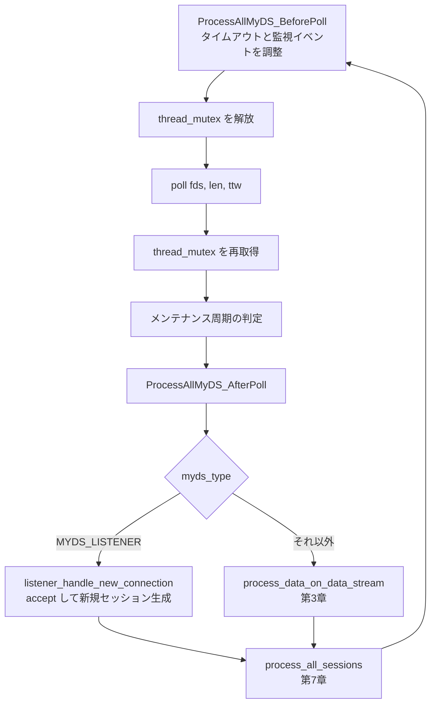

# 第2章 スレッドモデルと MySQL_Thread のイベントループ

> **本章で読むソース**
>
> - [`lib/MySQL_Thread.cpp`](https://github.com/sysown/proxysql/blob/v3.0.9/lib/MySQL_Thread.cpp)
> - [`include/MySQL_Thread.h`](https://github.com/sysown/proxysql/blob/v3.0.9/include/MySQL_Thread.h)
> - [`lib/Base_Thread.cpp`](https://github.com/sysown/proxysql/blob/v3.0.9/lib/Base_Thread.cpp)
> - [`include/Base_Thread.h`](https://github.com/sysown/proxysql/blob/v3.0.9/include/Base_Thread.h)
> - [`include/ProxySQL_Poll.h`](https://github.com/sysown/proxysql/blob/v3.0.9/include/ProxySQL_Poll.h)
> - [`lib/ProxySQL_Poll.cpp`](https://github.com/sysown/proxysql/blob/v3.0.9/lib/ProxySQL_Poll.cpp)
> - [`include/thread.h`](https://github.com/sysown/proxysql/blob/v3.0.9/include/thread.h)
> - [`include/wqueue.h`](https://github.com/sysown/proxysql/blob/v3.0.9/include/wqueue.h)

## この章の狙い

ProxySQL はクライアントからの1接続に対して1スレッドを割り当てない。
固定本数のワーカースレッドが、それぞれ数千の接続を同時に処理する。
この章では、1本のワーカースレッドが多数のセッションをどう多重化して回しているか、`MySQL_Thread::run()` のメインループを読みながら追う。

## 前提

ProxySQL のスレッドは大きく2種類に分かれる。
クライアントからの接続を実際にさばく**ワーカースレッド**（`MySQL_Thread`）と、その集合を束ねる `MySQL_Threads_Handler` である。
`MySQL_Threads_Handler` はスレッド数分の `MySQL_Thread` を生成し、リスナーソケットの登録や設定変数の反映といった横断的な操作を担う。

`MySQL_Thread` は `Base_Thread` を継承する。
`Base_Thread` は MySQL 用と PostgreSQL 用のスレッド（`PgSQL_Thread`）に共通するメインループの部品（ポーリング前後の処理、タイムアウト検査など）をテンプレートメソッドとして提供する。
さらに遡ると `Thread` クラスがあり、これは POSIX スレッドを起動する薄いラッパーである。

[`include/thread.h` L37-L55](https://github.com/sysown/proxysql/blob/v3.0.9/include/thread.h#L37-L55)

```cpp
class Thread
{
  public:
    Thread();
    virtual ~Thread();

    int start(unsigned int ss=64, bool jemalloc_tcache=true);
    int join();
// commenting the following code because we don't use it
//    int detach();
//    pthread_t self();
    
    virtual void* run() = 0;
    
  private:
    pthread_t  m_tid;
    int        m_running;
    int        m_detached;
};
```

`run()` が純粋仮想関数として宣言されており、`MySQL_Thread` がこれをオーバーライドしてメインループを実装する。
なお `include/wqueue.h` はミューテックスと条件変数で保護された素朴なキュー実装だが、`MySQL_Thread` のメインループ自体はこのキューに依存しない。
ワーカー間でセッションを受け渡す経路（アイドルスレッドへの移送など）は、`PtrArray` と専用のミューテックスで実装されている。

## ワーカースレッドが握る状態

1本の `MySQL_Thread` は、自分が担当するセッション群と、それらに紐づくファイルディスクリプタ（fd）の集合を保持する。
fd の集合は `ProxySQL_Poll` というクラスにまとめられている。

[`include/ProxySQL_Poll.h` L27-L52](https://github.com/sysown/proxysql/blob/v3.0.9/include/ProxySQL_Poll.h#L27-L52)

```cpp
template<class T>
class ProxySQL_Poll {
	private:
	void shrink();
	void expand(unsigned int more);

	public:
	unsigned int len;
	unsigned int size;
	struct pollfd *fds;
	T **myds;
	unsigned long long *last_recv;
	unsigned long long *last_sent;
	volatile int pending_listener_add;
	volatile int pending_listener_del;
	unsigned int poll_timeout;
	unsigned long loops;
	StatCounters *loop_counters;

	ProxySQL_Poll();
	~ProxySQL_Poll();
	void add(uint32_t _events, int _fd, T *_myds, unsigned long long sent_time);
	void update_fd_at_index(unsigned int idx, int _fd);
	void remove_index_fast(unsigned int i);
	int find_index(int fd);
};
```

`fds` は `poll(2)` にそのまま渡す `struct pollfd` の配列であり、`myds[i]` が `fds[i]` に対応する**データストリーム**（`MySQL_Data_Stream`）を指す。
データストリームの詳細は第3章で扱う。
両者は同じ添字 `i` で対応づけられており、`fds[i].revents` に何が立ったかを見れば、対応する `myds[i]` を O(1) で引ける。
`T` はテンプレート引数であり、`lib/ProxySQL_Poll.cpp` の末尾で `MySQL_Data_Stream` と `PgSQL_Data_Stream` の2種類に実体化される。

[`lib/ProxySQL_Poll.cpp` L292-L293](https://github.com/sysown/proxysql/blob/v3.0.9/lib/ProxySQL_Poll.cpp#L292-L293)

```cpp
template class ProxySQL_Poll<PgSQL_Data_Stream>;
template class ProxySQL_Poll<MySQL_Data_Stream>;
```

MySQL 経路と PostgreSQL 経路で `ProxySQL_Poll` の実装を共有していることがわかる。
本章は MySQL 経路（`MySQL_Thread`）を主軸に読み進める。

## run() のメインループ

`MySQL_Thread::run()` が1本のワーカースレッドの本体である。
ループの1周は次の順に進む。

1. `ProcessAllMyDS_BeforePoll()` で、次の `poll()` に向けて各 fd の監視イベント（`POLLIN`/`POLLOUT`）とタイムアウトを調整する
2. `poll()` を呼び、いずれかの fd にイベントが立つか、タイムアウトするまでブロックする
3. `ProcessAllMyDS_AfterPoll()` で、発火した fd に対応するデータストリームを処理する（新規接続の受理も含む）
4. `process_all_sessions()` で、受信済みのデータをもとに各セッションの状態機械を1ステップ進める（状態機械の詳細は第7章）

[`lib/MySQL_Thread.cpp` L3634-L3661](https://github.com/sysown/proxysql/blob/v3.0.9/lib/MySQL_Thread.cpp#L3634-L3661)

```cpp
	pthread_mutex_lock(&thread_mutex);
	while (shutdown==0) {

#ifdef IDLE_THREADS
	if (idle_maintenance_thread) {
		goto __run_skip_1;
	}
#endif // IDLE_THREADS

	int num_idles;
	if (processing_idles==true &&	(last_processing_idles < curtime-mysql_thread___ping_timeout_server*1000)) {
		processing_idles=false;
	}
	if (processing_idles==false &&  (last_processing_idles < curtime-mysql_thread___ping_interval_server_msec*1000) ) {
		run___get_multiple_idle_connections(num_idles);
	}

#ifdef IDLE_THREADS
__run_skip_1:

		if (idle_maintenance_thread) {
			idle_thread_gets_sessions_from_worker_thread();
		} else {
#endif // IDLE_THREADS

			handle_mirror_queue_mysql_sessions();

			ProcessAllMyDS_BeforePoll<MySQL_Thread>();
```

ここで `IDLE_THREADS` はコンパイル時オプションであり、有効にすると一部のワーカースレッドを「アイドルセッション専用スレッド」に転用できる。
このオプションが無効な通常構成では、すべてのワーカースレッドが対等にクライアント接続を処理する。
以後は `IDLE_THREADS` 無効時の経路だけを追う。

`ProcessAllMyDS_BeforePoll()` を終えたあと、`poll()` を呼び出す直前でメインループが唯一グローバルミューテックスを手放す区間に入る。

[`lib/MySQL_Thread.cpp` L3668-L3720](https://github.com/sysown/proxysql/blob/v3.0.9/lib/MySQL_Thread.cpp#L3668-L3720)

```cpp
		pthread_mutex_unlock(&thread_mutex);
		run_BootstrapListener();

		// flush mysql log file
		GloMyLogger->flush();

		int ttw = run_ComputePollTimeout();

#ifdef IDLE_THREADS
		if (GloVars.global.idle_threads && idle_maintenance_thread) {
			memset(events,0,sizeof(struct epoll_event)*MY_EPOLL_THREAD_MAXEVENTS); // let's make valgrind happy. It also seems that needs to be zeroed anyway
			// we call epoll()
			rc = epoll_wait (efd, events, MY_EPOLL_THREAD_MAXEVENTS, mysql_thread___poll_timeout);
		} else {
#endif // IDLE_THREADS
		//this is the only portion of code not protected by a global mutex
		proxy_debug(PROXY_DEBUG_NET,5,"Calling poll with timeout %d\n", ttw );
		// poll is called with a timeout of mypolls.poll_timeout if set , or mysql_thread___poll_timeout
		rc=poll(mypolls.fds,mypolls.len, ttw);
		proxy_debug(PROXY_DEBUG_NET,5,"%s\n", "Returning poll");
#ifdef IDLE_THREADS
		}
#endif // IDLE_THREADS

		if (unlikely(maintenance_loop == true)) {
			if (unlikely(__sync_add_and_fetch(&mypolls.pending_listener_del,0))) {
				run_StopListener();
			}
		}

		pthread_mutex_lock(&thread_mutex);
		if (shutdown == 1) { return; }
		mypolls.poll_timeout=0; // always reset this to 0 . If a session needs a specific timeout, it will set this one
```

コメント `this is the only portion of code not protected by a global mutex` が示すとおり、`thread_mutex` は `poll()` を呼ぶ前後だけ手放される。
`thread_mutex` はスレッド自身の状態（`mysql_sessions` や `mypolls` など）を、リスナー登録や統計収集といった外部からの操作から守るためのものであり、`poll()` でブロックしている間はどのみち自スレッドの状態は変化しないため、ここだけロックを外しても安全である。
`poll()` から戻った直後に再びロックを取り直し、以後の処理（タイムアウト判定、メンテナンス周期の判定、セッション処理）はすべてロック下で進む。

`poll()` の戻り値 `rc` は、発火した fd の個数か、タイムアウト（0）か、エラー（-1）のいずれかである。
エラーが `EINTR`（シグナル割り込み）なら単に周回をやり直し、それ以外のエラーは致命的として終了する。

[`lib/MySQL_Thread.cpp` L3769-L3778](https://github.com/sysown/proxysql/blob/v3.0.9/lib/MySQL_Thread.cpp#L3769-L3778)

```cpp
			if (rc == -1 && errno == EINTR)
				// poll() timeout, try again
				continue;
			if (rc == -1) {
			// LCOV_EXCL_START
				// error , exit
				perror("poll()");
				exit(EXIT_FAILURE);
			// LCOV_EXCL_STOP
			}
```

ループの最後で、実際にイベントを処理する2段階が呼ばれる。

[`lib/MySQL_Thread.cpp` L3799-L3802](https://github.com/sysown/proxysql/blob/v3.0.9/lib/MySQL_Thread.cpp#L3799-L3802)

```cpp
			ProcessAllMyDS_AfterPoll<MySQL_Thread>();
			// iterate through all sessions and process the session logic
			process_all_sessions();
			return_local_connections();
```

`ProcessAllMyDS_AfterPoll()` は fd 単位でイベントを見て、データの読み書きと新規接続の受理を行う（データストリームの読み書き自体は第3章で扱う）。
`process_all_sessions()` はセッション単位で状態機械を進める（第7章）。
1回の `poll()` 呼び出しから `process_all_sessions()` の完了までが、メインループの1周である。

## 発火した fd の処理と新規接続の受理

`ProcessAllMyDS_AfterPoll()` は `Base_Thread` に定義されたテンプレート関数であり、MySQL 用にも PostgreSQL 用にも使われる。

[`lib/Base_Thread.cpp` L355-L388](https://github.com/sysown/proxysql/blob/v3.0.9/lib/Base_Thread.cpp#L355-L388)

```cpp
void Base_Thread::ProcessAllMyDS_AfterPoll() {
	T* thr = static_cast<T*>(this);
	for (unsigned int n = 0; n < thr->mypolls.len; n++) {
		proxy_debug(PROXY_DEBUG_NET,3, "poll for fd %d events %d revents %d\n", thr->mypolls.fds[n].fd , thr->mypolls.fds[n].events, thr->mypolls.fds[n].revents);

		auto * myds = thr->mypolls.myds[n];
		if (myds==NULL) {
			read_one_byte_from_pipe<T>(n);
			continue;
		}
		if (thr->mypolls.fds[n].revents==0) {
			if (thr->poll_timeout_bool) {
				check_timing_out_session<T>(n);
			}
		} else {
			check_for_invalid_fd<T>(n); // this is designed to assert in case of failure
			switch(myds->myds_type) {
				// Note: this logic that was here was removed completely because we added mariadb client library.
				case MYDS_LISTENER:
					// we got a new connection!
					thr->listener_handle_new_connection(myds,n);
					continue;
					break;
				default:
					break;
			}
			// data on exiting connection
			bool rc = thr->process_data_on_data_stream(myds, n);
			if (rc==false) {
				n--;
			}
		}
	}
}
```

この関数は `mypolls` の配列を先頭から`len` 件たどるだけであり、`poll()` の戻り値 `rc`（発火件数）そのものは使わない。
`revents` が立っていない添字はイベントなしとして読み飛ばし、タイムアウト検査だけ行う。
`revents` が立っている添字は、データストリームの種別（`myds_type`）で処理を分岐する。
種別が `MYDS_LISTENER` であれば、そのソケットはクライアントの新規接続を待ち受けるリスナーであり、`listener_handle_new_connection()` が呼ばれる。
それ以外（クライアントとの接続、バックエンドとの接続）であれば `process_data_on_data_stream()` でデータの送受信を進める（第3章）。

`process_data_on_data_stream()` が `false` を返した場合、そのデータストリームが `mypolls` から削除されたことを意味し、直後に `n--` している。
これは後述する「配列末尾との入れ替えによる削除」と対になっており、削除によって添字 `n` の位置に別の要素が繰り上がってくるため、同じ添字をもう一度処理し直す必要があるからである。

## 新規接続はどのワーカーが受けるか

ProxySQL はリスナーソケットを複数のワーカースレッドで共有する。
新規接続を割り振る専用の分配役スレッドは存在せず、各ワーカーが自分の `mypolls` に登録されたリスナー fd に `POLLIN` が立つのを見て、直接 `accept(2)` を試みる。

[`lib/MySQL_Thread.cpp` L4889-L4909](https://github.com/sysown/proxysql/blob/v3.0.9/lib/MySQL_Thread.cpp#L4889-L4909)

```cpp
void MySQL_Thread::listener_handle_new_connection(MySQL_Data_Stream *myds, unsigned int n) {
	int c;
	union {
		struct sockaddr_in in;
		struct sockaddr_in6 in6;
	} custom_sockaddr;
	struct sockaddr *addr=(struct sockaddr *)malloc(sizeof(custom_sockaddr));
	socklen_t addrlen=sizeof(custom_sockaddr);
	memset(addr, 0, sizeof(custom_sockaddr));
	if (GloMTH->num_threads > 1) {
		// there are more than 1 thread . We pause for a little bit to avoid all connections to be handled by the same thread
#ifdef SO_REUSEPORT
		if (GloVars.global.reuseport==false) { // only if reuseport is not enabled
			//usleep(10+rand()%50);
		}
#else
		//usleep(10+rand()%50);
#endif /* SO_REUSEPORT */
	}
	c=accept(myds->fd, addr, &addrlen);
```

`SO_REUSEPORT` が使えない環境（もしくは無効化している場合）では、`MySQL_Listeners_Manager::add()` が1本のリスナーソケットだけを作り、そのソケット fd を全ワーカースレッドの `mypolls` に登録する。

[`lib/MySQL_Thread.cpp` L1478-L1502](https://github.com/sysown/proxysql/blob/v3.0.9/lib/MySQL_Thread.cpp#L1478-L1502)

```cpp
int MySQL_Threads_Handler::listener_add(const char *iface) {
	int rc;
	int *perthrsocks=NULL;;
	rc=MLM->add(iface, num_threads, &perthrsocks);
	if (rc>-1) {
		unsigned int i;
		if (perthrsocks==NULL) {
			for (i=0;i<num_threads;i++) {
				MySQL_Thread *thr=(MySQL_Thread *)mysql_threads[i].worker;
				while(!__sync_bool_compare_and_swap(&thr->mypolls.pending_listener_add,0,rc)) {
					usleep(10); // pause a bit
				}
			}
		} else {
			for (i=0;i<num_threads;i++) {
				MySQL_Thread *thr=(MySQL_Thread *)mysql_threads[i].worker;
				while(!__sync_bool_compare_and_swap(&thr->mypolls.pending_listener_add,0,perthrsocks[i])) {
					usleep(10); // pause a bit
				}
			}
			free(perthrsocks);
		}
	}
	return rc;
}
```

同じ fd を複数スレッドの `poll()` に登録すると、クライアントの新規接続1件に対して複数のワーカーが同時に `POLLIN` を受け取り、`accept()` を競合して呼び出すことになる。
これは `accept()` の意味上安全であり、実際に接続を取得できるのは1スレッドだけで、それ以外は `accept()` が失敗して戻る。

[`lib/MySQL_Thread.cpp` L4997-L5001](https://github.com/sysown/proxysql/blob/v3.0.9/lib/MySQL_Thread.cpp#L4997-L5001)

```cpp
	} else {
		free(addr);
		// if we arrive here, accept() failed
		// because multiple threads try to handle the same incoming connection, this is OK
	}
```

`SO_REUSEPORT` が使える環境では、`MySQL_Listeners_Manager::add()` はワーカースレッドの本数だけ独立したリスナーソケットを作る。

[`lib/MySQL_Thread.cpp` L271-L283](https://github.com/sysown/proxysql/blob/v3.0.9/lib/MySQL_Thread.cpp#L271-L283)

```cpp
		} else {
			// for TCP we will use SO_REUSEPORT
			int *l_perthrsocks=(int *)malloc(sizeof(int)*num_threads);
			unsigned int i;
			for (i=0;i<num_threads;i++) {
				s=listen_on_port(address, atoi(port), PROXYSQL_LISTEN_LEN, true);
				ioctl_FIONBIO(s,1);
				iface_info *ifi=new iface_info((char *)iface, address, atoi(port), s);
				ifaces->add(ifi);
				l_perthrsocks[i]=s;
			}
			*perthrsocks=l_perthrsocks;
			s=0;
		}
```

この場合は各ワーカーが自分専用のソケットを `accept()` するだけになり、カーネル側が接続を各ソケットへ振り分ける。
`accept()` の競合自体は起きなくなる。
どちらの経路でも、新規接続を受けたワーカーがそのままそのセッションを最後まで担当する。
接続を受けたあとにスレッド間で明示的に付け替える処理はなく、`create_new_session_and_client_data_stream()` で作られたセッションは、生成したスレッドの `mypolls` にそのまま登録される。

[`lib/MySQL_Thread.cpp` L4929-L4989](https://github.com/sysown/proxysql/blob/v3.0.9/lib/MySQL_Thread.cpp#L4929-L4989)

```cpp
		// create a new client connection
		mypolls.fds[n].revents=0;
		MySQL_Session *sess=create_new_session_and_client_data_stream<MySQL_Thread, MySQL_Session*>(c);
		__sync_add_and_fetch(&MyHGM->status.client_connections_created,1);
		if (__sync_add_and_fetch(&MyHGM->status.client_connections,1) > mysql_thread___max_connections) {
			sess->max_connections_reached=true;
		}
```

```cpp
		mypolls.add(POLLIN|POLLOUT, sess->client_myds->fd, sess->client_myds, curtime);
```

## メインループの1周

ここまでの流れを図にまとめる。



## 最適化の工夫：配列の末尾入れ替えによる O(1) 削除

1本のワーカースレッドが数千のセッションを抱えるとき、接続の切断や再接続のたびに `mypolls` の配列を作り直していては性能が出ない。
`ProxySQL_Poll::remove_index_fast()` は、削除対象を配列の末尾要素と入れ替えることで、削除を配列サイズに依存しない定数時間で終わらせる。

[`lib/ProxySQL_Poll.cpp` L242-L259](https://github.com/sysown/proxysql/blob/v3.0.9/lib/ProxySQL_Poll.cpp#L242-L259)

```cpp
template<class T>
void ProxySQL_Poll<T>::remove_index_fast(unsigned int i) {
	if ((int)i==-1) return;
	myds[i]->poll_fds_idx=-1; // this prevents further delete
	if (i != (len-1)) {
		myds[i]=myds[len-1];
		fds[i].fd=fds[len-1].fd;
		fds[i].events=fds[len-1].events;
		fds[i].revents=fds[len-1].revents;
		myds[i]->poll_fds_idx=i;  // fix a serious bug
		last_recv[i]=last_recv[len-1];
		last_sent[i]=last_sent[len-1];
	}
	len--;
	if ( ( len>MIN_POLL_LEN ) && ( size > len*MIN_POLL_DELETE_RATIO ) ) {
		shrink();
	}
}
```

添字 `i` を削除するとき、配列の要素を1つずつ詰め直す（`memmove` 相当）代わりに、末尾の要素（添字 `len-1`）を `i` の位置へコピーしてから `len` を1減らすだけで済ませている。
削除対象がどの位置にあっても、コピーする要素は高々1件であり、削除のコストは `mypolls` に登録されている fd の総数に左右されない。
配列の順序は保持されないが、`ProcessAllMyDS_AfterPoll()` の走査は添字順に依存しない処理であり、`myds[i]->poll_fds_idx` に現在の添字を持たせて双方向に対応づけているため、順序が崩れても整合性は壊れない。
削除後にセッション数が `MIN_POLL_LEN` を十分下回った場合は `shrink()` で確保済みメモリを縮小し、大量の短命接続が去ったあとに未使用領域を抱え続けることも避けている。

`add()` の側も同様に、配列が満杯のときだけ2の冪乗単位で `expand()` する設計であり、追加のたびに再確保が起きるわけではない（`add()` は本文の「発火した fd の処理」節で触れた `mypolls.add()` の実体である）。
この2つの操作の組み合わせにより、1スレッドが数千の fd を同時に保持しても、個々の接続の出入りにかかるコストは接続数に比例して増えない。

## まとめ

`MySQL_Thread` はクライアント接続ごとにスレッドを立てず、固定本数のワーカースレッドが `poll()` による多重化で数千のセッションを同時に処理する。
`run()` のメインループは「ポーリング前の準備」「`poll()` によるブロック待機」「発火した fd の処理」「セッションの状態機械を進める」の4段階を繰り返す。
新規接続はリスナー fd を経由して受理されるが、専用の分配役は存在せず、`SO_REUSEPORT` の有無に応じて「複数スレッドが同じソケットを取り合う」か「各スレッドが自分専用のソケットを持つ」かのいずれかの方式で、受理したワーカーがそのままセッションを最後まで担当する。
`ProxySQL_Poll` は配列末尾との入れ替えによって削除を定数時間に保ち、大量の接続の出入りがあっても1周のコストを一定に近づけている。

## 関連する章

- 第3章「MySQL_Data_Stream による接続の状態機械とバッファリング」では、`process_data_on_data_stream()` が実際にどう送受信を進めるかを扱う。
- 第7章「MySQL_Session の状態機械」では、`process_all_sessions()` がセッションの状態をどう遷移させるかを扱う。
