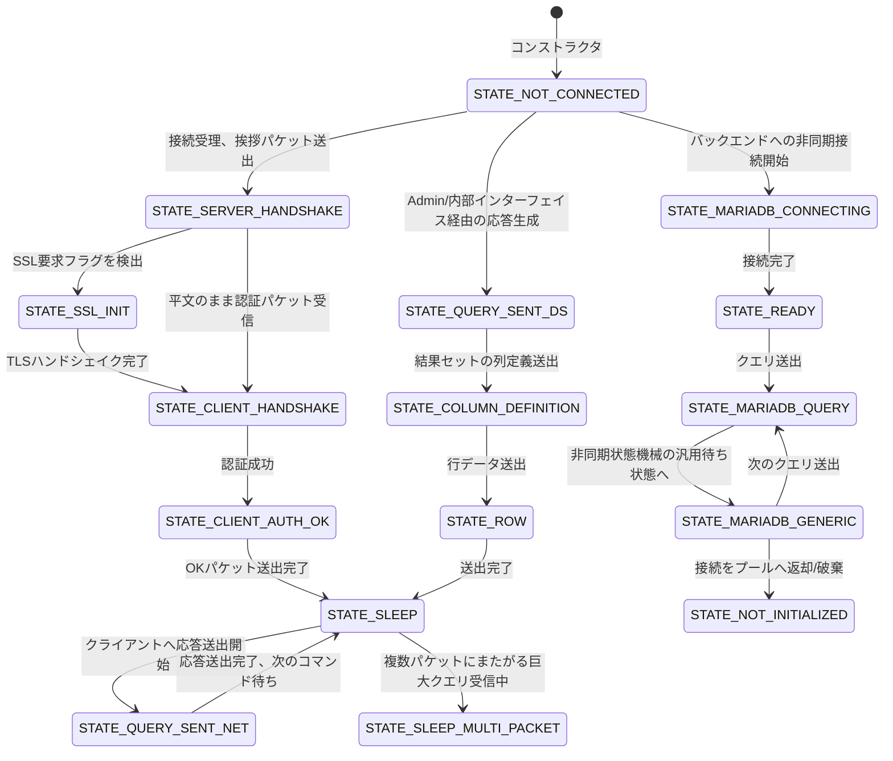

# 第3章 MySQL_Data_Stream による接続の状態機械とバッファリング

> **本章で読むソース**
>
> - [`lib/mysql_data_stream.cpp`](https://github.com/sysown/proxysql/blob/v3.0.9/lib/mysql_data_stream.cpp)
> - [`include/MySQL_Data_Stream.h`](https://github.com/sysown/proxysql/blob/v3.0.9/include/MySQL_Data_Stream.h)
> - [`include/proxysql_structs.h`](https://github.com/sysown/proxysql/blob/v3.0.9/include/proxysql_structs.h)

## この章の狙い

ProxySQL は1本のTCPソケット（クライアントとの接続、あるいはバックエンドMySQLサーバとの接続）を `MySQL_Data_Stream` というクラスで表す。

このクラスは、ソケットのファイルディスクリプタだけでなく、送受信バッファ、未処理パケットの配列、接続がいまどの局面にあるかを示す状態変数（**DSS**、Data Stream Status）を一つにまとめて持つ。

本章では、ソケットから読み込んだ生バイト列がMySQLパケット単位に切り出されるまでの経路と、逆にパケットが送信バッファへ積まれてソケットへ書き出されるまでの経路を追う。

あわせて、DSSがどのような値をとり、実行時にどう遷移するかを状態遷移図で示す。

## 前提

`MySQL_Data_Stream` は1接続につき1個生成され、クライアント側の接続（`MYDS_FRONTEND`）とバックエンド側の接続（`MYDS_BACKEND`）の両方に使われる。

どちらの向きの接続かは `myds_type`（`enum MySQL_DS_type`）で区別する。

[`include/proxysql_structs.h` L177-L183](https://github.com/sysown/proxysql/blob/v3.0.9/include/proxysql_structs.h#L177-L183)

```c++
enum MySQL_DS_type {
	MYDS_LISTENER,
	MYDS_BACKEND,
	MYDS_BACKEND_NOT_CONNECTED,
//	MYDS_BACKEND_PAUSE_CONNECT,
//	MYDS_BACKEND_FAILED_CONNECT,
	MYDS_FRONTEND,
```

イベントループ（第2章「スレッドとイベントループによる接続の多重化」）は `poll()` の結果を各 `MySQL_Data_Stream` の `revents` に渡し、`read_from_net()` と `write_to_net()` を呼び出す。

セッション（第7章「MySQL_Session の状態機械」）は、この `MySQL_Data_Stream` を通じてパケットを読み書きしながら、クライアントとバックエンドの間でプロトコルを中継する。

## 送受信バッファの構造

`MySQL_Data_Stream` は、ソケットとの生バイトの受け渡しに使う**moving buffer**（`queueIN` / `queueOUT`）と、パケット単位に切り出したデータを保持する**パケット配列**（`PSarrayIN` / `PSarrayOUT`）の2層を持つ。

[`include/MySQL_Data_Stream.h` L33-L41](https://github.com/sysown/proxysql/blob/v3.0.9/include/MySQL_Data_Stream.h#L33-L41)

```c++
typedef struct _queue_t {
	void *buffer;
	unsigned int size;
	unsigned int head;
	unsigned int tail;
	unsigned int partial;
	PtrSize_t pkt;
	mysql_hdr hdr;
} queue_t;
```

`queue_t` は固定長（初期値32KB）の円環的ではない単純な線形バッファである。

`head` が書き込み位置、`tail` が読み出し位置を指し、`tail` から `head` までが未消費のデータになる。

[`include/MySQL_Data_Stream.h` L30](https://github.com/sysown/proxysql/blob/v3.0.9/include/MySQL_Data_Stream.h#L30)

```c++
#define QUEUE_T_DEFAULT_SIZE	32768
```

パケット配列 `PSarrayIN` / `PSarrayOUT` は `PtrSizeArray` 型で、ヒープに確保したパケット本体へのポインタとサイズの組（`PtrSize_t`）を並べる。

[`include/proxysql_structs.h` L859-L862](https://github.com/sysown/proxysql/blob/v3.0.9/include/proxysql_structs.h#L859-L862)

```c++
struct _PtrSize_t {
  unsigned int size;
  void *ptr;
};
```

`queueIN` / `queueOUT` が「ソケットとやり取りする生バイト列の窓」であるのに対し、`PSarrayIN` / `PSarrayOUT` は「MySQLプロトコル上の1パケットを1要素として並べたキュー」である。

セッション層はパケット配列だけを見ればよく、TCPのストリームがどこで分割されて届いたかを意識しなくてよい。

## 読み取り経路：ソケットからパケット配列へ

読み取りは2段階に分かれる。

まず `read_from_net()` がソケットから `queueIN` へ生バイトを詰め込み、次に `buffer2array()` が `queueIN` の中身をMySQLパケットのヘッダ（4バイト長）に従って切り出し、`PSarrayIN` へ積む。

### read_from_net：ソケットからmoving bufferへ

[`lib/mysql_data_stream.cpp` L632-L652](https://github.com/sysown/proxysql/blob/v3.0.9/lib/mysql_data_stream.cpp#L632-L652)

```c++
int MySQL_Data_Stream::read_from_net() {
	if (encrypted) {
		//proxy_info("Entering\n");
	}
	if ( (revents & POLLHUP) && ((revents & POLLIN)==0) ) {
		// Previously this was (revents & POLLHUP) , but now
		// we call shut_soft() only if POLLIN is not set .
		//
		// This means that if we receive data (POLLIN) we process it
		// temporarily ignoring POLLHUP .
		// In this way we can intercept a COM_QUIT executed by the client
		// before closing the socket
		shut_soft();
		return -1;
	}
	// this check was moved after the previous one about POLLHUP,
	// otherwise the previous check was never true
	if ((revents & POLLIN)==0) return 0;

	int r=0;
	int s=queue_available(queueIN);
```

`POLLHUP` が立っていても `POLLIN` が同時に立っていれば読み取りを続ける点に注意する。

これは、クライアントが `COM_QUIT` を送った直後にソケットを閉じた場合でも、そのパケットを取りこぼさずに処理するためである。

暗号化されていない接続では、最初のパケットに限り、まずMySQLパケットヘッダの4バイトだけを読み、そこに書かれた `pkt_length` の分だけ続けて読む。

[`lib/mysql_data_stream.cpp` L658-L685](https://github.com/sysown/proxysql/blob/v3.0.9/lib/mysql_data_stream.cpp#L658-L685)

```c++
			if (queueIN.partial == 0) {
				// we are reading the very first packet
				// to avoid issue with SSL, we will only read the header and eventually the first packet
				r = recv(fd, queue_w_ptr(queueIN), 4, 0);
				if (r == 4) {
					// Check for PROXY protocol before treating as MySQL header
					// PROXY protocol starts with "PROXY " (6 bytes), but we only have 4 bytes here
					// If first 4 bytes are "PROX", don't interpret as MySQL header
					if (strncmp((char *)queueIN.buffer, "PROX", 4) == 0) {
						// PROXY protocol detected - read more data without MySQL header parsing
						r += recv(fd, queue_w_ptr(queueIN)+4, s-4, 0);
					} else {
						// let's try to read a whole packet
						mysql_hdr Hdr;
						memcpy(&Hdr,queueIN.buffer,sizeof(mysql_hdr));
						// GHSA-58ww-865x-grpr: bound the declared packet length by the
						// remaining capacity of queueIN. Without this check an unauthenticated
						// client can drive a heap out-of-bounds write into the fixed-size
						// 32KB input queue by sending an oversized first MySQL packet.
						if (Hdr.pkt_length > (unsigned int)(s - 4)) {
							proxy_error("Oversized first packet from client: pkt_length=%u exceeds queue capacity (%d). Closing fd=%d\n",
								Hdr.pkt_length, s - 4, fd);
							shut_soft();
							return -1;
						}
						r += recv(fd, queue_w_ptr(queueIN)+4, Hdr.pkt_length, 0);
					}
				}
```

`Hdr.pkt_length` を `queueIN` の残り容量と比較してから2回目の `recv()` を発行しているのは、クライアントが偽の長さを申告して固定長32KBの入力バッファを越えて書き込ませる攻撃（GHSA-58ww-865x-grpr）を防ぐためである。

認証前の未信頼な入力に対しては、バッファサイズという固定の上限を必ず経由させる必要があることをこのコードは示している。

2パケット目以降は `pkts_recv` が0でなくなるため、単純に `recv(fd, queue_w_ptr(queueIN), s, 0)` で空き容量いっぱいまで読み込む。

暗号化接続（`encrypted == true`）では、受信した暗号文をいったんOpenSSLのメモリBIO（`rbio_ssl`）に書き込み、`SSL_read()` で復号した平文を `queueIN` に書き込む。

TLSハンドシェイクが完了していなければ `do_ssl_handshake()` を呼び、完了するまで平文の読み取りは行わない。

読み取ったバイト数が0以下の場合は、相手がソケットを閉じたか、エラーが発生したことを意味する。

`errno` が `EINTR` や `EAGAIN` でなければ `shut_soft()` を呼んで、このデータストリームを非活性化する。

fast forwardモード（第7章で扱う、プロキシがパケットを解釈せずに右から左へ転送するモード）でバックエンドがEOFを返した場合は、クライアント側にまだ送信すべきデータが残っていないかを確認し、残っていれば即座にセッションを終了せず、一定時間だけ送信の完了を待つ「猶予期間」に入る。

### buffer2array：moving bufferからパケット配列へ

`buffer2array()` は `queueIN` に溜まった生バイトを、MySQLパケットのヘッダ（先頭3バイトが長さ、続く1バイトがシーケンス番号の、合計4バイト）に従って1パケットずつ切り出し、`PSarrayIN` に積む。

[`lib/mysql_data_stream.cpp` L1362-L1384](https://github.com/sysown/proxysql/blob/v3.0.9/lib/mysql_data_stream.cpp#L1362-L1384)

```c++
			proxy_debug(PROXY_DEBUG_PKT_ARRAY, 5, "Session=%p . Reading the header of a new packet\n", sess);
			memcpy(&queueIN.hdr,queue_r_ptr(queueIN),sizeof(mysql_hdr));
			pkt_sid=queueIN.hdr.pkt_id;
			queue_r(queueIN,sizeof(mysql_hdr));
			queueIN.pkt.size=queueIN.hdr.pkt_length+sizeof(mysql_hdr);
			queueIN.pkt.ptr=l_alloc(queueIN.pkt.size);
			memcpy(queueIN.pkt.ptr, &queueIN.hdr, sizeof(mysql_hdr)); // immediately copy the header into the packet
			queueIN.partial=sizeof(mysql_hdr);
			ret+=sizeof(mysql_hdr);
		}
	}
	if ((queueIN.pkt.size>0) && queue_data(queueIN)) {
		int b= ( queue_data(queueIN) > (queueIN.pkt.size - queueIN.partial) ? (queueIN.pkt.size - queueIN.partial) : queue_data(queueIN) );
		proxy_debug(PROXY_DEBUG_PKT_ARRAY, 5, "Session=%p . Copied %d bytes into packet\n", sess, b);
		memcpy((unsigned char *)queueIN.pkt.ptr + queueIN.partial, queue_r_ptr(queueIN),b);
		queue_r(queueIN,b);
		queueIN.partial+=b;
		ret+=b;
	}
	if ((queueIN.pkt.size>0) && (queueIN.pkt.size==queueIN.partial) ) {
```

処理の流れは次のとおりである。

まず `queueIN.pkt.size` が0（現在組み立て中のパケットがない）なら、ヘッダの4バイトから `pkt_length` を読み取り、その長さ分のバッファを新たに確保（`l_alloc`）して `queueIN.partial` にヘッダ分の4バイトを記録する。

次に、`queueIN` に残っているデータのうち、パケット本体の未受信分（`pkt.size - partial`）を上限として `memcpy` でパケット用バッファに詰め、`partial` を進める。

`partial` が `pkt.size` に達した時点でパケット全体が揃ったことになり、`PSarrayIN->add()` でパケット配列に追加し、`pkts_recv` を1増やす。

1回の `recv()` でTCPが複数パケット分のデータをまとめて届けることは珍しくないため、`read_pkts()` は `buffer2array()` を戻り値が0になるまで繰り返し呼ぶことで、`queueIN` に残っているデータを一度にすべてパケットへ切り出す。

[`lib/mysql_data_stream.cpp` L1169-L1174](https://github.com/sysown/proxysql/blob/v3.0.9/lib/mysql_data_stream.cpp#L1169-L1174)

```c++
int MySQL_Data_Stream::read_pkts() {
	int rc=0;
	int r=0;
	while((r=buffer2array())) rc+=r;
	return rc;
}
```

fast forwardモードでは、プロトコルの中身を解釈する必要がないため、`buffer2array()` はヘッダを解析せず、`queueIN` にあるデータをそのままパケット配列の1要素として積む（16KB単位のブロックに詰め合わせる）近道を通る。

## 書き込み経路：パケット配列からソケットへ

書き込みは読み取りの逆順である。

`array2buffer()` がパケット配列 `PSarrayOUT` から1パケットずつ取り出して `queueOUT` に詰め、`write_to_net()` が `queueOUT` の中身を `send()`（または暗号化接続なら `SSL_write()`）でソケットへ書き出す。

[`lib/mysql_data_stream.cpp` L1574-L1588](https://github.com/sysown/proxysql/blob/v3.0.9/lib/mysql_data_stream.cpp#L1574-L1588)

```c++
int MySQL_Data_Stream::array2buffer() {
	int ret=0;
	unsigned int idx=0;
	bool cont=true;
	if (sess) {
		if (sess->mirror==true) { // if this is a mirror session, just empty it
			idx=PSarrayOUT->len;
			goto __exit_array2buffer;
		}
	}
	while (cont) {
		//VALGRIND_DISABLE_ERROR_REPORTING;
		if (queue_available(queueOUT)==0) {
			goto __exit_array2buffer;
		}
```

`queueOUT` の空き容量が尽きるか、`PSarrayOUT` に積まれたパケットを使い切るまでループし、パケットをまたいで `queueOUT` に詰め続ける。

`write_to_net()` は `queueOUT` にあるデータを `send()` に渡し、成功した分だけ `queue_r()` で読み出し位置を進める。

[`lib/mysql_data_stream.cpp` L947-L954](https://github.com/sysown/proxysql/blob/v3.0.9/lib/mysql_data_stream.cpp#L947-L954)

```c++
	} else {
#ifdef __APPLE__
		bytes_io = send(fd, queue_r_ptr(queueOUT), s, 0);
#else
		bytes_io = send(fd, queue_r_ptr(queueOUT), s, MSG_NOSIGNAL);
#endif
		proxy_debug(PROXY_DEBUG_NET, 7, "Session=%p, Datastream=%p: send() wrote %d bytes in FD %d\n", sess, this, bytes_io, fd);
	}
```

`send()` はソケットの送信バッファが埋まっていれば要求したバイト数より少ない値しか書けずに返ることがある。

その場合 `queueOUT` には未送信データが残ったままになり、次に `POLLOUT` が発火したときに続きから書き込みを再開する。

`read_pkts()` と対になる `array2buffer_full()` は、`array2buffer()` を戻り値が0になるまで呼び、`PSarrayOUT` にあるパケットを可能な限り `queueOUT` へ詰める。

[`lib/mysql_data_stream.cpp` L1725-L1730](https://github.com/sysown/proxysql/blob/v3.0.9/lib/mysql_data_stream.cpp#L1725-L1730)

```c++
int MySQL_Data_Stream::array2buffer_full() {
	int rc=0;
	int r=0;
	while((r=array2buffer())) rc+=r;
	return rc; 
}
```

## DSS（Data Stream Status）の状態機械

`DSS` は接続がプロトコル上のどの局面にあるかを示す列挙型である。

[`include/proxysql_structs.h` L398-L431](https://github.com/sysown/proxysql/blob/v3.0.9/include/proxysql_structs.h#L398-L431)

```c++
enum mysql_data_stream_status {
	STATE_NOT_INITIALIZED,
	STATE_NOT_CONNECTED,
	STATE_SERVER_HANDSHAKE,
	STATE_CLIENT_HANDSHAKE,
	STATE_CLIENT_AUTH_OK,
	STATE_SSL_INIT,
	STATE_SLEEP,
	STATE_SLEEP_MULTI_PACKET,
	STATE_CLIENT_COM_QUERY,
	STATE_READY,
	STATE_QUERY_SENT_DS,
	STATE_QUERY_SENT_NET,
//	STATE_PING_SENT_NET,
	STATE_COLUMN_COUNT,
	STATE_COLUMN_DEFINITION,
	STATE_ROW,
	STATE_EOF1,
	STATE_EOF2,
	STATE_OK,
	STATE_ERR,

	STATE_READING_COM_STMT_PREPARE_RESPONSE,

	STATE_MARIADB_BEGIN,  // dummy state
	STATE_MARIADB_CONNECTING,  // using MariaDB Client Library
	STATE_MARIADB_PING,
	STATE_MARIADB_SET_NAMES,
	STATE_MARIADB_INITDB,
	STATE_MARIADB_QUERY,
	STATE_MARIADB_GENERIC,	// generic state, perhaps will replace all others
	STATE_MARIADB_END,  // dummy state

	STATE_END
```

`STATE_MARIADB_BEGIN` と `STATE_MARIADB_END` は実際の状態ではなく、`set_pollout()` が「バックエンド接続がMariaDB Connector/Cライブラリの非同期状態機械を使っている最中かどうか」を範囲比較で判定するための番兵（ダミー値）である。

[`lib/mysql_data_stream.cpp` L1020-L1025](https://github.com/sysown/proxysql/blob/v3.0.9/lib/mysql_data_stream.cpp#L1020-L1025)

```c++
void MySQL_Data_Stream::set_pollout() {
	struct pollfd *_pollfd;
	_pollfd=&mypolls->fds[poll_fds_idx];
	if (DSS > STATE_MARIADB_BEGIN && DSS < STATE_MARIADB_END) {
		_pollfd->events = myconn->wait_events;
	} else {
```

`STATE_MARIADB_PING` と `STATE_MARIADB_INITDB` はコード中に定義されているが、`lib/` 配下でMySQL接続に対して実際に代入している箇所はなく、`STATE_MARIADB_SET_NAMES` も同様である。

`STATE_MARIADB_QUERY` と `STATE_MARIADB_GENERIC` に統合される途上の値と考えられる（`STATE_MARIADB_GENERIC` のコメントに「いずれ他の状態をすべて置き換えるかもしれない汎用状態」とある）。

`STATE_CLIENT_COM_QUERY` と `STATE_PING_SENT_NET`（コメントアウト済み）も、MySQL用の `MySQL_Data_Stream` としては到達しない予約値である。

以下は、`MySQL_Session`（クライアント側フロー、第7章）と `MySQL_Connection`（バックエンド側フロー、第4部）が実際に代入する値だけを実線でつないだ状態遷移図である。



図中の遷移は、クライアント側（`MySQL_Session`）とバックエンド側（`MySQL_Connection` / `MySQL_Backend`）で別々の `MySQL_Data_Stream` インスタンスに対して起きる。

同じ状態名でも、`STATE_SLEEP` はクライアント側データストリームで次のコマンドを待つ状態を指し、`STATE_MARIADB_GENERIC` はバックエンド側データストリームでMariaDB Connector/Cの非同期処理待ちを指す。

`STATE_EOF1` / `STATE_EOF2` / `STATE_OK` / `STATE_ERR` はAdminインターフェイスやClickHouseサーバなど、`MySQL_Protocol` を通じて結果セットを自前で組み立てる経路でのみ現れる中間状態であり、通常のクエリ中継では `STATE_COLUMN_DEFINITION` から `STATE_ROW` を経て `STATE_SLEEP` に戻る。

## 送信データの有無に応じたPOLLOUTの制御

イベントループは `poll()` に監視対象のイベント（`POLLIN` / `POLLOUT`）を登録する。

`set_pollout()` は、送信すべきデータが実際にあるときだけ `POLLOUT` を立てる。

[`lib/mysql_data_stream.cpp` L1043-L1046](https://github.com/sysown/proxysql/blob/v3.0.9/lib/mysql_data_stream.cpp#L1043-L1046)

```c++
		//if (PSarrayOUT->len || available_data_out() || queueOUT.partial || (encrypted && !SSL_is_init_finished(ssl))) {
		if (PSarrayOUT->len || available_data_out() || queueOUT.partial) {
			_pollfd->events |= POLLOUT;
		}
```

`POLLOUT` はソケットの送信バッファに空きがある限り立ち続けるイベントである。

送るデータがないのに `POLLOUT` を登録したままにすると、`poll()` はソケットが書き込み可能になるたびに即座に返り、スレッドは何もせず起きて `write_to_net()` を呼んでは空振りするビジーウェイトに陥る。

`set_pollout()` は `PSarrayOUT`（未送信パケット）、`available_data_out()`（`queueOUT` に残っている生バイトか `PSarrayOUT` の有無を判定する）、`queueOUT.partial`（パケットの一部だけを `queueOUT` に詰めた途中状態）のいずれかが真の場合に限って `POLLOUT` を加える。

`available_data_out()` は次のとおり、`queueOUT` の未送信バイト数か `PSarrayOUT` の残数のどちらかが正であれば真を返す。

[`lib/mysql_data_stream.cpp` L1006-L1012](https://github.com/sysown/proxysql/blob/v3.0.9/lib/mysql_data_stream.cpp#L1006-L1012)

```c++
bool MySQL_Data_Stream::available_data_out() {
	int buflen=queue_data(queueOUT);
	if (buflen || PSarrayOUT->len) {
		return true;
	}
	return false;
}
```

こうして、送信待ちデータの有無という接続ごとの状態を `poll()` に伝えることで、送るものがないスレッドを不要に起こさずに済ませている。

fast forwardのグレースクローズ中（`sess->backend_closed_in_fast_forward == true` のとき）は、逆に `POLLIN` を意図的に外す分岐もある。

[`lib/mysql_data_stream.cpp` L1038-L1041](https://github.com/sysown/proxysql/blob/v3.0.9/lib/mysql_data_stream.cpp#L1038-L1041)

```c++
			if (sess->thread->curtime - sess->fast_forward_grace_start_time < (unsigned long long)mysql_thread___fast_forward_grace_close_ms * 1000) {
				// for the reason listed above, we remove POLLIN unless the timeout has reached
				_pollfd->events = 0;
			}
```

バックエンドが既に閉じたソケットに `POLLIN` を立てたままにすると、`poll()` は即座に返り続けてスレッドがスピンする。

グレース期間中はあえて `POLLIN` も外し、タイムアウトによってのみセッションを終了させることで、このスピンを避けている。

## まとめ

`MySQL_Data_Stream` は1本のソケットを、moving buffer（`queueIN` / `queueOUT`）とパケット配列（`PSarrayIN` / `PSarrayOUT`）の2層構造で抽象化する。

読み取りは `read_from_net()` でソケットからmoving bufferへ、`buffer2array()` でmoving bufferからパケット配列へと進み、書き込みはその逆を `array2buffer()` と `write_to_net()` がたどる。

接続の局面は `DSS` という1個の列挙型で管理され、実際に到達する値はクライアント側のハンドシェイク〜コマンド待ちの遷移と、バックエンド側の非同期接続〜クエリ送出の遷移に大別できる。

`STATE_MARIADB_BEGIN` / `STATE_MARIADB_END` のような一部の列挙値は状態そのものではなく範囲判定用の番兵であり、`enum` の定義順と実行時の状態遷移を混同してはならない。

`set_pollout()` による条件付きの `POLLOUT` 登録は、送信待ちデータの有無をイベントループに正しく伝えることで、無駄なイベント通知とビジーウェイトを避ける仕組みである。

## 関連する章

- 第2章「スレッドとイベントループによる接続の多重化」：`poll()` のイベントループが `MySQL_Data_Stream` をどう駆動するか。
- 第4章「MySQLプロトコルの解析」：`PSarrayIN` / `PSarrayOUT` に積まれたパケットの中身をどう解釈するか。
- 第7章「MySQL_Session の状態機械」：`DSS` と連動するセッション側の状態遷移。
