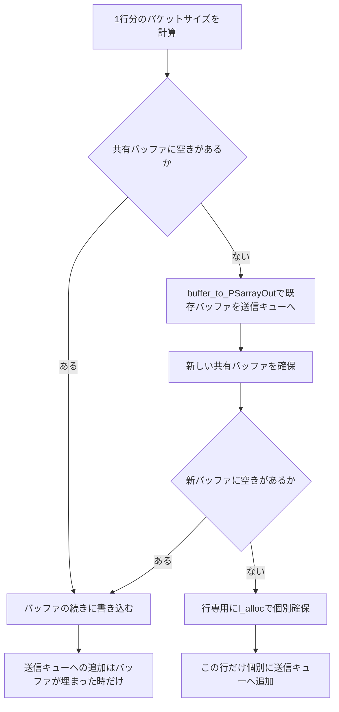

# 第4章 MySQL プロトコルの解析と生成

> **本章で読むソース**
>
> - [`lib/MySQL_Protocol.cpp`](https://github.com/sysown/proxysql/blob/v3.0.9/lib/MySQL_Protocol.cpp)
> - [`include/MySQL_Protocol.h`](https://github.com/sysown/proxysql/blob/v3.0.9/include/MySQL_Protocol.h)
> - [`lib/MySQLProtocolUtils.cpp`](https://github.com/sysown/proxysql/blob/v3.0.9/lib/MySQLProtocolUtils.cpp)
> - [`include/MySQLProtocolUtils.h`](https://github.com/sysown/proxysql/blob/v3.0.9/include/MySQLProtocolUtils.h)
> - [`lib/MySQL_encode.cpp`](https://github.com/sysown/proxysql/blob/v3.0.9/lib/MySQL_encode.cpp)
> - [`lib/MySQL_ResultSet.cpp`](https://github.com/sysown/proxysql/blob/v3.0.9/lib/MySQL_ResultSet.cpp)

## この章の狙い

第3章では、ソケットから読み込んだ生バイト列が `MySQL_Data_Stream` によってパケット単位に切り出される経路を追った。

本章では、その1パケット分のバイト列がMySQLワイヤプロトコルとしてどう構造化されており、`MySQL_Protocol` クラスがそれをどう解析し、また逆にどう組み立てて送り返すかを扱う。

対象は主に **OK パケット**、**ERR パケット**、**EOF パケット**の生成と、クエリ結果のカラム定義と行データをパケット化する処理である。

クライアントとの認証ハンドシェイクの詳細は第5章「認証ハンドシェイク」に譲る。

## 前提

MySQLのワイヤプロトコルでは、あらゆるパケットに共通の4バイトヘッダが付く。

内訳は3バイトのペイロード長（リトルエンディアン）と1バイトのシーケンス番号である。

ProxySQLはこのヘッダを `mysql_hdr` というビットフィールド構造体で表す。

[`include/proxysql_structs.h` L930-932](https://github.com/sysown/proxysql/blob/v3.0.9/include/proxysql_structs.h#L930-L932)

```c++
struct _mysql_hdr {
	u_int pkt_length:24, pkt_id:8;
};
```

`pkt_length` は24ビット幅のビットフィールドであり、そのままペイロード長の3バイト分を表す。

`pkt_id` はシーケンス番号であり、1回のリクエストからレスポンスまでの往復の中で0から始まり、パケットを送るたびに1ずつ増える。

パケット本体（ペイロード）の中身は種類ごとに形式が決まっている。

クライアントからサーバへの最初のペイロードバイトは **COM_* コマンド**の種別番号であり（`COM_QUERY` は `0x03` など）、サーバからクライアントへの応答は先頭バイトによって `OK`（`0x00` または `0xFE`）、`ERR`（`0xFF`）、`EOF`（`0xFE`、先頭バイトがOKと重複するため後述の識別が必要）、カラム定義や行データのいずれかに分岐する。


## OK、ERR、EOFパケットの生成

`MySQL_Protocol::generate_pkt_OK`、`generate_pkt_ERR`、`generate_pkt_EOF` は、いずれも同じ形をとる関数である。

引数に渡された値からペイロード長を計算して `mysql_hdr` を組み立て、ヘッダとペイロードを連続したメモリ領域に書き込み、`send` が真ならそのまま送信キュー（`PSarrayOUT`）に積む。

ERRパケットの生成を見ると、この形がよくわかる。

[`lib/MySQL_Protocol.cpp` L205-224](https://github.com/sysown/proxysql/blob/v3.0.9/lib/MySQL_Protocol.cpp#L205-L224)

```c++
bool MySQL_Protocol::generate_pkt_ERR(bool send, void **ptr, unsigned int *len, uint8_t sequence_id, uint16_t error_code, char *sql_state, const char *sql_message, bool track) {
	if ((*myds)->sess->mirror==true) {
		return true;
	}
	mysql_hdr myhdr;
	uint32_t sql_message_len=( sql_message ? strlen(sql_message) : 0 );
	myhdr.pkt_id=sequence_id;
	myhdr.pkt_length=1+sizeof(uint16_t)+1+5+sql_message_len;
  unsigned int size=myhdr.pkt_length+sizeof(mysql_hdr);
  unsigned char *_ptr=(unsigned char *)l_alloc(size);
  memcpy(_ptr, &myhdr, sizeof(mysql_hdr));
  int l=sizeof(mysql_hdr);
	_ptr[l]=0xff; l++;
	memcpy(_ptr+l, &error_code, sizeof(uint16_t)); l+=sizeof(uint16_t);
	_ptr[l]='#'; l++;
	memcpy(_ptr+l, sql_state, 5); l+=5;
	if (sql_message) memcpy(_ptr+l, sql_message, sql_message_len);

	if (send==true) {
		(*myds)->PSarrayOUT->add((void *)_ptr,size);
```

ペイロードは `0xFF`（ERRの識別バイト）、2バイトのエラー番号、区切り文字 `#`、5バイトの `SQLSTATE`、可変長のエラーメッセージという固定順で並ぶ。

`l_alloc` はProxySQL独自のメモリプールから確保する薄いラッパーであり、パケットサイズちょうどの領域を一度に確保している。

したがってこの関数はヘッダとペイロードを分けて書かず、確保した1個のバッファへ両方を連続して書き込む。

`generate_pkt_OK` も構造は同じだが、`affected_rows` と `last_insert_id` を**長さエンコード整数**（lenenc int）として書く点が異なる。

[`lib/MySQL_Protocol.cpp` L283-289](https://github.com/sysown/proxysql/blob/v3.0.9/lib/MySQL_Protocol.cpp#L283-L289)

```c++
	char affected_rows_prefix;
	uint8_t affected_rows_len=mysql_encode_length(affected_rows, &affected_rows_prefix);
	char last_insert_id_prefix;
	uint8_t last_insert_id_len=mysql_encode_length(last_insert_id, &last_insert_id_prefix);
	uint32_t msg_len=( msg ? strlen(msg) : 0 );
	char msg_prefix;
	uint8_t msg_len_len=mysql_encode_length(msg_len, &msg_prefix);
```

**長さエンコード整数**は、値の大きさに応じて1バイトから9バイトまで幅が変わる可変長の整数表現である。

251未満の値はそのまま1バイトで表し、それ以上の値は先頭に `0xFC`（2バイト値）、`0xFD`（3バイト値）、`0xFE`（8バイト値）のいずれかのプレフィックスを置いてから実際の値を続ける。

`mysql_encode_length` は書き込みに必要なバイト数とプレフィックスを求め、`write_encoded_length` がその情報を使って実際にバッファへ書き込む。

[`include/MySQL_encode.h` L9-10](https://github.com/sysown/proxysql/blob/v3.0.9/include/MySQL_encode.h#L9-L10)

```c++
int write_encoded_length(unsigned char *p, uint64_t val, uint8_t len, char prefix);
int write_encoded_length_and_string(unsigned char *p, uint64_t val, uint8_t len, char prefix, char *string);
```

読み取り側の対称な関数が `mysql_decode_length` であり、先頭バイトを見てプレフィックスの種類を判定し、後続バイト数と実際の値を復元する。

[`lib/MySQL_encode.cpp` L224-230](https://github.com/sysown/proxysql/blob/v3.0.9/lib/MySQL_encode.cpp#L224-L230)

```c++
uint8_t mysql_decode_length(unsigned char *ptr, uint32_t *len) {
	if (*ptr <= 0xfb) { if (len) { *len = CPY1(ptr); };  return 1; }
	if (*ptr == 0xfc) { if (len) { *len = CPY2(ptr+1); }; return 3; }
	if (*ptr == 0xfd) { if (len) { *len = CPY3(ptr+1); };  return 4; }
	if (*ptr == 0xfe) { if (len) { *len = CPY4(ptr+1); };  return 9; }
	return 0; // never reaches here
}
```

この関数は、たとえば `COM_STMT_EXECUTE` のバイナリパラメータに含まれる可変長文字列の長さを読み取る際に使われる（第12章「プリペアドステートメント」で扱う `get_binds_from_pkt`）。

EOFパケットの生成もOK、ERRと同じ骨格だが、`(*myds)->DSS`（データストリームの状態）を`STATE_EOF1` や `STATE_EOF2` に更新する副作用を持つ点が異なる。

[`lib/MySQL_Protocol.cpp` L180-193](https://github.com/sysown/proxysql/blob/v3.0.9/lib/MySQL_Protocol.cpp#L180-L193)

```c++
	if (send==true) {
		(*myds)->PSarrayOUT->add((void *)_ptr,size);
		switch ((*myds)->DSS) {
			case STATE_COLUMN_DEFINITION:
				(*myds)->DSS=STATE_EOF1;
				break;
			case STATE_ROW:
				(*myds)->DSS=STATE_EOF2;
				break;
			default:
				//assert(0);
				break;
		}
	}
```

この更新により、`MySQL_Data_Stream` の状態（第3章）は、カラム定義の終わりを示す `EOF1` と、行データの終わりを示す `EOF2` を区別できる。

`generate_pkt_OK` にも `eof_identifier` という引数があり、これが真のときは先頭バイトを `0xFE` に切り替える。

[`lib/MySQL_Protocol.cpp` L328-336](https://github.com/sysown/proxysql/blob/v3.0.9/lib/MySQL_Protocol.cpp#L328-L336)

```c++
	/*
	 * Use 0xFE packet header if eof_identifier is true.
	 * OK packet with 0xFE replaces EOF packet for clients
	 * supporting CLIENT_DEPRECATE_EOF flag
	 */
	if (eof_identifier)
		_ptr[l]=0xFE;
	else
		_ptr[l]=0x00;
```

`CLIENT_DEPRECATE_EOF` フラグを持つクライアントに対しては、行データの終端を独立したEOFパケットではなく、`0xFE` 識別子付きのOKパケットで代用する。

これはMySQLプロトコル自体の仕様であり、ProxySQLはクライアントが申告した機能フラグに合わせて生成するパケットの形を切り替えている。

## 結果セット行のパケット生成とバッファリングの最適化

クエリ結果を返す経路では、カラム定義パケット（`generate_pkt_field` 系）と行データパケット（`generate_pkt_row3`）が列や行の数だけ繰り返し生成される。

行が多いクエリでは、この生成が1行ごとの `malloc`、`memcpy`、送信キューへの追加になり、呼び出し回数がそのまま行数に比例してしまう。

ProxySQLはこれを避けるため、`MySQL_ResultSet` に**固定サイズの共有バッファ**を持たせ、複数行分のパケットをこのバッファへ連続して詰め込んでから、まとめて送信キューに渡す。

バッファのサイズは `RESULTSET_BUFLEN`（16300バイト）で固定されている。

[`include/MySQL_Protocol.h` L9](https://github.com/sysown/proxysql/blob/v3.0.9/include/MySQL_Protocol.h#L9)

```c++
#define RESULTSET_BUFLEN 16300
```

`generate_pkt_row3` は、1行分のパケットサイズを計算したあと、まずこの共有バッファに空きがあるかを調べる。

[`lib/MySQL_Protocol.cpp` L839-857](https://github.com/sysown/proxysql/blob/v3.0.9/lib/MySQL_Protocol.cpp#L839-L857)

```c++
	PtrSize_t pkt;
	pkt.size=rowlen+sizeof(mysql_hdr);
	if ( pkt.size<=(RESULTSET_BUFLEN-myrs->buffer_used) ) {
		// there is space in the buffer, add the data to it
		pkt.ptr = myrs->buffer + myrs->buffer_used;
		myrs->buffer_used += pkt.size;
	} else {
		// there is no space in the buffer, we flush the buffer and recreate it
		myrs->buffer_to_PSarrayOut();
		// now we can check again if there is space in the buffer
		if ( pkt.size<=(RESULTSET_BUFLEN-myrs->buffer_used) ) {
			// there is space in the NEW buffer, add the data to it
			pkt.ptr = myrs->buffer + myrs->buffer_used;
			myrs->buffer_used += pkt.size;
		} else {
			// a new buffer is not enough to store the new row
			pkt.ptr=l_alloc(pkt.size);
		}
	}
```

空きがあれば、その行のヘッダとペイロードは共有バッファの続きに直接書き込まれる。

新たな `malloc` はここでは発生せず、書き込み先のポインタを進めるだけで済む。

空きがなくなった場合は `buffer_to_PSarrayOut` でバッファ全体を1個の送信要素として送信キューに積み、新しいバッファを確保し直してから同じ行を書き込む。

[`lib/MySQL_ResultSet.cpp` L500-515](https://github.com/sysown/proxysql/blob/v3.0.9/lib/MySQL_ResultSet.cpp#L500-L515)

```c++
void MySQL_ResultSet::buffer_to_PSarrayOut(bool _last) {
	if (buffer_used==0)
		return;	// exit immediately if the buffer is empty
	if (buffer_used < RESULTSET_BUFLEN/2) {
		if (_last == false) {
			buffer=(unsigned char *)realloc(buffer,buffer_used);
		}
	}
	PSarrayOUT.add(buffer,buffer_used);
	if (_last) {
		buffer = NULL;
	} else {
		buffer=(unsigned char *)malloc(RESULTSET_BUFLEN);
	}
	buffer_used=0;
}
```

行1行が `RESULTSET_BUFLEN` を超える場合だけは共有バッファをあきらめ、その行専用に `l_alloc` で領域を確保する。

つまり大多数を占める小さな行は共有バッファへの書き込みで済み、`malloc` と送信キューへの `add` 呼び出しはバッファが埋まるたびの1回に集約される。

行ごとに確保、解放、キュー追加を行う実装と比べて、システムコールに近い層の呼び出し回数を行数から「バッファが埋まる回数」まで減らせる点が、この仕組みの効率化の核となる部分である。



書き込んだ行が共有バッファの範囲内にあるかどうかは、ポインタの比較で判定している。

[`lib/MySQL_Protocol.cpp` L874-884](https://github.com/sysown/proxysql/blob/v3.0.9/lib/MySQL_Protocol.cpp#L874-L884)

```c++
	if (pkt.size < (0xFFFFFF+sizeof(mysql_hdr))) {
		mysql_hdr myhdr;
		myhdr.pkt_id=pkt_sid;
		myhdr.pkt_length=rowlen;
		memcpy(pkt.ptr, &myhdr, sizeof(mysql_hdr));
		if (pkt.ptr >= myrs->buffer && pkt.ptr < myrs->buffer+RESULTSET_BUFLEN) {
			// we are writing within the buffer, do not add to PSarrayOUT
		} else {
			// we are writing outside the buffer, add to PSarrayOUT
			myrs->PSarrayOUT.add(pkt.ptr,pkt.size);
		}
	}
```

共有バッファの範囲内であれば送信キューへの追加を省略し、バッファがあとでまとめて `buffer_to_PSarrayOut` によって1個の要素としてキューに積まれるのを待つ。

範囲外、つまり `l_alloc` で個別確保した行だけが、その場で送信キューに追加される。

なお `pkt_length` は24ビットしか表現できないため、1行が `0xFFFFFF` バイトを超える場合はパケットを分割して送る必要がある。

この分岐は `generate_pkt_row3` の後半にあるが、実務上ほとんどの行はこの上限に達しないため、本章では分割処理の詳細には立ち入らない。

## パケット組み立ての汎用関数

`lib/MySQLProtocolUtils.cpp` には、`MySQL_Protocol` クラスの外に切り出された低レベルの関数群がある。

ファイル冒頭のコメントが示すとおり、これらは単体テスト可能にする目的で抽出された純粋関数である。

[`include/MySQLProtocolUtils.h` L1-9](https://github.com/sysown/proxysql/blob/v3.0.9/include/MySQLProtocolUtils.h#L1-L9)

```c++
/**
 * @file MySQLProtocolUtils.h
 * @brief Pure MySQL protocol utility functions for unit testability.
 *
 * Extracted from MySQLFFTO for testing. These are low-level protocol
 * parsing helpers that operate on raw byte buffers.
 *
 * @see FFTO unit testing (GitHub issue #5499)
 */
```

`mysql_build_packet` は、ペイロードとシーケンス番号を渡すとヘッダ付きの完全なパケットを1個のバッファに組み立てる関数であり、`generate_pkt_OK` などが手作業で行っているヘッダ書き込みを汎用化したものである。

[`lib/MySQLProtocolUtils.cpp` L44-59](https://github.com/sysown/proxysql/blob/v3.0.9/lib/MySQLProtocolUtils.cpp#L44-L59)

```c++
size_t mysql_build_packet(
	const unsigned char *payload,
	uint32_t payload_len,
	uint8_t seq_id,
	unsigned char *out_buf)
{
	// 3-byte length (little-endian) + 1-byte sequence
	out_buf[0] = payload_len & 0xFF;
	out_buf[1] = (payload_len >> 8) & 0xFF;
	out_buf[2] = (payload_len >> 16) & 0xFF;
	out_buf[3] = seq_id;
	if (payload && payload_len > 0) {
		memcpy(out_buf + 4, payload, payload_len);
	}
	return payload_len + 4;
}
```

対をなす `mysql_parse_err_packet` は、ERRパケットのペイロードからエラー番号と `SQLSTATE`、エラーメッセージを取り出す。

[`lib/MySQLProtocolUtils.cpp` L61-80](https://github.com/sysown/proxysql/blob/v3.0.9/lib/MySQLProtocolUtils.cpp#L61-L80)

```c++
bool mysql_parse_err_packet(
    const unsigned char* payload, size_t len,
    uint16_t* out_errno, const char** out_msg, size_t* out_msg_len
) {
    // Minimum: 0xFF + 2 bytes errno = 3 bytes
    if (!payload || len < 3 || payload[0] != 0xFF) return false;

    *out_errno = payload[1] | (static_cast<uint16_t>(payload[2]) << 8);

    if (len >= 9 && payload[3] == '#') {
        // sqlstate at [4..8], message at [9..]
        *out_msg = reinterpret_cast<const char*>(payload + 9);
        *out_msg_len = len - 9;
    } else {
        // no sqlstate marker — message starts at [3]
        *out_msg = reinterpret_cast<const char*>(payload + 3);
        *out_msg_len = len - 3;
    }
    return true;
}
```

`generate_pkt_ERR` が組み立てるペイロードの並びと、この関数が読み取る並びを見比べると、`0xFF`、2バイトのエラー番号、`#` とその後の `SQLSTATE`、メッセージという構造が対称であることがわかる。

これらの関数は `MySQL_Protocol` クラスのメンバではなく独立した関数として書かれている。

クラスのメンバ関数は `MySQL_Data_Stream` や `MySQL_Session` への参照を前提にするため、パケットのバイト列だけを渡してテストすることが難しい。

生のバッファだけを引数に取る形に切り出すことで、実際のソケットやセッションを用意せずにパケットの組み立てと解析を検証できるようになっている。

## 応答パケットからクエリを組み立てる例

`generate_COM_QUERY_from_COM_FIELD_LIST` は、逆方向、つまりクライアントから受け取った `COM_FIELD_LIST` パケットを解析し、等価な `COM_QUERY` パケットへ作り変える処理である。

[`lib/MySQL_Protocol.cpp` L3123-3160](https://github.com/sysown/proxysql/blob/v3.0.9/lib/MySQL_Protocol.cpp#L3123-L3160)

```c++
bool MySQL_Protocol::generate_COM_QUERY_from_COM_FIELD_LIST(PtrSize_t *pkt) {
	unsigned int o_pkt_size = pkt->size;
	char *pkt_ptr = (char *)pkt->ptr;

	pkt_ptr+=5;
	// some sanity check
	void *a = NULL;
	a = memchr((void *)pkt_ptr, 0, o_pkt_size-5);
	if (a==NULL) return false; // we failed to parse
	char *tablename = strdup(pkt_ptr);
	unsigned int wild_len = o_pkt_size - 5 - strlen(tablename) - 1;
	char *wild = NULL;
	if (wild_len > 0) {
		pkt_ptr+=strlen(tablename);
		pkt_ptr++;
		wild=strndup(pkt_ptr,wild_len);
	}
	char *q = NULL;
	if ((*myds)->com_field_wild) {
		free((*myds)->com_field_wild);
		(*myds)->com_field_wild=NULL;
	}
	if (wild) {
		(*myds)->com_field_wild=strdup(wild);
	}

	char *qt = (char *)"SELECT * FROM `%s` WHERE 1=0";
	q = (char *)malloc(strlen(qt)+strlen(tablename));
	sprintf(q,qt,tablename);
	l_free(pkt->size, pkt->ptr);
	pkt->size = strlen(q)+5;
	mysql_hdr Hdr;
	Hdr.pkt_id=1;
	Hdr.pkt_length = pkt->size - 4;
	pkt->ptr=malloc(pkt->size);
	memcpy(pkt->ptr,&Hdr,sizeof(mysql_hdr));
    memset((char *)pkt->ptr+4,3,1); // COM_QUERY
    memcpy((char *)pkt->ptr+5,q,pkt->size-5);
```

先頭5バイト（4バイトヘッダと1バイトのコマンド種別）を読み飛ばした位置から、対象テーブル名とワイルドカード文字列をヌル終端で区切って取り出している。

`COM_FIELD_LIST` はMariaDB/MySQLの旧式コマンドであり、テーブルのカラム一覧を問い合わせるものである。

ProxySQLはこれをバックエンドへそのまま転送せず、等価な `SELECT * FROM ... WHERE 1=0` という `COM_QUERY` に置き換えて転送する。

置き換え後のパケットでも、5バイト目に `3`（`COM_QUERY` のコマンド番号）を書き込み、`mysql_hdr` の `pkt_length` をペイロード長に合わせて再計算している点は、これまで見てきた生成関数と同じ作法である。

## まとめ

MySQLワイヤプロトコルのパケットは、3バイト長と1バイトシーケンス番号からなる4バイトヘッダと、先頭バイトで種別が決まるペイロードの組みである。

`MySQL_Protocol` クラスの `generate_pkt_OK`、`generate_pkt_ERR`、`generate_pkt_EOF` は、この形に沿ってヘッダとペイロードを1個の連続領域へ組み立て、`send` が真なら送信キューへ渡す。

クエリ結果の行データは `generate_pkt_row3` が生成するが、行ごとに個別のメモリ確保と送信キュー追加を行うのではなく、`MySQL_ResultSet` が持つ `RESULTSET_BUFLEN` 固定長の共有バッファに複数行を連続して詰め込み、バッファが埋まった時点でまとめて送信キューへ渡す。

これにより、確保、解放、キュー追加の呼び出し回数を行数から「バッファが埋まる回数」まで減らしている。

`MySQLProtocolUtils.cpp` に切り出された純粋関数群は、同じパケット構造をクラスや接続の状態から独立させて表現し、単体テストの対象にしている。

## 関連する章

- 第3章「MySQL_Data_Stream による接続の状態機械とバッファリング」：本章のパケットが読み書きされる送受信バッファと `DSS` の全体像。
- 第5章「認証ハンドシェイク」：`process_pkt_handshake_response` を中心とした認証パケットの詳細。
- 第12章「プリペアドステートメント」：`get_binds_from_pkt` によるバイナリパラメータの解析。
