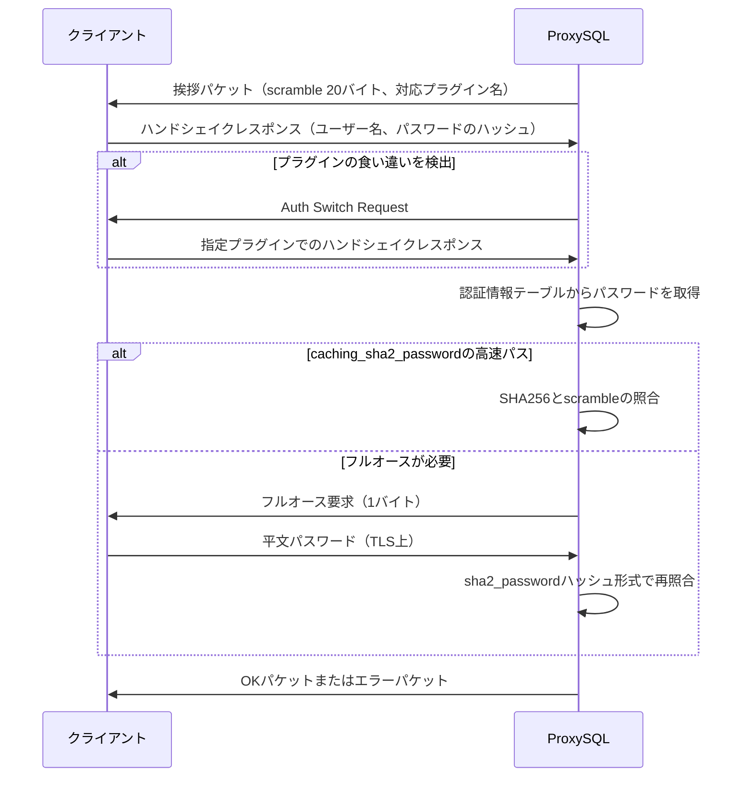

# 第5章 認証ハンドシェイクとユーザー認証

> **本章で読むソース**
>
> - [`lib/MySQL_Protocol.cpp`](https://github.com/sysown/proxysql/blob/v3.0.9/lib/MySQL_Protocol.cpp)
> - [`include/MySQL_Protocol.h`](https://github.com/sysown/proxysql/blob/v3.0.9/include/MySQL_Protocol.h)
> - [`lib/MySQL_Authentication.cpp`](https://github.com/sysown/proxysql/blob/v3.0.9/lib/MySQL_Authentication.cpp)
> - [`include/MySQL_Authentication.hpp`](https://github.com/sysown/proxysql/blob/v3.0.9/include/MySQL_Authentication.hpp)
> - [`lib/MySQL_encode.cpp`](https://github.com/sysown/proxysql/blob/v3.0.9/lib/MySQL_encode.cpp)

## この章の狙い

第4章で見たパケットの読み書きの上に、クライアントが最初に行うMySQL認証ハンドシェイクが乗る。

本章では、ProxySQLがサーバー役としてクライアントに送る初期ハンドシェイクパケットの生成、クライアントが返すハンドシェイクレスポンスの解析、そしてパスワードの照合という3つの処理を順に追う。

あわせて、ProxySQLが `mysql_users` テーブルの内容をメモリ上でどう保持し、ユーザー名からどう高速に引くかを扱う。

フロントエンド（クライアントがProxySQLに対して名乗る資格情報）とバックエンド（ProxySQLがMySQLサーバーに対して名乗る資格情報）は、同じ `MySQL_Authentication` クラスの中で別々の索引として管理される。

## 前提

MySQLのクライアント/サーバープロトコルにおける認証は、サーバーが最初に**挨拶パケット**（Initial Handshake Packet）を送り、クライアントがユーザー名とパスワードのハッシュを含む**ハンドシェイクレスポンス**を返し、サーバーがそれを検証してOKまたはエラーを返す、という順序で進む。

ProxySQLはクライアントから見ればMySQLサーバーそのものであり、この挨拶パケットの生成とハンドシェイクレスポンスの検証を自前で実装している。

パスワードそのものをネットワークに流さないために、MySQLは**scramble**と呼ばれるchallenge-response方式を使う。

サーバーが挨拶パケットの中でランダムな20バイトの値（scramble）を送り、クライアントはこの値とパスワードのハッシュを演算した結果だけを返す。

サーバー側は、自分が保持しているパスワードのハッシュと同じscrambleを使って同じ演算をやり直し、結果が一致するかどうかで認証の成否を判定する。

ProxySQLはこの検証を、クライアントの認証プラグインごとに `mysql_native_password` と `caching_sha2_password` の2方式で行う。

全体の流れを図示すると、次のようになる。



## 初期ハンドシェイクパケットの生成

サーバー側の最初の一歩は `generate_pkt_initial_handshake()` である。

この関数は、プロトコルバージョン、サーバーバージョン文字列、コネクションのスレッドID、そしてscrambleの2断片（8バイトと12バイト、あわせて20バイト）を含むパケットを組み立てる。

[`lib/MySQL_Protocol.cpp` L1011-L1014](https://github.com/sysown/proxysql/blob/v3.0.9/lib/MySQL_Protocol.cpp#L1011-L1014)

```c++
bool MySQL_Protocol::generate_pkt_initial_handshake(bool send, void **ptr, unsigned int *len, uint32_t *_thread_id, bool deprecate_eof_active) {
	int use_plugin_id = mysql_thread___default_authentication_plugin_int;
	proxy_debug(PROXY_DEBUG_MYSQL_CONNECTION, 7, "Generating handshake pkt\n");
	assert(use_plugin_id == 0 || use_plugin_id == 2 ); // mysql_native_password or caching_sha2_password
```

`use_plugin_id` はグローバル変数 `mysql_thread___default_authentication_plugin_int` から取り、`mysql_native_password`（0）または `caching_sha2_password`（2）のいずれかである。

scrambleの生成は2回に分かれ、それぞれ `proxy_create_random_string()` で乱数のバイト列を作り、コネクション単位の `scramble_buff` に格納する。

[`lib/MySQL_Protocol.cpp` L1061](https://github.com/sysown/proxysql/blob/v3.0.9/lib/MySQL_Protocol.cpp#L1061)

```c++
  proxy_create_random_string((*myds)->myconn->scramble_buff+0,8,(struct rand_struct *)&rand_st);
```

[`lib/MySQL_Protocol.cpp` L1148](https://github.com/sysown/proxysql/blob/v3.0.9/lib/MySQL_Protocol.cpp#L1148)

```c++
  proxy_create_random_string((*myds)->myconn->scramble_buff+8,12,(struct rand_struct *)&rand_st);
```

前半8バイトはパケットの固定部に直接書き込み、後半12バイトはfillerと認証プラグイン名の間に書き込む。

[`lib/MySQL_Protocol.cpp` L1161](https://github.com/sysown/proxysql/blob/v3.0.9/lib/MySQL_Protocol.cpp#L1161)

```c++
  memcpy(_ptr+l,plugins[use_plugin_id],strlen(plugins[use_plugin_id]));
```

パケットの末尾には、使用する認証プラグイン名の文字列（`mysql_native_password` または `caching_sha2_password`）がそのまま埋め込まれる。

[`lib/MySQL_Protocol.cpp` L53-L57](https://github.com/sysown/proxysql/blob/v3.0.9/lib/MySQL_Protocol.cpp#L53-L57)

```c++
static const char *plugins[3] = {
	"mysql_native_password",
	"mysql_clear_password",
	"caching_sha2_password",
};
```

この20バイトのscrambleは、コネクションが破棄されるまで `myconn->scramble_buff` に保持され、以降のすべての検証で再利用される。

## クライアントのハンドシェイクレスポンス解析

クライアントが返すハンドシェイクレスポンスは `process_pkt_handshake_response()` が受け取り、内部の複数の下請け関数（`PPHR_1` から `PPHR_7auth2` まで、「process pkt handshake response」の略でこの名がついている）に処理を分担させる。

`PPHR_2()` は、クライアントの持つ機能フラグ（capabilities）、文字コード、ユーザー名、パスワードのハッシュ値、接続先のデフォルトスキーマを、パケットの可変長フィールドから順番に切り出す。

[`lib/MySQL_Protocol.cpp` L1705-L1712](https://github.com/sysown/proxysql/blob/v3.0.9/lib/MySQL_Protocol.cpp#L1705-L1712)

```c++
	unsigned char* user_end = (unsigned char*)memchr(pkt, 0, packet_end - pkt);
	if (user_end == NULL) {
		ret = false;
		proxy_debug(PROXY_DEBUG_MYSQL_AUTH, 5, "Session=%p , DS=%p . malformed username in handshake response\n", (*myds), (*myds)->sess);
		return false;
	}
	vars1.user = pkt;
	pkt = user_end + 1;
```

ユーザー名はNUL終端の文字列として読み、その直後にパスワードのハッシュが続く。

パスワードハッシュの長さの表現は、クライアントが `CLIENT_PLUGIN_AUTH_LENENC_CLIENT_DATA` を立てているかどうかで変わる。

立っていれば長さがLength-Encoded Integerとして先頭に付き、立っていなければ `CLIENT_SECURE_CONNECTION` の有無に応じて1バイト長か、NUL終端かのいずれかになる。

[`lib/MySQL_Protocol.cpp` L1714-L1721](https://github.com/sysown/proxysql/blob/v3.0.9/lib/MySQL_Protocol.cpp#L1714-L1721)

```c++
	if (vars1.capabilities & CLIENT_PLUGIN_AUTH_LENENC_CLIENT_DATA) {
		if (packet_end <= pkt) {
			ret = false;
			proxy_debug(PROXY_DEBUG_MYSQL_AUTH, 5, "Session=%p , DS=%p , user='%s' . missing auth response length in handshake response\n", (*myds), (*myds)->sess, vars1.user);
			return false;
		}
		uint64_t passlen64;
		int pass_len_enc=mysql_decode_length_ll(pkt,&passlen64);
```

いずれの経路でも、切り出した長さが実際のパケット残量を超えていないかを都度確認してから `pkt` を進める。

これは、未認証のクライアントから届く長さフィールドを信用せずに読み出し範囲を検証する防御であり、ハンドシェイクレスポンスの解析全体を通して繰り返し現れる書き方である。

ユーザー名が確定した後、`PPHR_3()` がハンドシェイクレスポンスに含まれる認証プラグイン名の文字列を、`plugins[]` と突き合わせて `auth_plugin_id`（`AUTH_MYSQL_NATIVE_PASSWORD` などの列挙値）に変換する。

[`lib/MySQL_Protocol.cpp` L1835-L1839](https://github.com/sysown/proxysql/blob/v3.0.9/lib/MySQL_Protocol.cpp#L1835-L1839)

```c++
void MySQL_Protocol::PPHR_3(MyProt_tmp_auth_vars& vars1) { // detect plugin id
	if (vars1.auth_plugin == NULL) {
		vars1.auth_plugin = (unsigned char *)"mysql_native_password"; // default
		auth_plugin_id = AUTH_MYSQL_NATIVE_PASSWORD;
	}
```

サーバーが `mysql_native_password` を挨拶パケットで送っていたにもかかわらず、クライアントが `caching_sha2_password` を名乗ってきた場合は、いったん `AUTH_UNKNOWN_PLUGIN` として扱い、後段でAuth Switch Requestによる再ネゴシエーションへ進む。

## Auth Switch Requestによるプラグインの切り替え

`PPHR_4auth0()` は、認証プラグインが未確定（`AUTH_UNKNOWN_PLUGIN`）のときに呼ばれ、ユーザーがProxySQLに存在するかどうかを確認したうえで、Auth Switch Requestパケットを送り返す。

[`lib/MySQL_Protocol.cpp` L1884-L1890](https://github.com/sysown/proxysql/blob/v3.0.9/lib/MySQL_Protocol.cpp#L1884-L1890)

```c++
		if (user_exists) {
			(*myds)->switching_auth_type = AUTH_MYSQL_NATIVE_PASSWORD; // mysql_native_password
		} else {
			(*myds)->switching_auth_type = AUTH_MYSQL_CLEAR_PASSWORD; // mysql_clear_password
		}
		proxy_debug(PROXY_DEBUG_MYSQL_AUTH, 5, "Session=%p , DS=%p , user_exists=%d , user='%s' , setting switching_auth_type=%d\n", (*myds), (*myds)->sess, user_exists, vars1.user, (*myds)->switching_auth_type);
		generate_pkt_auth_switch_request(true, NULL, NULL);
```

ユーザーがLDAP認証（`GloMyLdapAuth`）で管理されずProxySQL上に見つからない場合は `mysql_clear_password` へ、見つかった場合は `mysql_native_password` へ切り替えを要求する。

クライアントはこのAuth Switch Requestに応答して、指定されたプラグイン形式でパスワードを送り直す。

`process_pkt_handshake_response()` は、この応答を次に受け取ったときに `(*myds)->myconn->userinfo->username` がすでに設定済みであることから「認証が継続中」と判断し、`PPHR_1()` へ分岐する。

## パスワード照合とscramble

ユーザー名が確定すると、`process_pkt_handshake_response()` は認証情報テーブルからそのユーザーのパスワードを取得し、`PPHR_verify_password()` で実際の照合を行う。

[`lib/MySQL_Protocol.cpp` L2636](https://github.com/sysown/proxysql/blob/v3.0.9/lib/MySQL_Protocol.cpp#L2636)

```c++
	account_details = GloMyAuth->lookup((char*)vars1.user, USERNAME_FRONTEND, dup_details);
```

`GloMyAuth` は `MySQL_Authentication` クラスのグローバルインスタンスであり、`USERNAME_FRONTEND` を渡すことで、クライアント向けの資格情報（フロントエンド資格情報）を引く。

パスワードの保存形式には、平文（先頭が `*` でない）と、MySQL標準のハッシュ形式（先頭が `*` で始まる16進文字列）の2種類がある。

平文で `mysql_native_password` の場合は、`proxy_scramble()` でサーバー側が期待する応答を計算し、クライアントから届いた値と比較する。

[`lib/MySQL_Protocol.cpp` L2448-L2452](https://github.com/sysown/proxysql/blob/v3.0.9/lib/MySQL_Protocol.cpp#L2448-L2452)

```c++
				if (auth_plugin_id == AUTH_MYSQL_NATIVE_PASSWORD) { // mysql_native_password
					proxy_scramble(reply, (*myds)->myconn->scramble_buff, vars1.password);
					if (vars1.pass_len != 0 && memcmp(reply, vars1.pass, SHA_DIGEST_LENGTH)==0) {
						ret=true;
					}
```

`proxy_scramble()` の中身は次のとおりで、パスワードを2段階SHA1したものと、挨拶パケットで送ったscrambleをさらにSHA1したものをXORする、MySQLの `mysql_native_password` の標準的な計算そのものである。

[`lib/MySQL_encode.cpp` L171-L179](https://github.com/sysown/proxysql/blob/v3.0.9/lib/MySQL_encode.cpp#L171-L179)

```c++
void proxy_scramble(char *to, const char *message, const char *password)
{
	uint8_t hash_stage1[SHA_DIGEST_LENGTH];
	uint8_t hash_stage2[SHA_DIGEST_LENGTH];
	proxy_compute_two_stage_sha1_hash(password, strlen(password), hash_stage1, hash_stage2);
	proxy_compute_sha1_hash_multi((uint8_t *) to, message, SCRAMBLE_LENGTH, (const char *) hash_stage2, SHA_DIGEST_LENGTH);
	proxy_my_crypt(to, (const uint8_t *) to, hash_stage1, SCRAMBLE_LENGTH);
	return;
}
```

パスワードがすでにMySQL形式のハッシュとして保存されている場合は、平文のパスワードを持たないため同じ計算はできない。

その代わりに `proxy_scramble_sha1()` を使い、クライアントから届いた応答と保存済みハッシュ（`sha1(sha1(password))`）とscrambleから、平文を経由せずに検証する。

[`lib/MySQL_encode.cpp` L181-L198](https://github.com/sysown/proxysql/blob/v3.0.9/lib/MySQL_encode.cpp#L181-L198)

```c++
bool proxy_scramble_sha1(char *pass_reply,  const char *message, const char *sha1_sha1_pass, char *sha1_pass) {
	bool ret=false;
	uint8_t hash_stage1[SHA_DIGEST_LENGTH];
	uint8_t hash_stage2[SHA_DIGEST_LENGTH];
	uint8_t hash_stage3[SHA_DIGEST_LENGTH];
	uint8_t to[SHA_DIGEST_LENGTH];
	unhex_pass(hash_stage2,sha1_sha1_pass);
	proxy_compute_sha1_hash_multi((uint8_t *) to, message, SCRAMBLE_LENGTH, (const char *) hash_stage2, SHA_DIGEST_LENGTH);
	proxy_my_crypt((char *)hash_stage1,(const uint8_t *) pass_reply, to, SCRAMBLE_LENGTH);
	proxy_compute_sha1_hash(hash_stage3, (const char *) hash_stage1, SHA_DIGEST_LENGTH);
	if (memcmp(hash_stage2,hash_stage3,SHA_DIGEST_LENGTH)==0) {
		memcpy(sha1_pass,hash_stage1,SHA_DIGEST_LENGTH);
		ret=true;
	} else {
		PROXY_TRACE(); // for debugging purpose
	}
	return ret;
}
```

ここで求まった `hash_stage1` は、クライアントが送ってきた平文パスワードの `sha1(password)` に相当する。

検証に成功すると、`PPHR_7auth1()` はこの値を `sha1_pass_hex()` で16進文字列に変換し、`GloMyAuth->set_SHA1()` で認証情報テーブルへ書き戻す。

[`lib/MySQL_Protocol.cpp` L2125-L2130](https://github.com/sysown/proxysql/blob/v3.0.9/lib/MySQL_Protocol.cpp#L2125-L2130)

```c++
		ret=proxy_scramble_sha1((char *)vars1.pass,(*myds)->myconn->scramble_buff,vars1.password+1, reply);
		if (ret) {
			if (attr1.sha1_pass==NULL) {
				// currently proxysql doesn't know any sha1_pass for that specific user, let's set it!
				GloMyAuth->set_SHA1((char *)vars1.user, USERNAME_FRONTEND,reply);
			}
```

こうしてキャッシュされた `sha1_pass` は、以後の同じユーザーの認証で `unhex_pass()` の入力として再利用され、平文パスワードを一度も保持しないまま検証を継続できる。

## caching_sha2_passwordの高速パスとフルオース

`caching_sha2_password` は、`mysql_native_password` とは別のSHA256ベースの方式である。

サーバー側がすでにクライアントの平文パスワードのSHA256ハッシュをキャッシュ済みの場合、`PPHR_6auth2()` は次のように、追加のラウンドトリップなしに検証する「高速パス」を実行する。

[`lib/MySQL_Protocol.cpp` L2092-L2115](https://github.com/sysown/proxysql/blob/v3.0.9/lib/MySQL_Protocol.cpp#L2092-L2115)

```c++
void MySQL_Protocol::PPHR_6auth2(
	bool& ret,
	MyProt_tmp_auth_vars& vars1
	) {
	enum proxysql_session_type session_type = (*myds)->sess->session_type;
	if (session_type == PROXYSQL_SESSION_MYSQL || session_type == PROXYSQL_SESSION_SQLITE || session_type == PROXYSQL_SESSION_ADMIN || session_type == PROXYSQL_SESSION_STATS) {
		unsigned char a[SHA256_DIGEST_LENGTH];
		unsigned char b[SHA256_DIGEST_LENGTH];
		unsigned char c[SHA256_DIGEST_LENGTH+20];
		unsigned char d[SHA256_DIGEST_LENGTH];
		unsigned char e[SHA256_DIGEST_LENGTH];
		SHA256((const unsigned char *)vars1.password, strlen(vars1.password), a);
		SHA256(a, SHA256_DIGEST_LENGTH, b);
		memcpy(c,b,SHA256_DIGEST_LENGTH);
		memcpy(c+SHA256_DIGEST_LENGTH, (*myds)->myconn->scramble_buff, 20);
		SHA256(c, SHA256_DIGEST_LENGTH+20, d);
		for (int i=0; i<SHA256_DIGEST_LENGTH; i++) {
			e[i] = a[i] ^ d[i];
		}
		if (memcmp(e,vars1.pass,SHA256_DIGEST_LENGTH)==0) {
			ret = true;
		}
	}
}
```

ProxySQLが平文のパスワードを保持していない場合や、保存されているハッシュがMySQLの `caching_sha2_password` 独自のハッシュ形式（`$A$...` 形式、70バイト）である場合は高速パスが使えず、`PPHR_sha2full()` が「フルオース」（full authentication）を要求する1バイトのパケット（`\4`）をクライアントへ送る。

[`lib/MySQL_Protocol.cpp` L2230-L2238](https://github.com/sysown/proxysql/blob/v3.0.9/lib/MySQL_Protocol.cpp#L2230-L2238)

```c++
void MySQL_Protocol::PPHR_sha2full(
	bool& ret,
	MyProt_tmp_auth_vars& vars1,
	enum proxysql_auth_plugins passformat,
	PASSWORD_TYPE::E passtype
) {
	if ((*myds)->switching_auth_stage == 0) {
		const unsigned char perform_full_authentication = '\4';
		generate_one_byte_pkt(perform_full_authentication);
```

フルオースでは、TLSで保護された通信路の上でクライアントが平文パスワードをそのまま送り返し、`PPHR_verify_sha2()` がMySQL標準の `sha2_password` ハッシュ形式（ラウンド数、ソルト、ハッシュ本体を含む70バイトの文字列）を再構成して比較する。

[`lib/MySQL_Protocol.cpp` L2200-L2208](https://github.com/sysown/proxysql/blob/v3.0.9/lib/MySQL_Protocol.cpp#L2200-L2208)

```c++
		} else if (passformat == AUTH_MYSQL_CACHING_SHA2_PASSWORD) {
			assert(strlen(vars1.password) == 70);
			string sp = string(vars1.password);
			// MySQL stores rounds as 3-char zero-padded uppercase hex of (rounds/1000).
			// See sql/auth/sha2_password.cc::Caching_sha2_password::digest_round_separator():
			//   sprintf(rounds_str, "%03X", m_stored_digest_rounds)
			// Parsing as base-10 silently truncates at the first hex digit (A-F),
			// breaking auth for any backend with caching_sha2_password_digest_rounds >= 10000.
			long rounds = stol(sp.substr(3,3), nullptr, 16);
```

このコメントが示すとおり、ラウンド数のパースを10進数で行うと `A`-`F` を含む16進文字列の手前で打ち切られてしまい、`caching_sha2_password_digest_rounds` が10000以上に設定されたバックエンドで認証が壊れる。

16進数として正しくパースすることで、この種の設定依存の不具合を避けている。

サーバー側で `mysql_native_password` をデフォルトに設定している場合、クライアントが `caching_sha2_password` を名乗っても、ProxySQLはAuth Switch Requestで `mysql_native_password` への切り替えを要求する（前節の `PPHR_3()` の分岐）。

このため、`caching_sha2_password` のAuth Switch対応には制限があり、`COM_CHANGE_USER` 経由でハッシュ済みパスワードを使った切り替えは現状サポートされていない。

[`lib/MySQL_Protocol.cpp` L1306-L1311](https://github.com/sysown/proxysql/blob/v3.0.9/lib/MySQL_Protocol.cpp#L1306-L1311)

```c++
		} else if (auth_plugin_id == 2) { // caching_sha2_password
			// ## FIXME: Current limitation
			// For now, if a 'COM_CHANGE_USER' is received with a hashed 'password' for
			// 'caching_sha2_password', we fail to authenticate. This is part of the broader limitation of
			// 'Auth Switch' support for 'caching_sha2_password' (See
			// https://proxysql.com/documentation/authentication-methods/#limitations).
```

## 認証情報テーブルとハッシュ索引

パスワードの照合先である `mysql_users` の内容は、`MySQL_Authentication` クラスがメモリ上に保持する。

1件のユーザーの情報は `account_details_t` という構造体で表され、パスワード本体に加えて、SHA1ハッシュ、平文パスワードのキャッシュ、デフォルトホストグループ、最大接続数などを持つ。

[`include/MySQL_Authentication.hpp` L11-L30](https://github.com/sysown/proxysql/blob/v3.0.9/include/MySQL_Authentication.hpp#L11-L30)

```c++
typedef struct _account_details_t {
	char *username = nullptr;
	char *password = nullptr;
	void *sha1_pass = nullptr;
	char *clear_text_password[2] = { nullptr };
	char *default_schema = nullptr;
	int default_hostgroup;
	bool use_ssl;
	bool schema_locked;
	bool transaction_persistent;
	bool fast_forward;
	int max_connections;
	int num_connections_used;
	int num_connections_used_addl_pass;
	bool frontend_; // this is used only during the dump
	bool backend_;	 // this is used only during the dump
	bool active_;
	char *attributes = nullptr;
	char *comment = nullptr;
} account_details_t;
```

`clear_text_password` が2要素の配列になっているのは、ProxySQLが1ユーザーにつき「主パスワード」と「追加パスワード」の2つを持てるためである（`PASSWORD_TYPE::PRIMARY` / `PASSWORD_TYPE::ADDITIONAL`）。

`MySQL_Authentication` クラスは、この `account_details_t` の集合をフロントエンド用とバックエンド用の2系統に分けて保持する。

[`include/MySQL_Authentication.hpp` L68-L76](https://github.com/sysown/proxysql/blob/v3.0.9/include/MySQL_Authentication.hpp#L68-L76)

```c++
class MySQL_Authentication {
	private:
	std::unique_ptr<SQLite3_result> mysql_users_resultset { nullptr };
	creds_group_t creds_backends;
	creds_group_t creds_frontends;
```

`creds_group_t` は、読み書きロックと、ユーザー名から `account_details_t` を引く索引（`umap_auth`、`std::map<uint64_t, account_details_t*>` のエイリアス）を持つ。

[`include/MySQL_Authentication.hpp` L57-L65](https://github.com/sysown/proxysql/blob/v3.0.9/include/MySQL_Authentication.hpp#L57-L65)

```c++
typedef struct _creds_group_t {
#ifdef PROXYSQL_AUTH_PTHREAD_MUTEX
	pthread_rwlock_t lock;
#else
	rwlock_t lock;
#endif
	umap_auth bt_map;
	PtrArray *cred_array;
} creds_group_t;
```

`add()`、`lookup()`、`exists()` はいずれも、渡されたユーザー名から `SpookyHash` で64ビットのハッシュ値を計算し、それを `bt_map` のキーとして使う。

[`lib/MySQL_Authentication.cpp` L120-L127](https://github.com/sysown/proxysql/blob/v3.0.9/lib/MySQL_Authentication.cpp#L120-L127)

```c++
bool MySQL_Authentication::add(char * username, char * password, enum cred_username_type usertype, bool use_ssl, int default_hostgroup, char *default_schema, bool schema_locked, bool transaction_persistent, bool fast_forward, int max_connections, char* attributes, char *comment) {
	uint64_t hash1, hash2;
	SpookyHash myhash;
	myhash.Init(1,2);
	myhash.Update(username,strlen(username));
	myhash.Final(&hash1,&hash2);

	creds_group_t &cg=(usertype==USERNAME_BACKEND ? creds_backends : creds_frontends);
```

読み取り側の `lookup()` も同じ手順でハッシュを求め、`bt_map` を検索したうえで、呼び出し側が要求したフィールドだけを複製して返す。

[`lib/MySQL_Authentication.cpp` L623-L641](https://github.com/sysown/proxysql/blob/v3.0.9/lib/MySQL_Authentication.cpp#L623-L641)

```c++
account_details_t MySQL_Authentication::lookup(
	char* username, enum cred_username_type usertype, const dup_account_details_t& dup_details
) {
	account_details_t ret {};

	uint64_t hash1, hash2;
	SpookyHash myhash;
	myhash.Init(1,2);
	myhash.Update(username,strlen(username));
	myhash.Final(&hash1,&hash2);

	creds_group_t &cg=(usertype==USERNAME_BACKEND ? creds_backends : creds_frontends);

#ifdef PROXYSQL_AUTH_PTHREAD_MUTEX
	pthread_rwlock_rdlock(&cg.lock);
#else
	spin_rdlock(&cg.lock);
#endif
	std::map<uint64_t, account_details_t *>::iterator lookup = cg.bt_map.find(hash1);
```

`dup_account_details_t` は、`default_schema` や `sha1_pass`、`attributes` といった可変長フィールドを複製するかどうかを呼び出し側が個別に指定できるフラグの組であり、認証だけを行いたい呼び出し元が不要な文字列複製とヒープ確保を避けられるようにしている。

**最適化の要点**は、ユーザー名という可変長文字列を直接キーにするのではなく、`SpookyHash` で求めた固定長64ビット整数をキーにして `std::map` を引く点にある。

`std::map` はキーの比較で木を辿るため、キーが可変長文字列だと1回の比較ごとに文字列比較のコストがかかるが、64ビット整数であれば比較は一度の機械語命令で終わる。

加えて、索引の更新（`add()` / `del()`）は書き込みロックを、参照（`lookup()` / `exists()`）は読み取りロックをそれぞれ取得するため、多数のクライアントが同時に認証を行っても、`mysql_users` のリロードが発生しない限り読み取り同士は互いをブロックしない。

## フロントエンドとバックエンドの資格情報の使い分け

`USERNAME_FRONTEND` と `USERNAME_BACKEND` は、どちらも `cred_username_type` という同じ列挙型の値であり、`creds_frontends` と `creds_backends` のどちらの索引を使うかを選ぶ引数に過ぎない。

[`include/proxysql_structs.h` L47](https://github.com/sysown/proxysql/blob/v3.0.9/include/proxysql_structs.h#L47)

```c++
enum cred_username_type { USERNAME_BACKEND, USERNAME_FRONTEND, USERNAME_NONE };
```

クライアントからのハンドシェイクレスポンスを検証する場面では、常に `USERNAME_FRONTEND` を指定して `creds_frontends` を引く。

[`lib/MySQL_Protocol.cpp` L2636](https://github.com/sysown/proxysql/blob/v3.0.9/lib/MySQL_Protocol.cpp#L2636)

```c++
	account_details = GloMyAuth->lookup((char*)vars1.user, USERNAME_FRONTEND, dup_details);
```

一方、LDAP認証（`GloMyLdapAuth`）でクライアントの認証に成功した後、ProxySQLがバックエンドMySQLサーバーに接続する際に使う資格情報は、`USERNAME_BACKEND` を指定して `creds_backends` から別途引き直す。

[`lib/MySQL_Protocol.cpp` L2041-L2043](https://github.com/sysown/proxysql/blob/v3.0.9/lib/MySQL_Protocol.cpp#L2041-L2043)

```c++
					account_details_t acct {
						GloMyAuth->lookup(backend_username, USERNAME_BACKEND, { true, true, true })
					};
```

この使い分けにより、クライアントがProxySQLに対して名乗るユーザー名と、ProxySQLがバックエンドに対して名乗るユーザー名を別々に管理できる。

LDAP経由の認証では、クライアントはLDAPのユーザー名で接続してくるが、ProxySQLはそのLDAPユーザーに紐づいた別のバックエンド用ユーザー名でMySQLサーバーへ接続する、という対応関係が成り立つ。

## まとめ

ProxySQLはMySQLサーバーとして振る舞い、`generate_pkt_initial_handshake()` で20バイトのscrambleを含む挨拶パケットを送り、`process_pkt_handshake_response()` とその下請け関数群でクライアントの応答を検証する。

パスワード照合は保存形式（平文かハッシュか）と認証プラグイン（`mysql_native_password` か `caching_sha2_password` か）の組み合わせに応じて分岐し、`caching_sha2_password` では平文パスワードのキャッシュがあれば追加のラウンドトリップなしに検証できる高速パスと、TLS上で平文を送り直すフルオースの2経路がある。

認証情報は `MySQL_Authentication` クラスがフロントエンド用とバックエンド用の2つの索引に分けて保持し、ユーザー名を `SpookyHash` で固定長のハッシュ値に変換してから `std::map` のキーとして使うことで、可変長文字列の比較コストを避けつつ、読み取りロックによる並行アクセスを可能にしている。

## 関連する章

- 第4章「MySQLプロトコルの解析」：本章で扱うパケットが、どのようにバイト列から切り出されるか。
- 第7章「MySQL_Session の状態機械」：認証完了後、`DSS` がどのように次の局面へ遷移するか。
