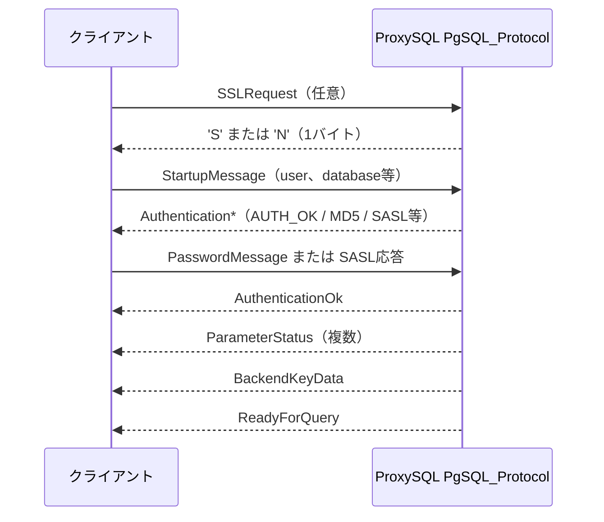

# 第6章 PostgreSQL プロトコル対応

> **本章で読むソース**
>
> - [`lib/PgSQL_Protocol.cpp`](https://github.com/sysown/proxysql/blob/v3.0.9/lib/PgSQL_Protocol.cpp)
> - [`include/PgSQL_Protocol.h`](https://github.com/sysown/proxysql/blob/v3.0.9/include/PgSQL_Protocol.h)

## この章の狙い

ProxySQL は MySQL 向けプロキシとして始まったソフトウェアだが、`PgSQL_Protocol` クラスによって PostgreSQL のワイヤプロトコルにも対応している。
本章では、PostgreSQL のメッセージ形式がどのように解析され、どのように応答パケットが組み立てられるかを、`PgSQL_Protocol.cpp` の実装から追う。
第4章で見た MySQL プロトコルとの対比、特にパケットヘッダの形と認証応答の構造の違いに触れる。
セッション全体の状態遷移や、PostgreSQL 固有のクエリ処理経路は第24章で扱う。

## 前提

本章は、第3章で説明した `PgSQL_Data_Stream`（`MySQL_Data_Stream` の PostgreSQL 版）が受信バッファを保持していることと、第4章で説明した MySQL パケットヘッダの構造を前提とする。
MySQL のパケットヘッダは「3バイトの長さ＋1バイトのシーケンス番号」で、パケット種別はペイロード先頭の1バイト（`COM_QUERY` など）で表現された。
PostgreSQL のワイヤプロトコルはこれと異なり、メッセージ種別をヘッダの一部として持つ。

## メッセージ形式の解析

PostgreSQL の通常のメッセージ（プロトコルバージョン3、以下 v3）は、先頭1バイトの**メッセージ種別**（`'Q'` や `'P'` などの ASCII 文字）と、それに続く4バイトの**メッセージ長**（自分自身を含むがメッセージ種別バイトは含まない）から成る。
これに対して、接続確立直後に送られる**Startup メッセージ**やキャンセル要求は例外で、メッセージ種別バイトを持たず、4バイト長の直後に4バイトのプロトコルバージョン（またはキャンセル要求コード）が続く、古い形式（v2）のヘッダを使う。

この2種類のヘッダを1つの構造体に正規化するのが `pgsql_hdr` である。

[`include/PgSQL_Protocol.h` L62-L66](https://github.com/sysown/proxysql/blob/v3.0.9/include/PgSQL_Protocol.h#L62-L66)

```cpp
struct pgsql_hdr {
	uint32_t type;
	uint32_t len;
	PtrSize_t data;
};
```

`get_header` はこの2種類のヘッダを読み分け、`pgsql_hdr` に統一する。

[`lib/PgSQL_Protocol.cpp` L438-L479](https://github.com/sysown/proxysql/blob/v3.0.9/lib/PgSQL_Protocol.cpp#L438-L479)

```cpp
bool PgSQL_Protocol::get_header(unsigned char* pkt, unsigned int pkt_len, pgsql_hdr* hdr) {
	unsigned int type;
	uint32_t len;
	unsigned int got;
	unsigned int avail;
	uint16_t len16;
	uint8_t type8;
	uint32_t code;
	//const uint8_t* ptr;

	unsigned int read_pos = 0;

	if (pkt_len < NEW_HEADER_LEN) {
		proxy_debug(PROXY_DEBUG_MYSQL_CONNECTION, 7, "Packet received is less than %d bytes\n", NEW_HEADER_LEN);
		return false;
	}

	// below check is not needed 
	//if (read_pos + 1 > pkt_len) {
	//	return false;
	//}
	//

	type8 = pkt[read_pos++];
	type = type8;

	if (type != 0) {
		/*
		 * Regular (v3) packet, starts with type byte and
		 * 4-byte length.
		 */

		if (read_pos + 4 > pkt_len)
			return false;

		 /* wire length does not include type byte */
		if (!get_uint32be(pkt + read_pos, &len))
			return false;
		read_pos+=4;
		len++;
		got = NEW_HEADER_LEN;
	}
```

先頭バイトが `0` でなければ v3 の通常メッセージであり、そのバイトがそのままメッセージ種別になる。
先頭バイトが `0` の場合は、Startup メッセージやキャンセル要求などの特殊パケットであり、4バイトの長さの後に続く4バイトの「コード」を見て種別を判定する。

[`lib/PgSQL_Protocol.cpp` L522-L543](https://github.com/sysown/proxysql/blob/v3.0.9/lib/PgSQL_Protocol.cpp#L522-L543)

```cpp
		if (code == PG_PKT_CANCEL) {
			type = PG_PKT_CANCEL;
		}
		else if (code == PG_PKT_SSLREQ) {
			type = PG_PKT_SSLREQ;
		}
		else if (code == PG_PKT_GSSENCREQ) {
			type = PG_PKT_GSSENCREQ;
		}
		else if ((code >> 16) == 3 && (code & 0xFFFF) < 2) {
			type = PG_PKT_STARTUP;
		}
		else if (code == PG_PKT_STARTUP_V2) {
			type = PG_PKT_STARTUP_V2;
		}
		else {
			proxy_debug(PROXY_DEBUG_MYSQL_CONNECTION, 7, "unknown special pkt: len=%u code=%u\n", len, code);
			return false;
		}
		got = OLD_HEADER_LEN;
	}
```

`code` の上位16ビットが `3`、下位16ビットが `2` 未満であれば、プロトコルバージョン3.0系の Startup メッセージだと判定している（`(code >> 16) == 3 && (code & 0xFFFF) < 2`）。
このように、`get_header` は「v3 の通常メッセージ」と「v2 形式の特殊パケット」という異質な2つのヘッダ形式を、呼び出し側からは意識しなくてよい共通の `pgsql_hdr` に変換する層になっている。

## Startup メッセージと SSL 要求、キャンセル要求

クライアントは接続直後に、TCP 接続1本につき1回だけ Startup メッセージを送る。
Startup メッセージには、`user` や `database` といったキーと値の組がヌル終端文字列として並んでおり、`process_startup_packet` はこれを読み取って `conn_params` に格納する。

[`lib/PgSQL_Protocol.cpp` L624-L644](https://github.com/sysown/proxysql/blob/v3.0.9/lib/PgSQL_Protocol.cpp#L624-L644)

```cpp
bool PgSQL_Protocol::process_startup_packet(unsigned char* pkt, unsigned int len, bool& ssl_request) {
	
	ssl_request = false;
	pgsql_hdr hdr{};
	if (!get_header(pkt, len, &hdr)) {
		return false;
	}

	if (hdr.type == PG_PKT_SSLREQ) {
		const bool have_ssl = pgsql_thread___have_ssl;
		char* ssl_supported = (char*)malloc(1);
		*ssl_supported = have_ssl ? 'S' : 'N';
		(*myds)->PSarrayOUT->add((void*)ssl_supported, 1);
		(*myds)->sess->writeout();
		(*myds)->encrypted = have_ssl;
		ssl_request = true;
		proxy_debug(PROXY_DEBUG_MYSQL_CONNECTION, 8, "Session=%p , DS=%p. SSL_REQUEST:'%c'\n", (*myds)->sess, (*myds), have_ssl ? 'S' : 'N');
		return true;
	}
```

`PG_PKT_SSLREQ`（SSLRequest）が来た場合は、通常のヘッダ付きメッセージではなく `'S'` または `'N'` の1バイトだけを応答する。
これは Startup メッセージより前段階のネゴシエーションであり、PostgreSQL プロトコルでは TLS の要否をこの1バイトのやり取りで先に決めてから、初めて Startup メッセージを送るという2段構えになっている。

キャンセル要求（`PG_PKT_CANCEL`）も同様に、通常のクエリ用コネクションとは別に、実行中のクエリを中断するための短い専用メッセージとして扱われる。

[`lib/PgSQL_Protocol.cpp` L700-L711](https://github.com/sysown/proxysql/blob/v3.0.9/lib/PgSQL_Protocol.cpp#L700-L711)

```cpp
	//PG_PKT_STARTUP_V2 not supported
	if (hdr.type != PG_PKT_STARTUP) {
		proxy_error("Unsupported packet type '%u' received from client %s:%d\n", hdr.type, (*myds)->addr.addr, (*myds)->addr.port);
		return false;
	}

	if (!load_conn_parameters(&hdr)) {
		proxy_debug(PROXY_DEBUG_MYSQL_AUTH, 5, "Session=%p , DS=%p. malformed startup packet.\n", (*myds)->sess, (*myds));
		generate_error_packet(true, false, "invalid startup packet layout: expected terminator as last byte", 
			PGSQL_ERROR_CODES::ERRCODE_PROTOCOL_VIOLATION, true);
		return false;
	}
```

v2 形式の Startup メッセージ（`PG_PKT_STARTUP_V2`）は判定はするが処理を実装しておらず、`PG_PKT_STARTUP`（v3）以外は接続を拒否する。
ProxySQL が対象とする実運用の PostgreSQL クライアントは v3 プロトコルで接続してくるため、古い形式は経路として残しつつ実質的にサポート外としている。

## 認証ハンドシェイク

接続確立からクエリを受け付けられる状態になるまでの一連のメッセージ交換は、次の順序で進む。



Startup メッセージの処理が終わると、ProxySQL は認証方式に応じた `Authentication*` メッセージを送る。
`generate_pkt_initial_handshake` は `pgsql_thread___authentication_method` の設定値に従い、平文パスワード要求、MD5、SASL/SCRAM-SHA-256 のいずれかを選んで送信する。

[`lib/PgSQL_Protocol.cpp` L394-L421](https://github.com/sysown/proxysql/blob/v3.0.9/lib/PgSQL_Protocol.cpp#L394-L421)

```cpp
	switch ((AUTHENTICATION_METHOD)pgsql_thread___authentication_method) {

	case AUTHENTICATION_METHOD::NO_PASSWORD:
		pgpkt.write_generic(type, "i", PG_PKT_AUTH_OK);
		break;
	case AUTHENTICATION_METHOD::CLEAR_TEXT_PASSWORD:
		pgpkt.write_generic(type, "i", PG_PKT_AUTH_PLAIN);
		break;
	case AUTHENTICATION_METHOD::MD5_PASSWORD:
		memset((*myds)->tmp_login_salt, 0, sizeof((*myds)->tmp_login_salt));
		if (RAND_bytes((*myds)->tmp_login_salt, sizeof((*myds)->tmp_login_salt)) != 1) {
			// Fallback method: using a basic pseudo-random generator
			srand((unsigned int)time(NULL));  
			for (size_t i = 0; i < sizeof((*myds)->tmp_login_salt); i++) {
				(*myds)->tmp_login_salt[i] = rand_fast() % 256;
			}
		}
		pgpkt.write_generic(type, "ib", PG_PKT_AUTH_MD5, (*myds)->tmp_login_salt, sizeof((*myds)->tmp_login_salt));
		break;
	case AUTHENTICATION_METHOD::SASL_SCRAM_SHA_256:
		pgpkt.write_generic(type, "iss", PG_PKT_AUTH_SASL, "SCRAM-SHA-256", "");
		break;
	case AUTHENTICATION_METHOD::SASL_SCRAM_SHA_256_PLUS:
		pgpkt.write_generic(type, "iss", PG_PKT_AUTH_SASL, "SCRAM-SHA-256-PLUS", "");
		break;
	default:
		assert(0);
	}
```

MD5 認証では、クライアントごとにランダムな4バイトのソルト（`tmp_login_salt`）を生成し、`AuthenticationMD5Password` メッセージの一部として送る。
このソルトは以後のハンドシェイク応答の検証にも使われるため、`PgSQL_Data_Stream` 側に保持しておく必要がある。

クライアントからの応答は `process_handshake_response_packet` が処理する。
MD5 の場合は、クライアントが送ってきたハッシュ文字列と、サーバー側でユーザー名、パスワード、ソルトから計算したハッシュ文字列を比較する。

[`lib/PgSQL_Protocol.cpp` L956-L1000](https://github.com/sysown/proxysql/blob/v3.0.9/lib/PgSQL_Protocol.cpp#L956-L1000)

```cpp
		switch ((*myds)->auth_method) {
		case AUTHENTICATION_METHOD::MD5_PASSWORD:
		{
			uint32_t pass_len = 0;
			pass = extract_password(&hdr, &pass_len);
			using_password = (pass_len > 0);

			if (pass_len) {
				if (pass[pass_len - 1] == 0) {
					pass_len--; // remove the extra 0 if present
				}
			}

			if (!pass || *pass == '\0') {
				proxy_debug(PROXY_DEBUG_MYSQL_AUTH, 5, "Session=%p , DS=%p , user='%s'. Empty password returned by client.\n", (*myds)->sess, (*myds), user);
				generate_error_packet(true, false, "empty password returned by client", PGSQL_ERROR_CODES::ERRCODE_PROTOCOL_VIOLATION, true);
				break;
			}

			unsigned char md5_digest[MD5_DIGEST_LENGTH];
			char md5_string[MD5_DIGEST_LENGTH * 2 + sizeof((*myds)->tmp_login_salt)];
			EVP_MD_CTX* md5_context = EVP_MD_CTX_new();
			EVP_DigestInit_ex(md5_context, EVP_md5(), NULL);
			EVP_DigestUpdate(md5_context, password, strlen(password));
			EVP_DigestUpdate(md5_context, user, strlen(user));
			unsigned int md5_len = 0;
			EVP_DigestFinal_ex(md5_context, md5_digest, &md5_len);
			for (int i = 0; i < MD5_DIGEST_LENGTH; i++) {
				sprintf(&md5_string[i * 2], "%02x", (unsigned int)md5_digest[i]);
			}
			//
			memcpy(md5_string+(MD5_DIGEST_LENGTH*2), (*myds)->tmp_login_salt, sizeof((*myds)->tmp_login_salt));
			EVP_DigestInit_ex(md5_context, EVP_md5(), NULL);
			EVP_DigestUpdate(md5_context, md5_string, (MD5_DIGEST_LENGTH*2)+sizeof((*myds)->tmp_login_salt));
			EVP_DigestFinal_ex(md5_context, md5_digest, &md5_len);
			EVP_MD_CTX_free(md5_context);
			memcpy(md5_string, "md5", 3);
			for (int i = 0, j = 3;  i < MD5_DIGEST_LENGTH; i++, j+=2) {
				sprintf(&md5_string[j], "%02x", (unsigned int)md5_digest[i]);
			}

			if (strlen(md5_string) == pass_len && strcmp(md5_string, pass) == 0) {
				ret = EXECUTION_STATE::SUCCESSFUL;
			}
		}
		break;
```

PostgreSQL の MD5 認証は「`MD5(password + username)` の16進文字列」を作り、それを再度 `MD5(その文字列 + salt)` にかけて `"md5"` を前置する、という2段階のハッシュになっている。
ProxySQL はクライアントから受け取った平文パスワードそのものではなく、Admin テーブルに登録された `password` から同じ手順でハッシュを再計算し、クライアントの応答と突き合わせている。
SASL/SCRAM-SHA-256 は複数往復のチャレンジレスポンスになるため、`scram_handle_client_first` と `scram_handle_client_final` の2つの補助関数に分けて実装されている（[`include/PgSQL_Protocol.h` L1127-L1177](https://github.com/sysown/proxysql/blob/v3.0.9/include/PgSQL_Protocol.h#L1127-L1177)）。
SCRAM の詳細な計算過程は第5章の認証ハンドシェイクの一般論と重なる部分が多いため、本章では認証方式の枝分かれの構造にとどめる。

認証に成功すると `welcome_client` が呼ばれ、`ParameterStatus` メッセージ群、`BackendKeyData`、`ReadyForQuery` をまとめて送信する。

[`lib/PgSQL_Protocol.cpp` L1358-L1366](https://github.com/sysown/proxysql/blob/v3.0.9/lib/PgSQL_Protocol.cpp#L1358-L1366)

```cpp
void PgSQL_Protocol::welcome_client() {
	PG_pkt pgpkt(128);

	pgpkt.set_multi_pkt_mode(true);
	pgpkt.write_AuthenticationOk();
	
	if (sess->session_type == PROXYSQL_SESSION_ADMIN)
		pgpkt.write_ParameterStatus("is_superuser", "on"); // only for admin
```

`BackendKeyData` に含まれる PID とキャンセルキーは、以後のキャンセル要求（`PG_PKT_CANCEL`）を正しい実行元セッションに結び付けるために使われる値である。

## パケット組み立て機構 `PG_pkt`

ここまでの認証メッセージも、この後で扱う `RowDescription`／`DataRow` も、すべて `PG_pkt` クラスの1つの仕組みで組み立てられている。
中心にあるのが `write_generic` で、書式文字列とその可変長引数からメッセージ本体を組み立てる。

[`lib/PgSQL_Protocol.cpp` L101-L143](https://github.com/sysown/proxysql/blob/v3.0.9/lib/PgSQL_Protocol.cpp#L101-L143)

```cpp
void PG_pkt::write_generic(int type, const char *pktdesc, ...) {
	va_list ap;
	const char *adesc = pktdesc;

	if (multiple_pkt_mode)
		pkt_offset.push_back(size);

	start_packet(type);
	va_start(ap, pktdesc);
	while (*adesc) {
		switch (*adesc) {
			case 'c': // char/byte
				put_char(va_arg(ap, int));
				break;
			case 'h': // uint16
				put_uint16(va_arg(ap, int));
				break;
			case 'i': // uint32
				put_uint32(va_arg(ap, int));
				break;
			case 'q': // uint64
				put_uint64(va_arg(ap, uint64_t));
				break;
			case 's': // Cstring
				put_string(va_arg(ap, char *));
				break;
			case 'b': // bytes
				{
					uint8_t *bin = va_arg(ap, uint8_t *);
					int len = va_arg(ap, int);
					put_bytes(bin, len);
				}
				break;
			default:
				assert(0);
				break;
		}
		adesc++;
	}
	va_end(ap);

	finish_packet();
}
```

書式文字1文字が PostgreSQL プロトコルの型1つに対応する（`c` は1バイト、`h` は16ビット、`i` は32ビット、`s` はヌル終端文字列、`b` は任意長のバイト列）。
`write_AuthenticationOk` や `write_ReadyForQuery` のようなヘッダで見た各メッセージ用メソッドは、この `write_generic` を書式文字列付きで呼び出す薄いラッパーにすぎない（[`include/PgSQL_Protocol.h` L212-L235](https://github.com/sysown/proxysql/blob/v3.0.9/include/PgSQL_Protocol.h#L212-L235)）。
メッセージ種別ごとに専用のシリアライズ処理を書く代わりに、書式文字列という1つのインターフェースに集約している。

`start_packet` と `finish_packet` は、v3 メッセージの「種別1バイト＋長さ4バイト」というヘッダを機械的に処理する。

[`lib/PgSQL_Protocol.cpp` L73-L99](https://github.com/sysown/proxysql/blob/v3.0.9/lib/PgSQL_Protocol.cpp#L73-L99)

```cpp
void PG_pkt::start_packet(int type) {
	assert(type < 256);
	put_char(type);
	put_uint32(0); // this is a space reserved for the packet length
}

void PG_pkt::finish_packet() {
	uint8_t* pos = NULL;
	unsigned len = 0;

	if (multiple_pkt_mode == false) {
		pos = (uint8_t*)ptr + 1; // the first byte after the packet type
		len = size - 1; // the length of the packet minus the packet type byte
	} else {

		if (pkt_offset.empty() == false) {
			const unsigned int offset = pkt_offset.back();
			pos = (uint8_t*)ptr + offset + 1;
			len = (size - offset) - 1;
		}
	}

	*pos++ = (len >> 24) & 255;
	*pos++ = (len >> 16) & 255;
	*pos++ = (len >> 8) & 255;
	*pos++ = len & 255;
}
```

`start_packet` は種別バイトを書いた直後、長さフィールドの位置を4バイト分ゼロで予約しておき、`finish_packet` でペイロードを書き終えたあとに実際の長さを埋め戻す。
これにより、可変長のペイロードを書きながら長さを事前計算する必要がなくなる。
`multiple_pkt_mode` が有効なとき（`welcome_client` のように複数メッセージを1つのバッファへ連続して積むとき）は `pkt_offset` にオフセットを積んでおき、直前に開始したメッセージだけを対象に長さを埋め戻す。

## 結果セットの送出：RowDescription と DataRow

クエリ結果を返す `RowDescription`（列定義）と `DataRow`（行データ）も、`write_generic` と同じ「先に長さの場所を空けておき、あとで埋め戻す」構造を使うが、列数が可変であるため専用の実装になっている。

[`lib/PgSQL_Protocol.cpp` L145-L198](https://github.com/sysown/proxysql/blob/v3.0.9/lib/PgSQL_Protocol.cpp#L145-L198)

```cpp
void PG_pkt::write_RowDescription(const char *tupdesc, ...) {
	va_list ap;
	int ncol = strlen(tupdesc);

	start_packet('T');

	put_uint16(ncol);

	va_start(ap, tupdesc);
	for (int i = 0; i < ncol; i++) {
		char * name = va_arg(ap, char *);

		/* Fields: name, reloid, colnr, oid, typsize, typmod, fmt */
		put_string(name);
		put_uint32(0);
		put_uint16(0);
		const char c = tupdesc[i];
		switch (c) {
			case 's':
				put_uint32(TEXTOID);
				put_uint16(-1);
				break;
			case 'b':
				put_uint32(BYTEAOID);
				put_uint16(-1);
				break;
			case 'i':
				put_uint32(INT4OID);
				put_uint16(4);
				break;
			case 'q':
				put_uint32(INT8OID);
				put_uint16(8);
				break;
			case 'N':
				put_uint32(NUMERICOID);
				put_uint16(-1);
				break;
			case 'T':
				put_uint32(TEXTOID);
				put_uint16(-1);
				break;
			default:
				assert(0);
				break;
		}
		put_uint32(-1);
		put_uint16(0);
	}
	va_end(ap);

	/* set correct length */
	finish_packet();
}
```

`tupdesc` は1文字1列で型を表す簡易な書式文字列（`s` = TEXT、`i` = INT4、`q` = INT8 など）であり、`write_generic` の型コードとは独立した小さな DSL になっている。
この型コードは `write_DataRow` でも使われ、行データを実際に PostgreSQL のテキスト形式に変換して送る。

[`lib/PgSQL_Protocol.cpp` L297-L318](https://github.com/sysown/proxysql/blob/v3.0.9/lib/PgSQL_Protocol.cpp#L297-L318)

```cpp
void PG_pkt::write_DataRow(const char *tupdesc, ...) {
	int ncol = strlen(tupdesc);
	va_list ap;

	start_packet('D');
	put_uint16(ncol);

	va_start(ap, tupdesc);
	for (int i = 0; i < ncol; i++) {
		char tmp[128];
		char *tmp2 = NULL;
		const char *val = NULL;

		if (tupdesc[i] == 'i') {
			snprintf(tmp, sizeof(tmp), "%d", va_arg(ap, int));
			val = tmp;
		} else if (tupdesc[i] == 'q' || tupdesc[i] == 'N') {
			snprintf(tmp, sizeof(tmp), "%" PRIu64, va_arg(ap, uint64_t));
			val = tmp;
		} else if (tupdesc[i] == 's') {
			val = va_arg(ap, char *);
		} else if (tupdesc[i] == 'b') {
```

`DataRow` の各列は「4バイト長＋その長さ分のデータ」（NULL のときは長さフィールドに `-1`）という形式で、MySQL の Text Protocol の長さプレフィックス付き文字列（第4章参照）と発想は近い。
違いは、PostgreSQL では列の値を文字列として送るか、バイナリとして送るかを `RowDescription` の `format` フィールドで列ごとに指定できる点である。
このフィールドは `write_RowDescription` の末尾に置かれる `put_uint16(0)` に対応し、値0はテキスト形式を表す。
MySQL の Text Protocol にはこの列ごとの形式指定という概念がなく、常にテキスト表現で値をやり取りする。

## 高速化の工夫：可変長バッファの2の冪拡張とバッファ譲渡

`PG_pkt` は内部バッファ `ptr` に対して `put_char` や `put_string` を繰り返し呼び出しながらパケットを組み立てる。
このとき、書き込むたびに `realloc` していては呼び出し回数に比例してシステムコールとコピーが発生してしまう。

[`lib/PgSQL_Protocol.cpp` L26-L35](https://github.com/sysown/proxysql/blob/v3.0.9/lib/PgSQL_Protocol.cpp#L26-L35)

```cpp
void PG_pkt::make_space(unsigned int len) {
	if (ownership == false)  return;

	if ((size + len) <= capacity) {
		return;
	} else {
		capacity = l_near_pow_2(size + len);
		ptr = (char *)realloc(ptr, capacity);
	}
}
```

`make_space` は必要バイト数を超えるたびに `realloc` するのではなく、`l_near_pow_2` で必要サイズ以上の直近の2の冪に切り上げてから拡張する。
これにより、`RowDescription` や `DataRow` のように列を1つずつ `put_*` で追記していっても、拡張回数はデータ量に対して対数オーダーに抑えられ、拡張のたびに前のデータをコピーし直すコストも償却される。

さらに、組み立て終えたバッファを出力キューへ渡すときも、コピーではなく所有権の移動で済ませている。

[`include/PgSQL_Protocol.h` L102-L110](https://github.com/sysown/proxysql/blob/v3.0.9/include/PgSQL_Protocol.h#L102-L110)

```cpp
	std::pair<char*, unsigned int> detach() {
		std::pair<char*, unsigned int> result(ptr, size);
		ptr = nullptr;
		size = 0;
		capacity = 0;
		multiple_pkt_mode = false;
		pkt_offset.clear();
		return result;
	}
```

`detach`（および `to_PtrSizeArray`）は内部バッファのポインタをそのまま呼び出し側に渡し、`PG_pkt` 側は新しいバッファを持つか空になる。
`welcome_client` のように複数のメッセージを1つのバッファへ連続して書き込んだ場合でも、送信直前に丸ごとコピーし直す必要がなく、`malloc` されたバッファはそのまま `PSarrayOUT`（送信待ちパケットのキュー）に載る。

## まとめ

`PgSQL_Protocol` は、`pgsql_hdr` によって v3 メッセージと v2 形式の特殊パケットを共通のヘッダ表現に正規化し、SSLRequest、Startup メッセージ、通常メッセージという段階を踏んでハンドシェイクを進める。
認証は `NO_PASSWORD`／`CLEAR_TEXT_PASSWORD`／`MD5_PASSWORD`／SASL SCRAM-SHA-256 の4方式に分岐し、方式ごとにクライアント応答の検証手順が異なる。
応答パケットの組み立ては `PG_pkt` の `write_generic` に集約されており、書式文字列でメッセージ本体を記述する薄い設計になっている。
可変長バッファは2の冪拡張で償却コストを抑え、完成したバッファは送信キューへポインタごと譲渡されるため、余計なコピーが発生しない。

## 関連する章

- 第3章「`MySQL_Data_Stream` による接続の状態機械とバッファリング」（`PgSQL_Data_Stream` の基盤）
- 第4章「MySQL プロトコルの解析と生成」（パケットヘッダとメッセージ形式の対比）
- 第5章「認証ハンドシェイクとユーザー認証」（認証方式の一般論）
- 第24章「PostgreSQL サポートの全体像とセッション処理」（セッション状態機械とクエリ処理の詳細）
