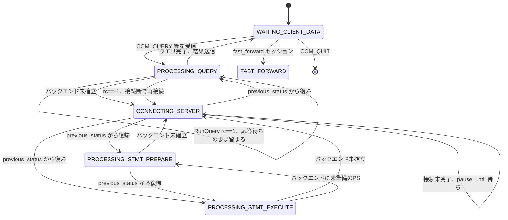

# 第7章 MySQL_Session の状態機械

> **本章で読むソース**
>
> - [`lib/MySQL_Session.cpp`](https://github.com/sysown/proxysql/blob/v3.0.9/lib/MySQL_Session.cpp)
> - [`include/MySQL_Session.h`](https://github.com/sysown/proxysql/blob/v3.0.9/include/MySQL_Session.h)
> - [`include/proxysql_structs.h`](https://github.com/sysown/proxysql/blob/v3.0.9/include/proxysql_structs.h)
> - [`lib/MySQL_Thread.cpp`](https://github.com/sysown/proxysql/blob/v3.0.9/lib/MySQL_Thread.cpp)

## この章の狙い

**MySQL_Session** は、1本のクライアント接続を表すオブジェクトである。

第2章で見たワーカースレッド（`MySQL_Thread`）は、1スレッドで数百から数千の `MySQL_Session` を並行に処理する。

1個のクエリの実行が完了するまでスレッドを占有していては、この並行度は成立しない。

ProxySQLはこの問題を、`MySQL_Session` が自分の処理段階を **`status`**（`session_status` 型）という状態変数として持ち、ワーカースレッドのイベントループが「進められる状態のセッションだけ」を1回ずつ前に進める、という形で解決している。

本章では、この状態変数がとりうる値と、`handler()` というメソッドがワーカースレッドから繰り返し呼ばれることで状態がどう遷移していくかを追う。

クライアント側とバックエンド側という2本のデータストリームをまたいで、1個の `status` がどちらの言い分も調停する様子に注目する。

## 前提

`MySQL_Session` は、フロントエンド側の `MySQL_Data_Stream`（`client_myds`、第3章）と、バックエンド側の `MySQL_Data_Stream`（`mybe->server_myds`）をそれぞれ1個ずつ持つ。

第3章で扱った **DSS**（Data Stream Status）が個々のソケットのバイト列の切り出し段階を表すのに対し、本章の `status` はセッション全体としてどのフェーズにいるかを表す。

両者は独立した状態変数であり、たとえば `status` が `PROCESSING_QUERY` の間にも、バックエンド側の DSS はパケット受信の途中経過に応じて細かく遷移する。

`status` がとりうる値は `session_status` 列挙で定義されている。

[`include/proxysql_structs.h` L286-L323](https://github.com/sysown/proxysql/blob/v3.0.9/include/proxysql_structs.h#L286-L323)

```c++
enum session_status {
	CONNECTING_CLIENT,
	CONNECTING_SERVER,
	LDAP_AUTH_CLIENT,
	PINGING_SERVER,
	WAITING_CLIENT_DATA,
	WAITING_SERVER_DATA,
	PROCESSING_QUERY,
	CHANGING_SCHEMA,
	CHANGING_CHARSET,
	SETTING_CHARSET,
	CHANGING_AUTOCOMMIT,
	CHANGING_USER_CLIENT,
	CHANGING_USER_SERVER,
	RESETTING_CONNECTION,
	RESETTING_CONNECTION_V2,
	SETTING_INIT_CONNECT,
	SETTING_LDAP_USER_VARIABLE,
	SETTING_ISOLATION_LEVEL,
	SETTING_TRANSACTION_READ,
	SETTING_SESSION_TRACK_GTIDS,
	SETTING_MULTI_STMT,
	FAST_FORWARD,
	PROCESSING_STMT_PREPARE,
	PROCESSING_STMT_DESCRIBE,
	PROCESSING_STMT_EXECUTE,
	SETTING_VARIABLE,
	SETTING_MULTIPLE_VARIABLES,
	SETTING_SET_NAMES,
	SHOW_WARNINGS,
	SETTING_NEXT_ISOLATION_LEVEL,
	SETTING_NEXT_TRANSACTION_READ,
	PROCESSING_EXTENDED_QUERY_SYNC,
	RESYNCHRONIZING_CONNECTION,
	SETTING_SESSION_TRACK_VARIABLES,
	SETTING_SESSION_TRACK_STATE,
	session_status___NONE // special marker
};
```

30を超える値のうち、大半は「クライアントが送ってきたある1個のセッション変数（文字コード、隔離レベル、autocommitなど）をバックエンド接続にも反映させ終えるまでの一時的な状態」である。

これらは第9章のクエリプロセッサがどの変数変更を要求したかによって選ばれる。

本章では、状態機械そのものの骨格を作っている値、すなわち `WAITING_CLIENT_DATA`、`CONNECTING_SERVER`、`PROCESSING_QUERY` 系、`FAST_FORWARD` に絞って扱う。

一点注意しておきたいのは、`session_status` の列挙値と、実行時に実際に `status` へ代入される値は同じではないという点である。

`WAITING_SERVER_DATA` は列挙のメンバーとして定義されているが、`lib/MySQL_Session.cpp` 全体を検索しても `status` への代入箇所も `switch (status)` の分岐先も見つからない。

バックエンドからの応答を待つ間、`status` は後述のとおり `PROCESSING_QUERY` のまま留まる。

`WAITING_SERVER_DATA` は予約されているだけで、到達しない値として本章の状態遷移図では扱う。

## handler() を繰り返し呼び出すワーカースレッド

`MySQL_Session::handler()` は、1回の呼び出しで状態を高々数段階進め、必ず戻ってくる関数である。

ブロッキングI/Oを一切呼ばず、ソケットの読み書きが完了していなければその場で `return` する。

呼び出し元は `MySQL_Thread` のイベントループであり、`epoll`（`mypolls`）でフロントエンドとバックエンド両方のファイルディスクリプタを監視し、読み書き可能になったセッションの `to_process` フラグを立てる。

[`lib/MySQL_Thread.cpp` L4058-L4060](https://github.com/sysown/proxysql/blob/v3.0.9/lib/MySQL_Thread.cpp#L4058-L4060)

```c++
					mypolls.last_recv[n]=curtime;
					myds->revents=mypolls.fds[n].revents;
					myds->sess->to_process=1;
```

`to_process` が立ったセッションだけが、そのイテレーションで `handler()` を呼ばれる。

[`lib/MySQL_Thread.cpp` L4515-L4519](https://github.com/sysown/proxysql/blob/v3.0.9/lib/MySQL_Thread.cpp#L4515-L4519)

```c++
			if (sess->to_process==1) {
				if (sess->pause_until <= curtime) {
					rc=sess->handler();

					if (rc==-1 || sess->killed==true) {
```

つまり、1本のクエリが応答を返すまでの数ミリ秒から数秒のあいだ、そのセッションはスレッドから見て「待ち状態のオブジェクト」でしかなく、CPUもスレッドスタックも占有しない。

同じスレッドは、その間に他の数百セッションの `handler()` を回すことができる。

これが、ProxySQLが少数のワーカースレッドで大量の接続を捌ける理由の1つである。

## handler() 内部の分配: switch(status) と goto

`handler()` の内部は、`status` の値で分岐する巨大な `switch` 文と、状態を即座に切り替えて分岐をやり直す `goto handler_again` の組み合わせで構成されている。

[`lib/MySQL_Session.cpp` L1808-L1810](https://github.com/sysown/proxysql/blob/v3.0.9/lib/MySQL_Session.cpp#L1808-L1810)

```c++
// NEXT_IMMEDIATE is a legacy macro used inside handler() to immediately jump
// to handler_again
#define NEXT_IMMEDIATE(new_st) do { set_status(new_st); goto handler_again; } while (0)
```

`NEXT_IMMEDIATE` は「状態を変えて、`handler()` から抜けずにもう一度 `switch` へ入り直す」という操作を1つの名前にまとめたものである。

これにより、1回の `handler()` 呼び出しの中で、I/O待ちが発生しない限り複数の状態を連続して通過できる。

呼び出しのたびに新たにクライアントからのパケットを取り込んだうえで、`switch (status)` に入る。

[`lib/MySQL_Session.cpp` L5299-L5353](https://github.com/sysown/proxysql/blob/v3.0.9/lib/MySQL_Session.cpp#L5299-L5353)

```c++
handler_again:

	switch (status) {
		case WAITING_CLIENT_DATA:
			// housekeeping
			handler___status_WAITING_CLIENT_DATA();
			// In-core check_genai_events() poll-loop hook removed in Step 4
			// of the GenAI plugin carve-out -- the async-genai socketpair
			// protocol it monitored is gone with the GENAI:/LLM: prefix
			// handlers.  Plugins that need their own per-session polling
			// hook will get one through a future ABI extension; today the
			// only consumer (the genai plugin) handles everything inline
			// from the query hook.
			break;
		case FAST_FORWARD:
			if (mybe->server_myds->mypolls==NULL) {
				// register the mysql_data_stream
				thread->mypolls.add(POLLIN|POLLOUT, mybe->server_myds->fd, mybe->server_myds, thread->curtime);
			}
// ... (中略) ...
			client_myds->PSarrayOUT->copy_add(mybe->server_myds->PSarrayIN, 0, mybe->server_myds->PSarrayIN->len);
			while (mybe->server_myds->PSarrayIN->len) mybe->server_myds->PSarrayIN->remove_index(mybe->server_myds->PSarrayIN->len-1,NULL);
			break;
		case CONNECTING_CLIENT:
			//fprintf(stderr,"CONNECTING_CLIENT\n");
			// FIXME: to implement
			break;
		case PINGING_SERVER:
			{
				int rc=handler_again___status_PINGING_SERVER();
				if (rc==-1) { // if the ping fails, we destroy the session
					handler_ret = -1;
					return handler_ret;
				}
			}
			break;
```

`WAITING_CLIENT_DATA` の分岐にある `handler___status_WAITING_CLIENT_DATA()` は、現在のバージョンではハウスキーピングの呼び出しのみが残っており、コメントにあるとおり以前あった処理は他所へ移されている。

実際のコマンド振り分けは、この `switch` に入るより前、クライアントからのパケットを取り込む `get_pkts_from_client()` の内部で行われる。

[`lib/MySQL_Session.cpp` L4338-L4354](https://github.com/sysown/proxysql/blob/v3.0.9/lib/MySQL_Session.cpp#L4338-L4354)

```c++
		switch (status) {
			case WAITING_CLIENT_DATA:
				if (pkt.size==(0xFFFFFF+sizeof(mysql_hdr))) { // we are handling a multi-packet
					GPFC_DetectedMultiPacket_SetDDS();
				}
				switch (client_myds->DSS) {
					case STATE_SLEEP_MULTI_PACKET:
						if (handler___status_WAITING_CLIENT_DATA___STATE_SLEEP_MULTI_PACKET(pkt)) {
							// if handler___status_WAITING_CLIENT_DATA___STATE_SLEEP_MULTI_PACKET
							// returns true it meansa we need to reiterate
							goto __get_pkts_from_client;
						}
						// Note: the above function can change DSS to STATE_SLEEP
						// in that case we don't break from the witch but continue
						if (client_myds->DSS!=STATE_SLEEP) // if DSS==STATE_SLEEP , we continue
							break;
					case STATE_SLEEP:	// only this section can be executed ALSO by mirror
```

つまり `WAITING_CLIENT_DATA` は2箇所で条件を見ている。

`get_pkts_from_client()` の中では「クライアントが送ってきたパケットの中身（`COM_QUERY` か `COM_STMT_EXECUTE` かなど）」で分岐し、`status` を `PROCESSING_QUERY` などへ書き換える。

そのあとの `switch (status)` では、書き換えられた新しい `status` を見て、実際の処理（バックエンドへの接続、クエリの発行）を進める。

コマンドの種類ごとの振り分けと個々のコマンドの実装は第8章で扱う。

本章はその手前、`status` という1本の変数が全体の処理段階をどう管理しているかに絞る。

## クエリ処理中の状態: PROCESSING_QUERY とバックエンド接続の確立

クライアントから `COM_QUERY` を受け取り `status` が `PROCESSING_QUERY` になった直後の1回目の `handler_again` では、まだバックエンド接続が存在しない。

`switch (status)` の `PROCESSING_QUERY` 分岐は、`PROCESSING_STMT_PREPARE` と `PROCESSING_STMT_EXECUTE` も含めて1つのケースにまとめられている。

バックエンド接続がまだ張られていない場合、現在の `status` を `previous_status` というスタックへ退避したうえで `CONNECTING_SERVER` へ即座に遷移する。

[`lib/MySQL_Session.cpp` L5364-L5394](https://github.com/sysown/proxysql/blob/v3.0.9/lib/MySQL_Session.cpp#L5364-L5394)

```c++
		case PROCESSING_STMT_PREPARE:
		case PROCESSING_STMT_EXECUTE:
		case PROCESSING_QUERY:
			// Pause Check
			// It checks if pause_until is greater than the current time (thread->curtime).
			// If so, it returns handler_ret immediately, indicating that processing should be paused until a later time.
			if (pause_until > thread->curtime) {
				handler_ret = 0;
				return handler_ret;
			}
			if (mysql_thread___connect_timeout_server_max) {
				if (mybe->server_myds->max_connect_time==0) {
					// set max_connect_time to the current time plus the specified timeout value
					mybe->server_myds->max_connect_time=thread->curtime+(long long)mysql_thread___connect_timeout_server_max*1000;
				}
			} else {
				// set max_connect_time to zero, indicating no timeout
				mybe->server_myds->max_connect_time=0;
			}
			handler_KillConnectionIfNeeded();

			// checks if the backend MySQL server associated with the session has been initialized (STATE_NOT_INITIALIZED)
			if (mybe->server_myds->DSS==STATE_NOT_INITIALIZED) {
				// we don't have a backend yet
				// It saves the current processing status of the session (status) onto the previous_status stack
				// Sets the previous status of the MySQL session according to the current status.
				set_previous_status_mode3();
				// It transitions the session to the CONNECTING_SERVER state immediately.
				NEXT_IMMEDIATE(CONNECTING_SERVER);
			} else {
```

`set_previous_status_mode3()` は、`previous_status`（`std::stack<enum session_status>`、[`include/MySQL_Session.h` L411](https://github.com/sysown/proxysql/blob/v3.0.9/include/MySQL_Session.h#L411)）に、いま中断する `status` を積むだけの単純な関数である。

[`lib/MySQL_Session.cpp` L1876-L1895](https://github.com/sysown/proxysql/blob/v3.0.9/lib/MySQL_Session.cpp#L1876-L1895)

```c++
void MySQL_Session::set_previous_status_mode3(bool allow_execute) {
	switch(status) {
		case PROCESSING_QUERY:
			previous_status.push(PROCESSING_QUERY);
			break;
		case PROCESSING_STMT_PREPARE:
			previous_status.push(PROCESSING_STMT_PREPARE);
			break;
		case PROCESSING_STMT_EXECUTE:
			if (allow_execute == true) {
				previous_status.push(PROCESSING_STMT_EXECUTE);
				break;
			}
		default:
			// LCOV_EXCL_START
			assert(0); // Assert to indicate an unexpected status value
			break;
			// LCOV_EXCL_STOP
	}
}
```

`CONNECTING_SERVER` 状態を処理する `handler_again___status_CONNECTING_SERVER()` は、コネクションプールから空きバックエンド接続を取得し、まだ接続が確立していなければ `pause_until` をセットして `false` を返す。

[`lib/MySQL_Session.cpp` L2994-L2998](https://github.com/sysown/proxysql/blob/v3.0.9/lib/MySQL_Session.cpp#L2994-L2998)

```c++
	if (mybe->server_myds->myconn==NULL) {
		pause_until=thread->curtime+mysql_thread___connect_retries_delay*1000;
		*_rc=1;
		return false;
	} else {
```

呼び出し元の `switch` は `false` が返ってきたときは何もせず `break` し、`handler()` はそのまま処理を終える。

[`lib/MySQL_Session.cpp` L5689-L5695](https://github.com/sysown/proxysql/blob/v3.0.9/lib/MySQL_Session.cpp#L5689-L5695)

```c++
		case CONNECTING_SERVER:
			{
				int rc=0;
				if (handler_again___status_CONNECTING_SERVER(&rc))
					goto handler_again;	// we changed status
			}
			break;
```

接続が確立し、セッション変数（文字コード、autocommitなど）の同期も終わっていれば、`previous_status` からもとの `status`（`PROCESSING_QUERY` など）を取り出して復帰する。

[`lib/MySQL_Session.cpp` L3007-L3016](https://github.com/sysown/proxysql/blob/v3.0.9/lib/MySQL_Session.cpp#L3007-L3016)

```c++
		enum session_status st=status;
		if (mybe->server_myds->myconn->async_state_machine==ASYNC_IDLE) {
			if (handle_session_track_capabilities() == false) {
				pause_until = thread->curtime + mysql_thread___connect_retries_delay*1000;
				return false;
			}

			st=previous_status.top();
			previous_status.pop();
			NEXT_IMMEDIATE_NEW(st);
```

`previous_status` は、単純な「元の状態へ戻る」だけでなく、`PROCESSING_STMT_EXECUTE` の途中でバックエンド側にプリペアドステートメントの準備がまだない場合にも使われる。

その場合は `PROCESSING_STMT_EXECUTE` を退避して `PROCESSING_STMT_PREPARE` へ割り込み、完了後にまた `PROCESSING_STMT_EXECUTE` へ戻ってくる（第12章）。

`previous_status` は「呼び出し先状態から戻るべき状態」をスタックとして管理することで、`CONNECTING_SERVER` や `PROCESSING_STMT_PREPARE` のような**割り込み的な状態**を、呼び出し元の状態を汚さずに何段でも挟み込めるようにしている。

## クエリの発行とバックエンド応答待ち

バックエンド接続が確立済みの場合、`PROCESSING_QUERY` 系の分岐は `RunQuery()` を呼び、その戻り値で分岐する。

[`lib/MySQL_Session.cpp` L5119-L5140](https://github.com/sysown/proxysql/blob/v3.0.9/lib/MySQL_Session.cpp#L5119-L5140)

```c++
int MySQL_Session::RunQuery(MySQL_Data_Stream *myds, MySQL_Connection *myconn) {
	PROXY_TRACE2();
	int rc = 0;
	switch (status) {
		case PROCESSING_QUERY:
			rc=myconn->async_query(myds->revents, myds->mysql_real_query.QueryPtr,myds->mysql_real_query.QuerySize);
			break;
		case PROCESSING_STMT_PREPARE:
			rc=myconn->async_query(myds->revents, (char *)CurrentQuery.QueryPointer,CurrentQuery.QueryLength,&CurrentQuery.mysql_stmt);
			break;
		case PROCESSING_STMT_EXECUTE:
			PROXY_TRACE2();
			rc=myconn->async_query(myds->revents, (char *)CurrentQuery.QueryPointer,CurrentQuery.QueryLength,&CurrentQuery.mysql_stmt, CurrentQuery.stmt_meta);
			break;
		default:
			// LCOV_EXCL_START
			assert(0);
			break;
			// LCOV_EXCL_STOP
	}
	return rc;
}
```

`async_query()` はノンブロッキングの `libmysqlclient` を用いた `MySQL_Connection` 側の状態機械であり、その内部状態遷移はASYNC接頭辞のconnection state machine（`mysql_connection.cpp`）が受け持つ。

戻り値 `rc` が `1` のとき、クエリはまだ実行中でバックエンドからの応答を待っている。

[`lib/MySQL_Session.cpp` L5622-L5630](https://github.com/sysown/proxysql/blob/v3.0.9/lib/MySQL_Session.cpp#L5622-L5630)

```c++
					} else {
						switch (rc) {
							// rc==1 , query is still running
							// start sending to frontend if mysql_thread___threshold_resultset_size is reached
							case 1:
								if (myconn->MyRS && myconn->MyRS->result && myconn->MyRS->resultset_size > (unsigned int) mysql_thread___threshold_resultset_size) {
									myconn->MyRS->get_resultset(client_myds->PSarrayOUT);
								}
								break;
```

この `case 1` では `NEXT_IMMEDIATE` も呼ばれず、`status` を書き換えないまま `switch` を抜けて `handler()` は終了する。

つまり、バックエンドの応答を待つあいだ `status` は `PROCESSING_QUERY`（あるいは `PROCESSING_STMT_PREPARE`／`PROCESSING_STMT_EXECUTE`）に留まったままであり、専用の待機状態へは遷移しない。

これが、前提の節で触れた「`WAITING_SERVER_DATA` へは実際には遷移しない」という事実の具体的な現れである。

バックエンド接続の `fd` は `CONNECTING_SERVER` の処理過程で `thread->mypolls` に登録済みであり、応答データが届けば `to_process` が再度立って `handler()` が呼ばれる。

そのときも `status` は変わらず `PROCESSING_QUERY` のままなので、`switch` は再び同じ `case` に入り、`RunQuery()` を再度呼んで `async_query()` の継続処理（`mysql_real_query_cont` 相当）を進める。

`rc` が `0`（クエリ完了）になれば結果セットをクライアントへ書き出し、`rc` が `-1`（エラー）ならエラー処理へ分岐する。

[`lib/MySQL_Session.cpp` L5583-L5602](https://github.com/sysown/proxysql/blob/v3.0.9/lib/MySQL_Session.cpp#L5583-L5602)

```c++
					if (rc==-1) {
						// the query failed
						int myerr=mysql_errno(myconn->mysql);
						char *errmsg = NULL;
						if (myerr == 0) {
							if (CurrentQuery.mysql_stmt) {
								myerr = mysql_stmt_errno(CurrentQuery.mysql_stmt);
								errmsg = strdup(mysql_stmt_error(CurrentQuery.mysql_stmt));
							}
						}
						MyHGM->p_update_mysql_error_counter(p_mysql_error_type::mysql, myconn->parent->myhgc->hid, myconn->parent->address, myconn->parent->port, myerr);
						CurrentQuery.mysql_stmt=NULL; // immediately reset mysql_stmt
						int rc1 = handler_ProcessingQueryError_CheckBackendConnectionStatus(myds);
						if (rc1 == -1) {
							handler_ret = -1;
							return handler_ret;
						} else {
							if (rc1 == 1)
								NEXT_IMMEDIATE(CONNECTING_SERVER);
						}
```

バックエンド接続が失われていた場合には、ここでも `CONNECTING_SERVER` へ戻り、新しい接続を取得してクエリを再送する経路がある（この再送の可否や条件は第14章のコネクションプールで扱う）。

## Mermaid による状態遷移図

以下は、`status` が実行時に実際にとる値と遷移だけを実線で示したものである。

`WAITING_SERVER_DATA` はコード上到達しないため実線に含めず、注記として添える。



`session_status` にはこのほか `CHANGING_SCHEMA`、`SETTING_ISOLATION_LEVEL` など、クライアントが要求したセッション変数の変更をバックエンドへ反映するための一時状態が多数ある。

これらはいずれも「`PROCESSING_QUERY` の手前に割り込み、処理後に `PROCESSING_QUERY` か `WAITING_CLIENT_DATA` へ戻る」という同じ形をとるため、図を煩雑にしないよう省略した。

## 最適化: コールバック地獄を避けるポーリング型の協調的マルチタスク

1スレッドで多数の接続を扱う設計には、大きく2つの実装方針がある。

一つは、I/O完了ごとにコールバック関数を呼び出す方式である。

もう一つは、ProxySQLが採用している、`status` という有限の値で「どこまで進んだか」を明示的に持ち、スレッドのループが `handler()` を毎回同じ入り口から呼び直す方式である。

後者では、`handler()` の呼び出しはいつでも `switch (status)` の対応する `case` から再開でき、呼び出しの合間の文脈（ローカル変数）を保持する必要がない。

必要な文脈はすべて `MySQL_Session` のメンバ変数（`status`、`previous_status`、`CurrentQuery` など）としてオブジェクトに刻まれている。

この設計により、ワーカースレッドは巨大なコールバックチェーンを構築せずに、「`to_process` が立っているセッションの `handler()` を順番に1回ずつ呼ぶ」という単純なループだけで、数千接続のクエリ処理を多重化できる。

I/O待ちのセッションはスレッドの実行を一切妨げないため、スレッド数をCPUコア数程度に抑えたまま、接続数に対してスケールする。

## まとめ

`MySQL_Session` は `status`（`session_status`）という1個の状態変数を持ち、ワーカースレッドから繰り返し呼ばれる `handler()` の中で `switch (status)` と `goto handler_again`（`NEXT_IMMEDIATE`）を使って状態を進める。

バックエンド接続がまだない場合は `previous_status` スタックへ現在の状態を退避して `CONNECTING_SERVER` に割り込み、接続確立後に復帰する。

クエリ実行中にバックエンドの応答を待つ間は、専用の待機状態（`WAITING_SERVER_DATA`）へは遷移せず、`PROCESSING_QUERY` 系の状態に留まったまま `handler()` を抜け、次にデータが届いたときに同じ `case` から処理を再開する。

この「状態を明示的な値として持ち、ノンブロッキングに handler() を呼び直す」設計が、少数のワーカースレッドで大量のセッションを多重化する土台になっている。

## 関連する章

- 第3章「MySQL_Data_Stream による接続の状態機械とバッファリング」: 本章の `status` と対をなす、ソケット単位のDSS。
- 第8章「クエリのライフサイクル」: `get_pkts_from_client()` でのコマンド振り分けと `WAITING_CLIENT_DATA` からの遷移先の詳細。
- 第12章「プリペアドステートメント」: `PROCESSING_STMT_PREPARE` と `PROCESSING_STMT_EXECUTE` の間を `previous_status` が仲介する仕組み。
- 第13章「Hostgroups Manager」: `CONNECTING_SERVER` が接続を取得する先のホストグループ選択。
- 第14章「コネクションプール」: バックエンド接続断からの再接続と再送の詳細。
