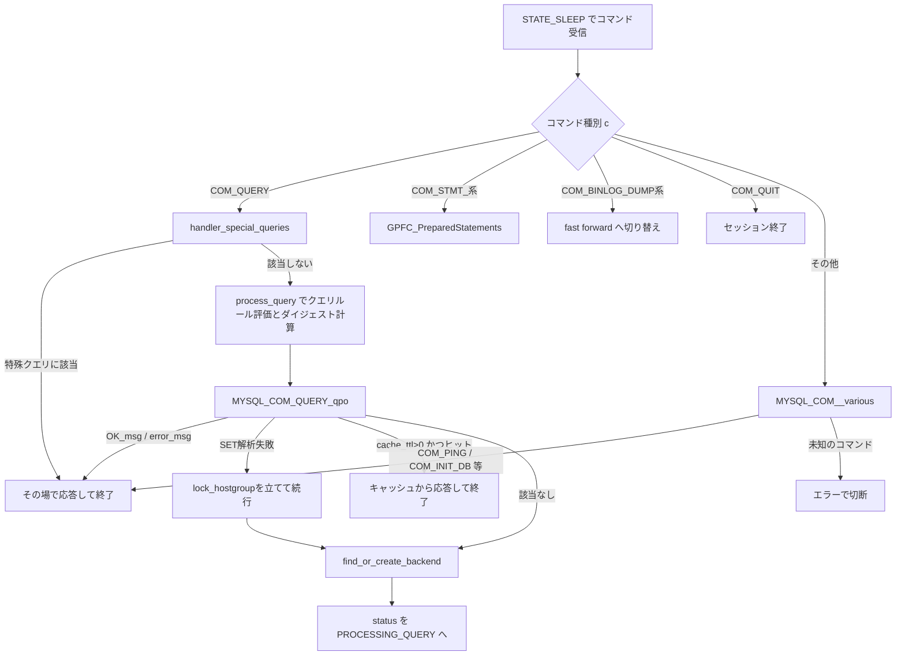

# 第8章 クエリのライフサイクルとコマンドディスパッチ

> **本章で読むソース**
>
> - [`lib/MySQL_Session.cpp`](https://github.com/sysown/proxysql/blob/v3.0.9/lib/MySQL_Session.cpp)
> - [`include/proxysql_structs.h`](https://github.com/sysown/proxysql/blob/v3.0.9/include/proxysql_structs.h)

## この章の狙い

第7章では、`MySQL_Session` が `WAITING_CLIENT_DATA` 状態のもとで `client_myds->DSS` を介してコマンド受信の局面を区別することを見た。
本章では、その `STATE_SLEEP` 局面で実際にクライアントの1コマンドを受け取ってから、クエリルール評価やダイジェスト計算を経てバックエンドへ送るまでの一連の流れを追う。
`COM_QUERY` を主経路とし、`COM_STMT_*` や `COM_INIT_DB` などほかのコマンドがどこで分岐するかも合わせて示す。

## 前提

第7章で確認したとおり、`get_pkts_from_client()` はクライアントから届いたパケットを1件ずつ取り出し、セッションの `status` と `client_myds->DSS` の組み合わせで処理を振り分ける。
本章が扱うのは、その中でも `status == WAITING_CLIENT_DATA` かつ `client_myds->DSS == STATE_SLEEP` の局面である。
この局面は、クライアントが新しいコマンドを送ってくるのを待っている定常状態にあたる。

## コマンドディスパッチの入口

`STATE_SLEEP` に達すると、パケット先頭のコマンドバイトを読み出し、`enum_mysql_command` の値で分岐する。

[`lib/MySQL_Session.cpp L4373-L4373`](https://github.com/sysown/proxysql/blob/v3.0.9/lib/MySQL_Session.cpp#L4373-L4373)

```cpp
						c=*((unsigned char *)pkt.ptr+sizeof(mysql_hdr));
```

このバイト `c` を鍵に、`get_pkts_from_client()` 内の `switch ((enum_mysql_command)c)` がコマンドごとの処理へ振り分ける。

[`lib/MySQL_Session.cpp L4422-L4423`](https://github.com/sysown/proxysql/blob/v3.0.9/lib/MySQL_Session.cpp#L4422-L4423)

```cpp
						switch ((enum_mysql_command)c) {
							case _MYSQL_COM_QUERY:
```

`_MYSQL_COM_QUERY` と `_MYSQL_COM_STMT_*` 系、`_MYSQL_COM_BINLOG_DUMP` 系、`_MYSQL_COM_QUIT` は `switch` の中に専用の `case` を持つ。
それ以外のコマンドは `default` 節にまとめられ、さらに別の関数へ委譲される。

[`lib/MySQL_Session.cpp L4637-L4669`](https://github.com/sysown/proxysql/blob/v3.0.9/lib/MySQL_Session.cpp#L4637-L4669)

```cpp
							case _MYSQL_COM_STMT_PREPARE:
							case _MYSQL_COM_STMT_EXECUTE:
							case _MYSQL_COM_STMT_RESET:
							case _MYSQL_COM_STMT_CLOSE:
							case _MYSQL_COM_STMT_SEND_LONG_DATA:
								GPFC_PreparedStatements(pkt, c);
								break;
							case _MYSQL_COM_BINLOG_DUMP:
							case _MYSQL_COM_BINLOG_DUMP_GTID:
							case _MYSQL_COM_REGISTER_SLAVE:
								handler_ret = GPFC_Replication_SwitchToFastForward(pkt, c);
								if (handler_ret) { return handler_ret; }
								break;
							case _MYSQL_COM_QUIT:
								proxy_debug(PROXY_DEBUG_MYSQL_COM, 5, "Got COM_QUIT packet\n");
								if (GloMyLogger) { GloMyLogger->log_audit_entry(PROXYSQL_MYSQL_AUTH_QUIT, this, NULL); }
								l_free(pkt.size,pkt.ptr);
								handler_ret = -1;
								return handler_ret;
								break;
							default:
								// in this switch we only handle the most common commands.
								// The not common commands are handled by "default" , that
								// calls the following function
								// handler___status_WAITING_CLIENT_DATA___STATE_SLEEP___MYSQL_COM__various
								if (handler___status_WAITING_CLIENT_DATA___STATE_SLEEP___MYSQL_COM__various(&pkt, &wrong_pass)==false) {
									// If even this cannot find the command, we return an error to the client
									proxy_error("RECEIVED AN UNKNOWN COMMAND: %d -- PLEASE REPORT A BUG\n", c);
									l_free(pkt.size,pkt.ptr);
									handler_ret = -1; // immediately drop the connection
									return handler_ret;
								}
								break;
						}
```

`GPFC_PreparedStatements()` はプリペアドステートメント系コマンドをさらに `COM_STMT_PREPARE` / `COM_STMT_EXECUTE` などへ振り分ける小さなディスパッチ関数である。

[`lib/MySQL_Session.cpp L4085-L4108`](https://github.com/sysown/proxysql/blob/v3.0.9/lib/MySQL_Session.cpp#L4085-L4108)

```cpp
void MySQL_Session::GPFC_PreparedStatements(PtrSize_t& pkt, unsigned char c) {
	switch ((enum_mysql_command)c) {
		case _MYSQL_COM_STMT_PREPARE:
			if (GloMyLdapAuth) {
				if (session_type==PROXYSQL_SESSION_MYSQL) {
					if (mysql_thread___add_ldap_user_comment && strlen(mysql_thread___add_ldap_user_comment)) {
						add_ldap_comment_to_pkt(&pkt);
					}
				}
			}
			handler___status_WAITING_CLIENT_DATA___STATE_SLEEP___MYSQL_COM_STMT_PREPARE(pkt);
			break;
		case _MYSQL_COM_STMT_EXECUTE:
			handler___status_WAITING_CLIENT_DATA___STATE_SLEEP___MYSQL_COM_STMT_EXECUTE(pkt);
			break;
		case _MYSQL_COM_STMT_RESET:
			handler___status_WAITING_CLIENT_DATA___STATE_SLEEP___MYSQL_COM_STMT_RESET(pkt);
			break;
		case _MYSQL_COM_STMT_CLOSE:
			handler___status_WAITING_CLIENT_DATA___STATE_SLEEP___MYSQL_COM_STMT_CLOSE(pkt);
			break;
		case _MYSQL_COM_STMT_SEND_LONG_DATA:
			handler___status_WAITING_CLIENT_DATA___STATE_SLEEP___MYSQL_COM_STMT_SEND_LONG_DATA(pkt);
			break;
		default:
			// LCOV_EXCL_START
			assert(0);
			break;
			// LCOV_EXCL_STOP
	}
}
```

プリペアドステートメントの内部処理（バインド変数の扱い、`COM_STMT_EXECUTE` が `COM_QUERY` 経路と合流する箇所）は第12章で扱う。

`default` 節が委譲する `handler___status_WAITING_CLIENT_DATA___STATE_SLEEP___MYSQL_COM__various()` は、`COM_INIT_DB`、`COM_PING`、`COM_FIELD_LIST`、`COM_CHANGE_USER` など、ルーティングやダイジェスト計算を必要としないコマンドをまとめて扱う。

[`lib/MySQL_Session.cpp L3797-L3833`](https://github.com/sysown/proxysql/blob/v3.0.9/lib/MySQL_Session.cpp#L3797-L3833)

```cpp
bool MySQL_Session::handler___status_WAITING_CLIENT_DATA___STATE_SLEEP___MYSQL_COM__various(PtrSize_t* pkt, bool* wrong_pass) {
	unsigned char c;
	c=*((unsigned char *)pkt->ptr+sizeof(mysql_hdr));
	switch ((enum_mysql_command)c) {
		case _MYSQL_COM_CHANGE_USER:
			handler___status_WAITING_CLIENT_DATA___STATE_SLEEP___MYSQL_COM_CHANGE_USER(pkt, wrong_pass);
			break;
		case _MYSQL_COM_PING:
			handler___status_WAITING_CLIENT_DATA___STATE_SLEEP___MYSQL_COM_PING(pkt);
			break;
		case _MYSQL_COM_SET_OPTION:
			handler___status_WAITING_CLIENT_DATA___STATE_SLEEP___MYSQL_COM_SET_OPTION(pkt);
			break;
		case _MYSQL_COM_STATISTICS:
			handler___status_WAITING_CLIENT_DATA___STATE_SLEEP___MYSQL_COM_STATISTICS(pkt);
			break;
		case _MYSQL_COM_INIT_DB:
			handler___status_WAITING_CLIENT_DATA___STATE_SLEEP___MYSQL_COM_INIT_DB(pkt);
			break;
		case _MYSQL_COM_FIELD_LIST:
			handler___status_WAITING_CLIENT_DATA___STATE_SLEEP___MYSQL_COM_FIELD_LIST(pkt);
			break;
		case _MYSQL_COM_PROCESS_KILL:
			handler___status_WAITING_CLIENT_DATA___STATE_SLEEP___MYSQL_COM_PROCESS_KILL(pkt);
			break;
		case _MYSQL_COM_RESET_CONNECTION:
			handler___status_WAITING_CLIENT_DATA___STATE_SLEEP___MYSQL_COM_RESET_CONNECTION(pkt);
			break;
		case _MYSQL_COM_REFRESH:
			handler___status_WAITING_CLIENT_DATA___STATE_SLEEP___MYSQL_COM_REFRESH(pkt);
			break;
		default:
			return false;
			break;
	}
	return true;
}
```

これらのコマンドは、いずれもプロキシ側で完結するか（`COM_PING` への即応答など）、セッション変数を書き換えるだけで済む（`COM_INIT_DB` によるスキーマ切り替えなど）。
バックエンドへの問い合わせ内容を組み立て直す必要がないため、`COM_QUERY` のようにクエリルール評価やダイジェスト計算を経由しない。
なお `COM_FIELD_LIST` は、`STATE_SLEEP` に入る手前で `generate_COM_QUERY_from_COM_FIELD_LIST()` によって `SHOW COLUMNS` 相当の `COM_QUERY` に変換されることがあり、その場合は本節ではなく `COM_QUERY` 経路に合流する。

## COM_QUERY の主経路

`COM_QUERY` を受け取った直後、セッションはまず特殊なクエリ（`SET autocommit`、`COMMIT`、内部向けの `PROXYSQL INTERNAL` コマンドなど）に該当するかを調べる。

[`lib/MySQL_Session.cpp L4436-L4456`](https://github.com/sysown/proxysql/blob/v3.0.9/lib/MySQL_Session.cpp#L4436-L4456)

```cpp
									if (session_type == PROXYSQL_SESSION_MYSQL) {
										bool rc_break=false;
										bool lock_hostgroup = false;
										if (session_fast_forward == SESSION_FORWARD_TYPE_NONE) {
											// Note: CurrentQuery sees the query as sent by the client.
											// shortly after, the packets it used to contain the query will be deallocated
											CurrentQuery.begin((unsigned char *)pkt.ptr,pkt.size,true);
										}
										rc_break=handler_special_queries(&pkt);
										if (rc_break==true) {
											if (mirror==false) {
												// track also special queries
												//RequestEnd(NULL);
												// we moved this inside handler_special_queries()
												// because a pointer was becoming invalid
												break;
											} else {
												handler_ret = -1;
												return handler_ret;
											}
										}
```

`handler_special_queries()` が `true` を返した場合、そのクエリはすでにプロキシ側で処理が完結しており、バックエンドへは送られない。
該当しなければ、`CurrentQuery` に保持されたクエリ文字列がクエリプロセッサへ渡される。

[`lib/MySQL_Session.cpp L4462-L4462`](https://github.com/sysown/proxysql/blob/v3.0.9/lib/MySQL_Session.cpp#L4462-L4462)

```cpp
										qpo= GloMyQPro->process_query(this,pkt.ptr,pkt.size,&CurrentQuery);
```

`GloMyQPro->process_query()` はクエリルールを評価し、その結果を `qpo`（`Query_Processor_Output`）として返す。
この評価の内部でダイジェスト（クエリを正規化した指紋）が計算され、ルールとのマッチングに使われる。
ダイジェスト計算そのものの仕組みは第10章で扱い、ルール評価とホストグループ決定の詳細は第9章で扱う。

`qpo` を得たあと、セッションは `handler___status_WAITING_CLIENT_DATA___STATE_SLEEP___MYSQL_COM_QUERY_qpo()` を呼び出す。

[`lib/MySQL_Session.cpp L4488-L4488`](https://github.com/sysown/proxysql/blob/v3.0.9/lib/MySQL_Session.cpp#L4488-L4488)

```cpp
										rc_break=handler___status_WAITING_CLIENT_DATA___STATE_SLEEP___MYSQL_COM_QUERY_qpo(&pkt, &lock_hostgroup);
```

この関数は `qpo` の内容に応じて、次のいずれかを行う。

- `qpo->OK_msg` や `qpo->error_msg` が設定されていれば、その場でクライアントへ応答を返す（バックエンドへは送らない）。
- クエリが `SET` 文で、かつ構文解析に失敗した場合は `lock_hostgroup` を立て、以後のマルチプレクシングを無効化する。
- クエリキャッシュにヒットした場合は、キャッシュから直接応答を返す（次節で扱う）。
- どれにも該当しなければ `qpo->destination_hostgroup` を `current_hostgroup` に反映し、バックエンドへ送るための準備をする。

戻り値 `rc_break` が `true` のときは、このクエリの処理はここで完結しており、`get_pkts_from_client()` 側もバックエンドへは進まない。

[`lib/MySQL_Session.cpp L4545-L4555`](https://github.com/sysown/proxysql/blob/v3.0.9/lib/MySQL_Session.cpp#L4545-L4555)

```cpp
										if (rc_break==true) {
											if (mirror==false) {
												break;
											} else {
												handler_ret = -1;
												return handler_ret;
											}
										}
										if (mirror==false) {
											handler___status_WAITING_CLIENT_DATA___STATE_SLEEP___MYSQL_COM_QUERY___create_mirror_session();
										}
```

`rc_break` が `false` の場合だけ、後続の処理でバックエンドが選ばれ、クエリが実際に転送される。

[`lib/MySQL_Session.cpp L4595-L4632`](https://github.com/sysown/proxysql/blob/v3.0.9/lib/MySQL_Session.cpp#L4595-L4632)

```cpp
									mybe=find_or_create_backend(current_hostgroup);
									status=PROCESSING_QUERY;
									// set query retries
									mybe->server_myds->query_retries_on_failure=mysql_thread___query_retries_on_failure;
									// if a number of retries is set in mysql_query_rules, that takes priority
									if (qpo) {
										if (qpo->retries >= 0) {
											mybe->server_myds->query_retries_on_failure=qpo->retries;
										}
									}
									mybe->server_myds->connect_retries_on_failure=mysql_thread___connect_retries_on_failure;
									mybe->server_myds->wait_until=0;
									pause_until=0;
									if (mysql_thread___default_query_delay) {
										pause_until=thread->curtime+mysql_thread___default_query_delay*1000;
									}
									if (qpo) {
										if (qpo->delay > 0) {
											if (pause_until==0)
												pause_until=thread->curtime;
											pause_until+=qpo->delay*1000;
										}
									}


									proxy_debug(PROXY_DEBUG_MYSQL_COM, 5, "Received query to be processed with MariaDB Client library\n");
									mybe->server_myds->killed_at=0;
									mybe->server_myds->kill_type=0;
									if (GloMyLdapAuth) {
										if (session_type==PROXYSQL_SESSION_MYSQL) {
											if (mysql_thread___add_ldap_user_comment && strlen(mysql_thread___add_ldap_user_comment)) {
												add_ldap_comment_to_pkt(&pkt);
											}
										}
									}
									mybe->server_myds->mysql_real_query.init(&pkt);
									mybe->server_myds->statuses.questions++;
									client_myds->setDSS_STATE_QUERY_SENT_NET();
```

`find_or_create_backend(current_hostgroup)` は `current_hostgroup` に対応するバックエンド接続を探し、なければ新規に確保する。
この関数がコネクションプールから既存の接続を再利用する仕組みは第14章で扱う。
接続が決まると `status` が `PROCESSING_QUERY` へ遷移し、`client_myds->DSS` も `STATE_QUERY_SENT_NET` に変わる。
`PROCESSING_QUERY` は `include/proxysql_structs.h` の `session_status` に定義される値であり、以後のパケットのやり取りはバックエンドとの通信を主体にした別の状態機械へ移る。

## クエリキャッシュによる短絡

`handler___status_WAITING_CLIENT_DATA___STATE_SLEEP___MYSQL_COM_QUERY_qpo()` の終盤には、クエリキャッシュを引く処理がある。

[`lib/MySQL_Session.cpp L7524-L7549`](https://github.com/sysown/proxysql/blob/v3.0.9/lib/MySQL_Session.cpp#L7524-L7549)

```cpp
	if (qpo->cache_ttl>0 && ((prepare_stmt_type & ps_type_prepare_stmt) == 0)) {
		bool deprecate_eof_active = client_myds->myconn->options.client_flag & CLIENT_DEPRECATE_EOF;
		uint32_t resbuf=0;
		unsigned char *aa= GloMyQC->get(
			client_myds->myconn->userinfo->hash,
			(const unsigned char *)CurrentQuery.QueryPointer ,
			CurrentQuery.QueryLength ,
			&resbuf ,
			thread->curtime/1000 ,
			qpo->cache_ttl,
			deprecate_eof_active
		);
		if (aa) {
			client_myds->buffer2resultset(aa,resbuf);
			free(aa);
			client_myds->PSarrayOUT->copy_add(client_myds->resultset,0,client_myds->resultset->len);
			while (client_myds->resultset->len) client_myds->resultset->remove_index(client_myds->resultset->len-1,NULL);
			if (transaction_persistent_hostgroup == -1) {
				// not active, we can change it
				current_hostgroup=-1;
			}
			RequestEnd(NULL);
			l_free(pkt->size,pkt->ptr);
			return true;
		}
	}
```

`qpo->cache_ttl` はクエリルールによってキャッシュ可否と有効期間が指定されたときだけ正の値を持つ。
`GloMyQC->get()` がヒットを返すと、その場で結果セットをクライアントへ送り返し、関数は `true` を返す。
呼び出し元は前節で見たとおり、この戻り値を `rc_break` として扱う。

この短絡は `find_or_create_backend()` の**手前**、つまりバックエンド接続を選ぶより前に行われる。
キャッシュヒット時にバックエンド接続の確保やクエリ送信を一切行わずに済むため、接続待ちやネットワーク往復のコストをそのまま避けられる。
クエリルール評価とダイジェスト計算が完了した直後という早い段階でキャッシュを引く配置が、この短絡を可能にしている。
クエリキャッシュの構造とキー生成、無効化の仕組みは第11章で扱う。

## 全体の流れ

ここまでの分岐をまとめると、次のようになる。



## まとめ

`get_pkts_from_client()` は、コマンドバイト `c` を鍵にした `switch` でコマンドを大きく4系統（`COM_QUERY`、`COM_STMT_*`、レプリケーション系、その他）へ振り分ける。
`COM_QUERY` は特殊クエリ判定、クエリルール評価、`qpo` に基づく短絡判定（応答固定、キャッシュ、ホストグループロック）を経て、該当がなければ `find_or_create_backend()` でバックエンド接続が決まり `PROCESSING_QUERY` へ遷移する。
クエリキャッシュの参照はバックエンド接続を確保するより前に行われており、ヒット時には接続確保とネットワーク往復のコストを避けられる。

## 関連する章

- 第7章 セッションの状態機械（本章の前提）
- 第9章 クエリプロセッサ（クエリルール評価とホストグループ決定）
- 第10章 クエリダイジェスト（`process_query` 内でのダイジェスト計算）
- 第11章 クエリキャッシュ（本章で触れた短絡の詳細）
- 第12章 プリペアドステートメント（`COM_STMT_*` 系の内部処理）
- 第14章 コネクションプール（`find_or_create_backend` の再利用の仕組み）
