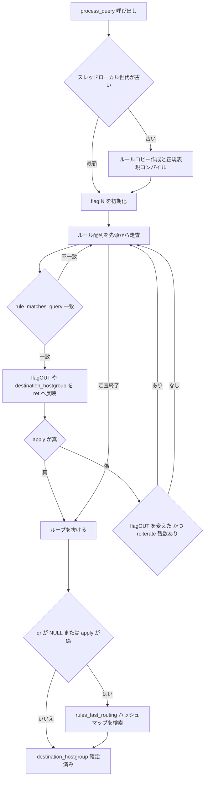

# 第9章 Query Processor とルーティングルール

> **本章で読むソース**
>
> - [`include/query_processor.h`](https://github.com/sysown/proxysql/blob/v3.0.9/include/query_processor.h)
> - [`lib/Query_Processor.cpp`](https://github.com/sysown/proxysql/blob/v3.0.9/lib/Query_Processor.cpp)
> - [`lib/MySQL_Query_Processor.cpp`](https://github.com/sysown/proxysql/blob/v3.0.9/lib/MySQL_Query_Processor.cpp)
> - [`include/MySQL_Query_Processor.h`](https://github.com/sysown/proxysql/blob/v3.0.9/include/MySQL_Query_Processor.h)

## この章の狙い

ProxySQLの管理者は `mysql_query_rules` テーブルにルールを並べ、クエリごとの宛先ホストグループやキャッシュTTLを決める。

このテーブルを実際に評価するのが **Query Processor** である。

本章では、1本のクエリが `mysql_query_rules` の行を上から順に照合され、宛先ホストグループが決まるまでの経路を、`Query_Processor::process_query()` のコードに沿って追う。

## 前提

Query Processorは `Query_Processor<QP_DERIVED>` というクラステンプレートで実装されており、`MySQL_Query_Processor` と `PgSQL_Query_Processor` の2つの派生クラスに実体化される。

[`include/query_processor.h` L316-319](https://github.com/sysown/proxysql/blob/v3.0.9/include/query_processor.h#L316-L319)

```c++
template <typename QP_DERIVED>
class Query_Processor {
	static_assert(std::is_same_v<QP_DERIVED,MySQL_Query_Processor> || std::is_same_v<QP_DERIVED,PgSQL_Query_Processor>,
		"Invalid QP_DERIVED Query Processor type");
```

MySQLとPostgreSQLでルール評価の骨格は共通であり、`Query_Processor.cpp` 側にテンプレートとしてまとめてある。

派生クラス固有の拡張（後述する `gtid_from_hostgroup` など）だけが `process_query_extended()` というフック経由で差し込まれる。

1本のルールはメモリ上で次の構造体として保持される。

[`include/query_processor.h` L89-142](https://github.com/sysown/proxysql/blob/v3.0.9/include/query_processor.h#L89-L142)

```c++
typedef struct _Query_Processor_rule_t {
	int rule_id;
	bool active;
	char *username;
	char *schemaname;
	int flagIN;
	char *client_addr;
	int client_addr_wildcard_position;
	char *proxy_addr;
	int proxy_port;
	uint64_t digest;
	char *match_digest;
	char *match_pattern;
	bool negate_match_pattern;
	int re_modifiers; // note: this is passed as char*, but converted to bitsfield
	int flagOUT;
	char *replace_pattern;
	int destination_hostgroup;
	int cache_ttl;
	// ...(中略)...
	bool apply;
	// ...(中略)...
	void *regex_engine1;
	void *regex_engine2;
	uint64_t hits;
	struct _Query_Processor_rule_t *parent; // pointer to parent, to speed up parent update
	std::vector<int>* flagOUT_ids;
	std::vector<int>* flagOUT_weights;
	int flagOUT_weights_total;
} QP_rule_t;
```

`username` / `schemaname` / `client_addr` / `digest` / `match_digest` / `match_pattern` はルールの**条件**であり、いずれかがクエリの実際の値と一致しなければルールは適用されない。

`flagIN` はこのルールが評価対象になる「現在のフラグ値」であり、`flagOUT` は一致したときに次のフラグ値をいくつにするかを指定する。

フラグは1本のクエリに対して複数のルールを順番に通す仕組みであり、あるルールで `flagOUT` を書き換えると、以降のルールは新しい `flagIN` の値で再評価される。

`destination_hostgroup` は一致したルールが宛先ホストグループを決めるときに設定し、`apply` が真のルールは、そこでルール評価を打ち切る「最後のルール」であることを示す。

## ルールが一致するかどうかの判定

1本のルールが1本のクエリに一致するかどうかは `rule_matches_query()` が判定する。

[`lib/Query_Processor.cpp` L294-368](https://github.com/sysown/proxysql/blob/v3.0.9/lib/Query_Processor.cpp#L294-L368)

```c++
bool rule_matches_query(
	const QP_rule_t* qr,
	int current_flagIN,
	const char* username,
	const char* schemaname,
	const char* client_addr,
	const char* proxy_addr,
	int proxy_port,
	uint64_t digest,
	const char* digest_text,
	const char* query_text,
	const char* rewritten_query,
	int query_processor_regex
) {
	if (qr == NULL) return false;

	if (qr->flagIN != current_flagIN) {
		return false;
	}

	if (qr->username && strlen(qr->username)) {
		if (username == NULL || strcmp(qr->username, username) != 0) {
			return false;
		}
	}

	if (qr->schemaname && strlen(qr->schemaname)) {
		if (schemaname == NULL || strcmp(qr->schemaname, schemaname) != 0) {
			return false;
		}
	}

	if (qr->client_addr && strlen(qr->client_addr)) {
		if (client_addr) {
			if (qr->client_addr_wildcard_position == -1) {
				if (strcmp(qr->client_addr, client_addr) != 0) {
					return false;
				}
			} else if (mywildcmp(qr->client_addr, client_addr) == false) {
				return false;
			}
		}
	}

	if (qr->proxy_addr && strlen(qr->proxy_addr)) {
		if (proxy_addr) {
			if (strcmp(qr->proxy_addr, proxy_addr) != 0) {
				return false;
			}
		}
	}

	if (qr->proxy_port >= 0 && qr->proxy_port != proxy_port) {
		return false;
	}

	if (qr->digest && digest && qr->digest != digest) {
		return false;
	}

	if (qr->match_digest && digest_text) {
		if (rule_matches_regex(qr, qr->regex_engine1, 1, digest_text, query_processor_regex) == false) {
			return false;
		}
	}

	if (qr->match_pattern) {
		const char* match_query = (rewritten_query ? rewritten_query : query_text);
		if (rule_matches_regex(qr, qr->regex_engine2, 2, match_query, query_processor_regex) == false) {
			return false;
		}
	}

	return true;
}
```

判定は条件を上から順にAND評価する短絡（early return）方式であり、`flagIN` の不一致やユーザー名の不一致など、文字列比較だけで済む安価な条件を先に置き、正規表現マッチという相対的に重い条件を最後に回している。

`match_digest` は正規化されたクエリダイジェスト文字列（クエリ内のリテラル値を`?`に置き換えたテキスト、詳細は第10章「クエリダイジェストの計算」）に対する正規表現マッチであり、`match_pattern` は元のクエリ文字列（前段のルールが書き換えていれば書き換え後の文字列）に対する正規表現マッチである。

## 正規表現エンジンの選択とコンパイル済みオブジェクトの保持

`match_digest` と `match_pattern` はSQLの正規表現マッチにRE2かPCREのいずれかを使う。

エンジンの選択は `mysql-query_processor_regex` というグローバル変数（スレッドローカル変数 `query_processor_regex` として各ワーカースレッドに配られる）で行い、1が**PCRE**、2が**RE2**を指す。

[`lib/Query_Processor.cpp` L225-253](https://github.com/sysown/proxysql/blob/v3.0.9/lib/Query_Processor.cpp#L225-L253)

```c++
static re2_t * compile_query_rule(const QP_rule_t *qr, int i, int query_processor_regex) {
	re2_t *r=(re2_t *)malloc(sizeof(re2_t));
	r->opt1=NULL;
	r->re1=NULL;
	r->opt2=NULL;
	r->re2=NULL;
	if (query_processor_regex==2) {
		r->opt2=new re2::RE2::Options(RE2::Quiet);
		if ((qr->re_modifiers & QP_RE_MOD_CASELESS) == QP_RE_MOD_CASELESS) {
			r->opt2->set_case_sensitive(false);
		}
		if (i==1) {
			r->re2=new RE2(qr->match_digest, *r->opt2);
		} else if (i==2) {
			r->re2=new RE2(qr->match_pattern, *r->opt2);
		}
	} else {
		r->opt1=new pcrecpp::RE_Options();
		if ((qr->re_modifiers & QP_RE_MOD_CASELESS) == QP_RE_MOD_CASELESS) {
			r->opt1->set_caseless(true);
		}
		if (i==1) {
			r->re1=new pcrecpp::RE(qr->match_digest, *r->opt1);
		} else if (i==2) {
			r->re1=new pcrecpp::RE(qr->match_pattern, *r->opt1);
		}
	}
	return r;
};
```

`rule_matches_regex()` はこの `compile_query_rule()` の結果を使ってマッチを取る。

[`lib/Query_Processor.cpp` L264-292](https://github.com/sysown/proxysql/blob/v3.0.9/lib/Query_Processor.cpp#L264-L292)

```c++
static bool rule_matches_regex(
	const QP_rule_t* qr,
	void* regex_engine,
	int regex_index,
	const char* subject,
	int query_processor_regex
) {
	if (subject == NULL) return false;

	re2_t *compiled_regex = static_cast<re2_t *>(regex_engine);
	re2_t *temporary_regex = NULL;

	if (compiled_regex == NULL) {
		temporary_regex = compile_query_rule(qr, regex_index, query_processor_regex);
		compiled_regex = temporary_regex;
	}

	bool rc = false;
	if (compiled_regex) {
		if (compiled_regex->re2) {
			rc = RE2::PartialMatch(subject, *compiled_regex->re2);
		} else if (compiled_regex->re1) {
			rc = compiled_regex->re1->PartialMatch(subject);
		}
	}

	free_compiled_query_rule(temporary_regex);
	return (qr->negate_match_pattern ? (rc == false) : (rc == true));
}
```

ここでの**最適化**は、`regex_engine` にすでにコンパイル済みの正規表現オブジェクトが渡されている限り、`compile_query_rule()` を呼ばずに済ませている点にある。

正規表現のコンパイルはパターン文字列の構文解析とマッチ用のオートマトン構築を伴い、クエリ1本ごとに行うにはコストが大きい。

そこでProxySQLは、ルールのスレッドローカルコピーを作る段階（`process_query()` 内、後述）で `match_digest` と `match_pattern` それぞれについて一度だけ `compile_query_rule()` を呼び、その結果を `regex_engine1` / `regex_engine2` に保持しておく。

以後クエリが来るたびに行うのは、保持済みのオートマトンに対する `PartialMatch()` の呼び出しだけになり、コンパイルのコストは各ワーカースレッドがルール集合を読み込むタイミングに限定される。

`compiled_regex` がNULLのときにその場でコンパイルして使い捨てにする分岐は、ルール集合の更新が反映される前の過渡期など、コンパイル済みオブジェクトがまだ用意されていない状況への保険であり、通常経路では通らない。

## process_queryによるルール評価のメインループ

ルールを実際に適用する `process_query()` は、まずスレッドローカルなルールコピーの世代（バージョン）を確認し、グローバルなルール集合が更新されていれば、そのワーカースレッド用に `_thr_SQP_rules` を作り直す。

このとき前述の正規表現コンパイルも行う。

[`lib/Query_Processor.cpp` L1681-1705](https://github.com/sysown/proxysql/blob/v3.0.9/lib/Query_Processor.cpp#L1681-L1705)

```c++
if (__sync_add_and_fetch(&version,0) > _thr_SQP_version) {
	// update local rules;
	// ...(中略)...
	for (std::vector<QP_rule_t *>::iterator it=rules.begin(); it!=rules.end(); ++it) {
		qr1=*it;
		if (qr1->active) {
			qr2=(static_cast<QP_DERIVED*>(this))->new_query_rule(static_cast<const TypeQueryRule*>(qr1));
			qr2->parent=qr1;	// pointer to parent to speed up parent update (hits)
			if (qr2->match_digest) {
				qr2->regex_engine1=(void *)compile_query_rule(qr2,1, GET_THREAD_VARIABLE(query_processor_regex));
			}
			if (qr2->match_pattern) {
				qr2->regex_engine2=(void *)compile_query_rule(qr2,2, GET_THREAD_VARIABLE(query_processor_regex));
			}
			_thr_SQP_rules->push_back(qr2);
		}
	}
```

各ワーカースレッドがルール集合とコンパイル済み正規表現をそれぞれ手元に持つのは、`rwlock` によるグローバルなルール集合へのアクセスをクエリ処理の毎回のホットパスから追い出し、通常時はロックなしでルール配列を読めるようにするためである。

ルール集合が更新されるのはAdminが `LOAD MYSQL QUERY RULES TO RUNTIME` を実行したときだけであり、クエリ処理のたびに起きるわけではない。

準備が終わると、`_thr_SQP_rules` を先頭から順に見ていく本体のループに入る。

[`lib/Query_Processor.cpp` L1775-1803](https://github.com/sysown/proxysql/blob/v3.0.9/lib/Query_Processor.cpp#L1775-L1803)

```c++
__internal_loop:
	for (std::vector<QP_rule_t *>::iterator it=_thr_SQP_rules->begin(); it!=_thr_SQP_rules->end(); ++it) {
		qr=*it;
		if (rule_matches_query(
			qr,
			flagIN,
			sess->client_myds->myconn->userinfo->username,
			sess->client_myds->myconn->userinfo->schemaname,
			sess->client_myds->addr.addr,
			sess->client_myds->proxy_addr.addr,
			sess->client_myds->proxy_addr.port,
			(qp ? qp->digest : 0),
			(qp ? qp->digest_text : NULL),
			query,
			((ret && ret->new_query) ? ret->new_query->c_str() : NULL),
			GET_THREAD_VARIABLE(query_processor_regex)
		) == false) {
			// Reset qr so a non-matching rule does not leak into the
			// fast-routing check at __exit_process_mysql_query. That
			// check reads qr->apply to decide whether a rule was
			// already applied; if the loop ends without ever matching
			// but the last iterated rule had apply=1, fast-routing
			// would otherwise be silently skipped (issue #5620).
			qr = NULL;
			continue;
		}

		// if we arrived here, we have a match
		qr->hits++; // this is done without atomic function because it updates only the local variables
```

一致したルールが見つかると、`flagOUT` の書き換え、`destination_hostgroup` の設定、`cache_ttl` の設定など、ルールに設定された各フィールドを順に `Query_Processor_Output`（`ret`）へ反映していく。

[`lib/Query_Processor.cpp` L1904-1908](https://github.com/sysown/proxysql/blob/v3.0.9/lib/Query_Processor.cpp#L1904-L1908)

```c++
	if (qr->destination_hostgroup >= 0) {
		// Note: negative hostgroup means this rule doesn't change
		proxy_debug(PROXY_DEBUG_MYSQL_QUERY_PROCESSOR, 5, "query rule %d has set destination hostgroup: %d\n", qr->rule_id, qr->destination_hostgroup);
		ret->destination_hostgroup=qr->destination_hostgroup;
	}
```

`destination_hostgroup` に限らず、`reconnect` や `cache_ttl` など多くのフィールドは「負の値なら変更なし」という約束で、複数のルールに一致したクエリは、後から一致したルールの値で前の値を上書きしていく。

ループを継続するかどうかは、末尾の `apply` 判定と再評価（`reiterate`）の判定で決まる。

[`lib/Query_Processor.cpp` L1935-1945](https://github.com/sysown/proxysql/blob/v3.0.9/lib/Query_Processor.cpp#L1935-L1945)

```c++
	if (qr->apply==true) {
		proxy_debug(PROXY_DEBUG_MYSQL_QUERY_PROCESSOR, 5, "query rule %d is the last one to apply: exit!\n", qr->rule_id);
		goto __exit_process_mysql_query;
	}
	if (set_flagOUT==true) {
		if (reiterate) {
			reiterate--;
			goto __internal_loop;
		}
	}
}
```

`apply` が真のルールに一致すると、そこでループを抜けて `__exit_process_mysql_query` に飛ぶ。

これによって、後続のルールがどれだけ残っていても評価を打ち切れる。

一方、`apply` を立てずに `flagOUT` だけを変えたルールに一致した場合は、`mysql-query_processor_iterations`（`reiterate`）の残り回数がある限り、`_thr_SQP_rules` の先頭から**再び**ループする。

これは同じクエリに対して複数段のルールをチェーンさせる仕組みであり、あるルールで `flagOUT=10` に変え、フラグ`10`を条件とする別のルールで初めて `destination_hostgroup` を確定する、という設計を可能にする。

一致するルールが1つも見つからないままループが終わった場合や、一致したルールの `apply` が偽のままだった場合も、最終的に `__exit_process_mysql_query` に到達する。

## クエリルールfast_routingによる高速な宛先決定

ルールを1件ずつ舐める素朴な評価はO(ルール数)であり、`username` と `schemaname` と `flagIN` だけで宛先ホストグループが決まるような単純なルーティングにはオーバーヘッドが大きい。

そこでProxySQLは、こうした単純なルール（`match_digest` や `match_pattern` を持たず、ユーザー名、スキーマ名、flagINの組だけで宛先が決まるルール）を専用のハッシュマップ `rules_fast_routing` に載せ替える。

キーは `username` と `schemaname` と `flagIN` を連結した文字列であり、値は宛先ホストグループである。

[`lib/Query_Processor.cpp` L719-758](https://github.com/sysown/proxysql/blob/v3.0.9/lib/Query_Processor.cpp#L719-L758)

```c++
template <typename QP_DERIVED>
int Query_Processor<QP_DERIVED>::search_rules_fast_routing_dest_hg(
	khash_t(khStrInt)** __rules_fast_routing, const char* u, const char* s, int flagIN, bool lock
) {
	int dest_hg = -1;
	const size_t u_len = strlen(u);
	size_t keylen = u_len+strlen(rand_del)+strlen(s)+30; // 30 is a big number

	char keybuf[256];
	char * keybuf_ptr = keybuf;

	if (keylen >= sizeof(keybuf)) {
		keybuf_ptr = (char *)malloc(keylen);
	}
	sprintf(keybuf_ptr,"%s%s%s---%d", u, rand_del, s, flagIN);

	if (lock) {
		rdlock();
	}
	khash_t(khStrInt)* _rules_fast_routing = *__rules_fast_routing;
	khiter_t k = kh_get(khStrInt, _rules_fast_routing, keybuf_ptr);
	if (k == kh_end(_rules_fast_routing)) {
		khiter_t k2 = kh_get(khStrInt, _rules_fast_routing, keybuf_ptr + u_len);
		if (k2 == kh_end(_rules_fast_routing)) {
		} else {
			dest_hg = kh_val(_rules_fast_routing,k2);
		}
	} else {
		dest_hg = kh_val(_rules_fast_routing,k);
	}
	if (lock) {
		wrunlock();
	}

	if (keylen >= sizeof(keybuf)) {
		free(keybuf_ptr);
	}

	return dest_hg;
}
```

キーには `rand_del`（ルール集合の更新のたびに再生成されるランダムな区切り文字列）を挟んでおり、`username` にたまたま `schemaname` の一部と読める文字列が含まれていても、区切り文字列と衝突しない限りキーが一意に決まる。

検索は `username` と `schemaname` を連結したキーでまず引き、見つからなければ `username` 部分だけを飛ばした `schemaname` 側のキー（スキーマ名だけで決まるルール用）で引き直す2段構えになっている。

`khash`（`khash.h` のCマクロによるオープンアドレッシングのハッシュマップ）を使うことで、検索は文字列長に比例する時間で済み、ルール数に比例した線形走査を避けられる。

このfast routingハッシュマップが引かれるのは、通常のルールループを抜けた後、`apply` が真のルールに一致しなかった場合に限られる。

[`lib/Query_Processor.cpp` L1947-1972](https://github.com/sysown/proxysql/blob/v3.0.9/lib/Query_Processor.cpp#L1947-L1972)

```c++
__exit_process_mysql_query:
	if (qr == NULL || qr->apply == false) {
		// Skip fast routing for mirror sessions - they already have their destination
		if (sess->mirror == false) {
			// now it is time to check mysql_query_rules_fast_routing
			// it is only check if "apply" is not true
			const char * u = sess->client_myds->myconn->userinfo->username;
			const char * s = sess->client_myds->myconn->userinfo->schemaname;

			int dst_hg = -1;

			if (_thr_SQP_rules_fast_routing != nullptr) {
				dst_hg = search_rules_fast_routing_dest_hg(&_thr_SQP_rules_fast_routing, u, s, flagIN, false);
			} else if (rules_fast_routing != nullptr) {
				dst_hg = search_rules_fast_routing_dest_hg(&this->rules_fast_routing, u, s, flagIN, true);
			}

			if (dst_hg != -1) {
				ret->destination_hostgroup = dst_hg;
			}
		}
	}
```

つまり、通常のルールで宛先が確定済み（`apply=true` のルールに一致済み）であればfast routingは通らず、通常のルールでは決着がつかなかったクエリだけがこのハッシュマップの検索対象になる。

fast routingのハッシュマップにも、スレッドローカルなコピー（`_thr_SQP_rules_fast_routing`）とグローバルな実体（`this->rules_fast_routing`）があり、スレッドローカル側が使えるときはロックを取らずに検索する（`lock` 引数が `false`）。

これは前節のルール配列と同じ設計であり、ホットパスからロックを追い出すという同じ狙いに基づく。

## 処理の流れ



## まとめ

Query Processorは `mysql_query_rules` の各行を `QP_rule_t` としてメモリに保持し、`username` / `schemaname` / `digest` / 正規表現などの条件をANDで評価する `rule_matches_query()` で1本ずつ照合する。

`flagIN` と `flagOUT` によってルールを連鎖させ、`apply` フラグでチェーンの終端を示す設計になっており、正規表現マッチはルール集合が更新されるタイミングでコンパイル済みオブジェクトとして各ワーカースレッドに配布することで、クエリ1本ごとのコンパイルコストを避けている。

単純な宛先決定は `rules_fast_routing` というハッシュマップに載せ替えられ、通常のルールループで決着しなかったクエリだけがこの高速経路を通る。

## 関連する章

- クエリダイジェストの計算方法は第10章「クエリダイジェストの計算」で扱う。
- `cache_ttl` によって決まるキャッシュ挙動は第11章「クエリキャッシュ」で扱う。
- `destination_hostgroup` が指すホストグループの実体は第13章「Hostgroup Manager とホストグループ」で扱う。
