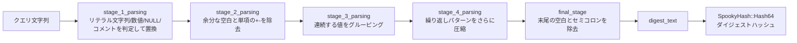

# 第10章 クエリダイジェストとトークナイザ

> **本章で読むソース**
>
> - [`lib/c_tokenizer.cpp`](https://github.com/sysown/proxysql/blob/v3.0.9/lib/c_tokenizer.cpp)
> - [`include/query_digest_topk.h`](https://github.com/sysown/proxysql/blob/v3.0.9/include/query_digest_topk.h)
> - [`lib/Query_Processor.cpp`](https://github.com/sysown/proxysql/blob/v3.0.9/lib/Query_Processor.cpp)
> - [`include/query_processor.h`](https://github.com/sysown/proxysql/blob/v3.0.9/include/query_processor.h)

## この章の狙い

ProxySQL は通過するすべてのクエリを実行するのではなく、まず値を取り除いた形に正規化してから統計に載せる。

`SELECT * FROM users WHERE id = 1` と `SELECT * FROM users WHERE id = 2` は、リテラルの値が違うだけで同じ構造のクエリである。

この2文を別々の統計行として数えると、`stats_mysql_query_digest` は実行されたクエリパターンの数だけ肥大化し、運用者が読める粒度を失う。

本章では、この正規化を担う `c_tokenizer.cpp` のトークナイザと、正規化結果からハッシュを作って集計に載せる `Query_Processor.cpp` 側の処理を読む。

## 前提

第9章で見た `Query_Processor` はクエリルールの適用を担当するが、ルール評価とは別に、クエリごとの実行統計を集める役目も持つ。

その集計の単位が本章で扱う**クエリダイジェスト**であり、SQL文からリテラル値を取り除き `?` に置き換えた**ダイジェストテキスト**と、そのテキストから計算したハッシュ値（**ダイジェスト**）の組で表される。

## ダイジェストテキストへの変換

### 全体の入口

ダイジェストの生成は `Query_Processor::query_parser_init` から始まる。

[`lib/Query_Processor.cpp` L2167-L2187](https://github.com/sysown/proxysql/blob/v3.0.9/lib/Query_Processor.cpp#L2167-L2187)

```cpp
template <typename QP_DERIVED>
void Query_Processor<QP_DERIVED>::query_parser_init(SQP_par_t *qp, const char *query, int query_length, int flags) {
	qp->digest_text=NULL;
	qp->first_comment=NULL;
	qp->query_prefix=NULL;
	if (GET_THREAD_VARIABLE(query_digests)) {
		if (GET_THREAD_VARIABLE(query_processor_parser) == 1) {
			qp_digest_parsersql<QP_DERIVED>(qp, query, query_length);
		} else {
			qp_digest_legacy<QP_DERIVED>(qp, query, query_length);
		}
	} else {
		if (GET_THREAD_VARIABLE(commands_stats)) {
			size_t sl=32;
			if ((unsigned int)query_length < sl) {
				sl=query_length;
			}
			qp->query_prefix=strndup(query,sl);
		}
	}
};
```

`mysql-query_digests` 変数が有効なときだけダイジェストを作る。

`query_processor_parser` によって、本格的な SQL パーサーを使う経路（`qp_digest_parsersql`）と、本章で扱う軽量なトークナイザを使う経路（`qp_digest_legacy`）に分かれる。

本章では既定の軽量経路を追う。

[`lib/Query_Processor.cpp` L2140-L2159](https://github.com/sysown/proxysql/blob/v3.0.9/lib/Query_Processor.cpp#L2140-L2159)

```cpp
template <typename QP_DERIVED>
static void qp_digest_legacy(SQP_par_t* qp, const char* query, int query_length) {
	options opts;
	opts.lowercase = GET_THREAD_VARIABLE(query_digests_lowercase);
	opts.replace_null = GET_THREAD_VARIABLE(query_digests_replace_null);
	opts.replace_number = GET_THREAD_VARIABLE(query_digests_no_digits);
	opts.grouping_limit = GET_THREAD_VARIABLE(query_digests_grouping_limit);
	opts.groups_grouping_limit = GET_THREAD_VARIABLE(query_digests_groups_grouping_limit);
	opts.keep_comment = GET_THREAD_VARIABLE(query_digests_keep_comment);
	opts.max_query_length = GET_THREAD_VARIABLE(query_digests_max_query_length);

	if constexpr (std::is_same_v<QP_DERIVED, MySQL_Query_Processor>) {
		qp->digest_text = mysql_query_digest_and_first_comment(query, query_length, &qp->first_comment,
			((query_length < QUERY_DIGEST_BUF) ? qp->buf : NULL), &opts);
	} else if constexpr (std::is_same_v<QP_DERIVED, PgSQL_Query_Processor>) {
		qp->digest_text = pgsql_query_digest_and_first_comment(query, query_length, &qp->first_comment,
			((query_length < QUERY_DIGEST_BUF) ? qp->buf : NULL), &opts);
	}
	const int digest_text_length=strnlen(qp->digest_text, GET_THREAD_VARIABLE(query_digests_max_digest_length));
	qp->digest=SpookyHash::Hash64(qp->digest_text, digest_text_length, 0);
	// ... (中略) ...
}
```

正規化の挙動は `mysql-query_digests_*` の複数の設定変数（小文字化するか、`NULL` を置換するか、数値を除去するかなど）で調整でき、いずれも `options` 構造体にまとめて `c_tokenizer.cpp` 側へ渡される。

`query_length < QUERY_DIGEST_BUF` のときはセッションが持つ固定バッファ `qp->buf` をそのまま書き込み先に使い、それを超える長さのクエリだけ `malloc` する。

多くのクエリは `QUERY_DIGEST_BUF` に収まるため、この分岐によってクエリのたびに発生するヒープ確保をほぼ避けられる。

### `c_tokenizer` が扱う4段階の走査

正規化本体の `mysql_query_digest_and_first_comment` は、クエリ文字列を4つの段階（**stage**）に分けて処理する。

[`lib/c_tokenizer.cpp` L1994-L2012](https://github.com/sysown/proxysql/blob/v3.0.9/lib/c_tokenizer.cpp#L1994-L2012)

```cpp
/**
 * @brief Parse the supplied query and returns a query digest. Newer implementation based on different parsing
 *   stages in order to simplify branching and processing logic:
 *
 *   - First stage: Replacing of literal values and double spaces. The goal of this stage is homogenize the
 *     query values as much as possible to reduce branching in further processing stages.
 *   - Second stage: Replacing of extra spaces and arithmetic operators (+|-) when they are in front of a
 *     single value.
 *   - Third stage: Perform different supported grouping operations for the already replaced values.
 *
 * @param s The query to be parsed.
 * @param len The length of the received query.
 * @param fst_cmnt Pointer to store the fst cmnt found in the query, if any.
 * @param buf Buffer to use to store the digest for the supplied query, if no buffer is supplied, memory will
 *   be allocated based on 'mysql_thread___query_digests_max_query_length' and supplied query length.
 *
 * @return A pointer to the start of the supplied buffer, or the allocated memory containing the digest.
 */
char* mysql_query_digest_and_first_comment(const char* const q, int q_len, char** const fst_cmnt, char* const buf, const options* opts) {
```

コメントにある3段階に加えて、実装上は「第4段階」（`stage_4_parsing`、繰り返しパターンのグルーピング）と最終整形（`final_stage`）がある。

以下では、値の置換とコメントおよび文字列リテラルの判定を担う**第1段階**を中心に読む。

第2段階以降は第1段階の出力に対する追加の圧縮（余分な空白や算術演算子の除去、値の連続をまとめるグルーピング）であり、状態機械としての骨格は第1段階と共通する。



第1段階は、クエリ文字列を1文字ずつ読み進める文字単位の走査であり、6つの状態を持つ小さな状態機械として実装されている。

[`lib/c_tokenizer.cpp` L251-L259](https://github.com/sysown/proxysql/blob/v3.0.9/lib/c_tokenizer.cpp#L251-L259)

```cpp
enum p_st {
	st_no_mark_found = 0,
	st_cmnt_type_1 = 1,
	st_cmnt_type_2 = 2,
	st_cmnt_type_3 = 3,
	st_literal_string = 4,
	st_literal_number = 5,
	st_replace_null = 6
};
```

`st_no_mark_found` が既定の状態であり、そこから次の1文字を見て、コメント開始（`/* */` 型が `st_cmnt_type_1`、`#` 型が `st_cmnt_type_2`、`--` (半角スペース1つ付き) 型が `st_cmnt_type_3`）、文字列リテラルの開始（`'` または `"`）、数値リテラルの開始、`NULL` 相当の文字列のいずれかに該当するかを判定する。

[`lib/c_tokenizer.cpp` L442-L490](https://github.com/sysown/proxysql/blob/v3.0.9/lib/c_tokenizer.cpp#L442-L490)

```cpp
static __attribute__((always_inline)) inline
enum p_st get_next_st(const options* opts, struct shared_st* shared_st) {
	char prev_char = shared_st->prev_char;
	enum p_st st = st_no_mark_found;

	// cmnt type 1 - start with '/*'
	if(
		// v1_crashing_payload_05
		shared_st->q_cur_pos < (shared_st->q_len - 2) &&
		*shared_st->q == '/' && *(shared_st->q+1) == '*'
	) {
		st = st_cmnt_type_1;
	}
	// cmnt type 2 - start with '#'
	else if(*shared_st->q == '#') {
		st = st_cmnt_type_2;
	}
	// cmnt type 3 - start with '--'
	else if (
		// shared_st->query isn't over, need to check next character
		shared_st->q_cur_pos < (shared_st->q_len - 2) &&
		// found starting pattern '-- ' (space is required)
		*shared_st->q == '-' && *(shared_st->q+1) == '-' && is_space_char(*(shared_st->q+2))
	) {
		if (prev_char != '-') {
			st = st_cmnt_type_3;
		}
		else if (shared_st->q_cur_pos == 0) {
			st = st_cmnt_type_3;
		}
	}
	// string - start with '
	else if (*shared_st->q == '\'' || *shared_st->q == '"') {
		st = st_literal_string;
	}
	// may be digit - start with digit
	else if (is_token_char(prev_char) && is_digit_char(*shared_st->q)) {
		st = st_literal_number;
	}
	// NULL processing
	else if (
		is_token_char(shared_st->prev_char) &&
		(*shared_st->q == 'n' || *shared_st->q == 'N') && opts->replace_null
	) {
		st = st_replace_null;
	}

	return st;
}
```

数値リテラルの開始判定に `is_token_char(prev_char)` を課しているのは、`col1` のような識別子の一部として現れる数字を誤って数値リテラルと判定しないためである。

`is_token_char` は英数字と `$`、`_` 以外のすべての文字を真とするため（[`lib/c_tokenizer.cpp` L93-L110](https://github.com/sysown/proxysql/blob/v3.0.9/lib/c_tokenizer.cpp#L93-L110)）、直前の文字が識別子を構成する文字でないときに限って数値リテラルの開始とみなす。

状態機械の駆動は `stage_1_parsing` が担い、クエリ文字列を先頭から末尾まで1回だけ走査する。

[`lib/c_tokenizer.cpp` L1214-L1266](https://github.com/sysown/proxysql/blob/v3.0.9/lib/c_tokenizer.cpp#L1214-L1266)

```cpp
	// Stop when either:
	//  1. There is no more room left the result buffer.
	//  2. The final position of the received query has been reached.
	while (shared_st->res_cur_pos <= res_final_pos && shared_st->q_cur_pos < shared_st->q_len) {
		if (cur_st == st_no_mark_found) {
			// update the last position over the return buffer to be the current position
			shared_st->res_pre_pos = shared_st->res_cur_pos;
			cur_st = get_next_st(opts, shared_st);

			// if next st isn't 'no_mark_found' transition to it without consuming current char
			if (cur_st != st_no_mark_found) {
				continue;
			} else {
				// generic space removal operations
				// ================================
				// Removal of spaces that doesn't belong to any particular parsing state.

				// ignore all the leading spaces
				if (shared_st->res_cur_pos == shared_st->res_init_pos && is_space_char(*shared_st->q)) {
					shared_st->q++;
					shared_st->q_cur_pos++;
					continue;
				}

				// suppress all the double spaces.
				// ==============================
				//
				// ...
				if (is_space_char(shared_st->prev_char) && is_space_char(*shared_st->q)) {
					// if current position in result buffer is the first space found, we move to the next
					// position, in order to respect the first space char.
					if (!is_space_char(*(shared_st->res_cur_pos-1))) {
						shared_st->res_cur_pos++;
					}

					shared_st->prev_char = ' ';
					*shared_st->res_cur_pos = ' ';

					shared_st->q++;
					shared_st->q_cur_pos++;
					continue;
				}

				// copy the current char
				copy_next_char(shared_st, opts);
			}
```

この走査ループは、読み取り位置 `q_cur_pos` と書き込み位置 `res_cur_pos` を独立に進める1パスのコピー処理になっている。

リテラル文字列、数値、コメントはいずれも「開始を検出して専用状態に入り、終端を検出して `st_no_mark_found` へ戻る」という形で処理され、専用状態の間はクエリ側の文字を読み進めるだけで結果バッファへは書き込まない（リテラルが最終的に `?` 1文字に畳み込まれるため）。

たとえば文字列リテラルの終端検出は次のように行う。

[`lib/c_tokenizer.cpp` L888-L922](https://github.com/sysown/proxysql/blob/v3.0.9/lib/c_tokenizer.cpp#L888-L922)

```cpp
	// satisfied closing string - swap string to ?
	if(
		*shared_st->q == str_st->delim_char &&
		(shared_st->q_len == shared_st->q_cur_pos+1 || *(shared_st->q + SIZECHAR) != str_st->delim_char)
	) {
		// NOTE: may not be necessary since we don't increment 'res_cur_pos' during this state. Since all the
		// characters are ignored.
		shared_st->res_cur_pos = shared_st->res_pre_pos;

		// place the replacement mark
		*shared_st->res_cur_pos++ = '?';
		shared_st->prev_char = '?';

		// don't copy this char if last
		if (shared_st->q_len == shared_st->q_cur_pos + 1) {
			shared_st->copy_next_char = 0;
			// keep the same state, no token was found
			return next_state;
		}

		// reinit the string literal state
		str_st->delim_char = 0;
		str_st->delim_num = 0;
		str_st->q_start_pos = 0;

		// update the shared state
		shared_st->prev_char = str_st->delim_char;
		if(shared_st->q_cur_pos < shared_st->q_len) {
			shared_st->q++;
		}
		shared_st->q_cur_pos++;

		// exit the literal parsing state
		next_state = st_no_mark_found;
	}
```

終端の区切り文字が見つかったとき、`res_cur_pos` を文字列開始直前の位置 `res_pre_pos` まで巻き戻してから `?` を1文字だけ書く。

こうすることで、文字列の長さに関わらず結果バッファの消費は常に1バイトで済み、`'aaaaaaaaaa'` のような長いリテラルでも `'aaaa'` と同じ1文字の `?` に置き換わる。

エスケープされた区切り文字（`\'` や `''`）は「区切り文字ではなく通常の文字」として扱う必要があるが、そのために専用のエスケープ検出処理を挟んでいる。

[`lib/c_tokenizer.cpp` L871-L886](https://github.com/sysown/proxysql/blob/v3.0.9/lib/c_tokenizer.cpp#L871-L886)

```cpp
	// need to be ignored case
	if(shared_st->q > str_st->q_start_pos + SIZECHAR)
	{
		if(
			(shared_st->prev_char == '\\' && *shared_st->q == '\\') || // to process '\\\\', '\\'
			(shared_st->prev_char == '\\' && *shared_st->q == str_st->delim_char) || // to process '\''
			(shared_st->prev_char == str_st->delim_char && *shared_st->q == str_st->delim_char) // to process ''''
		)
		{
			shared_st->keep_prev_char = true;
			shared_st->prev_char = 'X';

			// NOTE: Don't increment the position in query buffer. See 'stage_1_parsing' doc.
			return next_state;
		}
	}
```

`\\`（バックスラッシュのエスケープ）、`\'`（バックスラッシュによる区切り文字のエスケープ）、`''`（区切り文字を2つ並べる形式のエスケープ）の3パターンをここで吸収し、直後の1文字を「区切り文字の終端」ではなく「エスケープされた通常の文字」として読み飛ばす。

数値リテラルも同様に、開始位置を記録しておいて終端で1文字の `?` に置き換える。

[`lib/c_tokenizer.cpp` L938-L979](https://github.com/sysown/proxysql/blob/v3.0.9/lib/c_tokenizer.cpp#L938-L979)

```cpp
static __attribute__((always_inline)) inline
enum p_st process_literal_digit(shared_st* shared_st, literal_digit_st* digit_st, const options* opts) {
	enum p_st next_state = st_literal_number;

	// process the first digit
	if (digit_st->first_digit == 1 && is_token_char(shared_st->prev_char) && is_digit_char(*shared_st->q)) {
		// store the start position of digit literal in the result buffer for later iterations
		digit_st->start_pos = shared_st->res_pre_pos;

		// store the first digit
		*shared_st->res_cur_pos = *shared_st->q;
		digit_st->first_digit = 0;

		// NOTE: Don't increment the position in query buffer, as explained in 'stage_1_parsing'.
	}

	// token char or last char
	char is_float_char = *shared_st->q == '.' ||
		( tolower(shared_st->prev_char) == 'e' && ( *shared_st->q == '-' || *shared_st->q == '+' ) );
	if ((is_token_char(*shared_st->q) && is_float_char == 0) || shared_st->q_len == shared_st->q_cur_pos + 1) {
		if (is_digit_string_2(shared_st, digit_st->start_pos, shared_st->res_cur_pos)) {
			shared_st->res_cur_pos = digit_st->start_pos;

			// place the replacement mark
			*shared_st->res_cur_pos++ = '?';
			shared_st->prev_char = '?';

			// don't copy this char if last and is not token
			if (is_token_char(*shared_st->q) == 0 && shared_st->q_len == shared_st->q_cur_pos + 1) {
				shared_st->copy_next_char = 0;
				// keep the same state, no token was found
				return next_state;
			}
		}

		digit_st->start_pos = NULL;
		digit_st->first_digit = 0;
		next_state = st_no_mark_found;
	}

	return next_state;
}
```

`is_float_char` の判定によって `.`（小数点）と `e+`/`e-`（指数表記の符号）をリテラルの一部として扱い続けるため、`1.5` や `1E-10` のような数値も1つのリテラルとしてまとめて `?` に畳み込まれる。

コメントも3種類の開始パターン（`/* */`、`#`、`--`（半角スペース1つ付き)）ごとに終端検出の処理を持つが、既定では結果バッファへ何も書かずに読み飛ばすだけであり、`mysql-query_digests_keep_comment` が有効なときだけ `/* ... */` 形式のコメントを先頭コメント（`first_comment`）として別に保持する。

## ダイジェストハッシュの生成と統計への集計

第1段階から第4段階までの処理を経て得られたダイジェストテキストは、`SpookyHash::Hash64` によって64ビットのハッシュ値に変換される（[`lib/Query_Processor.cpp` L2158-L2159](https://github.com/sysown/proxysql/blob/v3.0.9/lib/Query_Processor.cpp#L2158-L2159)、前掲コード参照）。

このハッシュ値が `qp->digest` であり、`stats_mysql_query_digest` の `digest` 列に現れる値になる。

ただし、実際に統計テーブルへ集計する際のキーは、この `digest` 単体ではない。

[`lib/Query_Processor.cpp` L2190-L2223](https://github.com/sysown/proxysql/blob/v3.0.9/lib/Query_Processor.cpp#L2190-L2223)

```cpp
template <typename QP_DERIVED>
void Query_Processor<QP_DERIVED>::query_parser_update_counters(TypeSession* sess, uint64_t digest_total, uint64_t digest,
	char* digest_text, unsigned long long t) {

	if (digest_text) {
		char* ca = (char*)"";
		if (GET_THREAD_VARIABLE(query_digests_track_hostname)) {
			if (sess->client_myds) {
				if (sess->client_myds->addr.addr) {
					ca = sess->client_myds->addr.addr;
				}
			}
		}
		// this code is executed only if digest_text is not NULL , that means mysql_thread___query_digests was true when the query started
		uint64_t hash2;
		SpookyHash myhash;
		myhash.Init(19,3);
		assert(sess);
		assert(sess->client_myds);
		assert(sess->client_myds->myconn);
		assert(sess->client_myds->myconn->userinfo);
		auto *ui=sess->client_myds->myconn->userinfo;
		assert(ui->username);
		assert(ui->schemaname);
		myhash.Update(ui->username,strlen(ui->username));
		myhash.Update(&digest,sizeof(digest));
		myhash.Update(ui->schemaname,strlen(ui->schemaname));
		myhash.Update(&sess->current_hostgroup,sizeof(sess->current_hostgroup));
		myhash.Update(ca,strlen(ca));
		myhash.Final(&digest_total,&hash2);
		update_query_digest(digest_total, digest, digest_text, sess->current_hostgroup, ui, t, sess->thread->curtime, ca,
			sess->CurrentQuery.affected_rows, sess->CurrentQuery.rows_sent);
	}
}
```

ここで新たに `digest_total` という別のハッシュを、クエリのダイジェストに加えて**ユーザー名、スキーマ名、ホストグループ番号、クライアントアドレス**を連結して計算し直している。

同じ SQL パターンでも、実行したユーザーや接続先のホストグループが異なれば別の統計行として数えたいため、集計テーブルの実際のキーはダイジェストと実行コンテキストの組にしてある。

集計本体の `update_query_digest` は、この `digest_total` をキーとする `unordered_map` を引いて、既存の行があれば加算するだけ、なければ新規の統計行を作る。

[`lib/Query_Processor.cpp` L2226-L2260](https://github.com/sysown/proxysql/blob/v3.0.9/lib/Query_Processor.cpp#L2226-L2260)

```cpp
template <typename QP_DERIVED>
void Query_Processor<QP_DERIVED>::update_query_digest(uint64_t digest_total, uint64_t digest, char* digest_text, int hid,
	TypeConnInfo* ui, unsigned long long t, unsigned long long n, const char* client_addr, unsigned long long rows_affected,
	unsigned long long rows_sent) {
	QP_query_digest_stats* qds;
	std::unordered_map<uint64_t, void*>::iterator it;

	pthread_rwlock_wrlock(&digest_rwlock);
	it=digest_umap.find(digest_total);
	if (it != digest_umap.end()) {
		// found
		qds=(QP_query_digest_stats *)it->second;
		qds->add_time(t,n,rows_affected,rows_sent);
	} else {
		char *dt = NULL;
		if (GET_THREAD_VARIABLE(query_digests_normalize_digest_text)==false) {
			dt = digest_text;
		}
		qds=new QP_query_digest_stats(ui->username, ui->schemaname, digest, dt, hid, client_addr, GET_THREAD_VARIABLE(query_digests_max_digest_length));
		qds->add_time(t,n, rows_affected,rows_sent);
		digest_umap.insert(std::make_pair(digest_total,(void *)qds));
		if (GET_THREAD_VARIABLE(query_digests_normalize_digest_text)==true) {
			const uint64_t dig = digest;
			std::unordered_map<uint64_t, char *>::iterator it2;
			it2=digest_text_umap.find(dig);
			if (it2 != digest_text_umap.end()) {
				// found
			} else {
				dt = strdup(digest_text);
				digest_text_umap.insert(std::make_pair(dig,dt));
			}
		}
	}

	pthread_rwlock_unlock(&digest_rwlock);
}
```

`mysql-query_digests_normalize_digest_text` が有効なときは、統計行 `QP_query_digest_stats` 自体にダイジェストテキストを複製せず、`digest`（ユーザーやホストグループを含まないダイジェストのみ）をキーにした別の `unordered_map`（`digest_text_umap`）にテキストを1つだけ保持する。

同じ SQL パターンを異なるユーザーやホストグループから実行しても、テキスト本体は複製されず、統計行はそのテキストへの参照を共有する。

クエリパターンの種類数に対してユーザーとホストグループの組み合わせ数は掛け算で増えるため、この分離によってダイジェストテキストの重複保持によるメモリ消費を避けられる。

集計そのものは書き込みロック `digest_rwlock` の下で行われ、`unordered_map` の検索とポインタ経由の加算だけで完結するため、クエリごとの追加コストは定数時間に近い。

## まとめ

本章では、SQL 文からリテラル値を取り除いてダイジェストテキストへ変換する `c_tokenizer.cpp` の処理と、そのテキストからハッシュを作って `stats_mysql_query_digest` へ集計する `Query_Processor.cpp` の処理を読んだ。

第1段階の状態機械は、クエリ文字列を1回だけ走査しながら文字列、数値、コメントを検出し、リテラルを検出のたびに結果バッファの書き込み位置を巻き戻して1文字の `?` へ置き換えることで、リテラルの長さに関わらず一定のバッファ消費で正規化を終える。

集計側では、SQL パターンそのものを表す `digest` と、ユーザー、スキーマ、ホストグループ、クライアントアドレスを合わせた `digest_total` という2種類のハッシュを使い分け、統計の集計粒度とダイジェストテキストの重複排除を両立させている。

## 関連する章

- 第9章「クエリプロセッサとルール評価」ではクエリルールの適用を扱う（ダイジェストの生成はルール評価と並行して行われる）。
- 第20章「Admin インターフェイス」では `stats_mysql_query_digest` を含む統計テーブルの提供経路を扱う。
- 第23章「ロギング」では実行ログとダイジェストの関係を扱う。
