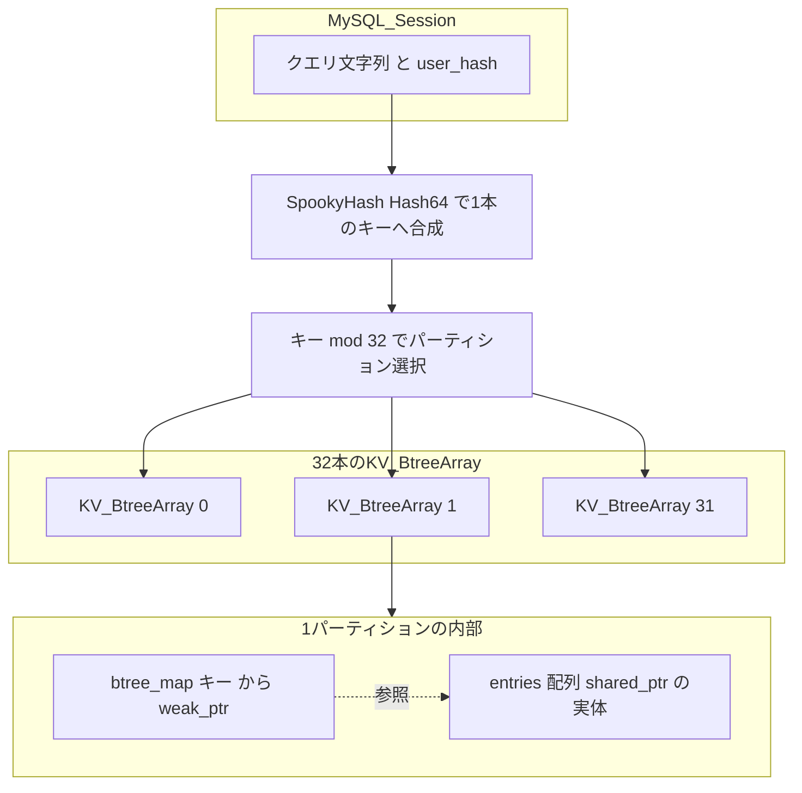
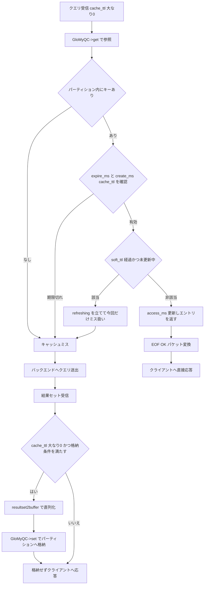

# 第11章 Query Cache による結果セットキャッシュ

> **本章で読むソース**
>
> - [`lib/MySQL_Query_Cache.cpp`](https://github.com/sysown/proxysql/blob/v3.0.9/lib/MySQL_Query_Cache.cpp)
> - [`include/MySQL_Query_Cache.h`](https://github.com/sysown/proxysql/blob/v3.0.9/include/MySQL_Query_Cache.h)
> - [`lib/Query_Cache.cpp`](https://github.com/sysown/proxysql/blob/v3.0.9/lib/Query_Cache.cpp)
> - [`include/Query_Cache.h`](https://github.com/sysown/proxysql/blob/v3.0.9/include/Query_Cache.h)
> - [`src/main.cpp`](https://github.com/sysown/proxysql/blob/v3.0.9/src/main.cpp)

## この章の狙い

ProxySQLは、バックエンドへ送らずに結果セットを直接クライアントへ返す**Query Cache**を持つ。

本章では、クエリの実行結果がどのキーで格納され、どの経路で取り出されるか、格納された結果がいつ捨てられるかを追う。

前章「クエリダイジェストとルーティング」（`10-query-digest.md`）で扱ったダイジェストは、クエリの種類を識別してルールを引くための鍵であり、Query Cacheのキーとは別物である。

Query Cacheは正規化前の生のクエリ文字列をキーに使う。

この違いを起点に、格納構造とTTL管理、複数パーティションによるロック競合の抑制を順に見ていく。

## 前提

Query Cacheが働くかどうかは、第9章「Query Processorとクエリルール」（`09-query-processor.md`）でクエリルールから決まる`cache_ttl`の値で決まる。

```c++
	int cache_ttl;
```

[`include/query_processor.h` L107](https://github.com/sysown/proxysql/blob/v3.0.9/include/query_processor.h#L107)

```c++
	int cache_ttl;
```

`cache_ttl`は既定値`-1`で初期化され、`mysql_query_rules`テーブルの同名カラムから読み込んだ値がマッチしたクエリルールに正で設定された場合にのみキャッシュの参照と格納が発生する（第9章参照）。

```c++
	newQR->cache_ttl = mqr->cache_ttl;
```

[`lib/MySQL_Query_Processor.cpp` L874](https://github.com/sysown/proxysql/blob/v3.0.9/lib/MySQL_Query_Processor.cpp#L874)

```c++
	newQR->cache_ttl = mqr->cache_ttl;
```

宛先ホストグループが決まらずクエリを転送できない場合は、キャッシュへ古い応答を返さないよう、`cache_ttl`を強制的に`0`へ戻してからバックエンドへの通常経路に合流させる。

```c++
			// as a precaution, we reset cache_ttl
			qpo->cache_ttl = 0;
```

[`lib/MySQL_Session.cpp` L7431-L7432](https://github.com/sysown/proxysql/blob/v3.0.9/lib/MySQL_Session.cpp#L7431-L7432)

```c++
			// as a precaution, we reset cache_ttl
			qpo->cache_ttl = 0;
```

キャッシュ本体は`MySQL_Query_Cache`クラスであり、汎用のキーバリューストア`Query_Cache<QC_DERIVED>`（PostgreSQL用の`PgSQL_Query_Cache`と共通のテンプレート実装）を継承する。

```c++
class MySQL_Query_Cache : public Query_Cache<MySQL_Query_Cache> {
public:
	MySQL_Query_Cache() = default;
	~MySQL_Query_Cache() = default;

	bool set(uint64_t user_hash, const unsigned char* kp, uint32_t kl, unsigned char* vp, uint32_t vl, 
		uint64_t create_ms, uint64_t curtime_ms, uint64_t expire_ms, bool deprecate_eof_active);
	unsigned char* get(uint64_t user_hash, const unsigned char* kp, const uint32_t kl, uint32_t* lv, 
		uint64_t curtime_ms, uint64_t cache_ttl, bool deprecate_eof_active);
	//void* purgeHash_thread(void*);
};
```

[`include/MySQL_Query_Cache.h` L14-L24](https://github.com/sysown/proxysql/blob/v3.0.9/include/MySQL_Query_Cache.h#L14-L24)

```c++
class MySQL_Query_Cache : public Query_Cache<MySQL_Query_Cache> {
public:
	MySQL_Query_Cache() = default;
	~MySQL_Query_Cache() = default;

	bool set(uint64_t user_hash, const unsigned char* kp, uint32_t kl, unsigned char* vp, uint32_t vl, 
		uint64_t create_ms, uint64_t curtime_ms, uint64_t expire_ms, bool deprecate_eof_active);
	unsigned char* get(uint64_t user_hash, const unsigned char* kp, const uint32_t kl, uint32_t* lv, 
		uint64_t curtime_ms, uint64_t cache_ttl, bool deprecate_eof_active);
	//void* purgeHash_thread(void*);
};
```

`MySQL_Query_Cache`はMySQLプロトコル固有の後処理（`deprecate_eof_active`によるEOFパケットとOKパケットの相互変換）だけを担い、キーの検索、格納、TTL判定、パージといったキャッシュ本体の仕組みは基底クラスの`Query_Cache`が持つ。

## キャッシュキーの構成とセッションからの呼び出し

キャッシュへの参照は、セッションのクエリ処理経路（第8章「クエリのライフサイクル」`08-query-lifecycle.md`）の中で、バックエンドへクエリを送る直前に行われる。

```c++
	if (qpo->cache_ttl>0 && ((prepare_stmt_type & ps_type_prepare_stmt) == 0)) {
		bool deprecate_eof_active = client_myds->myconn->options.client_flag & CLIENT_DEPRECATE_EOF;
		uint32_t resbuf=0;
		unsigned char *aa= GloMyQC->get(
			client_myds->myconn->userinfo->hash,
			(const unsigned char *)CurrentQuery.QueryPointer ,
			CurrentQuery.QueryLength ,
			&resbuf ,
			thread->curtime/1000 ,
			qpo->cache_ttl,
			deprecate_eof_active
		);
		if (aa) {
			client_myds->buffer2resultset(aa,resbuf);
			free(aa);
			client_myds->PSarrayOUT->copy_add(client_myds->resultset,0,client_myds->resultset->len);
			while (client_myds->resultset->len) client_myds->resultset->remove_index(client_myds->resultset->len-1,NULL);
			if (transaction_persistent_hostgroup == -1) {
				// not active, we can change it
				current_hostgroup=-1;
			}
			RequestEnd(NULL);
			l_free(pkt->size,pkt->ptr);
			return true;
		}
	}
```

[`lib/MySQL_Session.cpp` L7524-L7549](https://github.com/sysown/proxysql/blob/v3.0.9/lib/MySQL_Session.cpp#L7524-L7549)

```c++
	if (qpo->cache_ttl>0 && ((prepare_stmt_type & ps_type_prepare_stmt) == 0)) {
		bool deprecate_eof_active = client_myds->myconn->options.client_flag & CLIENT_DEPRECATE_EOF;
		uint32_t resbuf=0;
		unsigned char *aa= GloMyQC->get(
			client_myds->myconn->userinfo->hash,
			(const unsigned char *)CurrentQuery.QueryPointer ,
			CurrentQuery.QueryLength ,
			&resbuf ,
			thread->curtime/1000 ,
			qpo->cache_ttl,
			deprecate_eof_active
		);
		if (aa) {
			client_myds->buffer2resultset(aa,resbuf);
			free(aa);
			client_myds->PSarrayOUT->copy_add(client_myds->resultset,0,client_myds->resultset->len);
			while (client_myds->resultset->len) client_myds->resultset->remove_index(client_myds->resultset->len-1,NULL);
			if (transaction_persistent_hostgroup == -1) {
				// not active, we can change it
				current_hostgroup=-1;
			}
			RequestEnd(NULL);
			l_free(pkt->size,pkt->ptr);
			return true;
		}
	}
```

このコードから、キャッシュキーが**クエリ文字列そのもの**（`CurrentQuery.QueryPointer`と`QueryLength`）であることがわかる。

これはバインド変数を埋め込んだ実文字列であり、コメントの正規化やリテラルの畳み込みは行っていない。

これはダイジェストとは別の鍵であり、1文字でも異なるクエリは別エントリとして扱われる。

もう一つの引数`user_hash`は、接続時のユーザ名とパスワードとスキーマ名から計算したハッシュ値である。

```c++
uint64_t MySQL_Connection_userinfo::compute_hash() {
	int l=0;
	if (username)
		l+=strlen(username);
	if (password)
		l+=strlen(password);
	if (schemaname)
		l+=strlen(schemaname);
// two random seperator
#define _COMPUTE_HASH_DEL1_	"-ujhtgf76y576574fhYTRDF345wdt-"
#define _COMPUTE_HASH_DEL2_	"-8k7jrhtrgJHRgrefgreyhtRFewg6-"
	l+=strlen(_COMPUTE_HASH_DEL1_);
	l+=strlen(_COMPUTE_HASH_DEL2_);
	char *buf=(char *)malloc(l+1);
	l=0;
	if (username) {
		strcpy(buf+l,username);
		l+=strlen(username);
	}
	strcpy(buf+l,_COMPUTE_HASH_DEL1_);
	l+=strlen(_COMPUTE_HASH_DEL1_);
	if (password) {
		strcpy(buf+l,password);
		l+=strlen(password);
	}
	if (schemaname) {
		strcpy(buf+l,schemaname);
		l+=strlen(schemaname);
	}
	strcpy(buf+l,_COMPUTE_HASH_DEL2_);
	l+=strlen(_COMPUTE_HASH_DEL2_);
	hash=SpookyHash::Hash64(buf,l,0);
	free(buf);
	return hash;
}
```

[`lib/mysql_connection.cpp` L306-L340](https://github.com/sysown/proxysql/blob/v3.0.9/lib/mysql_connection.cpp#L306-L340)

```c++
uint64_t MySQL_Connection_userinfo::compute_hash() {
	int l=0;
	if (username)
		l+=strlen(username);
	if (password)
		l+=strlen(password);
	if (schemaname)
		l+=strlen(schemaname);
// two random seperator
#define _COMPUTE_HASH_DEL1_	"-ujhtgf76y576574fhYTRDF345wdt-"
#define _COMPUTE_HASH_DEL2_	"-8k7jrhtrgJHRgrefgreyhtRFewg6-"
	l+=strlen(_COMPUTE_HASH_DEL1_);
	l+=strlen(_COMPUTE_HASH_DEL2_);
	char *buf=(char *)malloc(l+1);
	l=0;
	if (username) {
		strcpy(buf+l,username);
		l+=strlen(username);
	}
	strcpy(buf+l,_COMPUTE_HASH_DEL1_);
	l+=strlen(_COMPUTE_HASH_DEL1_);
	if (password) {
		strcpy(buf+l,password);
		l+=strlen(password);
	}
	if (schemaname) {
		strcpy(buf+l,schemaname);
		l+=strlen(schemaname);
	}
	strcpy(buf+l,_COMPUTE_HASH_DEL2_);
	l+=strlen(_COMPUTE_HASH_DEL2_);
	hash=SpookyHash::Hash64(buf,l,0);
	free(buf);
	return hash;
}
```

ユーザ名とスキーマ名だけでなくパスワードまで連結してハッシュ化しているため、同じユーザ名でもパスワードが異なる接続は別の`user_hash`を持つ。

区切り文字（`_COMPUTE_HASH_DEL1_`、`_COMPUTE_HASH_DEL2_`）を挟んでいるのは、`username`と`password`と`schemaname`をただ連結すると、文字列の境界が異なる複数の組み合わせが同じバイト列に潰れてしまう衝突を避けるためである。

`Query_Cache::get()`は、この`user_hash`とクエリ文字列を`SpookyHash`でさらに1本のキーへ合成してから検索する。

```c++
	uint64_t hk=SpookyHash::Hash64(kp, kl, user_hash);
	uint8_t i=hk%SHARED_QUERY_CACHE_HASH_TABLES;

	std::shared_ptr<QC_entry_t> entry_shared = KVs[i]->lookup(hk).lock();
```

[`lib/Query_Cache.cpp` L579-L582](https://github.com/sysown/proxysql/blob/v3.0.9/lib/Query_Cache.cpp#L579-L582)

```c++
	uint64_t hk=SpookyHash::Hash64(kp, kl, user_hash);
	uint8_t i=hk%SHARED_QUERY_CACHE_HASH_TABLES;

	std::shared_ptr<QC_entry_t> entry_shared = KVs[i]->lookup(hk).lock();
```

`user_hash`をハッシュの種（シード）として使うことで、同じクエリ文字列でもユーザやスキーマが違えば別エントリになる。

これにより、あるユーザにだけ見えるデータを含む結果を、別のユーザへ誤って返すことがない。

## 格納構造とパーティションによるロック分割

`Query_Cache<QC_DERIVED>`は、クラス内部に`KV_BtreeArray`という入れ子クラスを持ち、これを32個並べて持つ。

```c++
private:
	KV_BtreeArray* KVs[SHARED_QUERY_CACHE_HASH_TABLES];
```

[`include/Query_Cache.h` L207-L208](https://github.com/sysown/proxysql/blob/v3.0.9/include/Query_Cache.h#L207-L208)

```c++
private:
	KV_BtreeArray* KVs[SHARED_QUERY_CACHE_HASH_TABLES];
```

`SHARED_QUERY_CACHE_HASH_TABLES`は`32`である。

```c++
#define SHARED_QUERY_CACHE_HASH_TABLES  32
```

[`include/Query_Cache.h` L10](https://github.com/sysown/proxysql/blob/v3.0.9/include/Query_Cache.h#L10)

```c++
#define SHARED_QUERY_CACHE_HASH_TABLES  32
```

各`KV_BtreeArray`は、`uint64_t`キーから`std::weak_ptr<QC_entry_t>`を引く**B木**（`btree::btree_map`）と、実体を保持する`std::shared_ptr<QC_entry_t>`の配列を持ち、自分専用の`pthread_rwlock_t`でこれらを保護する。

```c++
	private:
		pthread_rwlock_t lock;
		std::vector<std::shared_ptr<QC_entry_t>> entries;
		using BtMap_cache = btree::btree_map<uint64_t, std::weak_ptr<QC_entry_t>>;
		BtMap_cache bt_map;
		const unsigned int qc_entry_size;

		inline void rdlock() { pthread_rwlock_rdlock(&lock); }
		inline void wrlock() { pthread_rwlock_wrlock(&lock); }
		inline void unlock() { pthread_rwlock_unlock(&lock); }
```

[`include/Query_Cache.h` L144-L153](https://github.com/sysown/proxysql/blob/v3.0.9/include/Query_Cache.h#L144-L153)

```c++
	private:
		pthread_rwlock_t lock;
		std::vector<std::shared_ptr<QC_entry_t>> entries;
		using BtMap_cache = btree::btree_map<uint64_t, std::weak_ptr<QC_entry_t>>;
		BtMap_cache bt_map;
		const unsigned int qc_entry_size;

		inline void rdlock() { pthread_rwlock_rdlock(&lock); }
		inline void wrlock() { pthread_rwlock_wrlock(&lock); }
		inline void unlock() { pthread_rwlock_unlock(&lock); }
```

`bt_map`が保持するのは`weak_ptr`であり、実体の所有権は`entries`配列側の`shared_ptr`が持つ。

木からのエントリ削除と、実体の解放（`entries`からの除去）が別々に行えるため、あるスレッドがエントリを参照中（`shared_ptr`を保持中）でも、別スレッドが同じキーを木から先に外して新しいエントリへ差し替えられる。

キーの探索先パーティションは`hk % SHARED_QUERY_CACHE_HASH_TABLES`で決まり、`get()`と`set()`はそれぞれ探索先の`KV_BtreeArray`だけをロックする。



**32個に固定パーティション分割**しているのは、キャッシュ全体を1本の`pthread_rwlock_t`で守ると、コネクション数やスレッド数が増えたときに、書き込みが多いワークロードで全スレッドが単一ロックを奪い合う競合が起きるためである。

キーをあらかじめ32分割しておけば、異なるパーティションに属するキーへの`get()`や`set()`は互いにロックを奪い合わず並行に進み、同じパーティション内でも読み取り同士（`rdlock()`）は共存できる。

これにより、ロックの粒度をキャッシュ全体からパーティション単位へ落とし、スレッド数が増えたときの競合を抑えている。

## 書き込み経路：set()

結果セットの格納は、バックエンドからの応答が完結し、クエリルールの`cache_empty_result`設定に従って格納可否を判定したあとに行われる。

```c++
						client_myds->resultset->copy_add(client_myds->PSarrayOUT,0,client_myds->PSarrayOUT->len);
						client_myds->resultset_length=MyRS->resultset_size;
						unsigned char *aa=client_myds->resultset2buffer(false);
						while (client_myds->resultset->len) client_myds->resultset->remove_index(client_myds->resultset->len-1,NULL);
						bool deprecate_eof_active = client_myds->myconn->options.client_flag & CLIENT_DEPRECATE_EOF;
						GloMyQC->set(
							client_myds->myconn->userinfo->hash ,
							CurrentQuery.QueryPointer,
							CurrentQuery.QueryLength,
							aa , // Query Cache now have the ownership, no need to free it
							client_myds->resultset_length ,
							thread->curtime/1000 ,
							thread->curtime/1000 ,
							thread->curtime/1000 + qpo->cache_ttl,
							deprecate_eof_active
						);
```

[`lib/MySQL_Session.cpp` L8038-L8053](https://github.com/sysown/proxysql/blob/v3.0.9/lib/MySQL_Session.cpp#L8038-L8053)

```c++
						client_myds->resultset->copy_add(client_myds->PSarrayOUT,0,client_myds->PSarrayOUT->len);
						client_myds->resultset_length=MyRS->resultset_size;
						unsigned char *aa=client_myds->resultset2buffer(false);
						while (client_myds->resultset->len) client_myds->resultset->remove_index(client_myds->resultset->len-1,NULL);
						bool deprecate_eof_active = client_myds->myconn->options.client_flag & CLIENT_DEPRECATE_EOF;
						GloMyQC->set(
							client_myds->myconn->userinfo->hash ,
							CurrentQuery.QueryPointer,
							CurrentQuery.QueryLength,
							aa , // Query Cache now have the ownership, no need to free it
							client_myds->resultset_length ,
							thread->curtime/1000 ,
							thread->curtime/1000 ,
							thread->curtime/1000 + qpo->cache_ttl,
							deprecate_eof_active
						);
```

`resultset2buffer()`が結果セットをMySQLワイヤプロトコルのバイト列へ直列化した`aa`をそのまま渡し、コメントが示すとおり以後の解放責任はQuery Cache側へ移る。

`Query_Cache::set()`はこの直列化済みバッファをコピーせず、そのままエントリの`value`として保持する。

```c++
template <typename QC_DERIVED>
bool Query_Cache<QC_DERIVED>::set(QC_entry_t* entry, uint64_t user_hash, const unsigned char *kp, uint32_t kl, 
	unsigned char *vp, uint32_t vl, uint64_t create_ms, uint64_t curtime_ms, uint64_t expire_ms) {
	entry->klen=kl;
	entry->length=vl;
	entry->refreshing=false;
	//	entry->value = (unsigned char*)malloc(vl);
	//	memcpy(entry->value, vp, vl);
	entry->value = vp; // no need to allocate new memory and copy value
	//entry->self=entry;
	entry->create_ms=create_ms;
	entry->access_ms=curtime_ms;
	entry->expire_ms=expire_ms;
	uint64_t hk=SpookyHash::Hash64(kp, kl, user_hash);
	uint8_t i=hk%SHARED_QUERY_CACHE_HASH_TABLES;
	entry->key=hk;
	entry->kv=KVs[i];
	KVs[i]->replace(hk, entry);
	return true;
}
```

[`lib/Query_Cache.cpp` L609-L628](https://github.com/sysown/proxysql/blob/v3.0.9/lib/Query_Cache.cpp#L609-L628)

```c++
template <typename QC_DERIVED>
bool Query_Cache<QC_DERIVED>::set(QC_entry_t* entry, uint64_t user_hash, const unsigned char *kp, uint32_t kl, 
	unsigned char *vp, uint32_t vl, uint64_t create_ms, uint64_t curtime_ms, uint64_t expire_ms) {
	entry->klen=kl;
	entry->length=vl;
	entry->refreshing=false;
	//	entry->value = (unsigned char*)malloc(vl);
	//	memcpy(entry->value, vp, vl);
	entry->value = vp; // no need to allocate new memory and copy value
	//entry->self=entry;
	entry->create_ms=create_ms;
	entry->access_ms=curtime_ms;
	entry->expire_ms=expire_ms;
	uint64_t hk=SpookyHash::Hash64(kp, kl, user_hash);
	uint8_t i=hk%SHARED_QUERY_CACHE_HASH_TABLES;
	entry->key=hk;
	entry->kv=KVs[i];
	KVs[i]->replace(hk, entry);
	return true;
}
```

コメントアウトされた`malloc`と`memcpy`が示すとおり、以前の実装は直列化済みバッファをキャッシュ用に確保し直してコピーしていたと考えられる。

現在の実装は、応答をクライアントへ送るために作った直列化済みバッファの**所有権をそのままキャッシュへ移す**ことで、この確保とコピーを省いている。

結果セットが大きいほど、この一手間の省略が効く。

`replace()`は対象パーティションを書き込みロックしたうえで、既存の同キーエントリがあれば`expire_ms`を`EXPIRE_DROPIT`（`0`）にしてから木から外し、新エントリを挿入する。

```c++
template <typename QC_DERIVED>
bool Query_Cache<QC_DERIVED>::KV_BtreeArray::replace(uint64_t key, QC_entry_t *entry) {

	std::shared_ptr<QC_entry_t> entry_shared(entry, &free_QC_Entry);
	wrlock();
	THR_UPDATE_CNT(__thr_cntSet,Glo_cntSet,1,1);
	THR_UPDATE_CNT(__thr_size_values,Glo_size_values,entry->length,1);
	THR_UPDATE_CNT(__thr_dataIN,Glo_dataIN,entry->length,1);
	THR_UPDATE_CNT(__thr_num_entries,Glo_num_entries,1,1);

	add_to_entries(entry_shared);
	btree::btree_map<uint64_t,std::weak_ptr<QC_entry_t>>::iterator lookup;
	lookup = bt_map.find(key);
	if (lookup != bt_map.end()) {
		if (std::shared_ptr<QC_entry_t> found_entry_shared = lookup->second.lock()) {
			found_entry_shared->expire_ms = EXPIRE_DROPIT;
		}
		bt_map.erase(lookup);
 	}
	bt_map.insert({key,entry_shared});
	unlock();
	return true;
}
```

[`lib/Query_Cache.cpp` L232-L257](https://github.com/sysown/proxysql/blob/v3.0.9/lib/Query_Cache.cpp#L232-L257)

```c++
template <typename QC_DERIVED>
bool Query_Cache<QC_DERIVED>::KV_BtreeArray::replace(uint64_t key, QC_entry_t *entry) {

	std::shared_ptr<QC_entry_t> entry_shared(entry, &free_QC_Entry);
	wrlock();
	THR_UPDATE_CNT(__thr_cntSet,Glo_cntSet,1,1);
	THR_UPDATE_CNT(__thr_size_values,Glo_size_values,entry->length,1);
	THR_UPDATE_CNT(__thr_dataIN,Glo_dataIN,entry->length,1);
	THR_UPDATE_CNT(__thr_num_entries,Glo_num_entries,1,1);

	add_to_entries(entry_shared);
	btree::btree_map<uint64_t,std::weak_ptr<QC_entry_t>>::iterator lookup;
	lookup = bt_map.find(key);
	if (lookup != bt_map.end()) {
		if (std::shared_ptr<QC_entry_t> found_entry_shared = lookup->second.lock()) {
			found_entry_shared->expire_ms = EXPIRE_DROPIT;
		}
		bt_map.erase(lookup);
 	}
	bt_map.insert({key,entry_shared});
	unlock();
	return true;
}
```

すでに`get()`でエントリを取得し`shared_ptr`を握っているスレッドがいても、`expire_ms`を`EXPIRE_DROPIT`にするだけで木からは即座に外すため、そのスレッドは古い内容を最後まで読み切れる一方、以後の検索は新しいエントリだけを見る。

古いエントリの実体（`entries`配列の要素とバッファ）は、そのスレッドが`shared_ptr`を手放したあと、次のパージで回収される。

## 読み出し経路：get()とTTL、ソフトTTL

`Query_Cache::get()`は、キーで見つけたエントリの`expire_ms`と`create_ms + cache_ttl`をどちらも現在時刻`curtime_ms`と比較したうえで返す。

```c++
template <typename QC_DERIVED>
std::shared_ptr<QC_entry_t> Query_Cache<QC_DERIVED>::get(uint64_t user_hash, const unsigned char *kp, 
	const uint32_t kl, uint64_t curtime_ms, uint64_t cache_ttl) {
	
	uint64_t hk=SpookyHash::Hash64(kp, kl, user_hash);
	uint8_t i=hk%SHARED_QUERY_CACHE_HASH_TABLES;

	std::shared_ptr<QC_entry_t> entry_shared = KVs[i]->lookup(hk).lock();

	if (entry_shared) {
		uint64_t t = curtime_ms;
		if (entry_shared->expire_ms > t && entry_shared->create_ms + cache_ttl > t) {
			if (
				GET_THREAD_VARIABLE(query_cache_soft_ttl_pct) && !entry_shared->refreshing &&
				entry_shared->create_ms + cache_ttl * GET_THREAD_VARIABLE(query_cache_soft_ttl_pct) / 100 <= t
			) {
				// If the Query Cache entry reach the soft_ttl but do not reach
				// the cache_ttl, the next query hit the backend and refresh
				// the entry, including ResultSet and TTLs. While the
				// refreshing is in process, other queries keep using the "old"
				// Query Cache entry.
				// soft_ttl_pct with value 0 and 100 disables the functionality.
				entry_shared->refreshing = true;
			} else {
				THR_UPDATE_CNT(__thr_cntGetOK,Glo_cntGetOK,1,1);
				THR_UPDATE_CNT(__thr_dataOUT,Glo_dataOUT, entry_shared->length,1);
				if (t > entry_shared->access_ms) entry_shared->access_ms=t;
				return entry_shared;
			}
		}
	}
	return std::shared_ptr<QC_entry_t>(nullptr);
}
```

[`lib/Query_Cache.cpp` L575-L607](https://github.com/sysown/proxysql/blob/v3.0.9/lib/Query_Cache.cpp#L575-L607)

```c++
template <typename QC_DERIVED>
std::shared_ptr<QC_entry_t> Query_Cache<QC_DERIVED>::get(uint64_t user_hash, const unsigned char *kp, 
	const uint32_t kl, uint64_t curtime_ms, uint64_t cache_ttl) {
	
	uint64_t hk=SpookyHash::Hash64(kp, kl, user_hash);
	uint8_t i=hk%SHARED_QUERY_CACHE_HASH_TABLES;

	std::shared_ptr<QC_entry_t> entry_shared = KVs[i]->lookup(hk).lock();

	if (entry_shared) {
		uint64_t t = curtime_ms;
		if (entry_shared->expire_ms > t && entry_shared->create_ms + cache_ttl > t) {
			if (
				GET_THREAD_VARIABLE(query_cache_soft_ttl_pct) && !entry_shared->refreshing &&
				entry_shared->create_ms + cache_ttl * GET_THREAD_VARIABLE(query_cache_soft_ttl_pct) / 100 <= t
			) {
				// If the Query Cache entry reach the soft_ttl but do not reach
				// the cache_ttl, the next query hit the backend and refresh
				// the entry, including ResultSet and TTLs. While the
				// refreshing is in process, other queries keep using the "old"
				// Query Cache entry.
				// soft_ttl_pct with value 0 and 100 disables the functionality.
				entry_shared->refreshing = true;
			} else {
				THR_UPDATE_CNT(__thr_cntGetOK,Glo_cntGetOK,1,1);
				THR_UPDATE_CNT(__thr_dataOUT,Glo_dataOUT, entry_shared->length,1);
				if (t > entry_shared->access_ms) entry_shared->access_ms=t;
				return entry_shared;
			}
		}
	}
	return std::shared_ptr<QC_entry_t>(nullptr);
}
```

`expire_ms`はエントリ格納時に`curtime_ms + qpo->cache_ttl`として設定されており（前節の`set()`呼び出し引数を参照）、`create_ms + cache_ttl`とほぼ同じ時点を指す。

両者を両方チェックしているのは、`replace()`が古いエントリを即座に無効化するために`expire_ms`だけを`EXPIRE_DROPIT`（`0`）へ書き換える経路があるためであり、`expire_ms`だけを見れば、まだ`bt_map`から外れていない旧エントリの参照を弾ける。

`query_cache_soft_ttl_pct`が設定されている場合、TTLの一定割合（`soft_ttl`）を過ぎた最初の1件だけは`refreshing`フラグを立ててキャッシュミス扱いにし、バックエンドへ問い合わせて結果を更新させる。

このとき`refreshing`が真になっている間、他のクライアントからの同じクエリは「古いが期限切れではない」エントリを引き続き受け取る。

この設計により、TTLちょうどの瞬間に大量のリクエストが一斉にバックエンドへ流れ込む**サンダリングハード**を避けつつ、キャッシュの内容を先読み的に更新できる。

`get()`の呼び出し側である`MySQL_Query_Cache::get()`は、取得したバッファをそのままではなく、MySQLプロトコルのEOFパケット有無に応じて変換してから返す。

```c++
unsigned char* MySQL_Query_Cache::get(uint64_t user_hash, const unsigned char* kp, const uint32_t kl, uint32_t* lv, 
	uint64_t curtime_ms, uint64_t cache_ttl, bool deprecate_eof_active) {
	unsigned char* result = NULL;

	std::shared_ptr<MySQL_QC_entry_t> entry_shared = std::static_pointer_cast<MySQL_QC_entry_t>(
		Query_Cache::get(user_hash, kp, kl, curtime_ms, cache_ttl)
	);

	if (entry_shared) {
		if (deprecate_eof_active && entry_shared->column_eof_pkt_offset) {
			result = eof_to_ok_packet(entry_shared.get());
			*lv = entry_shared->length + eof_to_ok_dif;
		}
		else if (!deprecate_eof_active && entry_shared->ok_pkt_offset) {
			result = ok_to_eof_packet(entry_shared.get());
			*lv = entry_shared->length + ok_to_eof_dif;
		}
		else {
			result = (unsigned char*)malloc(entry_shared->length);
			memcpy(result, entry_shared->value, entry_shared->length);
			*lv = entry_shared->length;
		}
	}
	return result;
}
```

[`lib/MySQL_Query_Cache.cpp` L265-L290](https://github.com/sysown/proxysql/blob/v3.0.9/lib/MySQL_Query_Cache.cpp#L265-L290)

```c++
unsigned char* MySQL_Query_Cache::get(uint64_t user_hash, const unsigned char* kp, const uint32_t kl, uint32_t* lv, 
	uint64_t curtime_ms, uint64_t cache_ttl, bool deprecate_eof_active) {
	unsigned char* result = NULL;

	std::shared_ptr<MySQL_QC_entry_t> entry_shared = std::static_pointer_cast<MySQL_QC_entry_t>(
		Query_Cache::get(user_hash, kp, kl, curtime_ms, cache_ttl)
	);

	if (entry_shared) {
		if (deprecate_eof_active && entry_shared->column_eof_pkt_offset) {
			result = eof_to_ok_packet(entry_shared.get());
			*lv = entry_shared->length + eof_to_ok_dif;
		}
		else if (!deprecate_eof_active && entry_shared->ok_pkt_offset) {
			result = ok_to_eof_packet(entry_shared.get());
			*lv = entry_shared->length + ok_to_eof_dif;
		}
		else {
			result = (unsigned char*)malloc(entry_shared->length);
			memcpy(result, entry_shared->value, entry_shared->length);
			*lv = entry_shared->length;
		}
	}
	return result;
}
```

クライアントが`CLIENT_DEPRECATE_EOF`を有効にした接続とそうでない接続とでは、結果セットの終端を示すパケットがOKパケットかEOFパケットかで異なる。

格納した時点のクライアントと参照する時点のクライアントで、この設定が食い違うことがあるため、`MySQL_Query_Cache::set()`はEOFパケットとOKパケットそれぞれの出現位置（`column_eof_pkt_offset`、`row_eof_pkt_offset`、`ok_pkt_offset`）をあらかじめ記録しておき、`get()`側で必要な変換だけを行う。

いずれの経路でも、返すバッファはキャッシュのエントリとは別に確保しなおしたコピーであり、キャッシュ本体のバッファはロック解放後も他スレッドの参照に使われ続ける。

## パージスレッドとメモリ上限

パージには2つの経路がある。

1つは、`get()`のTTL判定で自然に「もう返さない」対象になったエントリを、実際に木と`entries`配列から取り除く経路である。

```c++
		} else { // no aggresssive purging , legacy algorithm
			if (entry_shared->expire_ms == EXPIRE_DROPIT || entry_shared->expire_ms < QCnow_ms) {
				ret++;
				freeable_memory += entry_shared->length;
			}
		}
```

[`lib/Query_Cache.cpp` L160-L166](https://github.com/sysown/proxysql/blob/v3.0.9/lib/Query_Cache.cpp#L160-L166)

```c++
		} else { // no aggresssive purging , legacy algorithm
			if (entry_shared->expire_ms == EXPIRE_DROPIT || entry_shared->expire_ms < QCnow_ms) {
				ret++;
				freeable_memory += entry_shared->length;
			}
		}
```

もう1つは、メモリ使用量が上限に近づいたときの**アグレッシブパージ**であり、まだ期限切れでないエントリも、最終アクセス時刻が古い順に強制的に削る。

```c++
	if ( aggressive || cond_freeable_memory ) {
		uint64_t removed_entries=0;
		uint64_t freed_memory=0;
		uint64_t access_ms_lower_mark=0;
		if (aggressive) {
			access_ms_lower_mark = access_ms_min + (access_ms_max-access_ms_min) * 0.1; // hardcoded for now. Remove the entries with access time in the 10% range closest to access_ms_min
		}

		wrlock();
		
		for (size_t i = 0; i < entries.size();) {
			const std::shared_ptr<QC_entry_t>& entry_shared = entries[i];
			bool drop_entry=false;
			if (entry_shared.use_count() <= 1) { // we check this to avoid releasing entries that are still in use
				if (entry_shared->expire_ms == EXPIRE_DROPIT || entry_shared->expire_ms < QCnow_ms) { //legacy algorithm
					drop_entry=true;
				}
				if (aggressive) { // we have been asked to do aggressive purging
					if (drop_entry==false) { // if the entry is already marked to be dropped, no further check
						if (entry_shared->access_ms < access_ms_lower_mark) {
							drop_entry=true;
						}
					}
				}
			}
			if (drop_entry) {
				const uint32_t length = entry_shared->length;
				btree::btree_map<uint64_t,std::weak_ptr<QC_entry_t>>::iterator lookup;
  				lookup = bt_map.find(entry_shared->key);
     			if (lookup != bt_map.end()) {
					bt_map.erase(lookup);
				}
				remove_from_entries_by_index(i);
				freed_memory+=length;
				removed_entries++;
				continue;
			}
			i++;
		}

		unlock();
```

[`lib/Query_Cache.cpp` L180-L219](https://github.com/sysown/proxysql/blob/v3.0.9/lib/Query_Cache.cpp#L180-L219)

```c++
	if ( aggressive || cond_freeable_memory ) {
		uint64_t removed_entries=0;
		uint64_t freed_memory=0;
		uint64_t access_ms_lower_mark=0;
		if (aggressive) {
			access_ms_lower_mark = access_ms_min + (access_ms_max-access_ms_min) * 0.1; // hardcoded for now. Remove the entries with access time in the 10% range closest to access_ms_min
		}

		wrlock();
		
		for (size_t i = 0; i < entries.size();) {
			const std::shared_ptr<QC_entry_t>& entry_shared = entries[i];
			bool drop_entry=false;
			if (entry_shared.use_count() <= 1) { // we check this to avoid releasing entries that are still in use
				if (entry_shared->expire_ms == EXPIRE_DROPIT || entry_shared->expire_ms < QCnow_ms) { //legacy algorithm
					drop_entry=true;
				}
				if (aggressive) { // we have been asked to do aggressive purging
					if (drop_entry==false) { // if the entry is already marked to be dropped, no further check
						if (entry_shared->access_ms < access_ms_lower_mark) {
							drop_entry=true;
						}
					}
				}
			}
			if (drop_entry) {
				const uint32_t length = entry_shared->length;
				btree::btree_map<uint64_t,std::weak_ptr<QC_entry_t>>::iterator lookup;
  				lookup = bt_map.find(entry_shared->key);
     			if (lookup != bt_map.end()) {
					bt_map.erase(lookup);
				}
				remove_from_entries_by_index(i);
				freed_memory+=length;
				removed_entries++;
				continue;
			}
			i++;
		}

		unlock();
```

`access_ms_lower_mark`は、そのパーティション内で観測した最古アクセス時刻と最新アクセス時刻の差の10%を最古側から切り取った境界であり、その境界より古いエントリを削る。

`entry_shared.use_count() <= 1`のチェックは、`get()`で貸し出し中（他スレッドが`shared_ptr`を保持中）のエントリを、参照が終わる前に消してしまわないための安全策である。

`aggressive`かどうかは、キャッシュ使用量の割合で決まる。

```c++
template <typename QC_DERIVED>
void Query_Cache<QC_DERIVED>::purgeHash(uint64_t max_memory_size) {
	const unsigned int curr_pct = current_used_memory_pct(max_memory_size);
	if (curr_pct < purge_threshold_pct_min) return;
	purgeHash((monotonic_time() / 1000ULL), curr_pct);
}
```

[`lib/Query_Cache.cpp` L708-L713](https://github.com/sysown/proxysql/blob/v3.0.9/lib/Query_Cache.cpp#L708-L713)

```c++
template <typename QC_DERIVED>
void Query_Cache<QC_DERIVED>::purgeHash(uint64_t max_memory_size) {
	const unsigned int curr_pct = current_used_memory_pct(max_memory_size);
	if (curr_pct < purge_threshold_pct_min) return;
	purgeHash((monotonic_time() / 1000ULL), curr_pct);
}
```

```c++
template <typename QC_DERIVED>
void Query_Cache<QC_DERIVED>::purgeHash(uint64_t QCnow_ms, unsigned int curr_pct) {
	for (int i = 0; i < SHARED_QUERY_CACHE_HASH_TABLES; i++) {
		KVs[i]->purge_some(QCnow_ms, (curr_pct > purge_threshold_pct_max));
	}
}
```

[`lib/Query_Cache.cpp` L640-L645](https://github.com/sysown/proxysql/blob/v3.0.9/lib/Query_Cache.cpp#L640-L645)

```c++
template <typename QC_DERIVED>
void Query_Cache<QC_DERIVED>::purgeHash(uint64_t QCnow_ms, unsigned int curr_pct) {
	for (int i = 0; i < SHARED_QUERY_CACHE_HASH_TABLES; i++) {
		KVs[i]->purge_some(QCnow_ms, (curr_pct > purge_threshold_pct_max));
	}
}
```

使用量が`purge_threshold_pct_min`（3%）未満ならパージ自体を省略し、使用量が`purge_threshold_pct_max`（90%）を超えたパーティションだけがアグレッシブモードで、それ以外は期限切れだけを対象にした通常パージを行う。

このパージを定期的に駆動するのは、MySQLとPostgreSQL両方のQuery Cacheを1本のスレッドでまとめて処理する`unified_query_cache_purge_thread`である。

```c++
void* unified_query_cache_purge_thread(void *arg) {

	set_thread_name("QCPurgeThread");

	MySQL_Thread* mysql_thr = new MySQL_Thread();
	unsigned int MySQL_Monitor__thread_MySQL_Thread_Variables_version;
	MySQL_Monitor__thread_MySQL_Thread_Variables_version = GloMTH->get_global_version();
	mysql_thr->refresh_variables();
	uint64_t mysql_max_memory_size = static_cast<uint64_t>(mysql_thread___query_cache_size_MB * 1024ULL * 1024ULL);
```

[`src/main.cpp` L653-L661](https://github.com/sysown/proxysql/blob/v3.0.9/src/main.cpp#L653-L661)

```c++
void* unified_query_cache_purge_thread(void *arg) {

	set_thread_name("QCPurgeThread");

	MySQL_Thread* mysql_thr = new MySQL_Thread();
	unsigned int MySQL_Monitor__thread_MySQL_Thread_Variables_version;
	MySQL_Monitor__thread_MySQL_Thread_Variables_version = GloMTH->get_global_version();
	mysql_thr->refresh_variables();
	uint64_t mysql_max_memory_size = static_cast<uint64_t>(mysql_thread___query_cache_size_MB * 1024ULL * 1024ULL);
```

```c++
	while (GloMyQC->shutting_down == false && GloPgQC->shutting_down == false) {

		// Both MySQL and PgSQL query caches share the same purge_loop_time value.
		// Therefore, using either purge_loop_time will have no impact on the behavior.
		usleep(GloMyQC->purge_loop_time);

		const unsigned int mysql_glover = GloMTH->get_global_version();
		if (MySQL_Monitor__thread_MySQL_Thread_Variables_version < mysql_glover) {
			MySQL_Monitor__thread_MySQL_Thread_Variables_version = mysql_glover;
			mysql_thr->refresh_variables();
			mysql_max_memory_size = static_cast<uint64_t>(mysql_thread___query_cache_size_MB * 1024ULL * 1024ULL);
		}
		GloMyQC->purgeHash(mysql_max_memory_size);
```

[`src/main.cpp` L670-L682](https://github.com/sysown/proxysql/blob/v3.0.9/src/main.cpp#L670-L682)

```c++
	while (GloMyQC->shutting_down == false && GloPgQC->shutting_down == false) {

		// Both MySQL and PgSQL query caches share the same purge_loop_time value.
		// Therefore, using either purge_loop_time will have no impact on the behavior.
		usleep(GloMyQC->purge_loop_time);

		const unsigned int mysql_glover = GloMTH->get_global_version();
		if (MySQL_Monitor__thread_MySQL_Thread_Variables_version < mysql_glover) {
			MySQL_Monitor__thread_MySQL_Thread_Variables_version = mysql_glover;
			mysql_thr->refresh_variables();
			mysql_max_memory_size = static_cast<uint64_t>(mysql_thread___query_cache_size_MB * 1024ULL * 1024ULL);
		}
		GloMyQC->purgeHash(mysql_max_memory_size);
```

このスレッドは`purge_loop_time`（既定500ミリ秒）ごとにスリープから復帰し、`mysql_thread___query_cache_size_MB`という設定変数から求めた上限バイト数を`GloMyQC->purgeHash()`へ渡す。

設定がAdminインターフェイス経由で変更されたときは`get_global_version()`の値が進むため、そのタイミングで上限バイト数を計算し直す。

```c++
void ProxySQL_Main_init_Query_Cache_module() {
	GloMyQC = new MySQL_Query_Cache();
	GloMyQC->print_version();
	GloPgQC = new PgSQL_Query_Cache();
	GloPgQC->print_version();

	pthread_t purge_thread_id;
	pthread_create(&purge_thread_id, NULL, unified_query_cache_purge_thread, NULL);
	GloMyQC->purge_thread_id = purge_thread_id;
	GloPgQC->purge_thread_id = purge_thread_id;
```

[`src/main.cpp` L1057-L1065](https://github.com/sysown/proxysql/blob/v3.0.9/src/main.cpp#L1057-L1065)

```c++
void ProxySQL_Main_init_Query_Cache_module() {
	GloMyQC = new MySQL_Query_Cache();
	GloMyQC->print_version();
	GloPgQC = new PgSQL_Query_Cache();
	GloPgQC->print_version();

	pthread_t purge_thread_id;
	pthread_create(&purge_thread_id, NULL, unified_query_cache_purge_thread, NULL);
	GloMyQC->purge_thread_id = purge_thread_id;
	GloPgQC->purge_thread_id = purge_thread_id;
```

`GloMyQC`と`GloPgQC`はこの初期化関数でそれぞれ1個だけ生成されるグローバルなキャッシュ本体であり、`pthread_create()`は1回しか呼ばれない。

なお、`MySQL_Query_Cache.cpp`と`PgSQL_Query_Cache.cpp`には、プロトコルごとに専用のパージスレッドを持たせる`purgeHash_thread()`のコメントアウトされた実装が残っている。

現在の3.0.9では、この専用スレッドを使わず、`unified_query_cache_purge_thread`という1本のスレッドが両プロトコルの`purgeHash()`を順番に呼び出す構成に置き換わっている。

## キャッシュヒットとキャッシュミスの経路全体



## まとめ

Query Cacheのキーは、クエリの生文字列と接続のユーザ情報（ユーザ名、パスワード、スキーマ名）から作った`user_hash`を`SpookyHash`で合成した1本の64ビット値であり、クエリの種類を表すダイジェストとは別物である。

格納構造は、この64ビットキーを32個の`KV_BtreeArray`へ振り分けたパーティション分割であり、各パーティションが独自の`pthread_rwlock_t`を持つことで、パーティションをまたぐ`get()`や`set()`が互いにロックを奪い合わない。

書き込み側は、クライアントへ送るために直列化済みのバッファをコピーせずそのままキャッシュへ譲り渡すことで、確保とコピーの手間を省いている。

エントリの寿命は`create_ms + cache_ttl`と`expire_ms`の両方で管理され、`soft_ttl`によって期限直前の一斉ミスを避け、パージは期限切れの通常回収とメモリ逼迫時のアクセス時刻ベースの強制回収という2段構えで行われる。

## 関連する章

- 第8章「クエリのライフサイクル」（`08-query-lifecycle.md`）：`GloMyQC->get()`と`set()`がセッションのどの局面で呼ばれるか。
- 第9章「Query Processorとクエリルール」（`09-query-processor.md`）：`cache_ttl`や`cache_empty_result`がクエリルールからどう決まるか。
- 第10章「クエリダイジェストとルーティング」（`10-query-digest.md`）：Query Cacheのキーとは別に使われるダイジェストの計算方法。
