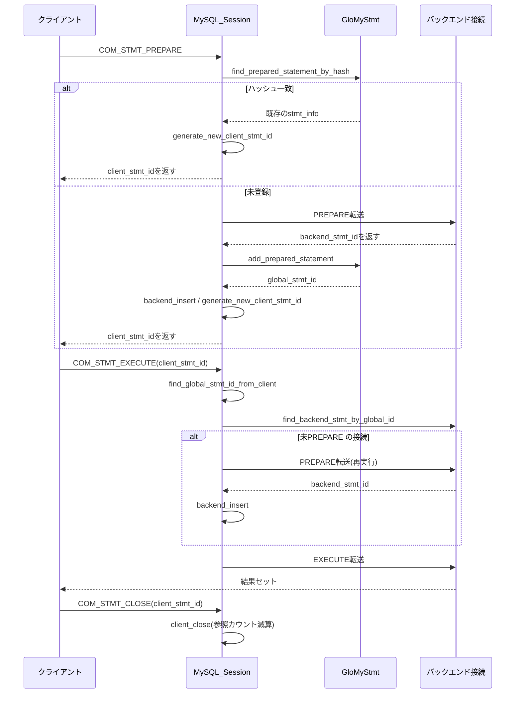
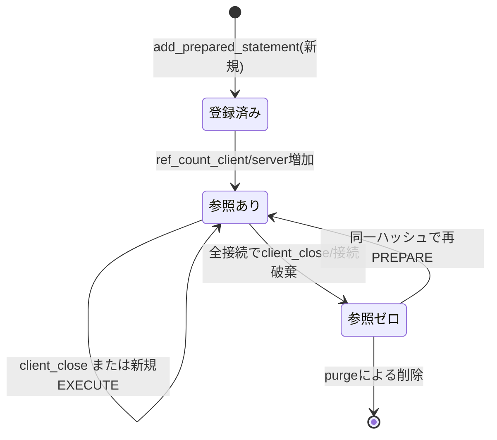

# 第12章 プリペアドステートメントの管理

> **本章で読むソース**
>
> - [`include/MySQL_PreparedStatement.h`](https://github.com/sysown/proxysql/blob/v3.0.9/include/MySQL_PreparedStatement.h)
> - [`lib/MySQL_PreparedStatement.cpp`](https://github.com/sysown/proxysql/blob/v3.0.9/lib/MySQL_PreparedStatement.cpp)
> - [`lib/MySQL_Session.cpp`](https://github.com/sysown/proxysql/blob/v3.0.9/lib/MySQL_Session.cpp)

## この章の狙い

MySQLのプリペアドステートメント（`COM_STMT_PREPARE` / `COM_STMT_EXECUTE` / `COM_STMT_CLOSE`）は、バックエンドMySQLサーバが発行する `stmt_id` で識別される。

ところがProxySQLは1本のクライアント接続を複数のバックエンド接続へ**多重化**する（第14章「コネクションプールと多重化」）。

同じプリペアドステートメントでも、実行のたびに違うバックエンド接続を使う可能性があり、そのバックエンド接続ごとに`stmt_id`が異なってしまう。

そこでProxySQLは、クライアントに返す`stmt_id`をバックエンドのものと切り離し、自前で発行した**global_stmt_id**を介してクライアント側とバックエンド側の`stmt_id`を対応づける。

本章では、この3種類のIDがどこで生成され、どのマップに保持され、`PREPARE`から`EXECUTE`、`CLOSE`までどう受け渡されるかを追う。

あわせて、同一クエリを複数のクライアントが`PREPARE`したとき、クライアントへの応答をグローバルキャッシュ照合だけで即座に済ませる仕組みを、最適化として説明する。

ただしこの重複排除はクライアント応答レベルのものであり、実際に文を実行する各バックエンド接続では、その接続がまだ`PREPARE`していなければ`EXECUTE`時にあらためて`PREPARE`が必要になる。

## 前提

3種類のIDが登場する。

- **client_stmt_id**：ProxySQLがクライアント接続（`MySQL_Data_Stream`）ごとに採番してクライアントへ返す`stmt_id`。
- **global_stmt_id**：ProxySQLが内部で管理する統一IDで、同じユーザー、同じスキーマ、同じクエリ文字列の組に対して1つだけ存在する。
- **backend_stmt_id**：バックエンド接続ごとに異なりうる、実際にバックエンドMySQLサーバが返す`stmt_id`。

これらを管理するクラス群の設計意図は、ヘッダのコメントにそのまま書かれている。

[`include/MySQL_PreparedStatement.h` L7-L35](https://github.com/sysown/proxysql/blob/v3.0.9/include/MySQL_PreparedStatement.h#L7-L35)

```c++
One of the main challenge in handling prepared statement (PS) is that a single
PS could be executed on multiple backends, and on each backend it could have a
different stmt_id.
For this reason ProxySQL returns to the client a stmt_id generated by the proxy
itself, and internally maps client's stmt_id with the backend stmt_id.

The implementation in ProxySQL is, simplified, the follow:
* when a client sends a MYSQL_COM_STMT_PREPARE, ProxySQL executes it to one of
  the backend
* the backend returns a stmt_id. This stmt_id is NOT returned to the client. The
  stmt_id returned from the backend is stored in MySQL_STMTs_local(), and
  MySQL_STMTs_local() is responsible for mapping the connection's MYSQL_STMT
  and a global_stmt_id
* the global_stmt_id is the stmt_id returned to the client
* the global_stmt_id is used to locate the relevant MySQL_STMT_Global_info() in
  MySQL_STMT_Manager()
* MySQL_STMT_Global_info() stores all metadata associated with a PS
* MySQL_STMT_Manager() is responsible for storing all MySQL_STMT_Global_info()
  in global structures accessible and shareble by all threads.

To summarie the most important classes:
* MySQL_STMT_Global_info() stores all metadata associated with a PS
* MySQL_STMT_Manager() stores all the MySQL_STMT_Global_info(), indexes using
  a global_stmt_id that iis the stmt_id generated by ProxySQL and returned to
  the client
* MySQL_STMTs_local() associate PS located in a backend connection to a
  global_stmt_id
```

この設計により、**`MySQL_STMT_Manager_v14`は全スレッドから共有されるグローバルな辞書**、**`MySQL_STMTs_local_v14`は1本の接続に閉じたローカルな対応表**という役割分担になる。

`MySQL_STMTs_local_v14`はクライアント接続用とバックエンド接続用の両方で使われ、コンストラクタの`is_client_`引数でどちらの用途かを区別する。

保持するマップは以下のとおりである。

[`include/MySQL_PreparedStatement.h` L181-L211](https://github.com/sysown/proxysql/blob/v3.0.9/include/MySQL_PreparedStatement.h#L181-L211)

```c++
class MySQL_STMTs_local_v14 {
	private:
	bool is_client_;
	std::stack<uint32_t> free_client_ids;
	uint32_t local_max_stmt_id;
	public:
	// this map associate client_stmt_id to global_stmt_id : this is used only for client connections
	std::map<uint32_t, uint64_t> client_stmt_to_global_ids;
	// this map associates client_stmt_id to prepare-time min_gtid annotations
	std::map<uint32_t, std::string> client_stmt_to_min_gtid;
	// this multimap associate global_stmt_id to client_stmt_id : this is used only for client connections
	std::multimap<uint64_t, uint32_t> global_stmt_to_client_ids;

	// this map associate backend_stmt_id to global_stmt_id : this is used only for backend connections
	std::map<uint32_t, uint64_t> backend_stmt_to_global_ids;
	// this map associate global_stmt_id to backend_stmt_id : this is used only for backend connections
	std::map<uint64_t, uint32_t> global_stmt_to_backend_ids;

	std::map<uint64_t, MYSQL_STMT *> global_stmt_to_backend_stmt;

	MySQL_Session *sess;
	MySQL_STMTs_local_v14(bool _ic) {
		local_max_stmt_id = 0;
		sess = NULL;
		is_client_ = _ic;
		client_stmt_to_global_ids = std::map<uint32_t, uint64_t>();
		client_stmt_to_min_gtid = std::map<uint32_t, std::string>();
		global_stmt_to_client_ids = std::multimap<uint64_t, uint32_t>();
		backend_stmt_to_global_ids = std::map<uint32_t, uint64_t>();
		global_stmt_to_backend_ids = std::map<uint64_t, uint32_t>();
		global_stmt_to_backend_stmt = std::map<uint64_t, MYSQL_STMT *>();
		free_client_ids = std::stack<uint32_t>();
	}
```

クライアント接続側は`client_stmt_to_global_ids`（クライアントIDからの引き）と`global_stmt_to_client_ids`（同じグローバルIDを共有する複数のクライアントIDを逆引きするための`multimap`）を持つ。

バックエンド接続側は`global_stmt_to_backend_stmt`で、そのバックエンド接続がすでに`PREPARE`済みの`MYSQL_STMT`をグローバルIDから直接引ける。

`MySQL_Session`（第7章「MySQL_Session の状態機械」）はクライアント接続用の`local_stmts`をクライアントの`MySQL_Data_Stream`が保持する`MySQL_Connection`に、バックエンド接続用の`local_stmts`を各バックエンドの`MySQL_Connection`に持たせている。

## PREPARE：グローバルステートメントキャッシュによる重複排除

クライアントが`COM_STMT_PREPARE`を送ると、セッションはまずクエリのハッシュ値を計算し、同じクエリがすでにグローバルにキャッシュされていないかを調べる。

[`lib/MySQL_Session.cpp` L3461-3495](https://github.com/sysown/proxysql/blob/v3.0.9/lib/MySQL_Session.cpp#L3461-L3495)

```c++
		uint64_t hash=client_myds->myconn->local_stmts->compute_hash(
			(char *)client_myds->myconn->userinfo->username,
			(char *)client_myds->myconn->userinfo->schemaname,
			(char *)CurrentQuery.QueryPointer,
			CurrentQuery.QueryLength
		);
		MySQL_STMT_Global_info *stmt_info=NULL;
		// we first lock GloStmt
		GloMyStmt->wrlock();
		stmt_info=GloMyStmt->find_prepared_statement_by_hash(hash);
		if (stmt_info) {
			// the prepared statement exists in GloMyStmt
			// for this reason, we do not need to prepare it again, and we can already reply to the client
			// we will now generate a unique stmt and send it to the client
			uint32_t new_stmt_id=client_myds->myconn->local_stmts->generate_new_client_stmt_id(stmt_info->statement_id);
			CurrentQuery.stmt_client_id=new_stmt_id;

			// When first_comment_parsing is set to 1 (before query rules) or 3 (before_and_after query rules),
			// query rules may strip the min_gtid annotation during STMT_PREPARE. Persist it per client
			// statement ID so that STMT_EXECUTE can restore the original routing constraint.
			// For more context, refer to https://github.com/sysown/proxysql/issues/5384
			int first_comment_parsing = mysql_thread___query_processor_first_comment_parsing;
			if (first_comment_parsing == 1 || first_comment_parsing == 3) {
				client_myds->myconn->local_stmts->set_client_min_gtid(new_stmt_id, qpo->min_gtid);
			}

			client_myds->setDSS_STATE_QUERY_SENT_NET();
			client_myds->myprot.generate_STMT_PREPARE_RESPONSE(client_myds->pkt_sid+1,stmt_info,new_stmt_id);
			LogQuery(NULL);
			l_free(pkt.size,pkt.ptr);
			client_myds->DSS=STATE_SLEEP;
			status=WAITING_CLIENT_DATA;
			CurrentQuery.set_end_time(thread->curtime);
			CurrentQuery.end();
		} else {
			mybe=find_or_create_backend(current_hostgroup);
			status=PROCESSING_STMT_PREPARE;
```

ハッシュは`username`、`schemaname`、クエリ文字列を連結して`SpookyHash`で計算する。

[`lib/MySQL_PreparedStatement.cpp` L21-L59](https://github.com/sysown/proxysql/blob/v3.0.9/lib/MySQL_PreparedStatement.cpp#L21-L59)

```c++
static uint64_t stmt_compute_hash(char *user,
                                  char *schema, char *query,
                                  unsigned int query_length) {
	int l = 0;
	l += strlen(user);
	l += strlen(schema);
// two random seperators
#define _COMPUTE_HASH_DEL1_ "-ujhtgf76y576574fhYTRDFwdt-"
#define _COMPUTE_HASH_DEL2_ "-8k7jrhtrgJHRgrefgreRFewg6-"
	l += strlen(_COMPUTE_HASH_DEL1_);
	l += strlen(_COMPUTE_HASH_DEL2_);
	l += query_length;
	char *buf = (char *)malloc(l);
	l = 0;

	// write user
	strcpy(buf + l, user);
	l += strlen(user);

	// write delimiter1
	strcpy(buf + l, _COMPUTE_HASH_DEL1_);
	l += strlen(_COMPUTE_HASH_DEL1_);

	// write schema
	strcpy(buf + l, schema);
	l += strlen(schema);

	// write delimiter2
	strcpy(buf + l, _COMPUTE_HASH_DEL2_);
	l += strlen(_COMPUTE_HASH_DEL2_);

	// write query
	memcpy(buf + l, query, query_length);
	l += query_length;

	uint64_t hash = SpookyHash::Hash64(buf, l, 0);
	free(buf);
	return hash;
}
```

キャッシュに命中した場合、コード中のコメントが述べているとおり「`we do not need to prepare it again`」であり、セッションは新しい`client_stmt_id`を発行してその場でクライアントへ`STMT_PREPARE`の応答を返す。

バックエンドへは何も送らない。

これが本章で扱う**最適化**である。

同じテキストのクエリを複数のクライアントが`PREPARE`しても、`GloMyStmt`（`MySQL_STMT_Manager_v14`の唯一のグローバルインスタンス）にすでに同じハッシュのエントリがあれば、2人目以降のクライアントへの応答はハッシュ引き当てだけで完結する。

このときバックエンドへ新たな`PREPARE`要求を送る必要はなく、バックエンドとの往復（ネットワークI/Oとサーバ側でのSQL構文解析）を省略できる点が速度に効く。

ただし省略できるのはあくまで「クライアントへの応答」であり、実際に`EXECUTE`を転送するバックエンド接続がまだこの文を`PREPARE`していなければ、その接続向けの`PREPARE`は次節で見るとおり必要になる。

キャッシュに命中しなかった場合は`status`を`PROCESSING_STMT_PREPARE`にして、通常のクエリと同じ経路でバックエンドへ`PREPARE`要求を転送する。

バックエンドから応答が返ると、`handler_rc0_PROCESSING_STMT_PREPARE`が呼ばれる。

[`lib/MySQL_Session.cpp` L4778-L4811](https://github.com/sysown/proxysql/blob/v3.0.9/lib/MySQL_Session.cpp#L4778-L4811)

```c++
bool MySQL_Session::handler_rc0_PROCESSING_STMT_PREPARE(enum session_status& st, MySQL_Data_Stream *myds, bool& prepared_stmt_with_no_params) {
	thread->status_variables.stvar[st_var_backend_stmt_prepare]++;
	GloMyStmt->wrlock();
	uint32_t client_stmtid=0;
	uint64_t global_stmtid;
	//bool is_new;
	MySQL_STMT_Global_info *stmt_info=NULL;
	stmt_info=GloMyStmt->add_prepared_statement(
		(char *)client_myds->myconn->userinfo->username,
		(char *)client_myds->myconn->userinfo->schemaname,
		(char *)CurrentQuery.QueryPointer,
		CurrentQuery.QueryLength,
		CurrentQuery.QueryParserArgs.first_comment,
		CurrentQuery.mysql_stmt,
		false);
	if (CurrentQuery.QueryParserArgs.digest_text) {
		if (stmt_info->digest_text==NULL) {
			stmt_info->digest_text=strdup(CurrentQuery.QueryParserArgs.digest_text);
			stmt_info->digest=CurrentQuery.QueryParserArgs.digest;	// copy digest
			stmt_info->MyComQueryCmd=CurrentQuery.MyComQueryCmd; // copy MyComQueryCmd
			stmt_info->calculate_mem_usage();
		}
	}
	global_stmtid=stmt_info->statement_id;
	myds->myconn->local_stmts->backend_insert(global_stmtid,CurrentQuery.mysql_stmt);
	// We only perform the generation for a new 'client_stmt_id' when there is no previous status, this
	// is, when 'PROCESSING_STMT_PREPARE' is reached directly without transitioning from a previous status
	// like 'PROCESSING_STMT_EXECUTE'. The same condition needs to hold for setting 'stmt_client_id',
	// otherwise we could be resetting it's current value from the previous state.
	if (previous_status.size() == 0) {
		client_stmtid=client_myds->myconn->local_stmts->generate_new_client_stmt_id(global_stmtid);
		CurrentQuery.stmt_client_id=client_stmtid;
	}
	CurrentQuery.mysql_stmt=NULL;
```

`add_prepared_statement`は、`handler_rc0_PROCESSING_STMT_PREPARE`が呼ばれる時点ですでにバックエンドで`PREPARE`が実行済みであることを前提に、`GloMyStmt`へ登録あるいは既存エントリの参照カウント更新を行う。

[`lib/MySQL_PreparedStatement.cpp` L839-L892](https://github.com/sysown/proxysql/blob/v3.0.9/lib/MySQL_PreparedStatement.cpp#L839-L892)

```c++
MySQL_STMT_Global_info *MySQL_STMT_Manager_v14::add_prepared_statement(
    char *u, char *s, char *q, unsigned int ql,
    char *fc, MYSQL_STMT *stmt, bool lock) {
	MySQL_STMT_Global_info *ret = NULL;
	uint64_t hash = stmt_compute_hash(
		u, s, q, ql);  // this identifies the prepared statement
	if (lock) {
		pthread_rwlock_wrlock(&rwlock_);
	}
	// try to find the statement
	auto f = map_stmt_hash_to_info.find(hash);
	if (f != map_stmt_hash_to_info.end()) {
		// found it!
		// MySQL_STMT_Global_info *a=f->second;
		// ret=a->statement_id;
		ret = f->second;
		ret->update_metadata(stmt);
		//*is_new = false;
	} else {
		// FIXME: add a stack here too!!!
		// we need to create a new one

		bool free_id_avail = false;
		free_id_avail = free_stmt_ids.size();

		uint64_t next_id = 0;
		if (free_id_avail) {
			next_id = free_stmt_ids.top();
			free_stmt_ids.pop();
		} else {
			next_id = next_statement_id;
			next_statement_id++;
		}

		//next_statement_id++;
		MySQL_STMT_Global_info *a =
		    new MySQL_STMT_Global_info(next_id, u, s, q, ql, fc, stmt, hash);
		// insert it in both maps
		map_stmt_id_to_info.insert(std::make_pair(a->statement_id, a));
		map_stmt_hash_to_info.insert(std::make_pair(a->hash, a));
		ret = a;
		__sync_add_and_fetch(&num_stmt_with_ref_client_count_zero,1);
		__sync_add_and_fetch(&num_stmt_with_ref_server_count_zero,1);
	}
	if (ret->ref_count_server == 0) {
		__sync_sub_and_fetch(&num_stmt_with_ref_server_count_zero,1);
	}
	ret->ref_count_server++;
	statuses.s_total++;
	if (lock) {
		pthread_rwlock_unlock(&rwlock_);
	}
	return ret;
}
```

ここでも同じハッシュ照合が行われている点に注意する。

セッション側の`find_prepared_statement_by_hash`によるチェックは「クライアントへの応答を省略できるか」を判定するためのものであり、`add_prepared_statement`側の照合は「このバックエンド接続でいま終わった`PREPARE`の結果を、どの`MySQL_STMT_Global_info`に対応づけるか」を決めるためのものである。

用途は異なるが、どちらも同じ`stmt_compute_hash`を鍵にすることで、グローバルステートメントキャッシュを単一の真実の情報源として扱っている。

`backend_insert`は、そのバックエンド接続がいま`PREPARE`した`MYSQL_STMT`を、このバックエンド接続専用の`MySQL_STMTs_local_v14`に登録する。

[`lib/MySQL_PreparedStatement.cpp` L581-L589](https://github.com/sysown/proxysql/blob/v3.0.9/lib/MySQL_PreparedStatement.cpp#L581-L589)

```c++
void MySQL_STMTs_local_v14::backend_insert(uint64_t global_statement_id, MYSQL_STMT *stmt) {
	std::pair<std::map<uint64_t, MYSQL_STMT *>::iterator, bool> ret;
	ret = global_stmt_to_backend_stmt.insert(std::make_pair(global_statement_id, stmt));
	global_stmt_to_backend_ids.insert(std::make_pair(global_statement_id,stmt->stmt_id));
	backend_stmt_to_global_ids.insert(std::make_pair(stmt->stmt_id,global_statement_id));
	// note: backend_insert() is always called after add_prepared_statement()
	// for this reason, we will the ref count increase in add_prepared_statement()
	// GloMyStmt->ref_count_client(global_statement_id, 1, false); // do not lock!
}
```

`client_stmt_id`の発行は`generate_new_client_stmt_id`が担う。

[`lib/MySQL_PreparedStatement.cpp` L772-L786](https://github.com/sysown/proxysql/blob/v3.0.9/lib/MySQL_PreparedStatement.cpp#L772-L786)

```c++
uint32_t MySQL_STMTs_local_v14::generate_new_client_stmt_id(uint64_t global_statement_id) {
	uint32_t ret=0;
	if (free_client_ids.size()) {
		ret=free_client_ids.top();
		free_client_ids.pop();
	} else {
		local_max_stmt_id+=1;
		ret=local_max_stmt_id;
	}
	assert(ret);
	client_stmt_to_global_ids.insert(std::make_pair(ret,global_statement_id));
	global_stmt_to_client_ids.insert(std::make_pair(global_statement_id,ret));
	GloMyStmt->ref_count_client(global_statement_id, 1, false); // do not lock!
	return ret;
}
```

`free_client_ids`は`CLOSE`済みの`client_stmt_id`を積んだスタックであり、新規発行時にまずここから再利用を試みる。

これにより、同一クライアント接続が`PREPARE`と`CLOSE`を繰り返しても`client_stmt_id`が単調に増え続けることを避けている。

## EXECUTE：client_stmt_idからの引き当てと再PREPARE

`COM_STMT_EXECUTE`のパケットにはクライアントが受け取った`client_stmt_id`が積まれている。

セッションはまずこれをそのクライアント接続の`local_stmts`で`global_stmt_id`に変換する。

[`lib/MySQL_Session.cpp` L3533-L3550](https://github.com/sysown/proxysql/blob/v3.0.9/lib/MySQL_Session.cpp#L3533-L3550)

```c++
		uint32_t client_stmt_id=0;
		uint64_t stmt_global_id=0;
		memcpy(&client_stmt_id,(char *)pkt.ptr+5,sizeof(uint32_t));
		CurrentQuery.stmt_client_id=client_stmt_id;
		stmt_global_id=client_myds->myconn->local_stmts->find_global_stmt_id_from_client(client_stmt_id);
		if (stmt_global_id == 0) {
			l_free(pkt.size,pkt.ptr);
			client_myds->setDSS_STATE_QUERY_SENT_NET();
			string err_msg = "Unknown prepared statement handler (" + to_string(client_stmt_id) + ") given to mysql_stmt_precheck";
			client_myds->myprot.generate_pkt_ERR(true,NULL,NULL,1,1243,(char *)"HY000", err_msg.c_str());
			client_myds->DSS=STATE_SLEEP;
			status=WAITING_CLIENT_DATA;
			return;
		}
		CurrentQuery.stmt_global_id=stmt_global_id;
		// now we get the statement information
		MySQL_STMT_Global_info *stmt_info=NULL;
		stmt_info=GloMyStmt->find_prepared_statement_by_stmt_id(stmt_global_id);
```

`global_stmt_id`が決まった後、実際に転送するバックエンド接続が選ばれる。

多重化により、その接続は`PREPARE`を実行した接続とは限らない。

そこでバックエンドへ転送する直前に、その接続の`local_stmts`が`global_stmt_id`に対応する`MYSQL_STMT`をすでに持っているかを確認する。

[`lib/MySQL_Session.cpp` L5447-L5475](https://github.com/sysown/proxysql/blob/v3.0.9/lib/MySQL_Session.cpp#L5447-L5475)

```c++
						if (status==PROCESSING_STMT_EXECUTE) {
							// It attempts to find the backend statement associated with the current global statement ID (stmt_global_id) in the local statement cache of the connection (myconn).
							CurrentQuery.mysql_stmt=myconn->local_stmts->find_backend_stmt_by_global_id(CurrentQuery.stmt_global_id);
							if (CurrentQuery.mysql_stmt==NULL) {
								// the connection does not have the prepared statement metadata
								MySQL_STMT_Global_info *stmt_info=NULL;
								// the connection we too doesn't have the prepared statements prepared
								// we try to create it now
								// In this case, it proceeds to create the prepared statement based on the global statement ID (stmt_global_id).
								// It retrieves the prepared statement information (stmt_info) from a global prepared statement cache (GloMyStmt) using the statement ID.
								stmt_info=GloMyStmt->find_prepared_statement_by_stmt_id(CurrentQuery.stmt_global_id);
								// It updates the CurrentQuery structure with the query information from the prepared statement (stmt_info).
								CurrentQuery.QueryLength=stmt_info->query_length;
								CurrentQuery.QueryPointer=(unsigned char *)stmt_info->query;
								// NOTE: Update 'first_comment' with the 'first_comment' from the retrieved
								// 'stmt_info' from the found prepared statement. 'CurrentQuery' requires its
								// own copy of 'first_comment' because it will later be free by 'QueryInfo::end'.
								if (stmt_info->first_comment) {
									// If the prepared statement contains a first_comment, it updates the first_comment field of CurrentQuery.
									CurrentQuery.QueryParserArgs.first_comment=strdup(stmt_info->first_comment);
								}
								// It pushes the current processing status (PROCESSING_STMT_EXECUTE) onto the previous_status stack to track the previous state transition.
								previous_status.push(PROCESSING_STMT_EXECUTE);
								// It transitions the processing status to PROCESSING_STMT_PREPARE immediately using the NEXT_IMMEDIATE macro.
								NEXT_IMMEDIATE(PROCESSING_STMT_PREPARE);
							}
						}
```

見つからなければ、`GloMyStmt`に保存されているクエリ文字列を使ってこのバックエンド接続向けに`PREPARE`をやり直す。

`previous_status`に`PROCESSING_STMT_EXECUTE`を積んでから`PROCESSING_STMT_PREPARE`へ遷移するのは、`PREPARE`完了後に呼ばれる`handler_rc0_PROCESSING_STMT_PREPARE`（前節で見たとおり）が、スタックに積まれた状態を取り出してもとの`PROCESSING_STMT_EXECUTE`へ戻るためである。

そのため`handler_rc0_PROCESSING_STMT_PREPARE`は、`previous_status`が空でない場合に限り`client_stmt_id`の新規発行とクライアントへの応答をスキップする。

新しい`client_stmt_id`はすでにクライアントに渡した`PREPARE`応答で確定しており、ここで発行し直す必要がないからである。

この経路は接続ごとに1回ずつ`PREPARE`のやり直しが必要になるが、クエリ自体の構文解析はグローバルステートメントキャッシュにある`stmt_info->query`を再利用するだけで済み、クライアントから再送してもらう必要はない。

## CLOSE：参照カウントの減算と再利用可能なIDの回収

クライアントが`COM_STMT_CLOSE`を送ると、対応する`client_stmt_id`のエントリだけがそのクライアント接続の`local_stmts`から取り除かれる。

[`lib/MySQL_Session.cpp` L8695-L8722](https://github.com/sysown/proxysql/blob/v3.0.9/lib/MySQL_Session.cpp#L8695-L8722)

```c++
void MySQL_Session::handler___status_WAITING_CLIENT_DATA___STATE_SLEEP___MYSQL_COM_STMT_CLOSE(PtrSize_t& pkt) {
	if (pkt.size < 9) {
		proxy_warning(
			"Received malformed COM_STMT_CLOSE packet of %lu bytes\n",
			static_cast<unsigned long>(pkt.size)
		);
		l_free(pkt.size,pkt.ptr);
		client_myds->DSS=STATE_SLEEP;
		status=WAITING_CLIENT_DATA;
		return;
	}
	uint32_t client_global_id=0;
	memcpy(&client_global_id,(char *)pkt.ptr+5,sizeof(uint32_t));
	// FIXME: no input validation
	uint64_t stmt_global_id=0;
	stmt_global_id=client_myds->myconn->local_stmts->find_global_stmt_id_from_client(client_global_id);
	SLDH->reset(client_global_id);
	if (stmt_global_id) {
		sess_STMTs_meta->erase(stmt_global_id);
	}
	client_myds->myconn->local_stmts->client_close(client_global_id);
	l_free(pkt.size,pkt.ptr);
	// FIXME: this is not complete. Counters should be decreased
	thread->status_variables.stvar[st_var_frontend_stmt_close]++;
	thread->status_variables.stvar[st_var_queries]++;
	client_myds->DSS=STATE_SLEEP;
	status=WAITING_CLIENT_DATA;
}
```

`SLDH->reset()`は`COM_STMT_SEND_LONG_DATA`で送られたパラメータの一時バッファを解放し、`sess_STMTs_meta->erase()`はSTMT_EXECUTE用にキャッシュしていたバインド変数のメタデータ（`stmt_execute_metadata_t`）を破棄する。

実際のID解放と参照カウントの減算は`client_close`が行う。

[`lib/MySQL_PreparedStatement.cpp` L817-L837](https://github.com/sysown/proxysql/blob/v3.0.9/lib/MySQL_PreparedStatement.cpp#L817-L837)

```c++
bool MySQL_STMTs_local_v14::client_close(uint32_t client_statement_id) {
	auto s = client_stmt_to_global_ids.find(client_statement_id);
	if (s != client_stmt_to_global_ids.end()) {  // found
		uint64_t global_stmt_id = s->second;
		erase_client_min_gtid(client_statement_id);
		client_stmt_to_global_ids.erase(s);
		GloMyStmt->ref_count_client(global_stmt_id, -1);
		//auto s2 = global_stmt_to_client_ids.find(global_stmt_id);
		std::pair<std::multimap<uint64_t,uint32_t>::iterator, std::multimap<uint64_t,uint32_t>::iterator> ret;
		ret = global_stmt_to_client_ids.equal_range(global_stmt_id);
		for (std::multimap<uint64_t,uint32_t>::iterator it=ret.first; it!=ret.second; ++it) {
			if (it->second==client_statement_id) {
				free_client_ids.push(client_statement_id);
				global_stmt_to_client_ids.erase(it);
				break;
			}
		}
		return true;
	}
	return false;  // we don't really remove the prepared statement
}
```

コメントの「`we don't really remove the prepared statement`」が示すとおり、`CLOSE`は`GloMyStmt`側の`MySQL_STMT_Global_info`もバックエンド接続の`MYSQL_STMT`も削除しない。

減るのはクライアント側からの参照カウント（`ref_count_client`）だけであり、`GloMyStmt`側のエントリとバックエンド側で実際に`PREPARE`されたリソースは、後述の参照カウントに基づく回収処理に委ねられる。

## 参照カウントに基づくグローバルエントリの回収

`MySQL_STMT_Global_info`は`ref_count_client`（このクエリを`PREPARE`しているクライアント側`client_stmt_id`の総数）と`ref_count_server`（このクエリをバックエンドで`PREPARE`している接続の総数）を持つ。

これらがともに0になったエントリは、そのままでは`map_stmt_id_to_info`に残り続けてメモリを消費し続ける。

`ref_count_client`を更新する`ref_count_client`関数は、参照が0のエントリが一定割合を超えたときにまとめて回収する。

[`lib/MySQL_PreparedStatement.cpp` L625-L699](https://github.com/sysown/proxysql/blob/v3.0.9/lib/MySQL_PreparedStatement.cpp#L625-L699)

```c++
void MySQL_STMT_Manager_v14::ref_count_client(uint64_t _stmt_id ,int _v, bool lock) {
	if (lock)
		pthread_rwlock_wrlock(&rwlock_);
	auto s = map_stmt_id_to_info.find(_stmt_id);
	if (s != map_stmt_id_to_info.end()) {
		statuses.c_total += _v;
		MySQL_STMT_Global_info *stmt_info = s->second;
		if (stmt_info->ref_count_client == 0 && _v == 1) {
			__sync_sub_and_fetch(&num_stmt_with_ref_client_count_zero,1);
		} else {
			if (stmt_info->ref_count_client == 1 && _v == -1) {
				__sync_add_and_fetch(&num_stmt_with_ref_client_count_zero,1);
			}
		}
		stmt_info->ref_count_client += _v;
			time_t ct = time(NULL);
			uint64_t num_client_count_zero = __sync_add_and_fetch(&num_stmt_with_ref_client_count_zero, 0);
			uint64_t num_server_count_zero = __sync_add_and_fetch(&num_stmt_with_ref_server_count_zero, 0);

			size_t map_size = map_stmt_id_to_info.size();
			if (
				(ct > last_purge_time+1) &&
				(map_size > (unsigned)mysql_thread___max_stmts_cache ) &&
				(num_client_count_zero > map_size/10) &&
				(num_server_count_zero > map_size/10)
			) { // purge only if there is at least 10% gain
				last_purge_time = ct;
```

条件は、キャッシュ件数が`mysql_thread___max_stmts_cache`（`mysql-max_stmts_cache`変数）を超えており、かつクライアント側とサーバ側それぞれの参照ゼロ件数が全体の10%を超えていることである。

10%という閾値と直近1秒以内の再走査を避ける`last_purge_time`のチェックが、参照カウントの更新のたびに全件走査してしまうことを防いでいる。

参照カウントが0のエントリだけを1回の走査でまとめて集め、その後にまとめて削除するため、走査コストを「参照カウント変化1回あたり」ではなく「削除でまとまった効果が出るとき1回だけ」に抑えている。

## IDマッピングの全体像

`PREPARE`から`EXECUTE`、`CLOSE`までのIDの流れをまとめると次のようになる。



グローバルなキャッシュ状態遷移で見ると、`MySQL_STMT_Global_info`はキャッシュへの登録から回収までの間、次の状態を行き来する。



## まとめ

ProxySQLのプリペアドステートメント管理は、`client_stmt_id`、`global_stmt_id`、`backend_stmt_id`という3層のIDと、それぞれを保持する`MySQL_STMTs_local_v14`（クライアント用とバックエンド用）、`MySQL_STMT_Manager_v14`という2種類のクラスの組み合わせで実現されている。

`global_stmt_id`という間接層を挟むことで、多重化によってバックエンド接続が切り替わっても、クライアントから見た`stmt_id`は変わらない。

同じユーザー、同じスキーマ、同じクエリ文字列に対する`PREPARE`はハッシュで照合され、すでに`GloMyStmt`にあるものは新しく`client_stmt_id`を発行するだけでクライアントへの応答が完結する。

ただしこの重複排除はクライアント応答レベルのものであり、各バックエンド接続では、その接続にまだ`PREPARE`済みの文がなければ`EXECUTE`時にその接続向けの`PREPARE`を実行する。

この2段構えの重複排除と接続単位の再`PREPARE`が、本章で見た最適化の中心である。

`CLOSE`は参照カウントを減らすだけで、実際のグローバルエントリの回収は`ref_count_client`が10%ルールに基づいてまとめて行う。

## 関連する章

- 第7章「MySQL_Session の状態機械」：`status`の遷移と`previous_status`スタックの一般的な扱い
- 第8章「クエリのライフサイクル」：`COM_QUERY`と共通するディスパッチ経路
- 第14章「コネクションプールと多重化」：バックエンド接続がクライアント接続に対して切り替わる仕組み
