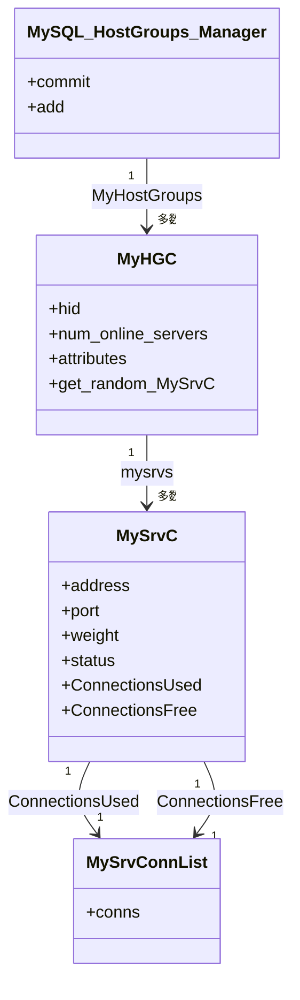
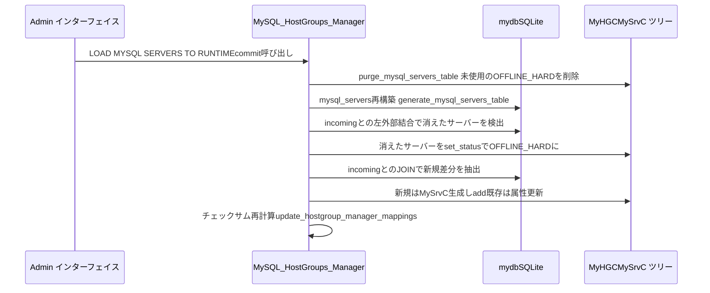
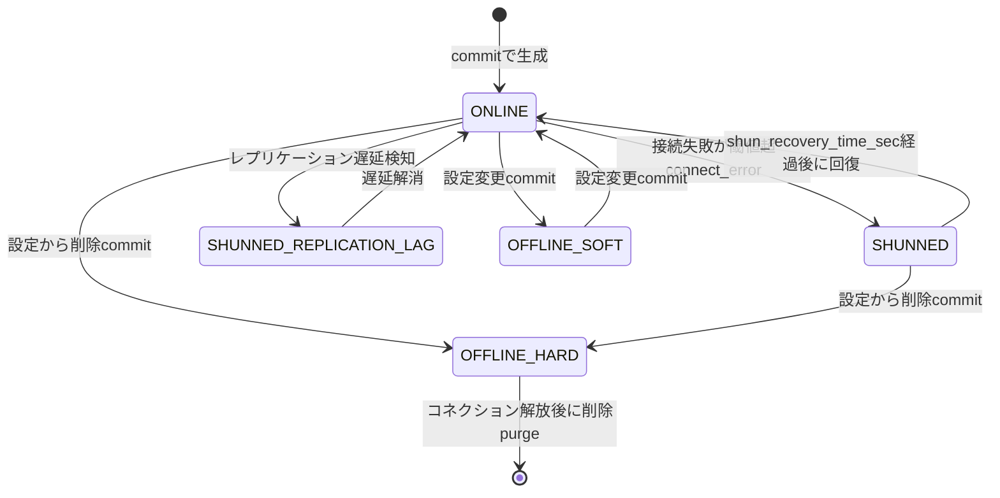

# 第13章 Hostgroups Manager とサーバー管理

> **本章で読むソース**
>
> - [`include/MySQL_HostGroups_Manager.h`](https://github.com/sysown/proxysql/blob/v3.0.9/include/MySQL_HostGroups_Manager.h)
> - [`include/Base_HostGroups_Manager.h`](https://github.com/sysown/proxysql/blob/v3.0.9/include/Base_HostGroups_Manager.h)
> - [`include/proxysql_structs.h`](https://github.com/sysown/proxysql/blob/v3.0.9/include/proxysql_structs.h)
> - [`lib/MySQL_HostGroups_Manager.cpp`](https://github.com/sysown/proxysql/blob/v3.0.9/lib/MySQL_HostGroups_Manager.cpp)
> - [`lib/Base_HostGroups_Manager.cpp`](https://github.com/sysown/proxysql/blob/v3.0.9/lib/Base_HostGroups_Manager.cpp)
> - [`lib/MyHGC.cpp`](https://github.com/sysown/proxysql/blob/v3.0.9/lib/MyHGC.cpp)
> - [`lib/MySrvC.cpp`](https://github.com/sysown/proxysql/blob/v3.0.9/lib/MySrvC.cpp)
> - [`lib/BaseHGC.cpp`](https://github.com/sysown/proxysql/blob/v3.0.9/lib/BaseHGC.cpp)

## この章の狙い

ProxySQL はクライアントから見えるMySQLサーバーの集合を、**ホストグループ**という論理的な単位でまとめる。

書き込み用のプライマリ群と読み取り用のレプリカ群を別のホストグループに分けておけば、クエリルール（第9章）がSQL文の種別だけで転送先を選び分けられる。

本章では、このホストグループを実行時に表現するクラス群と、Admin インターフェイス（第20章）経由で設定された `mysql_servers` テーブルからその実行時構造を組み立てる `commit` の流れ、サーバーが到達する状態とその遷移を扱う。

## 前提

ホストグループ管理は、セッション（第7章、第8章）がバックエンドへの接続を要求したときの入口にあたる。

本章が組み立てる `MyHGC` と `MySrvC` の構造は、次の章で扱う内容の土台になる。

- 各 `MySrvC` が保持するコネクションプールの詳細は第14章で扱う。
- Monitor スレッドがサーバーの死活や read_only を調べて状態を書き換える仕組みは第17章と第18章で扱う。
- Admin の `LOAD MYSQL SERVERS TO RUNTIME` がどのように本章の `commit` を呼び出すかは第21章で扱う。

## ホストグループとサーバーの階層

ProxySQLは、設定上のホストグループとバックエンドサーバーを、それぞれ**MyHGC**（MySQL Host Group Container）と**MySrvC**（MySQL Server Container）というクラスで表現する。

`MyHGC` はテンプレートクラス `BaseHGC` を継承しており、MySQLとPostgreSQL（第24章、第25章）の両方のバックエンド管理で共通のフィールドとロジックを再利用する。

[`include/Base_HostGroups_Manager.h` L295-L353](https://github.com/sysown/proxysql/blob/v3.0.9/include/Base_HostGroups_Manager.h#L295-L353)

```cpp
template <typename HGC>
class BaseHGC {	// MySQL Host Group Container
	public:
	unsigned int hid;
	std::atomic<uint32_t> num_online_servers;
	time_t last_log_time_num_online_servers;
	unsigned long long current_time_now;
	uint32_t new_connections_now;
	using TypeSrvList = typename std::conditional<
		std::is_same_v<HGC, MyHGC>, MySrvList, PgSQL_SrvList
	>::type;
	BaseSrvList<HGC> *mysrvs;
	struct { // this is a series of attributes specific for each hostgroup
		char * init_connect;
		char * comment;
		char * ignore_session_variables_text; // this is the original version (text format) of ignore_session_variables
		uint32_t max_num_online_servers;
		uint32_t throttle_connections_per_sec;
		int32_t monitor_slave_lag_when_null;
		int8_t autocommit;
		int8_t free_connections_pct;
		int8_t handle_warnings;
		bool multiplex;
		bool connection_warming;
		bool configured; // this variable controls if attributes are configured or not. If not configured, they do not apply
		bool initialized; // this variable controls if attributes were ever configured or not. Used by reset_attributes()
		nlohmann::json * ignore_session_variables_json = nullptr; // the JSON format of ignore_session_variables
	} attributes;
	struct {
		int64_t weight;
		int64_t max_connections;
		int32_t use_ssl;
	} servers_defaults;
	void reset_attributes();
	inline
	bool handle_warnings_enabled() const {
		return attributes.configured == true && attributes.handle_warnings != -1 ? attributes.handle_warnings : mysql_thread___handle_warnings;
	}
	inline
	int32_t get_monitor_slave_lag_when_null() const {
		return attributes.configured == true && attributes.monitor_slave_lag_when_null != -1 ? attributes.monitor_slave_lag_when_null : mysql_thread___monitor_slave_lag_when_null;
	}
	BaseHGC(int);
	virtual ~BaseHGC();
	using TypeSrvC = typename std::conditional<
		 std::is_same_v<HGC, MyHGC>, MySrvC, PgSQL_SrvC
	>::type;
	using TypeSess = typename std::conditional<
		 std::is_same_v<HGC, MyHGC>, MySQL_Session, PgSQL_Session
	>::type;
	TypeSess *get_random_MySrvC(char * gtid_uuid, uint64_t gtid_trxid, int max_lag_ms, TypeSess *sess);
	void refresh_online_server_count();
	void log_num_online_server_count_error();
	inline
	bool online_servers_within_threshold() const {
		if (num_online_servers.load(std::memory_order_relaxed) <= attributes.max_num_online_servers) return true;
		return false;
	}
};
```

`MyHGC` 自体はこのテンプレートを継承し、MySQL固有のサーバー選択関数だけを追加した薄いクラスである。

[`include/MySQL_HostGroups_Manager.h` L281-L285](https://github.com/sysown/proxysql/blob/v3.0.9/include/MySQL_HostGroups_Manager.h#L281-L285)

```cpp
class MyHGC: public BaseHGC<MyHGC> {
	public:
	MyHGC(int _hid) : BaseHGC<MyHGC>(_hid) {}
	MySrvC *get_random_MySrvC(char * gtid_uuid, uint64_t gtid_trxid, int max_lag_ms, MySQL_Session *sess);
};
```

`attributes.max_num_online_servers` は `mysql_hostgroup_attributes` テーブルの `max_num_online_servers` 列に対応する。

`num_online_servers` はONLINE状態のサーバー数をキャッシュしたアトミック変数であり、`online_servers_within_threshold()` がこのキャッシュ値と設定上限を比べるだけで済むようにしている。

一つのホストグループの中には、複数の `MySrvC` が並ぶ。

[`include/MySQL_HostGroups_Manager.h` L179-L192](https://github.com/sysown/proxysql/blob/v3.0.9/include/MySQL_HostGroups_Manager.h#L179-L192)

```cpp
class MySrvC {	// MySQL Server Container
	public:
	MyHGC *myhgc;
	char *address;
	uint16_t port;
	uint16_t gtid_port;
	uint16_t flags;
	int64_t weight;
	unsigned int compression;
	int64_t max_connections;
	unsigned int aws_aurora_current_lag_us;
	unsigned int max_replication_lag;
	unsigned int max_connections_used; // The maximum number of connections that has been opened
	unsigned int connect_OK;
```

`MySrvC` は自分が属するホストグループへのポインタ `myhgc` を持ち、逆に `MyHGC` は自分の配下のサーバー一覧を `BaseSrvList` （実体は `MySrvList`）として持つ。

相互参照になっている理由は、状態変更のたびにホストグループ側の集計（`num_online_servers` の再計算など）へすぐさかのぼれるようにするためである。

`MySrvC` の状態は `status` フィールドで管理し、外部からは `set_status()` と `get_status()` だけを通す。

[`include/MySQL_HostGroups_Manager.h` L268-L273](https://github.com/sysown/proxysql/blob/v3.0.9/include/MySQL_HostGroups_Manager.h#L268-L273)

```cpp
	void set_status(MySerStatus _status);
	inline
	MySerStatus get_status() const { return status; }
private:
	enum MySerStatus status;
};
```

`set_status()` を経由させているのは、状態変更のたびに所属ホストグループのオンラインサーバー数を再集計させるためである（後述）。

各 `MySrvC` は、使用中コネクションと未使用コネクションをそれぞれ `ConnectionsUsed` と `ConnectionsFree` という `MySrvConnList` で保持する。

このコネクションプールの内部構造とプッシュ、ポップの詳細は第14章で扱う。

以上の階層をまとめると次のようになる。



## mysql_servers から実行時構造を構築する commit

Admin インターフェイスで `mysql_servers` テーブルを編集し `LOAD MYSQL SERVERS TO RUNTIME` を実行すると、`MySQL_HostGroups_Manager::commit()` が呼ばれる。

この関数は、設定用のSQLiteテーブル（`mysql_servers_incoming`）と、上で見た `MyHGC`／`MySrvC` のメモリ上の木構造を突き合わせ、実行時構造を差分更新する。

まず、`OFFLINE_HARD` になっていて未使用のサーバーをメモリから削除する。

[`lib/Base_HostGroups_Manager.cpp` L1703-L1721](https://github.com/sysown/proxysql/blob/v3.0.9/lib/Base_HostGroups_Manager.cpp#L1703-L1721)

```cpp
void MySQL_HostGroups_Manager::purge_mysql_servers_table() {
	for (unsigned int i=0; i<MyHostGroups->len; i++) {
		MyHGC *myhgc=(MyHGC *)MyHostGroups->index(i);
		MySrvC *mysrvc=NULL;
		for (unsigned int j=0; j<myhgc->mysrvs->servers->len; j++) {
			mysrvc=myhgc->mysrvs->idx(j);
			if (mysrvc->get_status() == MYSQL_SERVER_STATUS_OFFLINE_HARD) {
				if (mysrvc->ConnectionsUsed->conns_length()==0 && mysrvc->ConnectionsFree->conns_length()==0) {
					// no more connections for OFFLINE_HARD server, removing it
					mysrvc=(MySrvC *)myhgc->mysrvs->servers->remove_index_fast(j);
					// already being refreshed in MySrvC destructor
					//myhgc->refresh_online_server_count(); 
					j--;
					delete mysrvc;
				}
			}
		}
	}
}
```

`OFFLINE_HARD` はサーバーが設定から削除されたことを表す状態であり、コネクションが残っている間は遅延削除して、使用中のコネクションが安全に解放されるのを待つ。

続いて、既存のメモリ上構造を `mysql_servers` という補助SQLiteテーブルへダンプし直し、`mysql_servers_incoming`（新しい設定）との左外部結合で「設定から消えたサーバー」を洗い出して `OFFLINE_HARD` にする。

[`lib/MySQL_HostGroups_Manager.cpp` L1299-L1350](https://github.com/sysown/proxysql/blob/v3.0.9/lib/MySQL_HostGroups_Manager.cpp#L1299-L1350)

```cpp
	unsigned long long curtime1=monotonic_time();
	wrlock();
	// purge table
	purge_mysql_servers_table();
	// if any server has gtid_port enabled, use_gtid is set to true
	// and then has_gtid_port is set too
	bool use_gtid = false;
	proxy_debug(PROXY_DEBUG_MYSQL_CONNPOOL, 4, "DELETE FROM mysql_servers\n");
	mydb->execute("DELETE FROM mysql_servers");
	generate_mysql_servers_table();

	char *error=NULL;
	int cols=0;
	int affected_rows=0;
	SQLite3_result *resultset=NULL;
	if (GloMTH->variables.hostgroup_manager_verbose) {
		mydb->execute_statement((char *)"SELECT * FROM mysql_servers_incoming", &error , &cols , &affected_rows , &resultset);
		if (error) {
			proxy_error("Error on read from mysql_servers_incoming : %s\n", error);
		} else {
			if (resultset) {
				proxy_info("Dumping mysql_servers_incoming\n");
				resultset->dump_to_stderr();
			}
		}
		if (resultset) { delete resultset; resultset=NULL; }
	}
	char *query=NULL;
	query=(char *)"SELECT mem_pointer, t1.hostgroup_id, t1.hostname, t1.port FROM mysql_servers t1 LEFT OUTER JOIN mysql_servers_incoming t2 ON (t1.hostgroup_id=t2.hostgroup_id AND t1.hostname=t2.hostname AND t1.port=t2.port) WHERE t2.hostgroup_id IS NULL";
	mydb->execute_statement(query, &error , &cols , &affected_rows , &resultset);
	if (error) {
		proxy_error("Error on %s : %s\n", query, error);
	} else {
		if (GloMTH->variables.hostgroup_manager_verbose) {
			proxy_info("Dumping mysql_servers LEFT JOIN mysql_servers_incoming\n");
			resultset->dump_to_stderr();
		}
		for (std::vector<SQLite3_row *>::iterator it = resultset->rows.begin() ; it != resultset->rows.end(); ++it) {
			SQLite3_row *r=*it;
			long long ptr=atoll(r->fields[0]);
			proxy_warning("Removed server at address %lld, hostgroup %s, address %s port %s. Setting status OFFLINE HARD and immediately dropping all free connections. Used connections will be dropped when trying to use them\n", ptr, r->fields[1], r->fields[2], r->fields[3]);
			MySrvC *mysrvc=(MySrvC *)ptr;
			mysrvc->set_status(MYSQL_SERVER_STATUS_OFFLINE_HARD);
			mysrvc->ConnectionsFree->drop_all_connections();
			char *q1=(char *)"DELETE FROM mysql_servers WHERE mem_pointer=%lld";
			char *q2=(char *)malloc(strlen(q1)+32);
			sprintf(q2,q1,ptr);
			mydb->execute(q2);
			free(q2);
		}
	}
	if (resultset) { delete resultset; resultset=NULL; }
```

このコードの `mem_pointer` は、SQLiteの行にその行が指す `MySrvC` インスタンスのポインタ値をそのまま数値として埋め込んだものである。

SQLiteのJOINで「メモリ上に存在するが新設定に存在しないサーバー」を突き合わせたあと、そのポインタ値を `atoll` で数値に戻してキャストすれば、対応する `MySrvC` へ直接たどり着ける。

設定行そのものにC++オブジェクトへのハンドルを埋め込むことで、アドレスやポート番号による再検索なしにO(1)でオブジェクトへ到達できる。

残った差分（新規サーバーと属性変更のあるサーバー）は、`mysql_servers` と `mysql_servers_incoming` のJOINで一括抽出し、新規なら `MySrvC` を生成して `add()` で対応するホストグループにぶら下げ、既存なら重みや状態などのフィールドだけを書き換える。

[`lib/Base_HostGroups_Manager.cpp` L2432-L2460](https://github.com/sysown/proxysql/blob/v3.0.9/lib/Base_HostGroups_Manager.cpp#L2432-L2460)

```cpp
void MySQL_HostGroups_Manager::add(MySrvC *mysrvc, unsigned int _hid) {

	// Debug message indicating the addition of the MySQL server connection to the hostgroup
	proxy_debug(PROXY_DEBUG_MYSQL_CONNPOOL, 7, "Adding MySrvC %p (%s:%d) for hostgroup %d\n", mysrvc, mysrvc->address, mysrvc->port, _hid);

	// Construct the endpoint ID using the hostgroup ID, server address, and port
	std::string endpoint_id { std::to_string(_hid) + ":" + string { mysrvc->address } + ":" + std::to_string(mysrvc->port) };

	// Since metrics for servers are stored per-endpoint; the metrics for a particular endpoint can live longer than the
	// 'MySrvC' itself. For example, a failover or a server config change could remove the server from a particular
	// hostgroup, and a subsequent one bring it back to the original hostgroup. For this reason, everytime a 'mysrvc' is
	// created and added to a particular hostgroup, we update the endpoint metrics for it.

	// Update server metrics based on endpoint ID
	mysrvc->bytes_recv = get_prometheus_counter_val(this->status.p_conn_pool_bytes_data_recv_map, endpoint_id);
	mysrvc->bytes_sent = get_prometheus_counter_val(this->status.p_conn_pool_bytes_data_sent_map, endpoint_id);
	mysrvc->connect_ERR = get_prometheus_counter_val(this->status.p_connection_pool_conn_err_map, endpoint_id);
	mysrvc->connect_OK = get_prometheus_counter_val(this->status.p_connection_pool_conn_ok_map, endpoint_id);
	mysrvc->queries_sent = get_prometheus_counter_val(this->status.p_connection_pool_queries_map, endpoint_id);

	// Lookup the hostgroup by ID and add the server connection to it
	MyHGC *myhgc=MyHGC_lookup(_hid);

	// Update server defaults with hostgroup attributes
	update_hg_attrs_server_defaults(mysrvc, myhgc);

	// Add the server to the hostgroup's servers list
	myhgc->mysrvs->add(mysrvc);
}
```

`MyHGC_lookup()` は、指定したホストグループIDの `MyHGC` が既にあればそれを返し、なければ生成してから登録する。

`commit` の一連の流れを図にすると次のようになる。



## サーバーの状態遷移

サーバーの状態は `enum MySerStatus` の5値で表す。

[`include/proxysql_structs.h` L17-L23](https://github.com/sysown/proxysql/blob/v3.0.9/include/proxysql_structs.h#L17-L23)

```cpp
enum MySerStatus {
	MYSQL_SERVER_STATUS_ONLINE,
	MYSQL_SERVER_STATUS_SHUNNED,
	MYSQL_SERVER_STATUS_OFFLINE_SOFT,
	MYSQL_SERVER_STATUS_OFFLINE_HARD,
	MYSQL_SERVER_STATUS_SHUNNED_REPLICATION_LAG
};
```

`ONLINE` は通常の稼働状態で、クエリの転送先として選ばれる。

`OFFLINE_SOFT` と `OFFLINE_HARD` は、いずれも `mysql_servers` テーブルの `status` 列を通じて設定側から明示的に指定する状態である。

`OFFLINE_SOFT` は新規コネクションだけを止めて既存の接続は使い切らせる緩やかな切り離し、`OFFLINE_HARD` は前節で見たとおり設定から削除されたサーバーを表し、コネクションを使い切ったあとメモリから消される。

これに対して `SHUNNED` と `SHUNNED_REPLICATION_LAG` は、ProxySQLが接続エラーやレプリケーション遅延を検知して**自動的に**書き込む状態である。

接続に連続して失敗すると、`MySrvC::connect_error()` が閾値を超えたところで `ONLINE` から `SHUNNED` へ切り替える。

[`lib/MySrvC.cpp` L111-L130](https://github.com/sysown/proxysql/blob/v3.0.9/lib/MySrvC.cpp#L111-L130)

```cpp
		int connect_retries = mysql_thread___connect_retries_on_failure + 1;
		int max_failures = mysql_thread___shun_on_failures > connect_retries ? connect_retries : mysql_thread___shun_on_failures;

		if (__sync_add_and_fetch(&connect_ERR_at_time_last_detected_error,1) >= (unsigned int)max_failures) {
			bool _shu=false;
			if (get_mutex==true)
				MyHGM->wrlock(); // to prevent race conditions, lock here. See #627
			if (status==MYSQL_SERVER_STATUS_ONLINE) {
				status=MYSQL_SERVER_STATUS_SHUNNED;
				shunned_automatic=true;
				_shu=true;
			} else {
				_shu=false;
			}
			if (get_mutex==true)
				MyHGM->wrunlock();
			if (_shu) {
			proxy_error("Shunning server %s:%d with %u errors/sec. Shunning for %u seconds\n", address, port, connect_ERR_at_time_last_detected_error , mysql_thread___shun_recovery_time_sec);
			}
		}
```

`SHUNNED` になったサーバーは、`mysql-shun_recovery_time_sec` で設定した時間が経過すると、次にサーバー選択が走ったタイミングで自動的に `ONLINE` へ戻される（`MyHGC::get_random_MySrvC()` 内の回復処理、次節で見る）。

一方、レプリケーション遅延は `replication_lag_action_inner()` が監視結果をもとに `ONLINE` と `SHUNNED_REPLICATION_LAG` を行き来させる。

[`lib/Base_HostGroups_Manager.cpp` L2486-L2516](https://github.com/sysown/proxysql/blob/v3.0.9/lib/Base_HostGroups_Manager.cpp#L2486-L2516)

```cpp
					// always increase the counter
					mysrvc->cur_replication_lag_count += 1;
					if (mysrvc->cur_replication_lag_count >= (unsigned int)mysql_thread___monitor_replication_lag_count) {
						proxy_warning("Shunning server %s:%d from HG %u with replication lag of %d second, count number: '%d'\n", address, port, myhgc->hid, current_replication_lag, mysrvc->cur_replication_lag_count);
						mysrvc->set_status(MYSQL_SERVER_STATUS_SHUNNED_REPLICATION_LAG);
					} else {
						proxy_info(
							"Not shunning server %s:%d from HG %u with replication lag of %d second, count number: '%d' < replication_lag_count: '%d'\n",
							address,
							port,
							myhgc->hid,
							current_replication_lag,
							mysrvc->cur_replication_lag_count,
							mysql_thread___monitor_replication_lag_count
						);
					}
				} else {
					mysrvc->cur_replication_lag_count = 0;
				}
			} else {
				if (mysrvc->get_status() == MYSQL_SERVER_STATUS_SHUNNED_REPLICATION_LAG) {
					if (
						(/*current_replication_lag >= 0 &&*/override_repl_lag == false &&
						(current_replication_lag <= (int)mysrvc->max_replication_lag))
						||
						(current_replication_lag==-2 && override_repl_lag == true) // see issue 959
					) {
						mysrvc->set_status(MYSQL_SERVER_STATUS_ONLINE);
						proxy_warning("Re-enabling server %s:%d from HG %u with replication lag of %d second\n", address, port, myhgc->hid, current_replication_lag);
						mysrvc->cur_replication_lag_count = 0;
					}
				}
			}
```

この監視ループが呼ばれる場所（Monitorスレッド）の詳細は第18章で扱う。

いずれの遷移も `set_status()` を経由するため、状態が変わるたびにホストグループの `num_online_servers` が再集計される。

[`lib/MySrvC.cpp` L147-L150](https://github.com/sysown/proxysql/blob/v3.0.9/lib/MySrvC.cpp#L147-L150)

```cpp
void MySrvC::set_status(MySerStatus _status) {
	status = _status;
	if (myhgc)myhgc->refresh_online_server_count();
}
```

実行経路で実際に到達する状態遷移だけをまとめると次のようになる。



## 高速化の工夫 サーバー選択の候補絞り込み

セッションがバックエンドへの接続を必要とするたびに呼ばれる `MyHGC::get_random_MySrvC()` は、ホストグループ内のサーバーを一度だけ走査し、重み付きランダム選択で1台を選ぶ。

この関数はリクエストのたびに実行されるホットパスであり、余分なメモリ確保や複数回の走査を避ける工夫が入っている。

まず、候補サーバーを保持する配列は、多くの環境で十分な大きさのスタック配列をまず使い、それを超える場合だけヒープ確保に切り替える。

[`lib/MyHGC.cpp` L14-L37](https://github.com/sysown/proxysql/blob/v3.0.9/lib/MyHGC.cpp#L14-L37)

```cpp
MySrvC *MyHGC::get_random_MySrvC(char * gtid_uuid, uint64_t gtid_trxid, int max_lag_ms, MySQL_Session *sess) {
	MySrvC *mysrvc=NULL;
	unsigned int j;
	unsigned int sum=0;
	unsigned int TotalUsedConn=0;
	unsigned int l=mysrvs->cnt();
	static time_t last_hg_log = 0;
	unsigned long long session_track_backoff_until;
#ifdef TEST_AURORA
	unsigned long long a1 = array_mysrvc_total/10000;
	array_mysrvc_total += l;
	unsigned long long a2 = array_mysrvc_total/10000;
	if (a2 > a1) {
		fprintf(stderr, "Total: %llu, Candidates: %llu\n", array_mysrvc_total-l, array_mysrvc_cands);
	}
#endif // TEST_AURORA
	MySrvC *mysrvcCandidates_static[32];
	MySrvC **mysrvcCandidates = mysrvcCandidates_static;
	unsigned int num_candidates = 0;
	bool max_connections_reached = false;
	if (l>32) {
		mysrvcCandidates = (MySrvC **)malloc(sizeof(MySrvC *)*l);
	}
	if (l) {
```

ホストグループあたりのサーバー台数は運用上ほぼ常に数台からせいぜい数十台に収まるため、32要素のスタック配列 `mysrvcCandidates_static` で大半のケースをまかない、`malloc` はサーバー数がそれを超える例外的なホストグループでのみ発生する。

接続要求のたびに呼ばれるこの関数からヒープ確保をほぼ排除できるので、割り当てと解放にかかるコストを避けられる。

候補を1回の走査で集めたあとの選択自体も、重みの累積和を使った一発勝負の乱数選択になっている。

[`lib/MyHGC.cpp` L331-L349](https://github.com/sysown/proxysql/blob/v3.0.9/lib/MyHGC.cpp#L331-L349)

```cpp
		unsigned int k;
		k=rand_fast()%New_sum;
		k++;
		New_sum=0;

		for (j=0; j<num_candidates; j++) {
			mysrvc = mysrvcCandidates[j];
			New_sum+=mysrvc->weight;
			if (k<=New_sum) {
				proxy_debug(PROXY_DEBUG_MYSQL_CONNPOOL, 7, "Returning MySrvC %p, server %s:%d\n", mysrvc, mysrvc->address, mysrvc->port);
				if (l>32) {
					free(mysrvcCandidates);
				}
#ifdef TEST_AURORA
				array_mysrvc_cands += num_candidates;
#endif // TEST_AURORA
				return mysrvc;
			}
		}
	} else {
```

重みの合計値 `New_sum` の範囲で乱数 `k` を1つだけ引き、候補配列を先頭から累積和と比較して `k` が収まる区間のサーバーを返す。

サーバーごとに乱数を引き直す方式ではなく、候補集合全体に対して乱数を1回だけ引く方式なので、`rand_fast()` の呼び出し回数がサーバー数に依存せず一定になる。

重みが大きいサーバーほど累積和の区間が広くなるため、この一発勝負の比較だけで重み付きラウンドロビンに相当する選択ができる。

## まとめ

ホストグループは `MyHGC` が、バックエンドサーバーは `MySrvC` がそれぞれ表現し、`MyHGC` が複数の `MySrvC` を束ねる木構造を形成する。

Admin側の `mysql_servers` テーブルは、`commit()` が差分検出とオブジェクトの生成、更新、`OFFLINE_HARD` 化を通じて、この木構造に反映する。

サーバーの状態は `ONLINE`、`SHUNNED`、`SHUNNED_REPLICATION_LAG`、`OFFLINE_SOFT`、`OFFLINE_HARD` の5つで、接続エラーやレプリケーション遅延の検知による自動遷移と、設定変更による明示的な遷移の二系統がある。

サーバー選択では、スタック上の固定長配列で候補を集め、重みの累積和に対して乱数を1回引くだけで済む一発勝負の比較により、接続要求のたびに実行されるホットパスでの負荷を抑えている。

## 関連する章

- [第14章 コネクションプール](14-connection-pool.md)
- [第17章 Monitor](../part05-ha/17-monitor.md)
- [第18章 レプリケーション監視](../part05-ha/18-replication-monitoring.md)
- [第21章 設定の反映](../part06-admin/21-config-layers.md)
