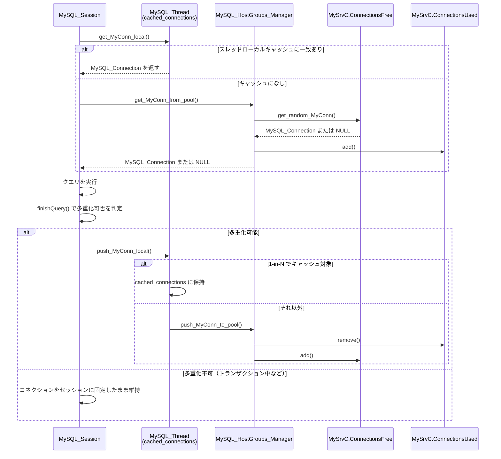

# 第14章 コネクションプールと多重化

> **本章で読むソース**
>
> - [`lib/MySrvConnList.cpp`](https://github.com/sysown/proxysql/blob/v3.0.9/lib/MySrvConnList.cpp)
> - [`include/MySQL_HostGroups_Manager.h`](https://github.com/sysown/proxysql/blob/v3.0.9/include/MySQL_HostGroups_Manager.h)
> - [`lib/MySQL_HostGroups_Manager.cpp`](https://github.com/sysown/proxysql/blob/v3.0.9/lib/MySQL_HostGroups_Manager.cpp)
> - [`lib/MySQL_Thread.cpp`](https://github.com/sysown/proxysql/blob/v3.0.9/lib/MySQL_Thread.cpp)
> - [`lib/MySQL_Session.cpp`](https://github.com/sysown/proxysql/blob/v3.0.9/lib/MySQL_Session.cpp)
> - [`lib/mysql_connection.cpp`](https://github.com/sysown/proxysql/blob/v3.0.9/lib/mysql_connection.cpp)
> - [`lib/mysql_data_stream.cpp`](https://github.com/sysown/proxysql/blob/v3.0.9/lib/mysql_data_stream.cpp)

## この章の狙い

第13章では、`MyHGC::get_random_MySrvC()` がホストグループの中から1台の `MySrvC` を選ぶところまでを見た。
本章では、その `MySrvC` が保持するバックエンドコネクションの集合をどう管理し、セッションへ貸し出し、使い終えたら回収するかを追う。
あわせて、1本のバックエンドコネクションを複数のフロントエンドセッションで使い回す**多重化**の仕組みと、多重化が無効になる条件を扱う。

## 前提

**バックエンド**への接続は、TCP 接続の確立と MySQL 認証ハンドシェイクを伴うため、クエリのたびに張り直すのは高くつく。
ProxySQL は `MySrvC` ごとにコネクションの集合を持ち、使用中と空きに分けて管理することで、この確立コストを繰り返し払わずに済ませている。

## MySrvConnList とコネクションの集合

`MySrvC`（第13章で見たサーバコンテナ）は、使用中コネクションと空きコネクションをそれぞれ `MySrvConnList` という別々のリストで持つ。

[`include/MySQL_HostGroups_Manager.h L229-L230`](https://github.com/sysown/proxysql/blob/v3.0.9/include/MySQL_HostGroups_Manager.h#L229-L230)

```cpp
	MySrvConnList *ConnectionsUsed;
	MySrvConnList *ConnectionsFree;
```

`MySrvConnList` 自体は、内部の可変長配列 `PtrArray *conns` に対する追加、削除、検索の操作を提供するだけの薄いラッパーである。

[`include/MySQL_HostGroups_Manager.h L143-L177`](https://github.com/sysown/proxysql/blob/v3.0.9/include/MySQL_HostGroups_Manager.h#L143-L177)

```cpp
class MySrvConnList {
	private:
	MySrvC *mysrvc;
	int find_idx(MySQL_Connection *c) {
		//for (unsigned int i=0; i<conns_length(); i++) {
		for (unsigned int i=0; i<conns->len; i++) {
			MySQL_Connection *conn = nullptr;
			conn = (MySQL_Connection *)conns->index(i);
			if (conn==c) {
				// 'find_idx' returns an int; cast the unsigned loop index to int
				// to avoid unsigned->signed narrowing warnings and keep the
				// sentinel return value of -1 for "not found".
				return static_cast<int>(i);
			}
		}
		return -1;
	}
	public:
	PtrArray *conns;
	MySrvConnList(MySrvC *);
	~MySrvConnList();
	void add(MySQL_Connection *);
	void remove(MySQL_Connection *c) {
		int i = -1;
		i = find_idx(c);
		assert(i>=0);
		conns->remove_index_fast((unsigned int)i);
	}
	MySQL_Connection *remove(int);
	MySQL_Connection * get_random_MyConn(MySQL_Session *sess, bool ff);
	void get_random_MyConn_inner_search(unsigned int start, unsigned int end, unsigned int& conn_found_idx, unsigned int& connection_quality_level, unsigned int& number_of_matching_session_variables, const MySQL_Connection * client_conn);
	unsigned int conns_length() { return conns->len; }
	void drop_all_connections();
	MySQL_Connection *index(unsigned int);
};
```

`ConnectionsUsed` と `ConnectionsFree` はどちらも同じ `MySrvConnList` 型のインスタンスであり、コネクションはこの2つの間を貸し出しと返却のたびに移動する。
「使用中」「空き」という区別はリストの所属だけで表現され、`MySQL_Connection` 自身に専用のフラグを持たせていない。

## 貸し出しの経路と2段のキャッシュ

セッションがバックエンドコネクションを必要とするとき、ProxySQL はまずスレッドローカルなキャッシュを調べ、見つからなければホストグループ全体の共有プールへ問い合わせる。

[`lib/MySQL_Session.cpp L7833-L7837`](https://github.com/sysown/proxysql/blob/v3.0.9/lib/MySQL_Session.cpp#L7833-L7837)

```cpp
			} else {
#ifndef STRESSTEST_POOL
				mc=thread->get_MyConn_local(mybe->hostgroup_id, this, NULL, 0, (int)qpo->max_lag_ms);
#endif // STRESSTEST_POOL
			}
```

`thread->get_MyConn_local()` はスレッドが持つ `cached_connections`（`PtrArray`）を線形探索し、要求元セッションのオプションと一致するコネクションを探す。
このスレッドローカルキャッシュは、ロックを取らずに読み書きできる点が重要である。
`cached_connections` で見つからなかった場合だけ、ホストグループ全体で共有される `MySQL_HostGroups_Manager` のプールへ進む。

[`lib/MySQL_Session.cpp L7854-L7860`](https://github.com/sysown/proxysql/blob/v3.0.9/lib/MySQL_Session.cpp#L7854-L7860)

```cpp
		if (mc==NULL) {
			if (trxid) {
				mc=MyHGM->get_MyConn_from_pool(mybe->hostgroup_id, this, (session_fast_forward || qpo->create_new_conn), uuid, trxid, -1);
			} else {
				mc=MyHGM->get_MyConn_from_pool(mybe->hostgroup_id, this, (session_fast_forward || qpo->create_new_conn), NULL, 0, (int)qpo->max_lag_ms);
			}
			thread->note_pool_attempt(mc == NULL);
```

`MySQL_HostGroups_Manager::get_MyConn_from_pool()` は書き込みロックを取ったうえで対象ホストグループから `MySrvC` を選び、その `ConnectionsFree` から1本取り出して `ConnectionsUsed` に移す。

[`lib/MySQL_HostGroups_Manager.cpp L2482-L2508`](https://github.com/sysown/proxysql/blob/v3.0.9/lib/MySQL_HostGroups_Manager.cpp#L2482-L2508)

```cpp
MySQL_Connection * MySQL_HostGroups_Manager::get_MyConn_from_pool(unsigned int _hid, MySQL_Session *sess, bool ff, char * gtid_uuid, uint64_t gtid_trxid, int max_lag_ms) {
	MySQL_Connection * conn = nullptr; // Pointer to hold the retrieved MySQL_Connection

	// Acquire a write lock to access the connection pool
	wrlock();

	// Increment the counter for connection pool retrieval attempts
	status.myconnpoll_get++;

	// Look up the hostgroup by ID and retrieve a random MySQL server from it based on specified criteria
	MyHGC *myhgc=MyHGC_lookup(_hid);
	MySrvC *mysrvc = NULL;
#ifdef TEST_AURORA
	for (int i=0; i<10; i++)
#endif // TEST_AURORA
	mysrvc = myhgc->get_random_MySrvC(gtid_uuid, gtid_trxid, max_lag_ms, sess);
	if (mysrvc) { // a MySrvC exists. If not, we return NULL = no targets
		// Attempt to get a random MySQL_Connection from the server's free connection pool
		conn=mysrvc->ConnectionsFree->get_random_MyConn(sess, ff);

		// If a connection is obtained, mark it as used and update connection pool statistics
		if (conn) {
			mysrvc->ConnectionsUsed->add(conn);
			status.myconnpoll_get_ok++;
			mysrvc->update_max_connections_used();
		}
	}

	// Release the write lock after accessing the connection pool
	wrunlock();
```

`get_random_MyConn()` は名前に反して単純な乱択ではない。
渡された `sess` のセッション変数、スキーマ、オプションと `ConnectionsFree` 内の各コネクションを比較し、`connection_quality_level`（0〜3）でどれだけ一致しているかを段階評価する。

[`lib/MySrvConnList.cpp L175-L188`](https://github.com/sysown/proxysql/blob/v3.0.9/lib/MySrvConnList.cpp#L175-L188)

```cpp
MySQL_Connection * MySrvConnList::get_random_MyConn(MySQL_Session *sess, bool ff) {
	MySQL_Connection * conn=NULL;
	unsigned int i;
	unsigned int conn_found_idx = 0;
	unsigned int l=conns_length();
	unsigned int connection_quality_level = 0;
	// connection_quality_level:
	// 0 : not found any good connection, tracked options are not OK
	// 1 : tracked options are OK , but CHANGE USER is required
	// 2 : tracked options are OK , CHANGE USER is not required, but some SET statement or INIT_DB needs to be executed
	// 3 : tracked options are OK , CHANGE USER is not required, and it seems that SET statements or INIT_DB ARE not required
	unsigned int number_of_matching_session_variables = 0; // this includes session variables AND schema
	bool connection_warming = mysql_thread___connection_warming;
```

探索は空きリストの中の乱数インデックス `i` から開始し、末尾まで見て一致度3（完全一致）が見つかればそこで打ち切り、見つからなければ先頭から `i` の手前までも走査する。

[`lib/MySrvConnList.cpp L204-L211`](https://github.com/sysown/proxysql/blob/v3.0.9/lib/MySrvConnList.cpp#L204-L211)

```cpp
	if (l && ff==false && needs_warming==false) {
		i=rand_fast()%l;
		if (sess && sess->client_myds && sess->client_myds->myconn && sess->client_myds->myconn->userinfo) {
			MySQL_Connection * client_conn = sess->client_myds->myconn;
			get_random_MyConn_inner_search(i, l, conn_found_idx, connection_quality_level, number_of_matching_session_variables, client_conn);
			if (connection_quality_level !=3 ) { // we didn't find the perfect connection
				get_random_MyConn_inner_search(0, i, conn_found_idx, connection_quality_level, number_of_matching_session_variables, client_conn);
			}
```

品質0（トラッキング対象のオプションが一致しない）の場合は新規コネクションを作成する経路に入り、必要なら古い空きコネクションを一部破棄してから確立する。
品質2または3（`CHANGE_USER` 不要）の場合は、`conn_found_idx` が指すコネクションをそのまま `ConnectionsFree` から取り除いて返す。

[`lib/MySrvConnList.cpp L261-L265`](https://github.com/sysown/proxysql/blob/v3.0.9/lib/MySrvConnList.cpp#L261-L265)

```cpp
				case 2: // tracked options are OK , CHANGE USER is not required, but some SET statement or INIT_DB needs to be executed
				case 3: // tracked options are OK , CHANGE USER is not required, and it seems that SET statements or INIT_DB ARE not required
					// here we return the best connection we have, no matter if connection_quality_level is 2 or 3
					conn=(MySQL_Connection *)conns->remove_index_fast(conn_found_idx);
					break;
```

すべての空きコネクションを毎回線形走査するとリストが長いほど遅くなるが、`rand_fast()` によるランダムな開始位置と、品質3が見つかった時点での即時打ち切りが、実用上の走査量を抑えている。

## 貸し出しライフサイクルの全体像

貸し出しから返却までの流れは次のようになる。



## 多重化と、それを無効にする条件

**多重化**（multiplexing）とは、1本のバックエンドコネクションを、クエリとクエリの間で別のフロントエンドセッションに貸し出し、少数のバックエンドコネクションで多数のクライアントを捌く仕組みである。
クエリが完了しコネクションが `ASYNC_IDLE` に戻るたびに、`MySQL_Session::finishQuery()` がそのコネクションをプールへ返すか、セッションに固定したまま維持するかを判定する。

[`lib/MySQL_Session.cpp L8516-L8532`](https://github.com/sysown/proxysql/blob/v3.0.9/lib/MySQL_Session.cpp#L8516-L8532)

```cpp
void MySQL_Session::finishQuery(MySQL_Data_Stream *myds, MySQL_Connection *myconn, bool prepared_stmt_with_no_params) {
					myds->myconn->reduce_auto_increment_delay_token();
					if (locked_on_hostgroup >= 0) {
						if (qpo->multiplex == -1) {
							myds->myconn->set_status(true, STATUS_MYSQL_CONNECTION_NO_MULTIPLEX);
						}
					}

					const bool is_active_transaction = myds->myconn->IsActiveTransaction();
					const bool multiplex_disabled_by_status = myds->myconn->MultiplexDisabled(false);

					const bool multiplex_delayed = myds->myconn->auto_increment_delay_token > 0;
					const bool multiplex_delayed_with_timeout =
						!multiplex_disabled_by_status && multiplex_delayed && mysql_thread___auto_increment_delay_multiplex_timeout_ms > 0;

					const bool multiplex_disabled = !multiplex_disabled_by_status && (!multiplex_delayed || multiplex_delayed_with_timeout);
					const bool conn_is_reusable = myds->myconn->reusable == true && !is_active_transaction && multiplex_disabled;
```

`conn_is_reusable` が真であり、かつ `mysql_thread___multiplexing`（グローバル設定）が有効なときだけ、コネクションはプールに戻る経路に入る。

[`lib/MySQL_Session.cpp L8554-L8566`](https://github.com/sysown/proxysql/blob/v3.0.9/lib/MySQL_Session.cpp#L8554-L8566)

```cpp
						} else {
							myconn->multiplex_delayed=false;
							myds->wait_until=0;
							myds->DSS=STATE_NOT_INITIALIZED;
							if (mysql_thread___autocommit_false_not_reusable && myds->myconn->IsAutoCommit()==false) {
								if (mysql_thread___reset_connection_algorithm == 2) {
									create_new_session_and_reset_connection(myds);
								} else {
									myds->destroy_MySQL_Connection_From_Pool(true);
								}
							} else {
								myds->return_MySQL_Connection_To_Pool();
							}
						}
```

`IsActiveTransaction()` は、サーバから返る `SERVER_STATUS_IN_TRANS` フラグでトランザクション中かどうかを判定する。

[`lib/mysql_connection.cpp L2643-L2656`](https://github.com/sysown/proxysql/blob/v3.0.9/lib/mysql_connection.cpp#L2643-L2656)

```cpp
bool MySQL_Connection::IsActiveTransaction() {
	bool ret=false;
	if (mysql) {
		ret = (mysql->server_status & SERVER_STATUS_IN_TRANS);
		if (ret == false && (mysql)->net.last_errno && unknown_transaction_status == true) {
			ret = true;
		}
		if (ret == false) {
			//bool r = ( mysql_thread___autocommit_false_is_transaction || mysql_thread___forward_autocommit ); // deprecated , see #3253
			bool r = ( mysql_thread___autocommit_false_is_transaction);
			if ( r && (IsAutoCommit() == false) ) {
				ret = true;
			}
		}
	}
	return ret;
}
```

トランザクション中でなくても、`MultiplexDisabled()` がコネクションの `status_flags` に特定のビットが立っていることを検出すれば、多重化は止まる。

[`lib/mysql_connection.cpp L2692-L2704`](https://github.com/sysown/proxysql/blob/v3.0.9/lib/mysql_connection.cpp#L2692-L2704)

```cpp
bool MySQL_Connection::MultiplexDisabled(bool check_delay_token) {
// status_flags stores information about the status of the connection
// can be used to determine if multiplexing can be enabled or not
	bool ret=false;
	if (status_flags & (STATUS_MYSQL_CONNECTION_USER_VARIABLE | STATUS_MYSQL_CONNECTION_PREPARED_STATEMENT |
		STATUS_MYSQL_CONNECTION_LOCK_TABLES | STATUS_MYSQL_CONNECTION_TEMPORARY_TABLE | STATUS_MYSQL_CONNECTION_GET_LOCK | STATUS_MYSQL_CONNECTION_NO_MULTIPLEX |
		STATUS_MYSQL_CONNECTION_SQL_LOG_BIN0 | STATUS_MYSQL_CONNECTION_FOUND_ROWS | STATUS_MYSQL_CONNECTION_NO_MULTIPLEX_HG |
		STATUS_MYSQL_CONNECTION_HAS_SAVEPOINT | STATUS_MYSQL_CONNECTION_HAS_WARNINGS) ) {
		ret=true;
	}
	if (check_delay_token && auto_increment_delay_token) return true;
	return ret;
}
```

このビット群には、ユーザ変数（`STATUS_MYSQL_CONNECTION_USER_VARIABLE`）、一時テーブル（`STATUS_MYSQL_CONNECTION_TEMPORARY_TABLE`）、`LOCK TABLES`、`GET_LOCK()`、プリペアドステートメント、セーブポイントなどが含まれる。

[`include/mysql_connection.h L15-L27`](https://github.com/sysown/proxysql/blob/v3.0.9/include/mysql_connection.h#L15-L27)

```cpp
//#define STATUS_MYSQL_CONNECTION_TRANSACTION          0x00000001 // DEPRECATED
#define STATUS_MYSQL_CONNECTION_COMPRESSION          0x00000002
#define STATUS_MYSQL_CONNECTION_USER_VARIABLE        0x00000004
#define STATUS_MYSQL_CONNECTION_PREPARED_STATEMENT   0x00000008
#define STATUS_MYSQL_CONNECTION_LOCK_TABLES          0x00000010
#define STATUS_MYSQL_CONNECTION_TEMPORARY_TABLE      0x00000020
#define STATUS_MYSQL_CONNECTION_GET_LOCK             0x00000040
#define STATUS_MYSQL_CONNECTION_NO_MULTIPLEX         0x00000080
#define STATUS_MYSQL_CONNECTION_SQL_LOG_BIN0         0x00000100
#define STATUS_MYSQL_CONNECTION_FOUND_ROWS           0x00000200
#define STATUS_MYSQL_CONNECTION_NO_MULTIPLEX_HG      0x00000400
#define STATUS_MYSQL_CONNECTION_HAS_SAVEPOINT        0x00000800
#define STATUS_MYSQL_CONNECTION_HAS_WARNINGS         0x00001000
```

これらの状態は、クライアントがセッション内でユーザ変数を設定したり一時テーブルを作成したりした時点で、クエリ処理の途中で `set_status()` によって立てられる。
一度立ったフラグは、そのセッションがこのコネクションを手放すまで残り続ける。
理由は単純で、ユーザ変数や一時テーブルはサーバ側のセッション状態そのものであり、別のクライアントに貸し出すとその状態が漏れ、意図しない結果を返しかねないからである。
`connection_quality_level` による選別（前節）とこの `MultiplexDisabled()` の判定は、コネクション取得時と返却時という別々の局面で同じ問題、すなわちセッション状態の食い違いを防ぐ役割を担っている。

## プールへの返却経路

多重化可能と判定されたコネクションは、`MySQL_Data_Stream::return_MySQL_Connection_To_Pool()` からセッションのデータストリームを介して切り離される。

[`lib/mysql_data_stream.cpp L1792-L1800`](https://github.com/sysown/proxysql/blob/v3.0.9/lib/mysql_data_stream.cpp#L1792-L1800)

```cpp
	} else {
		detach_connection();
		unplug_backend();
#ifdef STRESSTEST_POOL
		MyHGM->push_MyConn_to_pool(mc);  // #644
#else
		sess->thread->push_MyConn_local(mc);
#endif
	}
```

通常ビルドでは、返却はまずスレッドローカルの `push_MyConn_local()` に渡される。
ここでスレッドは、届いたコネクションをそのままローカルキャッシュに残すか、共有プールへ書き戻すかを、スレッド数 `N` に対する 1-in-N のカウンタで決める。

[`lib/MySQL_Thread.cpp L6470-L6490`](https://github.com/sysown/proxysql/blob/v3.0.9/lib/MySQL_Thread.cpp#L6470-L6490)

```cpp
void MySQL_Thread::push_MyConn_local(MySQL_Connection *c) {
	// Bounded local cache: cache 1-in-N releases (N = mysql_threads), push the
	// rest to the shared HGM pool so peer workers can pick them up.
	// At N=1 always cache (no sibling to share with).
	// Rationale: avoids the connection-hoarding behavior that starved sibling
	// workers at high client count, while preserving most of the lock-amortization
	// benefit at lower client counts.
	MySrvC *mysrvc=(MySrvC *)c->parent;
	// reset insert_id #1093
	c->mysql->insert_id = 0;
	if (mysrvc->get_status() == MYSQL_SERVER_STATUS_ONLINE) {
		if (c->async_state_machine==ASYNC_IDLE) {
			unsigned int n = (GloMTH && GloMTH->num_threads > 0) ? GloMTH->num_threads : 1;
			if ((push_local_counter++ % n) == 0) {
				cached_connections->add(c);
				return;
			}
		}
	}
	MyHGM->push_MyConn_to_pool(c);
}
```

このコメントが示すとおり、常にローカルへ溜め込むと、そのスレッドだけがコネクションを抱え込み、他のワーカースレッドがコネクション不足に陥る事態を招く。
かといって毎回グローバルな `MyHGM->push_MyConn_to_pool()` を呼べば、貸し出し側と同じ書き込みロックの取得がコネクション返却のたびに発生し、スレッド間の競合が増える。
`push_local_counter` を使った 1-in-N のサンプリングは、この両端の間で「ロック回数を減らしつつ、コネクションを他スレッドにも回す」バランスを取る仕組みであり、ロック取得を伴わないローカルキャッシュ判定を高頻度側の既定路線にすることで、共有プールへのアクセス回数そのものを間引いている。

共有プールに書き戻す `push_MyConn_to_pool()` は、`ConnectionsUsed` から取り除いたうえで、コネクションの状態に応じて `ConnectionsFree` へ戻すか、破棄するかを決める。

[`lib/MySQL_HostGroups_Manager.cpp L2306-L2356`](https://github.com/sysown/proxysql/blob/v3.0.9/lib/MySQL_HostGroups_Manager.cpp#L2306-L2356)

```cpp
void MySQL_HostGroups_Manager::push_MyConn_to_pool(MySQL_Connection *c, bool _lock) {
	// Ensure that the provided connection has a valid parent server
	assert(c->parent);

	MySrvC *mysrvc = nullptr; // Pointer to the parent server object

	// Acquire a lock if specified
	if (_lock)
		wrlock();

	// Reset the auto-increment delay token associated with the connection
	c->auto_increment_delay_token = 0;

	// Increment the counter tracking the number of connections pushed back to the pool
	status.myconnpoll_push++;

	// Obtain a pointer to the parent server (MySrvC)
	mysrvc = static_cast<MySrvC *>(c->parent);

	// Log debug information about the connection being returned to the pool
	proxy_debug(PROXY_DEBUG_MYSQL_CONNPOOL, 7, "Returning MySQL_Connection %p, server %s:%d with status %d\n", c, mysrvc->address, mysrvc->port, (int)mysrvc->get_status());

	// Remove the connection from the list of used connections for the parent server
	mysrvc->ConnectionsUsed->remove(c);

	// If the global thread handler (GloMTH) is not available, skip further processing
	if (GloMTH == nullptr) {
		goto __exit_push_MyConn_to_pool;
	}

	// If the largest query length exceeds the threshold, destroy the connection
	if (GloMTH && c->largest_query_length > (unsigned int)GloMTH->variables.threshold_query_length) {
		proxy_debug(PROXY_DEBUG_MYSQL_CONNPOOL, 7, "Destroying MySQL_Connection %p, server %s:%d with status %d . largest_query_length = %lu\n", c, mysrvc->address, mysrvc->port, (int)mysrvc->get_status(), c->largest_query_length);
		delete c;
		goto __exit_push_MyConn_to_pool;
	}	

	// If the server is online and the connection is in the idle state
	if (mysrvc->get_status() == MYSQL_SERVER_STATUS_ONLINE) {
		if (c->async_state_machine==ASYNC_IDLE) {
			if (GloMTH == NULL) { goto __exit_push_MyConn_to_pool; }
			if (c->local_stmts->get_num_backend_stmts() > (unsigned int)GloMTH->variables.max_stmts_per_connection) {  // Check if the connection has too many prepared statements
				// Log debug information about destroying the connection due to too many prepared statements
				proxy_debug(PROXY_DEBUG_MYSQL_CONNPOOL, 7, "Destroying MySQL_Connection %p, server %s:%d with status %d because has too many prepared statements\n", c, mysrvc->address, mysrvc->port, (int)mysrvc->get_status());
//				delete c;
				mysrvc->ConnectionsUsed->add(c); // Add the connection back to the list of used connections
				destroy_MyConn_from_pool(c, false); // Destroy the connection from the pool
			} else {
				c->optimize(); // Optimize the connection
				mysrvc->ConnectionsFree->add(c); // Add the connection to the list of free connections
			}
		} else {
			// Log debug information about destroying the connection
			proxy_debug(PROXY_DEBUG_MYSQL_CONNPOOL, 7, "Destroying MySQL_Connection %p, server %s:%d with status %d\n", c, mysrvc->address, mysrvc->port, (int)mysrvc->get_status());
			delete c; // Destroy the connection
		}
	} else {
		// Log debug information about destroying the connection
		proxy_debug(PROXY_DEBUG_MYSQL_CONNPOOL, 7, "Destroying MySQL_Connection %p, server %s:%d with status %d\n", c, mysrvc->address, mysrvc->port, (int)mysrvc->get_status());
		delete c; // Destroy the connection
	}
```

破棄されるのは、サーバがオンラインでない場合、コネクションが `ASYNC_IDLE` でない場合（クエリの途中で切断された等）、クエリ長がしきい値を超えていた場合、そしてプリペアドステートメントの数が上限を超えていた場合である。
それ以外は `c->optimize()` によって内部バッファなどを縮小したうえで `ConnectionsFree` に戻り、次の貸し出しを待つ。

スレッドがシャットダウンする、あるいは定期処理のタイミングでは、ローカルキャッシュに溜まったコネクションをまとめて共有プールへ返す経路もある。

[`lib/MySQL_Thread.cpp L6500-L6508`](https://github.com/sysown/proxysql/blob/v3.0.9/lib/MySQL_Thread.cpp#L6500-L6508)

```cpp
void MySQL_Thread::return_local_connections() {
	if (cached_connections->len==0) {
		return;
	}
	MyHGM->push_MyConn_to_pool_array((MySQL_Connection **)cached_connections->pdata, cached_connections->len);
	while (cached_connections->len) {
		cached_connections->remove_index_fast(0);
	}
}
```

## まとめ

`MySrvC` は使用中と空きのコネクションをそれぞれ `MySrvConnList` で管理し、貸し出し時は `ConnectionsFree` から一致度の高いコネクションを探し、返却時は `ConnectionsUsed` から取り除いて `ConnectionsFree` に戻す。
貸し出しと返却はどちらもスレッドローカルなキャッシュ `cached_connections` をまず経由し、ホストグループ全体で共有する `MySQL_HostGroups_Manager` のプールへは、ロックを伴うアクセスを間引いてから届く。
多重化は、クエリが完了するたびに `finishQuery()` がトランザクション状態と `MultiplexDisabled()` を調べて可否を決める仕組みであり、ユーザ変数、一時テーブル、`LOCK TABLES` などサーバ側のセッション状態を持つコネクションは、そのセッションに固定されたまま多重化されない。

## 関連する章

- 第13章 ホストグループマネージャ（`MyHGC::get_random_MySrvC()` によるサーバ選択）
- 第15章 バックエンドコネクションの実体（`MySQL_Connection` 自体の構造）
- 第16章 トランザクションと永続化（`transaction_persistent_hostgroup` によるホストグループ固定）
