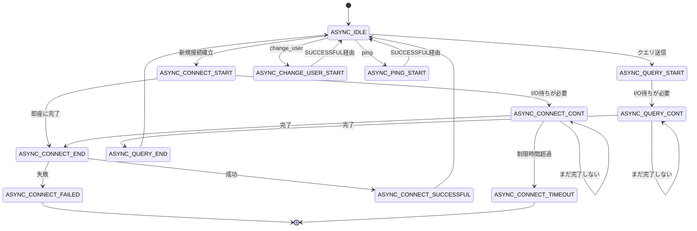

# 第15章 バックエンド接続の状態機械

> **本章で読むソース**
>
> - [`lib/mysql_connection.cpp`](https://github.com/sysown/proxysql/blob/v3.0.9/lib/mysql_connection.cpp)
> - [`include/mysql_connection.h`](https://github.com/sysown/proxysql/blob/v3.0.9/include/mysql_connection.h)
> - [`include/proxysql_structs.h`](https://github.com/sysown/proxysql/blob/v3.0.9/include/proxysql_structs.h)

## この章の狙い

第14章では、バックエンド接続を貸し出す**コネクションプール**の仕組みを見た。
本章では、貸し出された接続そのもの、つまり `MySQL_Connection` 1本が、libmariadb の非同期 API を使ってどのように接続確立やクエリ実行を進めるかを読む。

ProxySQL のスレッドは少数（通常は CPU コア数程度）しか存在しないのに、数百から数千のフロントエンド接続とバックエンド接続を同時に捌く。
1本の接続の I/O 待ちでスレッドを止めていては、この多重化は成立しない。
`MySQL_Connection` は、libmariadb が提供する非ブロッキング API を状態機械としてラップし、この問題を解決する。

## 前提

第7章で見た `MySQL_Session` の状態機械は、フロントエンドから見た1本のクエリの寿命（受信、処理、応答）を管理していた。
本章の状態機械はその内側、`MySQL_Session` がバックエンドとやり取りする段階でのみ動く、もう一段低いレイヤーである。
`MySQL_Session` は自身の状態機械の中から `MySQL_Connection` のメソッドを呼び出し、戻り値によって次に何をすべきかを決める。
両者は別の状態機械であり、混同しないように読み進める。

## MySQL_Connection が持つ状態

`MySQL_Connection` は1本のバックエンドMySQL接続を表すクラスである。

[`include/mysql_connection.h` L163](https://github.com/sysown/proxysql/blob/v3.0.9/include/mysql_connection.h#L163-L163)

```cpp
MDB_ASYNC_ST async_state_machine;	// Async state machine
```

`MDB_ASYNC_ST` は `ASYNC_ST` の別名である。

[`include/proxysql_structs.h` L51-L133](https://github.com/sysown/proxysql/blob/v3.0.9/include/proxysql_structs.h#L51-L133)

```cpp
enum ASYNC_ST { // MariaDB Async State Machine
	ASYNC_CONNECT_START,
	ASYNC_CONNECT_CONT,
	ASYNC_CONNECT_END,
	ASYNC_CONNECT_SUCCESSFUL,
	ASYNC_CONNECT_FAILED,
	ASYNC_CONNECT_TIMEOUT,
	ASYNC_CHANGE_USER_START,
	ASYNC_CHANGE_USER_CONT,
	ASYNC_CHANGE_USER_END,
	ASYNC_CHANGE_USER_SUCCESSFUL,
	ASYNC_CHANGE_USER_FAILED,
	ASYNC_CHANGE_USER_TIMEOUT,
	ASYNC_PING_START,
	ASYNC_PING_CONT,
	ASYNC_PING_END,
	ASYNC_PING_SUCCESSFUL,
	ASYNC_PING_FAILED,
	ASYNC_PING_TIMEOUT,
	// ... (中略) ...
	ASYNC_QUERY_START,
	ASYNC_QUERY_CONT,
	ASYNC_QUERY_END,
	ASYNC_QUERY_SUCCESSFUL,
	ASYNC_QUERY_FAILED,
	ASYNC_QUERY_TIMEOUT,
	// ... (中略) ...
	ASYNC_IDLE
};

using MDB_ASYNC_ST = ASYNC_ST;
```

この列挙型は、接続確立（`CONNECT`）、ユーザー切り替え（`CHANGE_USER`）、死活監視（`PING`）、クエリ実行（`QUERY`）、プリペアドステートメント関連の各処理を、それぞれ `_START` から `_SUCCESSFUL` / `_FAILED` / `_TIMEOUT` まで一続きの状態列として定義する。
どの処理も接続していない待機状態の `ASYNC_IDLE` から始まり、`ASYNC_IDLE` に戻って終わる。

## async_state_machine を回す handler()

状態を実際に進めるのは `handler()` である。

[`lib/mysql_connection.cpp` L1220-L1256](https://github.com/sysown/proxysql/blob/v3.0.9/lib/mysql_connection.cpp#L1220-L1256)

```cpp
MDB_ASYNC_ST MySQL_Connection::handler(short event) {
	unsigned long long processed_bytes=0;	// issue #527 : this variable will store the amount of bytes processed during this event
	if (mysql==NULL) {
		// it is the first time handler() is being called
		async_state_machine=ASYNC_CONNECT_START;
		myds->wait_until=myds->sess->thread->curtime+mysql_thread___connect_timeout_server*1000;
		if (myds->max_connect_time) {
			if (myds->wait_until > myds->max_connect_time) {
				myds->wait_until = myds->max_connect_time;
			}
		}
	}
handler_again:
	proxy_debug(PROXY_DEBUG_MYSQL_PROTOCOL, 6,"async_state_machine=%d\n", async_state_machine);
	switch (async_state_machine) {
		case ASYNC_CONNECT_START:
			connect_start();
			if (async_exit_status) {
				next_event(ASYNC_CONNECT_CONT);
			} else {
				NEXT_IMMEDIATE(ASYNC_CONNECT_END);
			}
			break;
		case ASYNC_CONNECT_CONT:
			if (event) {
				connect_cont(event);
			}
			if (async_exit_status) {
					if (myds->sess->thread->curtime >= myds->wait_until) {
						NEXT_IMMEDIATE(ASYNC_CONNECT_TIMEOUT);
					}
      	next_event(ASYNC_CONNECT_CONT);
			} else {
				NEXT_IMMEDIATE(ASYNC_CONNECT_END);
			}
    break;
			break;
```

`handler()` は巨大な `switch` 文であり、`async_state_machine` の値ごとに対応する処理（`connect_start()`、`change_user_cont()` など）を呼ぶ。
呼び出した処理が libmariadb の非同期 API を叩き、その戻り値 `async_exit_status` を見て、次の状態へ進むか、イベントを待つかを決める。

この分岐に使う2つのマクロが、この状態機械の核である。

[`lib/mysql_connection.cpp` L1218](https://github.com/sysown/proxysql/blob/v3.0.9/lib/mysql_connection.cpp#L1218-L1218)

```cpp
#define NEXT_IMMEDIATE(new_st) do { async_state_machine = new_st; goto handler_again; } while (0)
```

`NEXT_IMMEDIATE` は、libmariadb 側の処理がソケット I/O を待たずに完了した場合に使う。
状態を更新して `handler_again` ラベルへ `goto` し、同じ `handler()` 呼び出しの中で次の状態にすぐ進む。
一方、I/O 待ちが必要な場合は `next_event()` を呼ぶ。

[`lib/mysql_connection.cpp` L2082-L2120](https://github.com/sysown/proxysql/blob/v3.0.9/lib/mysql_connection.cpp#L2082-L2120)

```cpp
void MySQL_Connection::next_event(MDB_ASYNC_ST new_st) {
#ifdef DEBUG
	int fd;
#endif /* DEBUG */
	wait_events=0;

	if (async_exit_status & MYSQL_WAIT_READ)
		wait_events |= POLLIN;
	if (async_exit_status & MYSQL_WAIT_WRITE)
		wait_events|= POLLOUT;
	if (wait_events)
#ifdef DEBUG
		fd= mysql_get_socket(mysql);
#else
		mysql_get_socket(mysql);
#endif /* DEBUG */
	else
#ifdef DEBUG
		fd= -1;
#endif /* DEBUG */
	if (async_exit_status & MYSQL_WAIT_TIMEOUT) {
	timeout=10000;
	} else {
	}
	proxy_debug(PROXY_DEBUG_NET, 8, "fd=%d, wait_events=%d , old_ST=%d, new_ST=%d\n", fd, wait_events, async_state_machine, new_st);
	async_state_machine = new_st;
};
```

`next_event()` は `async_exit_status` に含まれる `MYSQL_WAIT_READ` / `MYSQL_WAIT_WRITE` のビットから、次に監視すべき `POLLIN` / `POLLOUT` を `wait_events` に立てるだけで、`handler()` からは戻る。
`goto` せずに `break` することで、呼び出し元に制御を返す。
ソケットの監視自体は呼び出し元（`MySQL_Session`）がスレッドの `epoll` ループに登録し、該当ソケットにイベントが来たときに再び `handler()` を同じ状態から呼び直す。
つまり `MySQL_Connection` はソケットを自分で待たず、進めるところまで進んでは制御を返す**コルーチンのような形**で動く。

## connect_start / connect_cont による非同期接続確立

接続確立の非同期化を、`ASYNC_CONNECT_START` の実体である `connect_start()` で見る。

[`lib/mysql_connection.cpp` L987-L1019](https://github.com/sysown/proxysql/blob/v3.0.9/lib/mysql_connection.cpp#L987-L1019)

```cpp
// non blocking API
void MySQL_Connection::connect_start() {
	PROXY_TRACE();
	mysql=mysql_init(NULL);
	assert(mysql);
	mysql_options(mysql, MYSQL_OPT_NONBLOCK, 0);

	connect_start_SetAttributes();

	connect_start_SetSslSettings();

	unsigned int timeout= 1;
	mysql_options(mysql, MYSQL_OPT_CONNECT_TIMEOUT, (void *)&timeout);

	connect_start_SetCharset();

	unsigned long client_flags = 0;
	connect_start_SetClientFlag(client_flags);

	char *auth_password=NULL;
	if (userinfo->password) {
		if (userinfo->password[0]=='*') { // we don't have the real password, let's pass sha1
			auth_password=userinfo->sha1_pass;
		} else {
			auth_password=userinfo->password;
		}
	}
	if (parent->port) {
		char* host_ip = connect_start_DNS_lookup();
		async_exit_status=mysql_real_connect_start(&ret_mysql, mysql, host_ip, userinfo->username, auth_password, userinfo->schemaname, parent->port, NULL, client_flags);
	} else {
		client_flags &= ~(CLIENT_COMPRESS | CLIENT_ZSTD_COMPRESSION_ALGORITHM); // disabling compression for connections made via Unix socket
		async_exit_status=mysql_real_connect_start(&ret_mysql, mysql, "localhost", userinfo->username, auth_password, userinfo->schemaname, parent->port, parent->address, client_flags);
	}
	fd=mysql_get_socket(mysql);
}
```

`mysql_options(mysql, MYSQL_OPT_NONBLOCK, 0)` が libmariadb 側を非ブロッキングモードに切り替える。
続く `mysql_real_connect_start()` が libmariadb の非同期接続 API であり、TCPの `connect()` が完了しなくてもすぐに戻ってくる。
戻り値は `async_exit_status` に入り、`MYSQL_WAIT_READ` / `MYSQL_WAIT_WRITE` のビットが立っていれば「まだ完了していないので、このソケットの読み書き可能を待て」という意味になる。

続きは `connect_cont()` である。

[`lib/mysql_connection.cpp` L1035-L1038](https://github.com/sysown/proxysql/blob/v3.0.9/lib/mysql_connection.cpp#L1035-L1038)

```cpp
void MySQL_Connection::connect_cont(short event) {
	proxy_debug(PROXY_DEBUG_MYSQL_PROTOCOL, 6,"event=%d\n", event);
	async_exit_status = mysql_real_connect_cont(&ret_mysql, mysql, mysql_status(event, true));
}
```

`connect_cont()` は、ソケットが読み書き可能になったタイミングで呼ばれ、`mysql_real_connect_cont()` に前回の続きから処理させる。
`mysql_status()` は、`epoll` から受け取った `event`（`POLLIN`/`POLLOUT`）を libmariadb が理解する `MYSQL_WAIT_READ`/`MYSQL_WAIT_WRITE` の形式に変換する。
接続確立には TCP ハンドシェイク、認証パケットのやり取りなど複数回の往復が必要であり、`ASYNC_CONNECT_CONT` の状態のまま `connect_cont()` が何度も呼ばれることで、1バイトずつ進行する。

`_START` / `_CONT` / `_END` の3段構成は、`CHANGE_USER`、`PING`、`QUERY` などすべての非同期処理に共通するパターンである。
`_START` が libmariadb の `_start()` 系 API を呼び、`_CONT` が `_cont()` 系 API を呼んで完了を待つ。
`async_exit_status` が0になった時点で `_END` に遷移し、libmariadb 呼び出し自体の成否を見て `_SUCCESSFUL` か `_FAILED` に分岐する。

## 状態遷移図

`handler()` が到達する主要な状態のうち、接続確立とクエリ実行の系列を図にする。
`ASYNC_CHANGE_USER_*` と `ASYNC_PING_*` も同じ `_START → _CONT → _END → _SUCCESSFUL/_FAILED/_TIMEOUT` の形を取るため、`QUERY` 系列で代表させる。



`ASYNC_QUERY_START` から `ASYNC_QUERY_END` へ至る経路は、実際には `handler()` 内で `ASYNC_QUERY_SUCCESSFUL` / `ASYNC_QUERY_FAILED` を経由するが、いずれも直後に `ASYNC_QUERY_END` へ合流するため図では省いた。
`enum ASYNC_ST` には他にも `ASYNC_STMT_PREPARE_*` や `ASYNC_RESYNC_*` などプリペアドステートメント関連の値が並ぶが、それらは第12章のプリペアドステートメント処理の中で個別の経路として遷移するため、ここでは代表経路だけを描いている。

## async_connect / async_query という外部インターフェイス

`MySQL_Session` が直接触るのは `handler()` ではなく、状態ごとに用意された `async_*` メソッドである。
`async_connect()` を見る。

[`lib/mysql_connection.cpp` L2123-L2159](https://github.com/sysown/proxysql/blob/v3.0.9/lib/mysql_connection.cpp#L2123-L2159)

```cpp
int MySQL_Connection::async_connect(short event) {
	PROXY_TRACE();
	if (mysql==NULL && async_state_machine!=ASYNC_CONNECT_START) {
		// LCOV_EXCL_START
		assert(0);
		// LCOV_EXCL_STOP
	}
	if (async_state_machine==ASYNC_IDLE) {
		myds->wait_until=0;
		return 0;
	}
	if (async_state_machine==ASYNC_CONNECT_SUCCESSFUL) {
		compute_unknown_transaction_status();
		async_state_machine=ASYNC_IDLE;
		myds->wait_until=0;
		creation_time = monotonic_time();
		return 0;
	}
	handler(event);
	switch (async_state_machine) {
		case ASYNC_CONNECT_SUCCESSFUL:
			compute_unknown_transaction_status();
			async_state_machine=ASYNC_IDLE;
			myds->wait_until=0;
			return 0;
			break;
		case ASYNC_CONNECT_FAILED:
			return -1;
			break;
		case ASYNC_CONNECT_TIMEOUT:
			return -2;
			break;
		default:
			return 1;
	}
	return 1;
}
```

`async_connect()` は `handler()` を1回呼び出したあと、その結果を `MySQL_Session` にとって扱いやすい整数コードに変換する。
戻り値は 0（完了）、-1（失敗）、-2（タイムアウト）、1（継続中）の4値であり、`ASYNC_CONNECT_SUCCESSFUL` に到達した場合は `async_state_machine` を `ASYNC_IDLE` に戻して次の要求に備える。
`ASYNC_IDLE` からもう一度 `async_connect()` が呼ばれても即座に0を返すだけで、二重に接続処理へ入らないようにガードしている。

`MySQL_Session` 側の呼び出しはこうなる。

[`lib/MySQL_Session.cpp` L3025](https://github.com/sysown/proxysql/blob/v3.0.9/lib/MySQL_Session.cpp#L3025-L3025)

```cpp
rc=myconn->async_connect(myds->revents);
```

`myds->revents` は `MySQL_Data_Stream`（第3章）が `epoll_wait()` から受け取った実際のイベントである。
`MySQL_Session` はこの戻り値 `rc` を見て、接続中の状態（`CONNECTING_SERVER` など）にとどまるか、次の状態（クエリ送信など）へ進むかを決める。
`async_query()` も同じ形で、[`lib/mysql_connection.cpp` L2201-L2299](https://github.com/sysown/proxysql/blob/v3.0.9/lib/mysql_connection.cpp#L2201-L2299) にあるように `ASYNC_QUERY_END` への到達を待って0か-1を返す。
`async_ping()`（[`lib/mysql_connection.cpp` L2308-L2349](https://github.com/sysown/proxysql/blob/v3.0.9/lib/mysql_connection.cpp#L2308-L2349)）と `async_change_user()`（[`lib/mysql_connection.cpp` L2351-L2390](https://github.com/sysown/proxysql/blob/v3.0.9/lib/mysql_connection.cpp#L2351-L2390)）も、`ASYNC_IDLE` からの開始と `_SUCCESSFUL`/`_FAILED`/`_TIMEOUT` への収束という同じ枠組みで実装されている。

このように、非同期処理の種類ごとに専用の `async_*` メソッドを用意し、内部の `handler()` を共有する構成によって、`MySQL_Session` は libmariadb の非同期 API や `MYSQL_WAIT_*` のビット演算を一切意識せずに済む。
1つのソケットI/Oイベントに対して1回だけ `handler()` を呼び出す設計のため、スレッドはブロッキングI/Oの完了を待つ間、他のセッションの処理に回ることができる。
これが本章の最適化の核心であり、少数のスレッドで大量の接続を多重化する`multiplexing`の基盤である。

## change_user による接続の再利用

`ASYNC_CHANGE_USER_*` 系列は、単なる非同期化以上の役割を持つ。
接続プール（第14章）から取り出した接続は、以前に別のフロントエンドユーザーが使っていた可能性がある。
この場合、TCP接続を張り直して認証をやり直すのではなく、MySQLプロトコルの `COM_CHANGE_USER` を送るだけでユーザーとセッション変数をリセットできる。

再利用が必要かどうかは `requires_CHANGE_USER()` が判定する。

[`lib/mysql_connection.cpp` L654-L691](https://github.com/sysown/proxysql/blob/v3.0.9/lib/mysql_connection.cpp#L654-L691)

```cpp
bool MySQL_Connection::requires_CHANGE_USER(const MySQL_Connection *client_conn) {
	char *username = client_conn->userinfo->username;
	if (strcmp(userinfo->username,username)) {
		// the two connections use different usernames
		// The connection need to be reset with CHANGE_USER
		return true;
	}
	for (auto i = 0; i < SQL_NAME_LAST_LOW_WM; i++) {
		if (client_conn->var_hash[i] == 0) {
			if (var_hash[i]) {
				// this connection has a variable set that the
				// client connection doesn't have.
				// Since connection cannot be unset , this connection
				// needs to be reset with CHANGE_USER
				return true;
			}
		}
	}
	if (client_conn->dynamic_variables_idx.size() < dynamic_variables_idx.size()) {
		// the server connection has more variables set than the client
		return true;
	}
	std::vector<uint32_t>::const_iterator it_c = client_conn->dynamic_variables_idx.begin(); // client connection iterator
	std::vector<uint32_t>::const_iterator it_s = dynamic_variables_idx.begin();              // server connection iterator
	for ( ; it_s != dynamic_variables_idx.end() ; it_s++) {
		while ( it_c != client_conn->dynamic_variables_idx.end() && ( *it_c < *it_s ) ) {
			it_c++;
		}
		if ( it_c != client_conn->dynamic_variables_idx.end() && *it_c == *it_s) {
			// the backend variable idx matches the frontend variable idx
		} else {
			// we are processing a backend variable but there are
			// no more frontend variables
			return true;
		}
	}
	return false;
}
```

ユーザー名が一致し、かつバックエンド接続に設定済みのセッション変数（`var_hash` と `dynamic_variables_idx`）がすべてフロントエンド側にも設定されている場合、`CHANGE_USER` は不要と判定される。
セッション変数は `SET` 文で追加できても取り消すコマンドがないため、バックエンド接続だけが余計な変数を持っている状態は「フロントエンドの期待と食い違う可能性がある接続」として扱われ、再利用の対象から外れる。

`CHANGE_USER` が必要と判定された場合、`MySQL_Session` は `change_user_start()` を呼ぶ。

[`lib/mysql_connection.cpp` L1040-L1065](https://github.com/sysown/proxysql/blob/v3.0.9/lib/mysql_connection.cpp#L1040-L1065)

```cpp
void MySQL_Connection::change_user_start() {
	PROXY_TRACE();
	//fprintf(stderr,"change_user_start FD %d\n", fd);
	MySQL_Connection_userinfo *_ui = NULL;
	if (myds->sess->client_myds == NULL) {
		// if client_myds is not defined, we are using CHANGE_USER to reset the connection
		_ui = userinfo;
	} else {
		_ui = myds->sess->client_myds->myconn->userinfo;
		userinfo->set(_ui);	// fix for bug #605
	}
	char *auth_password=NULL;
	if (userinfo->password) {
		if (userinfo->password[0]=='*') { // we don't have the real password, let's pass sha1
			auth_password=userinfo->sha1_pass;
		} else {
			auth_password=userinfo->password;
		}
	}
	// we first reset the charset to a default one.
	// this to solve the problem described here:
	// https://github.com/sysown/proxysql/pull/3249#issuecomment-761887970
	if (mysql->charset->nr >= 255)
		mysql_options(mysql, MYSQL_SET_CHARSET_NAME, mysql->charset->csname);
	async_exit_status = mysql_change_user_start(&ret_bool,mysql,_ui->username, auth_password, _ui->schemaname);
}
```

`mysql_change_user_start()` は `COM_CHANGE_USER` パケットを送る非同期 API であり、TCP接続はそのまま維持される。
成功後、`MySQL_Session` は `reset()`（[`lib/mysql_connection.cpp` L3086-L3133](https://github.com/sysown/proxysql/blob/v3.0.9/lib/mysql_connection.cpp#L3086-L3133)）を呼び、`var_hash` や `local_stmts` などバックエンド側のセッション状態を空にする。

[`lib/MySQL_Session.cpp` L3216-L3220](https://github.com/sysown/proxysql/blob/v3.0.9/lib/MySQL_Session.cpp#L3216-L3220)

```cpp
int rc=myconn->async_change_user(myds->revents);
if (rc==0) {
	__sync_fetch_and_add(&MyHGM->status.backend_change_user, 1);
	myds->myconn->userinfo->set(client_myds->myconn->userinfo);
	myds->myconn->reset();
```

TCPハンドシェイクとMySQL認証をやり直す接続確立に比べ、`COM_CHANGE_USER` は同一ソケット上で完結する1往復のプロトコル交換で済む。
コネクションプールに接続を戻すたびに切断していては、TCPの3ウェイハンドシェイクとMySQL認証ハンドシェイクという往復コストが毎回発生する。
`change_user` によってこの往復を1回に抑えることが、接続プールを再利用可能にする機構的な理由である。

## まとめ

`MySQL_Connection` は、`async_state_machine`（`ASYNC_ST` 型）というメンバ変数1つで、接続確立、クエリ実行、ユーザー切り替え、死活監視という複数種類の非同期処理の進行状況を表す。
`handler()` はこの状態を読み、libmariadb の非ブロッキング API を呼んでは `NEXT_IMMEDIATE`（即座に次状態へ）か `next_event()`（I/O待ちに入る）かを選ぶ1つの巨大な `switch` 文である。
`MySQL_Session` はこの詳細を意識せず、`async_connect()` や `async_query()` が返す0/-1/-2/1という整数だけを見て次の一手を決める。

この設計により、1本のバックエンド接続のI/O待ちがスレッド全体を止めることはない。
少数のワーカースレッドが多数の接続を切り替えながら進める`multiplexing`は、この非同期状態機械が土台になっている。
接続の再利用局面では、`requires_CHANGE_USER()` の判定と `COM_CHANGE_USER` によって、TCP再接続と認証のやり直しを避けられる。

## 関連する章

- 第7章「セッションの状態機械」: `MySQL_Session` 側から `handler()` 系メソッドを呼び出す枠組み
- 第14章「コネクションプール」: `MySQL_Connection` を貸し出し、返却する仕組み
- 第16章「トランザクション追跡」: `unknown_transaction_status` など本章で触れた接続の状態がトランザクション管理にどう使われるか
