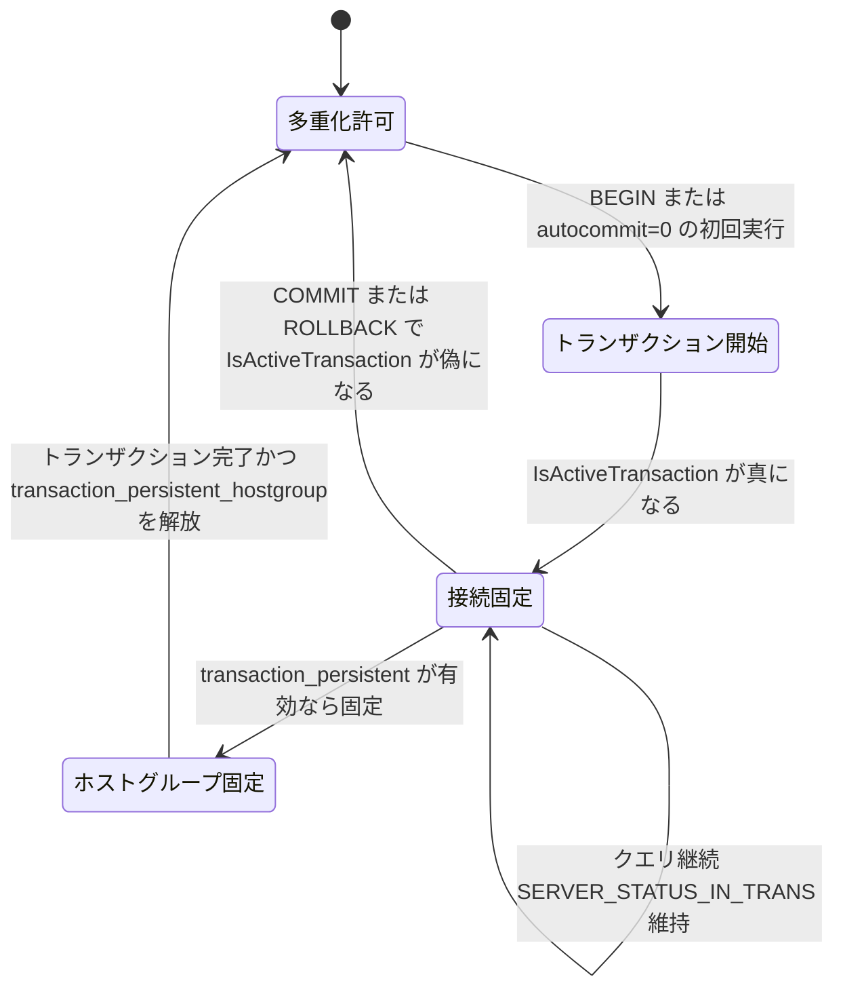

# 第16章 トランザクション境界と接続の持続性

> **本章で読むソース**
>
> - [`lib/MySQL_Session.cpp`](https://github.com/sysown/proxysql/blob/v3.0.9/lib/MySQL_Session.cpp)
> - [`lib/mysql_connection.cpp`](https://github.com/sysown/proxysql/blob/v3.0.9/lib/mysql_connection.cpp)
> - [`lib/Base_Session.cpp`](https://github.com/sysown/proxysql/blob/v3.0.9/lib/Base_Session.cpp)
> - [`lib/TransactionState.cpp`](https://github.com/sysown/proxysql/blob/v3.0.9/lib/TransactionState.cpp)
> - [`lib/MySQL_Protocol.cpp`](https://github.com/sysown/proxysql/blob/v3.0.9/lib/MySQL_Protocol.cpp)
> - [`include/Base_Session.h`](https://github.com/sysown/proxysql/blob/v3.0.9/include/Base_Session.h)

## この章の狙い

[第14章](14-connection-pool.md)で見た**多重化**は、1つのクライアント接続が1つのクエリごとにバックエンド接続を借りて返す仕組みだった。
しかし、この借用と返却をトランザクションの途中で行うと、`BEGIN` で張ったロックや `SET autocommit=0` の状態が別のバックエンド接続に引き継がれず、クライアントが意図しないデータを見てしまう。

本章では、ProxySQL がバックエンド接続のサーバーステータスフラグからトランザクション中かどうかを判定し、トランザクション中は接続をセッションに固定して多重化を止める仕組みを読む。
あわせて、トランザクションが続いている間は同じホストグループへ固定し続け、トランザクション終了とともに固定を解く `transaction_persistent` 設定を扱う。

## 前提

[第7章](../part03-session/07-session-state-machine.md)で導入した `MySQL_Session` は、テンプレートクラス `Base_Session<S,DS,B,T>` を土台に持つ。
トランザクション追跡に使う `active_transactions`、`transaction_persistent`、`transaction_persistent_hostgroup` は、この基底クラスのメンバーである。

[`include/Base_Session.h` L76-L95](https://github.com/sysown/proxysql/blob/v3.0.9/include/Base_Session.h#L76-L95)

```cpp
	unsigned int active_transactions;
	int transaction_persistent_hostgroup;
	int to_process;
	enum proxysql_session_type session_type;
	int wait_timeout; //in milliseconds

	// bool
	bool autocommit;
	bool autocommit_handled;
	bool sending_set_autocommit;
	bool killed;
	bool locked_on_hostgroup_and_all_variables_set;
	//bool admin;
	bool max_connections_reached;
	bool client_authenticated;
	bool connections_handler;
	bool mirror;
	//bool stats;
	bool schema_locked;
	bool transaction_persistent;
```

[第15章](15-backend-connection.md)で扱った `MySQL_Connection` の状態フラグ群とあわせて、本章はこの2つのクラスがどう協調してトランザクションの境界を検出するかを読む。

## サーバーステータスフラグからトランザクション状態を読み取る

MySQL プロトコルの応答パケットには `server_status` フィールドがあり、サーバー側で `SERVER_STATUS_IN_TRANS` ビットが立つとトランザクションが進行中であることを示す。
`MySQL_Connection::IsActiveTransaction()` は、このビットを主な判定材料にする。

[`lib/mysql_connection.cpp` L2643-L2666](https://github.com/sysown/proxysql/blob/v3.0.9/lib/mysql_connection.cpp#L2643-L2666)

```cpp
bool MySQL_Connection::IsActiveTransaction() {
	bool ret=false;
	if (mysql) {
		ret = (mysql->server_status & SERVER_STATUS_IN_TRANS);
		if (ret == false && (mysql)->net.last_errno && unknown_transaction_status == true) {
			ret = true;
		}
		if (ret == false) {
			//bool r = ( mysql_thread___autocommit_false_is_transaction || mysql_thread___forward_autocommit ); // deprecated , see #3253
			bool r = ( mysql_thread___autocommit_false_is_transaction);
			if ( r && (IsAutoCommit() == false) ) {
				ret = true;
			}
		}
		// in the past we were incorrectly checking STATUS_MYSQL_CONNECTION_HAS_SAVEPOINT
		// and returning true in case there were any savepoint.
		// Although flag STATUS_MYSQL_CONNECTION_HAS_SAVEPOINT was not reset in
		// case of no transaction, thus the check was incorrect.
		// We can ignore STATUS_MYSQL_CONNECTION_HAS_SAVEPOINT for multiplexing
		// purpose in IsActiveTransaction() because it is also checked
		// in MultiplexDisabled()
	}
	return ret;
}
```

判定は3段階になっている。
まず `server_status` の `SERVER_STATUS_IN_TRANS` ビットを見る。
次に、直前の応答でエラーが起き `unknown_transaction_status` が立っている場合、サーバー側の実際の状態が確認できないため安全側に倒してトランザクション中とみなす。
最後に、`mysql_thread___autocommit_false_is_transaction` が有効なら、`autocommit=0` であること自体をトランザクション中の代理指標として扱う。

これは MySQL の挙動に理由がある。
`autocommit=0` のセッションでは、明示的な `BEGIN` がなくても最初の文の実行でトランザクションが暗黙に開始する。
`SERVER_STATUS_IN_TRANS` ビットだけを見ていると、この暗黙開始を取りこぼす場合があるため、`autocommit` の状態も補助的に参照している。

`autocommit` 自体の判定は `IsAutoCommit()` が担う。

[`lib/mysql_connection.cpp` L2669-L2690](https://github.com/sysown/proxysql/blob/v3.0.9/lib/mysql_connection.cpp#L2669-L2690)

```cpp
bool MySQL_Connection::IsAutoCommit() {
	bool ret=false;
	if (mysql) {
		ret = (mysql->server_status & SERVER_STATUS_AUTOCOMMIT);
		if (ret) {
			if (options.last_set_autocommit==0) {
				// it seems we hit bug http://bugs.mysql.com/bug.php?id=66884
				// we last sent SET AUTOCOMMIT = 0 , but the server says it is 1
				// we assume that what we sent last is correct .  #873
				ret = false;
			}
		} else {
			if (options.last_set_autocommit==-1) {
				// if a connection was reset (thus last_set_autocommit==-1)
				// the information related to SERVER_STATUS_AUTOCOMMIT is lost
				// therefore we fall back on the safe assumption that autocommit==1
				ret = true;
			}
		}
	}
	return ret;
}
```

ここでも、サーバーが返す `SERVER_STATUS_AUTOCOMMIT` ビットをそのまま信用せず、ProxySQL が最後に送った `SET AUTOCOMMIT` の値（`options.last_set_autocommit`）と突き合わせている。
コメントにある MySQL 側の既知の不具合を踏まえ、サーバーの自己申告と自分が最後に送ったコマンドの両方を照合することで、単一の情報源に依存しない判定にしている。

## 多重化を止める条件

[第14章](14-connection-pool.md)で説明した多重化は、クエリ完了時にバックエンド接続をプールへ返却することで成り立つ。
ProxySQL はこの返却の直前に、必ず `IsActiveTransaction()` と `MultiplexDisabled()` の両方を確認する。
`PINGING_SERVER` 状態からの復帰処理にその典型例がある。

[`lib/MySQL_Session.cpp` L1613-L1627](https://github.com/sysown/proxysql/blob/v3.0.9/lib/MySQL_Session.cpp#L1613-L1627)

```cpp
int MySQL_Session::handler_again___status_PINGING_SERVER() {
	assert(mybe->server_myds->myconn);
	MySQL_Data_Stream *myds=mybe->server_myds;
	MySQL_Connection *myconn=myds->myconn;
	int rc=myconn->async_ping(myds->revents);
	if (rc==0) {
		myconn->async_state_machine=ASYNC_IDLE;
		myconn->compute_unknown_transaction_status();
		//if (mysql_thread___multiplexing && (myconn->reusable==true) && myds->myconn->IsActiveTransaction()==false && myds->myconn->MultiplexDisabled()==false) {
		// due to issue #2096 we disable the global check on mysql_thread___multiplexing
		if ((myconn->reusable==true) && myds->myconn->IsActiveTransaction()==false && myds->myconn->MultiplexDisabled()==false) {
			myds->return_MySQL_Connection_To_Pool();
		} else {
			myds->destroy_MySQL_Connection_From_Pool(true);
		}
```

同じ形の条件式は、`INIT_DB` の失敗処理や通常のクエリ完了処理など、接続をプールへ戻すかどうかを判断する箇所全体で繰り返し現れる。
`IsActiveTransaction()==false` が立っていない限り、`reusable==true` であっても接続はプールへ戻らず、セッションに固定されたまま次のクエリを待つ。
`MultiplexDisabled()` はトランザクション以外の理由（ユーザー変数、`LOCK TABLES`、一時テーブル、`GET_LOCK` など）で多重化を止める判定であり、`lib/mysql_connection.cpp` の `MultiplexDisabled()` L2692-L2704 で定義される。

[`lib/mysql_connection.cpp` L2692-L2704](https://github.com/sysown/proxysql/blob/v3.0.9/lib/mysql_connection.cpp#L2692-L2704)

```cpp
bool MySQL_Connection::MultiplexDisabled(bool check_delay_token) {
// status_flags stores information about the status of the connection
// can be used to determine if multiplexing can be enabled or not
	bool ret=false;
	if (status_flags & (STATUS_MYSQL_CONNECTION_USER_VARIABLE | STATUS_MYSQL_CONNECTION_PREPARED_STATEMENT |
		STATUS_MYSQL_CONNECTION_LOCK_TABLES | STATUS_MYSQL_CONNECTION_TEMPORARY_TABLE | STATUS_MYSQL_CONNECTION_GET_LOCK | STATUS_MYSQL_CONNECTION_NO_MULTIPLEX |
		STATUS_MYSQL_CONNECTION_SQL_LOG_BIN0 | STATUS_MYSQL_CONNECTION_FOUND_ROWS | STATUS_MYSQL_CONNECTION_NO_MULTIPLEX_HG |
		STATUS_MYSQL_CONNECTION_HAS_SAVEPOINT | STATUS_MYSQL_CONNECTION_HAS_WARNINGS) ) {
		ret=true;
	}
	if (check_delay_token && auto_increment_delay_token) return true;
	return ret;
}
```

トランザクションと多重化停止理由は別の関心事であるため、判定関数も分かれている。
`IsActiveTransaction()` はサーバーステータスに基づくトランザクション境界の判定であり、`MultiplexDisabled()` はセッション変数、ロック、準備済みステートメントなど、トランザクションとは無関係にバックエンド固有の状態が生じた場合の判定である。
両方を確認して初めて、接続を安全に他のセッションへ貸し出せる。

## COMMIT と ROLLBACK とホストグループの追跡

複数のバックエンド（複数のホストグループ）にまたがって同時にトランザクションが開いている場合、クライアントから届いた単一の `COMMIT` をどの接続へ転送すべきかを決める必要がある。
`FindOneActiveTransaction()` は、アクティブなトランザクションを持つ最初のバックエンドのホストグループ ID を返す。

[`lib/Base_Session.cpp` L667-L698](https://github.com/sysown/proxysql/blob/v3.0.9/lib/Base_Session.cpp#L667-L698)

```cpp
template<typename S, typename DS, typename B, typename T>
int Base_Session<S,DS,B,T>::FindOneActiveTransaction(bool check_savepoint) {
	int ret=-1;
	if (mybes==0) return ret;
	B * _mybe;
	unsigned int i;
	for (i=0; i < mybes->len; i++) {
		_mybe = (B *) mybes->index(i);
		if (_mybe->server_myds) {
			if (_mybe->server_myds->myconn) {
				if (_mybe->server_myds->myconn->IsKnownActiveTransaction()) {
					return (int)_mybe->server_myds->myconn->parent->myhgc->hid;
				} else if (_mybe->server_myds->myconn->IsActiveTransaction()) {
					ret = (int)_mybe->server_myds->myconn->parent->myhgc->hid;
				}
				else {
					if constexpr (std::is_same_v<S, MySQL_Session>) {
						// we use check_savepoint to check if we shouldn't ignore COMMIT or ROLLBACK due
						// to MySQL bug https://bugs.mysql.com/bug.php?id=107875 related to
						// SAVEPOINT and autocommit=0
						if (check_savepoint) {
							if (_mybe->server_myds->myconn->AutocommitFalse_AndSavepoint() == true) {
								return (int)_mybe->server_myds->myconn->parent->myhgc->hid;
							}
						}
					}
				}
			}
		}
	}
	return ret;
}
```

呼び出し側の `handler_CommitRollback()` は、この戻り値が `-1` かどうかでクライアントへの応答を分岐する。

[`lib/MySQL_Session.cpp` L899-L917](https://github.com/sysown/proxysql/blob/v3.0.9/lib/MySQL_Session.cpp#L899-L917)

```cpp
	int hg = FindOneActiveTransaction(true);
	if (hg != -1) {
		// there is an active transaction, we must forward the request
		current_hostgroup = hg;
		return false;
	} else {
		// there is no active transaction, we will just reply OK
		client_myds->DSS=STATE_QUERY_SENT_NET;
		uint16_t setStatus = 0;
		if (autocommit) setStatus |= SERVER_STATUS_AUTOCOMMIT;
		client_myds->myprot.generate_pkt_OK(true,NULL,NULL,1,0,0,setStatus,0,NULL);
		if (mirror==false) {
			RequestEnd(NULL);
		} else {
			client_myds->DSS=STATE_SLEEP;
			status=WAITING_CLIENT_DATA;
		}
		l_free(pkt->size,pkt->ptr);
```

アクティブなトランザクションが1つも見つからなければ、`COMMIT` や `ROLLBACK` をどのバックエンドにも転送せず、ProxySQL がその場で `OK` パケットを生成して返す。
バックエンドへ問い合わせる必要がないコマンドをサーバーへ送らないことで、往復を1回減らしている。

## transaction_persistent によるホストグループの固定

ここまでの仕組みは、1つのクエリが実行されるバックエンドを、トランザクションが続く間だけ固定するものだった。
`transaction_persistent` は、この固定をホストグループのルーティングにも及ぼす仕組みで、トランザクションが続いている間はクエリルールが指す宛先ホストグループの変更を無視し、同じホストグループへ固定し続ける。
これを制御するのが `mysql_users` テーブルのユーザー属性 `transaction_persistent`（デフォルト値は1）である。

[`lib/MySQL_Protocol.cpp` L1461-L1465](https://github.com/sysown/proxysql/blob/v3.0.9/lib/MySQL_Protocol.cpp#L1461-L1465)

```cpp
		account_details = GloMyAuth->lookup((char *)user, USERNAME_FRONTEND, dup_details);
	}
	// FIXME: add support for default schema and fast forward, see issue #255 and #256
	(*myds)->sess->default_hostgroup=account_details.default_hostgroup;
	(*myds)->sess->transaction_persistent=account_details.transaction_persistent;
```

ログイン認証の完了時に、ユーザーごとの設定値が `MySQL_Session::transaction_persistent` へコピーされる。
この値そのものは真偽値の設定にすぎず、実際にホストグループを固定するかどうかの判断は `transaction_persistent_hostgroup` という別のメンバーが担う。
`-1` は「固定していない」、`-1` 以外はそのホストグループ ID に固定中であることを表す。

固定の付け外しは、クエリ応答の受信直後に呼ばれる箇所にまとまっている。

[`lib/MySQL_Session.cpp` L8571-L8587](https://github.com/sysown/proxysql/blob/v3.0.9/lib/MySQL_Session.cpp#L8571-L8587)

```cpp
					} else {
						myconn->multiplex_delayed=false;
						myconn->compute_unknown_transaction_status();
						myconn->async_state_machine=ASYNC_IDLE;
						myds->DSS=STATE_MARIADB_GENERIC;
						if (transaction_persistent==true) {
							if (transaction_persistent_hostgroup==-1) { // change only if not set already, do not allow to change it again
								if (myds->myconn->IsActiveTransaction()==true) { // only active transaction is important here. Ignore other criterias
									transaction_persistent_hostgroup=current_hostgroup;
								}
							} else {
								if (myds->myconn->IsActiveTransaction()==false) { // a transaction just completed
									transaction_persistent_hostgroup=-1;
								}
							}
						}
					}
```

この処理は、`TransactionState.cpp` の純粋関数 `update_transaction_persistent_hostgroup()` が表す状態遷移そのものである。
両者を読み比べると、`MySQL_Session.cpp` 側は接続オブジェクトから値を読み出す手続きであり、`TransactionState.cpp` 側はその手続きから I/O を取り除いた純粋なロジックであることがわかる。

[`lib/TransactionState.cpp` L11-L34](https://github.com/sysown/proxysql/blob/v3.0.9/lib/TransactionState.cpp#L11-L34)

```cpp
int update_transaction_persistent_hostgroup(
	bool transaction_persistent,
	int transaction_persistent_hostgroup,
	int current_hostgroup,
	bool backend_in_transaction)
{
	if (!transaction_persistent) {
		return -1;  // persistence disabled
	}

	if (transaction_persistent_hostgroup == -1) {
		// Not currently locked — lock if transaction just started
		if (backend_in_transaction) {
			return current_hostgroup;
		}
	} else {
		// Currently locked — unlock if transaction just ended
		if (!backend_in_transaction) {
			return -1;
		}
	}

	return transaction_persistent_hostgroup;  // no change
}
```

固定されているあいだ、クエリルールが指す宛先ホストグループやクエリキャッシュの参照先ホストグループの変更は無効化される。
`destination_hostgroup` によるルーティングの上書きを扱う箇所にその条件が現れる。

[`lib/MySQL_Session.cpp` L7553-L7559](https://github.com/sysown/proxysql/blob/v3.0.9/lib/MySQL_Session.cpp#L7553-L7559)

```cpp
	if ( qpo->next_query_flagIN >= 0 ) {
		next_query_flagIN=qpo->next_query_flagIN;
	}
	if ( qpo->destination_hostgroup >= 0 ) {
		if (transaction_persistent_hostgroup == -1) {
			current_hostgroup=qpo->destination_hostgroup;
		}
	}
```

`transaction_persistent_hostgroup` が固定中（`-1` 以外）であれば、クエリルールが別のホストグループを指定していても無視され、固定された `current_hostgroup` のまま進む。
これにより、トランザクション中の後続クエリがクエリルールの都合で別のホストグループへ流れ、開始したトランザクションとは別のバックエンドへ送られてしまう事態を避けている。
固定はトランザクションが続いている間だけであり、`COMMIT` や `ROLLBACK` の応答後に発行される次のクエリには及ばない。
コミット直後の読み取りを書き込み済みのレプリカへ導く因果整合性は、別の機構である GTID トラッキング（第19章）が担う。

## トランザクション境界に沿った状態遷移

サーバーステータスの変化を起点に、接続の固定と解放がどう連動するかを整理する。



「接続固定」の状態にある限り、クエリ完了時の返却処理（`return_MySQL_Connection_To_Pool()`）は呼ばれず、同じセッションが同じバックエンド接続を使い続ける。
「ホストグループ固定」は `transaction_persistent` が有効なユーザーに限り、トランザクションが続いている間だけクエリルーティングの宛先を固定し、トランザクションが終わると `-1` に戻って固定は解ける。

## 最適化の工夫

多重化を常に止めてしまえば実装は単純になるが、それでは1クライアントにつき1バックエンド接続が固定され、ProxySQL がバックエンド接続数を絞り込む効果が失われる。
ProxySQL は `IsActiveTransaction()` と `MultiplexDisabled()` の両方が偽であるクエリ完了時にだけ接続をプールへ返すことで、トランザクション外の短いクエリでは少数の接続を大量のクライアントで使い回しつつ、トランザクション中は接続の同一性を保証するという相反する要求を両立させている。
サーバーステータスフラグという、応答パケットに元々含まれる情報を判定材料に使っているため、トランザクション追跡のために追加の問い合わせをバックエンドへ送る必要がない。

## まとめ

ProxySQL は、バックエンドの応答に含まれる `SERVER_STATUS_IN_TRANS` ビットと `autocommit` の状態から `IsActiveTransaction()` を判定し、トランザクション中は接続をプールへ返さずセッションに固定する。
`COMMIT` や `ROLLBACK` は `FindOneActiveTransaction()` でアクティブなバックエンドを探して転送し、アクティブなトランザクションがなければ ProxySQL がその場で応答する。
`transaction_persistent` が有効なユーザーでは、トランザクションが続いている間はホストグループへの固定が維持され、クエリルールによる宛先の上書きが無効化される。
固定はトランザクションの終了とともに解け、`transaction_persistent_hostgroup` は `-1` に戻る。
これらはすべて、トランザクション外でのみ多重化を許可することで、接続数を抑えながら正当性を保つという1つの機構に集約される。

## 関連する章

- [第7章 セッションの状態機械](../part03-session/07-session-state-machine.md)
- [第14章 コネクションプール](14-connection-pool.md)
- [第15章 バックエンド接続の状態](15-backend-connection.md)
