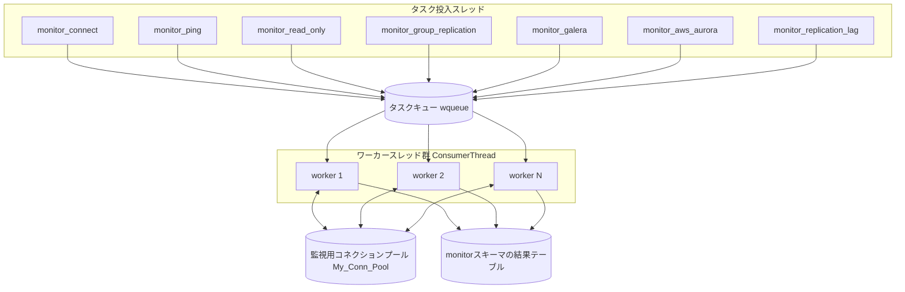

# 第17章 MySQL Monitor によるヘルスチェック

> **本章で読むソース**
>
> - [`lib/MySQL_Monitor.cpp`](https://github.com/sysown/proxysql/blob/v3.0.9/lib/MySQL_Monitor.cpp)
> - [`include/MySQL_Monitor.hpp`](https://github.com/sysown/proxysql/blob/v3.0.9/include/MySQL_Monitor.hpp)
> - [`include/wqueue.h`](https://github.com/sysown/proxysql/blob/v3.0.9/include/wqueue.h)

## この章の狙い

第13章で見た `MySrvC` の状態（`ONLINE`、`SHUNNED` など）は、誰かが定期的にバックエンドへ接続してその応答を確認しなければ更新されない。

この役目を担うのが**Monitor**であり、実体は `MySQL_Monitor` クラスと、そこから生成される複数のスレッドである。

本章では、Monitor がどのようなスレッド構成で動き、チェックのタスクをどう並列に実行し、その結果をどこに記録するかを扱う。

## 前提

Monitor は ProxySQL の起動時に1つだけ生成されるグローバルなインスタンス `GloMyMon` として動作し、`MySQL_Monitor::run()` が最上位のスレッド関数になる。

チェックの種類ごとに異なるスレッドが立ち上がるが、実際に1件ずつサーバーへ接続してチェックを実行する部分は、種類によらず共通のワーカースレッド群（後述）に委譲される。

read_only チェックとレプリケーション遅延チェックが `MySrvC` の状態をどう書き換えるかの詳細は第18章で扱う。

GTID を使った整合性リードの監視は第19章で扱う。

## Monitor のスレッド構成

`MySQL_Monitor::run()` は、チェックの種類ごとに専用のスレッドを1本ずつ立ち上げる。

[`lib/MySQL_Monitor.cpp` L4987-L5043](https://github.com/sysown/proxysql/blob/v3.0.9/lib/MySQL_Monitor.cpp#L4987-L5043)

```cpp
	ConsumerThread<MySQL_Monitor_State_Data> **threads= (ConsumerThread<MySQL_Monitor_State_Data> **)malloc(sizeof(ConsumerThread<MySQL_Monitor_State_Data> *)*num_threads);
	for (unsigned int i=0;i<num_threads; i++) {
		threads[i] = new ConsumerThread<MySQL_Monitor_State_Data>(*queue, 0, "MyMonStateData");
		threads[i]->start(2048,false);
	}
	started_threads += num_threads;
	this->metrics.p_counter_array[p_mon_counter::mysql_monitor_workers_started]->Increment(num_threads);

	pthread_t monitor_connect_thread;
	if (pthread_create(&monitor_connect_thread, &attr, &monitor_connect_pthread,NULL) != 0) {
		// LCOV_EXCL_START
		proxy_error("Thread creation\n");
		assert(0);
		// LCOV_EXCL_STOP
	}
	pthread_t monitor_ping_thread;
	if (pthread_create(&monitor_ping_thread, &attr, &monitor_ping_pthread,NULL) != 0) {
		// LCOV_EXCL_START
		proxy_error("Thread creation\n");
		assert(0);
		// LCOV_EXCL_STOP
	}
	pthread_t monitor_read_only_thread;
	if (pthread_create(&monitor_read_only_thread, &attr, &monitor_read_only_pthread,NULL) != 0) {
		// LCOV_EXCL_START
		proxy_error("Thread creation\n");
		assert(0);
		// LCOV_EXCL_STOP
	}
	pthread_t monitor_group_replication_thread;
	if (pthread_create(&monitor_group_replication_thread, &attr, &monitor_group_replication_pthread,NULL) != 0) {
		// LCOV_EXCL_START
		proxy_error("Thread creation\n");
		assert(0);
		// LCOV_EXCL_STOP
	}
	pthread_t monitor_galera_thread;
	if (pthread_create(&monitor_galera_thread, &attr, &monitor_galera_pthread,NULL) != 0) {
		// LCOV_EXCL_START
		proxy_error("Thread creation\n");
		assert(0);
		// LCOV_EXCL_STOP
	}
	pthread_t monitor_aws_aurora_thread;
	if (pthread_create(&monitor_aws_aurora_thread, &attr, &monitor_aws_aurora_pthread,NULL) != 0) {
		// LCOV_EXCL_START
		proxy_error("Thread creation\n");
		assert(0);
		// LCOV_EXCL_STOP
	}
	pthread_t monitor_replication_lag_thread;
	if (pthread_create(&monitor_replication_lag_thread, &attr, &monitor_replication_lag_pthread,NULL) != 0) {
		// LCOV_EXCL_START
		proxy_error("Thread creation\n");
		assert(0);
		// LCOV_EXCL_STOP
	}
```

`monitor_connect`、`monitor_ping`、`monitor_read_only`、`monitor_group_replication`、`monitor_galera`、`monitor_aws_aurora`、`monitor_replication_lag` の7本が、それぞれ独立したループとして動く。

これらのスレッドはいずれも「チェック対象のサーバー一覧を取得し、チェックのタスクを作って投げる」だけの役目であり、実際にサーバーへ接続してチェックを実行する処理はここでは行わない。

その実行を担うのが、`threads` という配列で管理されるワーカースレッド群 `ConsumerThread` であり、`num_threads` 本（初期値2本）が起動時にあらかじめ用意される。

`run()` は自身もループを回り続け、`monitor_threads_min`、`monitor_threads_max` などの設定変数に応じてワーカースレッドの本数を増減させる。

[`lib/MySQL_Monitor.cpp` L5068-L5120](https://github.com/sysown/proxysql/blob/v3.0.9/lib/MySQL_Monitor.cpp#L5068-L5120)

```cpp
		if ( rand()%10 == 0) { // purge once in a while
			My_Conn_Pool->purge_some_connections();
		}
		usleep(200000);
		unsigned int qsize=queue->size();
		if (qsize > (unsigned int)mysql_thread___monitor_threads_queue_maxsize/4) {
			proxy_warning("Monitor queue too big: %d\n", qsize);
			unsigned int threads_max = (unsigned int)mysql_thread___monitor_threads_max;
			if (threads_max > num_threads) {
				unsigned int new_threads = threads_max - num_threads;
				if ((qsize / 4) < new_threads) {
					new_threads = qsize/4; // try to not burst threads
				}
				if (new_threads) {
					unsigned int old_num_threads = num_threads;
					num_threads += new_threads;
					this->metrics.p_gauge_array[p_mon_gauge::mysql_monitor_workers]->Increment(new_threads);
					threads= (ConsumerThread<MySQL_Monitor_State_Data> **)realloc(threads, sizeof(ConsumerThread<MySQL_Monitor_State_Data> *)*num_threads);
					started_threads += new_threads;
					for (unsigned int i = old_num_threads ; i < num_threads ; i++) {
						threads[i] = new ConsumerThread<MySQL_Monitor_State_Data>(*queue, 0, "MyMonStateData");
						threads[i]->start(2048,false);
					}
				}
			}
			// check again. Do we need also aux threads?
			usleep(50000);
			qsize=queue->size();
			if (qsize > (unsigned int)mysql_thread___monitor_threads_queue_maxsize) {
				qsize=qsize/50;
				unsigned int threads_max = (unsigned int)mysql_thread___monitor_threads_max;
				if ((qsize + num_threads) > (threads_max * 2)) { // allow a small bursts
					qsize = threads_max * 2 - num_threads;
				}
				if (qsize > 0) {
					proxy_info("Monitor is starting %d helper threads\n", qsize);
					ConsumerThread<MySQL_Monitor_State_Data> **threads_aux= (ConsumerThread<MySQL_Monitor_State_Data> **)malloc(sizeof(ConsumerThread<MySQL_Monitor_State_Data> *)*qsize);
					aux_threads = qsize;
					started_threads += aux_threads;
					for (unsigned int i=0; i<qsize; i++) {
						threads_aux[i] = new ConsumerThread<MySQL_Monitor_State_Data>(*queue, 245, "MyMonStateData");
						threads_aux[i]->start(2048,false);
					}
					for (unsigned int i=0; i<qsize; i++) {
						threads_aux[i]->join();
						delete threads_aux[i];
					}
					free(threads_aux);
					aux_threads = 0;
				}
			}
		}
```

タスクキュー（`queue`）に溜まっているタスクの数がしきい値 `monitor_threads_queue_maxsize` を超えたら、まずワーカースレッドを `monitor_threads_max` まで恒久的に増やす。

それでも溜まりが解消しない場合は、キューのサイズに応じた本数の一時的な補助スレッド（`aux_threads`）をその場で立てて、キューが空になるまで動かしてから畳む。

監視対象のサーバー数が急に増えたり、応答が遅いサーバーが混じってキューが滞留したりしても、恒久増員と一時的な補充の二段構えでチェックの遅延を抑える仕組みになっている。

全体の構成を図にすると次のようになる。



## タスクキューによる並列実行

チェックの種類ごとにスレッドを1本ずつ立てるだけなら、大量のサーバーを監視するときにそのスレッドがサーバー数だけ順番に接続を試みることになり、1台の応答が遅いだけで後続のチェックがすべて遅延する。

ProxySQL はこれを避けるため、チェックの種類を問わず共通のタスクキュー `wqueue<WorkItem<MySQL_Monitor_State_Data>*>` と、そこから1件ずつ取り出して実行するワーカースレッド `ConsumerThread` の組で、実際のチェックを並列化している。

冒頭のコメントにもこの設計変更の経緯が残っている。

[`lib/MySQL_Monitor.cpp` L1-L9](https://github.com/sysown/proxysql/blob/v3.0.9/lib/MySQL_Monitor.cpp#L1-L9)

```cpp
/*
	RECENT CHANGELOG
	1.2.0723
		* almost completely rewritten
		* use of blocking call for new connections
    * use of Thread Pool instead of a thread per check type
	0.2.0902
		* original implementation
*/
```

`wqueue` はミューテックスと条件変数で保護された単純なFIFOキューであり、`add()` でタスクを積み、`remove()` でタスクがなければブロックしながら1件取り出す。

[`include/wqueue.h` L32-L69](https://github.com/sysown/proxysql/blob/v3.0.9/include/wqueue.h#L32-L69)

```cpp
template <typename T> class wqueue
{
    list<T>          m_queue;
    pthread_mutex_t  m_mutex;
    pthread_cond_t   m_condv; 

  public:
    wqueue() {
        pthread_mutex_init(&m_mutex, NULL);
        pthread_cond_init(&m_condv, NULL);
    }
    ~wqueue() {
        pthread_mutex_destroy(&m_mutex);
        pthread_cond_destroy(&m_condv);
    }
    void add(T item) {
        pthread_mutex_lock(&m_mutex);
        m_queue.push_back(item);
        pthread_cond_signal(&m_condv);
        pthread_mutex_unlock(&m_mutex);
    }
    T remove() {
        pthread_mutex_lock(&m_mutex);
        while (m_queue.size() == 0) {
            pthread_cond_wait(&m_condv, &m_mutex);
        }
        T item = m_queue.front();
        m_queue.pop_front();
        pthread_mutex_unlock(&m_mutex);
        return item;
    }
    int size() {
        pthread_mutex_lock(&m_mutex);
        int size = m_queue.size();
        pthread_mutex_unlock(&m_mutex);
        return size;
    }
};
```

キューに積まれる1件のタスクは `WorkItem<MySQL_Monitor_State_Data>` であり、チェック対象のサーバー情報（`MySQL_Monitor_State_Data`）と、それを処理する関数ポインタ `start_routine` を1組にまとめたものである。

ワーカースレッド本体の `ConsumerThread::run()` は、キューから1件取り出しては `start_routine` を呼ぶだけの単純なループになっている。

[`lib/MySQL_Monitor.cpp` L117-L159](https://github.com/sysown/proxysql/blob/v3.0.9/lib/MySQL_Monitor.cpp#L117-L159)

```cpp
	void* run() {
		set_thread_name(thr_name, GloVars.set_thread_name);
		// Remove 1 item at a time and process it. Blocks if no items are
		// available to process.
		for (int i = 0; (thrn ? i < thrn : 1); i++) {
			//VALGRIND_DISABLE_ERROR_REPORTING;
			WorkItem<T>* item = static_cast<WorkItem<T>*>(m_queue.remove());
			//VALGRIND_ENABLE_ERROR_REPORTING;
			if (item == NULL) {
				if (thrn) {
					// we took a NULL item that wasn't meant to reach here! Add it again
					WorkItem<T>* item = NULL;
					m_queue.add(item);
				}
				// this is intentional to EXIT immediately
				goto cleanup;
			}


			if (item->start_routine) { // NULL is allowed, do nothing for it
				bool me = true;

				if (check_monitor_enabled_flag) {
					pthread_mutex_lock(&GloMyMon->mon_en_mutex);
					me = GloMyMon->monitor_enabled;
					pthread_mutex_unlock(&GloMyMon->mon_en_mutex);
				}

				if (me) {
					item->start_routine(item->data);
				}
			}
			for (auto ptr : item->data) {
				delete ptr;
			}
			item->data.clear();
			delete item;
		}
cleanup:
		// De-initializes per-thread structures. Required in all auxiliary threads using MySQL and SSL.
		mysql_thread_end();
		return NULL;
	}
```

`item` が `NULL` のときは終了シグナルとして扱い、ループを抜ける。

`run()` がシャットダウン時にワーカースレッドの本数分だけ `NULL` の `WorkItem` をキューに積んでから `join()` している（前掲の全体構成の節を参照）のは、この終了シグナルを各スレッドに1つずつ届けるためである。

connect check の producer である `monitor_connect()` は、監視対象のサーバーを1台ずつ `MON_CONNECT` タスクとしてキューへ積む。

[`lib/MySQL_Monitor.cpp` L3066-L3079](https://github.com/sysown/proxysql/blob/v3.0.9/lib/MySQL_Monitor.cpp#L3066-L3079)

```cpp
			for (std::vector<SQLite3_row *>::iterator it = resultset->rows.begin() ; it != resultset->rows.end(); ++it) {
				SQLite3_row *r=*it;
				bool rc_ping = true;
				rc_ping = server_responds_to_ping(r->fields[0],atoi(r->fields[1]));
				if (rc_ping) { // only if server is responding to pings
					MySQL_Monitor_State_Data *mmsd=new MySQL_Monitor_State_Data(MON_CONNECT, r->fields[0],atoi(r->fields[1]), atoi(r->fields[2]));
					mmsd->mondb=monitordb;
					WorkItem<MySQL_Monitor_State_Data>* item;
					item=new WorkItem<MySQL_Monitor_State_Data>(mmsd,monitor_connect_thread);
					GloMyMon->queue->add(item);
					usleep(us);
				}
				if (GloMyMon->shutdown) return NULL;
			}
```

サーバー数に応じて算出した `us` マイクロ秒だけ1件ごとに `usleep` を挟んでいるのは、監視対象が多いときに全サーバーへの接続タスクを一瞬でキューへ積み切ってしまい、ワーカースレッドとバックエンド側へ負荷が集中するのを避けるためである。

## connect check とコネクションの使い捨て

`monitor_connect_thread` がキューから取り出されたあとに実際に呼ばれる関数であり、`MySQL_Monitor_State_Data::create_new_connection()` で新規にTCP接続を張り、認証まで済ませてから即座に切断する。

[`lib/MySQL_Monitor.cpp` L1361-L1422](https://github.com/sysown/proxysql/blob/v3.0.9/lib/MySQL_Monitor.cpp#L1361-L1422)

```cpp
void * monitor_connect_thread(const std::vector<MySQL_Monitor_State_Data*>& mmsds) {
	assert(!mmsds.empty());
	mysql_close(mysql_init(NULL));
	MySQL_Monitor_State_Data *mmsd = mmsds.front();
	// Wait for GloMTH to be initialized
	// Wait for GloMTH to be initialized
	if (!wait_for_glo_mth()) return NULL;	// quick exit during shutdown/restart
	MySQL_Thread * mysql_thr = new MySQL_Thread();
	mysql_thr->curtime=monotonic_time();
	mysql_thr->refresh_variables();

	bool connect_success = false;
	mmsd->create_new_connection();

	unsigned long long start_time=mysql_thr->curtime;
	mmsd->t1=start_time;
	mmsd->t2=monotonic_time();

	char *query=NULL;
	query=(char *)"INSERT OR REPLACE INTO mysql_server_connect_log VALUES (?1 , ?2 , ?3 , ?4 , ?5)";
	auto [rc1, statement_unique] = mmsd->mondb->prepare_v2(query);
	ASSERT_SQLITE_OK(rc1, mmsd->mondb);
	sqlite3_stmt *statement = statement_unique.get();
	int rc;
	rc=(*proxy_sqlite3_bind_text)(statement, 1, mmsd->hostname, -1, SQLITE_TRANSIENT); ASSERT_SQLITE_OK(rc, mmsd->mondb);
	rc=(*proxy_sqlite3_bind_int)(statement, 2, mmsd->port); ASSERT_SQLITE_OK(rc, mmsd->mondb);
	unsigned long long time_now=realtime_time();
	time_now=time_now-(mmsd->t2 - start_time);
	rc=(*proxy_sqlite3_bind_int64)(statement, 3, time_now); ASSERT_SQLITE_OK(rc, mmsd->mondb);
	rc=(*proxy_sqlite3_bind_int64)(statement, 4, (mmsd->mysql_error_msg ? 0 : mmsd->t2-mmsd->t1)); ASSERT_SQLITE_OK(rc, mmsd->mondb);
	rc=(*proxy_sqlite3_bind_text)(statement, 5, mmsd->mysql_error_msg, -1, SQLITE_TRANSIENT); ASSERT_SQLITE_OK(rc, mmsd->mondb);
	SAFE_SQLITE3_STEP2(statement);
	rc=(*proxy_sqlite3_clear_bindings)(statement); ASSERT_SQLITE_OK(rc, mmsd->mondb);
	rc=(*proxy_sqlite3_reset)(statement); ASSERT_SQLITE_OK(rc, mmsd->mondb);
	if (mmsd->mysql_error_msg) {
		if (
			(strncmp(mmsd->mysql_error_msg,"Access denied for user",strlen("Access denied for user"))==0)
			||
			(strncmp(mmsd->mysql_error_msg,"ProxySQL Error: Access denied for user",strlen("ProxySQL Error: Access denied for user"))==0)
		) {
			proxy_error("Server %s:%d is returning \"Access denied\" for monitoring user\n", mmsd->hostname, mmsd->port);
		}
		else if (strncmp(mmsd->mysql_error_msg,"Your password has expired.",strlen("Your password has expired."))==0)
		{
			proxy_error("Server %s:%d is returning \"Your password has expired.\" for monitoring user\n", mmsd->hostname, mmsd->port);
		}
		MyHGM->p_update_mysql_error_counter(p_mysql_error_type::proxysql, mmsd->hostgroup_id, mmsd->hostname, mmsd->port, mysql_errno(mmsd->mysql));
	} else {
		connect_success = true;
	}
	if (mmsd->mysql) {
		mysql_close(mmsd->mysql);
		mmsd->mysql=NULL;
	}
	if (connect_success) {
		__sync_fetch_and_add(&GloMyMon->connect_check_OK,1);
	} else {
		__sync_fetch_and_add(&GloMyMon->connect_check_ERR,1);
	}
	delete mysql_thr;
	return NULL;
}
```

connect check は「一から接続できるか」だけを見る検査であり、接続とログイン処理そのものにかかる時間を測るため、成功、失敗にかかわらず最後に必ず `mysql_close()` している。

一方、ping check、read_only check、レプリケーション遅延チェックのように何度も繰り返し実行するチェックでは、その都度あらためて接続を張り直すコストが無視できない。

その負担を避けるための仕組みが、次に見る監視専用コネクションプールである。

## 監視専用コネクションの再利用

Monitor は、セッションが使うバックエンドのコネクションプール（第14章）とは別に、監視専用のコネクションプール `MySQL_Monitor_Connection_Pool` を1つ持つ。

[`lib/MySQL_Monitor.cpp` L234-L248](https://github.com/sysown/proxysql/blob/v3.0.9/lib/MySQL_Monitor.cpp#L234-L248)

```cpp
class MySQL_Monitor_Connection_Pool {
private:
	std::mutex mutex;
#ifdef DEBUG
	pthread_mutex_t m2;
	PtrArray *conns;
#endif // DEBUG
//	std::map<std::pair<std::string, int>, std::vector<MYSQL*> > my_connections;
	std::unique_ptr<PtrArray> servers;
public:
	MYSQL * get_connection(char *hostname, int port, MySQL_Monitor_State_Data *mmsd);
	void put_connection(char *hostname, MySQL_Monitor_State_Data* mmsd);
	void purge_some_connections();
	void purge_all_connections();
	void destroy_mysql_connection(MySQL_Monitor_State_Data* mmsd);
```

内部は `servers` という配列で、ホスト名とポートごとに `MonMySrvC` （待機中の `MYSQL*` の集まり）を1つ持つだけの単純な構造である。

チェックを実行する側は、まず `get_connection()` で使い回せる接続がないか探す。

[`lib/MySQL_Monitor.cpp` L352-L418](https://github.com/sysown/proxysql/blob/v3.0.9/lib/MySQL_Monitor.cpp#L352-L418)

```cpp
MYSQL * MySQL_Monitor_Connection_Pool::get_connection(char *hostname, int port, MySQL_Monitor_State_Data *mmsd) {
	std::lock_guard<std::mutex> lock(mutex);
	MYSQL *my = NULL;
	unsigned long long now = monotonic_time();
	for (unsigned int i=0; i<servers->len; i++) {
		MonMySrvC *srv = (MonMySrvC *)servers->index(i);
		if (srv->port == port && strcmp(hostname,srv->address)==0) {
			if (srv->conns->len) {
				// ... (中略：DEBUGビルド専用の重複チェックとassert) ...
				while (srv->conns->len) {
					unsigned int idx = rand() % srv->conns->len;
					MYSQL* mysql = (MYSQL*)srv->conns->remove_index_fast(idx);

					if (!mysql) continue;

					// close connection if not used for a while
					unsigned long long then = *(unsigned long long*)mysql->net.buff;
					if (now > (then + mysql_thread___monitor_ping_interval * 1000 * 10)) {
						MySQL_Monitor_State_Data* mmsd = new MySQL_Monitor_State_Data(MON_CLOSE_CONNECTION, (char*)"", 0, false);
						mmsd->mysql = mysql;
						GloMyMon->queue->add(new WorkItem<MySQL_Monitor_State_Data>(mmsd, NULL));
						continue;
					}
					my = mysql;
					break;
				}
				// ... (中略：DEBUGビルド専用の登録処理) ...
			}
			return my;
		}
	}
	return my;
}
```

対象のホスト名とポートに一致する `MonMySrvC` が見つかれば、そこに待機中の接続があるかを見る。

接続を最後に `put_connection()` した時刻は `MYSQL` 構造体の未使用領域である `net.buff` の先頭8バイトに直接書き込んで流用しており、これを読み出して ping check の間隔の10倍以上放置された接続だけを間引く。

放置期間が長すぎる接続は、いきなり `mysql_close()` せずに `MON_CLOSE_CONNECTION` タスクとしてキューへ回し、ワーカースレッド側で切断させている。

これは Monitor の producer スレッド（`get_connection` を呼ぶ側）がソケットのクローズ処理で長時間ブロックしないようにするためである。

チェックが成功すると、接続は `put_connection()` で同じプールへ戻される。

[`lib/MySQL_Monitor.cpp` L420-L471](https://github.com/sysown/proxysql/blob/v3.0.9/lib/MySQL_Monitor.cpp#L420-L471)

```cpp
void MySQL_Monitor_Connection_Pool::put_connection(char* hostname, MySQL_Monitor_State_Data* mmsd) {
	
	if (!mmsd->mysql) return;
	
	unsigned long long now = monotonic_time();
	int port = mmsd->port;
	MYSQL* my = mmsd->mysql;

	std::lock_guard<std::mutex> lock(mutex);

	* reinterpret_cast<unsigned long long*>(my->net.buff) = now;
	MonMySrvC* targetSrv = nullptr;

	for (unsigned int i = 0; i < servers->len; ++i) {
		auto* srv = static_cast<MonMySrvC*>(servers->index(i));
		if (srv->port == port && strcmp(hostname, srv->address) == 0) {
			targetSrv = srv;
			break;
		}
	}

	if (!targetSrv) {
		targetSrv = new MonMySrvC(hostname, port);
		servers->add(targetSrv);
	}

	targetSrv->conns->add(my);

	// ... (中略：DEBUGビルド専用の登録解除処理) ...
	mmsd->mysql = NULL;
}
```

ping check の実行本体 `monitor_ping_thread` は、この `get_connection`／`put_connection` の対を実際に使う例である。

[`lib/MySQL_Monitor.cpp` L1434-L1484](https://github.com/sysown/proxysql/blob/v3.0.9/lib/MySQL_Monitor.cpp#L1434-L1484)

```cpp
	bool ping_success = false;
	mmsd->mysql=GloMyMon->My_Conn_Pool->get_connection(mmsd->hostname, mmsd->port, mmsd);
	unsigned long long start_time=mysql_thr->curtime;

	mmsd->t1=start_time;
	bool crc=false;
	if (mmsd->mysql==NULL) { // we don't have a connection, let's create it
		bool rc;
		rc=mmsd->create_new_connection();
		if (mmsd->mysql) {
			GloMyMon->My_Conn_Pool->conn_register(mmsd);
		}
		crc=true;
		if (rc==false) {
			goto __exit_monitor_ping_thread;
		}
	} else {
		//GloMyMon->My_Conn_Pool->conn_register(mmsd);
	}

	mmsd->t1=monotonic_time();
	//async_exit_status=mysql_change_user_start(&ret_bool, mysql,"msandbox2","msandbox2","information_schema");
	mmsd->interr=0; // reset the value
	mmsd->async_exit_status=mysql_ping_start(&mmsd->interr,mmsd->mysql);
	while (mmsd->async_exit_status) {
		mmsd->async_exit_status=wait_for_mysql(mmsd->mysql, mmsd->async_exit_status);
#ifdef DEBUG
		const unsigned long long now = (GloMyMon->proxytest_forced_timeout == false) ? monotonic_time() : ULLONG_MAX;
#else
		const unsigned long long now = monotonic_time();
#endif
		if (now > mmsd->t1 + mysql_thread___monitor_ping_timeout * 1000) {
			mmsd->mysql_error_msg=strdup("timeout during ping");
			goto __exit_monitor_ping_thread;
		}
		if (GloMyMon->shutdown==true) {
			goto __fast_exit_monitor_ping_thread;	// exit immediately
		}
		if ((mmsd->async_exit_status & MYSQL_WAIT_TIMEOUT) == 0) {
			mmsd->async_exit_status=mysql_ping_cont(&mmsd->interr, mmsd->mysql, mmsd->async_exit_status);
		}
	}
	if (mmsd->interr) { // ping failed
		mmsd->mysql_error_msg=strdup(mysql_error(mmsd->mysql));
		MyHGM->p_update_mysql_error_counter(p_mysql_error_type::proxysql, mmsd->hostgroup_id, mmsd->hostname, mmsd->port, mysql_errno(mmsd->mysql));
	} else {
		if (crc==false) {
			GloMyMon->My_Conn_Pool->put_connection(mmsd->hostname, mmsd);
		}
	}
```

プールに既存の接続があれば `get_connection()` でそれを取り出し、なければ `create_new_connection()` で新規に張ってから ping を送る。

`ping` が成功し、かつ今回新規に張った接続でなければ（`crc==false`）、そのまま `put_connection()` でプールへ返却する。

TCP接続の確立と MySQL の認証ハンドシェイクは、1回の `mysql_ping()` に比べてはるかにコストが高いラウンドトリップである。

ping check や read_only check のように数秒おきに繰り返すチェックで毎回この接続確立をやり直すと、チェック本体のコストよりも接続確立のコストのほうが支配的になってしまう。

Monitor はセッション用とは別に監視専用のコネクションプールを1つ持ち、チェックの種類を問わずホスト名とポートをキーにして接続を共有して使い回すことで、繰り返しチェックにかかる実質的なコストを ping や `SELECT` 文1回分にまで落としている。

放置された接続だけを間引く仕組みと合わせることで、稼働中のサーバーに対してはハンドシェイクの回数を最小限に抑えつつ、使われなくなった接続を無制限に溜め込まない構成になっている。

## 各種チェックの概観

Monitor が実行するチェックにはいくつかの種類があり、`MySQL_Monitor_State_Data_Task_Type` として区別される。

[`include/MySQL_Monitor.hpp` L194-L208](https://github.com/sysown/proxysql/blob/v3.0.9/include/MySQL_Monitor.hpp#L194-L208)

```cpp
enum MySQL_Monitor_State_Data_Task_Type {
	MON_CLOSE_CONNECTION,
	MON_CONNECT,
	MON_PING,
	MON_READ_ONLY,
	MON_INNODB_READ_ONLY,
	MON_READ_ONLY__AND__INNODB_READ_ONLY,
	MON_READ_ONLY__OR__INNODB_READ_ONLY,
	MON_SUPER_READ_ONLY,
	MON_GROUP_REPLICATION,
	MON_REPLICATION_LAG,
	MON_GALERA,
	MON_AWS_AURORA,
	MON_READ_ONLY__AND__AWS_RDS_TOPOLOGY_DISCOVERY
};
```

**connect check**（`MON_CONNECT`）は、前節で見たとおり新規接続と認証だけを試し、直後に切断する。

**ping check**（`MON_PING`）は、既存の接続を使い回しながら `mysql_ping()` を送り、応答があるかどうかを見る。

**read_only check**（`MON_READ_ONLY` 系）は、サーバーの `read_only` 変数や InnoDB の状態を問い合わせ、その結果をホストグループの書き込みと読み取り分担へ反映する。

`monitor_read_only()` は producer 側のループとして、対象サーバーの一覧を取得したうえで非同期のI/Oチェックへ委ねる。

[`lib/MySQL_Monitor.cpp` L3499-L3499](https://github.com/sysown/proxysql/blob/v3.0.9/lib/MySQL_Monitor.cpp#L3499-L3499)

```cpp
		char *query=(char *)"SELECT hostname, port, MAX(use_ssl) use_ssl, check_type, reader_hostgroup FROM mysql_servers JOIN mysql_replication_hostgroups ON hostgroup_id=writer_hostgroup OR hostgroup_id=reader_hostgroup WHERE status NOT IN (2,3) GROUP BY hostname, port ORDER BY RANDOM()";
```

read_only check がホストグループの `status` をどう書き換えるか、`monitor_read_only_async` の状態遷移やレプリケーション遅延の判定ロジックは第18章で扱う。

**レプリケーション遅延チェック**（`MON_REPLICATION_LAG`）は、`SHOW SLAVE STATUS` 相当の情報や Percona Heartbeat のテーブルから遅延秒数を取得する。

こちらも判定と `SHUNNED_REPLICATION_LAG` への反映は第18章に譲る。

## 監視結果の記録

チェックの実行後、その成功と失敗と応答時間は `monitor` スキーマの各ログテーブルへ書き込まれる。

connect check の結果は `mysql_server_connect_log` に、ping check の結果は `mysql_server_ping_log` に、`INSERT OR REPLACE` で1行ずつ追記される（`monitor_connect_thread` 内、前掲）。

[`lib/MySQL_Monitor.cpp` L1490-L1504](https://github.com/sysown/proxysql/blob/v3.0.9/lib/MySQL_Monitor.cpp#L1490-L1504)

```cpp
		query=(char *)"INSERT OR REPLACE INTO mysql_server_ping_log VALUES (?1 , ?2 , ?3 , ?4 , ?5)";
		auto [rc1, statement_unique] = mmsd->mondb->prepare_v2(query);
		ASSERT_SQLITE_OK(rc1, mmsd->mondb);
		sqlite3_stmt *statement = statement_unique.get();
		int rc;
		rc=(*proxy_sqlite3_bind_text)(statement, 1, mmsd->hostname, -1, SQLITE_TRANSIENT); ASSERT_SQLITE_OK(rc, mmsd->mondb);
		rc=(*proxy_sqlite3_bind_int)(statement, 2, mmsd->port); ASSERT_SQLITE_OK(rc, mmsd->mondb);
		unsigned long long time_now=realtime_time();
		time_now=time_now-(mmsd->t2 - start_time);
		rc=(*proxy_sqlite3_bind_int64)(statement, 3, time_now); ASSERT_SQLITE_OK(rc, mmsd->mondb);
		rc=(*proxy_sqlite3_bind_int64)(statement, 4, (mmsd->mysql_error_msg ? 0 : mmsd->t2-mmsd->t1)); ASSERT_SQLITE_OK(rc, mmsd->mondb);
		rc=(*proxy_sqlite3_bind_text)(statement, 5, mmsd->mysql_error_msg, -1, SQLITE_TRANSIENT); ASSERT_SQLITE_OK(rc, mmsd->mondb);
		SAFE_SQLITE3_STEP2(statement);
		rc=(*proxy_sqlite3_clear_bindings)(statement); ASSERT_SQLITE_OK(rc, mmsd->mondb);
		rc=(*proxy_sqlite3_reset)(statement); ASSERT_SQLITE_OK(rc, mmsd->mondb);
```

`mondb` は Monitor 専用のSQLiteインスタンス（`monitordb`）を指しており、これらのログテーブルは Admin インターフェイスから `monitor.mysql_server_ping_log` のように参照できる。

`monitor_ping()` の producer ループ側では、`monitor_history` で設定した保持期間より古い行を `DELETE` で間引いており、ログテーブルが無制限に肥大化しないようにしている。

[`lib/MySQL_Monitor.cpp` L3185-L3199](https://github.com/sysown/proxysql/blob/v3.0.9/lib/MySQL_Monitor.cpp#L3185-L3199)

```cpp
__end_monitor_ping_loop:
		if (mysql_thread___monitor_enabled==true) {
			char *query=NULL;
			query=(char *)"DELETE FROM mysql_server_ping_log WHERE time_start_us < ?1";
			auto [rc1, statement_unique] = monitordb->prepare_v2(query);
			ASSERT_SQLITE_OK(rc1, monitordb);
			sqlite3_stmt *statement = statement_unique.get();
			int rc;
			if (mysql_thread___monitor_history < mysql_thread___monitor_ping_interval * (mysql_thread___monitor_ping_max_failures + 1 )) { // issue #626
				if (mysql_thread___monitor_ping_interval < 3600000)
					mysql_thread___monitor_history = mysql_thread___monitor_ping_interval * (mysql_thread___monitor_ping_max_failures + 1 );
				}
			unsigned long long time_now=realtime_time();
			rc=(*proxy_sqlite3_bind_int64)(statement, 1, time_now-(unsigned long long)mysql_thread___monitor_history*1000); ASSERT_SQLITE_OK(rc, mmsd->mondb);
```

`connect_check_OK`／`connect_check_ERR` のようなカウンタも同時に更新され、Prometheus のメトリクスやAdminの `SHOW MYSQL STATUS` から集計値として参照できる。

## まとめ

Monitor はチェックの種類ごとに専用の producer スレッドを持つが、実際にサーバーへ接続してチェックを行う処理は共通のタスクキュー `wqueue` とワーカースレッド `ConsumerThread` に委譲される。

タスクキューが滞留すると、ワーカースレッドを恒久的に増やし、それでも足りなければ一時的な補助スレッドを立てる二段構えでチェックの遅延を抑える。

ping check や read_only check のような繰り返しチェックでは、監視専用のコネクションプール `MySQL_Monitor_Connection_Pool` がホスト名とポート単位で接続を使い回し、TCP接続と認証ハンドシェイクの再実行を避けることでチェック本体のコストだけに絞り込んでいる。

チェック結果は `monitor` スキーマの各ログテーブルへ記録され、保持期間を過ぎた行は定期的に削除される。

## 関連する章

- [第13章 Hostgroups Manager とサーバー管理](../part04-backend/13-hostgroups-manager.md)
- [第14章 コネクションプール](../part04-backend/14-connection-pool.md)
- [第18章 レプリケーション監視](18-replication-monitoring.md)
- [第19章 GTID と因果整合性リード](19-gtid-causal-reads.md)
</content>
