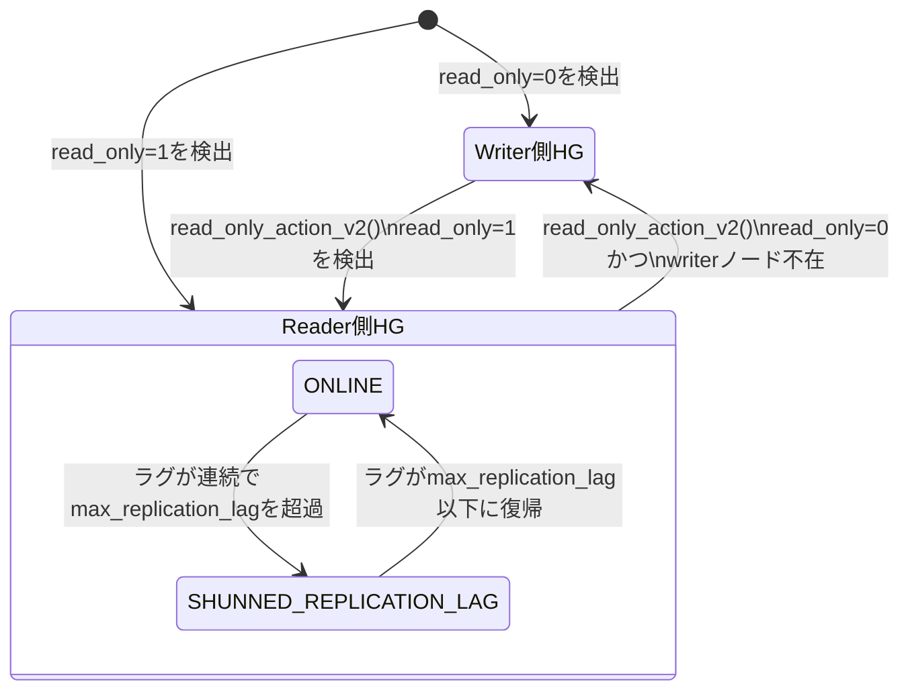

# 第18章 レプリケーション監視とホストグループの自動調整

> **本章で読むソース**
>
> - [`lib/MySQL_Monitor.cpp`](https://github.com/sysown/proxysql/blob/v3.0.9/lib/MySQL_Monitor.cpp)
> - [`lib/MySQL_HostGroups_Manager.cpp`](https://github.com/sysown/proxysql/blob/v3.0.9/lib/MySQL_HostGroups_Manager.cpp)
> - [`include/MySQL_HostGroups_Manager.h`](https://github.com/sysown/proxysql/blob/v3.0.9/include/MySQL_HostGroups_Manager.h)
> - [`lib/MonitorHealthDecision.cpp`](https://github.com/sysown/proxysql/blob/v3.0.9/lib/MonitorHealthDecision.cpp)
> - [`include/MonitorHealthDecision.h`](https://github.com/sysown/proxysql/blob/v3.0.9/include/MonitorHealthDecision.h)

## この章の狙い

第17章では、Monitor スレッドがバックエンドサーバーへ定期的に接続し、`ping` や `read_only` チェックの結果を SQLite のログテーブルへ書き込む基盤を見た。

本章では、その結果を受け取った `MySQL_HostGroups_Manager` が、サーバーの `read_only` 値とレプリケーションラグに応じて、writer 用ホストグループと reader 用ホストグループの間でサーバーを移動させる仕組みを読み解く。

レプリケーショントポロジでプライマリの昇格や降格が起きても、この仕組みが `mysql_servers` テーブルを書き換え続けるため、プロキシは管理者の操作なしにトポロジへ追従する。

## 前提

第13章で見たとおり、`MyHGC`（MySQL Host Group Container）はホストグループ単位でサーバー集合を保持し、`MySrvC`（MySQL Server Container）が個々のサーバーの状態（`MYSQL_SERVER_STATUS_ONLINE` などの `MySerStatus`）を持つ。

本章で扱う仕組みは、この `MySrvC` の所属ホストグループと状態を、Monitor が集めた `read_only` とレプリケーションラグの値に基づいて書き換える。

Monitor 自体の役割分担とスレッドプールの構造は第17章、`GTID` を使った因果整合性リードは第19章で扱う。

## writer/reader を結びつける `mysql_replication_hostgroups`

ProxySQL は、あるホストグループを「writer 側」、別のホストグループを「reader 側」として対応づけるために、`mysql_replication_hostgroups` テーブルを使う。

このテーブルは `writer_hostgroup` と `reader_hostgroup` の組を持ち、`MySQL_HostGroups_Manager::update_hostgroup_manager_mappings()` が `mysql_servers` テーブルと突き合わせて `hostgroup_server_mapping` を構築する。

[`lib/MySQL_HostGroups_Manager.cpp` L1028-L1031](https://github.com/sysown/proxysql/blob/v3.0.9/lib/MySQL_HostGroups_Manager.cpp#L1028-L1031)

```cpp
const char* query = "SELECT DISTINCT hostname, port, '1' is_writer, status, reader_hostgroup, writer_hostgroup, mem_pointer FROM mysql_replication_hostgroups JOIN mysql_servers ON hostgroup_id=writer_hostgroup WHERE status<>3 \
					 UNION \
					 SELECT DISTINCT hostname, port, '0' is_writer, status, reader_hostgroup, writer_hostgroup, mem_pointer FROM mysql_replication_hostgroups JOIN mysql_servers ON hostgroup_id=reader_hostgroup WHERE status<>3 \
					 ORDER BY hostname, port";
```

このクエリは、あるサーバーアドレスが writer 側ホストグループに属していれば `is_writer='1'` の行を、reader 側ホストグループに属していれば `is_writer='0'` の行を生成する。

同じサーバーが writer/reader 双方のホストグループに現れることもあるため、結果はサーバーごとに集約され、`HostGroup_Server_Mapping` という対応表に格納される。

`HostGroup_Server_Mapping` は、1台のサーバーが所属しうる writer 側ノード群と reader 側ノード群を、`Type` で区別して保持する。

[`include/MySQL_HostGroups_Manager.h` L523-L537](https://github.com/sysown/proxysql/blob/v3.0.9/include/MySQL_HostGroups_Manager.h#L523-L537)

```cpp
class HostGroup_Server_Mapping {
public:
	enum Type {
		WRITER = 0,
		READER = 1,

		TYPE_SIZE_
	};

	struct Node {
		MySrvC* srv = nullptr;
		unsigned int reader_hostgroup_id = -1;
		unsigned int writer_hostgroup_id = -1;
		//MySerStatus server_status = MYSQL_SERVER_STATUS_OFFLINE_HARD;
	};
```

`Node` が持つ `reader_hostgroup_id` と `writer_hostgroup_id` は、そのサーバーがどのホストグループの組に属しているかを表す。

この対応表があるおかげで、後述する `read_only_action_v2()` は、あるサーバーの `read_only` 値が変わったときに「対になっている writer ホストグループと reader ホストグループはどれか」を毎回 `mysql_servers` テーブルへ問い合わせずに引ける。

## read_only によるライター/リーダーの自動振り分け

Monitor の `read_only` チェックスレッドは、各サーバーへ `SELECT @@global.read_only` 相当のクエリを投げ、結果を集める。

接続やクエリがタイムアウトした場合は安全側に倒し、`read_only` を「読み取り専用である」とみなす値で初期化しておく。

[`lib/MySQL_Monitor.cpp` L1779](https://github.com/sysown/proxysql/blob/v3.0.9/lib/MySQL_Monitor.cpp#L1779)

```cpp
		int read_only=1; // as a safety mechanism , read_only=1 is the default
```

チェックが正常に完了すると、その結果は `read_only_server_t`（ホスト名とポートと`read_only` 値のタプル）としてリストへ積まれ、バッチ処理の最後に一括で `MySQL_HostGroups_Manager::read_only_action_v2()` へ渡される。

[`lib/MySQL_Monitor.cpp` L1838-L1841](https://github.com/sysown/proxysql/blob/v3.0.9/lib/MySQL_Monitor.cpp#L1838-L1841)

```cpp
		if (timeout_reached == false && mmsd->interr == 0) {
			MyHGM->read_only_action_v2( std::list<read_only_server_t> {
										read_only_server_t { mmsd->hostname, mmsd->port, read_only }
										} ); // default behavior
```

`read_only_action_v2()` は、渡されたサーバーごとに `hostgroup_server_mapping` から現在の所属を引き、`read_only` の値に応じてサーバーを writer 側と reader 側のあいだで移し替える。

`read_only=0`（書き込み可能）なのに writer 側ノードが見つからない場合は、reader 側のノードを writer 側へコピーする。

[`lib/MySQL_HostGroups_Manager.cpp` L3588-L3602](https://github.com/sysown/proxysql/blob/v3.0.9/lib/MySQL_HostGroups_Manager.cpp#L3588-L3602)

```cpp
		if (read_only == 0) {
			if (is_writer == false) {
				// the server has read_only=0 (writer), but we can't find any writer, 
				// so we copy all reader nodes to writer
				proxy_info("Server '%s:%d' found with 'read_only=0', but not found as writer\n", hostname.c_str(), port);
				proxy_debug(PROXY_DEBUG_MONITOR, 5, "Server '%s:%d' found with 'read_only=0', but not found as writer\n", hostname.c_str(), port);
				host_server_mapping->copy_if_not_exists(HostGroup_Server_Mapping::Type::WRITER, HostGroup_Server_Mapping::Type::READER);

				if (mysql_thread___monitor_writer_is_also_reader == false) {
					// remove node from reader
					host_server_mapping->clear(HostGroup_Server_Mapping::Type::READER);
				}

				update_mysql_servers_table = true;
				proxy_info("Regenerating table 'mysql_servers' due to actions on server '%s:%d'\n", hostname.c_str(), port);
			} else {
```

`copy_if_not_exists()` は、reader 側ノードが持つ `writer_hostgroup_id` を使って対応する writer ホストグループへサーバーを追加する。

設定値 `mysql-monitor_writer_is_also_reader` が `false` の場合は、writer へ昇格したサーバーを reader 側からは外す。

逆に `read_only=1`（読み取り専用）なのに writer 側ノードとして見つかった場合は、writer 側の情報を reader 側へコピーしたうえで、writer 側のノードを消す。

[`lib/MySQL_HostGroups_Manager.cpp` L3651-L3663](https://github.com/sysown/proxysql/blob/v3.0.9/lib/MySQL_HostGroups_Manager.cpp#L3651-L3663)

```cpp
		} else if (read_only == 1) {
			if (is_writer) {
				// the server has read_only=1 (reader), but we find it as writer, so we copy all writer nodes to reader (previous reader nodes will be reused)
				proxy_info("Server '%s:%d' found with 'read_only=1', but not found as reader\n", hostname.c_str(), port);
				proxy_debug(PROXY_DEBUG_MONITOR, 5, "Server '%s:%d' found with 'read_only=1', but not found as reader\n", hostname.c_str(), port);
				host_server_mapping->copy_if_not_exists(HostGroup_Server_Mapping::Type::READER, HostGroup_Server_Mapping::Type::WRITER);

				// clearing all writer nodes
				host_server_mapping->clear(HostGroup_Server_Mapping::Type::WRITER);

				update_mysql_servers_table = true;
				proxy_info("Regenerating table 'mysql_servers' due to actions on server '%s:%d'\n", hostname.c_str(), port);
			}
		} else {
```

`read_only=0` の側が「reader をコピーしてから設定次第で reader を消す」という2段階なのに対し、`read_only=1` の側は「reader へコピーしたら無条件で writer を消す」という1段階になっている。

これは、読み取り専用になったサーバーを writer ホストグループに残しておく理由がない一方、書き込み可能になったサーバーは運用によっては reader としても使い続けたい（`monitor_writer_is_also_reader`）という非対称な要件を反映している。

いずれかのサーバーで移動が発生すると `update_mysql_servers_table` が立ち、ロックの中で `mysql_servers` テーブル全体を作り直してチェックサムを更新する。

## 接続を張り替えない論理移動によるトポロジ追従

ここで注意すべきなのは、`read_only_action_v2()` が動かしているのは `hostgroup_server_mapping` という**メモリ上の対応表とそこから再生成される `mysql_servers` テーブル**であり、既存のバックエンド接続そのものではないという点である。

サーバーが writer ホストグループから reader ホストグループへ移っても、そのサーバーへ張られている TCP 接続やコネクションプール上のエントリ（第14章）は直ちには切断されない。

新しいセッションがクエリルールに従ってホストグループを選ぶ際に、更新後の `mysql_servers` を参照することで初めて新しい割り当てが有効になる。

この仕組みにより、フェイルオーバー直後にレプリカがプライマリへ昇格した場合でも、プロキシは既存のコネクションプールを作り直さずに新規セッションの転送先だけを切り替えられる。

これが本章で扱う最適化であり、監視結果の反映と接続の生成と破棄を分離することで、トポロジ追従のたびにプールを丸ごと再構築するコストを避けている。

## レプリケーションラグによる SHUNNED 化

`read_only` による振り分けとは別に、Monitor はレプリカのレプリケーションラグ（`Seconds_Behind_Master` などから得る遅延秒数）も定期的に集め、ラグが大きいサーバーを一時的に迂回させる。

このロジックは `MySQL_HostGroups_Manager::replication_lag_action_inner()` に実装されている。

[`lib/MySQL_HostGroups_Manager.cpp` L2695-L2726](https://github.com/sysown/proxysql/blob/v3.0.9/lib/MySQL_HostGroups_Manager.cpp#L2695-L2726)

```cpp
	for (int j=0; j<(int)myhgc->mysrvs->cnt(); j++) {
		MySrvC *mysrvc=(MySrvC *)myhgc->mysrvs->servers->index(j);
		if (strcmp(mysrvc->address,address)==0 && mysrvc->port==port) {
			mysrvc->cur_replication_lag = current_replication_lag;
			if (mysrvc->get_status() == MYSQL_SERVER_STATUS_ONLINE) {
				if (
//					(current_replication_lag==-1 )
//					||
					(
						current_replication_lag >= 0 &&
						mysrvc->max_replication_lag > 0 && // see issue #4018
						(current_replication_lag > (int)mysrvc->max_replication_lag)
					)
				) {
					// always increase the counter
					mysrvc->cur_replication_lag_count += 1;
					if (mysrvc->cur_replication_lag_count >= (unsigned int)mysql_thread___monitor_replication_lag_count) {
						proxy_warning("Shunning server %s:%d from HG %u with replication lag of %d second, count number: '%d'\n", address, port, myhgc->hid, current_replication_lag, mysrvc->cur_replication_lag_count);
						mysrvc->set_status(MYSQL_SERVER_STATUS_SHUNNED_REPLICATION_LAG);
					} else {
						proxy_info(
							"Not shunning server %s:%d from HG %u with replication lag of %d second, count number: '%d' < replication_lag_count: '%d'\n",
							address,
							port,
							myhgc->hid,
							current_replication_lag,
							mysrvc->cur_replication_lag_count,
							mysql_thread___monitor_replication_lag_count
						);
					}
				} else {
					mysrvc->cur_replication_lag_count = 0;
				}
```

ラグがサーバーごとの上限 `max_replication_lag` を超えるたびに `cur_replication_lag_count` を増やし、その連続回数が設定値 `mysql-monitor_replication_lag_count` に達して初めて `MYSQL_SERVER_STATUS_SHUNNED_REPLICATION_LAG` へ落とす。

1回のラグ超過で即座に迂回させず連続回数を数えるのは、監視クエリ自体の一時的な遅延やレプリカ上の瞬間的な処理待ちで健全なサーバーを誤って迂回させないためである。

ラグが閾値内に戻ったサーバーは、`SHUNNED_REPLICATION_LAG` から `ONLINE` へ復帰する。

[`lib/MySQL_HostGroups_Manager.cpp` L2728-L2741](https://github.com/sysown/proxysql/blob/v3.0.9/lib/MySQL_HostGroups_Manager.cpp#L2728-L2741)

```cpp
			} else {
				if (mysrvc->get_status() == MYSQL_SERVER_STATUS_SHUNNED_REPLICATION_LAG) {
					if (
						(/*current_replication_lag >= 0 &&*/override_repl_lag == false &&
						(current_replication_lag <= (int)mysrvc->max_replication_lag))
						||
						(current_replication_lag==-2 && override_repl_lag == true) // see issue 959
					) {
						mysrvc->set_status(MYSQL_SERVER_STATUS_ONLINE);
						proxy_warning("Re-enabling server %s:%d from HG %u with replication lag of %d second\n", address, port, myhgc->hid, current_replication_lag);
						mysrvc->cur_replication_lag_count = 0;
					}
				}
			}
```

`current_replication_lag==-2` の分岐は、レプリケーションラグが計測不能なときに管理者が明示的に復帰を指示できる特別な上書き経路であり、通常のラグ計測とは別扱いになっている。

`replication_lag_action_inner()` は、Monitor が1バッチで集めたサーバーの数だけ `replication_lag_action()` から呼ばれる。

[`lib/MySQL_HostGroups_Manager.cpp` L2747-L2774](https://github.com/sysown/proxysql/blob/v3.0.9/lib/MySQL_HostGroups_Manager.cpp#L2747-L2774)

```cpp
void MySQL_HostGroups_Manager::replication_lag_action(const std::list<replication_lag_server_t>& mysql_servers) {

	//this method does not use admin table, so this lock is not needed. 
	//GloAdmin->mysql_servers_wrlock();
	unsigned long long curtime1 = monotonic_time();
	wrlock();

	for (const auto& server : mysql_servers) {

		const int hid = std::get<REPLICATION_LAG_SERVER_T::RLS_HOSTGROUP_ID>(server);
		const std::string& address = std::get<REPLICATION_LAG_SERVER_T::RLS_ADDRESS>(server);
		const unsigned int port = std::get<REPLICATION_LAG_SERVER_T::RLS_PORT>(server);
		const int current_replication_lag = std::get<REPLICATION_LAG_SERVER_T::RLS_CURRENT_REPLICATION_LAG>(server);
		const bool override_repl_lag = std::get<REPLICATION_LAG_SERVER_T::RLS_OVERRIDE_REPLICATION_LAG>(server);

		if (mysql_thread___monitor_replication_lag_group_by_host == false) {
			// legacy check. 1 check per server per hostgroup
			MyHGC *myhgc = MyHGC_find(hid);
			replication_lag_action_inner(myhgc,address.c_str(),port,current_replication_lag,override_repl_lag);
		}
		else {
			// only 1 check per server, no matter the hostgroup
			// all hostgroups must be searched
			for (unsigned int i=0; i<MyHostGroups->len; i++) {
				MyHGC*myhgc=(MyHGC*)MyHostGroups->index(i);
				replication_lag_action_inner(myhgc,address.c_str(),port,current_replication_lag,override_repl_lag);
			}
		}
```

設定 `mysql-monitor_replication_lag_group_by_host` が `false`（既定）のときは、サーバーが属するホストグループを1つだけ引いて判定する。

`true` のときは、同じサーバーアドレスが複数のホストグループに登場する構成を想定し、全ホストグループを走査して同じ判定を適用する。

`read_only_action_v2()` と同じく、書き込みロック `wrlock()` を1バッチにつき1回だけ取得している点は、第17章で見たバッチ処理の考え方と共通する。

`read_only_action_v2()` と `replication_lag_action()` はいずれも、Monitor スレッドから1台ずつ呼ばれるのではなく、1回のチェックサイクルで集まった全サーバー分をまとめてから呼び出される。

これにより、複数サーバーの状態変化に対してロックの獲得と解放が1回で済み、サーバー台数が増えてもロック競合の回数が増えない。

## MonitorHealthDecision による判定ロジックの分離

`read_only_action_v2()` や `replication_lag_action_inner()` の判定条件は、`MySrvC` や `MyHGC` の内部状態、グローバル変数の設定値と密に結びついている。

ProxySQL は、この判定条件のうち副作用を持たない部分を `MonitorHealthDecision.cpp` へ切り出し、グローバル状態に依存しない純粋関数として実装し直している。

[`lib/MonitorHealthDecision.cpp` L73-L94](https://github.com/sysown/proxysql/blob/v3.0.9/lib/MonitorHealthDecision.cpp#L73-L94)

```cpp
bool should_shun_on_replication_lag(
	int current_lag,
	unsigned int max_replication_lag,
	unsigned int consecutive_count,
	int count_threshold)
{
	// Mirror MySQL_HostGroups_Manager replication lag logic
	if (current_lag < 0) {
		return false;  // lag unknown, don't shun
	}
	if (max_replication_lag == 0) {
		return false;  // lag check disabled
	}
	if (current_lag <= (int)max_replication_lag) {
		return false;  // within threshold
	}

	// Lag exceeds threshold — check consecutive count
	// The caller is expected to have incremented consecutive_count
	// before calling this function
	return (consecutive_count >= (unsigned int)count_threshold);
}
```

`can_recover_from_replication_lag()` は、`replication_lag_action_inner()` の復帰条件のうち、`current_lag==-2` の特別な上書き経路を除いた通常の復帰条件だけを切り出したものである。

[`lib/MonitorHealthDecision.cpp` L96-L106](https://github.com/sysown/proxysql/blob/v3.0.9/lib/MonitorHealthDecision.cpp#L96-L106)

```cpp
bool can_recover_from_replication_lag(
	int current_lag,
	unsigned int max_replication_lag)
{
	// Mirror MySQL_HostGroups_Manager unshun for replication lag:
	// recover when lag drops to <= max_replication_lag
	if (current_lag < 0) {
		return false;  // unknown lag, don't recover
	}
	return (current_lag <= (int)max_replication_lag);
}
```

ヘッダのコメントが明記するとおり、`current_lag == -2` かつ上書きフラグが立っている経路はこの簡略版には含まれていない。

[`include/MonitorHealthDecision.h` L90-L92](https://github.com/sysown/proxysql/blob/v3.0.9/include/MonitorHealthDecision.h#L90-L92)

```cpp
 * @note Production code also has a special override path for
 *       current_lag == -2 with an override flag (see issue #959).
 *       That case is not covered by this simplified extraction.
```

`MonitorHealthDecision.h` の冒頭コメントによれば、これらの関数は `MySrvC::connect_error()` や `MyHGC` の復帰ループ、レプリケーションラグ判定からロジックを抜き出したものであり、グローバル状態や I/O に依存しないユニットテスト可能な形に整理する目的で導入されている。

判定ロジックを本体の `MySQL_HostGroups_Manager` や `MySrvC` から切り離すことで、しきい値の境界条件（ラグがちょうど閾値と一致する場合や、連続回数がちょうど閾値に達する場合など）を、実際のサーバー接続やロックを用意せずに検証できる。

これは実行速度の最適化ではないが、判定条件の誤りがサーバーの誤ったシャン化や復帰漏れに直結する箇所を、副作用のない関数として独立に検証可能にするという設計上の工夫である。

## サーバーが辿る状態遷移

Monitor の判定によってサーバーが実際に遷移する状態を、read_only による移動とレプリケーションラグによるシャン化の2系統に分けて図示する。



図の上段は `read_only_action_v2()` によるホストグループ間の移動を、下段の `state Reader側HG` はホストグループの中でサーバーが取りうる `MySerStatus` の遷移を表す。

writer 側ホストグループのサーバーもレプリケーションラグの監視対象になりうるが、`replication_lag_action_inner()` の対象は主に reader 側の運用を想定しているため、図では reader 側の内部遷移として示した。

## まとめ

- `mysql_replication_hostgroups` テーブルが writer 側ホストグループと reader 側ホストグループを対応づけ、`HostGroup_Server_Mapping` がその対応をメモリ上に保持する。
- Monitor が集めた `read_only` 値は `read_only_action_v2()` に渡され、`read_only=0` なら writer 側へ、`read_only=1` なら reader 側へサーバーを移動させる。
- レプリケーションラグは `replication_lag_action_inner()` が連続超過回数を数え、閾値に達したサーバーだけを `MYSQL_SERVER_STATUS_SHUNNED_REPLICATION_LAG` にする。
- ホストグループ間の移動はメモリ上の対応表と `mysql_servers` テーブルの書き換えにとどまり、既存のバックエンド接続を切断しない論理的な移動である。
- `MonitorHealthDecision.cpp` は、これらの判定条件のうち副作用のない部分を純粋関数として切り出し、境界条件を単体で検証できるようにしている。

## 関連する章

- 第13章「Hostgroups Manager とサーバー管理」: `MyHGC` と `MySrvC` の構造、サーバーが取りうる `MySerStatus`。
- 第14章「コネクションプール」: ホストグループを移動したサーバーの既存接続がどう扱われるか。
- 第17章「Monitor」: Monitor スレッドの基盤とチェックのバッチ処理の仕組み。
- 第19章「GTIDと因果整合性リード」: `read_only` とは別に GTID を使ってセッションの読み取り一貫性を保つ仕組み。
