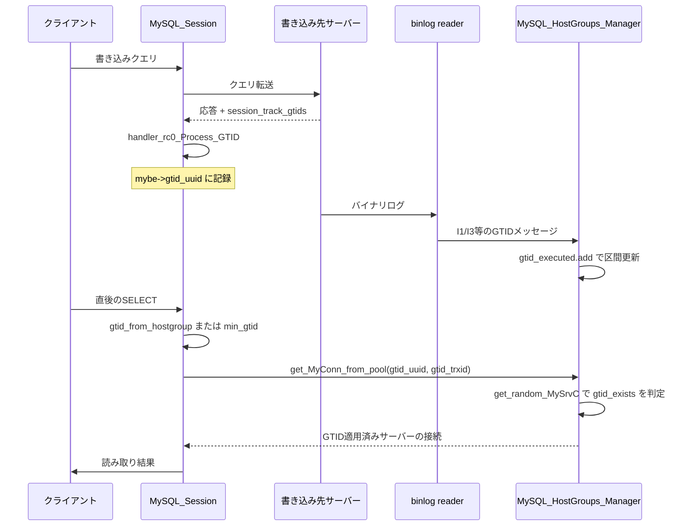

# 第19章 GTIDトラッキングと因果整合性リード

> **本章で読むソース**
>
> - [`include/proxysql_gtid.h`](https://github.com/sysown/proxysql/blob/v3.0.9/include/proxysql_gtid.h)
> - [`lib/proxysql_gtid.cpp`](https://github.com/sysown/proxysql/blob/v3.0.9/lib/proxysql_gtid.cpp)
> - [`include/GTID_Server_Data.h`](https://github.com/sysown/proxysql/blob/v3.0.9/include/GTID_Server_Data.h)
> - [`lib/GTID_Server_Data.cpp`](https://github.com/sysown/proxysql/blob/v3.0.9/lib/GTID_Server_Data.cpp)
> - [`lib/MySQL_HostGroups_Manager.cpp`](https://github.com/sysown/proxysql/blob/v3.0.9/lib/MySQL_HostGroups_Manager.cpp)
> - [`lib/MyHGC.cpp`](https://github.com/sysown/proxysql/blob/v3.0.9/lib/MyHGC.cpp)
> - [`lib/MySQL_Thread.cpp`](https://github.com/sysown/proxysql/blob/v3.0.9/lib/MySQL_Thread.cpp)
> - [`lib/MySQL_Session.cpp`](https://github.com/sysown/proxysql/blob/v3.0.9/lib/MySQL_Session.cpp)
> - [`lib/mysql_connection.cpp`](https://github.com/sysown/proxysql/blob/v3.0.9/lib/mysql_connection.cpp)

## この章の狙い

書き込みを受けたレプリカ構成では、直後の読み取りを別のリードレプリカへ振り分けると、レプリケーション遅延の分だけ書き込んだ内容が見えないことがある。

**因果整合性リード**（read-after-write）は、この問題を「書き込みが適用済みのサーバーだけを読み取り先に選ぶ」ことで解決する仕組みである。

ProxySQLはバックエンド各サーバーが適用したトランザクションの集合を**GTID**（Global Transaction Identifier）単位で追跡し、直前の書き込みのGTIDが未適用のサーバーを読み取り候補から除外する。

本章では、GTID集合を保持するデータ構造から、書き込み後のGTID取得、次のSELECTでの候補絞り込みまでの一連の流れを読む。

## 前提

GTIDはMySQLのレプリケーションで各トランザクションに一意に割り当てられる識別子であり、`<UUID>:<トランザクションID>`の形式を取る。

同一UUID（多くはソースサーバー1台に対応する）に対して連続するトランザクションIDの集合を扱うことが多いため、後述するようにProxySQLは単一のIDではなく区間で集合を表現する。

読み取り先のホストグループ選択そのものは第13章、監視スレッドによるレプリケーション状態の収集は第17章、セッションの状態遷移は第7章で扱った内容を前提にする。

## GTID集合をどう保持するか

ProxySQLは各バックエンドサーバーが適用済みのGTIDを、UUIDごとのトランザクションID区間の集合として保持する。

区間は`TrxId_Interval`で表す。

[`include/proxysql_gtid.h` L12-L34](https://github.com/sysown/proxysql/blob/v3.0.9/include/proxysql_gtid.h#L12-L34)

```c
// Encapsulates an interval of Transaction IDs.
class TrxId_Interval {
	public:
		trxid_t start;
		trxid_t end;

	public:
		explicit TrxId_Interval(const trxid_t _start, const trxid_t _end);
		explicit TrxId_Interval(const trxid_t trxid);
		explicit TrxId_Interval(const char* s);
		explicit TrxId_Interval(const std::string& s);
		static bool parse(const char* s, TrxId_Interval* out);

		const bool contains(const TrxId_Interval& other);
		const bool contains(trxid_t trxid);
		const std::string to_string(void);
		const bool append(const TrxId_Interval& other);
		const bool merge(const TrxId_Interval& other);

		int cmp(const TrxId_Interval& other) const;
bool operator<(const TrxId_Interval& other) const;
bool operator==(const TrxId_Interval& other) const;
bool operator!=(const TrxId_Interval& other) const;
};
```

UUIDと区間集合を対応付けるのが`GTID_Set`である。

[`include/proxysql_gtid.h` L36-L55](https://github.com/sysown/proxysql/blob/v3.0.9/include/proxysql_gtid.h#L36-L55)

```c
// Encapsulates a map of UUID -> trxid intervals.
class GTID_Set {
	public:
		std::unordered_map<std::string, std::list<TrxId_Interval>> map;

	public:
		GTID_Set();

		GTID_Set copy();
		void clear();

		bool add(const std::string& uuid, const TrxId_Interval& iv);
		bool add(const std::string& uuid, const trxid_t& trxid);
		bool add(const std::string& uuid, const trxid_t& start, const trxid_t& end);
		bool add(const std::string& uuid, const char *s);
		bool add(const std::string& uuid, const std::string &s);

		const bool has_gtid(const std::string& uuid, const trxid_t trxid);
		const std::string to_string(void);
};
```

`map`はUUIDをキーに、`TrxId_Interval`のリストを値に持つ。

1台のサーバーが数百万件のトランザクションを適用していても、連続した範囲であれば区間1つで表現できるため、単一IDの集合として保持するより桁違いに小さいメモリで済む。

この区間表現による集約が、本章で扱う最適化の中心である（詳細は後述の節で扱う）。

## 区間への追加とマージ

`GTID_Set::add`は新しい区間を追加するとき、既存の区間へ連結できないかをまず確認する。

[`lib/proxysql_gtid.cpp` L188-L237](https://github.com/sysown/proxysql/blob/v3.0.9/lib/proxysql_gtid.cpp#L188-L237)

```c
// Adds a new trxid interval for a given UUID. Returns true if the set was modified, false otherwise.
bool GTID_Set::add(const std::string& uuid, const TrxId_Interval& iv) {
	auto it = map.find(uuid);
	if (it == map.end()) {
		// new UUID entry
		map[uuid].emplace_back(iv);
		return true;
	}

	if (!it->second.empty()) {
		auto& last = it->second.back();
		if (last.contains(iv)) {
			return false;
		}
		if (last.append(iv)) {
			return true;
		}
	}

	// insert/merge trxid interval...
	auto pos = it->second.begin();
	for (; pos != it->second.end(); ++pos) {
		if (pos->contains(iv)) {
			// trxid interval is already present, nothing to do
			return false;
		}
		if (pos->merge(iv))
			break;
	}
	if (pos == it->second.end()) {
		it->second.emplace_back(iv);
	}

	// ...and merge overlapping trxid ranges, if any
	it->second.sort();
	auto a = it->second.begin();
	while (a != it->second.end()) {
		auto b = std::next(a);
		if (b == it->second.end()) {
			break;
		}
		if (a->merge(*b)) {
				it->second.erase(b);
				continue;
		}
		a++;
	}

	return true;
}
```

L197-L204の「末尾の区間にまず連結を試みる」処理が実質的な高速パスである。

レプリケーションのGTIDはほぼ単調に増加するため、新規に受信するトランザクションIDはリストの末尾区間へ連続して追加できる場合が大半を占める。

この場合は`append`（L108-L116、区間の終端を1つ伸ばすだけ）で済み、リスト全体を走査する必要がない。

末尾へ連結できなかったときだけ、L207以降で全区間を走査してマージ位置を探し、ソートして隣接区間を統合する。

つまり通常のストリーミング受信ではO(1)、順序が乱れた受信やギャップを埋める受信のときだけO(区間数)のコストを払う設計になっている。

## サーバーへの接続とGTIDメッセージの受信

ProxySQLは各バックエンドサーバーに対して、`GTID_Server_Data`という接続状態を1つずつ保持する。

[`include/GTID_Server_Data.h` L8-L31](https://github.com/sysown/proxysql/blob/v3.0.9/include/GTID_Server_Data.h#L8-L31)

```c
class GTID_Server_Data {
	public:
	char *address;
	uint16_t port;
	uint16_t mysql_port;
	char *data;
	size_t len;
	size_t size;
	size_t pos;
	struct ev_io *w;
	char uuid_server[64];
	unsigned long long events_read;
	GTID_Set gtid_executed;
	bool active;
	GTID_Server_Data(struct ev_io *_w, char *_address, uint16_t _port, uint16_t _mysql_port);
	void resize(size_t _s);
	~GTID_Server_Data();
	bool readall();
	bool writeout();
	bool read_next_gtid();
	bool gtid_exists(char *gtid_uuid, uint64_t gtid_trxid);
	void read_all_gtids();
	void dump();
};
```

`gtid_executed`が、このサーバーに適用済みのGTID集合である。

接続はサーバーそのものへではなく、各サーバー上で稼働する「ProxySQL binlog reader」という補助プロセスへ張られる。

binlog readerはサーバーのバイナリログを読み、適用済みトランザクションのUUIDとトランザクションID（の範囲）をテキスト形式のメッセージでProxySQLへ配信する。

メッセージの形式は次のコメントで定義されている。

[`lib/GTID_Server_Data.cpp` L311-L319](https://github.com/sysown/proxysql/blob/v3.0.9/lib/GTID_Server_Data.cpp#L311-L319)

```c
/*
 * The wire format for the binlogreader is five distinct messages, in plaintext:
 *
 * ST=<uuid>:<trxid>[-<trxid>][,<uuid>:<trxid>[-<trxid>], ...] : Bootstrap message, providing individual transaction ID or trxid ranges for all seen UUID servers.
 * I1=<uuid>:<trxid>                                            : Latest seen single trxid for a given UUID.
 * I2=<trxid>                                                   : Latest seen single trxid, reusing UUID from previous I1/I3 message.
 * I3=<uuid>:<trxid_start>-<trxid_end>                         : Latest seen trxid range for a given UUID.
 * I4=<trxid_start>-<trxid_end>                                : Latest seen trxid range, reusing UUID from previous I1/I3 message.
 */
```

`ST=`は接続直後に送られるブートストラップメッセージで、その時点までにサーバーが適用した全UUIDと全区間をまとめて送る。

`I1`〜`I4`は以後の増分更新で、直前のメッセージと同じUUIDを再送しないことで転送量を削っている。

これらのメッセージは`read_next_gtid`が1行ずつ切り出して解析し、`gtid_executed.add`を呼んで集合を更新する。

[`lib/GTID_Server_Data.cpp` L320-L330](https://github.com/sysown/proxysql/blob/v3.0.9/lib/GTID_Server_Data.cpp#L320-L330)

```c
bool GTID_Server_Data::read_next_gtid() {
	if (len==0) {
		return false;
	}
	void *nlp = NULL;
	nlp = memchr(data+pos,'\n',len-pos);
	if (nlp == NULL) {
		return false;
	}
	int l = (char *)nlp - (data+pos);
	char rec_msg[80];
```

改行が届くまでバッファに読み溜め、1メッセージ分（`\n`まで）が揃ってから初めて解析する作りになっている。

この接続はイベントループ（`ev_io`によるノンブロッキングI/O）上で動作し、`reader_cb`が読み取り可能イベントのたびに`readall`でバッファへ読み込み、`dump`で`read_all_gtids`を呼び出す。

[`lib/GTID_Server_Data.cpp` L276-L291](https://github.com/sysown/proxysql/blob/v3.0.9/lib/GTID_Server_Data.cpp#L276-L291)

```c
void GTID_Server_Data::read_all_gtids() {
		while (read_next_gtid()) {
		}
	}

void GTID_Server_Data::dump() {
	if (len==0) {
		return;
	}
	read_all_gtids();
	if (pos >= len/2) {
		memmove(data,data+pos,len-pos);
		len = len-pos;
		pos = 0;
	}
}
```

サーバー一覧が変わったとき（サーバーの追加や削除、`gtid_port`の設定変更）は、`MySQL_HostGroups_Manager::generate_mysql_gtid_executed_tables`がGTID接続テーブル（`gtid_map`）を作り直し、必要な接続を張り直す。

[`lib/MySQL_HostGroups_Manager.cpp` L1724-L1735](https://github.com/sysown/proxysql/blob/v3.0.9/lib/MySQL_HostGroups_Manager.cpp#L1724-L1735)

```c
void MySQL_HostGroups_Manager::generate_mysql_gtid_executed_tables() {
	// NOTE: We are required to lock while iterating over 'MyHostGroups'. Otherwise race conditions could take place,
	// e.g. servers could be purged by 'purge_mysql_servers_table' and invalid memory be accessed.
	wrlock();

	pthread_rwlock_wrlock(&gtid_rwlock);

	// first, add them all as stale entries
	std::unordered_set<string> stale_server;
	std::unordered_map<string, GTID_Server_Data *>::iterator it = gtid_map.begin();
	while(it != gtid_map.end()) {
		stale_server.emplace(it->first);
		it++;
	}
```

`gtid_port`が設定されているサーバーだけが対象になる。

つまり因果整合性リードを使うには、監視対象サーバー側でbinlog readerを稼働させ、`gtid_port`を設定しておく必要がある。

## 書き込み後のGTID取得

クライアントが書き込みクエリを実行すると、応答を返したバックエンド接続からGTIDを取り出し、セッションに紐付ける。

これを行うのが`handler_rc0_Process_GTID`である。

[`lib/MySQL_Session.cpp` L5162-L5169](https://github.com/sysown/proxysql/blob/v3.0.9/lib/MySQL_Session.cpp#L5162-L5169)

```c
void MySQL_Session::handler_rc0_Process_GTID(MySQL_Connection *myconn) {
	if (myconn->get_gtid(mybe->gtid_uuid,&mybe->gtid_trxid)) {
		if (mysql_thread___client_session_track_gtid) {
			gtid_hid = current_hostgroup;
			memcpy(gtid_buf,mybe->gtid_uuid,sizeof(gtid_buf));
		}
	}
}
```

`MySQL_Connection::get_gtid`が実際にGTIDを取り出す処理で、MySQLプロトコルの`session_track_gtids`機能（サーバーがコミット後の状態変化としてGTIDを通知する機能）に依存する。

[`lib/mysql_connection.cpp` L3135-L3145](https://github.com/sysown/proxysql/blob/v3.0.9/lib/mysql_connection.cpp#L3135-L3145)

```c
bool MySQL_Connection::get_gtid(char *buff, uint64_t *trx_id) {
	// note: current implementation for for OWN GTID only!
	bool ret = false;
	if (buff==NULL || trx_id == NULL) {
		return ret;
	}
	if (mysql) {
		if (mysql->net.last_errno==0) { // only if there is no error
			if (mysql->server_status & SERVER_SESSION_STATE_CHANGED) { // only if status changed
				const char *data;
				size_t length;
				if (mysql_session_track_get_first(mysql, SESSION_TRACK_GTIDS, &data, &length) == 0) {
```

条件付き（コメントに`OWN GTID only`とある通り、自分のトランザクションが発行したGTIDのみ）に取得できる。

取得できたGTIDは`MySQL_Backend::gtid_uuid`（バックエンド接続ごとの直近GTID）と、`session_track_gtids`が有効な場合はセッション側の`gtid_hid`と`gtid_buf`（後続のプリペアドステートメント間で持ち越すためのセッション単位のバッファ）の両方に記録される。

`handler_rc0_Process_GTID`はクエリ応答処理の一部として呼ばれ、書き込みの成否にかかわらず毎回GTIDの有無を確認する。

## 次の読み取りでの候補サーバー選択

GTIDを条件にした読み取り先の選択は、2つの経路のいずれかで指示される。

1つは、クエリルールの`min_gtid`アノテーション（クエリコメントで直接GTIDを指定する）である。

もう1つは、クエリルールの`gtid_from_hostgroup`（直前に書き込んだホストグループのGTIDを使う、という指示）である。

[`lib/MySQL_Session.cpp` L7797-L7804](https://github.com/sysown/proxysql/blob/v3.0.9/lib/MySQL_Session.cpp#L7797-L7804)

```c
			if (qpo->min_gtid) {
				gtid_uuid = qpo->min_gtid;
				with_gtid = true;
			} else if (qpo->gtid_from_hostgroup >= 0) {
				_gtid_from_backend = find_backend(qpo->gtid_from_hostgroup);
				if (_gtid_from_backend) {
					if (_gtid_from_backend->gtid_uuid[0]) {
						gtid_uuid = _gtid_from_backend->gtid_uuid;
						with_gtid = true;
					}
				}
			}
```

`gtid_from_hostgroup`の場合、`find_backend`で指定ホストグループの`MySQL_Backend`を探し、そこに記録済みの`gtid_uuid`（前節の`handler_rc0_Process_GTID`が書き込んだ値）を使う。

こうして得たGTID文字列は接続プール検索に渡る。

[`lib/MySQL_Session.cpp` L7818-L7832](https://github.com/sysown/proxysql/blob/v3.0.9/lib/MySQL_Session.cpp#L7818-L7832)

```c
			if (gtid_uuid != NULL) {
				int l = sep_pos - gtid_uuid;
				trxid = strtoull(sep_pos+1, NULL, 10);
				int m;
				int n=0;
				for (m=0; m<l; m++) {
					if (gtid_uuid[m] != '-') {
						uuid[n]=gtid_uuid[m];
						n++;
					}
				}
				uuid[n]='\0';
#ifndef STRESSTEST_POOL
				mc=thread->get_MyConn_local(mybe->hostgroup_id, this, uuid, trxid, -1);
#endif // STRESSTEST_POOL
```

まず`thread->get_MyConn_local`にuuidとtrxidを渡してローカルキャッシュを探すが、ここで見つからなければ次のようにグローバルプールへフォールバックする。

[`lib/MySQL_Session.cpp` L7854-L7858](https://github.com/sysown/proxysql/blob/v3.0.9/lib/MySQL_Session.cpp#L7854-L7858)

```c
		if (mc==NULL) {
			if (trxid) {
				mc=MyHGM->get_MyConn_from_pool(mybe->hostgroup_id, this, (session_fast_forward || qpo->create_new_conn), uuid, trxid, -1);
			} else {
				mc=MyHGM->get_MyConn_from_pool(mybe->hostgroup_id, this, (session_fast_forward || qpo->create_new_conn), NULL, 0, (int)qpo->max_lag_ms);
			}
```

`get_MyConn_local`内部のGTID関連分岐を見ると、v3.0.9ではローカルキャッシュ接続をGTID条件で実効的に絞り込む形になっていない。

[`lib/MySQL_Thread.cpp` L6408-L6436](https://github.com/sysown/proxysql/blob/v3.0.9/lib/MySQL_Thread.cpp#L6408-L6436)

```c
		if (c->parent->myhgc->hid==_hid && sess->client_myds->myconn->match_tracked_options(c)) { // options are all identical
			if (
				(gtid_uuid == NULL) || // gtid_uuid is not used
				(gtid_uuid && find(parents.begin(), parents.end(), c->parent) == parents.end()) // the server is currently not excluded
			) {
				MySQL_Connection *client_conn = sess->client_myds->myconn;
				if (c->requires_CHANGE_USER(client_conn)==false) { // CHANGE_USER is not required
					char *schema = client_conn->userinfo->schemaname;
					if (strcmp(c->userinfo->schemaname,schema)==0) { // same schema
						unsigned int not_match = 0; // number of not matching session variables
						c->number_of_matching_session_variables(client_conn, not_match);
						if (not_match == 0) { // all session variables match
							if (gtid_uuid) { // gtid_uuid is used
								// we first check if we already excluded this parent (MySQL Server)
								MySrvC *mysrvc = c->parent;
								std::vector<MySrvC *>::iterator it;
								it = find(parents.begin(), parents.end(), mysrvc);
								if (it != parents.end()) {
									// we didn't exclude this server (yet?)
									bool gtid_found = false;
									gtid_found = MyHGM->gtid_exists(mysrvc, gtid_uuid, gtid_trxid);
									if (gtid_found) { // this server has the correct GTID
										c=(MySQL_Connection *)cached_connections->remove_index_fast(i);
										return c;
									} else {
										parents.push_back(mysrvc); // stop evaluating this server
									}
								}
							} else { // gtid_is not used
```

外側のif（L6409-L6412）は`parents`に未登録のparentだけを次に進める。

内側のif（L6425）は`parents`に登録済みのparentのときだけ`gtid_exists`を呼ぶ。

この2つは両立しないため、通常の実行経路では内側の`gtid_exists`呼び出しに到達しない。

つまりGTIDによる候補サーバーの絞り込みは、ローカルキャッシュ側ではなく、`MyHGM->get_MyConn_from_pool`経由の`MyHGC::get_random_MySrvC`側で行われる。

[`lib/MyHGC.cpp` L59-L67](https://github.com/sysown/proxysql/blob/v3.0.9/lib/MyHGC.cpp#L59-L67)

```c
						if (mysrvc->current_latency_us < (mysrvc->max_latency_us ? mysrvc->max_latency_us : mysql_thread___default_max_latency_ms*1000)) { // consider the host only if not too far
							if (gtid_trxid) {
								if (MyHGM->gtid_exists(mysrvc, gtid_uuid, gtid_trxid)) {
									sum+=mysrvc->weight;
									TotalUsedConn+=mysrvc->ConnectionsUsed->conns_length();
									mysrvcCandidates[num_candidates]=mysrvc;
									num_candidates++;
								}
							} else {
```

`gtid_trxid`が指定されているときだけ`MyHGM->gtid_exists`を呼び、そのサーバーの`gtid_executed`（前節までで構築した区間集合）に該当GTIDが含まれるサーバーだけを候補配列へ加える。

含まれなければそのサーバーは今回の読み取り候補から外れる。

`gtid_exists`は`gtid_map`から対象サーバーの`GTID_Server_Data`を引き、`GTID_Set::has_gtid`で区間集合に対する所属判定を行う。

[`lib/MySQL_HostGroups_Manager.cpp` L1678-L1698](https://github.com/sysown/proxysql/blob/v3.0.9/lib/MySQL_HostGroups_Manager.cpp#L1678-L1698)

```c
bool MySQL_HostGroups_Manager::gtid_exists(MySrvC *mysrvc, char * gtid_uuid, uint64_t gtid_trxid) {
	bool ret = false;
	pthread_rwlock_rdlock(&gtid_rwlock);
	std::string s1 = mysrvc->address;
	s1.append(":");
	s1.append(std::to_string(mysrvc->port));
	std::unordered_map <string, GTID_Server_Data *>::iterator it2;
	it2 = gtid_map.find(s1);
	GTID_Server_Data *gtid_is=NULL;
	if (it2!=gtid_map.end()) {
		gtid_is=it2->second;
		if (gtid_is) {
			if (gtid_is->active == true) {
				ret = gtid_is->gtid_exists(gtid_uuid,gtid_trxid);
			}
		}
	}
	//proxy_info("Checking if server %s has GTID %s:%lu . %s\n", s1.c_str(), gtid_uuid, gtid_trxid, (ret ? "YES" : "NO"));
	pthread_rwlock_unlock(&gtid_rwlock);
	return ret;
}
```

`has_gtid`自体は区間のリストを線形に走査するだけの単純な判定である。

[`lib/proxysql_gtid.cpp` L263-L276](https://github.com/sysown/proxysql/blob/v3.0.9/lib/proxysql_gtid.cpp#L263-L276)

```c
// Evaluates whether a trxid is present in any of the intervals for a given UUID.
const bool GTID_Set::has_gtid(const std::string& uuid, const trxid_t trxid) {
	auto it = map.find(uuid);
	if (it == map.end()) {
		return false;
	}
	for (auto itr = it->second.begin(); itr != it->second.end(); ++itr) {
		if (itr->contains(trxid)) {
			return true;
		}
	}

	return false;
}
```

判定コストが区間の走査回数に比例する点は変わらないが、前述の区間統合によって走査対象の要素数そのものが小さく抑えられている。

これが本章の最適化の要点であり、単一トランザクションIDの集合として持つ実装（要素数がトランザクション数に比例する）と比べ、走査回数を数桁単位で減らせる。

読み取りロックはサーバーごとの`GTID_Server_Data`を保護するもので、GTID受信スレッド（binlog readerとの接続を処理するイベントループ）が書き込むあいだ、クエリ処理スレッドは`has_gtid`の判定だけを行う設計になっている。

## 処理の流れ

書き込みから次の読み取りまでの一連の流れを図に示す。



書き込み先サーバーからのGTID通知経路と、binlog readerからのGTID反映経路は非同期に進む点に注意する。

読み取り時点でまだGTIDメッセージが届いていないサーバーは候補から外れ続けるため、`gtid_exists`が真になるまで待つ挙動になる（この待ち合わせの実装は接続取得のリトライループが担うが、本章では扱わない）。

## まとめ

ProxySQLは各バックエンドサーバーの適用済みGTIDを、UUIDごとのトランザクションID区間としてサーバーごとに保持する。

binlog readerからの通知は末尾区間への連結を優先することで、通常のストリーミング更新をほぼO(1)で処理する。

書き込み応答から得たGTIDをセッションやバックエンド接続に記録しておき、次の読み取りでは`min_gtid`または`gtid_from_hostgroup`の指定に従ってそのGTIDを条件に候補サーバーを絞り込む。

絞り込みの判定自体は区間集合への線形走査だが、区間統合によって走査対象を小さく保つことが、この仕組み全体の実用上の速度を支えている。

## 関連する章

- 読み取り先ホストグループの選択方式は第13章「ホストグループマネージャ」を参照。
- バックエンドの状態監視とレプリケーション遅延の収集は第17章「Monitor」を参照。
- セッションの状態遷移とクエリ処理のライフサイクルは第7章「セッションステートマシン」を参照。
