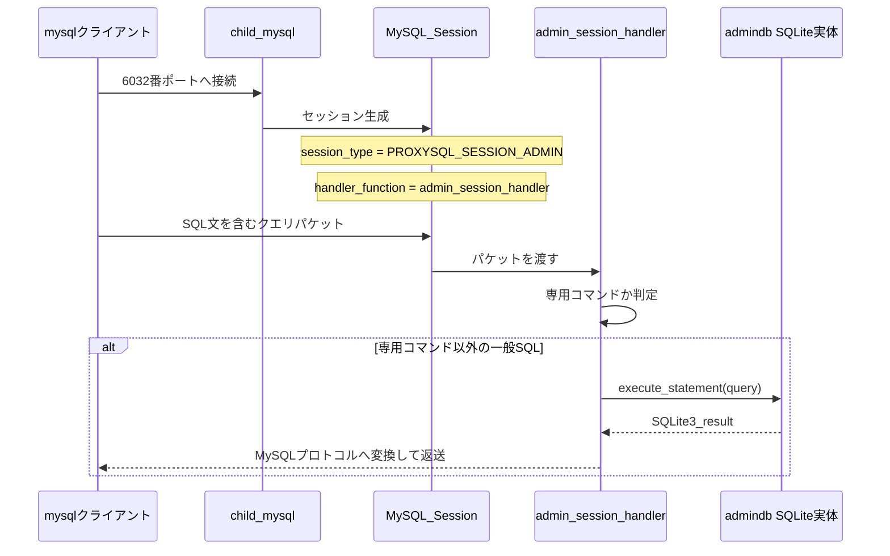

# 第20章 Admin インターフェイスと SQLite 設定バックエンド

> **本章で読むソース**
>
> - [`lib/Admin_Bootstrap.cpp`](https://github.com/sysown/proxysql/blob/v3.0.9/lib/Admin_Bootstrap.cpp)
> - [`lib/ProxySQL_Admin.cpp`](https://github.com/sysown/proxysql/blob/v3.0.9/lib/ProxySQL_Admin.cpp)
> - [`lib/Admin_Handler.cpp`](https://github.com/sysown/proxysql/blob/v3.0.9/lib/Admin_Handler.cpp)
> - [`include/proxysql_admin.h`](https://github.com/sysown/proxysql/blob/v3.0.9/include/proxysql_admin.h)
> - [`include/sqlite3db.h`](https://github.com/sysown/proxysql/blob/v3.0.9/include/sqlite3db.h)
> - [`include/ProxySQL_Admin_Tables_Definitions.h`](https://github.com/sysown/proxysql/blob/v3.0.9/include/ProxySQL_Admin_Tables_Definitions.h)

## この章の狙い

ここまでの章は、クライアントとバックエンドのあいだでクエリを転送する処理を扱ってきた。

その転送のふるまいを決める設定、たとえばどのホストグループにどのサーバーがいるか、どのクエリをどこへ回すか、どのユーザーにログインを許すかは、すべて**Admin インターフェイス**という別系統の入口から書き込まれる。

Admin インターフェイスは、6032番ポートで待ち受けるMySQLプロトコルの口を持ちながら、その中身は**SQLite**である。

クライアントが送るのは`INSERT`や`SELECT`といった普通のSQL文であり、ProxySQLはそれをそのままSQLiteエンジンに渡して実行する。

本章では、この二重構造、すなわちMySQLプロトコルの皮とSQLiteの実体がどう組み合わさっているかを、初期化からクエリ処理までのコードに沿って追う。

## 前提

Admin インターフェイスが待ち受けるのは、クライアントセッション（第7章、第8章）と同じ`MySQL_Session`のインスタンスである。

ただし転送先はバックエンド（第13章、第14章）ではなく、プロセス内に持つSQLiteデータベースになる。

設定テーブルをどう読み込み、`LOAD ... TO RUNTIME`でランタイム構造にどう反映するかという層構造の詳細は第21章で扱う。

ProxySQL Clusterによる複数ノード間の設定同期は第22章で扱う。

本章はその手前、Admin が「SQLiteに対するSQL実行エンジン」として動く土台を扱う。

## Admin が使う5つのSQLiteデータベース

Admin インターフェイスは、役割の異なる複数のSQLiteデータベースを内部に持つ。

その初期化は`ProxySQL_Admin::init`が行う。

[`lib/Admin_Bootstrap.cpp` L587-L595](https://github.com/sysown/proxysql/blob/v3.0.9/lib/Admin_Bootstrap.cpp#L587-L595)

```cpp
	admindb=new SQLite3DB();
	/**
	 * @brief Open the admin database with shared cache mode
	 *
	 * The admin database stores ProxySQL's configuration and runtime state.
	 * Using memory with shared cache allows multiple connections to access the same data.
	 */
	admindb->open((char *)"file:mem_admindb?mode=memory&cache=shared", SQLITE_OPEN_READWRITE | SQLITE_OPEN_CREATE | SQLITE_OPEN_FULLMUTEX);
	admindb->execute("PRAGMA cache_size = -50000");
```

`admindb`はメモリ上に置かれる。

`SELECT`が届くたびにディスクI/Oが発生しては、設定変更のたびにレイテンシが跳ね上がってしまうため、ランタイムの読み書きが集中するデータベースはメモリ常駐にしてある。

同じ初期化関数は、この`admindb`に続けて`statsdb`（統計情報）、`configdb`（永続化された設定）、`monitordb`（監視データ）、`statsdb_disk`（統計の永続化）を開く。

[`lib/Admin_Bootstrap.cpp` L648-L662](https://github.com/sysown/proxysql/blob/v3.0.9/lib/Admin_Bootstrap.cpp#L648-L662)

```cpp
	configdb=new SQLite3DB();
	if (access(GloVars.admindb, F_OK) == 0) {
		if (access(GloVars.admindb, W_OK) != 0) {
			proxy_error("Database file '%s' exists but is not writable\n", GloVars.admindb);
			exit(EXIT_SUCCESS);
		}
	}
	/**
	 * @brief Open the config database (persistent storage)
	 *
	 * The config database stores ProxySQL's persistent configuration data.
	 * Unlike memory databases, this is file-based and survives restarts.
	 * It contains user accounts, server groups, query rules, etc.
	 */
	configdb->open((char *)GloVars.admindb, SQLITE_OPEN_READWRITE | SQLITE_OPEN_CREATE | SQLITE_OPEN_FULLMUTEX);
```

`configdb`は`GloVars.admindb`が指すファイル、既定では`proxysql.db`を開く。

こちらはプロセス再起動をまたいで設定を残すためのデータベースであり、メモリ上の`admindb`とは別物である。

この5つのデータベースをどう使い分けるかを、次の表に整理する。

| メンバ変数 | 役割 | 保存先 |
|---|---|---|
| `admindb` | 設定の実体、クライアントが直接SQLを実行する相手 | メモリ |
| `configdb` | `admindb`の永続化先 | ディスク（`proxysql.db`） |
| `statsdb` | 実行時の統計情報 | メモリ |
| `statsdb_disk` | 統計情報の永続化先 | ディスク |
| `monitordb` | Monitor スレッド（第17章）が集める監視データ | メモリ |

## SQLite の ATTACH でデータベースをまたぐ

役割ごとにデータベースを分けると、`admindb`に接続したクライアントから`configdb`のテーブルを直接SQLで参照できなくなる。

ProxySQLはこれをSQLiteの`ATTACH DATABASE`文で解決する。

[`lib/Admin_Bootstrap.cpp` L971-L980](https://github.com/sysown/proxysql/blob/v3.0.9/lib/Admin_Bootstrap.cpp#L971-L980)

```cpp
	check_and_build_standard_tables(admindb, tables_defs_admin);
	check_and_build_standard_tables(configdb, tables_defs_config);
	check_and_build_standard_tables(statsdb, tables_defs_stats);

	__attach_db(admindb, configdb, (char *)"disk");
	__attach_db(admindb, statsdb, (char *)"stats");
	__attach_db(admindb, monitordb, (char *)"monitor");
	__attach_db(statsdb, monitordb, (char *)"monitor");
	__attach_db(admindb, statsdb_disk, (char *)"stats_history");
	__attach_db(statsdb, statsdb_disk, (char *)"stats_history");
```

`__attach_db`自体は、`ATTACH DATABASE '<url>' AS <alias>`という文字列を組み立てて実行するだけの薄いラッパーである。

[`lib/ProxySQL_Admin.cpp` L5972-L5979](https://github.com/sysown/proxysql/blob/v3.0.9/lib/ProxySQL_Admin.cpp#L5972-L5979)

```cpp
void ProxySQL_Admin::__attach_db(SQLite3DB *db1, SQLite3DB *db2, char *alias) {
	const char *a="ATTACH DATABASE '%s' AS %s";
	int l=strlen(a)+strlen(db2->get_url())+strlen(alias)+5;
	char *cmd=(char *)malloc(l);
	snprintf(cmd, l, a, db2->get_url(), alias);
	db1->execute(cmd);
	free(cmd);
}
```

この結果、`admindb`への1本の接続から、`disk.mysql_servers`のように別名を付けて`configdb`のテーブルを参照できるようになる。

`mysql_servers`（メモリ上の稼働中設定）と`disk.mysql_servers`（ディスク上の永続設定）のあいだで`INSERT INTO ... SELECT ... FROM disk....`という一文のSQLがそのまま書けるのは、この ATTACH のおかげである。

設定の保存や読み込みという本来ならファイルの読み書きを要する処理が、単なる`SELECT`と`INSERT`のSQL文に還元されている点が、このアーキテクチャの利点である。

## テーブル定義とスキーマの自動構築

Admin が扱うテーブル、`mysql_servers`や`mysql_query_rules`、`global_variables`などは、C言語の文字列リテラルとして定義されたCREATE TABLE文である。

[`include/ProxySQL_Admin_Tables_Definitions.h` L22](https://github.com/sysown/proxysql/blob/v3.0.9/include/ProxySQL_Admin_Tables_Definitions.h#L22)

```cpp
#define ADMIN_SQLITE_TABLE_MYSQL_SERVERS_V2_0_11 "CREATE TABLE mysql_servers (hostgroup_id INT CHECK (hostgroup_id>=0) NOT NULL DEFAULT 0 , hostname VARCHAR NOT NULL , port INT CHECK (port >= 0 AND port <= 65535) NOT NULL DEFAULT 3306 , gtid_port INT CHECK ((gtid_port <> port OR gtid_port=0) AND gtid_port >= 0 AND gtid_port <= 65535) NOT NULL DEFAULT 0 , status VARCHAR CHECK (UPPER(status) IN ('ONLINE','SHUNNED','OFFLINE_SOFT', 'OFFLINE_HARD')) NOT NULL DEFAULT 'ONLINE' , weight INT CHECK (weight >= 0 AND weight <=10000000) NOT NULL DEFAULT 1 , compression INT CHECK (compression IN(0,1)) NOT NULL DEFAULT 0 , max_connections INT CHECK (max_connections >=0) NOT NULL DEFAULT 1000 , max_replication_lag INT CHECK (max_replication_lag >= 0 AND max_replication_lag <= 126144000) NOT NULL DEFAULT 0 , use_ssl INT CHECK (use_ssl IN(0,1)) NOT NULL DEFAULT 0 , max_latency_ms INT UNSIGNED CHECK (max_latency_ms>=0) NOT NULL DEFAULT 0 , comment VARCHAR NOT NULL DEFAULT '' , PRIMARY KEY (hostgroup_id, hostname, port) )"
```

`hostgroup_id`や`port`にSQLiteの`CHECK`制約が直接書かれている点に注目したい。

`0`から`65535`の範囲外のポート番号を`INSERT`しようとすると、ProxySQLのC++コードが値を検証するより前に、SQLiteエンジン自身がその文を拒否する。

入力検証の一部をアプリケーションコードではなくスキーマ制約に持たせることで、検証漏れの経路を減らしている。

このヘッダーには`V1_1_0`から`V2_0_11`まで複数バージョンの定義が並んでおり、`ADMIN_SQLITE_TABLE_MYSQL_SERVERS`という現行バージョンを指すマクロだけが実際に使われる。

[`include/ProxySQL_Admin_Tables_Definitions.h` L24](https://github.com/sysown/proxysql/blob/v3.0.9/include/ProxySQL_Admin_Tables_Definitions.h#L24)

```cpp
#define ADMIN_SQLITE_TABLE_MYSQL_SERVERS ADMIN_SQLITE_TABLE_MYSQL_SERVERS_V2_0_11
```

過去バージョンの定義を残しているのは、ディスク上の`proxysql.db`が旧バージョンのスキーマのまま保存されていた場合に、起動時にカラムを比較して`ALTER TABLE`でアップグレードするためである。

これらのテーブル定義は`table_def_t`という名前とDDLの組にまとめられ、`init`の中で`tables_defs_admin`、`tables_defs_config`、`tables_defs_stats`という3本のベクタに登録される。

[`lib/Admin_Bootstrap.cpp` L743-L746](https://github.com/sysown/proxysql/blob/v3.0.9/lib/Admin_Bootstrap.cpp#L743-L746)

```cpp
	insert_into_tables_defs(tables_defs_admin,"mysql_servers", ADMIN_SQLITE_TABLE_MYSQL_SERVERS);
	insert_into_tables_defs(tables_defs_admin,"runtime_mysql_servers", ADMIN_SQLITE_TABLE_RUNTIME_MYSQL_SERVERS);
	insert_into_tables_defs(tables_defs_admin,"mysql_users", ADMIN_SQLITE_TABLE_MYSQL_USERS);
	insert_into_tables_defs(tables_defs_admin,"runtime_mysql_users", ADMIN_SQLITE_RUNTIME_MYSQL_USERS);
```

各データベースに実際のテーブルを作るのは`check_and_build_standard_tables`である。

[`lib/ProxySQL_Admin.cpp` L3305-L3314](https://github.com/sysown/proxysql/blob/v3.0.9/lib/ProxySQL_Admin.cpp#L3305-L3314)

```cpp
void ProxySQL_Admin::check_and_build_standard_tables(SQLite3DB *db, std::vector<table_def_t *> *tables_defs) {
//	int i;
	table_def_t *td;
	db->execute("PRAGMA foreign_keys = OFF");
	for (std::vector<table_def_t *>::iterator it=tables_defs->begin(); it!=tables_defs->end(); ++it) {
		td=*it;
		db->check_and_build_table(td->table_name, td->table_def);
	}
	db->execute("PRAGMA foreign_keys = ON");
};
```

`check_and_build_table`（`include/sqlite3db.h` L238で宣言）は、テーブルが存在しなければCREATE TABLE文を実行し、存在すれば現在のカラム定義と比較して、差異があれば移行処理を行う。

新しいバージョンへアップグレードするたびに手作業のマイグレーションスクリプトを書く必要がなく、`mysql_servers`のような名前を持つテーブルをこの関数に登録しておくだけで、スキーマの追従が自動化される。

`mysql_servers`と`runtime_mysql_servers`のように、同じ内容を指す2つのテーブルが並んでいる点も見ておく。

前者はユーザーが編集する設定であり、後者はそれが`LOAD ... TO RUNTIME`によって実際に読み込まれた結果のコピーである。

両者を分けておくことで、`SELECT * FROM mysql_servers`と`SELECT * FROM runtime_mysql_servers`を比較するだけで、未反映の変更があるかどうかを確認できる。

## Admin セッションへのクエリの経路

クライアントが6032番ポートに接続すると、Admin 用のacceptスレッドである`child_mysql`が新しい`MySQL_Session`を作り、そのセッション種別を`PROXYSQL_SESSION_ADMIN`に設定する。

[`lib/ProxySQL_Admin.cpp` L2180-L2185](https://github.com/sysown/proxysql/blob/v3.0.9/lib/ProxySQL_Admin.cpp#L2180-L2185)

```cpp
	MySQL_Session *sess=mysql_thr->create_new_session_and_client_data_stream<MySQL_Thread, MySQL_Session*>(client);
	sess->thread=mysql_thr;
	sess->session_type = PROXYSQL_SESSION_ADMIN;
	sess->handler_function=admin_session_handler<MySQL_Session>;
	MySQL_Data_Stream *myds=sess->client_myds;
	sess->start_time=mysql_thr->curtime;
```

`handler_function`に`admin_session_handler`を差し込むことで、以後このセッションに届くクエリパケットはすべてこの関数に渡る。

通常のクライアントセッションがクエリプロセッサ（第9章）とバックエンド接続プール（第14章）を経由するのに対し、Admin セッションはこの`handler_function`の差し替えによって、まったく別の処理系列に分岐する。

`admin_session_handler`は、受け取ったパケットからSQL文字列を取り出したあと、`LOAD MYSQL SERVERS TO RUNTIME`のような専用コマンドかどうかを大きな条件分岐で判定する。

いずれにも一致しなければ、最終的に`__run_query`ラベル以降で、そのSQL文をそのまま`admindb`に対して実行する。

[`lib/Admin_Handler.cpp` L5142-L5151](https://github.com/sysown/proxysql/blob/v3.0.9/lib/Admin_Handler.cpp#L5142-L5151)

```cpp
	if (run_query) {
		ProxySQL_Admin *SPA=(ProxySQL_Admin *)pa;
		if (sess->session_type == PROXYSQL_SESSION_ADMIN) { // no stats
			if (SPA->get_read_only()) { // disable writes if the admin interface is in read_only mode
				SPA->admindb->execute("PRAGMA query_only = ON");
				SPA->admindb->execute_statement(query, &error , &cols , &affected_rows , &resultset);
				SPA->admindb->execute("PRAGMA query_only = OFF");
			} else {
				SPA->admindb->execute_statement(query, &error , &cols , &affected_rows , &resultset);
			}
		}
```

クライアントが送った`SELECT * FROM mysql_servers`や`INSERT INTO mysql_query_rules (...) VALUES (...)`は、パーサーによる字句解析も専用の実行計画も持たず、そのままSQLiteの`execute_statement`に渡って結果を返す。

Admin が受け付けるSQL構文の範囲は、ProxySQL自身のコードではなく、組み込まれたSQLiteエンジンの構文解釈に委ねられている。

`SPA->get_read_only()`が真の場合は`PRAGMA query_only = ON`でSQLite自体に書き込みを禁止させ、実行後に元へ戻す。

読み取り専用モードの実装さえも、C++側でSQL文の種別を判定するのではなく、SQLiteのプラグマ一つに委ねている。

得られた`SQLite3_result`は、`sess->SQLite3_to_MySQL`によってMySQLプロトコルの結果セットへ変換され、クライアントに送り返される。

エラーが発生した場合も同様に、SQLiteのエラーメッセージがそのままMySQLプロトコルのエラーパケットに変換される。

## Admin 接続からSQLite実行までのデータフロー



## まとめ

Admin インターフェイスは、MySQLプロトコルの待ち受けとSQLiteの実行エンジンという2つの層を、`admin_session_handler`という1つの関数でつなぎ合わせている。

`admindb`、`configdb`、`statsdb`、`monitordb`、`statsdb_disk`という役割の異なる5つのSQLiteデータベースを`ATTACH DATABASE`で1本の接続からまとめて参照できるようにし、設定の保存や統計の集計をファイルI/Oのコードではなく`INSERT ... SELECT`のようなSQL文に落とし込んでいる。

テーブルのスキーマはC++の文字列定数として定義され、`check_and_build_standard_tables`が起動時にCREATEないしマイグレーションを自動で行う。

クエリの実行そのものはSQLiteエンジンにまかせているため、ProxySQLは独自の設定パーサーやトランザクション機構を持たずに、設定の一貫した読み書きをSQLiteの`CHECK`制約とトランザクションから借りている。

## 関連する章

- 設定テーブルがmemory/disk/runtimeの3層をどう行き来するかは第21章で扱う。
- ProxySQL Clusterによる複数ノード間の設定同期は第22章で扱う。
- Admin が読み書きする`mysql_servers`から実行時構造`MyHGC`と`MySrvC`を組み立てる`commit`の流れは第13章で扱った。
