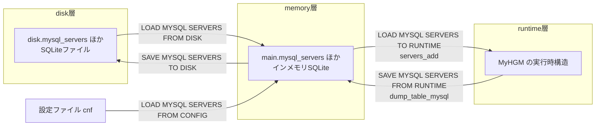

# 第21章 設定のマルチレイヤ管理

> **本章で読むソース**
>
> - [`lib/Admin_Handler.cpp`](https://github.com/sysown/proxysql/blob/v3.0.9/lib/Admin_Handler.cpp)
> - [`lib/ProxySQL_Admin.cpp`](https://github.com/sysown/proxysql/blob/v3.0.9/lib/ProxySQL_Admin.cpp)
> - [`include/proxysql_config.h`](https://github.com/sysown/proxysql/blob/v3.0.9/include/proxysql_config.h)
> - [`lib/Admin_Bootstrap.cpp`](https://github.com/sysown/proxysql/blob/v3.0.9/lib/Admin_Bootstrap.cpp)

## この章の狙い

ProxySQL の設定は、SQLite ファイルに一箇所だけ書けば済む単純な構造ではない。
`mysql_servers` テーブルを例に、設定が **disk**（SQLite ファイル）、**memory**（インメモリ SQLite の `main` スキーマ）、**runtime**（`MySQL_HostGroups_Manager` が保持する実行時構造）の3層に分かれ、`LOAD` / `SAVE` コマンドで層をまたいで移動する仕組みを読む。

## 前提

第20章で扱う Admin インターフェイスは、管理者が投げる SQL 風のコマンドを受け取って `admindb` という SQLite ハンドルを操作する。
本章はその `admindb` が実際には複数のデータベースを束ねたものであることと、そこから先の runtime への反映経路を扱う。
第13章の Hostgroups Manager を先に読んでおくと、runtime 側の構造がどう使われるかがつながる。

## 三層構造

ProxySQL の設定は次の3層を持つ。

- **disk**：`proxysql.db` などの実体ファイルとして永続化された SQLite データベースであり、プロセスを再起動しても残る。
- **memory**：`admindb`（`ProxySQL_Admin` が保持する `SQLite3DB*`）が持つインメモリ SQLite の `main` スキーマであり、管理者が `INSERT INTO mysql_servers ...` のような SQL を実行する対象になる。
- **runtime**：`MySQL_HostGroups_Manager`（グローバルポインタ `MyHGM`）が保持する C++ の実行時構造であり、実際にバックエンド接続を張るときに参照される。

memory と disk は同じ `admindb` オブジェクトの中で共存する。
`ProxySQL_Admin::flush_configdb` が disk 側のファイルを `admindb` に `ATTACH DATABASE` し、`disk` という別名（エイリアス）で参照できるようにしている。

[`lib/ProxySQL_Admin.cpp` L1242-1259](https://github.com/sysown/proxysql/blob/v3.0.9/lib/ProxySQL_Admin.cpp#L1242-L1259)

```cpp
void ProxySQL_Admin::flush_configdb() { // see #923
	wrlock();
	admindb->execute((char *)"DETACH DATABASE disk");
	delete configdb;
	configdb=new SQLite3DB();
	if (access(GloVars.admindb, F_OK) == 0) {
		if (access(GloVars.admindb, W_OK) != 0) {
			proxy_error("Database file '%s' exists but is not writable\n", GloVars.admindb);
			exit(EXIT_SUCCESS);
		}
	}
	configdb->open((char *)GloVars.admindb, SQLITE_OPEN_READWRITE | SQLITE_OPEN_CREATE | SQLITE_OPEN_FULLMUTEX);
	__attach_db(admindb, configdb, (char *)"disk");
	// Fully synchronous is not required. See to #1055
	// https://sqlite.org/pragma.html#pragma_synchronous
	configdb->execute("PRAGMA synchronous=0");
	wrunlock();
}
```

`__attach_db` は `ATTACH DATABASE '<path>' AS <alias>` を組み立てて実行するだけの薄いラッパーである。

[`lib/ProxySQL_Admin.cpp` L5972-5979](https://github.com/sysown/proxysql/blob/v3.0.9/lib/ProxySQL_Admin.cpp#L5972-L5979)

```cpp
void ProxySQL_Admin::__attach_db(SQLite3DB *db1, SQLite3DB *db2, char *alias) {
	const char *a="ATTACH DATABASE '%s' AS %s";
	int l=strlen(a)+strlen(db2->get_url())+strlen(alias)+5;
	char *cmd=(char *)malloc(l);
	snprintf(cmd, l, a, db2->get_url(), alias);
	db1->execute(cmd);
	free(cmd);
}
```

この結果、`admindb` からは同じ接続の中で `main.mysql_servers`（memory）と `disk.mysql_servers`（ディスク上のファイル）を1つの SQL 文の中で行き来できる。
`ProxySQL_Config` クラスはこれとは別の経路として、libconfig 形式の設定ファイル（`.cnf`）を読み書きし、`admindb` の `main` スキーマに反映する役割を持つ。

[`include/proxysql_config.h` L28-35](https://github.com/sysown/proxysql/blob/v3.0.9/include/proxysql_config.h#L28-L35)

```cpp
class ProxySQL_Config {
	friend class ProxySQL_Config_TestHelper;
public:
	SQLite3DB* admindb;
	/** @brief Constructs ProxySQL_Config with a database handle */
	ProxySQL_Config(SQLite3DB* db);
	/** @brief Virtual destructor */
	virtual ~ProxySQL_Config();
```

したがって設定の入り口は「SQLite ファイル」「インメモリ SQLite」「設定ファイル」の3種類あり、そのうちファイルベースの2つ（disk とコンフィグファイル）がそれぞれ独立に memory へ合流する構図になっている。

## LOAD / SAVE コマンドによる層間移動

`mysql_servers` に対する層の移動は、Admin インターフェイスに投げる `LOAD` / `SAVE` コマンドで明示的に指示する。
コマンド名のエイリアス群は `Admin_Handler.cpp` の先頭でテーブルとして定義されている。

[`lib/Admin_Handler.cpp` L205-215](https://github.com/sysown/proxysql/blob/v3.0.9/lib/Admin_Handler.cpp#L205-L215)

```cpp
const std::vector<std::string> LOAD_MYSQL_SERVERS_FROM_MEMORY = {
	"LOAD MYSQL SERVERS FROM MEMORY" ,
	"LOAD MYSQL SERVERS FROM MEM" ,
	"LOAD MYSQL SERVERS TO RUNTIME" ,
	"LOAD MYSQL SERVERS TO RUN" };

const std::vector<std::string> SAVE_MYSQL_SERVERS_TO_MEMORY = {
	"SAVE MYSQL SERVERS TO MEMORY" ,
	"SAVE MYSQL SERVERS TO MEM" ,
	"SAVE MYSQL SERVERS FROM RUNTIME" ,
	"SAVE MYSQL SERVERS FROM RUN" };
```

`LOAD MYSQL SERVERS TO RUNTIME` と `LOAD MYSQL SERVERS FROM MEMORY` が同じ配列に入っている点に注意する。
どちらの綴りで打っても memory から runtime へ読み込む同じ処理が動く。
つまりコマンド名の `MEMORY` / `RUNTIME` は「どちらから来てどちらへ行くか」の言い換えであり、配列はその両方の言い回しをエイリアスとして吸収している。

これらの配列は `Admin_Handler.cpp` の司令塔となる関数の中で、実際の処理へ振り分けられる。

[`lib/Admin_Handler.cpp` L2156-2185](https://github.com/sysown/proxysql/blob/v3.0.9/lib/Admin_Handler.cpp#L2156-L2185)

```cpp
	if ((query_no_space_length>19) && ( (!strncasecmp("SAVE MYSQL SERVERS ", query_no_space, 19)) || (!strncasecmp("LOAD MYSQL SERVERS ", query_no_space, 19)) ||
		(!strncasecmp("SAVE PGSQL SERVERS ", query_no_space, 19)) || (!strncasecmp("LOAD PGSQL SERVERS ", query_no_space, 19)))) {

		const bool is_pgsql = (query_no_space[5] == 'P' || query_no_space[5] == 'p') ? true : false;
		const std::string modname = is_pgsql ? "pgsql_servers" : "mysql_servers";

		if (FlushCommandWrapper(sess, modname, query_no_space, query_no_space_length) == true)
			return false;

		if (is_pgsql) {
			if (is_admin_command_or_alias(LOAD_PGSQL_SERVERS_FROM_MEMORY, query_no_space, query_no_space_length)) {
				ProxySQL_Admin* SPA = (ProxySQL_Admin*)pa;
				SPA->pgsql_servers_wrlock();
				SPA->load_pgsql_servers_to_runtime();
				SPA->pgsql_servers_wrunlock();
				proxy_debug(PROXY_DEBUG_ADMIN, 4, "Loaded pgsql servers to RUNTIME\n");
				SPA->send_ok_msg_to_client(sess, NULL, 0, query_no_space);
				return false;
			}
		} else {
			if (is_admin_command_or_alias(LOAD_MYSQL_SERVERS_FROM_MEMORY, query_no_space, query_no_space_length)) {
				ProxySQL_Admin* SPA = (ProxySQL_Admin*)pa;
				SPA->mysql_servers_wrlock();
				SPA->load_mysql_servers_to_runtime();
				SPA->mysql_servers_wrunlock();
				proxy_debug(PROXY_DEBUG_ADMIN, 4, "Loaded mysql servers to RUNTIME\n");
				SPA->send_ok_msg_to_client(sess, NULL, 0, query_no_space);
				return false;
			}
		}
```

このコードから、コマンド1件が2段階で処理されることが読み取れる。
まず `FlushCommandWrapper(sess, modname, ...)` が disk と memory の間の移動（`LOAD MYSQL SERVERS FROM DISK` や `SAVE MYSQL SERVERS TO DISK` など）を先に判定し、該当すればそこで処理を終えて戻る。
該当しなければ、続く `is_admin_command_or_alias` の判定で memory と runtime の間の移動（`TO RUNTIME` / `FROM RUNTIME`）を扱う。
1つの `if` ブロックの中に disk↔memory と memory↔runtime という異なる2つの層境界の処理が並んでいるのは、コマンド名の接頭辞（`LOAD MYSQL SERVERS`）が共通だからであり、実装としては明確に別の関数へ分岐している。

## disk と memory の間を汎用コードで移動する

disk↔memory の移動は、`mysql_servers` 専用のコードを書く代わりに、テーブル名のリストを渡すだけの汎用関数 `flush_GENERIC__from_to` で処理する。
対象テーブルの一覧は次のように宣言されている。

[`lib/ProxySQL_Admin.cpp` L144-152](https://github.com/sysown/proxysql/blob/v3.0.9/lib/ProxySQL_Admin.cpp#L144-L152)

```cpp
static const vector<string> mysql_servers_tablenames = {
	"mysql_servers",
	"mysql_replication_hostgroups",
	"mysql_group_replication_hostgroups",
	"mysql_galera_hostgroups",
	"mysql_aws_aurora_hostgroups",
	"mysql_hostgroup_attributes",
	"mysql_servers_ssl_params",
};
```

`mysql_servers` という1つのモジュール名の裏に、レプリケーションやガレラなどのホストグループ設定を含む7個のテーブルが束ねられている。
このリストはモジュール名からテーブル一覧を引く連想配列に登録される。

[`lib/ProxySQL_Admin.cpp` L182-192](https://github.com/sysown/proxysql/blob/v3.0.9/lib/ProxySQL_Admin.cpp#L182-L192)

```cpp
static unordered_map<string, const vector<string>&> module_tablenames = {
	{ "mysql_servers", mysql_servers_tablenames },
	{ "mysql_firewall", mysql_firewall_tablenames },
	{ "mysql_query_rules", mysql_query_rules_tablenames },
	{ "scheduler", scheduler_tablenames },
	{ "proxysql_servers", proxysql_servers_tablenames },
	{ "restapi", restapi_tablenames },
	{ "pgsql_servers", pgsql_servers_tablenames },
	{ "pgsql_firewall", pgsql_firewall_tablenames },
	{ "pgsql_query_rules", pgsql_query_rules_tablenames },
};
```

実際に SQL を組み立てて実行するのは `BQE1`（Bulk Query Execute の略と考えられる）である。

[`lib/ProxySQL_Admin.cpp` L194-206](https://github.com/sysown/proxysql/blob/v3.0.9/lib/ProxySQL_Admin.cpp#L194-L206)

```cpp
static void BQE1(SQLite3DB *db, const vector<string>& tbs, const string& p1, const string& p2, const string& p3) {
	string query;
	for (auto it = tbs.begin(); it != tbs.end(); it++) {
		if (p1 != "") {
			query = p1 + *it;
			db->execute(query.c_str());
		}
		if (p2 != "" && p3 != "") {
			query = p2 + *it + p3 + *it;
			db->execute(query.c_str());
		}
	}
}
```

`p1`、`p2`、`p3` はそれぞれ `DELETE FROM ...`、`INSERT INTO ...`、`SELECT * FROM ...` の断片であり、テーブル名を挟んで連結することで `DELETE FROM main.mysql_servers` や `INSERT INTO main.mysql_servers SELECT * FROM disk.mysql_servers` のような文が組み上がる。
`flush_GENERIC__from_to` はこの `BQE1` にモジュールのテーブル一覧を渡すだけで、コピー元とコピー先を入れ替える。

[`lib/ProxySQL_Admin.cpp` L5923-5938](https://github.com/sysown/proxysql/blob/v3.0.9/lib/ProxySQL_Admin.cpp#L5923-L5938)

```cpp
void ProxySQL_Admin::flush_GENERIC__from_to(const string& name, const string& direction) {
	assert(direction == "disk_to_memory" || direction == "memory_to_disk");
	admindb->wrlock();
	admindb->execute("PRAGMA foreign_keys = OFF");
	auto it = module_tablenames.find(name);
	assert(it != module_tablenames.end());
	if (direction == "disk_to_memory") {
		BQE1(admindb, it->second, "DELETE FROM main.", "INSERT INTO main.", " SELECT * FROM disk.");
	} else if (direction == "memory_to_disk") {
		BQE1(admindb, it->second, "DELETE FROM disk.", "INSERT INTO disk.", " SELECT * FROM main.");
	} else {
		assert(0);
	}
	admindb->execute("PRAGMA foreign_keys = ON");
	admindb->wrunlock();
}
```

呼び出し元のコマンド名（`LOAD MYSQL SERVERS FROM DISK` など）から `direction` を導く配列も、`mysql_servers` 専用に手書きするのではなく、モジュール名とコマンド語だけを渡す生成関数から作られる。

[`lib/ProxySQL_Admin.cpp` L846-866](https://github.com/sysown/proxysql/blob/v3.0.9/lib/ProxySQL_Admin.cpp#L846-L866)

```cpp
static void generate_load_save_disk_commands(std::vector<std::string>& vec1, std::vector<std::string>& vec2, const string& name) {
	string s;
	if (vec1.size() == 0) {
		s = "LOAD " + name + " TO MEMORY"; vec1.push_back(s);
		s = "LOAD " + name + " TO MEM"; vec1.push_back(s);
		s = "LOAD " + name + " FROM DISK"; vec1.push_back(s);
	}
	if (vec2.size() == 0) {
		s = "SAVE " + name + " FROM MEMORY"; vec2.push_back(s);
		s = "SAVE " + name + " FROM MEM"; vec2.push_back(s);
		s = "SAVE " + name + " TO DISK"; vec2.push_back(s);
	}
}

static void generate_load_save_disk_commands(const string& name, const string& command) {
	std::vector<std::string> vec1;
	std::vector<std::string> vec2;
	generate_load_save_disk_commands(vec1, vec2, command);
	std::tuple<string, vector<string>, vector<string>> a = tuple<string, vector<string>, vector<string>>{command, vec1, vec2};
	load_save_disk_commands[name] = a;
}
```

`mysql_servers` はこの生成関数に `"MYSQL SERVERS"` という1語を渡すだけで登録されている（呼び出し `generate_load_save_disk_commands("mysql_servers", "MYSQL SERVERS")`）。
`FlushCommandWrapper` はこの `load_save_disk_commands` からモジュール名でエイリアス配列を引き、一致すれば `flush_GENERIC__from_to` を呼ぶ。

[`lib/Admin_Handler.cpp` L493-502](https://github.com/sysown/proxysql/blob/v3.0.9/lib/Admin_Handler.cpp#L493-L502)

```cpp
template <typename S>
bool FlushCommandWrapper(S* sess, const string& modname, char *query_no_space, int query_no_space_length) {
	assert(load_save_disk_commands.find(modname) != load_save_disk_commands.end());
	tuple<string, vector<string>, vector<string>>& t = load_save_disk_commands[modname];
	if (FlushCommandWrapper(sess, get<1>(t), query_no_space, query_no_space_length, modname, "disk_to_memory") == true)
		return true;
	if (FlushCommandWrapper(sess, get<2>(t), query_no_space, query_no_space_length, modname, "memory_to_disk") == true)
		return true;
	return false;
}
```

`mysql_servers` 以外にも `mysql_firewall`、`mysql_query_rules`、`scheduler`、`restapi` など多数のモジュールが同じ生成関数を通しており、disk↔memory の移動処理そのものは1箇所にしかない。

## memory と runtime の間を移動する

memory↔runtime の移動は disk↔memory と違い、`mysql_servers` に固有の処理になる。
理由は、runtime 側が単なる SQLite テーブルではなく `MySQL_HostGroups_Manager`（`MyHGM`）が管理する C++ の実行時構造だからである。
memory から runtime へは `load_mysql_servers_to_runtime` が、memory の `mysql_servers` テーブルを読み出して `MyHGM` に渡す。

[`lib/ProxySQL_Admin.cpp` L7869-7905](https://github.com/sysown/proxysql/blob/v3.0.9/lib/ProxySQL_Admin.cpp#L7869-L7905)

```cpp
void ProxySQL_Admin::load_mysql_servers_to_runtime(const incoming_servers_t& incoming_servers,
	const runtime_mysql_servers_checksum_t& peer_runtime_mysql_server, const mysql_servers_v2_checksum_t& peer_mysql_server_v2) {
	// make sure that the caller has called mysql_servers_wrlock()
	char *error=NULL;
	int cols=0;
	int affected_rows=0;
	SQLite3_result *resultset=NULL;
	SQLite3_result *resultset_servers=NULL;
	SQLite3_result *resultset_replication=NULL;
	SQLite3_result *resultset_group_replication=NULL;
	SQLite3_result *resultset_galera=NULL;
	SQLite3_result *resultset_aws_aurora=NULL;
	SQLite3_result *resultset_hostgroup_attributes=NULL;
	SQLite3_result *resultset_mysql_servers_ssl_params=NULL;

	SQLite3_result* runtime_mysql_servers = incoming_servers.runtime_mysql_servers;
	SQLite3_result* incoming_replication_hostgroups = incoming_servers.incoming_replication_hostgroups;
	SQLite3_result* incoming_group_replication_hostgroups = incoming_servers.incoming_group_replication_hostgroups;
	SQLite3_result* incoming_galera_hostgroups = incoming_servers.incoming_galera_hostgroups;
	SQLite3_result* incoming_aurora_hostgroups = incoming_servers.incoming_aurora_hostgroups;
	SQLite3_result* incoming_hostgroup_attributes = incoming_servers.incoming_hostgroup_attributes;
	SQLite3_result* incoming_mysql_servers_ssl_params = incoming_servers.incoming_mysql_servers_ssl_params;
	SQLite3_result* incoming_mysql_servers_v2 = incoming_servers.incoming_mysql_servers_v2;

	const char *query=(char *)"SELECT hostgroup_id,hostname,port,gtid_port,status,weight,compression,max_connections,max_replication_lag,use_ssl,max_latency_ms,comment FROM main.mysql_servers ORDER BY hostgroup_id, hostname, port";
	if (runtime_mysql_servers == nullptr) {
		proxy_debug(PROXY_DEBUG_ADMIN, 4, "%s\n", query);
		admindb->execute_statement(query, &error, &cols, &affected_rows, &resultset_servers);
	} else {
		resultset_servers = runtime_mysql_servers;
	}
	//MyHGH->wrlock();
	if (error) {
		proxy_error("Error on %s : %s\n", query, error);
	} else {
		MyHGM->servers_add(resultset_servers);
	}
```

`SELECT ... FROM main.mysql_servers` が memory 側のテーブルを対象にしていること、そしてその結果を `MyHGM->servers_add(resultset_servers)` に渡している点が、memory から runtime への橋渡しの核である。
逆方向の runtime から memory への移動は `save_mysql_servers_runtime_to_database` が担い、今度は `MyHGM->dump_table_mysql("mysql_servers")` で runtime 側の構造を SQLite の結果セット形式に変換してから memory の `mysql_servers` テーブルへ書き戻す。

[`lib/ProxySQL_Admin.cpp` L7290-7304](https://github.com/sysown/proxysql/blob/v3.0.9/lib/ProxySQL_Admin.cpp#L7290-L7304)

```cpp
void ProxySQL_Admin::save_mysql_servers_runtime_to_database(bool _runtime) {
	// make sure that the caller has called mysql_servers_wrlock()
	char *query=NULL;
	string StrQuery;
	SQLite3_result *resultset=NULL;
	// dump mysql_servers
	if (_runtime) {
		query=(char *)"DELETE FROM main.runtime_mysql_servers";
	} else {
		query=(char *)"DELETE FROM main.mysql_servers";
	}
	proxy_debug(PROXY_DEBUG_ADMIN, 4, "%s\n", query);
	admindb->execute(query);
	resultset=MyHGM->dump_table_mysql("mysql_servers");
```

引数 `_runtime` が `true` のときは書き込み先が `runtime_mysql_servers` という別テーブルに切り替わる。
これは実行時の実際の状態を読み取り専用ビューとして SQL で見せるためのテーブルであり、`mysql_servers`（memory の編集対象）とは別物である。
`SELECT * FROM runtime_mysql_servers` で確認できるのは、あくまで直近に `MyHGM` からダンプした runtime のスナップショットである。

## Mermaid による全体図



図の3つの矢印はいずれも管理者が明示的に投げるコマンドに対応しており、勝手に発生する矢印は存在しない。

## 反映を明示コマンドに限定する設計の利点

この設計の要は、memory を編集しただけでは runtime に一切影響しない点にある。
管理者が `INSERT INTO mysql_servers ...` を何度実行しても、`MyHGM` が握る実行中のホストグループ構造は変わらず、`LOAD MYSQL SERVERS TO RUNTIME` を打った瞬間にだけ反映される。
これにより、複数テーブルにまたがる変更（サーバーの追加とレプリケーショングループの組み替えなど）を memory 上で組み立て終えてから、1回のコマンドでまとめて runtime へ反映できる。
仮に SQL を書くたびに即座に runtime へ反映される設計だったなら、レプリケーショングループの整合性チェック（`load_mysql_servers_to_runtime` 内で行われる、無効な組み合わせの検出など）が中間状態に対して走ってしまい、途中の一時的な不整合がエラーや誤ったフェイルオーバー判定として表面化しかねない。
`LOAD` / `SAVE` を明示コマンドとして分離しているのは、複数テーブルにまたがる変更をひとまとまりの単位として runtime に渡すための機構である。

## まとめ

`mysql_servers` の設定は disk、memory、runtime の3層に分かれ、`LOAD` / `SAVE` コマンドが層の間を明示的に移動させる。
disk↔memory の移動は `ATTACH DATABASE` で束ねた同一 SQLite 接続の中で完結し、`flush_GENERIC__from_to` と `BQE1` によってモジュール横断の汎用処理として実装されている。
memory↔runtime の移動は `MyHGM` という C++ の実行時構造が相手になるため、`load_mysql_servers_to_runtime` と `save_mysql_servers_runtime_to_database` という `mysql_servers` 専用の関数が担う。
反映が明示コマンドに限定されているおかげで、複数テーブルにまたがる変更を安全にまとめて runtime へ送り込める。

## 関連する章

- 第13章 [Hostgroups Manager とサーバー管理](../part04-backend/13-hostgroups-manager.md)（runtime 側の構造の詳細）
- 第20章 [Admin インターフェイスと SQLite 設定バックエンド](20-admin-interface.md)（`admindb` とコマンドディスパッチの基盤）
- 第22章 [ProxySQL Cluster による設定同期](22-cluster-sync.md)（他ノードとの memory 同期からの反映）
