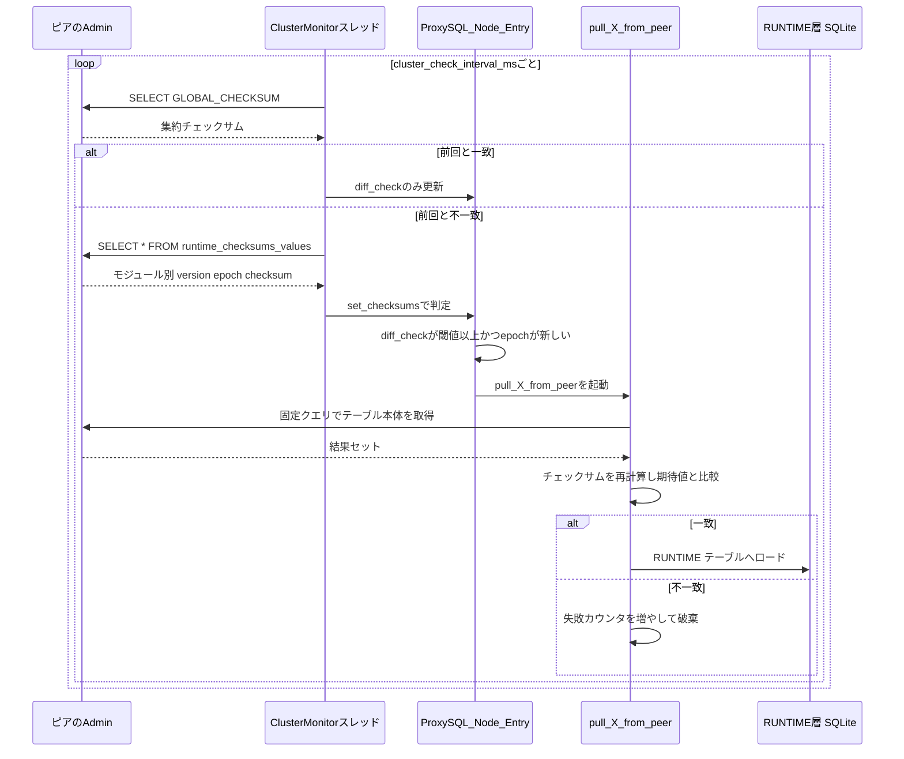

# 第22章 ProxySQL Cluster による設定同期

> **本章で読むソース**
>
> - [`lib/ProxySQL_Cluster.cpp`](https://github.com/sysown/proxysql/blob/v3.0.9/lib/ProxySQL_Cluster.cpp)
> - [`include/ProxySQL_Cluster.hpp`](https://github.com/sysown/proxysql/blob/v3.0.9/include/ProxySQL_Cluster.hpp)

## この章の狙い

複数の ProxySQL インスタンスを並べて動かすとき、片方の Admin で `mysql_servers` や `mysql_query_rules` を書き換えても、それだけでは他のインスタンスには反映されない。
**ProxySQL Cluster** は、この反映を人手を介さず自動で行う機能である。
本章は、`ProxySQL_Cluster` クラスの実装から、各ノードがどうやって他ノードとの設定差分を検知し、どの条件で取り込みに動くかという同期判定の機構を読み解く。

## 前提

ProxySQL Cluster が同期する対象は、`mysql_query_rules` や `mysql_servers` といった MySQL 系のテーブルだけではない。
`admin_variables` や `mysql_variables` などのグローバル変数群、PostgreSQL 系の `pgsql_servers` や `pgsql_query_rules`、そしてクラスタメンバー一覧である `proxysql_servers` 自身も同期対象になる。
Admin インターフェイスの全体像は第20章、`MEMORY` と `RUNTIME` と `DISK` からなる設定レイヤの構成は第21章で扱った。
本章は、その `RUNTIME` 層の内容を他ノードとどう一致させるかに絞って説明する。

## クラスタメンバーの管理

クラスタを構成するノードの一覧は、Admin の `proxysql_servers` テーブルで管理される。
このテーブルが読み込まれると `ProxySQL_Cluster_Nodes::load_servers_list` が呼ばれ、新しく現れたホストごとに専用の監視スレッドが1本立ち上がる。

[`lib/ProxySQL_Cluster.cpp` L3927-L3952](https://github.com/sysown/proxysql/blob/v3.0.9/lib/ProxySQL_Cluster.cpp#L3927-L3952)

```cpp
	for (std::vector<SQLite3_row *>::iterator it = resultset->rows.begin() ; it != resultset->rows.end(); ++it) {
		SQLite3_row *r=*it;
		ProxySQL_Node_Entry *node = NULL;
		char * h_ = r->fields[0];
		uint16_t p_ = atoi(r->fields[1]);
		uint64_t w_ = atoi(r->fields[2]);
		char * c_ = r->fields[3];
		uint64_t hash_ = generate_hash(h_, p_);
		std::unordered_map<uint64_t, ProxySQL_Node_Entry *>::iterator ite = umap_proxy_nodes.find(hash_);
		if (ite == umap_proxy_nodes.end()) {
			node = new ProxySQL_Node_Entry(h_, p_, w_ , c_);
			node->set_active(true);
			umap_proxy_nodes.insert(std::make_pair(hash_, node));

			proxy_debug(PROXY_DEBUG_CLUSTER, 5, "Added new peer %s:%d\n", h_, p_);

			ProxySQL_Node_Address * a = new ProxySQL_Node_Address(h_, p_, node->get_ipaddress());
			pthread_attr_t attr;
			pthread_attr_init(&attr);
			pthread_attr_setdetachstate(&attr, PTHREAD_CREATE_DETACHED);
			if (pthread_create(&a->thrid, &attr, ProxySQL_Cluster_Monitor_thread, (void *)a) != 0) {
				// LCOV_EXCL_START
				proxy_error("Thread creation\n");
				assert(0);
				// LCOV_EXCL_STOP
			}
```

新規ホストは `ProxySQL_Node_Entry` として `umap_proxy_nodes` に登録され、監視スレッドの起点となる `ProxySQL_Node_Address` とともに `ProxySQL_Cluster_Monitor_thread` に渡される。
テーブルの再読み込みのたびに全ノードを一旦 `set_all_inactive` で不活性化してから既存ノードを再度活性化し、最後に `remove_inactives` で消えたノードのエントリだけを削除する。
この作り方により、テーブルからホストが消えたときも、まだ生きているホストの監視スレッドやチェックサム状態を壊さずに引き継げる。

## 監視スレッドによる二段階のチェックサム比較

各ピア用に立ち上がる `ProxySQL_Cluster_Monitor_thread` は、`cluster_check_interval_ms`（デフォルト1000ミリ秒）間隔でピアに接続し続ける。
このループは、まず軽量な `SELECT GLOBAL_CHECKSUM()` だけを発行し、これが変化していない限りモジュールごとの情報は取りに行かない。

[`lib/ProxySQL_Cluster.cpp` L262-L300](https://github.com/sysown/proxysql/blob/v3.0.9/lib/ProxySQL_Cluster.cpp#L262-L300)

```cpp
				while ( glovars.shutdown == 0 && rc_query == 0 && rc_bool == true) {
					unsigned long long start_time=monotonic_time();

					rc_query = mysql_query(conn,query1);
					if ( rc_query == 0 ) {
						query_error = NULL;
						query_error_counter = 0;
						MYSQL_RES *result = mysql_store_result(conn);
						//unsigned long long after_query_time=monotonic_time();
						//unsigned long long elapsed_time_us = (after_query_time - before_query_time);
						bool update_checksum = GloProxyCluster->Update_Global_Checksum(node->hostname, node->port, result);
						mysql_free_result(result);
						// FIXME: update metrics are not updated for now. We only check checksum
						//rc_bool = GloProxyCluster->Update_Node_Metrics(node->hostname, node->port, result, elapsed_time_us);

						if (update_checksum) {
							unsigned long long before_query_time=monotonic_time();
							rc_query = mysql_query(conn,query3);
							if ( rc_query == 0 ) {
								query_error = NULL;
								query_error_counter = 0;
								MYSQL_RES *result = mysql_store_result(conn);
								rc_bool = GloProxyCluster->Update_Node_Checksums(node->hostname, node->port, result);
								mysql_free_result(result);
							} else {
								query_error = query3;
								if (query_error_counter == 0) {
									unsigned long long after_query_time=monotonic_time();
									unsigned long long elapsed_time_us = (after_query_time - before_query_time);
									proxy_error(
										"Cluster: unable to run query on %s:%d using user %s after %llums : %s . Error: %s\n",
										node->hostname, node->port, creds.user.c_str(), elapsed_time_us/1000, query_error, mysql_error(conn)
									);
								}
								if (++query_error_counter == QUERY_ERROR_RATE) query_error_counter = 0;
							}
						} else {
							GloProxyCluster->Update_Node_Checksums(node->hostname, node->port);
						}
```

`query1` は `SELECT GLOBAL_CHECKSUM()`、`query3` は `SELECT * FROM runtime_checksums_values ORDER BY name` である。
`Update_Global_Checksum` は、ピアから返った集約値がノードごとに保持している `global_checksum` と一致するかどうかを見て、変化していれば真を返す。
変化がない場合は `Update_Node_Checksums(hostname, port)` を結果セットなしで呼ぶだけであり、これは後述する `diff_check` カウンタの更新にとどまる。
つまり、集約値が一致し続ける限り、モジュール別のバージョンやチェックサムを運ぶ `runtime_checksums_values` へのクエリ自体が発行されない。

## モジュールごとのバージョンとエポックとチェックサム

`Update_Node_Checksums` が `runtime_checksums_values` の結果セットを受け取ると、`ProxySQL_Node_Entry::set_checksums` がノード側に保持するモジュールごとの状態を更新する。
この状態は `ProxySQL_Checksum_Value_2` という型で、`mysql_query_rules` や `pgsql_servers_v2` などモジュールごとに1つずつ持つ。

[`include/ProxySQL_Cluster.hpp` L309-L325](https://github.com/sysown/proxysql/blob/v3.0.9/include/ProxySQL_Cluster.hpp#L309-L325)

```cpp
	struct {
		ProxySQL_Checksum_Value_2 admin_variables;
		ProxySQL_Checksum_Value_2 mysql_variables;
		ProxySQL_Checksum_Value_2 ldap_variables;
		ProxySQL_Checksum_Value_2 mysql_query_rules;
		ProxySQL_Checksum_Value_2 mysql_servers;
		ProxySQL_Checksum_Value_2 mysql_users;
		ProxySQL_Checksum_Value_2 proxysql_servers;
		ProxySQL_Checksum_Value_2 mysql_servers_v2;
		ProxySQL_Checksum_Value_2 pgsql_query_rules;
		ProxySQL_Checksum_Value_2 pgsql_servers;
		ProxySQL_Checksum_Value_2 pgsql_users;
		ProxySQL_Checksum_Value_2 pgsql_servers_v2;
		ProxySQL_Checksum_Value_2 pgsql_variables;
	} checksums_values;
	uint64_t global_checksum;
};
```

`ProxySQL_Checksum_Value_2` は、`version`（更新のたびに単調増加する版数）と `epoch`（更新時刻）と `checksum`（内容のハッシュ）を持ち、さらに `diff_check` という整数カウンタを追加で持つ。
`version` と `epoch` と `checksum` の3つ組は、ローカルの `RUNTIME` 側でも `GloVars.checksums_values` として同じ形で保持されており、両者を突き合わせることで、自ノードとピアのどちらの設定が新しいかを判定する。

## 変更検知と `diff_check` によるデバウンス

`set_checksums` は、ピアから届いた行ごとに `process_component_checksum` を呼び出し、チェックサム文字列が前回と変わっていなければ `diff_check` を1つ増やし、変わっていれば `diff_check` を1にリセットしてから、自ノードのチェックサムと一致するかを確認する。

[`lib/ProxySQL_Cluster.cpp` L579-L627](https://github.com/sysown/proxysql/blob/v3.0.9/lib/ProxySQL_Cluster.cpp#L579-L627)

```cpp
static void process_component_checksum(
	MYSQL_ROW row,
	ProxySQL_Checksum_Value_2& checksum,
	ProxySQL_Checksum_Value& global_checksum,
	time_t now,
	bool diff_flag,
	const char* diff_sync_msg,
	const char* hostname,
	int port
) {
	checksum.version = atoll(row[1]);
	checksum.epoch = atoll(row[2]);
	checksum.last_updated = now;

	if (strcmp(checksum.checksum, row[3])) {
		strcpy(checksum.checksum, row[3]);
		checksum.last_changed = now;
		checksum.diff_check = 1;
		const char* no_sync_message = NULL;

		if (diff_flag) {
			no_sync_message = "Not syncing yet ...\n";
		} else {
			no_sync_message = diff_sync_msg;
		}

		proxy_info(
			"Cluster: detected a new checksum for %s from peer %s:%d, version %llu, epoch %llu, checksum %s . %s",
			row[0], hostname, port, checksum.version, checksum.epoch, checksum.checksum, no_sync_message
		);

		if (strcmp(checksum.checksum, global_checksum.checksum) == 0) {
			proxy_info(
				"Cluster: checksum for %s from peer %s:%d matches with local checksum %s , we won't sync.\n",
				row[0], hostname, port, global_checksum.checksum
			);
		}
	} else {
		checksum.diff_check++;
		proxy_debug(PROXY_DEBUG_CLUSTER, 5, "Checksum for %s from peer %s:%d unchanged (version %llu, epoch %llu, checksum %s vs own %s). Incremented diff_check to %d.\n",
			row[0], hostname, port, checksum.version, checksum.epoch, checksum.checksum, global_checksum.checksum, checksum.diff_check);
	}

	if (strcmp(checksum.checksum, global_checksum.checksum) == 0) {
		checksum.diff_check = 0;
		proxy_debug(PROXY_DEBUG_CLUSTER, 5, "Checksum for %s from peer %s:%d matches with local checksum %s, reset diff_check to 0.\n",
			row[0], hostname, port, global_checksum.checksum);
	}
}
```

`row[1]` から `row[3]` は、`runtime_checksums_values` の列であるモジュール名と `version` と `epoch` と `checksum` に対応する。
`diff_check` が増え続けるのは、ピアのチェックサムが自ノードと違ったまま、かつピア自身のチェックサムも変化していない状態が連続していることを意味する。
逆に、ピアのチェックサムが変わるたびに `diff_check` は1へ戻る。
この仕組みにより、ピアが設定変更の途中で一時的に不安定な値を返しても、それだけでは同期のトリガーにならない。

## 同期の判定 バージョンとエポックと閾値

`set_checksums` は、モジュールごとの `diff_check` を更新したあと、実際に同期へ進むかどうかを判定する。
この判定は `mysql_query_rules` や `mysql_servers` など、モジュールごとにほぼ同じ形で繰り返されている。

[`lib/ProxySQL_Cluster.cpp` L822-L836](https://github.com/sysown/proxysql/blob/v3.0.9/lib/ProxySQL_Cluster.cpp#L822-L836)

```cpp
	if (diff_mqr) {
		unsigned long long own_version = __sync_fetch_and_add(&GloVars.checksums_values.mysql_query_rules.version,0);
		unsigned long long own_epoch = __sync_fetch_and_add(&GloVars.checksums_values.mysql_query_rules.epoch,0);
		char* own_checksum = __sync_fetch_and_add(&GloVars.checksums_values.mysql_query_rules.checksum,0);
		v = &checksums_values.mysql_query_rules;
		const std::string v_exp_checksum { v->checksum };

		if (v->version > 1) {
			if ((own_version == 1) || (v->epoch > own_epoch)) {
				if (v->diff_check >= diff_mqr) {
					proxy_debug(PROXY_DEBUG_CLUSTER, 5, "Detected peer %s:%d with mysql_query_rules version %llu, epoch %llu, diff_check %u. Own version: %llu, epoch: %llu. Proceeding with remote sync\n", hostname, port, v->version, v->epoch, v->diff_check, own_version, own_epoch);
					proxy_info("Cluster: detected a peer %s:%d with mysql_query_rules version %llu, epoch %llu, diff_check %u. Own version: %llu, epoch: %llu. Proceeding with remote sync\n", hostname, port, v->version, v->epoch, v->diff_check, own_version, own_epoch);
					GloProxyCluster->pull_mysql_query_rules_from_peer(v_exp_checksum, v->epoch);
				}
			}
```

`diff_mqr` は `cluster_mysql_query_rules_diffs_before_sync` の値であり、Admin の変数として設定できる閾値である。
これが0であれば `mysql_query_rules` の同期は無効化され、そもそもこのブロック自体に入らない。
閾値が正のとき、同期に進む条件は次の2つがともに成り立つことである。

- 自ノードの `own_version` が1（起動直後で一度もロードしていない状態）であるか、ピアの `epoch` が自ノードより新しい。
- ピアのチェックサムが `diff_check >= diff_mqr` 回連続で一致しないまま観測されている。

後者の条件が、前節で見た `diff_check` によるデバウンスである。
`diffs_before_sync` を1より大きくしておくと、ピア側の書き込みが完了しきる前の中途半端な状態を拾って同期してしまう事態を避けやすくなる。
なお、`epoch` が自ノードと等しいままチェックサムだけが違う場合は、どちらが新しいか決められないため同期せず、`sync_conflict_mysql_query_rules_share_epoch` のカウンタを増やして警告を出すだけにとどまる（該当コードは同ファイルの直後、L837-L841）。

## 同期先ピアの選択

`set_checksums` の判定は、通知してきたそのピア1台についての判断であり、実際にどのピアから取り込むかは別途 `get_peer_to_sync_variables_module` が全既知ノードを走査して決める。

[`lib/ProxySQL_Cluster.cpp` L4205-L4257](https://github.com/sysown/proxysql/blob/v3.0.9/lib/ProxySQL_Cluster.cpp#L4205-L4257)

```cpp
	for (std::unordered_map<uint64_t, ProxySQL_Node_Entry *>::iterator it = umap_proxy_nodes.begin(); it != umap_proxy_nodes.end();) {
		ProxySQL_Node_Entry * node = it->second;
		// Use function pointer to access the correct checksum field
		ProxySQL_Checksum_Value_2 * v = config->checksum_getter(node);

		if (v->version > 1) {
			if ( v->epoch > epoch ) {
				max_epoch = v->epoch;
				if (v->diff_check >= diff_threshold) {
					epoch = v->epoch;
					version = v->version;

					// Clean up existing allocations
					if (hostname) free(hostname);
					if (ip_addr) free(ip_addr);
					if (checksum) free(checksum);
					if (secondary_checksum) free(secondary_checksum);

					// Allocate new values
					hostname=strdup(node->get_hostname());
					const char* ip = node->get_ipaddress();
					if (ip)
						ip_addr = strdup(ip);
					p = node->get_port();

					if (config->has_checksum) {
						checksum = strdup(v->checksum);
					}

					if (config->has_secondary_checksum && config->secondary_checksum_getter) {
						ProxySQL_Checksum_Value_2 * secondary_v = config->secondary_checksum_getter(node);
						if (secondary_v) {
							secondary_checksum = strdup(secondary_v->checksum);
						}
					}
				}
			}
		}

		++it;
	}

	if (epoch) {
		if (max_epoch > epoch) {
			proxy_warning("Cluster: detected a peer with %s epoch %llu, but not enough diff_check. We won't sync from epoch %llu: temporarily skipping sync\n", config->name, max_epoch, epoch);

			// Clean up allocated memory
			if (hostname) { free(hostname); hostname = NULL; }
			if (ip_addr) { free(ip_addr); ip_addr = NULL; }
			if (checksum) { free(checksum); checksum = NULL; }
			if (secondary_checksum) { free(secondary_checksum); secondary_checksum = NULL; }
		}
	}
```

このループは、既知の全ピアの中から `epoch` が最大のノードを選ぶが、そのノードの `diff_check` がまだ閾値に届いていない場合は選ばない。
その結果、`max_epoch`（最も新しいエポックを持つノードの値）と `epoch`（実際に選ばれたノードの値）がずれることがあり、そのときは「もっと新しいピアがいるがデバウンスが済んでいないので今回は同期しない」という判断になる。
次点のノードへ妥協して同期することはしない。
これにより、複数ピアが入り乱れて設定を書き換えている最中に、確定していない中間状態を取り込んでしまう事態を避けている。

## 実際の取り込み 固定クエリでの取得とチェックサムの再検証

同期先が決まると、`pull_mysql_query_rules_from_peer` のようなモジュールごとの関数が実際にピアへ接続し、固定のクエリでデータを取得する。
このクエリは、[`CLUSTER_QUERY_MYSQL_QUERY_RULES`](https://github.com/sysown/proxysql/blob/v3.0.9/include/ProxySQL_Cluster.hpp#L82)のように `ORDER BY` を伴って定義されており、行の並び順による見かけ上のチェックサム差異が起きないようにしてある。
取得した結果セットは、そのままロードするのではなく、まずローカルで改めてチェックサムを計算し、同期判定時に得た期待値と一致するかを確認する。

[`lib/ProxySQL_Cluster.cpp` L1196-L1204](https://github.com/sysown/proxysql/blob/v3.0.9/lib/ProxySQL_Cluster.cpp#L1196-L1204)

```cpp
						const uint64_t query_rules_hash =
							SQLite3_query_rules_resultset->raw_checksum() + SQLite3_query_rules_fast_routing_resultset->raw_checksum();
						const string computed_checksum { get_checksum_from_hash(query_rules_hash) };
						proxy_debug(PROXY_DEBUG_CLUSTER, 5, "Computed checksum for MySQL Query Rules from peer %s:%d : %s\n", hostname, port, computed_checksum.c_str());
						proxy_info("Cluster: Computed checksum for MySQL Query Rules from peer %s:%d : %s\n", hostname, port, computed_checksum.c_str());

						if (expected_checksum == computed_checksum) {
						proxy_debug(PROXY_DEBUG_CLUSTER, 5, "Loading to runtime MySQL Query Rules from peer %s:%d\n", hostname, port);
						proxy_info("Cluster: Loading to runtime MySQL Query Rules from peer %s:%d\n", hostname, port);
```

一致した場合だけ、`GloAdmin->load_mysql_query_rules_to_runtime` を通じて SQLite の `RUNTIME` テーブルへ流し込み、設定によっては `DISK` 層にも保存する。
一致しなかった場合は、取り込みを行わずに失敗として扱う。

[`lib/ProxySQL_Cluster.cpp` L1319-L1326](https://github.com/sysown/proxysql/blob/v3.0.9/lib/ProxySQL_Cluster.cpp#L1319-L1326)

```cpp
						} else {
							proxy_debug(PROXY_DEBUG_CLUSTER, 5, "Fetching MySQL Query Rules from peer %s:%d failed because of mismatching checksum. Expected: %s , Computed: %s\n",
								hostname, port, expected_checksum.c_str(), computed_checksum.c_str());
							proxy_info(
								"Cluster: Fetching MySQL Query Rules from peer %s:%d failed because of mismatching checksum. Expected: %s , Computed: %s\n",
								hostname, port, expected_checksum.c_str(), computed_checksum.c_str()
							);
							metrics.p_counter_array[p_cluster_counter::pulled_mysql_query_rules_failure]->Increment();
```

`expected_checksum` は、同期判定の時点でピアが申告していたチェックサムである。
これと、実際に取得したデータから計算し直した `computed_checksum` が食い違うのは、取得のあいだにピア側でさらに設定が変わった場合などに起こりうる。
このときは中途半端なデータを `RUNTIME` に反映せず、失敗カウンタを増やして次の監視サイクルに委ねる。

## 全体の流れ



## 最適化 二段階チェックサムによる差分同期

ProxySQL Cluster の同期は、ピアの設定内容そのものを毎回転送してくるわけではない。
まず `SELECT GLOBAL_CHECKSUM()` という単一の集約値だけを毎ポーリングで問い合わせ、これが変わらない限り13種類あるモジュールごとの `version` と `epoch` と `checksum` を運ぶ `runtime_checksums_values` へのクエリさえ発行しない。
さらに、そこで個々のモジュールの差分を検出できても、`mysql_query_rules` や `mysql_servers_v2` のような実データ本体（環境によっては数千行に達しうるテーブル）を取得しに行くのは、`diffs_before_sync` 回連続で差分が確定した場合に限られる。
つまり、ネットワーク越しの重いクエリは「集約チェックサム比較」「モジュール別メタデータ比較」「`diff_check` によるデバウンス確定」という3段のふるいを通過したときにだけ発生し、通常運用時のポーリングコストはピアあたり定数個の軽量クエリに抑えられている。
これにより、クラスタのノード数やクエリルールの行数が増えても、変更が実際に起きていない限り監視の負荷は一定に保たれる。

## まとめ

ProxySQL Cluster は、`proxysql_servers` テーブルで管理するピアごとに監視スレッドを持ち、集約チェックサムとモジュール別チェックサムの二段構えでポーリングコストを抑えながら差分を検知する。
検知した差分は `diff_check` によって一定回数連続するまで様子を見て、`epoch` の新旧比較とあわせて同期の可否を決める。
同期先ピアの選択は通知元1台に固定されず、既知ノード全体から最新かつ確定済みのものを選び直し、取り込んだデータもチェックサムを再検証してから初めて `RUNTIME` 層へ反映する。

なお、同リポジトリの `lib/BackendSyncDecision.cpp` はクライアントとバックエンド接続のあいだでユーザー名やスキーマや `autocommit` を一致させるための判定であり、本章の対象であるノード間の設定同期とは別の仕組みである。

## 関連する章

- 前提：[第20章 Admin インターフェイス](../part06-admin/20-admin-interface.md)
- 前提：[第21章 設定レイヤ](../part06-admin/21-config-layers.md)
- 関連：[第23章 ロギング](../part06-admin/23-logging.md)
