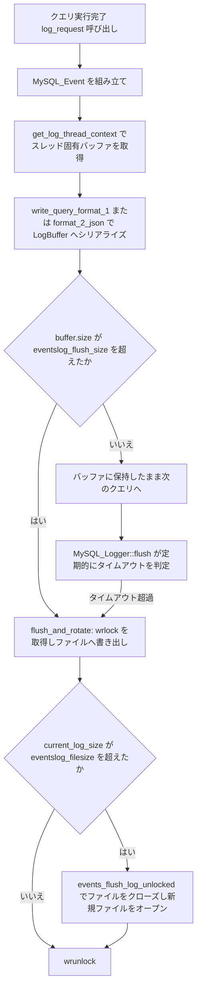

# 第23章 クエリログとロギング

> **本章で読むソース**
>
> - [`lib/MySQL_Logger.cpp`](https://github.com/sysown/proxysql/blob/v3.0.9/lib/MySQL_Logger.cpp)
> - [`include/MySQL_Logger.hpp`](https://github.com/sysown/proxysql/blob/v3.0.9/include/MySQL_Logger.hpp)
> - [`lib/log_utils.cpp`](https://github.com/sysown/proxysql/blob/v3.0.9/lib/log_utils.cpp)
> - [`include/log_utils.h`](https://github.com/sysown/proxysql/blob/v3.0.9/include/log_utils.h)

## この章の狙い

第8章で見た `COM_QUERY` のディスパッチと、第10章のクエリダイジェスト計算により、ProxySQL は1件のクエリごとにその実行内容を特定できる材料をそろえている。
本章では、その材料を使ってクエリの実行記録をファイルへ書き出す `MySQL_Logger` を読み、イベントログと監査ログという2系統のログがどのように生成され、バッファリングを経てディスクへ落ちるかを追う。

## 前提

`MySQL_Logger` はイベントログ（クエリの実行記録）と監査ログ（接続や認証の記録）を別々のファイルに書く。
どちらのログも1件の記録を `MySQL_Event` というオブジェクトで表現し、スレッドごとの `LogBuffer` に文字列としてためてから、まとめてファイルへ書き出す。
この「ためてから書く」構造が本章の中心であり、末尾の最適化の節で理由を説明する。

## イベントの生成とログ形式の分岐

クエリの実行が終わると、`MySQL_Session` から `MySQL_Logger::log_request` が呼ばれる。
この関数はセッションとデータストリームから必要な情報を集め、`MySQL_Event` を1つ組み立てる。

[`lib/MySQL_Logger.cpp L1575-L1581`](https://github.com/sysown/proxysql/blob/v3.0.9/lib/MySQL_Logger.cpp#L1575-L1581)

```cpp
	MySQL_Event me(let,
		sess->thread_session_id,ui->username,ui->schemaname,
		sess->CurrentQuery.start_time + curtime_real - curtime_mono,
		sess->CurrentQuery.end_time + curtime_real - curtime_mono,
		query_digest,
		ca, cl, sess
	);
```

引数のうち `start_time` と `end_time` は、セッションが持つ単調時計（`curtime_mono`）ベースの計測値を、実時刻（`curtime_real`）に変換したものである。
`query_digest` は第10章で説明した `Query_Processor::get_digest` の戻り値をそのまま使う。
イベント種別 `let` はデフォルトで `PROXYSQL_COM_QUERY` だが、セッションの状態が `PROCESSING_STMT_EXECUTE` や `PROCESSING_STMT_PREPARE` であれば、プリペアドステートメントの実行または準備を表す種別に切り替わる。

イベントを組み立てたあと、`MySQL_Event::write` が実際の書き出しを行う。

[`lib/MySQL_Logger.cpp L540-L551`](https://github.com/sysown/proxysql/blob/v3.0.9/lib/MySQL_Logger.cpp#L540-L551)

```cpp
uint64_t MySQL_Event::write(LogBuffer *f, MySQL_Session *sess) {
	uint64_t total_bytes=0;
	switch (et) {
		case PROXYSQL_COM_QUERY:
		case PROXYSQL_COM_STMT_EXECUTE:
		case PROXYSQL_COM_STMT_PREPARE:
			if (mysql_thread___eventslog_format==1) { // format 1 , binary
				total_bytes=write_query_format_1(f);
			} else { // format 2 , json
				total_bytes=write_query_format_2_json(f);
			}
			break;
```

`mysql-eventslog_format` の値によって、同じイベントでもバイナリ形式（フォーマット1）とJSON形式（フォーマット2）のどちらで書くかが決まる。
以降の節ではバイナリ形式を中心に見る。
バイナリ形式は自前のエンコードで各フィールドの長さを詰めるため、JSON形式より生成コストと出力サイズの両方を抑えられる。

## バイナリ形式のイベントレイアウト

`write_query_format_1` は、1件のクエリイベントを可変長フィールドの連なりとしてシリアライズする。
各フィールドの長さは、第4章で見たMySQLプロトコルの長さエンコード方式（`mysql_encode_length` / `write_encoded_length`）と同じ仕組みで前置きされる。

[`lib/MySQL_Logger.cpp L762-L787`](https://github.com/sysown/proxysql/blob/v3.0.9/lib/MySQL_Logger.cpp#L762-L787)

```cpp
uint64_t MySQL_Event::write_query_format_1(LogBuffer *f) {
	uint64_t total_bytes=0;
	total_bytes+=1; // et
	total_bytes+=mysql_encode_length(thread_id, NULL);
	username_len=strlen(username);
	total_bytes+=mysql_encode_length(username_len,NULL)+username_len;
	schemaname_len=strlen(schemaname);
	total_bytes+=mysql_encode_length(schemaname_len,NULL)+schemaname_len;

	total_bytes+=mysql_encode_length(client_len,NULL)+client_len;

	total_bytes+=mysql_encode_length(hid, NULL);
	if (hid!=UINT64_MAX) {
		total_bytes+=mysql_encode_length(server_len,NULL)+server_len;
	}

	total_bytes+=mysql_encode_length(start_time,NULL);
	total_bytes+=mysql_encode_length(end_time,NULL);
```

この関数は2段構えになっている。
前半で各フィールドをエンコードしたときの長さを積算して `total_bytes` を求め、後半でその `total_bytes` を先頭に書いてからフィールドを実際に書き出す。

[`lib/MySQL_Logger.cpp L848-L857`](https://github.com/sysown/proxysql/blob/v3.0.9/lib/MySQL_Logger.cpp#L848-L857)

```cpp
	// write total length , fixed size
	f->write((const char *)&total_bytes,sizeof(uint64_t));
	//char prefix;
	uint8_t len;

	f->write((char *)&et,1);

	len=mysql_encode_length(thread_id,buf);
	write_encoded_length(buf,thread_id,len,buf[0]);
	f->write((char *)buf,len);
```

先頭の8バイト固定長フィールドに総バイト数を書くことで、読み出し側はレコードの境界を長さから直接判定でき、フィールドを1つずつパースしなくてもレコード単位でスキップできる。
イベント種別（`et`）、スレッドID、ユーザー名、スキーマ名、クライアントアドレス、ホストグループID（`hid`）とバックエンドアドレス、開始時刻と終了時刻、影響行数、最終挿入ID、送信行数、クエリダイジェスト、クエリ文字列の順に書き込まれる。
`hid` が `UINT64_MAX` の場合はバックエンドへの接続が成立していないことを意味し、バックエンドアドレスのフィールド自体を省略する。

`PROXYSQL_COM_STMT_EXECUTE` の場合はさらにバインドパラメータの情報が続く。
パラメータ数、NULLかどうかを示すビットマップ、各パラメータの型と値を順に書く。

[`lib/MySQL_Logger.cpp L942-L957`](https://github.com/sysown/proxysql/blob/v3.0.9/lib/MySQL_Logger.cpp#L942-L957)

```cpp
			if (num_params) {
				// Build and write the null bitmap.
				// Constructing and Writing the Null Bitmap:
				// - Calculates the required bitmap size as (num_params + 7) / 8 bytes where each bit represents
				//   whether a parameter value is null.
				// - Iterates over each parameter, setting the corresponding bit in the bitmap if the parameter is null.
				// - Writes the complete null bitmap to the LogBuffer.
				size_t bitmap_size = (num_params + 7) / 8;  // one bit per parameter
				std::vector<unsigned char> null_bitmap(bitmap_size, 0);
				for (uint16_t i = 0; i < num_params; i++) {
					if (meta->is_nulls && meta->is_nulls[i]) {
						null_bitmap[i / 8] |= (1 << (i % 8));
					}
				}
				f->write(reinterpret_cast<char*>(null_bitmap.data()), bitmap_size);
```

このビットマップは、第12章のプリペアドステートメントの実行パケットで使われるNULLビットマップと同じ考え方であり、値がNULLのパラメータについてはビットを立てるだけで値本体の記録を省略する。
`mysql-eventslog_stmt_parameters` が無効、またはバインドメタデータ（`stmt_meta`）が取得できない場合は、パラメータ数を常に0として書く。
これにより、パラメータの記録可否によってレコードの構造が壊れることを防いでいる。

## スレッドローカルバッファへの書き込み

`MySQL_Event::write` はイベントの内容を直接ファイルへ書くのではなく、`LogBuffer` という文字列バッファへ書く。
`LogBuffer` は内部に `std::string` を1つ持つだけの薄いラッパーであり、`fstream` への書き込みをその場で行わない。

[`include/log_utils.h L23-L29`](https://github.com/sysown/proxysql/blob/v3.0.9/include/log_utils.h#L23-L29)

```cpp
class LogBuffer {
private:
	std::string buffer;
	uint64_t last_flush_time;

public:
	LogBuffer();
```

`log_request` は、このバッファをスレッドごとに用意している。
`get_log_thread_context` が呼び出しスレッドの `pthread_t` をキーに `LogBufferThreadContext` を引き当て、そのスレッド専用の `events` バッファと `audit` バッファへ書き込む。

[`lib/MySQL_Logger.cpp L1645-L1658`](https://github.com/sysown/proxysql/blob/v3.0.9/lib/MySQL_Logger.cpp#L1645-L1658)

```cpp
	if (events.enabled) {
		std::lock_guard<std::mutex> ctx_lock(log_ctx->buffer_lock);
		me.write(&log_ctx->events, sess);
		metrics.totalQueriesLogged.fetch_add(1, std::memory_order_relaxed);
		if (log_ctx->events.size() > static_cast<size_t>(mysql_thread___eventslog_flush_size)) {
			//add a mutex lock in a multithreaded environment, avoid to get a null pointer of events.logfile that leads to the program coredump
			flush_and_rotate(log_ctx->events, events.logfile, events.current_log_size, events.max_log_file_size,
				[this]() { wrlock(); },
				[this]() { wrunlock(); },
				[this]() { events_flush_log_unlocked(); },
				monotonic_time()
			);
		}
	}
```

ここで取得している `ctx_lock` は、そのスレッド自身の `buffer_lock` であり、`MySQL_Logger` 全体の書き込みロック（`wrlock`/`wrunlock`）とは別物である。
バッファへ文字列を追記するだけの区間では、他スレッドと共有する `wmutex` を一切取らない。
`wrlock` が登場するのは、`log_ctx->events.size()` がしきい値 `mysql-eventslog_flush_size` を超え、実際にファイルへ書き出す `flush_and_rotate` を呼ぶときだけである。

## バッファのフラッシュとログローテーション

`flush_and_rotate` はバッファの内容をファイルへ書き、必要ならファイルを切り替える共通処理である。

[`lib/log_utils.cpp L80-L107`](https://github.com/sysown/proxysql/blob/v3.0.9/lib/log_utils.cpp#L80-L107)

```cpp
bool flush_and_rotate(
	LogBuffer& buffer,
	std::fstream*& logfile,
	unsigned int& current_log_size,
	unsigned int max_log_file_size,
	std::function<void()> lock_fn,
	std::function<void()> unlock_fn,
	std::function<void()> rotate_fn,
	uint64_t reset_time)
{
	bool flushed = false;
	lock_fn();
	if (logfile) {
		buffer.flush_to_file(logfile);
		current_log_size += buffer.size();
		flushed = true;
		logfile->flush();
		if (current_log_size > max_log_file_size && rotate_fn) {
			rotate_fn();
			current_log_size = 0;
		}
	}
	unlock_fn();
	if (flushed) {
		buffer.reset(reset_time);
	}
	return flushed;
}
```

`lock_fn` と `unlock_fn` は呼び出し元が `wrlock`/`wrunlock` を渡す。
ロックを取っている区間は、バッファの内容を `fstream` へ `write` してフラッシュし、現在のログファイルサイズ `current_log_size` を加算するだけであり、バッファの再構築や次のイベントの組み立てはロックの外で行われる。
`current_log_size` が `mysql-eventslog_filesize` に相当する `max_log_file_size` を超えていれば、`rotate_fn`（`events_flush_log_unlocked`）を呼んでログファイルを閉じ、新しいファイルを開く。

ログファイルを開く `events_open_log_unlocked` は、既存のファイルを走査して連番の続きから次のファイルIDを決める。

[`lib/MySQL_Logger.cpp L1360-L1374`](https://github.com/sysown/proxysql/blob/v3.0.9/lib/MySQL_Logger.cpp#L1360-L1374)

```cpp
void MySQL_Logger::events_open_log_unlocked() {
	events.log_file_id=events_find_next_id();
	if (events.log_file_id!=0) {
		events.log_file_id=events_find_next_id()+1;
	} else {
		events.log_file_id++;
	}
	char *filen=NULL;
	if (events.base_filename[0]=='/') { // absolute path
		filen=(char *)malloc(strlen(events.base_filename)+11);
		sprintf(filen,"%s.%08d",events.base_filename,events.log_file_id);
	} else { // relative path
		filen=(char *)malloc(strlen(events.datadir)+strlen(events.base_filename)+11);
		sprintf(filen,"%s/%s.%08d",events.datadir,events.base_filename,events.log_file_id);
	}
```

ファイル名は `<base_filename>.%08d` という形式であり、末尾8桁がファイルIDになる。
新しいファイルを開いた直後、`mysql-eventslog_format` が1（バイナリ形式）であれば、`PROXYSQL_METADATA` という種別のイベントを1件だけ書き込む。

[`lib/MySQL_Logger.cpp L1382-L1403`](https://github.com/sysown/proxysql/blob/v3.0.9/lib/MySQL_Logger.cpp#L1382-L1403)

```cpp
		if (mysql_thread___eventslog_format == 1) {
			// create a new event, type PROXYSQL_METADATA, that writes the ProxySQL version as part of the payload
			LogBuffer metadata_buf;
			json j = {};
			j["version"] = string(PROXYSQL_VERSION);
			string msg = j.dump();
			MySQL_Event metaEvent(
				PROXYSQL_METADATA,    // event type for metadata
				0,                    // thread_id (0 for metadata events)
				(char*)msg.c_str(),   // using "metadata" as the username
				(char*)"",            // empty schemaname
				0,                    // start_time (current time)
				0,                    // end_time (current time)
				0,                    // query_digest not used for metadata
				(char *)"",           // client field holds the version string
				0,                    // length of version string
				nullptr               // no session associated
			);
			metaEvent.set_query((char *)"",0);
			metaEvent.write(&metadata_buf, nullptr);
			metadata_buf.flush_to_file(events.logfile);
			events.current_log_size += metadata_buf.size();
		}
```

このメタデータイベントは、ProxySQLのバージョン文字列をJSONに包んでユーザー名フィールドへ流用する形で埋め込む。
バイナリ形式のログファイル単体を後から解析するとき、どのバージョンのProxySQLが生成したファイルかをファイル先頭から判定できるようにするためのものである。

## 定期フラッシュと監査ログの分離

`log_request` が呼ばれるたびに `flush_and_rotate` が起きるわけではない。
バッファサイズがしきい値を超えていない間は、`MySQL_Logger::flush` が別経路で時間ベースの定期フラッシュを行う。

[`lib/MySQL_Logger.cpp L1877-L1892`](https://github.com/sysown/proxysql/blob/v3.0.9/lib/MySQL_Logger.cpp#L1877-L1892)

```cpp
	// eventslog
	if (is_events_logfile_open()) {
		if (log_ctx->events.size() > 0 &&
			(current_time - log_ctx->events.get_last_flush_time()) > static_cast<uint64_t>(mysql_thread___eventslog_flush_timeout) * 1000) {
			flush_and_rotate(
				log_ctx->events,
				events.logfile,
				events.current_log_size,
				events.max_log_file_size,
				[this]() { wrlock(); },
				[this]() { wrunlock(); },
				[this]() { events_flush_log_unlocked(); },
				current_time
			);
		}
	}
```

サイズによるフラッシュ（`mysql-eventslog_flush_size`）と時間によるフラッシュ（`mysql-eventslog_flush_timeout`）の2条件のどちらかが成立すればディスクへ書かれる。
アクセス頻度の低いスレッドのバッファも、この時間条件によって放置されずに定期的にファイルへ落ちる。

監査ログは、認証やセッションのクローズといったイベントを対象とし、`log_audit_entry` から書かれる。
仕組みはイベントログと共通で、同じ `LogBufferThreadContext` の `audit` バッファを使い、`audit.enabled` や `mysql-auditlog_flush_size` など監査ログ専用の設定値で制御される。

[`lib/MySQL_Logger.cpp L1808-L1820`](https://github.com/sysown/proxysql/blob/v3.0.9/lib/MySQL_Logger.cpp#L1808-L1820)

```cpp
	if (audit.enabled) {
		std::lock_guard<std::mutex> ctx_lock(log_ctx->buffer_lock);
		me.write(&log_ctx->audit, sess);
		if (log_ctx->audit.size() > static_cast<size_t>(mysql_thread___auditlog_flush_size)) {
			//add a mutex lock in a multithreaded environment, avoid to get a null pointer of audit.logfile that leads to the program coredump
			flush_and_rotate(log_ctx->audit, audit.logfile, audit.current_log_size, audit.max_log_file_size,
				[this]() { wrlock(); },
				[this]() { wrunlock(); },
				[this]() { audit_flush_log_unlocked(); },
				monotonic_time()
			);
		}
	}
```

イベントログと監査ログはファイル、設定変数、フラッシュのしきい値をそれぞれ独立に持つため、片方だけを無効化したり、片方だけログファイルサイズを変えたりできる。
`MySQL_Event::write_auth`（認証イベント用の書き込み関数）はJSON形式で1行ずつ書く点がイベントログのバイナリ形式と異なり、監査ログは可読性を優先した形式になっている。

## 処理の流れ



## 高速化の工夫 ホットパスからのファイル書き込みの切り離し

クエリ実行のたびにファイルへ直接書き込む実装であれば、ファイルディスクリプタへの `write` システムコールと、それを保護するロックの両方をクエリ1件ごとに払うことになる。
`MySQL_Logger` はこの2つを分離した。
イベントのシリアライズはスレッドローカルな `LogBuffer`（`std::string`）への追記であり、`buffer_lock` はそのスレッド自身しか競合しないため実質的にロック待ちが発生しない。
実際にファイルへ書く `flush_and_rotate` だけが全スレッド共有の `wrlock` を取るが、そこに到達する頻度は `mysql-eventslog_flush_size` バイト分のイベントをためた後、または `mysql-eventslog_flush_timeout` ミリ秒が経過した後に限られる。
その結果、クエリ処理のホットパス上でロック競合とシステムコールの回数がクエリ数ではなくフラッシュ回数に比例するようになり、高頻度にクエリをさばくスレッドほど1件あたりのロギングコストが下がる。

## まとめ

`MySQL_Logger` は、クエリの実行記録を `MySQL_Event` としてバイナリまたはJSON形式にシリアライズし、スレッドごとの `LogBuffer` にためてからファイルへ書き出す。
書き込みはサイズと時間の2条件でトリガーされ、ファイルサイズが上限を超えるとID付きのファイル名でローテーションする。
監査ログはイベントログと同じ仕組みを使いながら、設定としきい値とファイルを独立させることで、認証記録とクエリ記録を別系統として運用できるようにしている。

## 関連する章

- 第4章 MySQLプロトコル（長さエンコードの共通形式）
- 第8章 クエリのライフサイクルとコマンドディスパッチ（`log_request` の呼び出し元）
- 第10章 クエリダイジェストとトークナイザ（イベントに埋め込む `query_digest` の計算）
- 第12章 プリペアドステートメント（`COM_STMT_EXECUTE` のバインドパラメータとNULLビットマップ）
- 第20章 Adminインターフェイス（ロギング関連の設定変数の反映経路）
