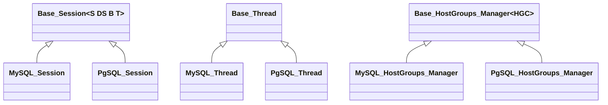
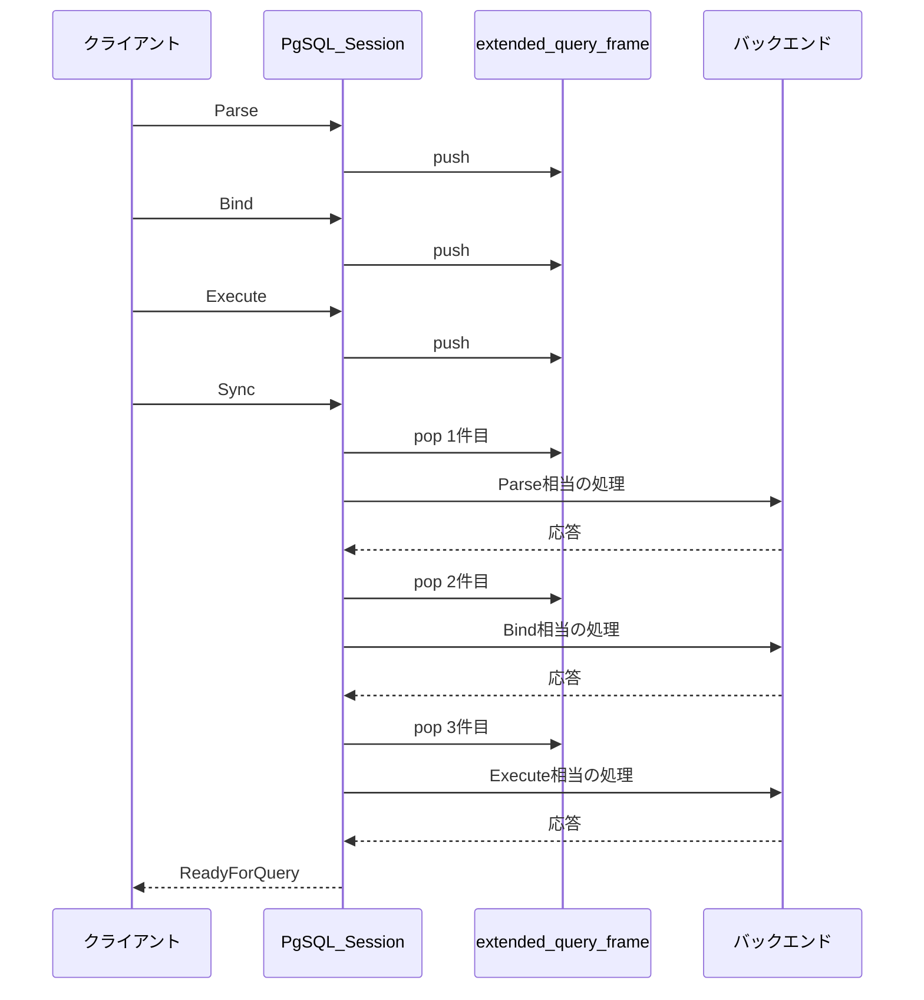
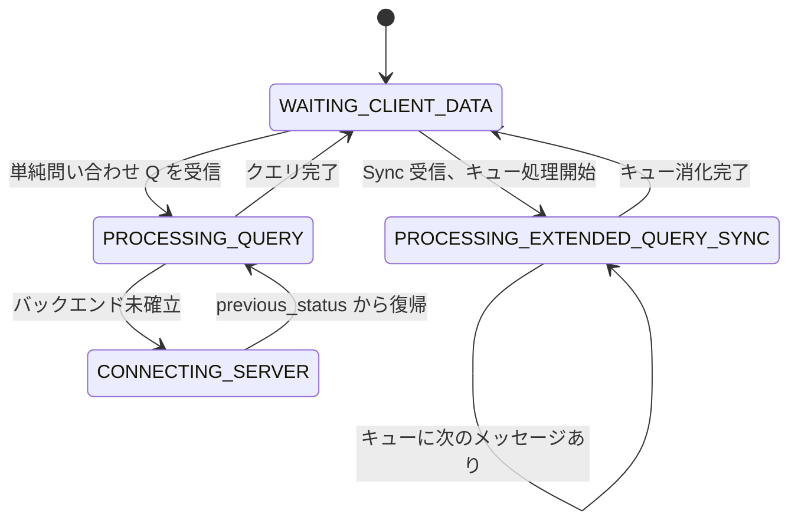

# 第24章 PostgreSQL サポートの全体像とセッション処理

> **本章で読むソース**
>
> - [`lib/PgSQL_Session.cpp`](https://github.com/sysown/proxysql/blob/v3.0.9/lib/PgSQL_Session.cpp)
> - [`include/PgSQL_Session.h`](https://github.com/sysown/proxysql/blob/v3.0.9/include/PgSQL_Session.h)
> - [`lib/PgSQL_Thread.cpp`](https://github.com/sysown/proxysql/blob/v3.0.9/lib/PgSQL_Thread.cpp)
> - [`lib/PgSQL_HostGroups_Manager.cpp`](https://github.com/sysown/proxysql/blob/v3.0.9/lib/PgSQL_HostGroups_Manager.cpp)
> - [`include/Base_Session.h`](https://github.com/sysown/proxysql/blob/v3.0.9/include/Base_Session.h)
> - [`include/Base_Thread.h`](https://github.com/sysown/proxysql/blob/v3.0.9/include/Base_Thread.h)
> - [`include/Base_HostGroups_Manager.h`](https://github.com/sysown/proxysql/blob/v3.0.9/include/Base_HostGroups_Manager.h)

## この章の狙い

ここまでの章は、MySQLプロトコルを話すクライアントを前提に、`MySQL_Session`（第7章）、`MySQL_Thread`（第2章）、`MySQL_HostGroups_Manager`（第13章）の3つを読んできた。

ProxySQLは同じプロセスの中で、PostgreSQLを話すクライアントも扱う。

その受け皿が `PgSQL_Session`、`PgSQL_Thread`、`PgSQL_HostGroups_Manager` である。

本章では、まずこの3組のクラスがどのようにコードを共有しているかを見たうえで、MySQL版と対応づけながら `PgSQL_Session` の状態機械を追う。

最後に、PostgreSQL固有の**拡張問い合わせ**（Parse/Bind/Describe/Execute/Sync）が、この状態機械の中でどう扱われるかを見る。

## 前提

第7章で説明した `session_status` による協調的マルチタスクの考え方、第2章で説明したワーカースレッドのイベントループ、第13章で説明した `MyHGC`／`MySrvC` によるホストグループ構造は、いずれも本章の前提になる。

第6章で扱った `PgSQL_Protocol` によるメッセージの解析結果（`pgsql_hdr`）も、本章で読む `get_pkts_from_client()` の入力として使われる。

## 共通基盤の抽出：Base_Session、Base_Thread、Base_HostGroups_Manager

MySQLとPostgreSQLでプロトコルの中身は大きく異なるが、「1本の接続を表すセッション」「1本のワーカースレッド」「ホストグループとサーバーの集合を管理する仕組み」という骨格は共通である。

ProxySQLはこの骨格をテンプレートクラスとして抽出し、MySQL版とPgSQL版がそれぞれ具象型を渡して継承する形にしている。

セッションの共通基盤は `Base_Session` である。

[`include/Base_Session.h` L29-L33](https://github.com/sysown/proxysql/blob/v3.0.9/include/Base_Session.h#L29-L33)

```c++
template<typename S, typename DS, typename B, typename T>
class Base_Session {
	public:
	Base_Session();
	virtual ~Base_Session();
```

`S` はセッション自身の型、`DS` はデータストリームの型、`B` はバックエンド接続の型、`T` はスレッドの型である。

`MySQL_Session` と `PgSQL_Session` は、それぞれの具象型をこの4つの引数に埋めて継承する。

[`include/MySQL_Session.h` L151](https://github.com/sysown/proxysql/blob/v3.0.9/include/MySQL_Session.h#L151)

```c++
class MySQL_Session: public Base_Session<MySQL_Session, MySQL_Data_Stream, MySQL_Backend, MySQL_Thread>
```

[`include/PgSQL_Session.h` L221](https://github.com/sysown/proxysql/blob/v3.0.9/include/PgSQL_Session.h#L221)

```c++
class PgSQL_Session : public Base_Session<PgSQL_Session, PgSQL_Data_Stream, PgSQL_Backend, PgSQL_Thread> {
```

`Base_Session` は `start_time`、`pause_until`、`status`（第7章の `session_status`）、`client_myds` など、プロトコルによらず必要なメンバとメソッドをまとめて持つ。

`MySQL_Session` と `PgSQL_Session` はこれを継承したうえで、`COM_QUERY` の処理や拡張問い合わせの処理など、プロトコル固有の部分だけを自分のクラスに追加する。

スレッドの共通基盤は `Base_Thread` である。

こちらはテンプレートではなく通常の基底クラスであり、`MySQL_Thread` と `PgSQL_Thread` がそれぞれ直接継承する。

[`include/Base_Thread.h` L39-L40](https://github.com/sysown/proxysql/blob/v3.0.9/include/Base_Thread.h#L39-L40)

```c++
class Base_Thread {
public:
```

[`include/MySQL_Thread.h` L104](https://github.com/sysown/proxysql/blob/v3.0.9/include/MySQL_Thread.h#L104)

```c++
class __attribute__((aligned(64))) MySQL_Thread : public Base_Thread
```

[`include/PgSQL_Thread.h` L152](https://github.com/sysown/proxysql/blob/v3.0.9/include/PgSQL_Thread.h#L152)

```c++
class __attribute__((aligned(64))) PgSQL_Thread : public Base_Thread
```

ホストグループ管理の共通基盤は `Base_HostGroups_Manager` である。

第13章で見た `BaseHGC`（`MyHGC` と `PgSQL_HGC` の共通基盤）が個々のホストグループを表すのに対し、`Base_HostGroups_Manager` はホストグループの集合全体を管理する側のテンプレートである。

[`include/Base_HostGroups_Manager.h` L559-L561](https://github.com/sysown/proxysql/blob/v3.0.9/include/Base_HostGroups_Manager.h#L559-L561)

```c++
template <typename HGC>
class Base_HostGroups_Manager {
	private:
```

`MySQL_HostGroups_Manager` と `PgSQL_HostGroups_Manager` は、それぞれ第13章の `MyHGC` と `PgSQL_HGC` を型引数に渡してこれを継承する。

[`include/MySQL_HostGroups_Manager.h` L498](https://github.com/sysown/proxysql/blob/v3.0.9/include/MySQL_HostGroups_Manager.h#L498)

```c++
class MySQL_HostGroups_Manager : public Base_HostGroups_Manager<MyHGC> {
```

[`include/PgSQL_HostGroups_Manager.h` L390](https://github.com/sysown/proxysql/blob/v3.0.9/include/PgSQL_HostGroups_Manager.h#L390)

```c++
class PgSQL_HostGroups_Manager : public Base_HostGroups_Manager<PgSQL_HGC> {
```

3組のクラスをまとめると、次のような構造になる。



いずれも、MySQL版とPgSQL版が「同じ形の骨格を持つが中身のプロトコル処理が違う」という関係にある。

以下では、この骨格を踏まえたうえで `PgSQL_Session` の状態機械をMySQL版との対応で読む。

## PgSQL_Session の状態機械：MySQL_Session との対応

`PgSQL_Session::handler()` の骨格は、第7章で読んだ `MySQL_Session::handler()` と同じ形をしている。

呼び出しのたびにクライアントからのパケットを取り込み、`status`（第7章の `session_status`）で分岐する `switch` に入る。

[`lib/PgSQL_Session.cpp` L3148-L3156](https://github.com/sysown/proxysql/blob/v3.0.9/lib/PgSQL_Session.cpp#L3148-L3156)

```c++
__handler_again_get_pkts_from_client:
	handler_ret = get_pkts_from_client(wrong_pass, pkt);
	if (handler_ret != 0) {
		return handler_ret;
	}

handler_again:

	switch (status) {
```

`WAITING_CLIENT_DATA`、`FAST_FORWARD`、`CONNECTING_CLIENT`、`PINGING_SERVER`、`RESETTING_CONNECTION`、`PROCESSING_QUERY` 系という主要な状態は、MySQL版とほぼ同じ役割で存在する。

[`lib/PgSQL_Session.cpp` L3275-L3278](https://github.com/sysown/proxysql/blob/v3.0.9/lib/PgSQL_Session.cpp#L3275-L3278)

```c++
	case PROCESSING_STMT_PREPARE:
	case PROCESSING_STMT_EXECUTE:
	case PROCESSING_STMT_DESCRIBE:
	case PROCESSING_QUERY: {
```

MySQL版では `PROCESSING_STMT_PREPARE` と `PROCESSING_STMT_EXECUTE` が `PROCESSING_QUERY` と同じ分岐にまとめられていた（第7章）。

`PgSQL_Session` では、これに加えて `PROCESSING_STMT_DESCRIBE` も同じ分岐に加わる。

簡易問い合わせ（単純な `Query` メッセージ、先頭バイト `'Q'`）を受け取ったときは、MySQL版の `COM_QUERY` と同様に `status` を直接 `PROCESSING_QUERY` へ書き換える。

[`lib/PgSQL_Session.cpp` L2517-L2518](https://github.com/sysown/proxysql/blob/v3.0.9/lib/PgSQL_Session.cpp#L2517-L2518)

```c++
								mybe = find_or_create_backend(current_hostgroup);
								status = PROCESSING_QUERY;
```

`CONNECTING_SERVER` によるバックエンド接続の確立、`previous_status` スタックを使った復帰という仕組みも、第7章で見たものと同じ形で存在する。

MySQL版と大きく異なるのは、`PgSQL_Session` にしかない `PROCESSING_EXTENDED_QUERY_SYNC` という状態である。

[`lib/PgSQL_Session.cpp` L3166-L3168](https://github.com/sysown/proxysql/blob/v3.0.9/lib/PgSQL_Session.cpp#L3166-L3168)

```c++
	case PROCESSING_EXTENDED_QUERY_SYNC:
	{
		int rc = handler___status_PROCESSING_EXTENDED_QUERY_SYNC();
```

この状態は、PostgreSQLの**拡張問い合わせ**（Parse/Bind/Describe/Execute）をひとまとめに処理するためのものであり、MySQLプロトコルには対応するものがない。

次節でこの状態の中身を扱う。

## 拡張問い合わせプロトコルへの対応

PostgreSQLの拡張問い合わせは、`Parse`（クエリの構文解析とプリペアドステートメント作成）、`Bind`（パラメータの束縛とポータル作成）、`Describe`（列定義の問い合わせ）、`Execute`（ポータルの実行）、`Close`（ステートメントやポータルの破棄）という複数のメッセージを、クライアントが応答を待たずに連続して送れる仕組みである。

クライアントは最後に `Sync` を送り、それまでに送った一連のメッセージの処理結果と `ReadyForQuery` をまとめて受け取る。

`get_pkts_from_client()` は、メッセージ種別のバイトで `Parse`／`Describe`／`Close`／`Bind`／`Execute` を振り分け、それぞれ専用のハンドラへ渡す。

[`lib/PgSQL_Session.cpp` L2559-L2593](https://github.com/sysown/proxysql/blob/v3.0.9/lib/PgSQL_Session.cpp#L2559-L2593)

```c++
						// Extended Query Handling
						case 'P':
							extended_query_phase = EXTQ_PHASE_BUILDING;
							if (handler___status_WAITING_CLIENT_DATA___STATE_SLEEP___PGSQL_PARSE(pkt) == false) {
								handler_ret = -1;
								return handler_ret;
							}
							break;
						case 'D':
							extended_query_phase = EXTQ_PHASE_BUILDING;
							if (handler___status_WAITING_CLIENT_DATA___STATE_SLEEP___PGSQL_DESCRIBE(pkt) == false) {
								handler_ret = -1;
								return handler_ret;
							}
							break;
						case 'C':
							extended_query_phase = EXTQ_PHASE_BUILDING;
							if (handler___status_WAITING_CLIENT_DATA___STATE_SLEEP___PGSQL_CLOSE(pkt) == false) {
								handler_ret = -1;
								return handler_ret;
							}
							break;
						case 'B':
							extended_query_phase = EXTQ_PHASE_BUILDING;
							if (handler___status_WAITING_CLIENT_DATA___STATE_SLEEP___PGSQL_BIND(pkt) == false) {
								handler_ret = -1;
								return handler_ret;
							}
							break;
						case 'E':
							extended_query_phase = EXTQ_PHASE_BUILDING;
							if (handler___status_WAITING_CLIENT_DATA___STATE_SLEEP___PGSQL_EXECUTE(pkt) == false) {
								handler_ret = -1;
								return handler_ret;
							}
							break;
```

これらのハンドラは、メッセージをその場でバックエンドへ送るのではなく、`extended_query_frame` という `std::queue` へ積むだけである。

`Parse` の処理を例にとると、このことがはっきり見える。

[`lib/PgSQL_Session.cpp` L7295-L7306](https://github.com/sysown/proxysql/blob/v3.0.9/lib/PgSQL_Session.cpp#L7295-L7306)

```c++
	std::unique_ptr<PgSQL_Parse_Message> parse_msg(new PgSQL_Parse_Message());
	bool rc = parse_msg->parse(pkt);
	if (rc == false) {
		l_free(pkt.size, pkt.ptr);
		client_myds->setDSS_STATE_QUERY_SENT_NET();
		client_myds->myprot.generate_error_packet(true, false, "invalid string in message", PGSQL_ERROR_CODES::ERRCODE_PROTOCOL_VIOLATION,
			true, true);
		writeout();
		return false;
	}
	extended_query_frame.push(std::move(parse_msg)); // we will process it later, after sync packet
	return true;
```

キューに積まれたメッセージが実際に処理されるのは、`Sync`（先頭バイト `'S'`）を受け取ったときである。

[`lib/PgSQL_Session.cpp` L7218-L7230](https://github.com/sysown/proxysql/blob/v3.0.9/lib/PgSQL_Session.cpp#L7218-L7230)

```c++
	if (extended_query_frame.empty() == true) {
		client_myds->setDSS_STATE_QUERY_SENT_NET();
		unsigned int nTxn = NumActiveTransactions();
		const char txn_state = (nTxn ? 'T' : 'I');
		client_myds->myprot.generate_ready_for_query_packet(true, txn_state);
		writeout();
		client_myds->DSS = STATE_SLEEP;
		status = WAITING_CLIENT_DATA;
		extended_query_phase = EXTQ_PHASE_IDLE;
		return 0;
	}

	return handler___status_PROCESSING_EXTENDED_QUERY_SYNC();
```

キューが空でなければ、`handler___status_PROCESSING_EXTENDED_QUERY_SYNC()` がキューの先頭を1個取り出し、そのメッセージの種類に応じたハンドラへディスパッチする。

[`lib/PgSQL_Session.cpp` L7236-L7273](https://github.com/sysown/proxysql/blob/v3.0.9/lib/PgSQL_Session.cpp#L7236-L7273)

```c++
	auto packet = std::move(extended_query_frame.front()); // get the packet from the queue
	extended_query_frame.pop(); // remove the packet from the queue

	int rc = -1;

	rc = std::visit([&](auto&& msg_ptr) -> int {
		using T = std::decay_t<decltype(msg_ptr)>;
		if constexpr (std::is_same_v<T, std::unique_ptr<PgSQL_Parse_Message>>) {
			extended_query_phase = (extended_query_phase & ~EXTQ_PHASE_PROCESSING_MASK)
				| EXTQ_PHASE_PROCESSING_PARSE;
			return handle_post_sync_parse_message(msg_ptr.get());
		}
		else if constexpr (std::is_same_v<T, std::unique_ptr<PgSQL_Describe_Message>>) {
			extended_query_phase = (extended_query_phase & ~EXTQ_PHASE_PROCESSING_MASK)
				| EXTQ_PHASE_PROCESSING_DESCRIBE;
			return handle_post_sync_describe_message(msg_ptr.get());
		}
		else if constexpr (std::is_same_v<T, std::unique_ptr<PgSQL_Close_Message>>) {
			extended_query_phase = (extended_query_phase & ~EXTQ_PHASE_PROCESSING_MASK)
				| EXTQ_PHASE_PROCESSING_CLOSE;
			return handle_post_sync_close_message(msg_ptr.get());
		}
		else if constexpr (std::is_same_v<T, std::unique_ptr<PgSQL_Bind_Message>>) {
			extended_query_phase = (extended_query_phase & ~EXTQ_PHASE_PROCESSING_MASK)
				| EXTQ_PHASE_PROCESSING_BIND;
			return handle_post_sync_bind_message(msg_ptr.get());
		}
		else if constexpr (std::is_same_v<T, std::unique_ptr<PgSQL_Execute_Message>>) {
			extended_query_phase = (extended_query_phase & ~EXTQ_PHASE_PROCESSING_MASK)
				| EXTQ_PHASE_PROCESSING_EXECUTE;
			return handle_post_sync_execute_message(msg_ptr.get());
		}
		else {
			proxy_error("Unknown extended query message\n");
			assert(false);
			return -1;
		}
		}, packet);
```

`std::variant` と `std::visit` を使うことで、キューに積まれた5種類のメッセージ型を1つのコンテナで扱いながら、型ごとに異なるハンドラへ振り分けている。

1個のメッセージの処理がバックエンドへの問い合わせで完結せず応答待ちになった場合、`handler()` の外側の `switch` は `status` を `PROCESSING_EXTENDED_QUERY_SYNC` に置いたまま抜け、次にバックエンドから応答が届いたときに同じ状態から再開する。

[`lib/PgSQL_Session.cpp` L3166-L3179](https://github.com/sysown/proxysql/blob/v3.0.9/lib/PgSQL_Session.cpp#L3166-L3179)

```c++
	case PROCESSING_EXTENDED_QUERY_SYNC:
	{
		int rc = handler___status_PROCESSING_EXTENDED_QUERY_SYNC();
		if (rc == -1) { 
			handler_ret = -1;
			return handler_ret;
		}

		// Extended query synchronization complete; clean up and prepare for next command
		if (rc == 0) {
			if (extended_query_frame.empty() == false) {
				NEXT_IMMEDIATE(PROCESSING_EXTENDED_QUERY_SYNC);
			}

			proxy_debug(PROXY_DEBUG_MYSQL_COM, 5, "Extended query sync completed for session %p\n", this);
```

1個のメッセージの処理が完了し、キューにまだ次のメッセージが残っていれば `NEXT_IMMEDIATE(PROCESSING_EXTENDED_QUERY_SYNC)` で同じ状態へ即座に戻り、`switch` に入り直してキューの次の要素を取り出す。

キューが空になった時点で、`WAITING_CLIENT_DATA` に戻ってクライアントからの次のメッセージを待つ。

この様子をまとめると、次のようになる。



`status` は `PROCESSING_EXTENDED_QUERY_SYNC` に留まったまま、キューの要素数だけ `handler()` の呼び出しをまたいで自己遷移を繰り返す。

これも第7章で見た「専用の待機状態を作らず、既存の状態に留まって次の呼び出しを待つ」という設計の一例である。

状態遷移だけを取り出すと、次のようになる。



## 最適化：Parse/Bind/Execute のキューイングによるバックエンド往復の抑制

PostgreSQLの拡張問い合わせは、本来クライアントが `Parse`／`Bind`／`Execute` を1個ずつ送って、そのつど応答を待つこともできるプロトコルである。

ProxySQLがもしメッセージを受け取るたびにバックエンドへ転送し、応答を待ってからクライアントへ返していたら、`Parse`、`Bind`、`Execute`、`Sync` の4個のメッセージそれぞれについて、フロントエンド発のパケット処理とバックエンドとの往復が発生する。

`extended_query_frame` へのキューイングは、この構造を変える。

クライアントから届いた `Parse`／`Bind`／`Describe`／`Execute`／`Close` は、`Sync` が届くまでバックエンドへは一切送らずキューに積むだけにとどめる。

`Sync` が届いた時点で初めてキューを1件ずつ取り出し、`PROCESSING_EXTENDED_QUERY_SYNC` に留まったまま連続してバックエンドとやり取りする。

こうすることで、クライアント側からは複数メッセージをまとめて送れるパイプライン処理の恩恵をそのまま受けつつ、バックエンドとの接続確立や送信のタイミングを「必要になった `Sync` の直前」に一本化できる。

`Parse` や `Bind` の時点ではバックエンド接続がまだなくても処理を先へ進められるため、クライアントからの入力を受け取るたびにバックエンド接続の有無を確認する必要がなくなる。

## まとめ

`PgSQL_Session`、`PgSQL_Thread`、`PgSQL_HostGroups_Manager` は、それぞれ `Base_Session`、`Base_Thread`、`Base_HostGroups_Manager` という共通の基盤を、MySQL版の `MySQL_Session`、`MySQL_Thread`、`MySQL_HostGroups_Manager` と共有している。

`PgSQL_Session` の状態機械は、`status` と `handler()` による協調的マルチタスクという骨格を第7章のMySQL版から引き継ぎつつ、PostgreSQL固有の拡張問い合わせを扱うため `PROCESSING_EXTENDED_QUERY_SYNC` という状態を追加している。

`Parse`／`Bind`／`Describe`／`Execute`／`Close` の各メッセージは `Sync` が届くまで `extended_query_frame` というキューに積まれ、`Sync` を契機にまとめてバックエンドへ処理される。

## 関連する章

- 第2章「スレッドモデルと MySQL_Thread のイベントループ」：`Base_Thread` を継承する側の実装。
- 第6章「PostgreSQL プロトコル対応」：本章で扱うメッセージを解析する `PgSQL_Protocol` 層。
- 第7章「MySQL_Session の状態機械」：`status` と `handler()` による状態機械の基本形。
- 第12章「プリペアドステートメント」：MySQL版の `PROCESSING_STMT_PREPARE`／`PROCESSING_STMT_EXECUTE` との対比。
- 第13章「Hostgroups Manager とサーバー管理」：`BaseHGC`／`MyHGC`／`PgSQL_HGC` によるホストグループ表現。
