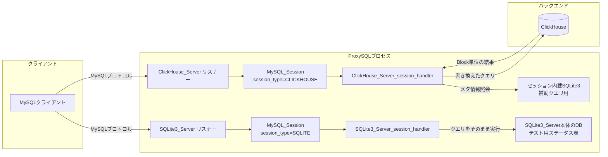

# 第25章 ClickHouse と SQLite3 サーバーの統合

> **本章で読むソース**
>
> - [`lib/ClickHouse_Server.cpp`](https://github.com/sysown/proxysql/blob/v3.0.9/lib/ClickHouse_Server.cpp)
> - [`include/ClickHouse_Server.h`](https://github.com/sysown/proxysql/blob/v3.0.9/include/ClickHouse_Server.h)
> - [`src/SQLite3_Server.cpp`](https://github.com/sysown/proxysql/blob/v3.0.9/src/SQLite3_Server.cpp)

## この章の狙い

これまでの章では、ProxySQL がクライアントから見て1つの MySQL サーバーとして振る舞い、内部では複数の MySQL バックエンドへクエリを振り分ける経路を追ってきた。
第4章で扱った**MySQL プロトコル**の実装と、第7章で扱ったセッション状態機械は、実はバックエンドが MySQL でなくても再利用できる形に切り出されている。
本章では、その再利用の実例として、`ClickHouse_Server` と `SQLite3_Server` という2つの補助モジュールを読む。
どちらもクライアントには通常の MySQL サーバーとして見えながら、内部では別種のデータストアへクエリを渡す。

## 前提

ProxySQL 本体の MySQL 経路では、`MySQL_Session` がクライアント接続ごとに1つ生成され、`client_myds->DSS` の状態遷移と `MySQL_Protocol` によるパケット生成でクライアントとやり取りする（第7章）。
本章で扱う2つのモジュールは、この `MySQL_Session` とプロトコル層をそのまま借用し、`MySQL_Session::handler_function` に自前のコールバックを差し込むことでバックエンドの実体だけを差し替える。
ProxySQL Admin（第20章）が SQLite3 データベースをそのまま設定ストアとして使っているのに対し、本章の2つのモジュールは Admin とは別に、独立した TCP リスナーを持つ点が異なる。

## ClickHouse バックエンドへの接続

`ClickHouse_Server` は、ProxySQL が ClickHouse（列指向の分析用データベース）をバックエンドとして扱うためのモジュールである。
ビルド時に `PROXYSQLCLICKHOUSE` が定義されている場合にのみ組み込まれる。

`ClickHouse_Session` は、セッションごとに ClickHouse クライアントへの接続を保持するクラスである。

[`include/ClickHouse_Server.h L16-27`](https://github.com/sysown/proxysql/blob/v3.0.9/include/ClickHouse_Server.h#L16-L27)

```cpp
class ClickHouse_Session {
   public:
	SQLite3DB *sessdb;
	bool transfer_started;
	bool schema_initialized;
	uint8_t sid;	
	ClickHouse_Session();
	bool init();
	bool connected;
	~ClickHouse_Session();
	clickhouse::Client *client;
};
```

`sessdb` は ClickHouse の内蔵クライアントとは別に、`SHOW VARIABLES` のような ClickHouse が理解しない補助クエリをその場で処理するための、インメモリ SQLite3 データベースである。
`client` が実際の ClickHouse 接続であり、`ClickHouse_Session::init()` の中で生成される。

[`lib/ClickHouse_Server.cpp L1340-L1358`](https://github.com/sysown/proxysql/blob/v3.0.9/lib/ClickHouse_Server.cpp#L1340-L1358)

```cpp
bool ClickHouse_Session::init() {
	bool ret=false;
	char *hostname = NULL;
	char *port = NULL;
	hostname = GloClickHouseServer->get_variable((char *)"hostname");
	port = GloClickHouseServer->get_variable((char *)"port");
	try {
		clickhouse::ClientOptions co;
		co.SetHost(hostname);
		co.SetPort(atoi(port));
		co.SetCompressionMethod(CompressionMethod::None);
		client = NULL;
		client = new clickhouse::Client(co);
		ret=true;
	} catch (const std::exception& e) {
		std::cerr << "Connection to ClickHouse failed: " << e.what() << std::endl;	
		ret=false;
	}
	connected = ret;
```

接続先のホスト名とポートは `ClickHouse_Server` の変数から読み出す。
つまり ProxySQL の他モジュールが持つ `read_only` や `hostgroup` のような接続プール機構は使わず、ClickHouse 接続は ProxySQL プロセス全体で単一の設定を指す。

## 専用リスナーとセッション生成

`ClickHouse_Server::init()` は、Admin（第20章）とは独立した `pthread` を起動し、その中で `accept()` ループを回す。

[`lib/ClickHouse_Server.cpp L1647-L1673`](https://github.com/sysown/proxysql/blob/v3.0.9/lib/ClickHouse_Server.cpp#L1647-L1673)

```cpp
bool ClickHouse_Server::init() {
//	cpu_timer cpt;

	child_func[0]=child_mysql;
	main_shutdown=0;
	main_poll_nfds=0;
	main_poll_fds=NULL;
	main_callback_func=NULL;

	main_callback_func=(int *)malloc(sizeof(int)*MAX_SQLITE3SERVER_LISTENERS);
	main_poll_fds=(struct pollfd *)malloc(sizeof(struct pollfd)*MAX_SQLITE3SERVER_LISTENERS);
	main_poll_nfds=0;

	S_amll.update_ifaces(variables.mysql_ifaces, &S_amll.ifaces_mysql);


	pthread_t ClickHouse_Server_thr;
	struct _main_args *arg=(struct _main_args *)malloc(sizeof(struct _main_args));
	arg->nfds=main_poll_nfds;
	arg->fds=main_poll_fds;
	arg->shutdown=&main_shutdown;
	arg->callback_func=main_callback_func;
	if (pthread_create(&ClickHouse_Server_thr, NULL, sqlite3server_main_loop, (void *)arg) !=0 ) {
		perror("Thread creation");
		exit(EXIT_FAILURE);
	}
```

既定では `mysql_ifaces` 変数の値 `0.0.0.0:6090` で待ち受ける。
接続が来るたびに `child_mysql()` がスレッドとして起動され、そこで `MySQL_Session` を生成して `session_type` に `PROXYSQL_SESSION_CLICKHOUSE` を設定する。

[`lib/ClickHouse_Server.cpp L1399-L1408`](https://github.com/sysown/proxysql/blob/v3.0.9/lib/ClickHouse_Server.cpp#L1399-L1408)

```cpp
	ClickHouse_Session *sqlite_sess = new ClickHouse_Session();
	sqlite_sess->init();
	mysql_thr->gen_args = (void *)sqlite_sess;

	GloMyQPro->init_thread();
	mysql_thr->refresh_variables();
	sess=mysql_thr->create_new_session_and_client_data_stream<MySQL_Thread, MySQL_Session*>(client);
	sess->thread=mysql_thr;
	sess->session_type = PROXYSQL_SESSION_CLICKHOUSE;
	sess->handler_function=ClickHouse_Server_session_handler;
	myds=sess->client_myds;
```

`create_new_session_and_client_data_stream()` は、第7章で見た通常の MySQL 経路と同じ関数である。
違うのは `handler_function` に `ClickHouse_Server_session_handler` を差し込んでいる点だけであり、`MySQL_Session::handler()` が `COM_QUERY` を処理する段階でこのコールバックへ制御を渡す。
ここに、MySQL プロトコルの実装を使い回しながらバックエンドだけを差し替える、この統合の骨格がある。

## MySQL クエリ文字列から ClickHouse 呼び出しへの変換

`ClickHouse_Server_session_handler()` は、クライアントから届いた `COM_QUERY` の文字列を先頭から順に照合し、MySQL クライアント（`mysql` コマンドラインツールや各種 ORM）が接続直後に発行する定型クエリを ClickHouse 側の語彙へ書き換える。
たとえば `SET AUTOCOMMIT` のような ClickHouse に存在しない文は、そのまま `OK` パケットを返して読み捨てる。

[`lib/ClickHouse_Server.cpp L620-L636`](https://github.com/sysown/proxysql/blob/v3.0.9/lib/ClickHouse_Server.cpp#L620-L636)

```cpp
	if (sess->session_type == PROXYSQL_SESSION_CLICKHOUSE) {
		if (!strncasecmp("SET ", query_no_space, 4)) {
			if (
				!strncasecmp("SET AUTOCOMMIT", query_no_space, 14) ||
				!strncasecmp("SET NAMES ", query_no_space, 10) ||
				!strncasecmp("SET FOREIGN_KEY_CHECKS",query_no_space,22) ||
				!strncasecmp("SET CHARACTER", query_no_space, 13) ||
				!strncasecmp("SET COLLATION", query_no_space, 13) ||
				!strncasecmp("SET SQL_AUTO_", query_no_space, 13) ||
				!strncasecmp("SET SQL_SAFE_", query_no_space, 13) ||
				!strncasecmp("SET SESSION TRANSACTION", query_no_space, 23) ||
				!strncasecmp("SET WAIT_TIMEOUT", query_no_space, 16)
			) {
				GloClickHouseServer->send_MySQL_OK(&sess->client_myds->myprot, NULL);
				run_query=false;
				goto __run_query;
			}
		}	
```

この関数の後半には、`SHOW COLUMNS FROM` を `DESC` に、`SHOW VARIABLES LIKE` を ClickHouse の `system` スキーマに対する `SELECT` に置き換えるといった、数十件の個別ルールが並ぶ。
一致した結果は3種類に分かれる。
`run_query` が真のまま `__run_query` へ飛ぶものは書き換え後の文字列を ClickHouse へ実際に送る経路であり、`run_query_sqlite` が真になるものは ClickHouse ではなく前述のセッション内蔵 SQLite3 データベースへ送る経路である。
`SHOW VARIABLES LIKE` のような、ClickHouse には存在しない MySQL 固有のメタ情報照会がここに振り分けられる。

[`lib/ClickHouse_Server.cpp L1319-L1329`](https://github.com/sysown/proxysql/blob/v3.0.9/lib/ClickHouse_Server.cpp#L1319-L1329)

```cpp
__run_query_sqlite: // we are introducing this new section to send some query to internal sqlite to simplify the execution of dummy queries

	if (run_query_sqlite) {
		ClickHouse_Session *sqlite_sess = (ClickHouse_Session *)sess->thread->gen_args;
		sqlite_sess->sessdb->execute_statement(query, &error , &cols , &affected_rows , &resultset);
		bool deprecate_eof_active = sess->client_myds->myconn->options.client_flag & CLIENT_DEPRECATE_EOF;
		sess->SQLite3_to_MySQL(resultset, error, affected_rows, &sess->client_myds->myprot, false, deprecate_eof_active);
		delete resultset;
		l_free(pkt->size-sizeof(mysql_hdr),query_no_space); // it is always freed here
		l_free(query_length,query);
	}
```

`SQLite3_to_MySQL()` は `MySQL_Session` が備えるメソッドで、SQLite3 の実行結果を MySQL のカラム定義パケットと行パケットへ変換する。
第6章で見た pgsql 経路が pgsql 独自の結果形式を MySQL パケットへ詰め替えたのと同じ役割を、ここでは SQLite3 の結果に対して果たしている。

書き換えの対象にならなかった通常の `SELECT` は、ClickHouse クライアントライブラリの `Select()` へそのまま渡される。

[`lib/ClickHouse_Server.cpp L1247-L1268`](https://github.com/sysown/proxysql/blob/v3.0.9/lib/ClickHouse_Server.cpp#L1247-L1268)

```cpp
					if (expected_resultset) {
						clickhouse_sess->client->Select(query, [](const Block& block) { ClickHouse_to_MySQL(block); } );

  						MySQL_Protocol *myprot=NULL;
	  					myprot=&sess->client_myds->myprot; assert(myprot);
  						MySQL_Data_Stream *myds=myprot->get_myds();

						if (clickhouse_sess->transfer_started) {
							myds->DSS=STATE_ROW;
							bool deprecate_eof_active = sess->client_myds->myconn->options.client_flag & CLIENT_DEPRECATE_EOF;
							if (deprecate_eof_active) {
								myprot->generate_pkt_OK(true, NULL, NULL, clickhouse_sess->sid, 0, 0, 2, 0, NULL, true);
								clickhouse_sess->sid++;
							} else {
								myprot->generate_pkt_EOF(true, NULL, NULL, clickhouse_sess->sid, 0, 2);
								clickhouse_sess->sid++;
							}
						} else {
							myprot->generate_pkt_OK(true,NULL,NULL,1,0,0,2,0,(char *)"");
						}
	  					myds->DSS=STATE_SLEEP;
						clickhouse_sess->transfer_started=false;
					} else {
```

`clickhouse::Client::Select()` は、ClickHouse クライアントライブラリの流儀に従い、結果を1ブロックずつコールバック `ClickHouse_to_MySQL()` へ渡す。
このコールバックが、ClickHouse の列指向データ（`Block`）を MySQL のカラム定義パケットと行パケットへ1ブロックごとに変換し、`myprot->generate_pkt_field()` や `generate_pkt_row()` で直接クライアントへ書き出す。
結果セット全体をいったんメモリに集約してから変換するのではなく、ClickHouse から届いたブロック単位でその都度 MySQL パケットへ変換して送り出す。
この段階的な変換により、大量の行を返すクエリでも ProxySQL 側に結果全体を保持するバッファを確保する必要がない。

## Mermaid で見る構造



## SQLite3 サーバー

`SQLite3_Server` も `ClickHouse_Server` と同じ骨格を持つ独立モジュールである。
ただし、その役割はまったく異なる。
`SQLite3_Server` はバックエンドを持たず、`SQLite3DB` そのものをクエリの実行先とする。

[`src/SQLite3_Server.cpp L1063-L1066`](https://github.com/sysown/proxysql/blob/v3.0.9/src/SQLite3_Server.cpp#L1063-L1066)

```cpp
	MySQL_Session *sess=mysql_thr->create_new_session_and_client_data_stream<MySQL_Thread, MySQL_Session*>(client);
	sess->thread=mysql_thr;
	sess->session_type = PROXYSQL_SESSION_SQLITE;
	sess->handler_function=SQLite3_Server_session_handler;
```

セッションハンドラは、クエリをほぼそのまま `sessdb->execute_statement()` に渡す。

[`src/SQLite3_Server.cpp L917-L925`](https://github.com/sysown/proxysql/blob/v3.0.9/src/SQLite3_Server.cpp#L917-L925)

```cpp
		SQLite3_Session *sqlite_sess = (SQLite3_Session *)sess->thread->gen_args;
		if (sess->autocommit==false) {
			sqlite3 *db = sqlite_sess->sessdb->get_db();
			if ((*proxy_sqlite3_get_autocommit)(db)==1) {
				// we defer the creation of the transaction to simulate how MySQL works
				sqlite_sess->sessdb->execute("BEGIN IMMEDIATE");
			}
		}
		sqlite_sess->sessdb->execute_statement(query, &error , &cols , &affected_rows , &resultset);
```

既定のリスナーは `127.0.0.1:6030` であり、`ClickHouse_Server` のような外部との統合ではなく、`TEST_AURORA` や `TEST_GALERA` などのビルドフラグが立った場合にのみ、`REPLICA_HOST_STATUS` や `HOST_STATUS_GALERA` といったテーブルを内蔵 SQLite3 データベースへ作成する。

[`src/SQLite3_Server.cpp L1416-L1418`](https://github.com/sysown/proxysql/blob/v3.0.9/src/SQLite3_Server.cpp#L1416-L1418)

```cpp
#else
	variables.mysql_ifaces=strdup("127.0.0.1:6030");
#endif // TEST_AURORA || TEST_GALERA || TEST_GROUPREP || TEST_READONLY || TEST_REPLICATIONLAG
```

これらのテーブルは、Amazon Aurora や Galera Cluster、MySQL Group Replication のステータス照会（第17章のモニタリングが実際のバックエンドに対して発行するクエリ）を模したものである。
CI テストがこの `SQLite3_Server` を本物の Aurora や Galera クラスタの代わりに接続させることで、`ProxySQL_Monitor` が特定のステータス値やレイテンシをどう解釈するかを、実クラスタなしに確認できる。
つまり `SQLite3_Server` は外部データベースとの統合ではなく、監視対象クラスタの応答を偽装するテスト用の二重身である。

`ClickHouse_Server` と `SQLite3_Server` は、リスナーの起動処理や `accept()` ループの実装をそれぞれのファイル内に個別に持ち、共有していない。
`sqlite3server_main_loop()` という同名の関数が両ファイルに `static` として独立に定義されており、片方を直しても他方には反映されない。

## 最適化の工夫

`ClickHouse_to_MySQL()` は、ClickHouse クライアントライブラリが結果を返す単位である `Block` を受け取るたびに、その場で MySQL の行パケットへ変換して `MySQL_Data_Stream` の送信バッファへ積む。
結果セット全体を一度 ProxySQL 側のメモリへ集約してから変換するのではなく、ブロック到着ごとに変換と送出を進めるため、ClickHouse が大きな集計結果を返す場合でも、ProxySQL プロセスが確保するメモリは1ブロック分の変換作業領域にとどまる。

## まとめ

`ClickHouse_Server` と `SQLite3_Server` は、いずれも `MySQL_Session` と `MySQL_Protocol` という MySQL プロトコル実装を共通のフロントエンドとして再利用し、`session_type` と `handler_function` の差し替えだけでバックエンドの実体を切り替えるという同じ設計を採用している。
`ClickHouse_Server` は実際に ClickHouse へクエリを転送する統合であり、クエリ文字列の書き換えと `Block` 単位のストリーミング変換によって MySQL クライアントとの互換性を確保する。
`SQLite3_Server` は逆に外部バックエンドを持たず、監視対象クラスタのステータス応答をテストのために偽装する内蔵 SQLite3 データベースである。
両者を分けて理解することで、ProxySQL の「バックエンド」という言葉が、実プロダクトへの統合とテスト用の二重身という異なる2つの意味で使われている場面を区別できる。

## 関連する章

- 第4章「MySQLプロトコルの実装」: 本章の両モジュールが再利用する `MySQL_Protocol` のパケット生成処理
- 第6章「pgsqlプロトコルの統合」: 別プロトコルの結果セットを MySQL パケットへ変換する、同種の橋渡し
- 第7章「セッションの状態機械」: `MySQL_Session` と `handler_function` によるコールバック差し替えの仕組み
- 第17章「モニタリング」: `SQLite3_Server` がテストで偽装する、Aurora、Galera、Group Replication のステータス照会
- 第20章「Admin インターフェイス」: 同じく SQLite3 を用いるが、設定ストアとして使う点で本章の2モジュールとは役割が異なる

---

本章までで、ProxySQL のソースコードリーディングは第0部の全体構成から、スレッドモデル、プロトコル、セッション、バックエンド接続、高可用性、Admin、そして本章の周辺バックエンド統合まで一巡した。
各章で個別に読んだ機構は独立しているわけではなく、`MySQL_Session` と `MySQL_Protocol` という共通の骨格の上に、クエリルール、コネクションプール、モニタリング、Admin、そして ClickHouse や SQLite3 といった多様な機能が積み重なっている。
