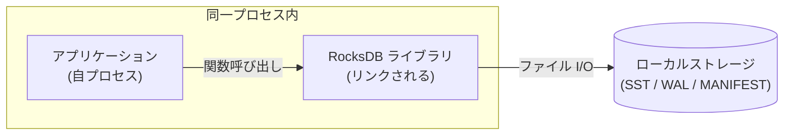
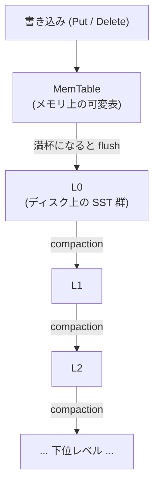

# 第1章 RocksDB とは何か

> **本章で読むソース**
>
> - [`README.md`](https://github.com/facebook/rocksdb/blob/v11.1.1/README.md)
> - [`include/rocksdb/db.h`](https://github.com/facebook/rocksdb/blob/v11.1.1/include/rocksdb/db.h)
> - [`include/rocksdb/version.h`](https://github.com/facebook/rocksdb/blob/v11.1.1/include/rocksdb/version.h)
> - [`include/rocksdb/options.h`](https://github.com/facebook/rocksdb/blob/v11.1.1/include/rocksdb/options.h)

## この章の狙い

RocksDB が何であり、何のために作られたソフトウェアなのかを、ソースの記述から確かめる。
組み込み型の永続キーバリューストアであること、書き込みに最適化した LSM-tree 構造を採るストレージエンジンであること、LevelDB から派生した系譜を持つことを、コードとコメントを根拠に押さえる。
本書全体が対象とするバージョンが v11.1.1 であることも、ここで確定させる。

## 前提

特になし。

## 組み込み型の永続キーバリューストア

RocksDB はキーから値への永続的な対応表を提供するライブラリである。
公開ヘッダの `class DB` 宣言の直前に、その性質を一文で述べたコメントがある。

[`include/rocksdb/db.h` L126-L131](https://github.com/facebook/rocksdb/blob/v11.1.1/include/rocksdb/db.h#L126-L131)

```cpp
// A DB is a persistent, versioned ordered map from keys to values.
// A DB is safe for concurrent access from multiple threads without
// any external synchronization.
// DB is an abstract base class with one primary implementation (DBImpl)
// and a number of wrapper implementations.
class DB {
```

ここから三つの事実が読み取れる。
第一に、`DB` は「永続的でバージョン管理された、キーから値への順序付きマップ」である。
永続的であるとは、プロセスが終了してもデータがローカルストレージに残ることを指す。
順序付きであるとは、キーが比較順に並ぶことを指し、これによって範囲走査が可能になる。
第二に、`DB` は外部からの同期を要さず複数スレッドから安全に並行アクセスできる。
第三に、`DB` は抽象基底クラスであり、主たる実装は `DBImpl` という一つのクラスが担う。

**組み込み型**という性質は、この `DB` がライブラリとして提供される点に表れる。
RocksDB は独立したサーバープロセスを持たず、利用するアプリケーションのプロセスに直接リンクされる。
README の冒頭がこの位置づけを明言している。

[`README.md` L9-L15](https://github.com/facebook/rocksdb/blob/v11.1.1/README.md#L9-L15)

```text
This code is a library that forms the core building block for a fast
key-value server, especially suited for storing data on flash drives.
It has a Log-Structured-Merge-Database (LSM) design with flexible tradeoffs
between Write-Amplification-Factor (WAF), Read-Amplification-Factor (RAF)
and Space-Amplification-Factor (SAF). It has multi-threaded compactions,
making it especially suitable for storing multiple terabytes of data in a
single database.
```

ここで RocksDB 自身を「a library that forms the core building block for a fast key-value server」と説明している。
RocksDB はキーバリューサーバーそのものではなく、その中核となる部品として使われるライブラリである。
ネットワーク越しのプロトコルやサーバー常駐プロセスは RocksDB の責務に含まれない。
アプリケーションは RocksDB の API を関数呼び出しで叩き、データは同じホストのローカルストレージに置かれる。

構成を図にすると次のようになる。



RDBMS やインメモリキャッシュをネットワーク経由で使う構成と違い、アプリケーションと RocksDB のあいだにプロセス境界やソケットは介在しない。
この近さが、後で述べる高スループットの書き込みを支える前提になる。

## LSM-tree に基づく書き込み最適化エンジン

README が示すとおり、RocksDB は **LSM-tree**（Log-Structured Merge-tree）に基づく設計を採る。
LSM-tree は、更新を所定の場所に上書きするのではなく、追記として受け取り、後から整理する構造である。
この発想を、伝統的な **B-tree** との対比で押さえておく。

B-tree は、キーが格納されるべき葉ページを探し、そのページを読み、書き換えて、書き戻す。
更新ごとにディスク上の特定位置への読み書きが生じる。
ランダムな位置への小さな書き込みが多発するため、ランダム I/O が苦手な記憶媒体では書き込み性能が頭打ちになりやすい。

LSM-tree は逆に、書き込みをまずメモリ上の表に積み、媒体へは順次まとめて書き出す。
個々の更新は所定位置への上書きを伴わず、新しいデータを後から追記する形で記録される。
古いデータと新しいデータの整理は、書き込みの本流から切り離した後追いの処理に委ねる。
この後追いの整理を **コンパクション**（compaction）と呼ぶ。

RocksDB の書き込みは、おおむね次の階層を下りていく。



新しい書き込みはまず **MemTable** というメモリ上の可変な表に入る。
MemTable が一定量に達すると、その内容は不変のファイルとしてディスクへ書き出される。
このファイルを **SST**（Sorted String Table）と呼び、書き出しの操作を **flush** と呼ぶ。
flush で生まれた SST はまず最上位の層 **L0** に置かれ、以降コンパクションによって L1、L2 と下位の層へ押し下げられながら整理されていく。

この構造が「書き込み最適化」と呼ばれるのは、書き込みの本流が媒体への順次書き込みとメモリ操作だけで完結するためである。
ランダムな位置への小さな上書きを避け、まとまった順次 I/O に変換することで、書き込みのスループットを稼ぐ。
その代償として、同じキーの新旧の値が複数の層に同時に存在しうるため、読み取りと容量には追加の負担がかかる。
README が挙げる三つの増幅係数、すなわち書き込み増幅（WAF）、読み取り増幅（RAF）、容量増幅（SAF）は、この負担を定量化した指標であり、RocksDB はそれらのあいだの調整を柔軟に行えると述べている。
これらの増幅とコンパクション戦略の詳しい議論は第29章で扱う。

## LevelDB からの系譜と RocksDB の拡張

RocksDB は LevelDB を起点として派生したソフトウェアである。
README がその由来を明記している。

[`README.md` L5-L8](https://github.com/facebook/rocksdb/blob/v11.1.1/README.md#L5-L8)

```text
RocksDB is developed and maintained by Facebook Database Engineering Team.
It is built on earlier work on [LevelDB](https://github.com/google/leveldb) by Sanjay Ghemawat (sanjay@google.com)
and Jeff Dean (jeff@google.com)
```

LevelDB は Google が公開した組み込みキーバリューストアであり、RocksDB はその仕事の上に築かれた。
この系譜はライセンス表記にも残っている。
たとえば `options.h` の先頭には、RocksDB 自身の著作権表記に加えて、LevelDB 由来の著作権表記が併記されている。

[`include/rocksdb/options.h` L1-L7](https://github.com/facebook/rocksdb/blob/v11.1.1/include/rocksdb/options.h#L1-L7)

```cpp
// Copyright (c) 2011-present, Facebook, Inc.  All rights reserved.
//  This source code is licensed under both the GPLv2 (found in the
//  COPYING file in the root directory) and Apache 2.0 License
//  (found in the LICENSE.Apache file in the root directory).
// Copyright (c) 2011 The LevelDB Authors. All rights reserved.
// Use of this source code is governed by a BSD-style license that can be
// found in the LICENSE file. See the AUTHORS file for names of contributors.
```

RocksDB は LevelDB の基本構造を引き継ぎつつ、運用規模の大きな用途に向けて多くの拡張を加えている。
コードから確認できる拡張の一つが **カラムファミリー**（column family）である。
`DB::Open` には、データベースを構成するカラムファミリーの一覧を受け取る多重定義がある。

[`include/rocksdb/db.h` L142-L159](https://github.com/facebook/rocksdb/blob/v11.1.1/include/rocksdb/db.h#L142-L159)

```cpp
  // Open DB with column families.
  // db_options specify database specific options
  // column_families is the vector of all column families in the database,
  // containing column family name and options. You need to open ALL column
  // families in the database. To get the list of column families, you can use
  // ListColumnFamilies().
  //
  // The default column family name is 'default' and it's stored
  // in ROCKSDB_NAMESPACE::kDefaultColumnFamilyName.
  // ... (中略) ...
  static Status Open(const DBOptions& db_options, const std::string& name,
                     const std::vector<ColumnFamilyDescriptor>& column_families,
                     std::vector<ColumnFamilyHandle*>* handles,
                     std::unique_ptr<DB>* dbptr);
```

カラムファミリーは、一つのデータベースの中で論理的に独立した名前空間を持つ機能である。
コメントにあるとおり、既定では `default` という名前のカラムファミリーが用いられ、用途ごとに別のカラムファミリーを設けて個別の設定を与えられる。

コードから確認できる拡張をまとめると、次のものが挙げられる。

- **カラムファミリー**：一つの DB を複数の論理的な名前空間に分け、それぞれに設定を持たせる。
- **マルチスレッド前提の設計**：先の `db.h` L126-L131 が示すとおり、`DB` は外部同期なしに複数スレッドから安全にアクセスでき、README L13 にあるとおりコンパクションは複数スレッドで並列に走る。
- **豊富なチューニング**：`options.h` が読み込むヘッダ群（[`include/rocksdb/options.h` L21-L33](https://github.com/facebook/rocksdb/blob/v11.1.1/include/rocksdb/options.h#L21-L33) の `advanced_options.h`、`compression_type.h`、`universal_compaction.h`、`write_buffer_manager.h` など）が、圧縮方式やコンパクション戦略、書き込みバッファ管理といった調整点の広さを示している。

コンパクション戦略が複数あることは、`options.h` が `universal_compaction.h` を取り込んでいる点からも窺える。
RocksDB はレベル方式のほかにユニバーサル方式など複数のコンパクション戦略を持つが、それぞれの中身は第5部で扱う。

これらの拡張がどのような設計判断のもとに加えられたかまでは、ヘッダのコメントからは断定できない。
README が「multiple terabytes of data in a single database」を適する用途として挙げている点からは、単一データベースで大規模なデータを扱う運用を主眼に置いた拡張群だと考えられる。

## 何を解決するために作られたか

ここまでの記述を、RocksDB が向き合う課題の側からまとめ直す。

README は適する媒体として「flash drives」を名指ししている（L10）。
フラッシュ媒体は順次 I/O が速くランダム I/O との差が大きいため、書き込みを順次 I/O に変換する LSM-tree の利点が生きる。
高スループットの書き込みについては、書き込みの本流をメモリ操作と順次書き込みに閉じ込め、整理を後追いのコンパクションへ回す構造が応える。
組み込み用途については、サーバープロセスを持たずアプリケーションにリンクされるライブラリ形態が、プロセス境界やネットワークの介在を避ける。
チューナビリティについては、先に挙げた圧縮方式、コンパクション戦略、増幅係数間の調整といった広い設定面が、用途ごとの作り込みを許す。

カラムファミリーを使った名前空間の分割や、読み書き API の全体像は、次章で扱う。

## 本書の対象バージョン

本書が対象とするのは RocksDB v11.1.1 である。
バージョン番号はマクロとしてヘッダに定義されている。

[`include/rocksdb/version.h` L14-L16](https://github.com/facebook/rocksdb/blob/v11.1.1/include/rocksdb/version.h#L14-L16)

```cpp
#define ROCKSDB_MAJOR 11
#define ROCKSDB_MINOR 1
#define ROCKSDB_PATCH 1
```

メジャー 11、マイナー 1、パッチ 1 を組み合わせて 11.1.1 となる。
本書で示すコード引用と行番号は、すべてこのバージョンのタグ（`v11.1.1`）に対応する。

## まとめ

- RocksDB は組み込み型の永続キーバリューストアであり、サーバープロセスを持たずアプリケーションにリンクされるライブラリとして提供される（`db.h` L126-L131、`README.md` L9-L15）。
- `DB` は永続的でバージョン管理された順序付きマップであり、外部同期なしに複数スレッドから安全にアクセスできる。主実装は `DBImpl` が担う（`db.h` L126-L131）。
- 書き込みを MemTable に積み、flush で SST として書き出し、後追いのコンパクションで層を下げていく LSM-tree 設計を採り、ランダム書き込みを順次 I/O に変換することで書き込みスループットを稼ぐ。
- RocksDB は LevelDB を起点に派生し（`README.md` L5-L8、`options.h` L1-L7）、カラムファミリー、複数のコンパクション戦略、豊富なチューニング、マルチスレッド前提の設計といった拡張を加えている。
- 本書の対象バージョンは v11.1.1 である（`version.h` L14-L16）。

## 関連する章

- 第2章「アーキテクチャ概観」：カラムファミリーや読み書きの全体像を扱う。
- 第29章「コンパクションの理論」：書き込み増幅・読み取り増幅・容量増幅とコンパクション戦略を詳しく扱う。
