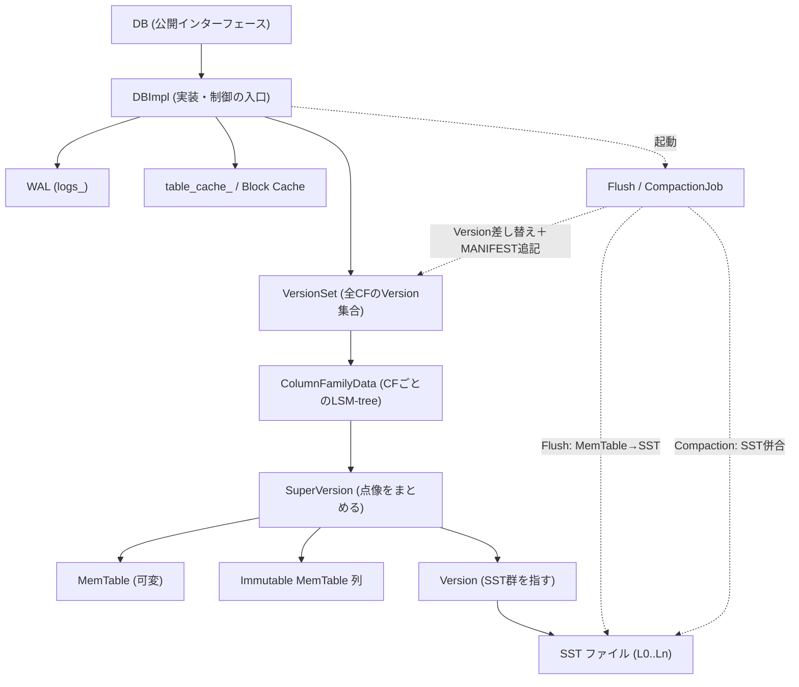
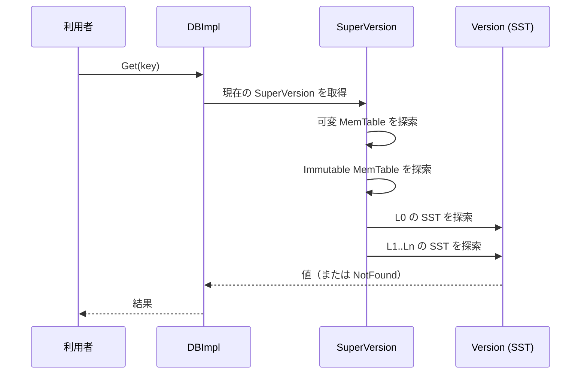

# 第2章 アーキテクチャ全体像

> **本章で読むソース**
>
> - [`include/rocksdb/db.h`](https://github.com/facebook/rocksdb/blob/v11.1.1/include/rocksdb/db.h)
> - [`db/db_impl/db_impl.h`](https://github.com/facebook/rocksdb/blob/v11.1.1/db/db_impl/db_impl.h)
> - [`db/column_family.h`](https://github.com/facebook/rocksdb/blob/v11.1.1/db/column_family.h)
> - [`db/memtable.h`](https://github.com/facebook/rocksdb/blob/v11.1.1/db/memtable.h)
> - [`db/version_set.h`](https://github.com/facebook/rocksdb/blob/v11.1.1/db/version_set.h)
> - [`db/compaction/compaction_job.h`](https://github.com/facebook/rocksdb/blob/v11.1.1/db/compaction/compaction_job.h)

## この章の狙い

RocksDB を構成する主要コンポーネントが、どんな役割を持ち、互いにどうつながっているかを一枚の地図として描く。
書き込みと読み出しのデータがどのコンポーネントをどの順に通るかを追えるようにする。
個々の内部構造には立ち入らず、各コンポーネントを詳説する章への道案内を示す。

## 前提

特になし。
本書を読み始めた読者がそのまま読める。
RocksDB が LSM-tree（Log-Structured Merge-tree）に基づくキーバリューストアであることだけ前提にする。

## DB と DBImpl: 公開インターフェースと実装の入口

RocksDB の公開インターフェースは `DB` という抽象基底クラスである。
利用者はこのクラスのポインタ越しに `Put` や `Get` を呼ぶ。
ヘッダの冒頭コメントは、`DB` が永続的で順序付きのマップであり、外部同期なしに複数スレッドから安全に使える点を述べている。

[`include/rocksdb/db.h` L126-L131](https://github.com/facebook/rocksdb/blob/v11.1.1/include/rocksdb/db.h#L126-L131)

```cpp
// A DB is a persistent, versioned ordered map from keys to values.
// A DB is safe for concurrent access from multiple threads without
// any external synchronization.
// DB is an abstract base class with one primary implementation (DBImpl)
// and a number of wrapper implementations.
class DB {
```

この抽象に対する唯一の主たる実装が **DBImpl** である。
`DBImpl` はコアエンジンの入口であり、各コンポーネントを保持してそれらの協調を制御するファサードとして働く。
`TransactionDB` や `BlobDB` といった拡張機能も、内部では `DBImpl` を包んで実装される。

[`db/db_impl/db_impl.h` L182-L195](https://github.com/facebook/rocksdb/blob/v11.1.1/db/db_impl/db_impl.h#L182-L195)

```cpp
// While DB is the public interface of RocksDB, and DBImpl is the actual
// class implementing it. It's the entrance of the core RocksdB engine.
// All other DB implementations, e.g. TransactionDB, BlobDB, etc, wrap a
// DBImpl internally.
// Other than functions implementing the DB interface, some public
// functions are there for other internal components to call. For
// example, TransactionDB directly calls DBImpl::WriteImpl() and
// BlobDB directly calls DBImpl::GetImpl(). Some other functions
// are for sub-components to call. For example, ColumnFamilyHandleImpl
// calls DBImpl::FindObsoleteFiles().
//
// Since it's a very large class, the definition of the functions is
// divided in several db_impl_*.cc files, besides db_impl.cc.
class DBImpl : public DB {
```

`DBImpl` がどのコンポーネントを抱えているかは、メンバ変数に現れる。
全カラムファミリーのバージョン集合を持つ `versions_`、WAL の書き手の列 `logs_`、SST を開くためのキャッシュ `table_cache_` が代表である。

[`db/db_impl/db_impl.h` L1375](https://github.com/facebook/rocksdb/blob/v11.1.1/db/db_impl/db_impl.h#L1375)

```cpp
  std::unique_ptr<VersionSet> versions_;
```

[`db/db_impl/db_impl.h` L1412](https://github.com/facebook/rocksdb/blob/v11.1.1/db/db_impl/db_impl.h#L1412)

```cpp
  std::shared_ptr<Cache> table_cache_;
```

[`db/db_impl/db_impl.h` L2961](https://github.com/facebook/rocksdb/blob/v11.1.1/db/db_impl/db_impl.h#L2961)

```cpp
  std::deque<LogWriterNumber> logs_;
```

`DBImpl` は前面の API を受けるだけでなく、フラッシュとコンパクションを起動する制御点でもある。
書き込みが進んでメモリ上のテーブルが満ちると、`MaybeScheduleFlushOrCompaction` がバックグラウンドスレッドへ仕事を積む。

[`db/db_impl/db_impl.h` L2433](https://github.com/facebook/rocksdb/blob/v11.1.1/db/db_impl/db_impl.h#L2433)

```cpp
  void MaybeScheduleFlushOrCompaction();
```

## ColumnFamily と SuperVersion: 木の最新像をひとまとめにする

RocksDB のデータは **カラムファミリー**（column family）という独立した名前空間に分かれる。
各カラムファミリーは固有の LSM-tree を持ち、その実体を保持するのが **ColumnFamilyData** である。
`db/column_family.h` の冒頭は、このファイルがカラムファミリー単位のメタデータを管理するデータ構造の集まりだと述べる。

[`db/column_family.h` L55-L60](https://github.com/facebook/rocksdb/blob/v11.1.1/db/column_family.h#L55-L60)

```cpp
// This file contains a list of data structures for managing column family
// level metadata.
//
// The basic relationships among classes declared here are illustrated as
// following:
//
```

一つのカラムファミリーの LSM-tree は、可変の MemTable、Immutable MemTable のリスト、そしてディスク上の SST 群を指す `Version` という三つの層に分かれる。
これらを束ねて「ある時点の木の像」を一つの参照単位にしたものが **SuperVersion** である。
構造体の宣言は、可変 MemTable を指す `mem`、Immutable MemTable 列を指す `imm`、SST 群を表す `current`（`Version`）を並べて持つ。

[`db/column_family.h` L205-L212](https://github.com/facebook/rocksdb/blob/v11.1.1/db/column_family.h#L205-L212)

```cpp
// holds references to memtable, all immutable memtables and version
struct SuperVersion {
  // Accessing members of this class is not thread-safe and requires external
  // synchronization (ie db mutex held or on write thread).
  ColumnFamilyData* cfd;
  ReadOnlyMemTable* mem;
  MemTableListVersion* imm;
  Version* current;
```

`SuperVersion` を一段の間接参照に挟む理由は、読み出しの一貫性と並行性を両立させるためである。
最新の木は時々刻々と差し替わるが、進行中の読み出しやイテレータ、コンパクションはそれぞれ自分が参照した `SuperVersion` を握り続けられる。
握られている間、その `SuperVersion` が指す MemTable と SST は破棄されない。
参照カウントがゼロに落ちて初めて解放される。

[`db/column_family.h` L113-L118](https://github.com/facebook/rocksdb/blob/v11.1.1/db/column_family.h#L113-L118)

```cpp
// ColumnFamilySet points to the latest view of the LSM-tree (list of memtables
// and SST files) indirectly, while ongoing operations may hold references
// to a current or an out-of-date SuperVersion, which in turn points to a
// point-in-time view of the LSM-tree. This guarantees the memtables and SST
// files being operated on will not go away, until the SuperVersion is
// unreferenced to 0 and destoryed.
```

この仕組みは読み出しの高速化に直結する。
読み出しのたびに DB 全体のロックを取らず、現在の `SuperVersion` への参照を一度だけ取得すれば、その後の探索はロックなしで自分の点像に対して進められる。
木の差し替えと読み出しが同じ瞬間に起きても、読み手は古い点像を見続けるだけで矛盾しない（`SuperVersion` の取得を含む読み出し経路の詳細は第24章で扱う）。

## MemTable と WAL: 書き込みを最初に受ける層

カラムファミリーごとに、書き込みを受け付ける可変の **MemTable** が一つと、書き込みを締め切った Immutable MemTable が零個以上ある。
`db/memtable.h` のコメントは、可変のテーブルが書き込みを受け、締め切られたテーブルを Immutable MemTable と呼ぶこと、`SuperVersion` が可変の MemTable と Immutable MemTable のリストを別々に持つことを述べる。

[`db/memtable.h` L83-L104](https://github.com/facebook/rocksdb/blob/v11.1.1/db/memtable.h#L83-L104)

```cpp
// For each CF, rocksdb maintains an active memtable that accept writes,
// and zero or more sealed memtables that we call immutable memtables.
// This interface contains all methods required for immutable memtables.
// MemTable class inherit from `ReadOnlyMemTable` and implements additional
// methods required for active memtables.
// ... (中略) ...
// Eg: The Superversion stores a pointer to the current MemTable (that can
// be modified) and a separate list of the MemTables that can no longer be
// written to (aka the 'immutable memtables').
```

可変の MemTable は `ReadOnlyMemTable` を継承した `MemTable` クラスである。

[`db/memtable.h` L537](https://github.com/facebook/rocksdb/blob/v11.1.1/db/memtable.h#L537)

```cpp
class MemTable final : public ReadOnlyMemTable {
```

MemTable はメモリ上の構造なので、プロセスが落ちると失われる。
そこで MemTable へ挿入する前に、同じ更新を **WAL**（Write-Ahead Log、先行書き込みログ）へ追記する。
`DBImpl` は WAL の書き手を `logs_` という列で管理する（先に引用した L2961）。
クラッシュからの復旧では、この WAL を再生して MemTable を作り直す（WAL の構造とフラッシュとの同期は第10章と第13章で扱う）。

## SST と VersionSet/Version/MANIFEST: ディスク上の永続層

MemTable がいっぱいになると締め切られ、最終的に **SST**（Sorted String Table）ファイルとしてディスクに書き出される。
最初の書き出し先は LSM-tree の最上位レベル L0 である。
各カラムファミリーがある時点で所有する SST と Blob ファイルの集合を表すのが **Version** である。

[`db/version_set.h` L889-L891](https://github.com/facebook/rocksdb/blob/v11.1.1/db/version_set.h#L889-L891)

```cpp
// A column family's version consists of the table and blob files owned by
// the column family at a certain point in time.
class Version {
```

`Version` は不変の点像であり、木が変わるたびに新しい `Version` が作られて「current」になる。
古い `Version` は、それを参照する生きたイテレータがいる限り残される。

[`db/version_set.h` L10-L16](https://github.com/facebook/rocksdb/blob/v11.1.1/db/version_set.h#L10-L16)

```cpp
// The representation of a DBImpl consists of a set of Versions.  The
// newest version is called "current".  Older versions may be kept
// around to provide a consistent view to live iterators.
//
// Each Version keeps track of a set of table files per level, as well as a
// set of blob files. The entire set of versions is maintained in a
// VersionSet.
```

全カラムファミリーの `Version` をまとめて管理するのが **VersionSet** である。
DB は一つの `VersionSet` を持ち、これが `ColumnFamilySet` 経由で全カラムファミリーにアクセスする。

[`db/version_set.h` L1201-L1207](https://github.com/facebook/rocksdb/blob/v11.1.1/db/version_set.h#L1201-L1207)

```cpp
// VersionSet is the collection of versions of all the column families of the
// database. Each database owns one VersionSet. A VersionSet has access to all
// column families via ColumnFamilySet, i.e. set of the column families.
// `unchanging` means the LSM tree structure of the column families will not
// change during the lifetime of this VersionSet (true for read-only instance,
// but false for secondary instance or writable DB).
class VersionSet {
```

木の変化（SST の追加や削除）は **MANIFEST** という専用ファイルに追記される。
`VersionSet` は新しい `Version` を作るたびにその差分を MANIFEST へ記録するので、再起動時にはこのログを再生して最後の `Version` を復元できる（MANIFEST と差分の記録形式は第34章で扱う）。

## Compaction と Block Cache: 背後で木を整え、I/O を減らす

L0 に SST がたまると読み出しが遅くなるため、複数の SST を読み込んで併合し、下位レベルへ書き直す **コンパクション**（compaction）が背後で走る。
一回のコンパクションは一つの **CompactionJob** に対応し、`Prepare` から `Run`、`Install` へと進む。

[`db/compaction/compaction_job.h` L63-L67](https://github.com/facebook/rocksdb/blob/v11.1.1/db/compaction/compaction_job.h#L63-L67)

```cpp
// CompactionJob is responsible for executing the compaction. Each (manual or
// automated) compaction corresponds to a CompactionJob object, and usually
// goes through the stages of `Prepare()`->`Run()`->`Install()`. CompactionJob
// will divide the compaction into subcompactions and execute them in parallel
// if needed.
```

`CompactionJob` は併合を複数の **サブコンパクション**（subcompaction）に分割し、必要に応じて並列に実行する（コンパクションの理論と実行は第29章から第31章、サブコンパクションは第32章で扱う）。

読み出しのたびに SST をディスクから読むと遅いため、SST から読んだデータブロックをメモリに保持するのが **Block Cache** である。
`DBImpl` は SST のファイルハンドルとメタ情報を `table_cache_` で再利用し（先に引用した L1412）、その先でデータブロックが Block Cache に乗る。
ヒットすればディスク I/O を丸ごと省ける機構なので、読み出し性能の要になる（Block Cache の実装は第38章から第41章で扱う）。

## コンポーネントの関係図

ここまでの主要コンポーネントを、`DBImpl` を中心に一枚にまとめる。



## 書き込みパス

書き込みは `WriteBatch` にまとめられ、まず WAL へ追記されてから MemTable へ挿入される。
可変の MemTable が満杯になると締め切られて Immutable MemTable になり、フラッシュによって L0 の SST へ書き出される。


WAL を先に書く順序が、クラッシュ耐性を支える。
MemTable への反映前にディスクのログへ更新を残すので、MemTable が失われても WAL の再生で復旧できる（書き込みパイプラインの詳細は第8章、フラッシュは第13章で扱う）。

## 読み出しパス

読み出しは現在の `SuperVersion` を取得し、新しい層から古い層へ順に探索する。
可変 MemTable、Immutable MemTable、L0 の SST、そして L1 から Ln の SST の順に見て、最初に見つかった値を返す。



層を新しい順にたどるのは、LSM-tree が同じキーの複数版を別の層に持ちうるためである。
新しい層を先に見て最初の一致で打ち切れば、古い版に到達せずに済み、探索を早く止められる（Get の詳細は第23章、各種イテレータは第26章で扱う）。

## ディレクトリ構成の地図

コンポーネントとソースツリーの対応は次のとおり。

- **`db/`**：`DBImpl`、`ColumnFamilyData`、`SuperVersion`、`VersionSet`、`Version`、MANIFEST 処理など、エンジンの中核。
- **`db/db_impl/`**：巨大な `DBImpl` を機能別に分割した実装ファイル群。
- **`memtable/`**：MemTable の内部表現（スキップリストなど）の実装。
- **`table/`**：SST の読み書き、インデックス、フィルタ、圧縮。
- **`db/compaction/`**：コンパクションの選定と実行（`CompactionJob` など）。
- **`cache/`**：Block Cache をはじめとするキャッシュ実装。
- **`db/version_*`**：`VersionSet` と `Version`、差分（`VersionEdit`）と MANIFEST。
- **`util/`**：アリーナ、スレッドプール、レートリミッタなどの基盤部品。

## まとめ

- `DB` は公開インターフェース、`DBImpl` はその唯一の主たる実装であり、各コンポーネントを保持してフラッシュとコンパクションを制御する入口である。
- カラムファミリーごとの LSM-tree は、可変 MemTable、Immutable MemTable 列、SST 群を指す `Version` の三層からなり、`SuperVersion` がそれらを点像として束ねる。
- 書き込みは WAL への追記を先に行い、その後 MemTable へ挿入する。MemTable は満杯で締め切られ、フラッシュで L0 の SST になる。
- 読み出しは `SuperVersion` を取得し、可変 MemTable から Immutable MemTable、L0、L1 から Ln の順に探索して最初の一致で打ち切る。
- 背後ではコンパクションが SST を併合し、`VersionSet` が新しい `Version` を作って MANIFEST に差分を追記する。Block Cache はデータブロックを保持してディスク I/O を省く。

## 関連する章

- 第1章「RocksDB とは何か」：本書全体の前提。
- 第8章「書き込みパイプライン」：書き込みパスの詳細。
- 第13章「フラッシュ」：MemTable から SST への書き出し。
- 第23章「Get」と第24章「Version と SuperVersion」：読み出しパスの詳細。
- 第29章から第31章「コンパクション」：背景処理の理論と実行。
- 第34章「MANIFEST と VersionEdit」：木の差分とその永続化。
