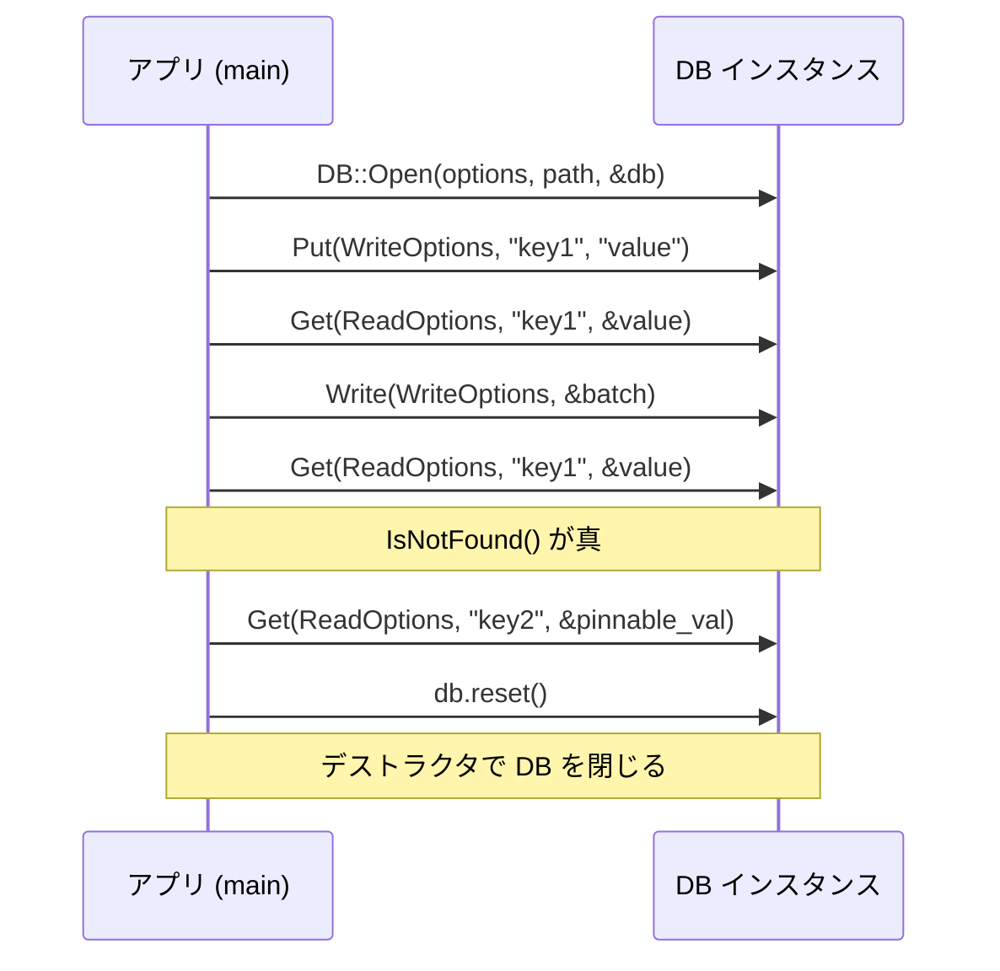

# 第3章 最小コード例で動かす

> **本章で読むソース**
>
> - [`examples/simple_example.cc`](https://github.com/facebook/rocksdb/blob/v11.1.1/examples/simple_example.cc)
> - [`examples/column_families_example.cc`](https://github.com/facebook/rocksdb/blob/v11.1.1/examples/column_families_example.cc)
> - [`include/rocksdb/db.h`](https://github.com/facebook/rocksdb/blob/v11.1.1/include/rocksdb/db.h)
> - [`include/rocksdb/options.h`](https://github.com/facebook/rocksdb/blob/v11.1.1/include/rocksdb/options.h)
> - [`include/rocksdb/status.h`](https://github.com/facebook/rocksdb/blob/v11.1.1/include/rocksdb/status.h)
> - [`include/rocksdb/slice.h`](https://github.com/facebook/rocksdb/blob/v11.1.1/include/rocksdb/slice.h)

## この章の狙い

RocksDB に同梱された最小の例 `simple_example.cc` を一行ずつ追い、データベースを開いてから閉じるまでの基本操作を読み解く。
Open、Put、Get、削除、クローズという一連の API が、それぞれ `DB` クラスのどのメソッドに対応し、`Options` と `Status` をどう使うかを把握する。
個々の API が内部で書き込みパスと読み出しパスのどちらに繋がるかを確認し、後続の章への道案内を得ることが本章のゴールである。

## 前提

第2章「[アーキテクチャ全体像](02-architecture-overview.md)」で、MemTable、WAL、SST、コンパクションといった構成要素の役割を把握していることを前提とする。
本章はそれらの部品を、利用者側の API から眺め直す位置づけである。

## 例の全体像

`simple_example.cc` の `main` は、ヘッダのインクルードと名前空間の取り込みのあと、次の流れだけで構成される。
DB を開き、キーを1件書き、読み、`WriteBatch` でまとめて更新し、削除済みを確認し、最後に DB を閉じる。

利用する型は名前空間 `ROCKSDB_NAMESPACE` から取り込まれる。

[`examples/simple_example.cc` L14-L20](https://github.com/facebook/rocksdb/blob/v11.1.1/examples/simple_example.cc#L14-L20)

```cpp
using ROCKSDB_NAMESPACE::DB;
using ROCKSDB_NAMESPACE::Options;
using ROCKSDB_NAMESPACE::PinnableSlice;
using ROCKSDB_NAMESPACE::ReadOptions;
using ROCKSDB_NAMESPACE::Status;
using ROCKSDB_NAMESPACE::WriteBatch;
using ROCKSDB_NAMESPACE::WriteOptions;
```

操作の呼び出し順を図にすると次のようになる。



以降の節で、この呼び出し列を順に読み解く。

## DB を開く

`main` の最初の仕事は、`Options` を組み立てて `DB::Open` を呼ぶことである。

[`examples/simple_example.cc` L28-L39](https://github.com/facebook/rocksdb/blob/v11.1.1/examples/simple_example.cc#L28-L39)

```cpp
int main() {
  std::unique_ptr<DB> db;
  Options options;
  // Optimize RocksDB. This is the easiest way to get RocksDB to perform well
  options.IncreaseParallelism();
  options.OptimizeLevelStyleCompaction();
  // create the DB if it's not already present
  options.create_if_missing = true;

  // open DB
  Status s = DB::Open(options, kDBPath, &db);
  assert(s.ok());
```

`Options` はデータベース全体の設定とカラムファミリーの設定をまとめて持つ構造体である。
ここでは三つの設定だけを触っている。

`IncreaseParallelism()` は、フラッシュとコンパクションに使うバックグラウンドスレッドの本数を増やす。
既定では RocksDB はフラッシュとコンパクションに1本のバックグラウンドスレッドしか使わず、引数で渡した総スレッド数まで引き上げる。
コメントは「`total_threads` の良い値はコア数である」「RocksDB がボトルネックなら、まず間違いなくこの関数を呼びたくなる」と述べている。
引数を省略した場合の既定値は16である。

[`include/rocksdb/options.h` L586-L591](https://github.com/facebook/rocksdb/blob/v11.1.1/include/rocksdb/options.h#L586-L591)

```cpp
  // By default, RocksDB uses only one background thread for flush and
  // compaction. Calling this function will set it up such that total of
  // `total_threads` is used. Good value for `total_threads` is the number of
  // cores. You almost definitely want to call this function if your system is
  // bottlenecked by RocksDB.
  DBOptions* IncreaseParallelism(int total_threads = 16);
```

`OptimizeLevelStyleCompaction()` は、レベルスタイルのコンパクションに向けたパラメータ群をまとめて調整する。
ヘッダのコメントは、`ColumnFamilyOptions` の既定値が重いワークロードや大きなデータセットには最適化されておらず、条件によっては書き込みストール（write stall）が起きうると説明する。
チューニングの出発点として、この関数か `OptimizeUniversalStyleCompaction()` を呼ぶよう促し、最大の性能向上は `IncreaseParallelism()` の併用で得られると付記する。
引数 `memtable_memory_budget` の既定値は512MiBである。

[`include/rocksdb/options.h` L92-L107](https://github.com/facebook/rocksdb/blob/v11.1.1/include/rocksdb/options.h#L92-L107)

```cpp
  // Default values for some parameters in ColumnFamilyOptions are not
  // optimized for heavy workloads and big datasets, which means you might
  // observe write stalls under some conditions. As a starting point for tuning
  // RocksDB options, use the following two functions:
  // * OptimizeLevelStyleCompaction -- optimizes level style compaction
  // * OptimizeUniversalStyleCompaction -- optimizes universal style compaction
  // ... (中略) ...
  // Make sure to also call IncreaseParallelism(), which will provide the
  // biggest performance gains.
  // Note: we might use more memory than memtable_memory_budget during high
  // write rate period
  ColumnFamilyOptions* OptimizeLevelStyleCompaction(
      uint64_t memtable_memory_budget = 512 * 1024 * 1024);
```

`create_if_missing` は、データベースが存在しなければ新規作成するかどうかを決める真偽値である。
既定値は `false` で、存在しないパスを既定のまま開くとエラーになる。
例では `true` を設定し、初回実行でもディレクトリを作って開けるようにしている。

[`include/rocksdb/options.h` L593-L595](https://github.com/facebook/rocksdb/blob/v11.1.1/include/rocksdb/options.h#L593-L595)

```cpp
  // If true, the database will be created if it is missing.
  // Default: false
  bool create_if_missing = false;
```

設定を終えたら `DB::Open` を呼ぶ。
このオーバーロードは `Options`、データベースのパス、出力先の `std::unique_ptr<DB>*` を取る静的メソッドである。
成功すると `*dbptr` にインスタンスを格納して OK を返し、失敗すると `*dbptr` をリセットして非 OK を返す。
コメントは、別の `DB` オブジェクトが既に同じ DB を読み書きで開いている場合もエラーになると述べ、その保証は `options.env->LockFile()` に依存する（カスタム `Env` 実装では保証されないことがある）と注記している。

[`include/rocksdb/db.h` L133-L140](https://github.com/facebook/rocksdb/blob/v11.1.1/include/rocksdb/db.h#L133-L140)

```cpp
  // Open the database with the specified "name" for reads and writes.
  // On success, stores the database in *dbptr and returns OK.
  // On error, resets *dbptr and returns a non-OK status, including
  // if the DB is already open (read-write) by another DB object. (This
  // guarantee depends on options.env->LockFile(), which might not provide
  // this guarantee in a custom Env implementation.)
  static Status Open(const Options& options, const std::string& name,
                     std::unique_ptr<DB>* dbptr);
```

出力先が `std::unique_ptr<DB>` である点は、後始末の作法に直結する。
`DB` の所有権はこのスマートポインタが握り、後述の `db.reset()` で解放されたタイミングでデータベースが閉じられる。

## Status による成否の判定

`DB::Open` の戻り値は `Status` で受け、直後に `assert(s.ok())` で成功を確認している。

`Status` は、操作の結果コードと、エラー時の付随情報を運ぶ小さなオブジェクトである。
内部のコードは `enum Code` で表され、成功は `kOk`、キー不在は `kNotFound` といった値を取る。

[`include/rocksdb/status.h` L75-L77](https://github.com/facebook/rocksdb/blob/v11.1.1/include/rocksdb/status.h#L75-L77)

```cpp
  enum Code : unsigned char {
    kOk = 0,
    kNotFound = 1,
```

`ok()` はコードが `kOk` のとき真を返す。

[`include/rocksdb/status.h` L329-L332](https://github.com/facebook/rocksdb/blob/v11.1.1/include/rocksdb/status.h#L329-L332)

```cpp
  bool ok() const {
    MarkChecked();
    return code() == kOk;
  }
```

`assert(s.ok())` は、その呼び出しが成功した前提で先へ進むことを表明する記述である。
これはサンプルコードとしての簡潔さを優先した書き方であり、`assert` はリリースビルド（`NDEBUG` 定義時）では無効化されて何も検査しない。
本番のコードでは、`Status` を握りつぶさず、エラーコードに応じて分岐するのが筋である。
RocksDB が個々の操作で例外を投げず `Status` を返り値で渡すのは、I/O エラーやキー不在のような想定内の失敗を、戻り値の検査として一貫して扱わせるためと考えられる。

## キーと値を1件書く

DB を開いたら、最初の書き込みを行う。

[`examples/simple_example.cc` L41-L43](https://github.com/facebook/rocksdb/blob/v11.1.1/examples/simple_example.cc#L41-L43)

```cpp
  // Put key-value
  s = db->Put(WriteOptions(), "key1", "value");
  assert(s.ok());
```

この `Put` は、`WriteOptions` とキー、値の3引数を取る簡易オーバーロードである。
内部では、デフォルトカラムファミリーを補ったうえで本体の `Put` を呼ぶだけの薄いラッパーになっている。

[`include/rocksdb/db.h` L429-L438](https://github.com/facebook/rocksdb/blob/v11.1.1/include/rocksdb/db.h#L429-L438)

```cpp
  virtual Status Put(const WriteOptions& options,
                     ColumnFamilyHandle* column_family, const Slice& key,
                     const Slice& value) = 0;
  // ... (中略) ...
  virtual Status Put(const WriteOptions& options, const Slice& key,
                     const Slice& value) {
    return Put(options, DefaultColumnFamily(), key, value);
  }
```

ここでキーと値に渡している `"key1"` と `"value"` はC文字列リテラルだが、`Put` の引数型は `Slice` である。
`Slice` はデータ先頭へのポインタと長さの組であり、`const char*` や `std::string` から暗黙変換できるコンストラクタを持つ。
そのため呼び出し側は文字列リテラルをそのまま渡せる。

[`include/rocksdb/slice.h` L41-L51](https://github.com/facebook/rocksdb/blob/v11.1.1/include/rocksdb/slice.h#L41-L51)

```cpp
  // Create a slice that refers to the contents of "s"
  /* implicit */
  Slice(const std::string& s) : data_(s.data()), size_(s.size()) {}
  // ... (中略) ...
  // Create a slice that refers to s[0,strlen(s)-1]
  /* implicit */
  Slice(const char* s) : data_(s) { size_ = (s == nullptr) ? 0 : strlen(s); }
```

`Slice` がデータを所有せず参照だけを持つ点は、無用なコピーを避けるための設計である。
`Put` に渡すあいだ、元の文字列の寿命が `Slice` より長いことは呼び出し側の責任になる。
`Slice` とゼロコピーの詳細は第4章「[Slice とゼロコピー](../part01-data-model/04-slice.md)」で扱う。

`Put` のコメントは挙動を端的に述べている。
キーに対応する値を設定し、既存のキーなら上書きする。
成功で OK、失敗で非 OK を返し、永続性が要るなら `options.sync = true` を検討せよと付記する。

[`include/rocksdb/db.h` L425-L428](https://github.com/facebook/rocksdb/blob/v11.1.1/include/rocksdb/db.h#L425-L428)

```cpp
  // Set the database entry for "key" to "value".
  // If "key" already exists, it will be overwritten.
  // Returns OK on success, and a non-OK status on error.
  // Note: consider setting options.sync = true.
```

`Put` は書き込みパスの入り口である。
内部では1件の更新を `WriteBatch` に包み、WAL への追記と MemTable への挿入を行う。
書き込みパスの全体像は第8章「[書き込みパイプライン全体](../part02-write-path/08-write-pipeline.md)」で読み解く。

## キーを読む

書いた値を読み戻す。

[`examples/simple_example.cc` L44-L48](https://github.com/facebook/rocksdb/blob/v11.1.1/examples/simple_example.cc#L44-L48)

```cpp
  std::string value;
  // get value
  s = db->Get(ReadOptions(), "key1", &value);
  assert(s.ok());
  assert(value == "value");
```

この `Get` は、`ReadOptions` とキー、出力先の `std::string*` を取るオーバーロードである。
キーは `Slice` だが、値は `std::string` に書き出される。
つまり読み出しでは、呼び出し側が用意した文字列バッファに値の内容がコピーされる。

[`include/rocksdb/db.h` L642-L648](https://github.com/facebook/rocksdb/blob/v11.1.1/include/rocksdb/db.h#L642-L648)

```cpp
  // Gets a key in the default column family, returns the value as a string,
  // and no timestamp returned
  // NOTE: virtual final => disallow override (was previously allowed)
  virtual Status Get(const ReadOptions& options, const Slice& key,
                     std::string* value) final {
    return Get(options, DefaultColumnFamily(), key, value);
  }
```

`Get` のコメントは、キーが存在すれば値を `*value` に返し、存在しなければ `NotFound` と空の値を返すと述べている。

[`include/rocksdb/db.h` L596-L597](https://github.com/facebook/rocksdb/blob/v11.1.1/include/rocksdb/db.h#L596-L597)

```cpp
  // Returns OK on success. Returns NotFound and an empty value in "*value" if
  // there is no entry for "key". Returns some other non-OK status on error.
```

`Get` は読み出しパスの入り口である。
MemTable、イミュータブル MemTable、SST の順に新しいデータから探し、最初に見つかった結果を返す。
読み出しパスの詳細は第23章「[Get の全体像](../part04-read-path/23-get.md)」で扱う。

## WriteBatch でまとめて更新する

次に、削除と追加を1回の書き込みにまとめる。

[`examples/simple_example.cc` L50-L56](https://github.com/facebook/rocksdb/blob/v11.1.1/examples/simple_example.cc#L50-L56)

```cpp
  // atomically apply a set of updates
  {
    WriteBatch batch;
    batch.Delete("key1");
    batch.Put("key2", value);
    s = db->Write(WriteOptions(), &batch);
  }
```

`WriteBatch` は、複数の更新を貯めてから一括で適用するためのバッファである。
ここでは `key1` の削除と `key2` への書き込みを積み、`db->Write` で一度に流し込む。

`Write` は、バッチ内の更新をデータベースにアトミックに適用する。
コメントは、更新が0件でも `options.sync=true` なら WAL は同期されると述べ、成功で OK、失敗で非 OK を返すとする。

[`include/rocksdb/db.h` L554-L559](https://github.com/facebook/rocksdb/blob/v11.1.1/include/rocksdb/db.h#L554-L559)

```cpp
  // Apply the specified updates atomically to the database.
  // If `updates` contains no update, WAL will still be synced if
  // options.sync=true.
  // Returns OK on success, non-OK on failure.
  // Note: consider setting options.sync = true.
  virtual Status Write(const WriteOptions& options, WriteBatch* updates) = 0;
```

「アトミックに適用する」とは、バッチ内の `Delete` と `Put` が全て反映されるか全く反映されないかのどちらかになり、途中状態が観測されないことを指す。
複数件をまとめて一度の `Write` で流す利点は二つある。
まず、削除と追加が同一のバッチとして不可分に適用される。
次に、WAL への追記と MemTable への反映を更新ごとに繰り返さず1回にまとめるため、同期 I/O の回数とロックの取得回数を減らせる。
このバッチ化が書き込みスループットを支える機構であり、`WriteBatch` の構造は第7章「[WriteBatch](../part01-data-model/07-write-batch.md)」で読み解く。

ここで `Delete` を直接 `db` に対して呼ぶ簡易オーバーロードも存在する。
`WriteBatch::Delete` と同様に、デフォルトカラムファミリーから1件を削除する。
コメントは、キーがあれば削除し、キーが存在しなくてもエラーにはならないと述べている。

[`include/rocksdb/db.h` L457-L469](https://github.com/facebook/rocksdb/blob/v11.1.1/include/rocksdb/db.h#L457-L469)

```cpp
  // Remove the database entry (if any) for "key".  Returns OK on
  // success, and a non-OK status on error.  It is not an error if "key"
  // did not exist in the database.
  // Note: consider setting options.sync = true.
  virtual Status Delete(const WriteOptions& options,
                        ColumnFamilyHandle* column_family,
                        const Slice& key) = 0;
  // ... (中略) ...
  virtual Status Delete(const WriteOptions& options, const Slice& key) {
    return Delete(options, DefaultColumnFamily(), key);
  }
```

削除も書き込みパスを通る。
RocksDB は値を即座に消すのではなく、削除を表すマーカー（tombstone）を書き込み、後のコンパクションで実体を整理する。
この仕組みは第29章「[コンパクションの理論](../part05-compaction/29-compaction-theory.md)」で扱う。

## 削除の確認と PinnableSlice

バッチ適用後、`key1` が消えたことと `key2` が読めることを確認する。

[`examples/simple_example.cc` L58-L68](https://github.com/facebook/rocksdb/blob/v11.1.1/examples/simple_example.cc#L58-L68)

```cpp
  s = db->Get(ReadOptions(), "key1", &value);
  assert(s.IsNotFound());

  db->Get(ReadOptions(), "key2", &value);
  assert(value == "value");

  {
    PinnableSlice pinnable_val;
    db->Get(ReadOptions(), db->DefaultColumnFamily(), "key2", &pinnable_val);
    assert(pinnable_val == "value");
  }
```

`key1` を引いた `Get` の結果は `s.IsNotFound()` で確かめている。
`IsNotFound()` は、結果コードが `kNotFound` のとき真を返す述語である。

[`include/rocksdb/status.h` L352-L355](https://github.com/facebook/rocksdb/blob/v11.1.1/include/rocksdb/status.h#L352-L355)

```cpp
  bool IsNotFound() const {
    MarkChecked();
    return code() == kNotFound;
  }
```

ここでキー不在を `assert(s.ok())` ではなく `assert(s.IsNotFound())` で確認している点に注目したい。
キーが見つからないことは、この箇所では失敗ではなく期待どおりの結果である。
`Status` が成功か否かの二値ではなく具体的なコードを運ぶおかげで、「存在しないこと」を正常系として区別できる。

続く `PinnableSlice` を使った `Get` は、値のコピーを避ける読み出しの形である。
`std::string*` を出力先にする `Get` は内部バッファへ値をコピーするのに対し、`PinnableSlice` は可能なら RocksDB 内部のデータをそのまま指し示し（ピン留め）、コピーを省く。

[`examples/simple_example.cc` L70-L79](https://github.com/facebook/rocksdb/blob/v11.1.1/examples/simple_example.cc#L70-L79)

```cpp
  {
    std::string string_val;
    // If it cannot pin the value, it copies the value to its internal buffer.
    // The intenral buffer could be set during construction.
    PinnableSlice pinnable_val(&string_val);
    db->Get(ReadOptions(), db->DefaultColumnFamily(), "key2", &pinnable_val);
    assert(pinnable_val == "value");
    // If the value is not pinned, the internal buffer must have the value.
    assert(pinnable_val.IsPinned() || string_val == "value");
  }
```

例のコメントが説明するとおり、ピン留めできない場合は内部バッファへコピーされ、そのバッファは構築時に外部の `std::string` として渡せる。
ピン留めが効けば値の複製を作らずに済み、読み出しの多いワークロードでメモリ確保とコピーの負荷を抑えられる。
`PinnableSlice` を使うときは、使用後ごとに `Reset()` を呼び、ピンした領域への参照を解放してから再利用する。

[`examples/simple_example.cc` L81-L89](https://github.com/facebook/rocksdb/blob/v11.1.1/examples/simple_example.cc#L81-L89)

```cpp
  PinnableSlice pinnable_val;
  s = db->Get(ReadOptions(), db->DefaultColumnFamily(), "key1", &pinnable_val);
  assert(s.IsNotFound());
  // Reset PinnableSlice after each use and before each reuse
  pinnable_val.Reset();
  db->Get(ReadOptions(), db->DefaultColumnFamily(), "key2", &pinnable_val);
  assert(pinnable_val == "value");
  pinnable_val.Reset();
  // The Slice pointed by pinnable_val is not valid after this point
```

範囲を走査する `NewIterator` は、この例では使っていない。
`Get` が単一キーを引くのに対し、`NewIterator` はデータベースの内容を順に辿るイテレータをヒープ上に作って返す。
返したイテレータは初期状態では無効で、使う前に `Seek` 系メソッドのいずれかを呼ぶ必要がある。
イテレータは不要になったら呼び出し側が `delete` し、DB を破棄する前に解放しなければならない。

[`include/rocksdb/db.h` L984-L994](https://github.com/facebook/rocksdb/blob/v11.1.1/include/rocksdb/db.h#L984-L994)

```cpp
  // Return a heap-allocated iterator over the contents of the database.
  // The result of NewIterator() is initially invalid (caller must
  // call one of the Seek methods on the iterator before using it).
  //
  // Caller should delete the iterator when it is no longer needed.
  // The returned iterator should be deleted before this db is destroyed.
  virtual Iterator* NewIterator(const ReadOptions& options,
                                ColumnFamilyHandle* column_family) = 0;
  virtual Iterator* NewIterator(const ReadOptions& options) {
    return NewIterator(options, DefaultColumnFamily());
  }
```

イテレータも読み出しパスを通るが、複数のデータ源を範囲走査向けに束ねる点で `Get` とは構造が異なる。
イテレータ階層は第26章「[イテレータ階層](../part04-read-path/26-iterators.md)」で扱う。

## DB を閉じる

例の最後で `db.reset()` を呼ぶ。

[`examples/simple_example.cc` L91-L94](https://github.com/facebook/rocksdb/blob/v11.1.1/examples/simple_example.cc#L91-L94)

```cpp
  db.reset();

  return 0;
}
```

`db` は `std::unique_ptr<DB>` なので、`reset()` は保持していた `DB` インスタンスを破棄する。
このとき `DB` のデストラクタが走り、データベースが閉じられる。
明示的なクローズ呼び出しを書かず、スマートポインタの所有権で後始末を完結させているのがこの例の作法である。

## カラムファミリーを使う

`simple_example.cc` はデフォルトカラムファミリーだけを暗黙に使っていた。
**カラムファミリー**は、同じデータベース内でキー空間を論理的に分け、それぞれ独立した設定とフラッシュ単位を持たせる仕組みである。
複数のカラムファミリーを扱う形は `column_families_example.cc` が示す。

まずデフォルトのオプションで DB を開き、`CreateColumnFamily` で新しいカラムファミリーを作る。

[`examples/column_families_example.cc` L32-L43](https://github.com/facebook/rocksdb/blob/v11.1.1/examples/column_families_example.cc#L32-L43)

```cpp
int main() {
  // open DB
  Options options;
  options.create_if_missing = true;
  std::unique_ptr<DB> db;
  Status s = DB::Open(options, kDBPath, &db);
  assert(s.ok());

  // create column family
  ColumnFamilyHandle* cf;
  s = db->CreateColumnFamily(ColumnFamilyOptions(), "new_cf", &cf);
  assert(s.ok());
```

`CreateColumnFamily` は、カラムファミリーのオプションと名前を受け取り、操作の足がかりとなる `ColumnFamilyHandle*` を出力する。

[`include/rocksdb/db.h` L383-L385](https://github.com/facebook/rocksdb/blob/v11.1.1/include/rocksdb/db.h#L383-L385)

```cpp
  virtual Status CreateColumnFamily(const ColumnFamilyOptions& options,
                                    const std::string& column_family_name,
                                    ColumnFamilyHandle** handle);
```

いったんハンドルを破棄して DB を閉じたあと、今度は全てのカラムファミリーを指定して開き直す。

[`examples/column_families_example.cc` L50-L60](https://github.com/facebook/rocksdb/blob/v11.1.1/examples/column_families_example.cc#L50-L60)

```cpp
  // open DB with two column families
  std::vector<ColumnFamilyDescriptor> column_families;
  // have to open default column family
  column_families.push_back(ColumnFamilyDescriptor(
      ROCKSDB_NAMESPACE::kDefaultColumnFamilyName, ColumnFamilyOptions()));
  // open the new one, too
  column_families.push_back(
      ColumnFamilyDescriptor("new_cf", ColumnFamilyOptions()));
  std::vector<ColumnFamilyHandle*> handles;
  s = DB::Open(DBOptions(), kDBPath, column_families, &handles, &db);
  assert(s.ok());
```

ここで使う `DB::Open` は、カラムファミリー対応のオーバーロードである。
コメントは、データベース内の全てのカラムファミリーを開く必要があると述べる。
デフォルトカラムファミリーの名前は `'default'` で `kDefaultColumnFamilyName` に格納されており、例でも明示的にリストへ加えている。
成功すると `handles` は `column_families` と同じ要素数になり、`handles[i]` が `column_families[i]` を操作するためのハンドルになる。

[`include/rocksdb/db.h` L142-L159](https://github.com/facebook/rocksdb/blob/v11.1.1/include/rocksdb/db.h#L142-L159)

```cpp
  // Open DB with column families.
  // db_options specify database specific options
  // column_families is the vector of all column families in the database,
  // containing column family name and options. You need to open ALL column
  // families in the database. To get the list of column families, you can use
  // ListColumnFamilies().
  //
  // The default column family name is 'default' and it's stored
  // in ROCKSDB_NAMESPACE::kDefaultColumnFamilyName.
  // If everything is OK, handles will on return be the same size
  // as column_families --- handles[i] will be a handle that you
  // will use to operate on column family column_family[i].
  // Before destroying the DB, you have to close all column families by calling
  // DestroyColumnFamilyHandle() with all the handles.
  static Status Open(const DBOptions& db_options, const std::string& name,
                     const std::vector<ColumnFamilyDescriptor>& column_families,
                     std::vector<ColumnFamilyHandle*>* handles,
                     std::unique_ptr<DB>* dbptr);
```

以降は、操作したいカラムファミリーのハンドルを `Put` や `Get`、`WriteBatch` の各メソッドに第2引数として渡す。
`simple_example.cc` で引数を省いた呼び出しが補っていた `DefaultColumnFamily()` を、ここでは明示しているわけである。

[`examples/column_families_example.cc` L62-L67](https://github.com/facebook/rocksdb/blob/v11.1.1/examples/column_families_example.cc#L62-L67)

```cpp
  // put and get from non-default column family
  s = db->Put(WriteOptions(), handles[1], Slice("key"), Slice("value"));
  assert(s.ok());
  std::string value;
  s = db->Get(ReadOptions(), handles[1], Slice("key"), &value);
  assert(s.ok());
```

カラムファミリー対応の DB では、後始末も変わる。
コメントが述べるとおり、DB を破棄する前に、取得した全てのハンドルを `DestroyColumnFamilyHandle()` で閉じる必要がある。
例の末尾は、`handles` を走査して各ハンドルを破棄してから `db.reset()` を呼んでいる。

[`examples/column_families_example.cc` L81-L89](https://github.com/facebook/rocksdb/blob/v11.1.1/examples/column_families_example.cc#L81-L89)

```cpp
  // close db
  for (auto handle : handles) {
    s = db->DestroyColumnFamilyHandle(handle);
    assert(s.ok());
  }
  db.reset();

  return 0;
}
```

カラムファミリーの内部構造とメタデータの扱いは第35章「[カラムファミリー](../part06-version/35-column-family.md)」で読み解く。

## まとめ

- `simple_example.cc` は、`Options` の設定 → `DB::Open` → `Put` → `Get` → `WriteBatch` と `Write` → クローズ（`db.reset()`）という最小の流れで RocksDB の基本操作を示す。
- `Options` の `create_if_missing` は不在時に新規作成するかを決め、`IncreaseParallelism()` はバックグラウンドスレッドを増やし、`OptimizeLevelStyleCompaction()` はレベルスタイルのコンパクション向けにパラメータをまとめて調整する。
- `Status` は成功か失敗かだけでなく `kNotFound` などの具体的なコードを運ぶため、`ok()` と `IsNotFound()` でキー不在を正常系として区別できる。
  `assert(s.ok())` は例の簡潔さのための表明で、本番では `Status` を検査して分岐する。
- キーは `Slice`（ポインタと長さの参照）、`Get` の値出力は `std::string` か `PinnableSlice` で受ける。
  `PinnableSlice` は可能ならコピーを省いて内部データを指し示す。
- `Put`、`Write`、`Delete` は書き込みパスに、`Get` と `NewIterator` は読み出しパスに繋がる。
  `WriteBatch` でまとめると、アトミック性に加えて WAL 追記とロック取得の回数を減らせる。
- カラムファミリー対応の `DB::Open` は全カラムファミリーをまとめて開き、`handles[i]` を各 API の第2引数に渡す。
  破棄前に全ハンドルを `DestroyColumnFamilyHandle()` で閉じる。

## 関連する章

- 第4章「[Slice とゼロコピー](../part01-data-model/04-slice.md)」：`Slice` が参照だけを持つ理由と、ゼロコピーの仕組み。
- 第7章「[WriteBatch](../part01-data-model/07-write-batch.md)」：複数更新をまとめるバッファの内部構造。
- 第8章「[書き込みパイプライン全体](../part02-write-path/08-write-pipeline.md)」：`Put` と `Write` が辿る書き込みパス。
- 第23章「[Get の全体像](../part04-read-path/23-get.md)」：`Get` が辿る読み出しパス。
- 第35章「[カラムファミリー](../part06-version/35-column-family.md)」：カラムファミリーの内部構造とメタデータ。
