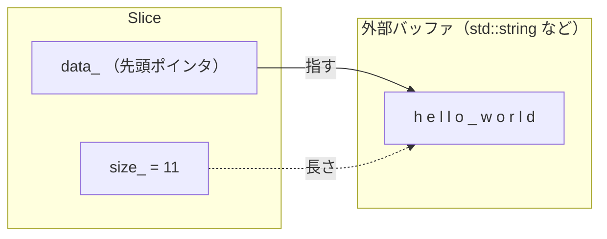
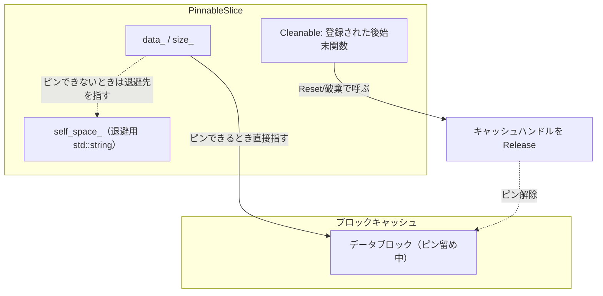

# 第4章 Slice とゼロコピー

> **本章で読むソース**
>
> - [`include/rocksdb/slice.h`](https://github.com/facebook/rocksdb/blob/v11.1.1/include/rocksdb/slice.h)
> - [`include/rocksdb/cleanable.h`](https://github.com/facebook/rocksdb/blob/v11.1.1/include/rocksdb/cleanable.h)
> - [`include/rocksdb/db.h`](https://github.com/facebook/rocksdb/blob/v11.1.1/include/rocksdb/db.h)

## この章の狙い

RocksDB のキーと値は、ほとんどの API でバイト列の所有権を持たない参照として渡される。
その参照を表す型が `Slice` であり、これがコピーを避けるための土台になっている。
本章では `Slice` の構造と操作 API を読み、参照型ゆえの寿命の落とし穴を確認し、読み出し結果のコピーを省く `PinnableSlice` の機構を理解する。

## 前提

- [はじめての RocksDB](../part00-introduction/03-hello-rocksdb.md)
- [アーキテクチャ概観](../part00-introduction/02-architecture-overview.md)

C++ のポインタと参照、`std::string` の内部表現（連続バッファ）を前提とする。

## Slice の正体

`Slice` は、外部にあるバイト列の先頭ポインタと長さだけを持つ構造体である。
ヘッダ冒頭のコメントがこの設計をそのまま述べている。

[`include/rocksdb/slice.h` L9-L12](https://github.com/facebook/rocksdb/blob/v11.1.1/include/rocksdb/slice.h#L9-L12)

```cpp
// Slice is a simple structure containing a pointer into some external
// storage and a size.  The user of a Slice must ensure that the slice
// is not used after the corresponding external storage has been
// deallocated.
```

データ本体は `Slice` の外にあり、`Slice` はそこへの参照を持つだけである。
メンバはポインタと長さの二つしかない。

[`include/rocksdb/slice.h` L127-L128](https://github.com/facebook/rocksdb/blob/v11.1.1/include/rocksdb/slice.h#L127-L128)

```cpp
  const char* data_;
  size_t size_;
```

`data_` は参照先バイト列の先頭を指し、`size_` はその長さをバイト単位で持つ。
コメントにあるとおり `data_` 以外にメンバはなく、メンバを `public` にしている理由は RocksJava からのアクセスのためだと注記されている（[L126](https://github.com/facebook/rocksdb/blob/v11.1.1/include/rocksdb/slice.h#L126)）。

コンストラクタ群を見ると、いずれの経路でもバイト列をコピーせず、既存バッファの先頭と長さを写し取るだけだとわかる。

[`include/rocksdb/slice.h` L35-L51](https://github.com/facebook/rocksdb/blob/v11.1.1/include/rocksdb/slice.h#L35-L51)

```cpp
  // Create an empty slice.
  Slice() : data_(""), size_(0) {}

  // Create a slice that refers to d[0,n-1].
  Slice(const char* d, size_t n) : data_(d), size_(n) {}

  // Create a slice that refers to the contents of "s"
  /* implicit */
  Slice(const std::string& s) : data_(s.data()), size_(s.size()) {}

  // Create a slice that refers to the same contents as "sv"
  /* implicit */
  Slice(const std::string_view& sv) : data_(sv.data()), size_(sv.size()) {}

  // Create a slice that refers to s[0,strlen(s)-1]
  /* implicit */
  Slice(const char* s) : data_(s) { size_ = (s == nullptr) ? 0 : strlen(s); }
```

引数なしのコンストラクタは空文字列リテラルを指し、長さを 0 にする。
`std::string` を受け取る経路は `s.data()` と `s.size()` を写すだけで、文字列の中身は複製しない。
C 文字列を受け取る経路は `strlen` で長さを測るが、これもバッファ自体は共有する。
`std::string` と `std::string_view` と C 文字列のコンストラクタは `implicit`（暗黙変換可能）と注記されており、`Slice` を引数に取る API へこれらの型をそのまま渡せる。

この「コピーしない」性質がゼロコピーの出発点である。
キーや値を API に渡すたびにバイト列を複製していては、書き込みも読み出しもメモリ確保とコピーに費やされる。
`Slice` を共通の受け渡し型に据えることで、呼び出し側が持っているバッファをそのまま参照でき、複製は本当に必要になった時点まで遅延できる。



## 比較と操作の API

`Slice` はバイト列の辞書順比較を提供する。
三方比較 `compare` がその中心で、共通長まで `memcmp` で比べ、等しければ短いほうを小さいとする。

[`include/rocksdb/slice.h` L283-L294](https://github.com/facebook/rocksdb/blob/v11.1.1/include/rocksdb/slice.h#L283-L294)

```cpp
inline int Slice::compare(const Slice& b) const {
  assert(data_ != nullptr && b.data_ != nullptr);
  const size_t min_len = (size_ < b.size_) ? size_ : b.size_;
  int r = memcmp(data_, b.data_, min_len);
  if (r == 0) {
    if (size_ < b.size_)
      r = -1;
    else if (size_ > b.size_)
      r = +1;
  }
  return r;
}
```

短いほうの長さ `min_len` までを `memcmp` で比較し、そこまでが等しければ長さの大小で決着をつける。
これは辞書順（バイト列としての大小）であり、`BytewiseComparator` の振る舞いとも一致する。
RocksDB のキーは内部キーへ符号化されたうえで比較されるが、その符号化されたバイト列の比較もこの `Slice::compare` を土台にする。
内部キーの構造と比較は第5章で扱う。

等値比較は専用の自由関数として定義されており、長さが等しいときだけ `memcmp` する。

[`include/rocksdb/slice.h` L276-L281](https://github.com/facebook/rocksdb/blob/v11.1.1/include/rocksdb/slice.h#L276-L281)

```cpp
inline bool operator==(const Slice& x, const Slice& y) {
  return ((x.size() == y.size()) &&
          (memcmp(x.data(), y.data(), x.size()) == 0));
}

inline bool operator!=(const Slice& x, const Slice& y) { return !(x == y); }
```

長さが違えば `memcmp` を呼ばずに不一致を返すため、長さの異なるキー同士の等値判定は分岐一つで済む。

前方一致と後方一致も、長さの確認と `memcmp` だけで判定する。

[`include/rocksdb/slice.h` L113-L121](https://github.com/facebook/rocksdb/blob/v11.1.1/include/rocksdb/slice.h#L113-L121)

```cpp
  // Return true iff "x" is a prefix of "*this"
  bool starts_with(const Slice& x) const {
    return ((size_ >= x.size_) && (memcmp(data_, x.data_, x.size_) == 0));
  }

  bool ends_with(const Slice& x) const {
    return ((size_ >= x.size_) &&
            (memcmp(data_ + size_ - x.size_, x.data_, x.size_) == 0));
  }
```

`starts_with` はプレフィックスシークやプレフィックスブルームフィルタの判定で使われる。

参照範囲を縮める操作も提供される。
`remove_prefix` はポインタを前へ進めて長さを減らし、`remove_suffix` は長さだけを減らす。

[`include/rocksdb/slice.h` L79-L89](https://github.com/facebook/rocksdb/blob/v11.1.1/include/rocksdb/slice.h#L79-L89)

```cpp
  // Drop the first "n" bytes from this slice.
  void remove_prefix(size_t n) {
    assert(n <= size());
    data_ += n;
    size_ -= n;
  }

  void remove_suffix(size_t n) {
    assert(n <= size());
    size_ -= n;
  }
```

どちらもバイト列には触れず、参照する窓をずらすだけである。
内部キーから末尾のシーケンス番号と型を切り落として「ユーザーキー部分」を取り出すといった操作が、コピーなしで行える。

## 寿命の落とし穴

`Slice` がバイト列を所有しないという性質は、そのまま寿命管理の責任を呼び出し側へ移す。
ヘッダ冒頭のコメントが「対応する外部ストレージが解放された後に slice を使ってはならない」と明言していた（[L10-L12](https://github.com/facebook/rocksdb/blob/v11.1.1/include/rocksdb/slice.h#L10-L12)）。
`Slice` が指す先のバッファが先に消えれば、`data_` はダングリングポインタになる。

危険が出やすいのは、一時オブジェクトの `std::string` から `Slice` を作る場合である。

```cpp
// 危険な例
Slice key = std::string("user:") + std::to_string(id);
//          ^^^^^^^^^^^^^^^^^^^^^^^^^^^^^^^^^^^^^^^^^^^^
//          この一時 std::string は文の終わりで破棄される
db->Put(write_options, key, value);  // key.data_ はすでに無効
```

右辺の連結結果は一時オブジェクトであり、その寿命は文の終わりまでである。
`Slice` のコンストラクタは `s.data()` を写すだけなので（[L43](https://github.com/facebook/rocksdb/blob/v11.1.1/include/rocksdb/slice.h#L43)）、文を抜けた時点で `key.data_` は解放済みの領域を指す。
これを避けるには、参照先の `std::string` を `Slice` より長く生かす。

```cpp
// 安全な例
std::string buf = std::string("user:") + std::to_string(id);
Slice key(buf);            // key は buf を指す
db->Put(write_options, key, value);
// buf が key より長く生きている
```

`Slice` を保持する変数より、その参照先のバッファを必ず長く生かす。
これがゼロコピーと引き換えに呼び出し側が負う規律である。

## PinnableSlice による値コピーの省略

読み出しの結果でも、同じくコピーを避けたい場面がある。
`Get` で取り出した値が SST のデータブロックとしてブロックキャッシュに載っているとき、そのブロックは読み出し中ピン留めできる。
ピン留めされている間はブロックがキャッシュから追い出されないので、値を呼び出し側のバッファへ複製せず、キャッシュ上のバイト列を直接指せる。
これを担うのが `PinnableSlice` である。

`PinnableSlice` は `Slice` と `Cleanable` の両方を継承する。

[`include/rocksdb/slice.h` L173-L189](https://github.com/facebook/rocksdb/blob/v11.1.1/include/rocksdb/slice.h#L173-L189)

```cpp
/**
 * A Slice that can be pinned with some cleanup tasks, which will be run upon
 * ::Reset() or object destruction, whichever is invoked first. This can be used
 * to avoid memcpy by having the PinnableSlice object referring to the data
 * that is locked in the memory and release them after the data is consumed.
 */
class PinnableSlice : public Slice, public Cleanable {
 public:
  PinnableSlice() { buf_ = &self_space_; }
  explicit PinnableSlice(std::string* buf) { buf_ = buf; }

  PinnableSlice(PinnableSlice&& other);
  PinnableSlice& operator=(PinnableSlice&& other);

  // No copy constructor and copy assignment allowed.
  PinnableSlice(PinnableSlice&) = delete;
  PinnableSlice& operator=(PinnableSlice&) = delete;
```

クラスのコメントが目的をそのまま述べている。
メモリ上にロックされたデータを `PinnableSlice` が指し、消費し終えた後にそれを解放することで `memcpy` を避ける、というものである。

`Slice` を継承するので `PinnableSlice` 自身が `data_` と `size_` を持ち、値そのものの参照になる。
`Cleanable` を継承するので、ピン留めの後始末を表すクリーンアップ関数を登録できる。
コピーコンストラクタとコピー代入は `delete` されており（[L188-L189](https://github.com/facebook/rocksdb/blob/v11.1.1/include/rocksdb/slice.h#L188-L189)）、ピン留めの所有権が二重に持たれないようムーブだけが許される。

### ピン留めと後始末の連結

値をピン留めする `PinSlice` は二つの形を持つ。
クリーンアップ関数を直接受け取る形では、`data_` と `size_` を引数のスライスへ向け、後始末関数を登録する。

[`include/rocksdb/slice.h` L191-L199](https://github.com/facebook/rocksdb/blob/v11.1.1/include/rocksdb/slice.h#L191-L199)

```cpp
  inline void PinSlice(const Slice& s, CleanupFunction f, void* arg1,
                       void* arg2) {
    assert(!pinned_);
    pinned_ = true;
    data_ = s.data();
    size_ = s.size();
    RegisterCleanup(f, arg1, arg2);
    assert(pinned_);
  }
```

`data_` と `size_` を `s` に合わせ、`pinned_` を立てたうえで `RegisterCleanup` を呼ぶ。
登録される `f` は、たとえばブロックキャッシュのハンドルを `Release` する関数で、`arg1` や `arg2` にキャッシュとハンドルを渡す。
こうして「値はキャッシュ上のここにある」という参照と「使い終えたらこのハンドルを返す」という後始末が、一つの `PinnableSlice` に結び付く。

登録されたクリーンアップは、`Cleanable` のデストラクタか `Reset` のいずれか先に呼ばれたほうで実行される。
`Cleanable` 側の `Reset` がその起点になる。

[`include/rocksdb/cleanable.h` L43-L48](https://github.com/facebook/rocksdb/blob/v11.1.1/include/rocksdb/cleanable.h#L43-L48)

```cpp
  // DoCleanup and also resets the pointers for reuse
  inline void Reset() {
    DoCleanup();
    cleanup_.function = nullptr;
    cleanup_.next = nullptr;
  }
```

`DoCleanup` は登録された関数を順にたどって呼び出し、ブロックキャッシュへハンドルを返す。
このとき初めてブロックのピン留めが解け、キャッシュからの追い出しが許される。
`PinnableSlice` 側の `Reset` は、この `Cleanable::Reset` を呼んでからピン留めフラグと長さを落とす。

[`include/rocksdb/slice.h` L248-L256](https://github.com/facebook/rocksdb/blob/v11.1.1/include/rocksdb/slice.h#L248-L256)

```cpp
  void Reset() {
    Cleanable::Reset();
    pinned_ = false;
    size_ = 0;
  }

  inline std::string* GetSelf() { return buf_; }

  inline bool IsPinned() const { return pinned_; }
```

### ピンできないときの退避先

値が常にピン留めできるとは限らない。
マージ演算子で組み立てた値のように、キャッシュ上の連続したバイト列として存在しない値もある。
このとき `PinnableSlice` は内部に持つ `std::string` バッファへ値を写し、そこを指す。

[`include/rocksdb/slice.h` L212-L225](https://github.com/facebook/rocksdb/blob/v11.1.1/include/rocksdb/slice.h#L212-L225)

```cpp
  inline void PinSelf(const Slice& slice) {
    assert(!pinned_);
    buf_->assign(slice.data(), slice.size());
    data_ = buf_->data();
    size_ = buf_->size();
    assert(!pinned_);
  }

  inline void PinSelf() {
    assert(!pinned_);
    data_ = buf_->data();
    size_ = buf_->size();
    assert(!pinned_);
  }
```

`PinSelf(slice)` は `buf_->assign` で値を複製し、`data_` をその内部バッファへ向ける。
このときは `pinned_` を立てない。
`buf_` の指す先は、既定ではメンバの `self_space_` で、`PinnableSlice(std::string* buf)` を使えば呼び出し側が用意した `std::string` になる（[L181-L182](https://github.com/facebook/rocksdb/blob/v11.1.1/include/rocksdb/slice.h#L181-L182)、[L260-L261](https://github.com/facebook/rocksdb/blob/v11.1.1/include/rocksdb/slice.h#L260-L261)）。
ピンできるときはキャッシュを直接指してコピーを省き、ピンできないときだけ退避先へ写す、という二段構えになっている。



### Get のオーバーロードに現れるコピーの差

値コピーの省略がどう効くかは、`db.h` の `Get` のオーバーロードを並べると見える。
出力を `std::string*` で受ける形は、結果が一旦 `PinnableSlice` に入った後、ピンされていれば `assign` で文字列へ写す。

[`include/rocksdb/db.h` L627-L640](https://github.com/facebook/rocksdb/blob/v11.1.1/include/rocksdb/db.h#L627-L640)

```cpp
  // No timestamp, and the value is returned as a string
  // NOTE: virtual final => disallow override (was previously allowed)
  virtual inline Status Get(const ReadOptions& options,
                            ColumnFamilyHandle* column_family, const Slice& key,
                            std::string* value) final {
    assert(value != nullptr);
    PinnableSlice pinnable_val(value);
    assert(!pinnable_val.IsPinned());
    auto s = Get(options, column_family, key, &pinnable_val);
    if (s.ok() && pinnable_val.IsPinned()) {
      value->assign(pinnable_val.data(), pinnable_val.size());
    }  // else value is already assigned
    return s;
  }
```

この経路では、値がキャッシュ上にピン留めできても、結局 `value->assign` で呼び出し側の文字列へ複製する。
一方、出力を `PinnableSlice*` で受ける形は、複製せずにピン留めされた参照をそのまま呼び出し側へ返す。

[`include/rocksdb/db.h` L619-L625](https://github.com/facebook/rocksdb/blob/v11.1.1/include/rocksdb/db.h#L619-L625)

```cpp
  // No timestamp, and value is returned in a PinnableSlice
  // NOTE: virtual final => disallow override (was previously allowed)
  virtual Status Get(const ReadOptions& options,
                     ColumnFamilyHandle* column_family, const Slice& key,
                     PinnableSlice* value) final {
    return Get(options, column_family, key, value, nullptr);
  }
```

`PinnableSlice*` 版では、`value` がキャッシュ上のブロックを直接指し、呼び出し側が値を読み終えて `Reset` するか `value` を破棄したときに後始末が走る。
値が大きいほど、この `assign` 一回ぶんの複製を省ける効果が大きい。
ただし呼び出し側は、`PinnableSlice` を生かしている間ブロックをピン留めし続ける点に注意がいる。
読み終えたら速やかに `Reset` または破棄してキャッシュへ返さなければ、その分のキャッシュ容量が占有され続ける。

## 高速化の核

この章の最適化は二段で効く。
第一に、`Slice` がポインタと長さだけの参照型であることで、キーと値を API へ渡すたびのバイト列複製がなくなる。
コンストラクタが既存バッファの先頭と長さを写すだけだからである（[L39-L51](https://github.com/facebook/rocksdb/blob/v11.1.1/include/rocksdb/slice.h#L39-L51)）。
第二に、`PinnableSlice` が読み出し結果をブロックキャッシュ上で直接指すことで、値を呼び出し側へ複製する `memcpy` を一回省ける。
ピン留め中はブロックが追い出されないため参照が安全に保たれ、消費後に登録済みのクリーンアップがキャッシュハンドルを返す（[`cleanable.h` L43-L48](https://github.com/facebook/rocksdb/blob/v11.1.1/include/rocksdb/cleanable.h#L43-L48)）。

`PinnableSlice` がどこでブロックをピン留めし、どのタイミングでクリーンアップを登録するかは、読み出し経路そのものに踏み込まないと見えない。
読み出し経路の全体は第23章で扱う。

## まとめ

- `Slice` は `(data_, size_)` の二つだけを持つ参照型であり、バイト列を所有しない。
  コンストラクタは既存バッファの先頭と長さを写すだけで複製しない。
- 比較は `compare` と `operator==` が `memcmp` で行い、辞書順を与える。
  内部キーの比較もこの `Slice::compare` を土台にする。
- `remove_prefix` と `remove_suffix` は参照する窓をずらすだけで、コピーなしに部分列を取り出せる。
- 所有権を持たないため、参照先バッファを `Slice` より長く生かす責任は呼び出し側にある。
  一時 `std::string` から作った `Slice` はダングリングになる。
- `PinnableSlice` は `Slice` と `Cleanable` を継承し、値をブロックキャッシュ上で直接指して `memcpy` を省く。
  ピンできないときだけ内部バッファへ退避する。
- `Get` の `PinnableSlice*` 版は、`std::string*` 版が行う `assign` の複製を省く。
  引き換えに、消費後の `Reset` でピンを解く規律がいる。

## 関連する章

- [第5章 内部キー](05-internal-key.md)
- [第23章 Get](../part04-read-path/23-get.md)
- [第25章 Table Cache](../part04-read-path/25-table-cache.md)
