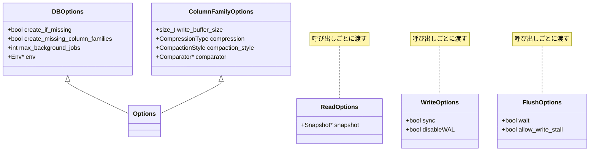
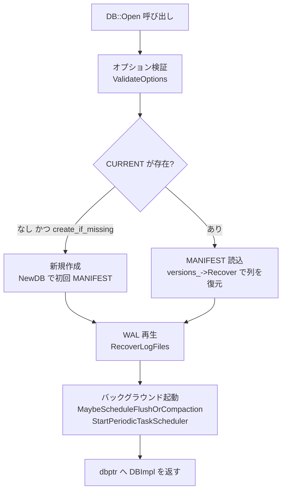

# 第6章 DB インターフェースと Options

> **本章で読むソース**
> - [`include/rocksdb/db.h`](https://github.com/facebook/rocksdb/blob/v11.1.1/include/rocksdb/db.h)
> - [`include/rocksdb/options.h`](https://github.com/facebook/rocksdb/blob/v11.1.1/include/rocksdb/options.h)
> - [`include/rocksdb/advanced_options.h`](https://github.com/facebook/rocksdb/blob/v11.1.1/include/rocksdb/advanced_options.h)
> - [`db/db_impl/db_impl_open.cc`](https://github.com/facebook/rocksdb/blob/v11.1.1/db/db_impl/db_impl_open.cc)

## この章の狙い

RocksDB を使うコードが最初に触れる型は `DB` と `Options` の二つである。
`DB` はデータベース全体の操作をまとめた窓口であり、`Options` は挙動を決める設定の集合である。
本章では、`DB` がどんな操作を抽象基底クラスとして並べ、それぞれがどの内部パスへ繋がるかを読む。
続いて開き方の四つのバリエーションと、設定を `DBOptions` と `ColumnFamilyOptions` に分けている理由を確認し、`DBImpl::Open` が起動時に何をするかを大づかみに追う。

## 前提

- [はじめての RocksDB](../part00-introduction/03-hello-rocksdb.md)
- [アーキテクチャ概観](../part00-introduction/02-architecture-overview.md)
- [Slice とゼロコピー](04-slice.md)

C++ の継承と仮想関数、抽象基底クラスを前提とする。

## DB は操作の窓口である

`DB` は、永続化された順序付きキー値ストアを表す抽象基底クラスである。
ヘッダ冒頭のコメントが、複数スレッドから外部同期なしに安全にアクセスできること、そして実体は `DBImpl` という一つの主実装であることを述べている。

[`include/rocksdb/db.h` L126-L131](https://github.com/facebook/rocksdb/blob/v11.1.1/include/rocksdb/db.h#L126-L131)

```cpp
// A DB is a persistent, versioned ordered map from keys to values.
// A DB is safe for concurrent access from multiple threads without
// any external synchronization.
// DB is an abstract base class with one primary implementation (DBImpl)
// and a number of wrapper implementations.
class DB {
```

利用側のコードは `DB*` を通じてしか操作しない。
書き込みも読み出しもバックグラウンド処理の制御も、すべて `DB` の仮想メソッドとして並ぶ。
実装は `DBImpl` が担い、トランザクションや読み取り専用などの派生はラッパーとして `DBImpl` を包む。
この構成により、利用側は実装の差し替えを意識せずに同じ呼び出し方を保てる。

代表的な操作メソッドを、つながる先のパスとともに並べる。
いずれも宣言は `db.h` にあり、列ごとの操作には `ColumnFamilyHandle*` を取る形と、既定列に向ける省略形の二つがある。

- **Put**：キーに値を書き込む。書き込みパイプラインを通って WAL とメモリテーブルに入る。宣言は [`include/rocksdb/db.h` L429-L434](https://github.com/facebook/rocksdb/blob/v11.1.1/include/rocksdb/db.h#L429-L434)。
- **Delete**：キーの削除を記録する。削除マーカー（トゥームストーン）を書き込む点を除けば `Put` と同じパスを通る。宣言は [`include/rocksdb/db.h` L461-L466](https://github.com/facebook/rocksdb/blob/v11.1.1/include/rocksdb/db.h#L461-L466)。
- **SingleDelete**：一度しか `Put` されていないキーの削除に限定した最適化版。宣言は [`include/rocksdb/db.h` L491-L496](https://github.com/facebook/rocksdb/blob/v11.1.1/include/rocksdb/db.h#L491-L496)。
- **Merge**：値を上書きせず、ユーザー定義の `merge_operator` で既存値と統合する。宣言は [`include/rocksdb/db.h` L542-L544](https://github.com/facebook/rocksdb/blob/v11.1.1/include/rocksdb/db.h#L542-L544)。
- **Write**：複数の更新を `WriteBatch` にまとめ、原子的に適用する。`Put` や `Delete` も内部では一件の `WriteBatch` に包まれてこの経路に合流する。宣言は [`include/rocksdb/db.h` L559](https://github.com/facebook/rocksdb/blob/v11.1.1/include/rocksdb/db.h#L559)。
- **Get**：キーに対応する値を読み出す。メモリテーブルから順に SST ファイルへと探索する読み出しパスに繋がる。宣言は [`include/rocksdb/db.h` L599-L601](https://github.com/facebook/rocksdb/blob/v11.1.1/include/rocksdb/db.h#L599-L601)。
- **NewIterator**：データベースを走査する反復子を返す。宣言は [`include/rocksdb/db.h` L990-L991](https://github.com/facebook/rocksdb/blob/v11.1.1/include/rocksdb/db.h#L990-L991)。
- **Flush**：メモリテーブルの内容を SST ファイルへ書き出す。宣言は [`include/rocksdb/db.h` L1748-L1749](https://github.com/facebook/rocksdb/blob/v11.1.1/include/rocksdb/db.h#L1748-L1749)。
- **CompactRange**：指定したキー範囲の SST を手動で再編成し、削除済みや上書き済みの版を捨てる。宣言は [`include/rocksdb/db.h` L1531-L1533](https://github.com/facebook/rocksdb/blob/v11.1.1/include/rocksdb/db.h#L1531-L1533)。

`Put` や `Delete` が単独の操作に見えても、内部では一件の `WriteBatch` に変換されて `Write` の経路に合流する。
この合流のおかげで、単発書き込みとバッチ書き込みが同じパイプラインを共有できる（書き込みパイプラインの詳細は[書き込みパイプライン](../part02-write-path/08-write-pipeline.md)で扱う）。

ここで `Put` の宣言を見ると、操作メソッドの引数の作りが見える。

[`include/rocksdb/db.h` L429-L442](https://github.com/facebook/rocksdb/blob/v11.1.1/include/rocksdb/db.h#L429-L442)

```cpp
virtual Status Put(const WriteOptions& options,
                   ColumnFamilyHandle* column_family, const Slice& key,
                   const Slice& value) = 0;
// ... (中略) ...
virtual Status Put(const WriteOptions& options, const Slice& key,
                   const Slice& value) {
  return Put(options, DefaultColumnFamily(), key, value);
}
```

先頭が `WriteOptions`、次が操作対象の列を指す `ColumnFamilyHandle*` である。
列を取らない省略形は `DefaultColumnFamily()` を補って純粋仮想版へ委譲する。
つまり列の指定は必須であり、省略形は既定列という暗黙の指定にすぎない。
キーと値は前章で見た `Slice`、すなわちバイト列への参照で渡し、戻り値の `Status` で成否を運ぶ。

## DB の開き方

データベースを開く入口は `static` な `Open` 系メソッドである。
最も単純なものは `Options` 一つを取り、既定の列だけを開いて `DB` のスマートポインタを返す。

[`include/rocksdb/db.h` L133-L140](https://github.com/facebook/rocksdb/blob/v11.1.1/include/rocksdb/db.h#L133-L140)

```cpp
// Open the database with the specified "name" for reads and writes.
// On success, stores the database in *dbptr and returns OK.
// On error, resets *dbptr and returns a non-OK status, including
// if the DB is already open (read-write) by another DB object. (This
// guarantee depends on options.env->LockFile(), which might not provide
// this guarantee in a custom Env implementation.)
static Status Open(const Options& options, const std::string& name,
                   std::unique_ptr<DB>* dbptr);
```

複数の列を扱うときは、列ごとの設定を含む `ColumnFamilyDescriptor` の配列を渡す版を使う。
このとき設定は `DBOptions` と `ColumnFamilyOptions` に分かれる。
データベース全体の設定は引数 `db_options` で一度だけ与え、列ごとの設定は各 `ColumnFamilyDescriptor` の中に入れる。

[`include/rocksdb/db.h` L142-L159](https://github.com/facebook/rocksdb/blob/v11.1.1/include/rocksdb/db.h#L142-L159)

```cpp
// Open DB with column families.
// db_options specify database specific options
// column_families is the vector of all column families in the database,
// containing column family name and options. You need to open ALL column
// families in the database. To get the list of column families, you can use
// ListColumnFamilies().
//
// The default column family name is 'default' and it's stored
// in ROCKSDB_NAMESPACE::kDefaultColumnFamilyName.
// If everything is OK, handles will on return be the same size
// as column_families --- handles[i] will be a handle that you
// will use to operate on column family column_family[i].
// Before destroying the DB, you have to close all column families by calling
// DestroyColumnFamilyHandle() with all the handles.
static Status Open(const DBOptions& db_options, const std::string& name,
                   const std::vector<ColumnFamilyDescriptor>& column_families,
                   std::vector<ColumnFamilyHandle*>* handles,
                   std::unique_ptr<DB>* dbptr);
```

ここで重要なのは、開いた列の数だけ `ColumnFamilyHandle*` が `handles` に返る点である。
コメントが述べるとおり、`handles[i]` が `column_families[i]` を操作するハンドルになる。
以後の `Put` や `Get` はこのハンドルを渡して、どの列に対する操作かを指定する。
データベースを閉じる前には、`DestroyColumnFamilyHandle()` でこれらのハンドルを解放する必要がある。

書き込みを伴わない開き方として、読み取り専用とセカンダリの二つがある。
読み取り専用の `OpenForReadOnly` は、書き込み系の API がすべてエラーを返す状態でデータベースを開く。
自動および手動の `Flush` と `Compaction` も無効になる。

[`include/rocksdb/db.h` L161-L171](https://github.com/facebook/rocksdb/blob/v11.1.1/include/rocksdb/db.h#L161-L171)

```cpp
// OpenForReadOnly() creates a Read-only instance that supports reads alone.
//
// All DB interfaces that modify data, like put/delete, will return error.
// Automatic Flush and Compactions are disabled and any manual calls
// to Flush/Compaction will return error.
//
// While a given DB can be simultaneously opened via OpenForReadOnly
// by any number of readers, if a DB is simultaneously opened by Open
// and OpenForReadOnly, the read-only instance has undefined behavior
// (though can often succeed if quickly closed) and the read-write
// instance is unaffected. See also OpenAsSecondary.
```

セカンダリの `OpenAsSecondary` も読み取り専用だが、書き込み中の主インスタンスへ追従できる点が異なる。
`TryCatchUpWithPrimary()` を呼ぶと、主インスタンスがその後に進めた状態を取り込む。
同じデータベースに対して複数のセカンダリを同時に立てられる。

[`include/rocksdb/db.h` L192-L201](https://github.com/facebook/rocksdb/blob/v11.1.1/include/rocksdb/db.h#L192-L201)

```cpp
// OpenAsSecondary() creates a secondary instance that supports read-only
// operations and supports dynamic catch up with the primary (through a
// call to TryCatchUpWithPrimary()).
//
// All DB interfaces that modify data, like put/delete, will return error.
// Automatic Flush and Compactions are disabled and any manual calls
// to Flush/Compaction will return error.
//
// Multiple secondary instances can co-exist at the same time.
//
```

`OpenForReadOnly` と `OpenAsSecondary` のどちらにも、複数列を指定する版がある。
これらの読み取り系では、データベースにあるすべての列を開く必要はなく一部だけ開けばよいが、既定列の指定は常に必要になる。

## DBOptions と ColumnFamilyOptions を分ける理由

設定の型は三段で組まれている。
データベース全体に効く `DBOptions`、列ごとに効く `ColumnFamilyOptions`、そして両者をまとめた `Options` である。
`Options` は二つを多重継承しているため、一つのオブジェクトに全設定を詰め込める。

[`include/rocksdb/options.h` L1765-L1772](https://github.com/facebook/rocksdb/blob/v11.1.1/include/rocksdb/options.h#L1765-L1772)

```cpp
// Options to control the behavior of a database (passed to DB::Open)
struct Options : public DBOptions, public ColumnFamilyOptions {
  // Create an Options object with default values for all fields.
  Options() : DBOptions(), ColumnFamilyOptions() {}

  Options(const DBOptions& db_options,
          const ColumnFamilyOptions& column_family_options)
      : DBOptions(db_options), ColumnFamilyOptions(column_family_options) {}
```

二つに分けるのは、設定の効く範囲が違うからである。
スレッドプールや WAL の置き場所のようにデータベースに一つしかない資源の設定は `DBOptions` に属する。
メモリテーブルの大きさや圧縮方式、コンパクション方式のように列ごとに変えたい設定は `ColumnFamilyOptions` に属する。
複数列を開く `Open` が `db_options` を一度だけ取り、列ごとの設定を `ColumnFamilyDescriptor` の側に置くのは、この区別をそのまま引数の形にしたものである。
単一列で済む単純な `Open` では `Options` 一つで足り、継承によって両方の設定を同時に渡せる。



`DBOptions` のフィールドのうち、開き方そのものを左右する三つを見る。

[`include/rocksdb/options.h` L593-L604](https://github.com/facebook/rocksdb/blob/v11.1.1/include/rocksdb/options.h#L593-L604)

```cpp
// If true, the database will be created if it is missing.
// Default: false
bool create_if_missing = false;

// If true, missing column families will be automatically created on
// DB::Open().
// Default: false
bool create_missing_column_families = false;

// If true, an error is raised if the database already exists.
// Default: false
bool error_if_exists = false;
```

既定では `create_if_missing` が `false` なので、存在しないデータベースを開こうとするとエラーになる。
新規作成したいときはこれを `true` にする。
バックグラウンドの並列度を決めるのは `max_background_jobs` で、フラッシュとコンパクションを合わせた同時実行数の上限を表す。

[`include/rocksdb/options.h` L893-L898](https://github.com/facebook/rocksdb/blob/v11.1.1/include/rocksdb/options.h#L893-L898)

```cpp
// Maximum number of concurrent background jobs (compactions and flushes).
//
// Default: 2
//
// Dynamically changeable through SetDBOptions() API.
int max_background_jobs = 2;
```

`ColumnFamilyOptions` 側で代表的なのは、メモリテーブルの大きさを決める `write_buffer_size` である。
既定は 64MB で、この大きさに達したメモリテーブルがフラッシュ対象になる。
コメントが述べるとおり、この設定は列ごとに効く。

[`include/rocksdb/options.h` L184-L190](https://github.com/facebook/rocksdb/blob/v11.1.1/include/rocksdb/options.h#L184-L190)

```cpp
// Note that write_buffer_size is enforced per column family.
// See db_write_buffer_size for sharing memory across column families.
//
// Default: 64MB
//
// Dynamically changeable through SetOptions() API
size_t write_buffer_size = 64 << 20;
```

圧縮方式は `compression` フィールドで指定する。
ブロックを圧縮するアルゴリズムを選ぶもので、ヘッダはこの設定を SST のブロック単位に効くものとして説明している。

[`include/rocksdb/options.h` L192-L218](https://github.com/facebook/rocksdb/blob/v11.1.1/include/rocksdb/options.h#L192-L218)

```cpp
// Compress blocks using the specified compression algorithm.
//
// Default: kSnappyCompression, if it's supported. If snappy is not linked
// with the library, the default is kNoCompression.
// ... (中略) ...
CompressionType compression;
```

コンパクション方式は `compaction_style` で選ぶ。
このフィールドの宣言は高度オプションをまとめた `advanced_options.h` にあり、既定はレベル方式である。

[`include/rocksdb/advanced_options.h` L718-L719](https://github.com/facebook/rocksdb/blob/v11.1.1/include/rocksdb/advanced_options.h#L718-L719)

```cpp
// The compaction style. Default: kCompactionStyleLevel
CompactionStyle compaction_style = kCompactionStyleLevel;
```

選べる方式は `CompactionStyle` 列挙で定義される。
レベル方式、ユニバーサル方式、FIFO 方式、そして背景コンパクションを止める方式の四つである。

[`include/rocksdb/advanced_options.h` L26-L36](https://github.com/facebook/rocksdb/blob/v11.1.1/include/rocksdb/advanced_options.h#L26-L36)

```cpp
enum CompactionStyle : char {
  // level based compaction style
  kCompactionStyleLevel = 0x0,
  // Universal compaction style
  kCompactionStyleUniversal = 0x1,
  // FIFO compaction style
  kCompactionStyleFIFO = 0x2,
  // Disable background compaction. Compaction jobs are submitted
  // via CompactFiles().
  kCompactionStyleNone = 0x3,
};
```

`DBOptions` と `ColumnFamilyOptions` がデータベースや列の生存期間にわたる設定であるのに対し、`ReadOptions`、`WriteOptions`、`FlushOptions` は呼び出しごとに渡す設定である。
`WriteOptions` の `sync` は、書き込みを OS のバッファキャッシュから永続化してから完了とみなすかを決める。
`true` にすると書き込みは遅くなるが、機械がクラッシュしても直近の書き込みを失わない。

[`include/rocksdb/options.h` L2319-L2336](https://github.com/facebook/rocksdb/blob/v11.1.1/include/rocksdb/options.h#L2319-L2336)

```cpp
struct WriteOptions {
  // If true, the write will be flushed from the operating system
  // buffer cache (by calling WritableFile::Sync()) before the write
  // is considered complete.  If this flag is true, writes will be
  // slower.
  // ... (中略) ...
  // Default: false
  bool sync = false;
```

読み出し側の `ReadOptions` でよく使うのは `snapshot` である。
非 `nullptr` のスナップショットを渡すと、その時点の状態として読む。
`nullptr` のときは読み出し開始時点の暗黙のスナップショットを使う。

[`include/rocksdb/options.h` L1994-L2001](https://github.com/facebook/rocksdb/blob/v11.1.1/include/rocksdb/options.h#L1994-L2001)

```cpp
struct ReadOptions {
  // *** BEGIN options relevant to point lookups as well as scans ***

  // If "snapshot" is non-nullptr, read as of the supplied snapshot
  // (which must belong to the DB that is being read and which must
  // not have been released).  If "snapshot" is nullptr, use an implicit
  // snapshot of the state at the beginning of this read operation.
  const Snapshot* snapshot = nullptr;
```

`FlushOptions` は二つのフィールドしか持たない小さな構造体で、フラッシュ完了を待つかと、書き込みストールを許してでも即座に進めるかを決める。

[`include/rocksdb/options.h` L2410-L2422](https://github.com/facebook/rocksdb/blob/v11.1.1/include/rocksdb/options.h#L2410-L2422)

```cpp
struct FlushOptions {
  // If true, the flush will wait until the flush is done.
  // Default: true
  bool wait;
  // If true, the flush would proceed immediately even it means writes will
  // stall for the duration of the flush; if false the operation will wait
  // until it's possible to do flush w/o causing stall or until required flush
  // is performed by someone else (foreground call or background thread).
  // Default: false
  bool allow_write_stall;

  FlushOptions() : wait(true), allow_write_stall(false) {}
};
```

## DBImpl::Open は起動時に何をするか

利用側が呼ぶ `static` な `DB::Open` は、最終的に `DBImpl::Open` に降りる。
この関数は巨大だが、骨格はオプション検証から始まる。
まずテーブル設定を含めたオプションの整合性を確かめ、不正なら開かずに戻る。

[`db/db_impl/db_impl_open.cc` L2406-L2423](https://github.com/facebook/rocksdb/blob/v11.1.1/db/db_impl/db_impl_open.cc#L2406-L2423)

```cpp
Status DBImpl::Open(const DBOptions& db_options, const std::string& dbname,
                    const std::vector<ColumnFamilyDescriptor>& column_families,
                    std::vector<ColumnFamilyHandle*>* handles,
                    std::unique_ptr<DB>* dbptr, const bool seq_per_batch,
                    const bool batch_per_txn, const bool is_retry,
                    bool* can_retry) {
  // ... (中略) ...
  Status s = ValidateOptionsByTable(db_options, column_families);
  if (!s.ok()) {
    return s;
  }

  s = ValidateOptions(db_options, column_families);
  if (!s.ok()) {
    return s;
  }
```

検証を通ると `DBImpl` のインスタンスを作り、必要なディレクトリを用意してからロックを取り、`Recover` を呼ぶ。
コメントが端的に示すとおり、`create_if_missing` と `error_if_exists` の処理はこの `Recover` の中で起きる。

[`db/db_impl/db_impl_open.cc` L2481-L2486](https://github.com/facebook/rocksdb/blob/v11.1.1/db/db_impl/db_impl_open.cc#L2481-L2486)

```cpp
// Handles create_if_missing, error_if_exists
uint64_t recovered_seq(kMaxSequenceNumber);
s = impl->Recover(column_families, false /* read_only */,
                  false /* error_if_wal_file_exists */,
                  false /* error_if_data_exists_in_wals */, is_retry,
                  &recovered_seq, &recovery_ctx, can_retry);
```

`Recover` の中では、`CURRENT` ファイルの有無で既存データベースか新規かを見分ける。
`CURRENT` が見つからなければ、`create_if_missing` が `true` のときに限って `NewDB` で初回の MANIFEST を作る。
`false` ならエラーを返す。
逆に既存データベースがあって `error_if_exists` が `true` のときもエラーになる。

[`db/db_impl/db_impl_open.cc` L471-L486](https://github.com/facebook/rocksdb/blob/v11.1.1/db/db_impl/db_impl_open.cc#L471-L486)

```cpp
if (s.IsNotFound()) {
  if (immutable_db_options_.create_if_missing) {
    s = NewDB(&files_in_dbname);
    is_new_db = true;
    if (!s.ok()) {
      return s;
    }
  } else {
    return Status::InvalidArgument(
        current_fname, "does not exist (create_if_missing is false)");
  }
} else if (s.ok()) {
  if (immutable_db_options_.error_if_exists) {
    return Status::InvalidArgument(dbname_,
                                   "exists (error_if_exists is true)");
  }
}
```

既存データベースなら、`versions_->Recover` が MANIFEST を読み、そこに記録された列の集合とそれぞれの SST 構成を復元する。
これが「カラムファミリーの復元」にあたる段階である。

[`db/db_impl/db_impl_open.cc` L532-L537](https://github.com/facebook/rocksdb/blob/v11.1.1/db/db_impl/db_impl_open.cc#L532-L537)

```cpp
if (!immutable_db_options_.best_efforts_recovery) {
  // Status of reading the descriptor file
  Status desc_status;
  s = versions_->Recover(column_families, read_only, &db_id_,
                         /*no_error_if_files_missing=*/false, is_retry,
                         &desc_status);
```

MANIFEST を読んで列を復元したあとは、まだ SST になっていない WAL を再生する。
直前のフラッシュより後に書かれた更新は WAL にだけ残っているので、それをメモリテーブルへ流し込む。
`Recover` は WAL を生成順に並べてから `RecoverLogFiles` に渡す。

[`db/db_impl/db_impl_open.cc` L805-L816](https://github.com/facebook/rocksdb/blob/v11.1.1/db/db_impl/db_impl_open.cc#L805-L816)

```cpp
if (!wal_files.empty()) {
  // Recover in the order in which the wals were generated
  std::vector<uint64_t> wals;
  wals.reserve(wal_files.size());
  for (const auto& wal_file : wal_files) {
    wals.push_back(wal_file.first);
  }
  std::sort(wals.begin(), wals.end());

  bool corrupted_wal_found = false;
  s = RecoverLogFiles(wals, &next_sequence, read_only, is_retry,
                      &corrupted_wal_found, recovery_ctx);
```

`Recover` から戻ると、`Open` の末尾でバックグラウンド処理を立ち上げる。
`MaybeScheduleFlushOrCompaction` がフラッシュとコンパクションをスレッドプールへ投入し、`StartPeriodicTaskScheduler` が定期タスクを動かし始める。

[`db/db_impl/db_impl_open.cc` L2687-L2689](https://github.com/facebook/rocksdb/blob/v11.1.1/db/db_impl/db_impl_open.cc#L2687-L2689)

```cpp
impl->DeleteObsoleteFiles();
TEST_SYNC_POINT("DBImpl::Open:AfterDeleteFiles");
impl->MaybeScheduleFlushOrCompaction();
```

[`db/db_impl/db_impl_open.cc` L2725-L2727](https://github.com/facebook/rocksdb/blob/v11.1.1/db/db_impl/db_impl_open.cc#L2725-L2727)

```cpp
if (s.ok()) {
  s = impl->StartPeriodicTaskScheduler();
}
```

ここまでの流れをまとめると、`Open` はオプション検証、既存データベースのリカバリまたは新規作成、WAL の再生、列の復元、バックグラウンドスレッドの起動という段で進む。



各段の詳細は後続の章で扱う。
新規作成で書く MANIFEST の構造は[MANIFEST と VersionEdit](../part06-version/34-manifest-versionedit.md)、列の復元は[カラムファミリー](../part06-version/35-column-family.md)、WAL の再生は[WAL](../part02-write-path/10-wal.md)とメモリテーブルの[フラッシュ](../part02-write-path/13-flush.md)、バックグラウンド処理の足回りは[ThreadLocal とスレッドプール](../part08-concurrency/43-threadlocal-threadpool.md)で読む。

## 最適化の工夫：単発書き込みもバッチ経路に合流させる

`Put` や `Delete` のような単発の書き込みが、内部で一件の `WriteBatch` に変換されて `Write` の経路に合流する点は、性能設計として効いている。
書き込みパスを一本に絞ると、複数スレッドからの書き込みを一つの WAL 末尾に追記する処理を共通化でき、グループコミットのように複数の更新をまとめて WAL へ書き出す最適化を、単発書き込みにもそのまま適用できる。
もし単発書き込みが専用の別経路を持っていたら、この束ね合わせを二重に実装するか、片方は束ね合わせの恩恵を受けられないことになる。
経路を一本化することで、WAL への I/O 回数と同期回数を減らす機構を一箇所に集約している（束ね合わせの実装は[書き込みパイプライン](../part02-write-path/08-write-pipeline.md)と[WriteThread](../part02-write-path/09-write-thread.md)で読む）。

## まとめ

- `DB` は抽象基底クラスで、`Put`、`Delete`、`Merge`、`Write`、`Get`、`NewIterator`、`Flush`、`CompactRange` などの操作を仮想メソッドとして並べる。実体は `DBImpl` が担う。
- 操作メソッドは `ColumnFamilyHandle*` で対象列を取る版と、`DefaultColumnFamily()` を補う省略形を持つ。`Put` などの単発書き込みは内部で `WriteBatch` に変換され `Write` の経路に合流する。
- `Open` には、通常、複数列、読み取り専用、セカンダリの四系統がある。複数列の `Open` は列の数だけ `ColumnFamilyHandle*` を返す。
- 設定は範囲で分かれる。データベース全体の `DBOptions` と列ごとの `ColumnFamilyOptions`、両者を多重継承した `Options` の三段で、`ReadOptions` や `WriteOptions`、`FlushOptions` は呼び出しごとに渡す。
- `DBImpl::Open` はオプション検証、リカバリまたは新規作成、WAL 再生、列の復元、バックグラウンドスレッド起動の段で進む。`create_if_missing` と `error_if_exists` は `Recover` の中で処理される。

## 関連する章

- [WriteBatch](07-write-batch.md)
- [書き込みパイプライン](../part02-write-path/08-write-pipeline.md)
- [MANIFEST と VersionEdit](../part06-version/34-manifest-versionedit.md)
- [カラムファミリー](../part06-version/35-column-family.md)
