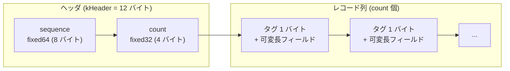

# 第7章 WriteBatch

> **本章で読むソース**
>
> - [`include/rocksdb/write_batch.h`](https://github.com/facebook/rocksdb/blob/v11.1.1/include/rocksdb/write_batch.h)
> - [`include/rocksdb/write_batch_base.h`](https://github.com/facebook/rocksdb/blob/v11.1.1/include/rocksdb/write_batch_base.h)
> - [`db/write_batch_internal.h`](https://github.com/facebook/rocksdb/blob/v11.1.1/db/write_batch_internal.h)
> - [`db/write_batch.cc`](https://github.com/facebook/rocksdb/blob/v11.1.1/db/write_batch.cc)

## この章の狙い

`WriteBatch` は、複数の更新を一つの原子単位にまとめて DB に渡すためのバッファである。
本章では、その更新列が一本の `std::string`（`rep_`）へどのようにシリアライズされるかを、ヘッダ12バイトの構造と各レコードのタグ付き可変長エンコードから読み解く。
さらに `Iterate` と `Handler` による走査の仕組みを追い、`rep_` が再シリアライズなしにそのまま WAL のペイロードになるという最適化が、どこから生まれているかを確かめる。

## 前提

- [第4章 Slice](04-slice.md)
- [第5章 内部キー](05-internal-key.md)
- [第6章 DB と Options](06-db-and-options.md)

## 複数の更新を束ねる原子単位

`WriteBatch` は、書き込みを蓄えておくコンテナである。
その役割は、ヘッダのクラスコメントに簡潔に述べられている。

[`include/rocksdb/write_batch.h` L9-L18](https://github.com/facebook/rocksdb/blob/v11.1.1/include/rocksdb/write_batch.h#L9-L18)

```cpp
// WriteBatch holds a collection of updates to apply atomically to a DB.
//
// The updates are applied in the order in which they are added
// to the WriteBatch.  For example, the value of "key" will be "v3"
// after the following batch is written:
//
//    batch.Put("key", "v1");
//    batch.Delete("key");
//    batch.Put("key", "v2");
//    batch.Put("key", "v3");
```

`Put` や `Delete` を呼ぶたびに、その操作が追加された順序を保ったままバッファに積まれる。
バッファ全体を `DB::Write` に渡すと、含まれる更新がまとめて適用される。
適用の原子性は、バッチ全体に一つの開始シーケンス番号を割り当て、その範囲を一度の WAL 書き込みとメモリテーブル挿入で処理することによって与えられる。
シーケンス番号の意味は[第5章 内部キー](05-internal-key.md)で扱った。

ここで注意したいのは、`DB::Put` のような単発の API も内部では `WriteBatch` を経由する点である。
`DB::Put` の実装は、引数のキーと値だけを入れたローカルの `WriteBatch` を組み立て、それを `Write` に渡している。

[`db/db_impl/db_impl_write.cc` L2778-L2790](https://github.com/facebook/rocksdb/blob/v11.1.1/db/db_impl/db_impl_write.cc#L2778-L2790)

```cpp
Status DB::Put(const WriteOptions& opt, ColumnFamilyHandle* column_family,
               const Slice& key, const Slice& value) {
  // Pre-allocate size of write batch conservatively.
  // 8 bytes are taken by header, 4 bytes for count, 1 byte for type,
  // and we allocate 11 extra bytes for key length, as well as value length.
  WriteBatch batch(key.size() + value.size() + 24, 0 /* max_bytes */,
                   opt.protection_bytes_per_key, 0 /* default_cf_ts_sz */);
  Status s = batch.Put(column_family, key, value);
  if (!s.ok()) {
    return s;
  }
  return Write(opt, &batch);
}
```

書き込みパスは `WriteBatch` を入口に一本化されている。
単発の更新と複数更新のバッチが同じコードを通るので、書き込み側はバッチの中身を場合分けせずに扱える。
この設計のもとでは、`WriteBatch` のシリアライズ形式そのものが書き込みパス全体の基盤になる。

## rep_ のバイトレイアウト

`WriteBatch` が保持する状態は、実質的に一本のバイト列だけである。
クラス末尾の唯一のデータメンバが `rep_` であり、その形式はソースの先頭コメントで定義されている。

[`include/rocksdb/write_batch.h` L544-L545](https://github.com/facebook/rocksdb/blob/v11.1.1/include/rocksdb/write_batch.h#L544-L545)

```cpp
 protected:
  std::string rep_;  // See comment in write_batch.cc for the format of rep_
```

その「format of rep_」を述べたコメントが、`write_batch.cc` の冒頭にある。

[`db/write_batch.cc` L10-L37](https://github.com/facebook/rocksdb/blob/v11.1.1/db/write_batch.cc#L10-L37)

```cpp
// WriteBatch::rep_ :=
//    sequence: fixed64
//    count: fixed32
//    data: record[count]
// record :=
//    kTypeValue varstring varstring
//    kTypeDeletion varstring
//    kTypeSingleDeletion varstring
//    kTypeRangeDeletion varstring varstring
//    kTypeMerge varstring varstring
//    kTypeColumnFamilyValue varint32 varstring varstring
//    kTypeColumnFamilyDeletion varint32 varstring
// ... (中略) ...
//    kTypeNoop
// varstring :=
//    len: varint32
//    data: uint8[len]
```

先頭の12バイトはヘッダである。
8バイトの `sequence`（このバッチの開始シーケンス番号）と、続く4バイトの `count`（レコード数）からなる。
このヘッダ長は `WriteBatchInternal` の定数として固定されている。

[`db/write_batch_internal.h` L79-L81](https://github.com/facebook/rocksdb/blob/v11.1.1/db/write_batch_internal.h#L79-L81)

```cpp
 public:
  // WriteBatch header has an 8-byte sequence number followed by a 4-byte count.
  static constexpr size_t kHeader = 12;
```

ヘッダの後ろには、レコードが `count` 個だけ並ぶ。
各レコードは、1バイトのタグ（`ValueType`）で始まり、その種類に応じた可変長フィールドが続く。
たとえば `kTypeValue`（通常の `Put`）なら、タグの後にキーと値の二つの `varstring` が並ぶ。
`varstring` は、長さを varint32 で前置し、その後ろに生のバイト列を置いた形式である。

空のバッチでもヘッダ12バイトは常に存在する。
コンストラクタは `rep_` をヘッダ長まで `resize` してから返す。

[`db/write_batch.cc` L176-L192](https://github.com/facebook/rocksdb/blob/v11.1.1/db/write_batch.cc#L176-L192)

```cpp
WriteBatch::WriteBatch(size_t reserved_bytes, size_t max_bytes,
                       size_t protection_bytes_per_key, size_t default_cf_ts_sz)
    : content_flags_(0),
      max_bytes_(max_bytes),
      default_cf_ts_sz_(default_cf_ts_sz),
      rep_() {
  // Currently `protection_bytes_per_key` can only be enabled at 8 bytes per
  // entry.
  assert(protection_bytes_per_key == 0 || protection_bytes_per_key == 8);
  if (protection_bytes_per_key != 0) {
    prot_info_.reset(new WriteBatch::ProtectionInfo());
  }
  rep_.reserve((reserved_bytes > WriteBatchInternal::kHeader)
                   ? reserved_bytes
                   : WriteBatchInternal::kHeader);
  rep_.resize(WriteBatchInternal::kHeader);
}
```

`reserved_bytes` を渡すと、その分だけ `rep_` の容量が先取りされる。
先に見た `DB::Put` が `key.size() + value.size() + 24` を渡していたのは、これからエンコードするレコードの大きさを見越して再確保を避けるためである。

レイアウトを図にすると次のようになる。
ヘッダの後ろに、それぞれ独立にエンコードされたレコードが連なる。



## レコードのエンコード

レコードを実際に組み立てる場所は `WriteBatchInternal` の静的メソッドである。
`WriteBatch::Put` などの公開 API は、カラムファミリー ID とタイムスタンプ長を解決したうえで、これらの内部関数に処理を委ねる。
`Put` のエンコード本体を見る。

[`db/write_batch.cc` L852-L886](https://github.com/facebook/rocksdb/blob/v11.1.1/db/write_batch.cc#L852-L886)

```cpp
Status WriteBatchInternal::Put(WriteBatch* b, uint32_t column_family_id,
                               const Slice& key, const Slice& value) {
  if (key.size() > size_t{std::numeric_limits<uint32_t>::max()}) {
    return Status::InvalidArgument("key is too large");
  }
  if (value.size() > size_t{std::numeric_limits<uint32_t>::max()}) {
    return Status::InvalidArgument("value is too large");
  }

  LocalSavePoint save(b);
  WriteBatchInternal::SetCount(b, WriteBatchInternal::Count(b) + 1);
  if (column_family_id == 0) {
    b->rep_.push_back(static_cast<char>(kTypeValue));
  } else {
    b->rep_.push_back(static_cast<char>(kTypeColumnFamilyValue));
    PutVarint32(&b->rep_, column_family_id);
  }
  PutLengthPrefixedSlice(&b->rep_, key);
  PutLengthPrefixedSlice(&b->rep_, value);
  b->content_flags_.store(
      b->content_flags_.load(std::memory_order_relaxed) | ContentFlags::HAS_PUT,
      std::memory_order_relaxed);
  // ... (中略：per-key 保護情報の更新) ...
  return save.commit();
}
```

処理は四段からなる。
まずヘッダの `count` を一つ増やす。
次に、カラムファミリーが既定（ID が 0）かどうかで先頭タグを切り替える。
既定なら `kTypeValue` を1バイト追加し、それ以外なら `kTypeColumnFamilyValue` を追加したうえでカラムファミリー ID を varint32 で書く。
最後に、キーと値を `PutLengthPrefixedSlice` で末尾に追記する。
この関数が `varstring`（長さ varint32 ＋ データ本体）を組み立てる。

タグの値は `ValueType` 列挙で定義されている。
`Put`、`Delete`、`Merge` などがそれぞれ1バイトの定数に対応する。

[`db/dbformat.h` L41-L49](https://github.com/facebook/rocksdb/blob/v11.1.1/db/dbformat.h#L41-L49)

```cpp
enum ValueType : unsigned char {
  kTypeDeletion = 0x0,
  kTypeValue = 0x1,
  kTypeMerge = 0x2,
  kTypeLogData = 0x3,               // WAL only.
  kTypeColumnFamilyDeletion = 0x4,  // WAL only.
  kTypeColumnFamilyValue = 0x5,     // WAL only.
  kTypeColumnFamilyMerge = 0x6,     // WAL only.
  kTypeSingleDeletion = 0x7,
```

`Delete` のエンコードも同じ骨格に従う。
違いは、タグが `kTypeDeletion`（既定）または `kTypeColumnFamilyDeletion` になることと、値の `varstring` を持たずキーだけを追記することである。

[`db/write_batch.cc` L1258-L1281](https://github.com/facebook/rocksdb/blob/v11.1.1/db/write_batch.cc#L1258-L1281)

```cpp
Status WriteBatchInternal::Delete(WriteBatch* b, uint32_t column_family_id,
                                  const Slice& key) {
  LocalSavePoint save(b);
  WriteBatchInternal::SetCount(b, WriteBatchInternal::Count(b) + 1);
  if (column_family_id == 0) {
    b->rep_.push_back(static_cast<char>(kTypeDeletion));
  } else {
    b->rep_.push_back(static_cast<char>(kTypeColumnFamilyDeletion));
    PutVarint32(&b->rep_, column_family_id);
  }
  PutLengthPrefixedSlice(&b->rep_, key);
  // ... (中略) ...
  return save.commit();
}
```

`SingleDelete` も同型で、タグだけが `kTypeSingleDeletion`（または `kTypeColumnFamilySingleDeletion`）に替わる（[`db/write_batch.cc` L1383-L1394](https://github.com/facebook/rocksdb/blob/v11.1.1/db/write_batch.cc#L1383-L1394)）。
このように、レコードはタグ1バイトと0個から2個の `varstring` という共通の枠で表され、操作の種類はタグだけが区別する。

`PutLogData` は、これらと並びつつ性質が異なる。

[`db/write_batch.cc` L1813-L1818](https://github.com/facebook/rocksdb/blob/v11.1.1/db/write_batch.cc#L1813-L1818)

```cpp
Status WriteBatch::PutLogData(const Slice& blob) {
  LocalSavePoint save(this);
  rep_.push_back(static_cast<char>(kTypeLogData));
  PutLengthPrefixedSlice(&rep_, blob);
  return save.commit();
}
```

`kTypeLogData` レコードは `SetCount` を呼ばない。
そのため `count` を増やさず、シーケンス番号も消費しない。
ヘッダのクラスコメントが述べるとおり、このブロブは WAL には書かれるが SST には残らず、`Iterate` の際に `Handler::LogData` へ渡される（[`include/rocksdb/write_batch.h` L197-L208](https://github.com/facebook/rocksdb/blob/v11.1.1/include/rocksdb/write_batch.h#L197-L208)）。
レプリケーション向けにタイムスタンプを WAL へ差し込む、といった用途を想定したフィールドである。

### ヘッダの読み書き

`count` と `sequence` は、`rep_` の先頭12バイトを固定オフセットで直接読み書きする。

[`db/write_batch.cc` L776-L790](https://github.com/facebook/rocksdb/blob/v11.1.1/db/write_batch.cc#L776-L790)

```cpp
uint32_t WriteBatchInternal::Count(const WriteBatch* b) {
  return DecodeFixed32(b->rep_.data() + 8);
}

void WriteBatchInternal::SetCount(WriteBatch* b, uint32_t n) {
  EncodeFixed32(&b->rep_[8], n);
}

SequenceNumber WriteBatchInternal::Sequence(const WriteBatch* b) {
  return SequenceNumber(DecodeFixed64(b->rep_.data()));
}

void WriteBatchInternal::SetSequence(WriteBatch* b, SequenceNumber seq) {
  EncodeFixed64(b->rep_.data(), seq);
}
```

`count` がオフセット8、`sequence` がオフセット0にあるのは、ヘッダがシーケンス8バイト＋カウント4バイトという並びだからである。
シーケンス番号は、レコードを書いた時点ではなく、書き込みパスがバッチに番号を割り当てる段で `SetSequence` によって埋められる。
このため `rep_` は、エンコードの段階ではシーケンス欄を0のまま残し、コミット直前に上書きされる。

## Iterate と Handler パターン

`rep_` を解釈する側は、走査の仕組みを `Iterate` に集約している。
`WriteBatch::Iterate` はヘッダ長を検査し、本体を `WriteBatchInternal::Iterate` に委ねる。

[`db/write_batch.cc` L512-L519](https://github.com/facebook/rocksdb/blob/v11.1.1/db/write_batch.cc#L512-L519)

```cpp
Status WriteBatch::Iterate(Handler* handler) const {
  if (rep_.size() < WriteBatchInternal::kHeader) {
    return Status::Corruption("malformed WriteBatch (too small)");
  }

  return WriteBatchInternal::Iterate(this, handler, WriteBatchInternal::kHeader,
                                     rep_.size());
}
```

走査本体は、ヘッダの後ろから1レコードずつ読み出し、タグに応じて `Handler` の仮想メソッドを呼ぶ。
レコードの切り出しは `ReadRecordFromWriteBatch` が担い、タグとカラムファミリー ID、キー、値などを取り出す。

[`db/write_batch.cc` L546-L581](https://github.com/facebook/rocksdb/blob/v11.1.1/db/write_batch.cc#L546-L581)

```cpp
  while (((s.ok() && !input.empty()) || UNLIKELY(s.IsTryAgain()))) {
    handler_continue = handler->Continue();
    if (!handler_continue) {
      break;
    }

    if (LIKELY(!s.IsTryAgain())) {
      last_was_try_again = false;
      s = ReadRecordFromWriteBatch(&input, &tag, &column_family, &key, &value,
                                   &blob, &xid, &write_unix_time);
      if (!s.ok()) {
        return s;
      }
    } else {
      // ... (中略：TryAgain の再試行) ...
    }

    switch (tag) {
      case kTypeColumnFamilyValue:
      case kTypeValue:
        assert(wb->content_flags_.load(std::memory_order_relaxed) &
               (ContentFlags::DEFERRED | ContentFlags::HAS_PUT));
        s = handler->PutCF(column_family, key, value);
        if (LIKELY(s.ok())) {
          empty_batch = false;
          found++;
        }
        break;
```

タグごとの `switch` が、`Put` 系を `PutCF`、`Delete` 系を `DeleteCF`、`Merge` 系を `MergeCF` へと振り分ける（[`db/write_batch.cc` L571-L755](https://github.com/facebook/rocksdb/blob/v11.1.1/db/write_batch.cc#L571-L755)）。
既定カラムファミリーの `kTypeValue` も、ID 付きの `kTypeColumnFamilyValue` も同じ `PutCF` を呼ぶ。
両者の違いはレコードを読み出す段で `column_family` に吸収され、ハンドラには一様な呼び出しとして届く。
`Handler` の各メソッドは仮想であり、用途ごとに別のサブクラスを差し込める。

[`include/rocksdb/write_batch.h` L233-L257](https://github.com/facebook/rocksdb/blob/v11.1.1/include/rocksdb/write_batch.h#L233-L257)

```cpp
  // Support for iterating over the contents of a batch.
  // Objects of subclasses of Handler will be used by WriteBatch::Iterate().
  class Handler {
   public:
    virtual ~Handler();
    // ... (中略) ...
    virtual Status PutCF(uint32_t column_family_id, const Slice& key,
                         const Slice& value) {
      if (column_family_id == 0) {
        // ... (中略) ...
        Put(key, value);
        return Status::OK();
      }
      return Status::InvalidArgument(
          "non-default column family and PutCF not implemented");
    }
```

走査の終わりには、振り分けたレコード数 `found` がヘッダの `count` と一致するかを検査する。
バッチ全体を走査した場合に限り、不一致なら破損とみなす。

[`db/write_batch.cc` L760-L765](https://github.com/facebook/rocksdb/blob/v11.1.1/db/write_batch.cc#L760-L765)

```cpp
  if (handler_continue && whole_batch &&
      found != WriteBatchInternal::Count(wb)) {
    return Status::Corruption("WriteBatch has wrong count");
  } else {
    return Status::OK();
  }
```

このパターンが効くのは、`rep_` の解釈方法を `Iterate` の一箇所に閉じ込め、消費側を `Handler` の差し替えで切り替えられるからである。
メモリテーブルへ挿入するコードも、WAL を再生してリカバリするコードも、内容フラグを集計する `BatchContentClassifier`（[`db/write_batch.cc` L97-L120](https://github.com/facebook/rocksdb/blob/v11.1.1/db/write_batch.cc#L97-L120)）も、走査ロジックを書き直さずに同じ `Iterate` を共有する。
バイト列のパースが一本化されているため、レコード形式に新しいタグを足すときも、変更は `Iterate` の `switch` と `Handler` の追加だけで済む。

## SavePoint とカラムファミリー指定レコード

バッチには、途中までの状態に巻き戻すためのセーブポイントがある。
`SetSavePoint` は、現在の `rep_` の長さとレコード数、内容フラグをスタックに積む。

[`db/write_batch.cc` L1820-L1827](https://github.com/facebook/rocksdb/blob/v11.1.1/db/write_batch.cc#L1820-L1827)

```cpp
void WriteBatch::SetSavePoint() {
  if (save_points_ == nullptr) {
    save_points_.reset(new SavePoints());
  }
  // Record length and count of current batch of writes.
  save_points_->stack.push(SavePoint(
      GetDataSize(), Count(), content_flags_.load(std::memory_order_relaxed)));
}
```

`RollbackToSavePoint` は、記録した長さまで `rep_` を `resize` し、`count` と内容フラグを書き戻すだけで巻き戻しを実現する（[`db/write_batch.cc` L1829-L1856](https://github.com/facebook/rocksdb/blob/v11.1.1/db/write_batch.cc#L1829-L1856)）。
レコードが `rep_` の末尾に追記される一方向の構造だからこそ、末尾を切り詰めるだけで原状復帰できる。

カラムファミリーの指定は、これまで見たとおりレコードのタグとして表現される。
既定の `kTypeValue` に対し、特定のカラムファミリーへの `Put` は `kTypeColumnFamilyValue` というタグになり、タグ直後に varint32 でカラムファミリー ID が入る。
`ValueType` 列挙のコメントが `// WAL only.` と注記しているとおり、これらのカラムファミリー版タグは WAL とメモリテーブル挿入で使う内部表現であり、SST に書かれる単純な `kTypeValue` などとは区別される。
カラムファミリーそのものの仕組みは[第35章 カラムファミリー](../part06-version/35-column-family.md)で扱う。

## rep_ をそのまま WAL に流す

`WriteBatch` の最適化の核は、`rep_` という単一の連続バッファを WAL のペイロードとして再シリアライズせずに使う点にある。
WAL へ書き込む `WriteToWAL` は、バッチの中身を `WriteBatchInternal::Contents` で取り出し、それをそのままレコードとして渡す。

[`db/db_impl/db_impl_write.cc` L1659-L1684](https://github.com/facebook/rocksdb/blob/v11.1.1/db/db_impl/db_impl_write.cc#L1659-L1684)

```cpp
  assert(log_size != nullptr);

  Slice log_entry = WriteBatchInternal::Contents(&merged_batch);
  // ... (中略) ...
  *log_size = log_entry.size();
  // ... (中略) ...
  io_s = log_writer->AddRecord(write_options, log_entry, sequence);
```

`Contents` は `rep_` を指す `Slice` を返すだけである。

[`db/write_batch_internal.h` L164](https://github.com/facebook/rocksdb/blob/v11.1.1/db/write_batch_internal.h#L164)

```cpp
  static Slice Contents(const WriteBatch* batch) { return Slice(batch->rep_); }
```

WAL に書く形式とメモリ上の `WriteBatch` の形式が同一なので、書き込み時に変換用のバッファを作る必要がない。
リカバリ時には、WAL から読んだバイト列をそのまま `WriteBatch` のコンストラクタ（`WriteBatch(std::string&&)`、[`include/rocksdb/write_batch.h` L476-L477](https://github.com/facebook/rocksdb/blob/v11.1.1/include/rocksdb/write_batch.h#L476-L477)）に渡し、`Iterate` で再生できる。
書き込みとリカバリが同じシリアライズ形式を共有することが、変換コストの削減につながっている。

もう一つの利点は、複数のバッチを一度のコミットにまとめられることである。
グループコミットでは、リーダーが集めた複数の `WriteBatch` を一本のバッチに連結する。
連結を担う `WriteBatchInternal::Append` は、連結先のヘッダ12バイトを保ったまま、連結元の `rep_` からヘッダを除いた末尾を `append` する。

[`db/write_batch.cc` L3444-L3450](https://github.com/facebook/rocksdb/blob/v11.1.1/db/write_batch.cc#L3444-L3450)

```cpp
  SetCount(dst, Count(dst) + src_count);
  assert(src->rep_.size() >= WriteBatchInternal::kHeader);
  dst->rep_.append(src->rep_.data() + WriteBatchInternal::kHeader, src_len);
  dst->content_flags_.store(
      dst->content_flags_.load(std::memory_order_relaxed) | src_flags,
      std::memory_order_relaxed);
  return Status::OK();
```

各バッチのレコード部分はタグ付き可変長の自己記述的な並びなので、ヘッダを落とした本体をそのまま末尾に足すだけで連結できる。
連結後はヘッダの `count` を合算し、内容フラグを論理和でまとめる。
書き込みパスは、こうして一本化したバッチを `WriteToWAL` で一回だけ書き、メモリテーブルへ一度の `Iterate` で挿入する。

[`db/db_impl/db_impl_write.cc` L1626-L1646](https://github.com/facebook/rocksdb/blob/v11.1.1/db/db_impl/db_impl_write.cc#L1626-L1646)

```cpp
  } else {
    // WAL needs all of the batches flattened into a single batch.
    // We could avoid copying here with an iov-like AddRecord
    // interface
    *merged_batch = tmp_batch;
    for (auto writer : write_group) {
      if (!writer->CallbackFailed()) {
        Status s = WriteBatchInternal::Append(*merged_batch, writer->batch,
                                              /*WAL_only*/ true);
        // ... (中略) ...
        (*write_with_wal)++;
      }
    }
  }
```

多数の小さな書き込みを一回の `fsync` で永続化できるため、書き込みごとに WAL を同期する場合に比べてディスク I/O の回数が減る。
`rep_` が連結可能な連続バッファであることが、このグループコミットを支えている。
書き込みパイプラインの全体像と、リーダーがどのようにバッチを集めるかは[第8章 書き込みパイプライン](../part02-write-path/08-write-pipeline.md)で、WAL のレコード形式と同期の詳細は[第10章 WAL](../part02-write-path/10-wal.md)で扱う。

## まとめ

- `WriteBatch` は複数の更新を一つの原子単位にまとめるバッファであり、`DB::Put` のような単発 API も内部ではローカルの `WriteBatch` を経由する。
- 状態は実質的に `rep_`（`std::string`）一本で、先頭12バイト（`kHeader`）がシーケンス番号8バイトとレコード数4バイトのヘッダ、その後ろにレコードが並ぶ。
- 各レコードは1バイトのタグ（`ValueType`）と0個から2個の `varstring`（長さ varint32 ＋ データ）からなり、操作の種類はタグだけで区別する。
  カラムファミリー指定版はタグ直後に varint32 の ID を持つ。
- `Iterate` がバイト列の解釈を一箇所に集約し、`Handler` の差し替えでメモリテーブル挿入や WAL 再生などの消費側を切り替える。
- `rep_` はそのまま WAL のペイロードになり（再シリアライズ不要）、`Append` で複数バッチを連結して一度のグループコミットにまとめられる。
  これが書き込みの I/O 回数を抑える。

## 関連する章

- [第8章 書き込みパイプライン](../part02-write-path/08-write-pipeline.md)
- [第9章 WriteThread](../part02-write-path/09-write-thread.md)
- [第10章 WAL](../part02-write-path/10-wal.md)
- [第11章 MemTable とスキップリスト](../part02-write-path/11-memtable-skiplist.md)
