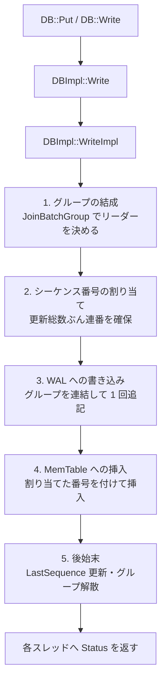
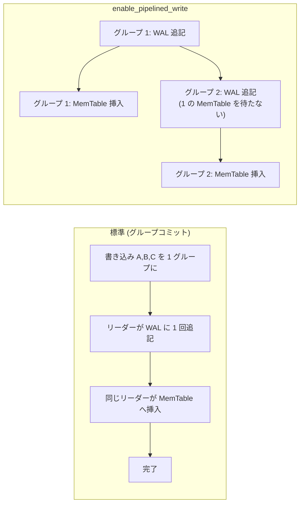

# 第8章 書き込みパイプライン全体

> **本章で読むソース**
>
> - [`db/db_impl/db_impl_write.cc`](https://github.com/facebook/rocksdb/blob/v11.1.1/db/db_impl/db_impl_write.cc)
> - [`db/db_impl/db_impl.h`](https://github.com/facebook/rocksdb/blob/v11.1.1/db/db_impl/db_impl.h)
> - [`include/rocksdb/options.h`](https://github.com/facebook/rocksdb/blob/v11.1.1/include/rocksdb/options.h)
> - [`db/write_thread.h`](https://github.com/facebook/rocksdb/blob/v11.1.1/db/write_thread.h)

## この章の狙い

`DB::Put` も `DB::Write` も、最終的には `DBImpl::WriteImpl` という一つの関数に集まる。
本章では、その `WriteImpl` が書き込みをどの段階に分けて処理するかを俯瞰する。
書き込みグループの結成、シーケンス番号の割り当て、WAL への書き込み、MemTable への挿入、後始末という五つの段階それぞれが、なぜ必要かを示す。
あわせて、標準のグループコミットに対して `enable_pipelined_write`、`unordered_write`、`two_write_queues` がどの段の並べ方を変える設定なのかを概観する。

## 前提

- [第6章 DB と Options](../part01-data-model/06-db-and-options.md)
- [第7章 WriteBatch](../part01-data-model/07-write-batch.md)

## すべての書き込みは WriteImpl に集まる

第7章で見たとおり、`DB::Put` は引数を詰めたローカルの `WriteBatch` を作り、それを `Write` に渡す。
その `DBImpl::Write` は、保護バイトの更新だけを済ませてから `WriteImpl` を呼ぶ薄い入口である。

[`db/db_impl/db_impl_write.cc` L151-L163](https://github.com/facebook/rocksdb/blob/v11.1.1/db/db_impl/db_impl_write.cc#L151-L163)

```cpp
Status DBImpl::Write(const WriteOptions& write_options, WriteBatch* my_batch) {
  Status s;
  if (write_options.protection_bytes_per_key > 0) {
    s = WriteBatchInternal::UpdateProtectionInfo(
        my_batch, write_options.protection_bytes_per_key);
  }
  if (s.ok()) {
    s = WriteImpl(write_options, my_batch, /*callback=*/nullptr,
                  /*user_write_cb=*/nullptr,
                  /*wal_used=*/nullptr);
  }
  return s;
}
```

`WriteWithCallback` も同じ構造で、コールバックを追加で渡すだけの違いしかない。
トランザクション層の書き込みも、コールバックや `disable_memtable` などの引数を変えて `WriteImpl` を直接呼ぶ。
つまり利用者向けの書き込み API は、引数の異なる `WriteImpl` 呼び出しへ収束する。

その `WriteImpl` のシグネチャは引数が多い。
ここで全体を眺めておくと、後の段階の話がどの引数に対応するか追いやすい。

[`db/db_impl/db_impl.h` L1584-L1592](https://github.com/facebook/rocksdb/blob/v11.1.1/db/db_impl/db_impl.h#L1584-L1592)

```cpp
  Status WriteImpl(const WriteOptions& options, WriteBatch* updates,
                   WriteCallback* callback = nullptr,
                   UserWriteCallback* user_write_cb = nullptr,
                   uint64_t* wal_used = nullptr, uint64_t log_ref = 0,
                   bool disable_memtable = false, uint64_t* seq_used = nullptr,
                   size_t batch_cnt = 0,
                   PreReleaseCallback* pre_release_callback = nullptr,
                   PostMemTableCallback* post_memtable_callback = nullptr,
                   std::shared_ptr<WriteBatchWithIndex> wbwi = nullptr);
```

本章で注目するのは最初の二つ、書き込む内容を表す `updates`（`WriteBatch`）と、同期や WAL 無効化を指定する `options` である。
`disable_memtable` は WAL だけに書く経路を選ぶフラグで、後述するトランザクションの WAL 専用書き込みで使われる。

## WriteImpl が踏む五つの段階

`WriteImpl` は巨大な関数だが、標準モードでの処理は次の五段に分けて読める。
各段の目的を先に並べておく。

1. **グループの結成**：到着した複数の書き込みスレッドを一つのグループにまとめ、その中の一つをリーダーに選ぶ。
2. **シーケンス番号の割り当て**：グループ全体が書く更新の総数だけシーケンス番号を確保し、各書き込みに連番を割り振る。
3. **WAL への書き込み**：グループ全員の `WriteBatch` を連結し、リーダーが一度の書き込みで WAL に追記する。
4. **MemTable への挿入**：割り当てた番号を付けて、各更新を MemTable に挿入する。
5. **後始末**：可視シーケンス番号を進め、グループを解散し、各スレッドへ結果を返す。



以下、コードに沿って各段を確認する。

### グループの結成とモードの分岐

`WriteImpl` は冒頭で多数の引数検証を行ったあと、書き込みモードに応じて経路を分ける。
`two_write_queues_` と `disable_memtable` がそろえば WAL 専用経路へ、`unordered_write` なら順序を緩めた経路へ、`enable_pipelined_write` ならパイプライン経路へ抜ける。
どれにも当てはまらなければ、標準のグループコミット経路に入る。

[`db/db_impl/db_impl_write.cc` L540-L552](https://github.com/facebook/rocksdb/blob/v11.1.1/db/db_impl/db_impl_write.cc#L540-L552)

```cpp
  if (immutable_db_options_.enable_pipelined_write) {
    return PipelinedWriteImpl(write_options, my_batch, callback, user_write_cb,
                              wal_used, log_ref, disable_memtable, seq_used);
  }

  PERF_TIMER_GUARD(write_pre_and_post_process_time);
  WriteThread::Writer w(write_options, my_batch, callback, user_write_cb,
                        log_ref, disable_memtable, batch_cnt,
                        pre_release_callback, post_memtable_callback,
                        /*_ingest_wbwi=*/wbwi != nullptr);
  StopWatch write_sw(immutable_db_options_.clock, stats_, DB_WRITE);

  write_thread_.JoinBatchGroup(&w);
```

標準経路では、自分の書き込みを表す `WriteThread::Writer w` をスタックに作り、`JoinBatchGroup` で書き込みキューに並ぶ。
`Writer` は一回の書き込みを表す構造体で、自身の `WriteBatch` や処理状態 `state` を持つ。
その詳細と状態機械は[第9章 WriteThread](09-write-thread.md)で扱う。

`JoinBatchGroup` から戻ったとき、`w.state` には役割が入っている。
キューの先頭に並んだスレッドは `STATE_GROUP_LEADER` となり、グループを代表して WAL 書き込みまでを担う。
それ以外は追随者となり、リーダーが自分のぶんも処理し終えるのを待つ。
リーダーでも追随者でもない完了済みの状態 `STATE_COMPLETED` なら、リーダーが既に処理を終えているので結果を返すだけでよい。

[`db/db_impl/db_impl_write.cc` L599-L611](https://github.com/facebook/rocksdb/blob/v11.1.1/db/db_impl/db_impl_write.cc#L599-L611)

```cpp
  if (w.state == WriteThread::STATE_COMPLETED) {
    if (wal_used != nullptr) {
      *wal_used = w.wal_used;
    }
    if (seq_used != nullptr) {
      *seq_used = w.sequence;
    }
    // write is complete and leader has updated sequence
    return w.FinalStatus();
  }
  // else we are the leader of the write batch group
  assert(w.state == WriteThread::STATE_GROUP_LEADER);
```

これがグループコミットの骨格である。
同時に到着した書き込みのうち一つだけがリーダーになり、残りはリーダーの結果を受け取る。
リーダーは、自分に続いて並んでいた書き込みをまとめてグループにする。

[`db/db_impl/db_impl_write.cc` L642-L649](https://github.com/facebook/rocksdb/blob/v11.1.1/db/db_impl/db_impl_write.cc#L642-L649)

```cpp
  // Add to log and apply to memtable.  We can release the lock
  // during this phase since &w is currently responsible for logging
  // and protects against concurrent loggers and concurrent writes
  // into memtables

  TEST_SYNC_POINT("DBImpl::WriteImpl:BeforeLeaderEnters");
  last_batch_group_size_ =
      write_thread_.EnterAsBatchGroupLeader(&w, &write_group);
```

`EnterAsBatchGroupLeader` は、リーダーに続くスレッド群を一つの `write_group` に取り込む。
このグループ化が、後続の段で一度にまとめて処理する単位になる。

### シーケンス番号の割り当て

グループを組んだリーダーは、まずグループ全体が書き込むキーの総数を数える。
そして、その総数ぶんのシーケンス番号を確保する。

[`db/db_impl/db_impl_write.cc` L762-L788](https://github.com/facebook/rocksdb/blob/v11.1.1/db/db_impl/db_impl_write.cc#L762-L788)

```cpp
    if (!two_write_queues_) {
      if (status.ok() && !write_options.disableWAL) {
        assert(wal_context.wal_file_number_size);
        wal_context.prev_size = wal_context.writer->file()->GetFileSize();
        PERF_TIMER_GUARD(write_wal_time);
        io_s = WriteGroupToWAL(write_group, wal_context.writer, wal_used,
                               wal_context.need_wal_sync,
                               wal_context.need_wal_dir_sync, last_sequence + 1,
                               *wal_context.wal_file_number_size);
      }
    } else {
      // ... (中略) ...
    }
    status = io_s;
    assert(last_sequence != kMaxSequenceNumber);
    const SequenceNumber current_sequence = last_sequence + 1;
    last_sequence += seq_inc;
    // Seqno assigned to this write are [current_sequence, last_sequence]
```

`last_sequence` は現在まで割り当て済みの最大番号で、グループの先頭は `current_sequence = last_sequence + 1` から始まる。
ここで番号の確保だけを行い、グループ内の各書き込みへ実際に連番を割り振るのは WAL 書き込みの直後である。
番号を先に確保するのは、WAL に書くレコードへ正しい開始番号を埋め込む必要があるからだ。
シーケンス番号そのものの意味は[第5章 内部キー](../part01-data-model/05-internal-key.md)で扱った。

WAL 書き込みが成功すると、リーダーはグループの各書き込みに連番を順に割り当てる。

[`db/db_impl/db_impl_write.cc` L820-L848](https://github.com/facebook/rocksdb/blob/v11.1.1/db/db_impl/db_impl_write.cc#L820-L848)

```cpp
    // PreReleaseCallback is called after WAL write and before memtable write
    if (status.ok()) {
      SequenceNumber next_sequence = current_sequence;
      size_t index = 0;
      // ... (中略) ...
      for (auto* writer : write_group) {
        if (writer->CallbackFailed()) {
          continue;
        }
        writer->sequence = next_sequence;
        // ... (中略) ...
        if (seq_per_batch_) {
          assert(writer->batch_cnt);
          next_sequence += writer->batch_cnt;
        } else if (writer->ShouldWriteToMemtable()) {
          next_sequence += WriteBatchInternal::Count(writer->batch);
        }
      }
    }
```

各 `writer` に開始番号 `next_sequence` を書き込み、その書き込みが含むキー数だけ番号を進める。
こうしてグループ全体が連続した番号区間 `[current_sequence, last_sequence]` を分け合う。

### WAL への書き込み

WAL への追記は、前掲の `WriteGroupToWAL` が担う。
ここで重要なのは、引数が個々の `WriteBatch` ではなく `write_group` であることだ。
リーダーはグループ内の全 `WriteBatch` を一本にまとめ、一度の書き込みで WAL に追記する。

WAL 書き込みのあとに同期が要求されている場合、ここで WAL を `fsync` 相当の処理で永続化する。

[`db/db_impl/db_impl_write.cc` L790-L799](https://github.com/facebook/rocksdb/blob/v11.1.1/db/db_impl/db_impl_write.cc#L790-L799)

```cpp
    if (wal_context.need_wal_sync) {
      VersionEdit synced_wals;
      wal_write_mutex_.Lock();
      if (status.ok()) {
        MarkLogsSynced(cur_wal_number_, wal_context.need_wal_dir_sync,
                       &synced_wals);
      } else {
        MarkLogsNotSynced(cur_wal_number_);
      }
      wal_write_mutex_.Unlock();
```

WAL を先に永続化してから MemTable に挿入するのは、クラッシュからの復旧のためである。
MemTable はメモリ上の構造で、プロセスが落ちれば消える。
永続化済みの WAL に更新が残っていれば、再起動時にそれを読み直して MemTable を復元できる。
この順序があるからこそ、書き込みが返ったあとに障害が起きてもデータが失われない。
WAL の物理形式とレコードの並べ方は[第10章 WAL](10-wal.md)で扱う。

### MemTable への挿入

シーケンス番号を割り当て終えたら、リーダーはグループの更新を MemTable に挿入する。
グループのサイズと設定に応じて、リーダーが単独で挿入する場合と、追随者を並列ワーカーとして起こして分担する場合がある。

[`db/db_impl/db_impl_write.cc` L850-L866](https://github.com/facebook/rocksdb/blob/v11.1.1/db/db_impl/db_impl_write.cc#L850-L866)

```cpp
    if (status.ok()) {
      PERF_TIMER_FOR_WAIT_GUARD(write_memtable_time);

      if (!parallel) {
        // w.sequence will be set inside InsertInto
        w.status = WriteBatchInternal::InsertInto(
            write_group, current_sequence, column_family_memtables_.get(),
            &flush_scheduler_, &trim_history_scheduler_,
            write_options.ignore_missing_column_families,
            0 /*recovery_log_number*/, this, seq_per_batch_, batch_per_txn_);
      } else {
        write_group.last_sequence = last_sequence;
        write_thread_.LaunchParallelMemTableWriters(&write_group);
        in_parallel_group = true;
```

`parallel` になる条件は、`allow_concurrent_memtable_write` が有効でグループのサイズが 2 以上、かつグループに `Merge` が含まれないことである（[`db/db_impl/db_impl_write.cc` L669-L684](https://github.com/facebook/rocksdb/blob/v11.1.1/db/db_impl/db_impl_write.cc#L669-L684)）。
`InsertInto` は `WriteBatch` を走査し、各レコードを宛先のカラムファミリーの MemTable に挿入する。
MemTable は既定で SkipList であり、その挿入の仕組みは[第11章 MemTable と SkipList](11-memtable-skiplist.md)で扱う。

### 後始末

MemTable への挿入が終わると、リーダーは可視シーケンス番号を進め、グループを解散する。

[`db/db_impl/db_impl_write.cc` L935-L963](https://github.com/facebook/rocksdb/blob/v11.1.1/db/db_impl/db_impl_write.cc#L935-L963)

```cpp
  if (should_exit_batch_group) {
    if (status.ok()) {
      // ... (中略) ...
      // Note: if we are to resume after non-OK statuses we need to revisit how
      // we react to non-OK statuses here.
      if (w.status.ok()) {  // Don't publish a partial batch write
        versions_->SetLastSequence(last_sequence);
      }
    }
    // ... (中略) ...
    write_thread_.ExitAsBatchGroupLeader(write_group, status);
  }
```

`SetLastSequence` は、ここまで割り当てた `last_sequence` を「公開済み」の最大番号として記録する。
読み取りは公開済みの番号までしか見ないため、MemTable への挿入が完了するまで新しい更新は読み取りに現れない。
これがスナップショットの一貫性を支える。
`ExitAsBatchGroupLeader` はグループを解散し、追随者を完了状態に遷移させて結果を渡す。
グループ解散の状態遷移は[第9章 WriteThread](09-write-thread.md)に委ねる。

## グループコミットがまとめる WAL 書き込み

ここまでの五段のうち、書き込み性能を最も左右するのが第3段の WAL 書き込みである。
WAL は耐久性のためにディスクへ書き、同期書き込みでは `fsync` を伴う。
`fsync` はミリ秒級の待ちを生むので、書き込み一回ごとに `fsync` していては並行書き込みのスループットが頭打ちになる。

グループコミットは、この回数を減らす仕組みである。
同時に到着した複数の書き込みを一つの `write_group` にまとめ、リーダーが全員ぶんの `WriteBatch` を連結して一度だけ WAL に追記し、必要なら一度だけ `fsync` する。
追随者は自分で WAL に触れず、リーダーの完了を待つ。
グループに N 個の書き込みが入れば、WAL 書き込みと `fsync` の回数は N 分の 1 になる。
第7章で見たとおり `WriteBatch` の内部表現 `rep_` はそのまま WAL ペイロードになるので、連結は各バッチのバイト列を継ぎ足すだけで済み、まとめる側のコストも小さい。

なぜ一度の書き込みにまとめてよいかは、第2段の番号割り当てが保証する。
グループ全体に連続したシーケンス番号区間を割り当ててから WAL に書くため、連結後も各更新の順序と番号が確定している。
グループ化からリーダー選出までの待ち合わせをどう実装しているか、その状態機械とロックフリーの工夫は[第9章 WriteThread](09-write-thread.md)で掘り下げる。

## 四つの書き込みモード

標準のグループコミットに加えて、`WriteImpl` は三つの設定で段の並べ方を変えられる。
いずれも `DBOptions` のフラグで選ぶ。

**標準（グループコミット）**：単一のキューでリーダーを決め、WAL 書き込みと MemTable 挿入を同じリーダーが続けて行う。
`enable_pipelined_write` のコメントが、この既定の動作を説明している。

[`include/rocksdb/options.h` L1296-L1309](https://github.com/facebook/rocksdb/blob/v11.1.1/include/rocksdb/options.h#L1296-L1309)

```cpp
  // By default, a single write thread queue is maintained. The thread gets
  // to the head of the queue becomes write batch group leader and responsible
  // for writing to WAL and memtable for the batch group.
  //
  // If enable_pipelined_write is true, separate write thread queue is
  // maintained for WAL write and memtable write. A write thread first enter WAL
  // writer queue and then memtable writer queue. Pending thread on the WAL
  // writer queue thus only have to wait for previous writers to finish their
  // WAL writing but not the memtable writing. Enabling the feature may improve
  // write throughput and reduce latency of the prepare phase of two-phase
  // commit.
  //
  // Default: false
  bool enable_pipelined_write = false;
```

**パイプライン書き込み（`enable_pipelined_write`）**：WAL 書き込み用と MemTable 挿入用に別々のキューを設ける。
ある書き込みが WAL を書き終えると MemTable キューへ移り、後続の WAL 書き込みは前の書き込みの MemTable 挿入を待たずに始められる。
このモードでは `WriteImpl` は `PipelinedWriteImpl` に処理を委ねる。
そのリーダーは WAL 書き込みまでを終えると、MemTable 段とは独立にグループを抜ける。

[`db/db_impl/db_impl_write.cc` L1096-L1108](https://github.com/facebook/rocksdb/blob/v11.1.1/db/db_impl/db_impl_write.cc#L1096-L1108)

```cpp
    write_thread_.ExitAsBatchGroupLeader(wal_write_group, w.status);
  }

  // NOTE: the memtable_write_group is declared before the following
  // `if` statement because its lifetime needs to be longer
  // that the inner context  of the `if` as a reference to it
  // may be used further below within the outer _write_thread
  WriteThread::WriteGroup memtable_write_group;

  if (w.state == WriteThread::STATE_MEMTABLE_WRITER_LEADER) {
    PERF_TIMER_FOR_WAIT_GUARD(write_memtable_time);
    assert(w.ShouldWriteToMemtable());
    write_thread_.EnterAsMemTableWriter(&w, &memtable_write_group);
```

WAL 段の `wal_write_group` と MemTable 段の `memtable_write_group` が別物である点に、二本のキューが現れている。
標準モードとの違いは、二つの段を直列につなぐか重ねるかにある。



**順序を緩めた書き込み（`unordered_write`）**：WAL への書き込みとシーケンス番号の公開を先に済ませ、MemTable 挿入を後から非同期に進めることでスループットを上げる。
代わりにスナップショットの不変性が緩む。

[`include/rocksdb/options.h` L1311-L1335](https://github.com/facebook/rocksdb/blob/v11.1.1/include/rocksdb/options.h#L1311-L1335)

```cpp
  // Setting unordered_write to true trades higher write throughput with
  // relaxing the immutability guarantee of snapshots. This violates the
  // repeatability one expects from ::Get from a snapshot, as well as
  // ::MultiGet and Iterator's consistent-point-in-time view property.
  // ... (中略) ...
  // Default: false
  bool unordered_write = false;
```

`WriteImpl` はこのモードで、まず `WriteImplWALOnly` を呼んで WAL とシーケンス番号の公開だけを行い、続けて `UnorderedWriteMemtable` で MemTable に挿入する（[`db/db_impl/db_impl_write.cc` L513-L538](https://github.com/facebook/rocksdb/blob/v11.1.1/db/db_impl/db_impl_write.cc#L513-L538)）。
スナップショットの不変性を保てない利用では使えないため、既定は `false` である。

**二本の書き込みキュー（`two_write_queues`）**：WAL だけに書く書き込みと、MemTable にも書く書き込みを別キューに分ける。
2 フェーズコミットのように、WAL への準備（prepare）だけ先行させたい用途を想定している。

[`include/rocksdb/options.h` L1464-L1469](https://github.com/facebook/rocksdb/blob/v11.1.1/include/rocksdb/options.h#L1464-L1469)

```cpp
  // If enabled it uses two queues for writes, one for the ones with
  // disable_memtable and one for the ones that also write to memtable. This
  // allows the memtable writes not to lag behind other writes. It can be used
  // to optimize MySQL 2PC in which only the commits, which are serial, write to
  // memtable.
  bool two_write_queues = false;
```

`WriteImpl` の冒頭で `two_write_queues_ && disable_memtable` が成り立つと、`WriteImplWALOnly` へ分岐して WAL だけに書く（[`db/db_impl/db_impl_write.cc` L502-L511](https://github.com/facebook/rocksdb/blob/v11.1.1/db/db_impl/db_impl_write.cc#L502-L511)）。

これらのモードは互いに排他的な組み合わせが多い。
`WriteImpl` の冒頭では、`enable_pipelined_write` と `unordered_write` の併用などを `NotSupported` で弾いている（[`db/db_impl/db_impl_write.cc` L439-L461](https://github.com/facebook/rocksdb/blob/v11.1.1/db/db_impl/db_impl_write.cc#L439-L461)）。
本書では、以後の章で扱うのは既定の標準モードである。

## まとめ

- `DB::Put` も `DB::Write` も、引数の異なる `DBImpl::WriteImpl` 呼び出しに収束する。
- 標準モードの `WriteImpl` は、グループ結成、シーケンス番号の割り当て、WAL 書き込み、MemTable 挿入、後始末の五段で書き込みを処理する。
- WAL を先に永続化してから MemTable に挿入する順序が、クラッシュ復旧時の耐久性を支える。
- グループコミットは、同時到着した書き込みを一つのグループにまとめ、WAL 書き込みと `fsync` を一回にすることで回数を N 分の 1 に減らす。
- `enable_pipelined_write`、`unordered_write`、`two_write_queues` は、段の並べ方を変えてスループットや特定用途の遅延を改善する設定で、既定では無効である。

## 関連する章

- [第9章 WriteThread](09-write-thread.md)：グループ結成とリーダー選出の状態機械、待ち合わせのロックフリー実装。
- [第10章 WAL](10-wal.md)：WAL の物理形式とレコードの並べ方。
- [第11章 MemTable と SkipList](11-memtable-skiplist.md)：`InsertInto` から先の MemTable への挿入。
