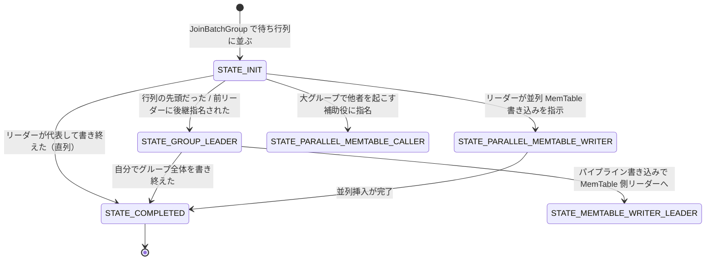
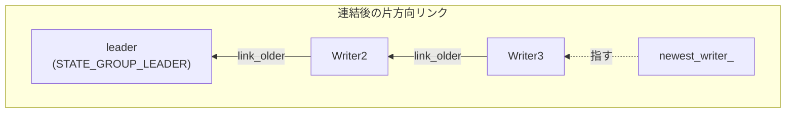
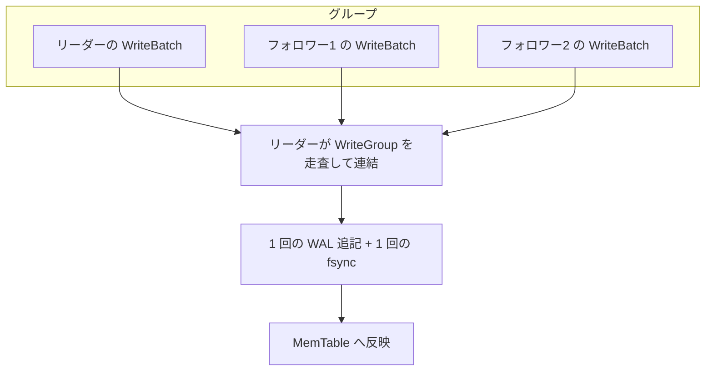

# 第9章 WriteThread とグループコミット

> **本章で読むソース**
> - [`db/write_thread.h`](https://github.com/facebook/rocksdb/blob/v11.1.1/db/write_thread.h)
> - [`db/write_thread.cc`](https://github.com/facebook/rocksdb/blob/v11.1.1/db/write_thread.cc)
> - [`include/rocksdb/options.h`](https://github.com/facebook/rocksdb/blob/v11.1.1/include/rocksdb/options.h)

## この章の狙い

多数のスレッドが同時に書き込むとき、RocksDB は各スレッドに個別の WAL 書き込みと同期をさせない。
先頭に立った一つのスレッドが後続のスレッドの書き込みをまとめ、一回の WAL 書き込みで処理する。
この仕組みをグループコミットと呼ぶ。
本章では、グループコミットを支える `WriteThread` クラスの状態機械、ロックフリーな待ち行列、そして待機の三段構えを、実コードから読み解く。

## 前提

- [第7章 WriteBatch](../part01-data-model/07-write-batch.md)：本章で束ねる単位である `WriteBatch` の構造。
- [第8章 書き込みパイプライン](08-write-pipeline.md)：`DBImpl::WriteImpl` が `WriteThread` をどう呼び出すか。

`WriteThread` は `DBImpl` の書き込み経路から呼ばれる調整役である。
WAL の物理形式は第10章、MemTable の内部構造は第11章で扱う。
本章は、複数スレッドをどう一列に並べ、誰が代表して書くかという並行制御に集中する。

## なぜグループコミットが要るのか

WAL への追記は、永続性を保証するために `fsync` をともなうことが多い。
`fsync` はミリ秒級の遅延を持つ重い操作で、ストレージの同期コストがそのまま書き込みレイテンシに乗る。
スレッドがそれぞれ自前で WAL に追記して同期すると、同時に走るスレッドの数だけ `fsync` が発生し、ストレージの帯域を奪い合う。

グループコミットは、この同期回数を束ねて減らす。
同時刻に待っている複数の Writer のうち一つをリーダーに選び、リーダーが後続の Writer の `WriteBatch` をまとめて一度だけ WAL に書き、一度だけ同期する。
8 個のスレッドが同時に書こうとしたとき、`fsync` は 8 回ではなく 1 回で済む。
書き込みの並行度が上がるほど、一回の同期で償却できる書き込み量が増えるため、スループットは並行度とともに伸びる。

この調整を担うのが `WriteThread` である。
各スレッドは自分の書き込み要求を `Writer` という構造体に詰め、`WriteThread` の待ち行列に並ぶ。
行列の先頭に来た Writer がリーダーになり、残りはフォロワーとしてリーダーの完了を待つ。

## Writer の状態機械

各 Writer は `state` という 8 ビットのアトミック変数を一つ持つ。
この値が、その Writer が今どの役割にあるかを表す。
状態は次の `enum` で定義される。

[`db/write_thread.h` L34-L82](https://github.com/facebook/rocksdb/blob/v11.1.1/db/write_thread.h#L34-L82)

```cpp
enum State : uint8_t {
  // ... (中略：各状態のコメント) ...
  STATE_INIT = 1,
  STATE_GROUP_LEADER = 2,
  STATE_MEMTABLE_WRITER_LEADER = 4,
  STATE_PARALLEL_MEMTABLE_WRITER = 8,
  STATE_COMPLETED = 16,
  STATE_LOCKED_WAITING = 32,
  STATE_PARALLEL_MEMTABLE_CALLER = 64,
};
```

値が 1, 2, 4, 8 と 2 のべき乗になっている点が要点である。
一つの状態が一つのビットを占めるので、複数の状態の論理和をとれば「これらのいずれかになるまで待つ」という目標をビットマスク一つで表せる。
後述の `AwaitState` は、この `goal_mask` との論理積が非ゼロになったかどうかで待機の終了を判定する。

主要な状態の意味は次のとおりである。

- **STATE_INIT**：初期状態。`JoinBatchGroup` で待ち行列に並んだ直後の Writer はここにいる。
- **STATE_GROUP_LEADER**：この Writer がグループのリーダーになった。これからグループを構成し、WAL に書く。
- **STATE_MEMTABLE_WRITER_LEADER**：パイプライン書き込み有効時、WAL 書き込みを終えて MemTable 書き込みグループのリーダーになった。
- **STATE_PARALLEL_MEMTABLE_WRITER**：並列 MemTable 書き込みの担当になった。自分の `WriteBatch` を自分で MemTable へ挿入する。
- **STATE_COMPLETED**：自分の書き込みがリーダーによって完遂された、または並列書き込みの後始末が済んだ終端状態。
- **STATE_LOCKED_WAITING**：条件変数で眠ろうとしている最中であることを起こす側に知らせる過渡状態。

状態遷移は次のように整理できる。



この図はパイプライン書き込み無効時の主要経路を太く描いている。
最も単純な直列経路は、`STATE_INIT` から `STATE_GROUP_LEADER` になってグループを書き、`STATE_COMPLETED` で終わる流れと、`STATE_INIT` のままリーダーに書いてもらって `STATE_COMPLETED` に飛ぶフォロワーの流れの二本である。

## Writer 構造体と待ち行列

Writer の中で、行列を組み立てるために使うフィールドは次の三つである。

[`db/write_thread.h` L140-L149](https://github.com/facebook/rocksdb/blob/v11.1.1/db/write_thread.h#L140-L149)

```cpp
std::atomic<uint8_t> state;  // write under StateMutex() or pre-link
WriteGroup* write_group;
SequenceNumber sequence;  // the sequence number to use for the first key
Status status;
Status callback_status;  // status returned by callback->Callback()

aligned_storage<std::mutex>::type state_mutex_bytes;
aligned_storage<std::condition_variable>::type state_cv_bytes;
Writer* link_older;  // read/write only before linking, or as leader
Writer* link_newer;  // lazy, read/write only before linking, or as leader
```

`link_older` は自分より前（古い）に並んだ Writer を、`link_newer` は自分より後（新しい）に並んだ Writer を指す。
待ち行列は、この二つのポインタで双方向リンクとして表現される。
ただし `link_newer` の構築は遅延される。
コメントが「lazy」と書くとおり、並ぶときに張るのは `link_older` だけで、`link_newer` は後でリーダーが必要になったときにまとめて補う（後述の `CreateMissingNewerLinks`）。

行列の末尾、すなわち最も新しい Writer は、`WriteThread` のメンバ `newest_writer_` が指す。

[`db/write_thread.h` L431-L433](https://github.com/facebook/rocksdb/blob/v11.1.1/db/write_thread.h#L431-L433)

```cpp
// Points to the newest pending writer. Only leader can remove
// elements, adding can be done lock-free by anybody.
std::atomic<Writer*> newest_writer_;
```

このコメントが本章の核心を一言で表している。
行列への追加はロックなしで誰でもできるが、要素の除去はリーダーだけが行う。
追加と除去の責務を分けることで、追加の側はアトミック操作だけで競合を解決でき、ミューテックスを取らずに済む。

## JoinBatchGroup：行列に並ぶ

書き込みを始めるスレッドは、自分の Writer を持って `JoinBatchGroup` を呼ぶ。

[`db/write_thread.cc` L401-L438](https://github.com/facebook/rocksdb/blob/v11.1.1/db/write_thread.cc#L401-L438)

```cpp
void WriteThread::JoinBatchGroup(Writer* w) {
  TEST_SYNC_POINT_CALLBACK("WriteThread::JoinBatchGroup:Start", w);
  assert(w->batch != nullptr);

  bool linked_as_leader = LinkOne(w, &newest_writer_);

  w->CheckWriteEnqueuedCallback();

  if (linked_as_leader) {
    SetState(w, STATE_GROUP_LEADER);
  }
  // ... (中略：テスト用同期点) ...
  if (!linked_as_leader) {
    // ... (中略：待ち条件の説明コメント) ...
    AwaitState(w,
               STATE_GROUP_LEADER | STATE_MEMTABLE_WRITER_LEADER |
                   STATE_PARALLEL_MEMTABLE_CALLER |
                   STATE_PARALLEL_MEMTABLE_WRITER | STATE_COMPLETED,
               &jbg_ctx);
    // ... (中略) ...
  }
}
```

処理は二段に分かれる。
まず `LinkOne` で自分を行列の末尾に連結する。
このとき行列が空だった、つまり自分が先頭になったなら `LinkOne` が `true` を返し、自分をリーダーに設定して即座に戻る。
リーダーは誰かを待つ必要がない。

自分が先頭でなかったなら、前に誰かがいる。
その場合は `AwaitState` で、自分の状態がリーダー系のいずれか、並列書き込み担当、または完了のいずれかになるまで待つ。
`goal_mask` に五つの状態をビット論理和で並べているのは、待ちながら起こされたときに自分がどの役割を割り当てられたかが起こされるまで分からないためである。
リーダーに昇格させられるかもしれないし、フォロワーとして書いてもらって完了になるかもしれないし、並列書き込みを命じられるかもしれない。

## LinkOne：ロックフリーな連結

`LinkOne` は、Writer を `newest_writer_` の指す末尾へアトミックに繋ぐ。

[`db/write_thread.cc` L226-L260](https://github.com/facebook/rocksdb/blob/v11.1.1/db/write_thread.cc#L226-L260)

```cpp
bool WriteThread::LinkOne(Writer* w, std::atomic<Writer*>* newest_writer) {
  assert(newest_writer != nullptr);
  assert(w->state == STATE_INIT);
  Writer* writers = newest_writer->load(std::memory_order_relaxed);
  while (true) {
    assert(writers != w);
    // ... (中略：write stall 時の待機処理) ...
    w->link_older = writers;
    if (newest_writer->compare_exchange_weak(writers, w)) {
      return (writers == nullptr);
    }
  }
}
```

中心はループ末尾の三行である。
まず現在の末尾 `writers` を読み、自分の `link_older` をそこへ向ける。
そのうえで `compare_exchange_weak` で `newest_writer_` を「`writers` のままなら `w` に差し替える」。
差し替えに成功すれば連結完了で、直前に読んだ末尾が `nullptr`、つまり行列が空だったかどうかを `true` / `false` で返す。

差し替えに失敗するのは、読んでから書くまでの間に別のスレッドが末尾を更新した場合である。
このとき `compare_exchange_weak` は `writers` を最新値に書き換えるので、ループの先頭に戻ってその新しい末尾を相手に再試行する。
誰も末尾を触らなければ一回で成功し、競合があったぶんだけ再試行する。
ミューテックスを取らずにこの競合を解くのが、ロックフリーな連結の要点である。

ここで `compare_exchange_weak`（強形ではなく弱形）を使うのは、ループ前提だからである。
弱形は一部の CPU で偽の失敗（spurious failure）を許す代わりに命令が軽い。
どのみち失敗時はループで再試行するので、偽の失敗を許す弱形のほうが有利になる。

連結が `link_older` の片方向だけで完結している点も見逃せない。
新しく並ぶ側は、自分から見て前にいる Writer を指すだけで、前の Writer に自分を指させる更新（`link_newer` の設定）はしない。
末尾への追加で触るポインタを一つに絞ることで、アトミックな差し替え一回で連結が閉じる。



## CreateMissingNewerLinks：後ろ向きリンクの復元

リーダーになった Writer は、グループを確定するために行列を新しい側へたどる必要がある。
ところが連結時に張られているのは `link_older` だけなので、`link_newer` をたどることはまだできない。
そこで `CreateMissingNewerLinks` が、末尾から `link_older` を逆にたどりながら欠けている `link_newer` を補う。

[`db/write_thread.cc` L287-L297](https://github.com/facebook/rocksdb/blob/v11.1.1/db/write_thread.cc#L287-L297)

```cpp
void WriteThread::CreateMissingNewerLinks(Writer* head) {
  while (true) {
    Writer* next = head->link_older;
    if (next == nullptr || next->link_newer != nullptr) {
      assert(next == nullptr || next->link_newer == head);
      break;
    }
    next->link_newer = head;
    head = next;
  }
}
```

`head`（最も新しい Writer）から始め、`link_older` で一つ古い `next` へ移りながら、`next->link_newer` を `head` に設定していく。
すでに `link_newer` が張られている Writer に出会ったら、そこから先は補正済みなので止める。
連結はアトミックな差し替えで安価に済ませ、双方向リンクの復元はリーダーだけが単一スレッドで行うので、補正の側はロックも CAS もいらない。

## EnterAsBatchGroupLeader：グループの確定

リーダーは `EnterAsBatchGroupLeader` で、自分から末尾までを走査してグループに含める Writer を選ぶ。

[`db/write_thread.cc` L506-L553](https://github.com/facebook/rocksdb/blob/v11.1.1/db/write_thread.cc#L506-L553)

```cpp
while (w != newest_writer) {
  assert(w->link_newer);
  w = w->link_newer;

  if ((w->sync && !leader->sync) ||
      // ... (中略：互換性チェックの各条件) ...
      (size + WriteBatchInternal::ByteSize(w->batch) > max_size) ||
      // Do not make batch too big
      (leader->ingest_wbwi || w->ingest_wbwi)
  ) {
    // remove from list（r_list へ退避）
    // ... (中略) ...
  } else {
    // grow up
    we = w;
    w->write_group = write_group;
    size += WriteBatchInternal::ByteSize(w->batch);
    write_group->last_writer = w;
    write_group->size++;
  }
}
```

リーダーは `link_newer` をたどって新しい側へ進み、各 Writer がリーダーと束ねられるかを判定する。
束ねられない Writer は `sync` の有無、`disable_wal` の有無、整合性保護バイト数、レートリミッタの優先度などがリーダーと食い違うものである。
これらは一回の WAL 書き込みにまとめると意味が変わってしまうため、`r_list` という一時リストへ退避され、走査後に行列へ戻される。
束ねられる Writer は `write_group` に加え、`size` に `WriteBatch` のバイト数を積み上げ、`last_writer` を更新する。

グループの大きさには上限がある。

[`db/write_thread.cc` L451-L455](https://github.com/facebook/rocksdb/blob/v11.1.1/db/write_thread.cc#L451-L455)

```cpp
size_t max_size = max_write_batch_group_size_bytes;
const uint64_t min_batch_size_bytes = max_write_batch_group_size_bytes / 8;
if (size <= min_batch_size_bytes) {
  max_size = size + min_batch_size_bytes;
}
```

`max_write_batch_group_size_bytes` の既定値は 1 MB である（[`include/rocksdb/options.h` L1355-L1360](https://github.com/facebook/rocksdb/blob/v11.1.1/include/rocksdb/options.h#L1355-L1360)）。
ただしリーダー自身の書き込みがこの 1/8（既定で 128 KB）以下と小さいときは、上限を「自分の大きさ + 1/8」に絞る。
小さな書き込みのレイテンシを、後続を大量に巻き込むことで犠牲にしない配慮である。

グループが確定したら、リーダーは集めた `WriteBatch` を `WriteGroup` のイテレータで順にたどり、一本にまとめて WAL へ書く。
この一本化が、`fsync` の回数を Writer の数ぶんから 1 回へ減らす。



## AwaitState：適応的な三段待機

フォロワーは、リーダーが自分の状態を変えてくれるまで待つ。
この待機を素朴にミューテックスと条件変数で行うと問題がある。
条件変数で眠ると、起こされて戻ってくるまでに `FUTEX_WAKE` から `FUTEX_WAIT` 復帰までのカーネル往復が要る。
コード内のコメントによれば、その最小遅延は約 2.7 マイクロ秒、平均では 10 マイクロ秒ほどである。
リーダーの WAL 書き込み自体がそれより短く終わる場合、眠って起こされるコストのほうが待ち時間より大きくなりうる。

`AwaitState` はこれを避けるため、待ち方を三段に分ける。
第一段は、`pause` 命令を使った短いスピンである。

[`db/write_thread.cc` L76-L82](https://github.com/facebook/rocksdb/blob/v11.1.1/db/write_thread.cc#L76-L82)

```cpp
for (uint32_t tries = 0; tries < 200; ++tries) {
  state = w->state.load(std::memory_order_acquire);
  if ((state & goal_mask) != 0) {
    return state;
  }
  port::AsmVolatilePause();
}
```

200 回ループで状態を読み続け、`goal_mask` との論理積が立ったら即座に戻る。
`AsmVolatilePause`（x86 の `pause` 命令）は、ビジーループ中に CPU へ「待っている」と知らせ、無駄なパイプライン投機やハイパースレッドの帯域消費を抑える。
コメントによれば最新の Xeon で 1 ループ約 7 ナノ秒、200 回で 1 マイクロ秒強である。
この長さなら、クロック取得やスレッド譲渡のコストを上回るほどの待ちでないかぎり、第一段だけで決着する。
すべての書き込みが単一スレッドから来る場合、ここで必ず抜けるため、後続の計測コストは一切かからない。

第一段で決まらなければ第二段の `yield` ループに入る。

[`db/write_thread.cc` L144-L184](https://github.com/facebook/rocksdb/blob/v11.1.1/db/write_thread.cc#L144-L184)

```cpp
if (max_yield_usec_ > 0) {
  update_ctx = Random::GetTLSInstance()->OneIn(sampling_base);

  if (update_ctx || yield_credit.load(std::memory_order_relaxed) >= 0) {
    auto spin_begin = std::chrono::steady_clock::now();
    size_t slow_yield_count = 0;
    auto iter_begin = spin_begin;
    while ((iter_begin - spin_begin) <=
           std::chrono::microseconds(max_yield_usec_)) {
      std::this_thread::yield();

      state = w->state.load(std::memory_order_acquire);
      if ((state & goal_mask) != 0) {
        would_spin_again = true;
        break;
      }

      auto now = std::chrono::steady_clock::now();
      if (now == iter_begin ||
          now - iter_begin >= std::chrono::microseconds(slow_yield_usec_)) {
        ++slow_yield_count;
        if (slow_yield_count >= kMaxSlowYieldsWhileSpinning) {
          update_ctx = true;
          break;
        }
      }
      iter_begin = now;
    }
  }
}
```

`std::this_thread::yield`（Linux では `sched_yield`）を `write_thread_max_yield_usec`（既定 100 マイクロ秒）の範囲で繰り返す。
他に走るスレッドがなければ `yield` はほぼ何もせず、約 1 マイクロ秒未満で戻る。
その間に状態が変われば、条件変数で眠るコストを丸ごと回避できる。

ここで効くのが、1 回の `yield` にかかった時間の監視である。
`yield` が `write_thread_slow_yield_usec`（既定 3 マイクロ秒）以上かかったら、それを「遅い yield」と数える。
遅い yield は、他のスレッドが同じコアを使いたがっている兆候である。
`sched_yield` 自体は他に走るプロセスがなければコンテキストスイッチを起こさないので、戻りが遅いということは実際に切り替えが起きた可能性が高い。
これが `kMaxSlowYieldsWhileSpinning`（3 回）に達したら、スピンを続けても CPU を浪費するだけと判断し、ループを抜けて眠る側へ倒す。

第三段は条件変数による本物の待機である。

[`db/write_thread.cc` L187-L190](https://github.com/facebook/rocksdb/blob/v11.1.1/db/write_thread.cc#L187-L190)

```cpp
if ((state & goal_mask) == 0) {
  TEST_SYNC_POINT_CALLBACK("WriteThread::AwaitState:BlockingWaiting", w);
  state = BlockingAwaitState(w, goal_mask);
}
```

スピンと yield でも決まらなければ `BlockingAwaitState` でミューテックスと条件変数を使って眠る。
ここまで来るのは、待ちが長いと判断された場合だけである。
長い待ちでは、眠るコストよりも CPU を手放す利益が上回る。

### yield を続けるかどうかの学習

第二段に入るかどうかは、`yield_credit` という符号付き整数で適応的に決める。

[`db/write_thread.cc` L192-L206](https://github.com/facebook/rocksdb/blob/v11.1.1/db/write_thread.cc#L192-L206)

```cpp
if (update_ctx) {
  auto v = yield_credit.load(std::memory_order_relaxed);
  // fixed point exponential decay with decay constant 1/1024, with +1
  // and -1 scaled to avoid overflow for int32_t
  // ... (中略) ...
  v = v - (v / 1024) + (would_spin_again ? 1 : -1) * 131072;
  yield_credit.store(v, std::memory_order_relaxed);
}
```

`yield_credit` が非負なら「yield で待つほうが眠るより速かった」確率が 5 割を超えるとみなし、第二段に入る。
yield が状態変化を捉えて成功すれば信用を上げ、時間切れで眠りに倒れたら下げる。
更新は固定小数点の指数減衰で、過去の傾向を 1/1024 ずつ忘れながら直近の結果を反映する。
この信用はワークロードごと（`AdaptationContext` 単位）に保たれるため、たとえば `JoinBatchGroup` での待ちと並列書き込み完了の待ちは別々に学習される。
更新自体は 1/256 の抽出（サンプリング）でしか行わないので、計測のオーバーヘッドはほとんど待ち時間に乗らない。

`enable_write_thread_adaptive_yield`（既定 `true`）が無効なら `max_yield_usec_` が 0 になり、第二段はまるごと飛ばされてスピンの次は即座に眠る（[`db/write_thread.cc` L20-L22](https://github.com/facebook/rocksdb/blob/v11.1.1/db/write_thread.cc#L20-L22)）。

### 眠る側と起こす側の引き渡し

第三段では、眠ろうとする Writer と状態を変えて起こす側との間で、ミューテックスの生成と状態書き込みを取りこぼさない引き渡しが要る。

[`db/write_thread.cc` L42-L54](https://github.com/facebook/rocksdb/blob/v11.1.1/db/write_thread.cc#L42-L54)

```cpp
w->CreateMutex();

auto state = w->state.load(std::memory_order_acquire);
assert(state != STATE_LOCKED_WAITING);
if ((state & goal_mask) == 0 &&
    w->state.compare_exchange_strong(state, STATE_LOCKED_WAITING)) {
  // we have permission (and an obligation) to use StateMutex
  std::unique_lock<std::mutex> guard(w->StateMutex());
  w->StateCV().wait(guard, [w] {
    return w->state.load(std::memory_order_relaxed) != STATE_LOCKED_WAITING;
  });
  state = w->state.load(std::memory_order_relaxed);
}
```

眠る側は、状態を `STATE_LOCKED_WAITING` へ CAS で立ててから条件変数で待つ。
このマーカーが立っているときに限り、起こす側はミューテックスを取って条件変数に通知する。

[`db/write_thread.cc` L212-L224](https://github.com/facebook/rocksdb/blob/v11.1.1/db/write_thread.cc#L212-L224)

```cpp
void WriteThread::SetState(Writer* w, uint8_t new_state) {
  assert(w);
  auto state = w->state.load(std::memory_order_acquire);
  if (state == STATE_LOCKED_WAITING ||
      !w->state.compare_exchange_strong(state, new_state)) {
    assert(state == STATE_LOCKED_WAITING);

    std::lock_guard<std::mutex> guard(w->StateMutex());
    assert(w->state.load(std::memory_order_relaxed) != new_state);
    w->state.store(new_state, std::memory_order_relaxed);
    w->StateCV().notify_one();
  }
}
```

起こす側はまず、状態をアトミックに目的の値へ CAS しようとする。
眠っていない相手（スピンや yield で待っている相手）なら、この CAS が一発で通り、ミューテックスには一切触れない。
相手が `STATE_LOCKED_WAITING` を立てて眠っている場合だけ CAS が失敗し、そのときに限ってミューテックスを取り、状態を書いて条件変数で通知する。
眠っていない相手を起こすのにカーネルへ降りないので、スピン中や yield 中のフォロワーへの引き渡しはユーザー空間のアトミック操作だけで終わる。

## 並列 MemTable 書き込み

ここまでの WAL 書き込みは、グループを一本化する都合上リーダーが代表して行う。
一方 MemTable への挿入は、`allow_concurrent_memtable_write`（既定 `true`、SkipList の MemTable でのみ有効）が立っていれば、各フォロワーが自分の `WriteBatch` を自分のスレッドで並列に挿入できる。
WAL は順序のために一本化し、MemTable は並列度のために分散させる、という役割分担である。

リーダーは `LaunchParallelMemTableWriters` で、グループの各メンバを並列書き込み担当へと起こす。

[`db/write_thread.cc` L680-L715](https://github.com/facebook/rocksdb/blob/v11.1.1/db/write_thread.cc#L680-L715)

```cpp
void WriteThread::LaunchParallelMemTableWriters(WriteGroup* write_group) {
  assert(write_group != nullptr);
  size_t group_size = write_group->size;
  write_group->running.store(group_size);

  const size_t MinParallelSize = 20;

  if (group_size < MinParallelSize) {
    for (auto w : *write_group) {
      SetState(w, STATE_PARALLEL_MEMTABLE_WRITER);
    }
    return;
  }

  size_t stride = static_cast<size_t>(std::sqrt(group_size));
  auto w = write_group->leader;
  SetState(w, STATE_PARALLEL_MEMTABLE_WRITER);

  for (size_t i = 1; i < stride; i++) {
    w = w->link_newer;
    SetState(w, STATE_PARALLEL_MEMTABLE_CALLER);
  }

  w = w->link_newer;
  SetMemWritersEachStride(w);
}
```

まず `running` にグループの人数を入れる。
これは「まだ MemTable 挿入を終えていない人数」のカウンタで、最後の一人を判定するために使う。

グループが 20 未満なら、リーダーが全員を順に `STATE_PARALLEL_MEMTABLE_WRITER` へ起こす。
ところがグループが大きいと、リーダーが一人で全員に `SetState` を呼ぶ時間が無視できなくなる。
そこで人数が `MinParallelSize`（20）以上のときは、起こす作業自体を分散させる。
リーダーは `√(group_size)` 個おきの Writer を `STATE_PARALLEL_MEMTABLE_CALLER`（補助役）として先に起こし、補助役たちが残りを並列に起こす（`SetMemWritersEachStride`）。
こうすると、起こす操作の総コストが順次呼び出しの場合の人数分から `2√n` 程度に下がる。

各フォロワーは MemTable への挿入を終えたら `CompleteParallelMemTableWriter` を呼ぶ。

[`db/write_thread.cc` L720-L737](https://github.com/facebook/rocksdb/blob/v11.1.1/db/write_thread.cc#L720-L737)

```cpp
bool WriteThread::CompleteParallelMemTableWriter(Writer* w) {
  auto* write_group = w->write_group;
  if (!w->status.ok()) {
    std::lock_guard<std::mutex> guard(write_group->leader->StateMutex());
    write_group->status = w->status;
  }

  if (write_group->running-- > 1) {
    // we're not the last one
    AwaitState(w, STATE_COMPLETED, &cpmtw_ctx);
    return false;
  }
  // else we're the last parallel worker and should perform exit duties.
  // ... (中略) ...
  return true;
}
```

`running` をアトミックに 1 減らし、減らす前の値が 1 より大きければ自分は最後ではない。
その場合は `STATE_COMPLETED` になるまで `AwaitState` で待つ。
減らす前の値が 1、つまり自分が最後の一人だったときだけ `true` を返し、シーケンス番号の確定とグループ全体の後始末を引き受ける。
誰が最後になるかを事前に決めず、カウンタの帰り値で動的に最後の一人を選ぶことで、終了処理の担当を一人に絞りつつ余計な同期を増やさない。

## まとめ

- グループコミットは、同時に待つ複数の Writer の `WriteBatch` をリーダーが一本化し、WAL 書き込みと `fsync` を 1 回に束ねる。並行度が上がるほど、一回の同期で償却できる書き込み量が増える。
- Writer は 2 のべき乗値の `state` を一つ持つ。状態をビットで表すことで、複数状態の論理和を一つの `goal_mask` として待機判定に使える。
- 待ち行列への追加はロックフリーである。`LinkOne` が `compare_exchange_weak` で `newest_writer_` を差し替え、競合時はループで再試行する。連結時に張るのは `link_older` だけで、`link_newer` はリーダーが `CreateMissingNewerLinks` で後から補う。
- `AwaitState` は、`pause` スピン、`yield` ループ、条件変数の三段で待つ。短い待ちはユーザー空間で決着させてカーネル往復を避け、長い待ちだけ眠る。yield に入るかは `yield_credit` でワークロードごとに学習する。
- 起こす側 `SetState` は、眠っていない相手なら CAS だけで状態を変え、`STATE_LOCKED_WAITING` で眠る相手のときだけミューテックスへ降りる。
- MemTable 挿入は `allow_concurrent_memtable_write` 時に各フォロワーが並列で行う。大グループでは起こす作業を `√n` の刻みで分散し、最後の一人を `running` カウンタで動的に選ぶ。

## 関連する章

- [第10章 WAL](10-wal.md)：リーダーが一本化した `WriteBatch` を書き込む WAL の物理形式。
- [第11章 MemTable と SkipList](11-memtable-skiplist.md)：フォロワーが並列に挿入する MemTable の内部構造。
- [第8章 書き込みパイプライン](08-write-pipeline.md)：本章の `WriteThread` を呼び出す `DBImpl::WriteImpl` の全体像。
