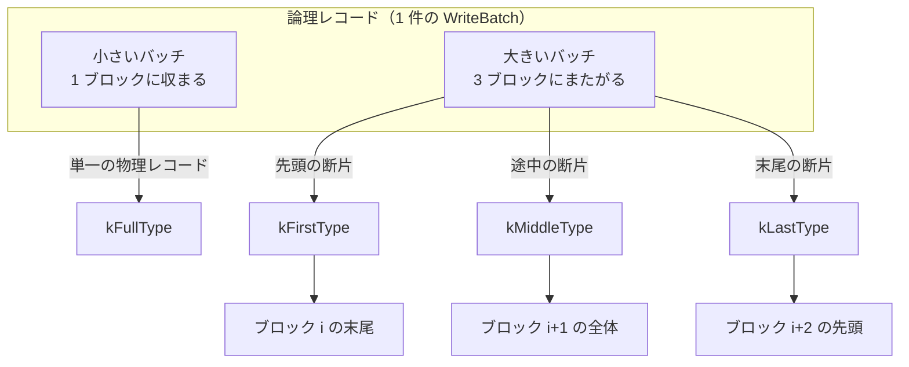

# 第10章 WAL（ログ）

> **本章で読むソース**
>
> - [`db/log_format.h`](https://github.com/facebook/rocksdb/blob/v11.1.1/db/log_format.h)
> - [`db/log_writer.h`](https://github.com/facebook/rocksdb/blob/v11.1.1/db/log_writer.h)
> - [`db/log_writer.cc`](https://github.com/facebook/rocksdb/blob/v11.1.1/db/log_writer.cc)
> - [`db/log_reader.h`](https://github.com/facebook/rocksdb/blob/v11.1.1/db/log_reader.h)
> - [`db/log_reader.cc`](https://github.com/facebook/rocksdb/blob/v11.1.1/db/log_reader.cc)
> - [`include/rocksdb/options.h`](https://github.com/facebook/rocksdb/blob/v11.1.1/include/rocksdb/options.h)

## この章の狙い

MemTable はメモリ上にあるため、プロセスが落ちれば未フラッシュの更新は消える。
**WAL**（Write-Ahead Log）は、その更新を MemTable に入れる前にディスクへ追記しておく仕組みであり、再起動時の再生によって失われた更新を復元する。
本章では、WAL が 32KB のブロック列としてどう並ぶか、1 レコードがブロック境界をまたぐときどう断片化されるか、CRC でどう破損を検出するかを、`log_writer.cc` と `log_reader.cc` の実コードから読み解く。
あわせて、`WALRecoveryMode` の四つの値がリカバリ時の破損の扱いをどう変えるか、WAL ファイルの再利用（recycle）が何を節約するかを確かめる。

## 前提

- [第7章 WriteBatch](../part01-data-model/07-write-batch.md)
- [第8章 書き込みパイプライン](08-write-pipeline.md)
- [第9章 WriteThread](09-write-thread.md)

## なぜ MemTable の前にログへ書くのか

第8章と第9章では、書き込みが「先に WAL へ書かれ、その後 MemTable に入る」と述べた。
この順序がリカバリの可否を分ける。
MemTable は揮発するメモリ上のデータ構造であり、クラッシュや電源断で内容が消える。
SST へのフラッシュが起きるまで、MemTable 上の更新はディスクのどこにも永続化されていない。

そこで、更新を MemTable に入れる前に、同じ内容をログファイルへ追記しておく。
ログは追記専用（append-only）であり、シーケンシャルな書き込みだけで済むため、ランダム I/O を避けられる。
再起動時には、各 WAL を先頭から順に再生し、含まれる更新を新しい MemTable へ流し込めば、クラッシュ直前の状態を復元できる。
WAL に書いたペイロードは、第7章で見た `WriteBatch` の `rep_`（シリアライズ済みの更新列）そのものである。
つまり WAL は、`WriteBatch` のバイト列を「いつ、どの順で適用したか」を保ったまま並べたファイルにほかならない。

ログ機構そのものは WAL 専用ではなく、MANIFEST（第34章）も同じ `log::Writer` と `log::Reader` を使う。
本章では用途を WAL に絞って読むが、物理フォーマットの議論はそのまま MANIFEST にも当てはまる。

## ログの物理フォーマット

### 32KB ブロックとレコード

ログファイルは、固定長 32KB のブロックを先頭から並べた列である。
ブロックサイズは定数として定義されている。

[`db/log_format.h` L54](https://github.com/facebook/rocksdb/blob/v11.1.1/db/log_format.h#L54)

```cpp
constexpr unsigned int kBlockSize = 32768;
```

各ブロックの中には、可変長の物理レコードが詰められる。
1 つの物理レコードは、固定長ヘッダとそれに続くペイロードからなる。
`log_writer.h` のクラスコメントが、ファイルとレコードの関係を図にしている。

[`db/log_writer.h` L41-L55](https://github.com/facebook/rocksdb/blob/v11.1.1/db/log_writer.h#L41-L55)

```text
 *       +-----+-------------+--+----+----------+------+-- ... ----+
 * File  | r0  |        r1   |P | r2 |    r3    |  r4  |           |
 *       +-----+-------------+--+----+----------+------+-- ... ----+
 *       <--- kBlockSize ------>|<-- kBlockSize ------>|
 *  rn = variable size records
 *  P = Padding
 *
 * Data is written out in kBlockSize chunks. If next record does not fit
 * into the space left, the leftover space will be padded with \0.
 *
 * Legacy record format:
 *
 * +---------+-----------+-----------+--- ... ---+
 * |CRC (4B) | Size (2B) | Type (1B) | Payload   |
 * +---------+-----------+-----------+--- ... ---+
```

ここで `P` はブロック末尾の余白（パディング）である。
次のレコードのヘッダすら入らない端数が残ったとき、その隙間をゼロで埋めて次のブロックへ移る。
ブロック境界を 32KB に固定する狙いは後述する。

### ヘッダのバイト構成

ヘッダは固定長で、CRC（4 バイト）、長さ（2 バイト）、型（1 バイト）の順に並ぶ。
通常のヘッダサイズと、再利用ログ用の拡張ヘッダサイズが定義されている。

[`db/log_format.h` L56-L61](https://github.com/facebook/rocksdb/blob/v11.1.1/db/log_format.h#L56-L61)

```cpp
// Header is checksum (4 bytes), length (2 bytes), type (1 byte)
constexpr int kHeaderSize = 4 + 2 + 1;

// Recyclable header is checksum (4 bytes), length (2 bytes), type (1 byte),
// log number (4 bytes).
constexpr int kRecyclableHeaderSize = 4 + 2 + 1 + 4;
```

通常ヘッダは 7 バイト、再利用ログ用ヘッダは末尾にログ番号 4 バイトが付いて 11 バイトになる。
バイト位置で並べると次のようになる。

```text
通常ヘッダ（kHeaderSize = 7 バイト）
+--------+--------+--------+--------+--------+--------+--------+============
| byte 0 | byte 1 | byte 2 | byte 3 | byte 4 | byte 5 | byte 6 |  payload ...
+--------+--------+--------+--------+--------+--------+--------+============
|<---------- CRC (4B) ------------>|<-- length (2B) ->| type  |
                                    little-endian      (1B)

再利用ヘッダ（kRecyclableHeaderSize = 11 バイト）
+--------+ ... +--------+--------+--------+--------+--------+--------+--------+========
| byte 0 |     | byte 3 | byte 4 | byte 5 | byte 6 | byte 7 ...    byte 10   | payload
+--------+ ... +--------+--------+--------+--------+--------+--------+--------+========
|<----- CRC (4B) ------>|<-- length (2B) ->| type  |<--- log number (4B) -->|
                         little-endian      (1B)
```

長さフィールドは 2 バイトであり、1 つのペイロードは 65535 バイトまでしか表せない。
書き込み側はこの上限を `assert(n <= 0xffff)` で確かめている（後述の `EmitPhysicalRecord`）。
さらにヘッダ＋ペイロードがブロック（32KB）に収まる必要があるため、1 つの物理レコードのペイロードは最大でも 1 ブロックぶんに制限される。
これより大きい論理レコードは、複数の物理レコードへ分割される。

### レコードの型と断片

ペイロードが 1 ブロックに収まるかどうかで、物理レコードの型（type）が変わる。
型は 1 バイトの `RecordType` で表される。

[`db/log_format.h` L22-L36](https://github.com/facebook/rocksdb/blob/v11.1.1/db/log_format.h#L22-L36)

```cpp
enum RecordType : uint8_t {
  // Zero is reserved for preallocated files
  kZeroType = 0,
  kFullType = 1,

  // For fragments
  kFirstType = 2,
  kMiddleType = 3,
  kLastType = 4,

  // For recycled log files
  kRecyclableFullType = 5,
  kRecyclableFirstType = 6,
  kRecyclableMiddleType = 7,
  kRecyclableLastType = 8,
```

論理レコード（1 件の `WriteBatch`）が 1 つのブロックに収まるなら、それは単一の物理レコードになり、型は `kFullType` となる。
収まらないなら、先頭の断片が `kFirstType`、途中の断片が `kMiddleType`、末尾の断片が `kLastType` に分かれる。
読み出し側は `FIRST → MIDDLE → ... → LAST` を順に連結して元の論理レコードを復元する。
`kZeroType` は、プリアロケートされたファイル領域のゼロ埋めを表す予約値である。
`kRecyclable*` 系は再利用ログ用の型で、意味は通常型と同じだが、ヘッダにログ番号を持つ点が異なる（後述）。

論理レコードと物理レコードの断片の関係を図にすると次のようになる。



## 書き込み（AddRecord と EmitPhysicalRecord）

### AddRecord による断片化

WAL へ 1 件の論理レコードを書くのが `Writer::AddRecord` である。
この関数は、ペイロードをブロック境界に合わせて断片に切り分け、断片ごとに型を決めて物理レコードを書き出す。
中心となるループを見る。

[`db/log_writer.cc` L112-L178](https://github.com/facebook/rocksdb/blob/v11.1.1/db/log_writer.cc#L112-L178)

```cpp
    do {
      const int64_t leftover = kBlockSize - block_offset_;
      assert(leftover >= 0);
      if (leftover < header_size_) {
        // Switch to a new block
        if (leftover > 0) {
          // Fill the trailer (literal below relies on kHeaderSize and
          // kRecyclableHeaderSize being <= 11)
          assert(header_size_ <= 11);
          s = dest_->Append(opts,
                            Slice("\x00\x00\x00\x00\x00\x00\x00\x00\x00\x00",
                                  static_cast<size_t>(leftover)),
                            0 /* crc32c_checksum */);
          if (!s.ok()) {
            break;
          }
        }
        block_offset_ = 0;
      }
      // ... (中略) ...
      const size_t avail = kBlockSize - block_offset_ - header_size_;
      // ... (中略：圧縮処理) ...
      const size_t fragment_length = (left < avail) ? left : avail;

      RecordType type;
      const bool end = (left == fragment_length && compress_remaining == 0);
      if (begin && end) {
        type = recycle_log_files_ ? kRecyclableFullType : kFullType;
      } else if (begin) {
        type = recycle_log_files_ ? kRecyclableFirstType : kFirstType;
      } else if (end) {
        type = recycle_log_files_ ? kRecyclableLastType : kLastType;
      } else {
        type = recycle_log_files_ ? kRecyclableMiddleType : kMiddleType;
      }

      s = EmitPhysicalRecord(write_options, type, ptr, fragment_length);
      ptr += fragment_length;
      left -= fragment_length;
      begin = false;
    } while (s.ok() && (left > 0 || compress_remaining > 0));
```

処理の流れは次のとおりである。

まず、現在のブロックに残っている空き `leftover` を計算する。
残りがヘッダサイズ（`header_size_`）未満なら、これ以上このブロックにレコードを置けない。
端数があれば `\x00` で埋めて（trailer）、`block_offset_` を 0 に戻して次のブロックへ移る。
これが図の `P`（パディング）の実体であり、レコードの先頭が必ずブロック内のヘッダを置ける位置から始まるようにしている。

次に、このブロックでペイロードに使える空き `avail` を求める。
これはブロックの残りからヘッダ 1 個ぶんを引いた値である。
書きたい残量 `left` が `avail` 以下なら今回でちょうど書き切れるので、断片長 `fragment_length` は `left` になる。
そうでなければ `avail` ぶんだけ書き、残りを次の反復に回す。

型は、その断片が論理レコードの先頭か末尾かで決まる。
`begin`（最初の反復）かつ `end`（残りを書き切る）なら `kFullType`、先頭だけなら `kFirstType`、末尾だけなら `kLastType`、どちらでもない中間は `kMiddleType` を割り当てる。
ループは `left > 0`（書き残しがある）あいだ続くので、論理レコードがブロックをまたぐと自然に `FIRST/MIDDLE/LAST` の連なりへ分かれる。

`recycle_log_files_` が真のときは、各型の `kRecyclable*` 版が選ばれる。
この値はコンストラクタで `recycle_log_files` 引数から設定され、同時にヘッダサイズも切り替わる。

[`db/log_writer.cc` L29-L31](https://github.com/facebook/rocksdb/blob/v11.1.1/db/log_writer.cc#L29-L31)

```cpp
      recycle_log_files_(recycle_log_files),
      // Header size varies depending on whether we are recycling or not.
      header_size_(recycle_log_files ? kRecyclableHeaderSize : kHeaderSize),
```

### EmitPhysicalRecord による CRC 付与

断片ごとの実際の書き出しは `EmitPhysicalRecord` が担う。
ここでヘッダを組み立て、CRC を計算し、ヘッダとペイロードをファイルへ追記する。

[`db/log_writer.cc` L311-L362](https://github.com/facebook/rocksdb/blob/v11.1.1/db/log_writer.cc#L311-L362)

```cpp
IOStatus Writer::EmitPhysicalRecord(const WriteOptions& write_options,
                                    RecordType t, const char* ptr, size_t n) {
  assert(n <= 0xffff);  // Must fit in two bytes

  size_t header_size;
  char buf[kRecyclableHeaderSize];

  // Format the header
  buf[4] = static_cast<char>(n & 0xff);
  buf[5] = static_cast<char>(n >> 8);
  buf[6] = static_cast<char>(t);

  uint32_t crc = type_crc_[t];
  if (t < kRecyclableFullType || t == kSetCompressionType ||
      t == kPredecessorWALInfoType || t == kUserDefinedTimestampSizeType) {
    // Legacy record format
    assert(block_offset_ + kHeaderSize + n <= kBlockSize);
    header_size = kHeaderSize;
  } else {
    // Recyclable record format
    assert(block_offset_ + kRecyclableHeaderSize + n <= kBlockSize);
    header_size = kRecyclableHeaderSize;

    // ... (中略) ...
    EncodeFixed32(buf + 7, static_cast<uint32_t>(log_number_));
    crc = crc32c::Extend(crc, buf + 7, 4);
  }

  // Compute the crc of the record type and the payload.
  uint32_t payload_crc = crc32c::Value(ptr, n);
  crc = crc32c::Crc32cCombine(crc, payload_crc, n);
  crc = crc32c::Mask(crc);  // Adjust for storage
  // ... (中略) ...
  EncodeFixed32(buf, crc);

  // Write the header and the payload
  IOOptions opts;
  IOStatus s = WritableFileWriter::PrepareIOOptions(write_options, opts);
  if (s.ok()) {
    s = dest_->Append(opts, Slice(buf, header_size), 0 /* crc32c_checksum */);
  }
  if (s.ok()) {
    s = dest_->Append(opts, Slice(ptr, n), payload_crc);
  }
  block_offset_ += header_size + n;
  return s;
}
```

ヘッダのバイト 4 と 5 に長さをリトルエンディアンで、バイト 6 に型を書く。
CRC（バイト 0 から 3）は型バイトとペイロードを対象に計算する。
型バイトの CRC はコンストラクタで全型ぶん事前計算してあり（`type_crc_`）、その値に payload の CRC を `Crc32cCombine` で結合する。
型ごとの CRC を毎回ゼロから計算し直さないことで、レコードごとのオーバーヘッドを下げている。

再利用ログのときは、バイト 7 から 10 にログ番号の下位 32 ビットを書き、CRC の対象にもログ番号を含める。
最後に CRC を `Mask` して（連続したデータ列に対する誤検出を避けるための変換）バイト 0 から 3 へ格納する。

ヘッダとペイロードは 2 回の `Append` に分けて書く。
ペイロードの `Append` には、いま計算した `payload_crc` を渡している。
これは下位の `WritableFileWriter` が独自に持つチェックサム機構へ既知の CRC を引き渡すもので、同じペイロードに対する CRC の二重計算を避ける。
`block_offset_` をヘッダ＋ペイロードぶん進めて、次のレコードの開始位置を更新する。

## 読み出しとリカバリ（ReadRecord）

### 断片の再構成

リカバリ時には `Reader::ReadRecord` が WAL を先頭から走査し、物理レコードの断片を連結して 1 件の論理レコードを返す。
物理レコード 1 個を取り出すのが `ReadPhysicalRecord` で、その型に応じて `ReadRecord` のループが状態を進める。

[`db/log_reader.cc` L97-L174](https://github.com/facebook/rocksdb/blob/v11.1.1/db/log_reader.cc#L97-L174)

```cpp
  Slice fragment;
  for (;;) {
    uint64_t physical_record_offset = end_of_buffer_offset_ - buffer_.size();
    size_t drop_size = 0;
    const uint8_t record_type =
        ReadPhysicalRecord(&fragment, &drop_size, record_checksum);
    switch (record_type) {
      case kFullType:
      case kRecyclableFullType:
        // ... (中略) ...
        scratch->clear();
        *record = fragment;
        last_record_offset_ = prospective_record_offset;
        first_record_read_ = true;
        return true;

      case kFirstType:
      case kRecyclableFirstType:
        // ... (中略) ...
        scratch->assign(fragment.data(), fragment.size());
        in_fragmented_record = true;
        break;  // switch

      case kMiddleType:
      case kRecyclableMiddleType:
        if (!in_fragmented_record) {
          ReportCorruption(fragment.size(),
                           "missing start of fragmented record(1)");
        } else {
          // ... (中略) ...
          scratch->append(fragment.data(), fragment.size());
        }
        break;  // switch

      case kLastType:
      case kRecyclableLastType:
        if (!in_fragmented_record) {
          ReportCorruption(fragment.size(),
                           "missing start of fragmented record(2)");
        } else {
          // ... (中略) ...
          scratch->append(fragment.data(), fragment.size());
          *record = Slice(*scratch);
          last_record_offset_ = prospective_record_offset;
          first_record_read_ = true;
          return true;
        }
        break;  // switch
```

`kFullType` を読んだら、その断片がそのまま 1 件の論理レコードなので、即座に返す。
`kFirstType` では、断片を作業用バッファ `scratch` へコピーし、断片化中フラグ `in_fragmented_record` を立てる。
以後の `kMiddleType` と `kLastType` は `scratch` へ追記していく。
`kLastType` まで来たら連結が完了するので、`scratch` 全体を論理レコードとして返す。
`kMiddleType` や `kLastType` を `kFirstType` なしで受け取った場合（`in_fragmented_record` が偽）は、断片の連なりが壊れているとみなし `ReportCorruption` を呼ぶ。

### CRC による破損検出

物理レコードを 1 個読むたびに、`ReadPhysicalRecord` がヘッダを解析し、CRC を検査する。

[`db/log_reader.cc` L567-L639](https://github.com/facebook/rocksdb/blob/v11.1.1/db/log_reader.cc#L567-L639)

```cpp
    // Parse the header
    const char* header = buffer_.data();
    const uint32_t a = static_cast<uint32_t>(header[4]) & 0xff;
    const uint32_t b = static_cast<uint32_t>(header[5]) & 0xff;
    const uint8_t type = static_cast<uint8_t>(header[6]);
    const uint32_t length = a | (b << 8);
    // ... (中略：再利用型ならヘッダサイズを 11 に切り替え) ...

    if (header_size + length > buffer_.size()) {
      // ... (中略) ...
      *drop_size = buffer_.size();
      buffer_.clear();
      // ... (中略) ...
      return kBadRecordLen;
    }
    // ... (中略) ...
    // Check crc
    if (checksum_) {
      uint32_t expected_crc = crc32c::Unmask(DecodeFixed32(header));
      uint32_t actual_crc = crc32c::Value(header + 6, length + header_size - 6);
      if (actual_crc != expected_crc) {
        // Drop the rest of the buffer since "length" itself may have
        // been corrupted and if we trust it, we could find some
        // fragment of a real log record that just happens to look
        // like a valid log record.
        *drop_size = buffer_.size();
        buffer_.clear();
        return kBadRecordChecksum;
      }
    }

    buffer_.remove_prefix(header_size + length);
```

ヘッダから長さと型を取り出し、宣言された長さぶんのバイトがバッファに残っているかを確かめる。
足りなければ `kBadRecordLen`（本体が途中で切れている）を返す。
CRC 検査では、ヘッダ先頭 4 バイトの値を `Unmask` で復元して期待値とし、`header + 6`（型バイト）から `length + header_size - 6` バイトを対象に CRC を計算し直す。
この対象範囲は、書き込み側が CRC をかけた範囲（型 1 バイト＋再利用時のログ番号 4 バイト＋ペイロード）と一致する。
一致しなければ `kBadRecordChecksum` を返す。

ここでバッファ全体を捨てる（`buffer_.clear()`）のは、長さフィールド自体が壊れている可能性があるからである。
壊れた長さを信じて先へ進むと、たまたま正しいレコードに見えるバイト列を拾ってしまう。
そうした誤読を避けるため、破損を検出したブロックは丸ごと放棄する。

### WALRecoveryMode による破損の扱い

破損や途中切れを検出したとき、リカバリを止めるか、無視して進むか、DB のオープンを拒否するかは `WALRecoveryMode` で決まる。
四つの値が定義されている。

[`include/rocksdb/options.h` L414-L451](https://github.com/facebook/rocksdb/blob/v11.1.1/include/rocksdb/options.h#L414-L451)

```cpp
enum class WALRecoveryMode : char {
  // Original levelDB recovery
  // ... (中略) ...
  kTolerateCorruptedTailRecords = 0x00,
  // Recover from clean shutdown
  // We don't expect to find any corruption in the WAL
  // ... (中略) ...
  kAbsoluteConsistency = 0x01,
  // Recover to point-in-time consistency (default)
  // We stop the WAL playback on discovering WAL inconsistency
  // ... (中略) ...
  kPointInTimeRecovery = 0x02,
  // Recovery after a disaster
  // We ignore any corruption in the WAL and try to salvage as much data as
  // possible
  // ... (中略) ...
  kSkipAnyCorruptedRecords = 0x03,
};
```

四つの違いは次のとおりである。

**kTolerateCorruptedTailRecords**：書き込み途中のクラッシュで末尾のレコードが不完全になるのは正常とみなし、末尾の破損だけを許容する。
LevelDB 由来の挙動である。

**kAbsoluteConsistency**：クリーンシャットダウン後の起動を前提とし、WAL に破損があってはならないとみなす。
破損を検出すると DB のオープンを拒否する。

**kPointInTimeRecovery**（既定値）：破損を見つけた地点の直前まで再生し、そこを正当な復旧点として打ち切る。
破損より後の更新は復元しない。

**kSkipAnyCorruptedRecords**：破損レコードを読み飛ばし、読めるだけ救い出す。
災害復旧向けの最後の手段である。

既定値は `kPointInTimeRecovery` で、`DBOptions` のフィールドとして設定される。

[`include/rocksdb/options.h` L1389-L1391](https://github.com/facebook/rocksdb/blob/v11.1.1/include/rocksdb/options.h#L1389-L1391)

```cpp
  // Recovery mode to control the consistency while replaying WAL
  // Default: kPointInTimeRecovery
  WALRecoveryMode wal_recovery_mode = WALRecoveryMode::kPointInTimeRecovery;
```

`ReadRecord` の `switch` は、検出した破損の種類とモードを突き合わせて挙動を変える。
末尾でのヘッダ切れ（`kBadHeader`）に対する分岐がわかりやすい。

[`db/log_reader.cc` L241-L271](https://github.com/facebook/rocksdb/blob/v11.1.1/db/log_reader.cc#L241-L271)

```cpp
      case kBadHeader:
        if (wal_recovery_mode == WALRecoveryMode::kAbsoluteConsistency ||
            wal_recovery_mode == WALRecoveryMode::kPointInTimeRecovery) {
          // In clean shutdown we don't expect any error in the log files.
          // In point-in-time recovery an incomplete record at the end could
          // produce a hole in the recovered data. Report an error here, which
          // higher layers can choose to ignore when it's provable there is no
          // hole.
          ReportCorruption(drop_size, "truncated header");
        }
        FALLTHROUGH_INTENDED;

      case kEof:
        if (in_fragmented_record) {
          if (wal_recovery_mode == WALRecoveryMode::kAbsoluteConsistency ||
              wal_recovery_mode == WALRecoveryMode::kPointInTimeRecovery) {
            // ... (中略) ...
            ReportCorruption(
                scratch->size(),
                "error reading trailing data due to encountering EOF");
          }
          // This can be caused by the writer dying immediately after
          //  writing a physical record but before completing the next; don't
          //  treat it as a corruption, just ignore the entire logical record.
          scratch->clear();
        }
        return false;
```

`kAbsoluteConsistency` と `kPointInTimeRecovery` のときだけ `ReportCorruption` を呼び、破損を上位層へ報告する。
`kTolerateCorruptedTailRecords` では末尾の切れを報告せず、そのまま EOF として読み終える。
報告された破損を最終的にどう扱うか（オープン拒否か、打ち切りか）は、これを呼ぶ上位のリカバリ処理（`DBImpl` のログ再生）がモードに応じて判断する。

なお、本章で読んだ `Reader::ReadRecord` は WAL を 1 件ずつ完結したレコードとして返す実装である。
これとは別に、断片を逐次バッファして部分的に読み進める `FragmentBufferedReader` があり、セカンダリインスタンス（第51章）のように末尾が伸び続けるログを追従するときに使われる。
断片連結のロジックは共通だが、本章では `Reader` 側の経路を追った。

## WAL の再利用（recycle）

`recycle_log_file_num` を非ゼロにすると、古い WAL ファイルを消さずに残し、新しい WAL として中身を上書き再利用する。

[`include/rocksdb/options.h` L968-L976](https://github.com/facebook/rocksdb/blob/v11.1.1/include/rocksdb/options.h#L968-L976)

```cpp
  // Recycle WAL files.
  // If non-zero, we will reuse previously written WAL files for new
  // WALs, overwriting the old data.  The value indicates how many
  // such files we will keep around at any point in time for later
  // use.  This is more efficient because the blocks are already
  // allocated and fdatasync does not need to update the inode after
  // each write.
  // Default: 0
  size_t recycle_log_file_num = 0;
```

再利用が速いのは、ファイルのブロックがすでに割り当て済みだからである。
新規ファイルへ追記すると、ファイルサイズが伸びるたびにファイルシステムがブロックを割り当て直し、`fdatasync` のたびに inode（ファイルサイズなどのメタデータ）を更新する。
既存ファイルを上書き再利用すれば、サイズが変わらないためブロック割り当ても inode 更新も省け、追記の I/O が軽くなる。

ただし、古い内容の上に新しい内容を書くため、再利用ファイルの末尾には前回のデータが残る。
これを見分けるために、再利用ログのヘッダにはログ番号（4 バイト）が入る。
読み出し側は、レコードのログ番号が現在のログ番号と一致しなければ、それを前回の利用者が書いた古いレコードとみなして `kOldRecord` を返す。

[`db/log_reader.cc` L606-L612](https://github.com/facebook/rocksdb/blob/v11.1.1/db/log_reader.cc#L606-L612)

```cpp
    if (is_recyclable_type) {
      const uint32_t log_num = DecodeFixed32(header + 7);
      if (log_num != log_number_) {
        buffer_.remove_prefix(header_size + length);
        return kOldRecord;
      }
    }
```

`kOldRecord` を受け取った `ReadRecord` は、これを EOF と同じように扱い、その地点で再生を打ち切る（`kSkipAnyCorruptedRecords` を除く）。
ログ番号が一致するレコードだけが現在の WAL の有効な内容であり、それ以降に残った古いバイト列を新しいレコードと誤って読むことはない。
この仕組みによって、CRC だけでは区別しにくい「正しく書かれた前回のレコード」を確実に切り捨てられる。

## まとめ

- WAL は更新を MemTable に入れる前にディスクへ追記しておく追記専用ログであり、クラッシュ後の再生で未フラッシュの更新を復元する。
  ペイロードは `WriteBatch` の `rep_` そのものである。
- ログは 32KB（`kBlockSize`）のブロック列で、各物理レコードは CRC(4B)＋長さ(2B)＋型(1B) のヘッダとペイロードからなる。
  再利用ログではログ番号(4B)が加わり、ヘッダは 11 バイトになる。
- `AddRecord` は論理レコードをブロック境界に合わせて断片化し、収まれば `kFullType`、またげば `kFirstType`／`kMiddleType`／`kLastType` を割り当てる。
  ヘッダの入らない端数はゼロ埋めして次のブロックへ移る。
- `EmitPhysicalRecord` は型バイトとペイロードを対象に CRC を計算する。
  型ごとの CRC を事前計算し、ペイロード CRC を下位層へ引き渡すことで、CRC の再計算を避けている。
- `ReadRecord` は断片を連結して論理レコードを復元し、`ReadPhysicalRecord` の CRC 検査で破損を検出する。
  検出後の挙動は `WALRecoveryMode`（既定は `kPointInTimeRecovery`）が決める。
- `recycle_log_file_num` による WAL 再利用は、割り当て済みブロックの上書きで inode 更新とブロック割り当てを省き、追記 I/O を軽くする。
  古い内容はヘッダのログ番号で区別され、`kOldRecord` として切り捨てられる。

## 関連する章

- [第8章 書き込みパイプライン](08-write-pipeline.md)
- [第9章 WriteThread](09-write-thread.md)
- [第11章 MemTable とスキップリスト](11-memtable-skiplist.md)
- [第13章 フラッシュ](13-flush.md)
- [第34章 MANIFEST と VersionEdit](../part06-version/34-manifest-versionedit.md)
