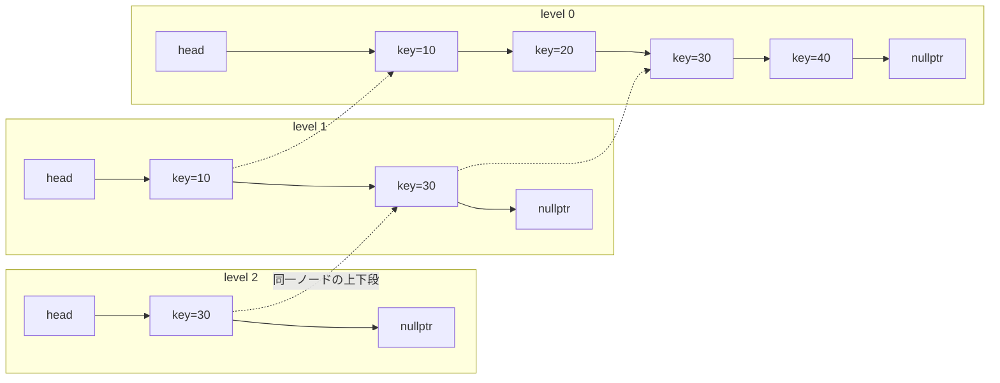

# 第11章 MemTable と InlineSkipList

> **本章で読むソース**
> - [`db/memtable.h`](https://github.com/facebook/rocksdb/blob/v11.1.1/db/memtable.h)
> - [`db/memtable.cc`](https://github.com/facebook/rocksdb/blob/v11.1.1/db/memtable.cc)
> - [`include/rocksdb/memtablerep.h`](https://github.com/facebook/rocksdb/blob/v11.1.1/include/rocksdb/memtablerep.h)
> - [`memtable/skiplistrep.cc`](https://github.com/facebook/rocksdb/blob/v11.1.1/memtable/skiplistrep.cc)
> - [`memtable/inlineskiplist.h`](https://github.com/facebook/rocksdb/blob/v11.1.1/memtable/inlineskiplist.h)

## この章の狙い

書き込みが WAL の次に到達する先が **MemTable** である。
本章では、MemTable が書き込みをいったんメモリ上のソート済み構造に受け止める役割を持つこと、その実体が `MemTableRep` という抽象を介して差し替え可能であり既定が SkipList であることを読む。
そのうえで既定の実装である **InlineSkipList** に降り、キーをノードに直接詰める「インライン格納」がなぜメモリと間接参照を減らすか、そして複数の書き手が読み手をロックせずに並行挿入できる仕組み（ロックフリー挿入）がどう成り立っているかを、`Insert`/`InsertConcurrently` の実コードで確認する。

## 前提

MemTable に積まれるキーは、ユーザーキーそのものではなく、シーケンス番号と操作種別を末尾に詰めた内部キーである。
内部キーの形式は前に扱った（[第5章 内部キー形式 InternalKey](../part01-data-model/05-internal-key.md)）。
キーと値が `Slice`（先頭ポインタと長さの組）として受け渡される点は[第4章 Slice](../part01-data-model/04-slice.md)で説明した。
複数の書き手が同時に MemTable へ挿入する経路は[第9章 WriteThread](./09-write-thread.md)で扱う書き込みグループに由来する。本章の後半でこの経路と結ぶ。

## MemTable の位置づけと MemTableRep という抽象

MemTable は、あるカラムファミリーが書き込みを受け付けている唯一の可変な表である。
書き込みが満杯に近づくと現在の MemTable は Immutable MemTable へ切り替わり、新しい空の MemTable が書き込みを引き継ぐ。
この役割を `db/memtable.h` の冒頭コメントが述べている。

[`db/memtable.h` L83-L88](https://github.com/facebook/rocksdb/blob/v11.1.1/db/memtable.h#L83-L88)

```cpp
// For each CF, rocksdb maintains an active memtable that accept writes,
// and zero or more sealed memtables that we call immutable memtables.
// This interface contains all methods required for immutable memtables.
// MemTable class inherit from `ReadOnlyMemTable` and implements additional
// methods required for active memtables.
// Immutable memtable list (MemTableList) maintains a list of ReadOnlyMemTable
```

`MemTable` クラスは、キーを格納する具体的なデータ構造を自分では持たない。
格納そのものは `MemTableRep` 型のメンバ `table_` に委譲しており、`MemTable` はエンコードや統計の更新といった上位の仕事を担う。

[`db/memtable.h` L846-L852](https://github.com/facebook/rocksdb/blob/v11.1.1/db/memtable.h#L846-L852)

```cpp
  KeyComparator comparator_;
  const ImmutableMemTableOptions moptions_;
  const size_t kArenaBlockSize;
  AllocTracker mem_tracker_;
  ConcurrentArena arena_;
  std::unique_ptr<MemTableRep> table_;
  std::unique_ptr<MemTableRep> range_del_table_;
```

`MemTableRep` は、MemTable の裏に置けるコレクションが満たすべき契約を定めた抽象クラスである。
契約は `include/rocksdb/memtablerep.h` の冒頭コメントに列挙されている。
重複を格納しないこと、`KeyComparator` で比較すること、読み取りは並行に行えるが書き込みの並行性までは要求しないこと、要素を削除しないことの4点である。

[`include/rocksdb/memtablerep.h` L6-L15](https://github.com/facebook/rocksdb/blob/v11.1.1/include/rocksdb/memtablerep.h#L6-L15)

```cpp
// This file contains the interface that must be implemented by any collection
// to be used as the backing store for a MemTable. Such a collection must
// satisfy the following properties:
//  (1) It does not store duplicate items.
//  (2) It uses MemTableRep::KeyComparator to compare items for iteration and
//     equality.
//  (3) It can be accessed concurrently by multiple readers and can support
//     during reads. However, it needn't support multiple concurrent writes.
//  (4) Items are never deleted.
```

この契約を満たす実装が複数あり、同じコメントが3種を挙げている。
既定はスキップリスト裏打ちの `SkipListRep`、プレフィックス内の走査が多いキー向けの `HashSkipListRep`、ランダム書き込みに寄せた `VectorRep` である。

[`include/rocksdb/memtablerep.h` L20-L30](https://github.com/facebook/rocksdb/blob/v11.1.1/include/rocksdb/memtablerep.h#L20-L30)

```cpp
// Users can implement their own memtable representations. We include three
// types built in:
//  - SkipListRep: This is the default; it is backed by a skip list.
//  - HashSkipListRep: The memtable rep that is best used for keys that are
//  structured like "prefix:suffix" where iteration within a prefix is
//  common and iteration across different prefixes is rare. It is backed by
//  a hash map where each bucket is a skip list.
//  - VectorRep: This is backed by an unordered std::vector. On iteration, the
// vector is sorted. It is intelligent about sorting; once the MarkReadOnly()
// has been called, the vector will only be sorted once. It is optimized for
// random-write-heavy workloads.
```

どの実装を使うかは `memtable_factory` オプションで選ぶ。
既定値は `SkipListFactory` であり、明示しなければスキップリストになる。

[`include/rocksdb/advanced_options.h` L753-L754](https://github.com/facebook/rocksdb/blob/v11.1.1/include/rocksdb/advanced_options.h#L753-L754)

```cpp
  std::shared_ptr<MemTableRepFactory> memtable_factory =
      std::shared_ptr<SkipListFactory>(new SkipListFactory);
```

## MemTable::Add が内部キーへ符号化して MemTableRep に挿入する

書き込み1件が MemTable に入る入口が `MemTable::Add` である。
この関数は、第5章で見た内部キーをさらに長さ前置でくるんだエントリを組み立て、それを `MemTableRep` に渡す。
エントリの並びは関数冒頭のコメントが定義している。

[`db/memtable.cc` L956-L967](https://github.com/facebook/rocksdb/blob/v11.1.1/db/memtable.cc#L956-L967)

```cpp
  // Format of an entry is concatenation of:
  //  key_size     : varint32 of internal_key.size()
  //  key bytes    : char[internal_key.size()]
  //  value_size   : varint32 of value.size()
  //  value bytes  : char[value.size()]
  //  checksum     : char[moptions_.protection_bytes_per_key]
  uint32_t key_size = static_cast<uint32_t>(key.size());
  uint32_t val_size = static_cast<uint32_t>(value.size());
  uint32_t internal_key_size = key_size + 8;
  const uint32_t encoded_len = VarintLength(internal_key_size) +
                               internal_key_size + VarintLength(val_size) +
                               val_size + moptions_.protection_bytes_per_key;
```

`internal_key_size` がユーザーキー長に8を足した値である点が、第5章の8バイトトレーラに対応する。
`Add` はまず格納先から書き込みバッファを確保し、そこに各部を順に詰める。
シーケンス番号と操作種別を1つの64ビットに詰める `PackSequenceAndType` がここで使われ、トレーラを書き込む。

[`db/memtable.cc` L968-L981](https://github.com/facebook/rocksdb/blob/v11.1.1/db/memtable.cc#L968-L981)

```cpp
  char* buf = nullptr;
  std::unique_ptr<MemTableRep>& table =
      type == kTypeRangeDeletion ? range_del_table_ : table_;
  KeyHandle handle = table->Allocate(encoded_len, &buf);

  char* p = EncodeVarint32(buf, internal_key_size);
  memcpy(p, key.data(), key_size);
  Slice key_slice(p, key_size);
  p += key_size;
  uint64_t packed = PackSequenceAndType(s, type);
  EncodeFixed64(p, packed);
  p += 8;
  p = EncodeVarint32(p, val_size);
  memcpy(p, value.data(), val_size);
```

確保（`Allocate`）と挿入（`Insert` 系）を分けている点に意味がある。
`Allocate` が返すバッファに `Add` がエントリを直接書き込み、書き終えてから挿入を呼ぶ。
これにより、エントリの本体を改めてコピーすることなく、確保した領域がそのまま格納先のノードになる。

挿入の呼び分けが `Add` の核である。
引数 `allow_concurrent` が false なら、外部同期のもとで単一書き手として挿入する。

[`db/memtable.cc` L998-L1013](https://github.com/facebook/rocksdb/blob/v11.1.1/db/memtable.cc#L998-L1013)

```cpp
  if (!allow_concurrent) {
    // Extract prefix for insert with hint. Hints are for point key table
    // (`table_`) only, not `range_del_table_`.
    if (table == table_ && insert_with_hint_prefix_extractor_ != nullptr &&
        insert_with_hint_prefix_extractor_->InDomain(key_slice)) {
      Slice prefix = insert_with_hint_prefix_extractor_->Transform(key_slice);
      bool res = table->InsertKeyWithHint(handle, &insert_hints_[prefix]);
      if (UNLIKELY(!res)) {
        return Status::TryAgain("key+seq exists");
      }
    } else {
      bool res = table->InsertKey(handle);
      if (UNLIKELY(!res)) {
        return Status::TryAgain("key+seq exists");
      }
    }
```

`allow_concurrent` が true なら、別の経路に分かれて並行挿入版を呼ぶ。

[`db/memtable.cc` L1051-L1057](https://github.com/facebook/rocksdb/blob/v11.1.1/db/memtable.cc#L1051-L1057)

```cpp
  } else {
    bool res = (hint == nullptr)
                   ? table->InsertKeyConcurrently(handle)
                   : table->InsertKeyWithHintConcurrently(handle, hint);
    if (UNLIKELY(!res)) {
      return Status::TryAgain("key+seq exists");
    }
```

非並行の枝では統計カウンタを `StoreRelaxed`（緩いストア）で更新している。
これは外部同期があるため複数命令での読み出し加算ストアでも競合しないからで、コメントが「atomic 加算のロック付き命令を避けるため」と述べている。
並行の枝ではこの加算を `MemTablePostProcessInfo` に溜め、書き込みグループの後処理でまとめて反映する。
バッチごとに溜めてから1回反映する設計は[第9章 WriteThread](./09-write-thread.md)の並列 MemTable 書き込みと対になる。

`SkipListRep` はこれらの呼び出しを InlineSkipList へそのまま橋渡しする薄い包みである。

[`memtable/skiplistrep.cc` L42-L73](https://github.com/facebook/rocksdb/blob/v11.1.1/memtable/skiplistrep.cc#L42-L73)

```cpp
  // Insert key into the list.
  // REQUIRES: nothing that compares equal to key is currently in the list.
  void Insert(KeyHandle handle) override {
    skip_list_.Insert(static_cast<char*>(handle));
  }

  bool InsertKey(KeyHandle handle) override {
    return skip_list_.Insert(static_cast<char*>(handle));
  }
// ... (中略) ...
  void InsertConcurrently(KeyHandle handle) override {
    skip_list_.InsertConcurrently(static_cast<char*>(handle));
  }

  bool InsertKeyConcurrently(KeyHandle handle) override {
    return skip_list_.InsertConcurrently(static_cast<char*>(handle));
  }
```

`SkipListRep::Allocate` も同様に `skip_list_.AllocateKey` を呼ぶだけである。
つまり MemTable が `Add` で確保したバッファは、InlineSkipList のノードに付随するキー領域そのものである。
この事実が次節のインライン格納につながる。

読み取り側の `MemTable::Get` も同じ表を引く。
冒頭で空判定とプレフィックス Bloom フィルタによる早期棄却を行い、通過したら `GetFromTable` でスキップリストを探索する。

[`db/memtable.cc` L1459-L1470](https://github.com/facebook/rocksdb/blob/v11.1.1/db/memtable.cc#L1459-L1470)

```cpp
  if (bloom_filter_ && !may_contain) {
    // iter is null if prefix bloom says the key does not exist
    PERF_COUNTER_ADD(bloom_memtable_miss_count, 1);
    *seq = kMaxSequenceNumber;
  } else {
    if (bloom_checked) {
      PERF_COUNTER_ADD(bloom_memtable_hit_count, 1);
    }
    GetFromTable(key, *max_covering_tombstone_seq, do_merge, callback,
                 is_blob_index, value, columns, timestamp, s, merge_context,
                 seq, &found_final_value, &merge_in_progress);
  }
```

## InlineSkipList の構造とインライン格納

スキップリストは、ソート済みの連結リストを多段に重ねた構造である。
最下段（level 0）は全ノードを通る連結リストで、上の段ほどノードがまばらになる。
探索は最上段から始め、行き過ぎたら一段下りるを繰り返すので、平均で対数時間でキーへ到達する。
次の図は3段のスキップリストで、上段が下段の一部だけを通すことを表している。



`InlineSkipList` は、このスキップリストを実装しつつ、ノードのメモリレイアウトを最適化した派生である。
ファイル冒頭のコメントが、キー領域をスキップリスト経由で確保させることで `const char*` を別に1ポインタ持つ無駄を省き、キャッシュ局所性を上げると述べている。

[`memtable/inlineskiplist.h` L10-L18](https://github.com/facebook/rocksdb/blob/v11.1.1/memtable/inlineskiplist.h#L10-L18)

```cpp
// InlineSkipList is derived from SkipList (skiplist.h), but it optimizes
// the memory layout by requiring that the key storage be allocated through
// the skip list instance.  For the common case of SkipList<const char*,
// Cmp> this saves 1 pointer per skip list node and gives better cache
// locality, at the expense of wasted padding from using AllocateAligned
// instead of Allocate for the keys.  The unused padding will be from
// 0 to sizeof(void*)-1 bytes, and the space savings are sizeof(void*)
// bytes, so despite the padding the space used is always less than
// SkipList<const char*, ..>.
```

ノードの定義がこの「インライン」を具体化している。
`Node` の本体には level 0 の next ポインタ1本しか持たず、キーは構造体直後のバイト列に、より上の段の next ポインタは構造体の直前に置く。
この置き方をコメントが説明している。

[`memtable/inlineskiplist.h` L352-L356](https://github.com/facebook/rocksdb/blob/v11.1.1/memtable/inlineskiplist.h#L352-L356)

```cpp
// The Node data type is more of a pointer into custom-managed memory than
// a traditional C++ struct.  The key is stored in the bytes immediately
// after the struct, and the next_ pointers for nodes with height > 1 are
// stored immediately _before_ the struct.  This avoids the need to include
// any pointer or sizing data, which reduces per-node memory overheads.
```

`Node` 構造体の唯一のメンバは長さ1の next ポインタ配列で、キーは `&next_[1]` を指す。

[`memtable/inlineskiplist.h` L374-L420](https://github.com/facebook/rocksdb/blob/v11.1.1/memtable/inlineskiplist.h#L374-L420)

```cpp
  const char* Key() const { return reinterpret_cast<const char*>(&next_[1]); }
// ... (中略) ...
 private:
  // next_[0] is the lowest level link (level 0).  Higher levels are
  // stored _earlier_, so level 1 is at next_[-1].
  Atomic<Node*> next_[1];
```

確保する関数 `AllocateNode` が、このレイアウト通りに1ブロックを切り出す。
高さ `height` のノードなら、前置に `height - 1` 本分のポインタ、続いて `Node` 本体、続いてキー領域を取り、本体の位置をその前置分だけずらして返す。

[`memtable/inlineskiplist.h` L859-L880](https://github.com/facebook/rocksdb/blob/v11.1.1/memtable/inlineskiplist.h#L859-L880)

```cpp
typename InlineSkipList<Comparator>::Node*
InlineSkipList<Comparator>::AllocateNode(size_t key_size, int height) {
  auto prefix = sizeof(Atomic<Node*>) * (height - 1);

  // prefix is space for the height - 1 pointers that we store before
  // the Node instance (next_[-(height - 1) .. -1]).  Node starts at
  // raw + prefix, and holds the bottom-mode (level 0) skip list pointer
  // next_[0].  key_size is the bytes for the key, which comes just after
  // the Node.
  char* raw = allocator_->AllocateAligned(prefix + sizeof(Node) + key_size);
  Node* x = reinterpret_cast<Node*>(raw + prefix);
// ... (中略) ...
  x->StashHeight(height);
  return x;
}
```

この1ブロック確保が効く理由は、ノード本体とそのキー、そして全段のポインタが連続したメモリに並ぶ点にある。
ノードへ到達してキーを比較するとき、ポインタを1回たどってさらにキー領域へもう1回飛ぶ間接参照が要らず、同じキャッシュラインに載りやすい。
比較はスキップリスト探索の最内ループで何度も走るので、この1回の間接参照削減が探索全体の速度に効く。

メモリ確保自体は **Arena** から行う。
`AllocateNode` の `allocator_->AllocateAligned` がそれで、Arena は大きなブロックを先頭から切り出していくだけの割り当て器である。
個々のノードを `malloc` せず Arena のポインタ加算で確保するので割り当てが速く、MemTable の解放時に Arena ごとまとめて返せるので個別 `free` も要らない。
Arena の詳しい仕組みは後の章で扱う（[第42章 メモリと Arena](../part07-cache/42-memory-arena.md)）。

ノードの高さは挿入ごとに乱数で決める。
`RandomHeight` は高さ1から始め、`kBranching` 分の1の確率で1段ずつ伸ばす。
既定の `kBranching` は4で、上限は `kMaxPossibleHeight`（32）である。

[`memtable/inlineskiplist.h` L559-L573](https://github.com/facebook/rocksdb/blob/v11.1.1/memtable/inlineskiplist.h#L559-L573)

```cpp
int InlineSkipList<Comparator>::RandomHeight() {
  auto rnd = Random::GetTLSInstance();

  // Increase height with probability 1 in kBranching
  int height = 1;
  while (height < kMaxHeight_ && height < kMaxPossibleHeight &&
         rnd->Next() < kScaledInverseBranching_) {
    height++;
  }
  TEST_SYNC_POINT_CALLBACK("InlineSkipList::RandomHeight::height", &height);
  assert(height > 0);
  assert(height <= kMaxHeight_);
  return height;
}
```

高さを乱数で決めることで、上段ほどまばらという分布が確率的に保たれる。
高い段に上がるノードほど少ないので、探索が上段で大きく飛び、下段で細かく詰める動きになり、平均対数時間が保たれる。

ここで `AllocateKey` が `AllocateNode(key_size, RandomHeight())` を呼んでキー領域へのポインタを返す点を補う。
高さは確保時に決まり、`StashHeight` で `next_[0]` の領域に一時的に隠して挿入段へ渡す。
挿入時に `UnstashHeight` で取り出すので、ノードに高さを格納する専用フィールドを持たずに済む。

## ノードのインラインレイアウト

前節のレイアウトを1ノード分の図にすると次のようになる。
高さ3のノードを例にとると、メモリの並びは「level 2 のポインタ、level 1 のポインタ、`Node` 本体（level 0 のポインタ）、キーのバイト列」である。
`Node*` が指すのは本体の先頭（level 0 のポインタ）であり、上段のポインタはそこから前へ、キーは後ろへ伸びる。

```text
低位アドレス                                                   高位アドレス
+-------------+-------------+----------------+--------------------------+
| next(lvl 2) | next(lvl 1) | next(lvl 0)    | key bytes (内部キー含む) |
| =next_[-2]  | =next_[-1]  | =next_[0]      | =&next_[1] 以降          |
+-------------+-------------+----------------+--------------------------+
              前置（height-1本）  ^ Node*はここを指す
```

`Next(n)` は `(&next_[0] - n)` を読む。
`n` が大きいほどアドレスが前へ下がるので、`next_[0]` が level 0、`next_[-1]` が level 1 という対応になる。
このアドレス計算により、可変高さのノードを単一の構造体型で表しながら、段数ぶんのポインタを過不足なく持てる。

## ロックフリー並行挿入の仕組み

InlineSkipList のスレッド安全性の前提が、ファイル冒頭にまとめてある。
`Insert` は外部同期（多くはミューテックス）を要するが、`InsertConcurrently` は読み取りや他の並行挿入と同時に安全に呼べる。
読み取りは内部ロックなしに進む。

[`memtable/inlineskiplist.h` L20-L39](https://github.com/facebook/rocksdb/blob/v11.1.1/memtable/inlineskiplist.h#L20-L39)

```cpp
// Thread safety -------------
//
// Writes via Insert require external synchronization, most likely a mutex.
// InsertConcurrently can be safely called concurrently with reads and
// with other concurrent inserts.  Reads require a guarantee that the
// InlineSkipList will not be destroyed while the read is in progress.
// Apart from that, reads progress without any internal locking or
// synchronization.
//
// Invariants:
//
// (1) Allocated nodes are never deleted until the InlineSkipList is
// destroyed.  This is trivially guaranteed by the code since we never
// delete any skip list nodes.
//
// (2) The contents of a Node except for the next/prev pointers are
// immutable after the Node has been linked into the InlineSkipList.
// Only Insert() modifies the list, and it is careful to initialize a
// node and use release-stores to publish the nodes in one or more lists.
```

不変条件(1)と(2)が、ロックなし読み取りの安全性を支える。
ノードは破棄されないので、読み手が掴んだポインタが消える心配がない。
ノードのキー部分はリンク後に不変なので、読み手が比較中の内容が書き換わらない。
変わりうるのは next/prev ポインタだけであり、その公開だけを正しく順序づければよい。

その順序づけが next ポインタの atomic アクセスである。
`Next` は acquire ロードで読む。
acquire ロードは、そのポインタを通して見えるノードが完全に初期化済みであることを保証する。

[`memtable/inlineskiplist.h` L379-L391](https://github.com/facebook/rocksdb/blob/v11.1.1/memtable/inlineskiplist.h#L379-L391)

```cpp
  Node* Next(int n) {
    assert(n >= 0);
    // Use an 'acquire load' so that we observe a fully initialized
    // version of the returned Node.
    return ((&next_[0] - n)->Load());
  }

  void SetNext(int n, Node* x) {
    assert(n >= 0);
    // Use a 'release store' so that anybody who reads through this
    // pointer observes a fully initialized version of the inserted node.
    (&next_[0] - n)->Store(x);
  }
```

`SetNext` は release ストアで書く。
新ノードへのポインタを既存ノードの next に公開する瞬間に release ストアを使うと、それより前に行ったノードの初期化が、acquire ロードした読み手に必ず見える。
acquire と release の対が、ロックを取らずに「公開」と「観測」の前後関係を確定させる。これがロックフリーで正しさを保てる根拠である。

一方で、新ノード自身の next を初めて埋めるときは順序保証が要らない。
そのノードはまだどのリストにもつながっておらず、他スレッドから到達できないからである。
`InsertAfter` はここを `NoBarrier_SetNext`（緩いストア）で書き、最後の公開だけ `SetNext` の release ストアに任せる。

[`memtable/inlineskiplist.h` L399-L415](https://github.com/facebook/rocksdb/blob/v11.1.1/memtable/inlineskiplist.h#L399-L415)

```cpp
  Node* NoBarrier_Next(int n) {
    assert(n >= 0);
    return (&next_[0] - n)->LoadRelaxed();
  }

  void NoBarrier_SetNext(int n, Node* x) {
    assert(n >= 0);
    (&next_[0] - n)->StoreRelaxed(x);
  }

  // Insert node after prev on specific level.
  void InsertAfter(Node* prev, int level) {
    // NoBarrier_SetNext() suffices since we will add a barrier when
    // we publish a pointer to "this" in prev.
    NoBarrier_SetNext(level, prev->NoBarrier_Next(level));
    prev->SetNext(level, this);
  }
```

NoBarrier 版を使い分けることが速さに効く。
メモリバリアは CPU の並べ替えと書き込みバッファのフラッシュを抑える命令で、到達不能なノードの内部書き込みにまでこれを掛けるのは無駄である。
本当に同期が要る一点（リストへの公開）にだけ release/acquire を置き、それ以外を緩いアクセスにすることで、正しさを保ったまま不要なバリアを削る。

並行挿入の本体が `Insert<true>` である。
`InsertConcurrently` はスタック上に prev/next 配列を用意し、`UseCAS=true` でこのテンプレートを呼ぶ。

[`memtable/inlineskiplist.h` L912-L920](https://github.com/facebook/rocksdb/blob/v11.1.1/memtable/inlineskiplist.h#L912-L920)

```cpp
template <class Comparator>
bool InlineSkipList<Comparator>::InsertConcurrently(const char* key) {
  Node* prev[kMaxPossibleHeight];
  Node* next[kMaxPossibleHeight];
  Splice splice;
  splice.prev_ = prev;
  splice.next_ = next;
  return Insert<true>(key, &splice, false);
}
```

`UseCAS` の枝が、各段で next ポインタへ compare-and-swap を撃つ実挿入である。
まず新ノードの next を緩いストアで `splice->next_[i]` に向け、続いて直前ノードの該当段に対し「next が今も `splice->next_[i]` なら新ノードに差し替える」compare-and-swap を撃つ。
成功すればその段の連結が完了する。
失敗したら、その間に別スレッドが割り込んで挿入したということなので、`FindSpliceForLevel` で prev/next を取り直して撃ち直す。

[`memtable/inlineskiplist.h` L1134-L1163](https://github.com/facebook/rocksdb/blob/v11.1.1/memtable/inlineskiplist.h#L1134-L1163)

```cpp
  if (UseCAS) {
    for (int i = 0; i < height; ++i) {
      while (true) {
        // Checking for duplicate keys on the level 0 is sufficient
        if (UNLIKELY(i == 0 && splice->next_[i] != nullptr &&
                     compare_(splice->next_[i]->Key(), key_decoded) <= 0)) {
          // duplicate key
          return false;
        }
// ... (中略) ...
        x->NoBarrier_SetNext(i, splice->next_[i]);
        if (splice->prev_[i]->CASNext(i, splice->next_[i], x)) {
          // success
          break;
        }
        // CAS failed, we need to recompute prev and next. It is unlikely
        // to be helpful to try to use a different level as we redo the
        // search, because it should be unlikely that lots of nodes have
        // been inserted between prev[i] and next[i]. No point in using
        // next[i] as the after hint, because we know it is stale.
        FindSpliceForLevel<false>(key_decoded, splice->prev_[i], nullptr, i,
                                  &splice->prev_[i], &splice->next_[i]);
```

compare-and-swap が並行挿入を成立させる中身である。
直前ノードの next を「期待値と一致するなら差し替える」という不可分な1命令で更新するので、複数スレッドが同じ箇所に挿そうとしても、prev の next を実際に書き換えられるのは一度に1つだけになる。
負けたスレッドは古い prev/next を捨てて探索からやり直す。
読み手はこの間も `Next` の acquire ロードで段をたどるだけで、書き手のロックを待たない。
これが「読み手をロックせずに挿入する」の機構である。

`CASNext` は `CasStrong` を呼んでいて、`SetNext` と同じ release 意味を持つ。

[`memtable/inlineskiplist.h` L393-L396](https://github.com/facebook/rocksdb/blob/v11.1.1/memtable/inlineskiplist.h#L393-L396)

```cpp
  bool CASNext(int n, Node* expected, Node* x) {
    assert(n >= 0);
    return (&next_[0] - n)->CasStrong(expected, x);
  }
```

挿入位置を表す `Splice` が、再探索のコストを抑える鍵である。
`Splice` は各段の prev と next の組を保持し、その不変条件（prev[i+1] <= prev[i] < next[i] <= next[i+1]）が成り立つ限り、上の段で挟めたキーは下の段でも挟めている。

[`memtable/inlineskiplist.h` L339-L350](https://github.com/facebook/rocksdb/blob/v11.1.1/memtable/inlineskiplist.h#L339-L350)

```cpp
template <class Comparator>
struct InlineSkipList<Comparator>::Splice {
  // The invariant of a Splice is that prev_[i+1].key <= prev_[i].key <
  // next_[i].key <= next_[i+1].key for all i.  That means that if a
  // key is bracketed by prev_[i] and next_[i] then it is bracketed by
  // all higher levels.  It is _not_ required that prev_[i]->Next(i) ==
  // next_[i] (it probably did at some point in the past, but intervening
  // or concurrent operations might have inserted nodes in between).
  int height_ = 0;
  Node** prev_;
  Node** next_;
```

非並行の `Insert()` は、この `Splice` をインスタンスのメンバ `seq_splice_` として持ち回る。

[`memtable/inlineskiplist.h` L907-L910](https://github.com/facebook/rocksdb/blob/v11.1.1/memtable/inlineskiplist.h#L907-L910)

```cpp
template <class Comparator>
bool InlineSkipList<Comparator>::Insert(const char* key) {
  return Insert<false>(key, seq_splice_, false);
}
```

直前の挿入で求めた prev/next を次の挿入で再利用できるので、キーが近い順に来るとき探索の大半を省ける。
コメントによれば、`Splice` をヒントとして使うと挿入コストが O(log N) から O(log D)（D は前回位置からの距離）に下がり、特に逐次挿入で効く。
非並行版が単一の `seq_splice_` を使い回せるのは外部同期があるからで、並行版は各呼び出しがスタック上に自前の `Splice` を持つことで、書き手どうしがヒントを壊し合わないようにしている。
この並行経路は、複数の書き手が1つの MemTable へ同時に挿す[第9章 WriteThread](./09-write-thread.md)の並列書き込みで実際に踏まれる。

## 並行挿入の前提となるオプション

並行 MemTable 書き込みは `allow_concurrent_memtable_write` オプションで制御し、既定で有効である。
このオプションは SkipListFactory でのみ実装されており、`inplace_update_support` とは併用できない。

[`include/rocksdb/options.h` L1337-L1345](https://github.com/facebook/rocksdb/blob/v11.1.1/include/rocksdb/options.h#L1337-L1345)

```cpp
  // If true, allow multi-writers to update mem tables in parallel.
  // Only some memtable_factory-s support concurrent writes; currently it
  // is implemented only for SkipListFactory.  Concurrent memtable writes
  // are not compatible with inplace_update_support or filter_deletes.
  // It is strongly recommended to set enable_write_thread_adaptive_yield
  // if you are going to use this feature.
  //
  // Default: true
  bool allow_concurrent_memtable_write = true;
```

このオプションが true のとき、`MemTable::Add` の `allow_concurrent` 枝が選ばれ、`InsertConcurrently` 経由で前節の compare-and-swap 挿入が走る。
書き込みグループのリーダーがまとめて WAL に書いたあと、グループの各書き手が自分のエントリを並行に MemTable へ挿す形になる。
グループ化と並列適用の流れは[第9章 WriteThread](./09-write-thread.md)で扱う。

## まとめ

- MemTable はカラムファミリーの可変な書き込み先で、格納の実体を `MemTableRep` に委譲する。既定は `SkipListFactory` による SkipList である。
- `MemTable::Add` はキーを長さ前置の内部キーエントリへ符号化し、確保したバッファに直接書いてから `MemTableRep` に挿入する。確保と挿入を分けることでエントリの再コピーを避ける。
- InlineSkipList は、キーと全段の next ポインタをノードと連続した1ブロックに置く。間接参照を1段減らし、キャッシュ局所性を上げる。ノードは Arena から確保し、まとめて解放する。
- ノードの高さは `RandomHeight` が `kBranching` 分の1の確率で伸ばして決める。上段ほどまばらになり、平均対数時間の探索が保たれる。
- 並行挿入は next ポインタへの compare-and-swap で行い、prev の next を不可分に差し替える。読み手は acquire ロードで段をたどるだけでロックを待たない。release/acquire と NoBarrier の使い分けが、正しさと速さを両立させる。
- 並行経路は `allow_concurrent_memtable_write`（既定有効）が前提で、書き込みグループの並列 MemTable 書き込みで踏まれる。

## 関連する章

- [第9章 WriteThread](./09-write-thread.md)：書き込みグループと並列 MemTable 書き込み。
- [第10章 WAL](./10-wal.md)：MemTable の手前で耐久性を担保する書き込みログ。
- [第13章 フラッシュ](./13-flush.md)：満杯になった MemTable を SST へ書き出す。
- [第42章 メモリと Arena](../part07-cache/42-memory-arena.md)：ノードを確保する Arena の詳細。
