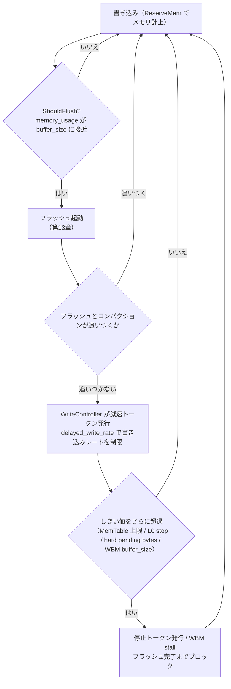

# 第12章 WriteBufferManager と Write Stall/Controller

> **本章で読むソース**
>
> - [`include/rocksdb/write_buffer_manager.h`](https://github.com/facebook/rocksdb/blob/v11.1.1/include/rocksdb/write_buffer_manager.h)
> - [`memtable/write_buffer_manager.cc`](https://github.com/facebook/rocksdb/blob/v11.1.1/memtable/write_buffer_manager.cc)
> - [`db/write_controller.h`](https://github.com/facebook/rocksdb/blob/v11.1.1/db/write_controller.h)
> - [`db/write_controller.cc`](https://github.com/facebook/rocksdb/blob/v11.1.1/db/write_controller.cc)
> - [`db/write_stall_stats.h`](https://github.com/facebook/rocksdb/blob/v11.1.1/db/write_stall_stats.h)
> - [`db/column_family.cc`](https://github.com/facebook/rocksdb/blob/v11.1.1/db/column_family.cc)
> - [`db/db_impl/db_impl_write.cc`](https://github.com/facebook/rocksdb/blob/v11.1.1/db/db_impl/db_impl_write.cc)

## この章の狙い

書き込みは MemTable というメモリ上の構造へ積まれる。
書き込み速度がフラッシュやコンパクションの速度を上回ると、メモリは際限なく膨らみ、いずれプロセスが破綻する。
本章では、MemTable のメモリ総量を会計する `WriteBufferManager` と、書き込みを減速や停止させてメモリの破綻を防ぐ `WriteController` を読む。
しきい値の判定、減速レートの計算、Block Cache を使った統合メモリ管理という三つの機構を、実コードに即して理解する。

## 前提

- [第8章 書き込みパイプライン](08-write-pipeline.md)：本章のバックプレッシャがどこで挿入されるか。
- [第11章 MemTable とスキップリスト](11-memtable-skiplist.md)：会計対象であるメモリ消費の発生源。

## 問題設定：たまりすぎるメモリをどう抑えるか

MemTable はメモリを消費する。
書き込みが MemTable を満たすと RocksDB はそれを **Immutable MemTable** に切り替え、バックグラウンドでフラッシュして SST にする。
このフラッシュが書き込みに追いつくあいだは何も起きない。

問題は、複数のカラムファミリーや複数の DB が同一プロセス内でメモリを奪い合うときに起きる。
カラムファミリーごとの `write_buffer_size` だけを見ても、プロセス全体での MemTable メモリ総量は制御できない。
そこで RocksDB は二段構えの仕組みを持つ。
一段目は `WriteBufferManager` で、複数の書き込みバッファをまたいでメモリ総量を会計し、たまりすぎたらフラッシュを促す。
二段目は `WriteController` で、フラッシュやコンパクションが追いつかないときに書き込み自体を減速、最終的に停止させる。



## WriteBufferManager：MemTable メモリの会計

`WriteBufferManager` は MemTable が使うメモリ量を一つのカウンタに集約する。
コンストラクタは上限値 `_buffer_size`、任意の `Cache`、そして `allow_stall` フラグを取る。

[`include/rocksdb/write_buffer_manager.h` L37-L52](https://github.com/facebook/rocksdb/blob/v11.1.1/include/rocksdb/write_buffer_manager.h#L37-L52)

```cpp
class WriteBufferManager final {
 public:
  // Parameters:
  // _buffer_size: _buffer_size = 0 indicates no limit. Memory won't be capped.
  // memory_usage() won't be valid and ShouldFlush() will always return true.
  //
  // cache_: if `cache` is provided, we'll put dummy entries in the cache and
  // cost the memory allocated to the cache. It can be used even if _buffer_size
  // = 0.
  //
  // allow_stall: if set true, it will enable stalling of writes when
  // memory_usage() exceeds buffer_size. It will wait for flush to complete and
  // memory usage to drop down.
  explicit WriteBufferManager(size_t _buffer_size,
                              std::shared_ptr<Cache> cache = {},
                              bool allow_stall = false);
```

`_buffer_size` が 0 のときは上限なしを意味する。
上限が有効かどうかは `enabled()`（`buffer_size() > 0`）で判定する。

会計には二つのカウンタを使う。
`memory_used_` はフラッシュ待ちを含む MemTable メモリの総量、`memory_active_` はまだフラッシュ予約されていない（書き込み可能な）MemTable のメモリ量である。
それぞれを公開するアクセサが `memory_usage()` と `mutable_memtable_memory_usage()` で、いずれも `std::atomic` をロックなしで読む。

[`include/rocksdb/write_buffer_manager.h` L66-L82](https://github.com/facebook/rocksdb/blob/v11.1.1/include/rocksdb/write_buffer_manager.h#L66-L82)

```cpp
  // Returns the total memory used by memtables.
  // Only valid if enabled()
  size_t memory_usage() const {
    return memory_used_.load(std::memory_order_relaxed);
  }

  // Returns the total memory used by active memtables.
  size_t mutable_memtable_memory_usage() const {
    return memory_active_.load(std::memory_order_relaxed);
  }

  size_t dummy_entries_in_cache_usage() const;

  // Returns the buffer_size.
  size_t buffer_size() const {
    return buffer_size_.load(std::memory_order_relaxed);
  }
```

### ReserveMem と FreeMem：計上と解放

メモリを確保したとき書き込みパスは `ReserveMem` を呼ぶ。
Cache へのコスト計上が有効なら `ReserveMemWithCache` に委譲し、そうでなく上限が有効なら `memory_used_` を加算する。
いずれの場合も、上限が有効なら `memory_active_` を加算する。

[`memtable/write_buffer_manager.cc` L56-L65](https://github.com/facebook/rocksdb/blob/v11.1.1/memtable/write_buffer_manager.cc#L56-L65)

```cpp
void WriteBufferManager::ReserveMem(size_t mem) {
  if (cache_res_mgr_ != nullptr) {
    ReserveMemWithCache(mem);
  } else if (enabled()) {
    memory_used_.fetch_add(mem, std::memory_order_relaxed);
  }
  if (enabled()) {
    memory_active_.fetch_add(mem, std::memory_order_relaxed);
  }
}
```

`memory_active_` の減算は二段階に分かれる。
MemTable がフラッシュ対象に切り替わる時点で `ScheduleFreeMem` が `memory_active_` だけを減らす。
これにより「まだ書き込める活動中メモリ」の量が、フラッシュ待ちに移ったぶんだけ即座に減る。
フラッシュが実際に完了してメモリが返されたときに `FreeMem` が `memory_used_` を減らす。

[`memtable/write_buffer_manager.cc` L86-L100](https://github.com/facebook/rocksdb/blob/v11.1.1/memtable/write_buffer_manager.cc#L86-L100)

```cpp
void WriteBufferManager::ScheduleFreeMem(size_t mem) {
  if (enabled()) {
    memory_active_.fetch_sub(mem, std::memory_order_relaxed);
  }
}

void WriteBufferManager::FreeMem(size_t mem) {
  if (cache_res_mgr_ != nullptr) {
    FreeMemWithCache(mem);
  } else if (enabled()) {
    memory_used_.fetch_sub(mem, std::memory_order_relaxed);
  }
  // Check if stall is active and can be ended.
  MaybeEndWriteStall();
}
```

`FreeMem` の末尾で `MaybeEndWriteStall` を呼ぶのは、メモリが返ったタイミングが「停止していた書き込みを再開できるか」を判定する自然な機会だからである。
この再開処理は後述する。

### ShouldFlush：フラッシュを促す判定

フラッシュを促すかどうかは `ShouldFlush` が決める。
判定は二つの条件の論理和になっている。

[`include/rocksdb/write_buffer_manager.h` L101-L117](https://github.com/facebook/rocksdb/blob/v11.1.1/include/rocksdb/write_buffer_manager.h#L101-L117)

```cpp
  bool ShouldFlush() const {
    if (enabled()) {
      if (mutable_memtable_memory_usage() >
          mutable_limit_.load(std::memory_order_relaxed)) {
        return true;
      }
      size_t local_size = buffer_size();
      if (memory_usage() >= local_size &&
          mutable_memtable_memory_usage() >= local_size / 2) {
        // If the memory exceeds the buffer size, we trigger more aggressive
        // flush. But if already more than half memory is being flushed,
        // triggering more flush may not help. We will hold it instead.
        return true;
      }
    }
    return false;
  }
```

第一の条件は、活動中メモリ `mutable_memtable_memory_usage()` が `mutable_limit_` を超えたとき。
`mutable_limit_` は `buffer_size` の 8 分の 7 に設定される。
これは `SetBufferSize` の `mutable_limit_.store(new_size * 7 / 8, ...)` で計算される（[`write_buffer_manager.h` L85-L91](https://github.com/facebook/rocksdb/blob/v11.1.1/include/rocksdb/write_buffer_manager.h#L85-L91)）。
活動中メモリが上限の 8 分の 7 に達した時点でフラッシュを始めれば、残り 8 分の 1 を消費しきる前に新しい MemTable へ切り替える余地が残る。

第二の条件は、総量 `memory_usage()` が `buffer_size` 以上に達し、かつ活動中メモリが上限の半分以上あるとき。
コメントが説明するとおり、すでに半分以上がフラッシュ中なら追加のフラッシュは効かないと判断し、これ以上は起動しない。
判定対象を「活動中メモリが半分以上残っているか」に絞ることで、無駄なフラッシュ起動を避けている。

`ShouldFlush` は書き込みパスの前処理で呼ばれる。

[`db/db_impl/db_impl_write.cc` L1520-L1529](https://github.com/facebook/rocksdb/blob/v11.1.1/db/db_impl/db_impl_write.cc#L1520-L1529)

```cpp
  if (UNLIKELY(status.ok() && write_buffer_manager_->ShouldFlush())) {
    // Before a new memtable is added in SwitchMemtable(),
    // write_buffer_manager_->ShouldFlush() will keep returning true. If another
    // thread is writing to another DB with the same write buffer, they may also
    // be flushed. We may end up with flushing much more DBs than needed. It's
    // suboptimal but still correct.
    InstrumentedMutexLock l(&mutex_);
    WaitForPendingWrites();
    status = HandleWriteBufferManagerFlush(write_context);
  }
```

フラッシュ自体の処理（MemTable 切り替えと SST 生成）は[第13章 フラッシュ](13-flush.md)で扱う。

### Block Cache への charge：キャッシュとライトバッファの統合メモリ管理

`WriteBufferManager` の設計の核は、`Cache` を渡したときの振る舞いにある。
このとき MemTable のメモリは Block Cache に **charge**（課金）され、キャッシュとライトバッファが一つのメモリ予算を共有する。

コンストラクタは `Cache` が渡されると `CacheReservationManager` を生成する。

[`memtable/write_buffer_manager.cc` L21-L39](https://github.com/facebook/rocksdb/blob/v11.1.1/memtable/write_buffer_manager.cc#L21-L39)

```cpp
WriteBufferManager::WriteBufferManager(size_t _buffer_size,
                                       std::shared_ptr<Cache> cache,
                                       bool allow_stall)
    : buffer_size_(_buffer_size),
      mutable_limit_(buffer_size_ * 7 / 8),
      memory_used_(0),
      memory_active_(0),
      cache_res_mgr_(nullptr),
      allow_stall_(allow_stall),
      stall_active_(false) {
  if (cache) {
    // Memtable's memory usage tends to fluctuate frequently
    // therefore we set delayed_decrease = true to save some dummy entry
    // insertion on memory increase right after memory decrease
    cache_res_mgr_ = std::make_shared<
        CacheReservationManagerImpl<CacheEntryRole::kWriteBuffer>>(
        cache, true /* delayed_decrease */);
  }
}
```

`CacheReservationManager` は、予約したいバイト数ぶんの **ダミーエントリ**（dummy entry）を Block Cache に挿入する。
ダミーエントリは中身を持たないが Cache の容量を占有する。
これにより、MemTable が使っているメモリが Block Cache の予算からも引かれ、キャッシュ可能なブロック量が自動的に減る。

`ReserveMemWithCache` は新しい総量を計算し、その値で予約を更新する。

[`memtable/write_buffer_manager.cc` L68-L84](https://github.com/facebook/rocksdb/blob/v11.1.1/memtable/write_buffer_manager.cc#L68-L84)

```cpp
void WriteBufferManager::ReserveMemWithCache(size_t mem) {
  assert(cache_res_mgr_ != nullptr);
  // Use a mutex to protect various data structures. Can be optimized to a
  // lock-free solution if it ends up with a performance bottleneck.
  std::lock_guard<std::mutex> lock(cache_res_mgr_mu_);

  size_t new_mem_used = memory_used_.load(std::memory_order_relaxed) + mem;
  memory_used_.store(new_mem_used, std::memory_order_relaxed);
  Status s = cache_res_mgr_->UpdateCacheReservation(new_mem_used);

  // We absorb the error since WriteBufferManager is not able to handle
  // this failure properly. Ideallly we should prevent this allocation
  // from happening if this cache charging fails.
  // [TODO] We'll need to improve it in the future and figure out what to do on
  // error
  s.PermitUncheckedError();
}
```

この機構が解く問題は二重計上である。
MemTable と Block Cache を別々のメモリ予算で管理すると、プロセス全体のメモリ上限を「MemTable 用」と「キャッシュ用」に静的に割り振らなければならない。
charge によって両者を一つの Cache 予算へ統合すると、書き込みが多い局面では MemTable がキャッシュ容量を圧迫し、書き込みが落ち着けばキャッシュが容量を取り戻す。
プロセス全体のメモリ上限は Block Cache の容量という単一の値で表現できる。

コンストラクタが `delayed_decrease = true` を渡すのは、MemTable のメモリ量が頻繁に上下するためである。
減少の直後に増加が来るとダミーエントリの削除と再挿入が無駄になる。
減少を遅延させることで、その往復を省いている。

## WriteController：書き込みのバックプレッシャ

フラッシュを促してもメモリ流入が止まらないとき、最後の手段は書き込みそのものを抑えることである。
`WriteController` がこれを担う。
書き込みの「停止」と「減速」を、トークンの所有という形で表現する。

クラスのコメントが役割を端的に述べている。
write stall はコンパクションが書き込み速度に追いつけないときに起きる。

[`db/write_controller.h` L20-L37](https://github.com/facebook/rocksdb/blob/v11.1.1/db/write_controller.h#L20-L37)

```cpp
// WriteController is controlling write stalls in our write code-path. Write
// stalls happen when compaction can't keep up with write rate.
// All of the methods here (including WriteControllerToken's destructors) need
// to be called while holding DB mutex
class WriteController {
 public:
  explicit WriteController(uint64_t _delayed_write_rate = 1024u * 1024u * 32u,
                           int64_t low_pri_rate_bytes_per_sec = 1024 * 1024)
      : total_stopped_(0),
        total_delayed_(0),
        total_compaction_pressure_(0),
        credit_in_bytes_(0),
        next_refill_time_(0),
        low_pri_rate_limiter_(
            NewGenericRateLimiter(low_pri_rate_bytes_per_sec)) {
    set_max_delayed_write_rate(_delayed_write_rate);
  }
```

状態は三つの `std::atomic<int>` カウンタで持つ。
`total_stopped_` が停止トークンの数、`total_delayed_` が減速トークンの数、`total_compaction_pressure_` がコンパクション促進トークンの数である。

### トークンによる状態管理

停止と減速はトークンを取得する操作で表現する。
`GetStopToken` はカウンタを一つ増やし、トークンを返す。
トークンが破棄されるとデストラクタがカウンタを一つ減らす。

[`db/write_controller.cc` L17-L34](https://github.com/facebook/rocksdb/blob/v11.1.1/db/write_controller.cc#L17-L34)

```cpp
std::unique_ptr<WriteControllerToken> WriteController::GetStopToken() {
  ++total_stopped_;
  return std::unique_ptr<WriteControllerToken>(new StopWriteToken(this));
}

std::unique_ptr<WriteControllerToken> WriteController::GetDelayToken(
    uint64_t write_rate) {
  if (0 == total_delayed_++) {
    // Starting delay, so reset counters.
    next_refill_time_ = 0;
    credit_in_bytes_ = 0;
  }
  // NOTE: for simplicity, any current credit_in_bytes_ or "debt" in
  // next_refill_time_ will be based on an old rate. This rate will apply
  // for subsequent additional debts and for the next refill.
  set_delayed_write_rate(write_rate);
  return std::unique_ptr<WriteControllerToken>(new DelayWriteToken(this));
}
```

トークンを `std::unique_ptr` で持たせる設計の意味は、状態の寿命をオブジェクトの寿命に縛れることにある。
カラムファミリーは write stall 条件が成立しているあいだだけトークンを保持し、条件が解消されればトークンを破棄する。
デストラクタがカウンタを戻すので、状態の取り消し忘れが起きない。

[`db/write_controller.cc` L106-L114](https://github.com/facebook/rocksdb/blob/v11.1.1/db/write_controller.cc#L106-L114)

```cpp
StopWriteToken::~StopWriteToken() {
  assert(controller_->total_stopped_ >= 1);
  --controller_->total_stopped_;
}

DelayWriteToken::~DelayWriteToken() {
  controller_->total_delayed_--;
  assert(controller_->total_delayed_.load() >= 0);
}
```

停止しているか、減速が必要かは、カウンタを読むだけで分かる。

[`db/write_controller.h` L53-L57](https://github.com/facebook/rocksdb/blob/v11.1.1/db/write_controller.h#L53-L57)

```cpp
  bool IsStopped() const;
  bool NeedsDelay() const { return total_delayed_.load() > 0; }
  bool NeedSpeedupCompaction() const {
    return IsStopped() || NeedsDelay() || total_compaction_pressure_.load() > 0;
  }
```

### GetDelay：トークンバケットによる滑らかな減速

減速は、書き込もうとするバイト数に応じて呼び出し元が眠るべきマイクロ秒数を返すことで実現する。
`GetDelay` が `delayed_write_rate_`（バイト毎秒）に基づいてこの値を計算する。
仕組みはトークンバケットである。

[`db/write_controller.cc` L51-L100](https://github.com/facebook/rocksdb/blob/v11.1.1/db/write_controller.cc#L51-L100)

```cpp
uint64_t WriteController::GetDelay(SystemClock* clock, uint64_t num_bytes) {
  if (total_stopped_.load(std::memory_order_relaxed) > 0) {
    return 0;
  }
  if (total_delayed_.load(std::memory_order_relaxed) == 0) {
    return 0;
  }

  if (credit_in_bytes_ >= num_bytes) {
    credit_in_bytes_ -= num_bytes;
    return 0;
  }
  // ... (中略) ...
  if (next_refill_time_ <= time_now) {
    // Refill based on time interval plus any extra elapsed
    uint64_t elapsed = time_now - next_refill_time_ + kMicrosPerRefill;
    credit_in_bytes_ += static_cast<uint64_t>(
        1.0 * elapsed / kMicrosPerSecond * delayed_write_rate_ + 0.999999);
    next_refill_time_ = time_now + kMicrosPerRefill;

    if (credit_in_bytes_ >= num_bytes) {
      // Avoid delay if possible, to reduce DB mutex release & re-aquire.
      credit_in_bytes_ -= num_bytes;
      return 0;
    }
  }

  // We need to delay to avoid exceeding write rate.
  assert(num_bytes > credit_in_bytes_);
  uint64_t bytes_over_budget = num_bytes - credit_in_bytes_;
  uint64_t needed_delay = static_cast<uint64_t>(
      1.0 * bytes_over_budget / delayed_write_rate_ * kMicrosPerSecond);

  credit_in_bytes_ = 0;
  next_refill_time_ += needed_delay;

  // Minimum delay of refill interval, to reduce DB mutex contention.
  return std::max(next_refill_time_ - time_now, kMicrosPerRefill);
}
```

`credit_in_bytes_` が「いま遅延なしで書けるバイト数」のバケット残量である。
要求バイト数がバケットに収まれば、その場で残量を引いて 0 を返す。
収まらなければ、最後に補充してからの経過時間ぶんを `delayed_write_rate_` に掛けて補充する。
補充は 1 ミリ秒ごと（`kMicrosPerRefill = 1000`）を単位とする。
それでも足りなければ、不足ぶんを `delayed_write_rate_` で割って必要な遅延を求める。
時間の取得頻度を補充間隔より少なく抑えているのは、`GetDelay` が DB ミューテックスを保持したまま呼ばれるためである（[`write_controller.cc` L46-L50](https://github.com/facebook/rocksdb/blob/v11.1.1/db/write_controller.cc#L46-L50) のコメント）。

このトークンバケットが「滑らかな減速」を生む。
個々の書き込みを固定時間ブロックするのではなく、累積バイト数を `delayed_write_rate_` に追従させる。
小さな書き込みはバケット残量で吸収して遅延ゼロで通し、大きな書き込みだけ比例した時間だけ眠らせる。
結果として、全書き込みの合計スループットがレートに張り付き、個々のレイテンシのばらつきは小さくなる。

返された遅延は呼び出し元が消化する。
書き込みパスの `DelayWrite` が `GetDelay` を呼び、返ったマイクロ秒だけ 1 ミリ秒刻みで眠る。
途中で減速が不要になれば（`NeedsDelay()` が偽になれば）ループを抜ける。

[`db/db_impl/db_impl_write.cc` L2211-L2248](https://github.com/facebook/rocksdb/blob/v11.1.1/db/db_impl/db_impl_write.cc#L2211-L2248)

```cpp
    uint64_t delay;
    if (&write_thread == &write_thread_) {
      delay =
          write_controller_.GetDelay(immutable_db_options_.clock, num_bytes);
    } else {
      // ... (中略) ...
    }
    // ... (中略) ...
    if (delay > 0) {
      // ... (中略) ...
      const uint64_t kDelayInterval = 1001;
      uint64_t stall_end = start_time + delay;
      while (write_controller_.NeedsDelay()) {
        if (immutable_db_options_.clock->NowMicros() >= stall_end) {
          // We already delayed this write `delay` microseconds
          break;
        }

        delayed = true;
        // Sleep for 0.001 seconds
        immutable_db_options_.clock->SleepForMicroseconds(kDelayInterval);
      }
```

## Write Stall の発火条件

どの条件で減速トークンや停止トークンを取るかは、カラムファミリーごとに `ColumnFamilyData::GetWriteStallConditionAndCause` が判定する。
返り値は `WriteStallCondition`（`kNormal` / `kDelayed` / `kStopped`）と `WriteStallCause`（原因）の組である。

これらの分類は `db/write_stall_stats.h` を経由して統計に集計される。
原因はカラムファミリー単位のものと DB 単位のものに分かれる（[`write_stall_stats.h` L40-L46](https://github.com/facebook/rocksdb/blob/v11.1.1/db/write_stall_stats.h#L40-L46)）。
カラムファミリー単位の原因は `kMemtableLimit`、`kL0FileCountLimit`、`kPendingCompactionBytes` の三つ、DB 単位の原因は `kWriteBufferManagerLimit` である（[`include/rocksdb/types.h` L86-L105](https://github.com/facebook/rocksdb/blob/v11.1.1/include/rocksdb/types.h#L86-L105)）。

判定本体は、停止条件を先に、減速条件を後に並べる。

[`db/column_family.cc` L991-L1027](https://github.com/facebook/rocksdb/blob/v11.1.1/db/column_family.cc#L991-L1027)

```cpp
std::pair<WriteStallCondition, WriteStallCause>
ColumnFamilyData::GetWriteStallConditionAndCause(
    int num_unflushed_memtables, int num_l0_files,
    uint64_t num_compaction_needed_bytes,
    const MutableCFOptions& mutable_cf_options,
    const ImmutableCFOptions& immutable_cf_options) {
  if (num_unflushed_memtables >= mutable_cf_options.max_write_buffer_number) {
    return {WriteStallCondition::kStopped, WriteStallCause::kMemtableLimit};
  } else if (!mutable_cf_options.disable_auto_compactions &&
             num_l0_files >= mutable_cf_options.level0_stop_writes_trigger) {
    return {WriteStallCondition::kStopped, WriteStallCause::kL0FileCountLimit};
  } else if (!mutable_cf_options.disable_auto_compactions &&
             mutable_cf_options.hard_pending_compaction_bytes_limit > 0 &&
             num_compaction_needed_bytes >=
                 mutable_cf_options.hard_pending_compaction_bytes_limit) {
    return {WriteStallCondition::kStopped,
            WriteStallCause::kPendingCompactionBytes};
  } else if (mutable_cf_options.max_write_buffer_number > 3 &&
             num_unflushed_memtables >=
                 mutable_cf_options.max_write_buffer_number - 1 &&
             num_unflushed_memtables - 1 >=
                 immutable_cf_options.min_write_buffer_number_to_merge) {
    return {WriteStallCondition::kDelayed, WriteStallCause::kMemtableLimit};
  } else if (!mutable_cf_options.disable_auto_compactions &&
             mutable_cf_options.level0_slowdown_writes_trigger >= 0 &&
             num_l0_files >=
                 mutable_cf_options.level0_slowdown_writes_trigger) {
    return {WriteStallCondition::kDelayed, WriteStallCause::kL0FileCountLimit};
  } else if (!mutable_cf_options.disable_auto_compactions &&
             mutable_cf_options.soft_pending_compaction_bytes_limit > 0 &&
             num_compaction_needed_bytes >=
                 mutable_cf_options.soft_pending_compaction_bytes_limit) {
    return {WriteStallCondition::kDelayed,
            WriteStallCause::kPendingCompactionBytes};
  }
  return {WriteStallCondition::kNormal, WriteStallCause::kNone};
}
```

停止と減速のしきい値を、原因ごとに対応する `Options` とともに並べる。

- **MemTable 数**：フラッシュ待ちの Immutable MemTable が `max_write_buffer_number` に達したら停止。既定値は 2（[`advanced_options.h` L260-L270](https://github.com/facebook/rocksdb/blob/v11.1.1/include/rocksdb/advanced_options.h#L260-L270)）。`max_write_buffer_number > 3` のときは、最後の 1 枠の手前に来たら減速する。減速条件には `min_write_buffer_number_to_merge`（既定値 1、[`advanced_options.h` L272-L282](https://github.com/facebook/rocksdb/blob/v11.1.1/include/rocksdb/advanced_options.h#L272-L282)）が絡む。
- **L0 ファイル数**：L0 のファイル数が `level0_stop_writes_trigger`（既定値 36）に達したら停止、`level0_slowdown_writes_trigger`（既定値 20）に達したら減速（[`advanced_options.h` L546-L553](https://github.com/facebook/rocksdb/blob/v11.1.1/include/rocksdb/advanced_options.h#L546-L553)）。
- **保留コンパクションバイト**：見積もられたコンパクション必要バイト数が `hard_pending_compaction_bytes_limit`（既定値 256GB）に達したら停止、`soft_pending_compaction_bytes_limit`（既定値 64GB）に達したら減速（[`advanced_options.h` L702-L716](https://github.com/facebook/rocksdb/blob/v11.1.1/include/rocksdb/advanced_options.h#L702-L716)）。

L0 ファイル数と保留コンパクションバイトは、いずれもコンパクションの遅れを表す。
これらに起因する停止と減速は[第29章 コンパクションの理論](../part05-compaction/29-compaction-theory.md)以降のコンパクション機構と結びつく。

`WriteBufferManager` 由来の DB 単位 stall は、この関数とは別の経路を通る。
書き込みパスは `ShouldStall` を呼び、メモリ総量が `buffer_size` を超えていてかつ `allow_stall` が真なら、全 DB の書き込みスレッドをブロックする。

[`include/rocksdb/write_buffer_manager.h` L126-L142](https://github.com/facebook/rocksdb/blob/v11.1.1/include/rocksdb/write_buffer_manager.h#L126-L142)

```cpp
  bool ShouldStall() const {
    if (!allow_stall_.load(std::memory_order_relaxed) || !enabled()) {
      return false;
    }

    return IsStallActive() || IsStallThresholdExceeded();
  }

  // Returns true if stall is active.
  bool IsStallActive() const {
    return stall_active_.load(std::memory_order_relaxed);
  }

  // Returns true if stalling condition is met.
  bool IsStallThresholdExceeded() const {
    return memory_usage() >= buffer_size_;
  }
```

## トークンの発行と減速レートの動的計算

判定結果を実際のトークン発行へ変換するのが `RecalculateWriteStallConditions` である。
この関数は条件と原因の組ごとに分岐し、停止なら `GetStopToken`、減速なら後述の `SetupDelay` を経て `GetDelayToken` を呼ぶ。

[`db/column_family.cc` L1029-L1050](https://github.com/facebook/rocksdb/blob/v11.1.1/db/column_family.cc#L1029-L1050)

```cpp
WriteStallCondition ColumnFamilyData::RecalculateWriteStallConditions(
    const MutableCFOptions& mutable_cf_options) {
  auto write_stall_condition = WriteStallCondition::kNormal;
  if (current_ != nullptr) {
    // ... (中略) ...
    bool was_stopped = write_controller->IsStopped();
    bool needed_delay = write_controller->NeedsDelay();

    if (write_stall_condition == WriteStallCondition::kStopped &&
        write_stall_cause == WriteStallCause::kMemtableLimit) {
      write_controller_token_ = write_controller->GetStopToken();
      // ... (中略) ...
```

減速レートは固定値ではない。
`SetupDelay` が現在のコンパクション負債と前回の負債を比べ、レートを乗算で増減させる。
基準となる比率は四つ定義されている。

[`db/column_family.cc` L847-L850](https://github.com/facebook/rocksdb/blob/v11.1.1/db/column_family.cc#L847-L850)

```cpp
const double kIncSlowdownRatio = 0.8;
const double kDecSlowdownRatio = 1 / kIncSlowdownRatio;
const double kNearStopSlowdownRatio = 0.6;
const double kDelayRecoverSlowdownRatio = 1.4;
```

[`db/column_family.cc` L886-L914](https://github.com/facebook/rocksdb/blob/v11.1.1/db/column_family.cc#L886-L914)

```cpp
    if (penalize_stop) {
      // Penalize the near stop or stop condition by more aggressive slowdown.
      // This is to provide the long term slowdown increase signal.
      // The penalty is more than the reward of recovering to the normal
      // condition.
      write_rate = static_cast<uint64_t>(static_cast<double>(write_rate) *
                                         kNearStopSlowdownRatio);
      if (write_rate < kMinWriteRate) {
        write_rate = kMinWriteRate;
      }
    } else if (prev_compaction_need_bytes > 0 &&
               prev_compaction_need_bytes <= compaction_needed_bytes) {
      write_rate = static_cast<uint64_t>(static_cast<double>(write_rate) *
                                         kIncSlowdownRatio);
      if (write_rate < kMinWriteRate) {
        write_rate = kMinWriteRate;
      }
    } else if (prev_compaction_need_bytes > compaction_needed_bytes) {
      // We are speeding up by ratio of kSlowdownRatio when we have paid
      // compaction debt. But we'll never speed up to faster than the write rate
      // given by users.
      write_rate = static_cast<uint64_t>(static_cast<double>(write_rate) *
                                         kDecSlowdownRatio);
      if (write_rate > max_write_rate) {
        write_rate = max_write_rate;
      }
    }
  }
  return write_controller->GetDelayToken(write_rate);
```

レートの調整は三通りに分かれる。
直前に停止状態だった（`penalize_stop`）なら 0.6 倍に下げ、停止への逆戻りを避ける。
負債が前回より増えていれば 0.8 倍に下げる。
負債を返して前回より減っていれば 0.8 の逆数で上げる。
ただし上げる場合も `max_delayed_write_rate`（ユーザ指定の `delayed_write_rate`）を超えない。
下げる場合も `kMinWriteRate = 16 * 1024`（16KB/s）を下回らない（[`column_family.cc` L858](https://github.com/facebook/rocksdb/blob/v11.1.1/db/column_family.cc#L858)）。

この乗算的な増減が、コンパクションからのフィードバックループを作る。
コンパクションが追いつかず負債が増え続ける局面では、レートを毎回 0.8 倍ずつ絞っていく。
負債が減り始めれば徐々に緩める。
書き込み側はコンパクションの現状を直接知らないが、負債の増減という一つの信号を介して、コンパクションの処理能力に追従したレートへ収束する。

ユーザが指定する `delayed_write_rate`（DBOptions、既定値 0、[`options.h` L1278-L1294](https://github.com/facebook/rocksdb/blob/v11.1.1/include/rocksdb/options.h#L1278-L1294)）は、この調整の上限となる。
コメントが述べるとおり、減速がかかると書き込みは少なくともこのレートまで落とされ、コンパクションがさらに遅れれば RocksDB はもっと下げる。

## まとめ

- `WriteBufferManager` は `ReserveMem` / `FreeMem` で MemTable のメモリ総量を会計し、複数のカラムファミリーや DB をまたいだ上限を一つのカウンタで管理する。
- `ShouldFlush` は活動中メモリが上限の 8 分の 7 を超えたとき、または総量が上限に達してなお活動中メモリが半分以上あるときにフラッシュを促す。すでに半分以上がフラッシュ中なら起動を抑える。
- `Cache` を渡すと MemTable メモリが Block Cache にダミーエントリとして charge され、キャッシュとライトバッファが一つのメモリ予算を共有する。これがプロセス全体のメモリ上限を単一の値で表現させる。
- `WriteController` は停止と減速をトークンの所有として表現し、`std::unique_ptr` のデストラクタで状態の取り消しを保証する。`GetDelay` はトークンバケットで個々の書き込みに比例した遅延を返し、合計スループットを `delayed_write_rate_` に張り付かせる。
- write stall の発火条件は MemTable 数（`max_write_buffer_number`）、L0 ファイル数（`level0_*_writes_trigger`）、保留コンパクションバイト（`*_pending_compaction_bytes_limit`）、WBM のメモリ上限であり、それぞれ停止と減速のしきい値を持つ。
- 減速レートはコンパクション負債の増減に応じて 0.8 倍、その逆数、0.6 倍で動的に調整され、コンパクションの処理能力へ収束するフィードバックループを作る。

## 関連する章

- [第13章 フラッシュ](13-flush.md)：`ShouldFlush` が起動するフラッシュ処理の本体。
- [第29章 コンパクションの理論](../part05-compaction/29-compaction-theory.md)：L0 ファイル数と保留コンパクションバイトに起因する stall の発生源。
