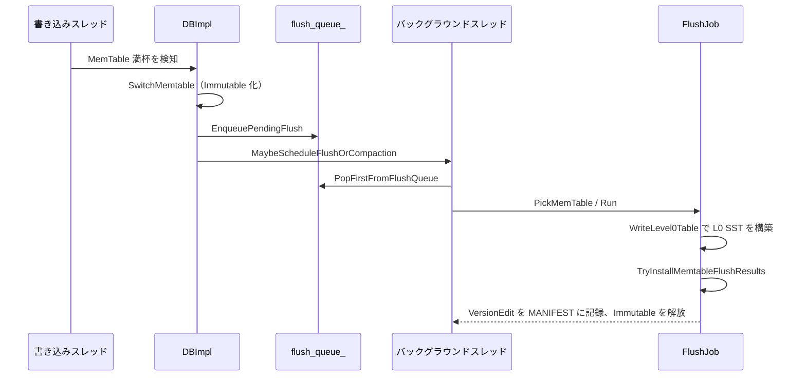

# 第13章 Flush

> **本章で読むソース**
> - [`db/flush_job.h`](https://github.com/facebook/rocksdb/blob/v11.1.1/db/flush_job.h)
> - [`db/flush_job.cc`](https://github.com/facebook/rocksdb/blob/v11.1.1/db/flush_job.cc)
> - [`db/memtable_list.h`](https://github.com/facebook/rocksdb/blob/v11.1.1/db/memtable_list.h)
> - [`db/memtable_list.cc`](https://github.com/facebook/rocksdb/blob/v11.1.1/db/memtable_list.cc)
> - [`db/flush_scheduler.h`](https://github.com/facebook/rocksdb/blob/v11.1.1/db/flush_scheduler.h)
> - [`db/db_impl/db_impl_compaction_flush.cc`](https://github.com/facebook/rocksdb/blob/v11.1.1/db/db_impl/db_impl_compaction_flush.cc)
> - [`db/db_impl/db_impl_write.cc`](https://github.com/facebook/rocksdb/blob/v11.1.1/db/db_impl/db_impl_write.cc)
> - [`include/rocksdb/advanced_options.h`](https://github.com/facebook/rocksdb/blob/v11.1.1/include/rocksdb/advanced_options.h)
> - [`include/rocksdb/options.h`](https://github.com/facebook/rocksdb/blob/v11.1.1/include/rocksdb/options.h)

## この章の狙い

満杯になった MemTable は、いつまでもメモリに留めておけない。
フラッシュは、その MemTable をディスク上の L0 SST へ書き出し、メモリを解放しつつ内容を永続化する処理である。
本章では、可変 MemTable を Immutable 化する `SwitchMemtable` から、`FlushJob` が SST を作って結果を MANIFEST に記録するまでの流れを、関数の段階に沿って追う。
これは第8章から第12章までたどってきた書き込みパスの終着点にあたる。

## 前提

- [第11章 MemTable と SkipList](11-memtable-skiplist.md)
- [第12章 WriteBufferManager](12-write-buffer-manager.md)

## フラッシュが解く問題

書き込みパスの各段階は、最終的に可変 MemTable へキーを挿入する。
MemTable はメモリ上の構造なので、容量には上限がある。
書き込みが続けば MemTable はいずれ `write_buffer_size` に達し、それ以上は受け付けられなくなる。
さらに、MemTable の内容は WAL にしか永続化されていないため、WAL を捨てるにはまず MemTable の内容を SST として書き出しておく必要がある。

フラッシュは、この二つの要求を一度に満たす。
満杯になった MemTable を Immutable（読み取り専用）に切り替え、その内容を走査して L0 の SST ファイルへ書き出す。
書き出しが完了すれば、MemTable が占めていたメモリを解放でき、対応する WAL も不要になる。

フラッシュは大きく三つの局面に分かれる。
第一に、可変 MemTable を Immutable 化して新しい可変 MemTable を用意する切り替え（`SwitchMemtable`）。
第二に、Immutable MemTable を選んで SST を構築するジョブ（`FlushJob::Run`）。
第三に、構築した SST を `VersionEdit` として MANIFEST に記録し、Immutable を解放する結果のインストール（`TryInstallMemtableFlushResults`）。
以下ではこの順に追う。


## MemTable を Immutable に切り替える

フラッシュの最初の一歩は、いま書き込みを受けている可変 MemTable を凍結し、新しい空の MemTable に書き込み先を差し替えることである。
凍結された MemTable は誰も書き換えないので、ロックなしで安全に走査できる。
この切り替えを担うのが `DBImpl::SwitchMemtable` である。

切り替えの本体は、新しい可変 MemTable を作り、古い MemTable を Immutable リストへ移し替える数行に集約される。

[`db/db_impl/db_impl_write.cc` L2722-L2739](https://github.com/facebook/rocksdb/blob/v11.1.1/db/db_impl/db_impl_write.cc#L2722-L2739)

```cpp
  cfd->mem()->SetNextLogNumber(cur_wal_number_);
  assert(new_mem != nullptr);
  cfd->imm()->Add(cfd->mem(), &context->memtables_to_free_);
  // ... (中略：new_imm がある場合の処理) ...
  new_mem->Ref();
  cfd->SetMemtable(new_mem);
  InstallSuperVersionAndScheduleWork(cfd, &context->superversion_context);
```

`cfd->mem()` が現在の可変 MemTable、`cfd->imm()` が Immutable をまとめる `MemTableList` である。
`imm()->Add` で現在の MemTable を Immutable リストへ加え、`SetMemtable(new_mem)` で書き込み先を新しい MemTable に差し替える。
この間カラムファミリーの書き込みはライターキューの先頭で止めてあるため、切り替えの瞬間に古い MemTable へ書き込みが混入することはない。

`SwitchMemtable` は MemTable を入れ替えると同時に、新しい WAL も用意する。
新しい可変 MemTable への書き込みは新しい WAL に記録され、古い MemTable がフラッシュされれば古い WAL は不要になる。
この対応関係を保つため、各 MemTable は自分の内容を裏付ける WAL の番号を `SetNextLogNumber` で覚えておく。

切り替えはあくまで準備にすぎない。
`SwitchMemtable` が戻った時点では Immutable MemTable がリストに積まれただけで、SST はまだ一つも作られていない。
実際の書き出しは別のバックグラウンドスレッドが後から実行する。

## MemTableList が Immutable を束ねる

切り替えで生まれた Immutable MemTable は、すぐにフラッシュされるとは限らない。
複数の Immutable が同時にリストへ積まれていることもある。
それらを管理するのが `MemTableList` で、ヘッダのコメントが設計方針を端的に述べている。

[`db/memtable_list.h` L229-L234](https://github.com/facebook/rocksdb/blob/v11.1.1/db/memtable_list.h#L229-L234)

```cpp
// This class stores references to all the immutable memtables.
// The memtables are flushed to L0 as soon as possible and in
// any order. If there are more than one immutable memtable, their
// flushes can occur concurrently.  However, they are 'committed'
// to the manifest in FIFO order to maintain correctness and
// recoverability from a crash.
```

Immutable のフラッシュ自体は順不同で、しかも並行に走ってよい。
ただし MANIFEST への記録は作成順（FIFO）に固定する。
SST ファイルを表す `VersionEdit` を作成順に書くことで、クラッシュからの回復時に WAL の削除境界が前後しないようにしている。
この「書き出しは並行、記録は順序付き」という分離が `MemTableList` の核である。

`MemTableList::Add` は、移してきた MemTable をリストの先頭に挿入し、未フラッシュ数を一つ増やす。

[`db/memtable_list.cc` L666-L683](https://github.com/facebook/rocksdb/blob/v11.1.1/db/memtable_list.cc#L666-L683)

```cpp
void MemTableList::Add(ReadOnlyMemTable* m,
                       autovector<ReadOnlyMemTable*>* to_delete) {
  assert(static_cast<int>(current_->memlist_.size()) >= num_flush_not_started_);
  InstallNewVersion();
  // ... (中略) ...
  current_->Add(m, to_delete);
  m->MarkImmutable();
  num_flush_not_started_++;
  if (num_flush_not_started_ == 1) {
    imm_flush_needed.store(true, std::memory_order_release);
  }
  UpdateCachedValuesFromMemTableListVersion();
  ResetTrimHistoryNeeded();
}
```

新しい MemTable をリストの先頭（`push_front`）に挿む規約から、リストを末尾から前へたどると作成順（MemTable ID の昇順）に並ぶ。
未フラッシュ数が 0 から 1 に変わったときだけ `imm_flush_needed` を立てる点に注目したい。
このフラグは `std::atomic<bool>` で、バックグラウンドスレッドがロックを取らずに「フラッシュすべき Immutable があるか」を確認できる。

## フラッシュ対象の MemTable を選ぶ

フラッシュを始めるかどうかの判定は `IsFlushPending` が下す。

[`db/memtable_list.cc` L392-L399](https://github.com/facebook/rocksdb/blob/v11.1.1/db/memtable_list.cc#L392-L399)

```cpp
bool MemTableList::IsFlushPending() const {
  if ((flush_requested_ && num_flush_not_started_ > 0) ||
      (num_flush_not_started_ >= min_write_buffer_number_to_merge_)) {
    assert(imm_flush_needed.load(std::memory_order_relaxed));
    return true;
  }
  return false;
}
```

明示的なフラッシュ要求があれば未フラッシュが一つでもあれば始める。
要求がなくても、未フラッシュ数が `min_write_buffer_number_to_merge_` 以上に溜まれば始める。
この二つ目の条件が、後述するまとめフラッシュの入口である。

フラッシュが始まると決まれば、`PickMemtablesToFlush` がリストから対象を取り出す。

[`db/memtable_list.cc` L410-L453](https://github.com/facebook/rocksdb/blob/v11.1.1/db/memtable_list.cc#L410-L453)

```cpp
void MemTableList::PickMemtablesToFlush(uint64_t max_memtable_id,
                                        autovector<ReadOnlyMemTable*>* ret,
                                        uint64_t* max_next_log_number) {
  // ... (中略) ...
  auto it = memlist.rbegin();
  for (; it != memlist.rend(); ++it) {
    ReadOnlyMemTable* m = *it;
    // ... (中略：atomic_flush の判定) ...
    if (m->GetID() > max_memtable_id) {
      break;
    }
    if (!m->flush_in_progress_) {
      assert(!m->flush_completed_);
      num_flush_not_started_--;
      if (num_flush_not_started_ == 0) {
        imm_flush_needed.store(false, std::memory_order_release);
      }
      m->flush_in_progress_ = true;  // flushing will start very soon
      // ... (中略：max_next_log_number の更新) ...
      ret->push_back(m);
    } else if (!ret->empty()) {
      // ... (中略：非連続な選択を防ぐ break) ...
      break;
    }
  }
  // ... (後略) ...
}
```

走査は `rbegin` から、つまり作成順の古いものから始める。
`max_memtable_id` を超える ID の MemTable に達したら打ち切る。
これにより、フラッシュ対象は「ある時点までに作られた連続した Immutable 群」に限定される。
選んだ MemTable には `flush_in_progress_` を立て、別のスレッドが同じ MemTable を二重に選ばないようにする。
ここで返る `ret` は作成順に並んでいるので、後段の SST 構築はこの順序を信頼してよい。

## FlushJob による SST の構築

選び終えた Immutable 群を実際に SST へ書き出すのが `FlushJob` である。
利用側は `PickMemTable` で対象を確定してから `Run` を呼ぶ。
`FlushJob::Run` は、まず特殊経路の MemPurge を試し、通常はそれを飛ばして `WriteLevel0Table` に進む。

[`db/flush_job.cc` L285-L292](https://github.com/facebook/rocksdb/blob/v11.1.1/db/flush_job.cc#L285-L292)

```cpp
  Status s;
  if (mempurge_s.ok()) {
    base_->Unref();
    s = Status::OK();
  } else {
    // This will release and re-acquire the mutex.
    s = WriteLevel0Table();
  }
```

ここで DB のミューテックスをいったん手放す点が重要である。
`WriteLevel0Table` の中の I/O は時間がかかるため、その間はロックを解放して、ほかのスレッドの書き込みや別のフラッシュを止めない。

`WriteLevel0Table` は、選んだ各 MemTable から内部イテレータを作り、それらを一つにまとめてから SST を構築する。

[`db/flush_job.cc` L903-L932](https://github.com/facebook/rocksdb/blob/v11.1.1/db/flush_job.cc#L903-L932)

```cpp
    for (ReadOnlyMemTable* m : mems_) {
      // ... (中略：ログ出力) ...
      if (logical_strip_timestamp) {
        memtables.push_back(m->NewTimestampStrippingIterator(
            ro, /*seqno_to_time_mapping=*/nullptr, &arena,
            /*prefix_extractor=*/nullptr, ts_sz));
      } else {
        memtables.push_back(
            m->NewIterator(ro, /*seqno_to_time_mapping=*/nullptr, &arena,
                           /*prefix_extractor=*/nullptr, /*for_flush=*/true));
      }
      // ... (中略：レンジ削除イテレータの収集と統計の集計) ...
    }
```

各 MemTable のイテレータは `memtables` に集められる。
複数の Immutable をまとめてフラッシュする場合、ここに複数のイテレータが入る。

集めたイテレータは `NewMergingIterator` で一つのマージイテレータに束ね、`BuildTable` に渡す。

[`db/flush_job.cc` L948-L950](https://github.com/facebook/rocksdb/blob/v11.1.1/db/flush_job.cc#L948-L950)

```cpp
      ScopedArenaPtr<InternalIterator> iter(
          NewMergingIterator(&cfd_->internal_comparator(), memtables.data(),
                             static_cast<int>(memtables.size()), &arena));
```

[`db/flush_job.cc` L1003-L1015](https://github.com/facebook/rocksdb/blob/v11.1.1/db/flush_job.cc#L1003-L1015)

```cpp
      s = BuildTable(
          dbname_, versions_, db_options_, tboptions, file_options_,
          cfd_->table_cache(), iter.get(), std::move(range_del_iters), &meta_,
          // ... (中略) ...
          &flush_stats);
```

`BuildTable` がマージイテレータを先頭から走査し、`TableBuilder` を通じて L0 の SST を一つ書き出す。
内部キーは MemTable の SkipList 上ですでにソート済みなので、マージイテレータはソート済みストリームを順に流すだけで済む。
SST の内部構造と `TableBuilder` の動作は第14章と第15章で扱う。

SST を書き終え、ファイルサイズが 0 でなければ、その内容を `VersionEdit` に追記する。

[`db/flush_job.cc` L1088-L1108](https://github.com/facebook/rocksdb/blob/v11.1.1/db/flush_job.cc#L1088-L1108)

```cpp
  const bool has_output = meta_.fd.GetFileSize() > 0;

  if (s.ok() && has_output) {
    TEST_SYNC_POINT("DBImpl::FlushJob:SSTFileCreated");
    // ... (中略) ...
    // Add file to L0
    edit_->AddFile(0 /* level */, meta_.fd.GetNumber(), meta_.fd.GetPathId(),
                   meta_.fd.GetFileSize(), meta_.smallest, meta_.largest,
                   // ... (中略) ...
                   meta_.min_timestamp, meta_.max_timestamp);
    edit_->SetBlobFileAdditions(std::move(blob_file_additions));
  }
```

`AddFile` の第一引数が `0`、すなわち新しい SST は必ず L0 に置かれる。
フラッシュが生む SST は L0 にしか入らないという原則が、この一行に表れている。

## 結果を MANIFEST に記録して Immutable を解放する

SST を作っただけでは、DB はまだその存在を認識していない。
`FlushJob::Run` は書き出しが成功すると、結果を `TryInstallMemtableFlushResults` に渡してインストールする。

[`db/flush_job.cc` L323-L332](https://github.com/facebook/rocksdb/blob/v11.1.1/db/flush_job.cc#L323-L332)

```cpp
      TEST_SYNC_POINT("FlushJob::InstallResults");
      // Replace immutable memtable with the generated Table
      s = cfd_->imm()->TryInstallMemtableFlushResults(
              cfd_, mems_, prep_tracker, versions_, db_mutex_,
              meta_.fd.GetNumber(), &job_context_->memtables_to_free, db_directory_,
              log_buffer_, &committed_flush_jobs_info_,
              !(mempurge_s.ok()) /* write_edit ... */);
```

`TryInstallMemtableFlushResults` は、まず各 MemTable に「フラッシュ完了」と書き込まれた SST のファイル番号を記録する。
そのうえで、リストの末尾（最も古い MemTable）からたどり、完了済みのものを作成順に MANIFEST へ反映していく。

[`db/memtable_list.cc` L559-L568](https://github.com/facebook/rocksdb/blob/v11.1.1/db/memtable_list.cc#L559-L568)

```cpp
  while (s.ok()) {
    auto& memlist = current_->memlist_;
    // The back is the oldest; if flush_completed_ is not set to it, it means
    // that we were assigned a more recent memtable. The memtables' flushes must
    // be recorded in manifest in order. A concurrent flush thread, who is
    // assigned to flush the oldest memtable, will later wake up and does all
    // the pending writes to manifest, in order.
    if (memlist.empty() || !memlist.back()->flush_completed_) {
      break;
    }
```

最も古い MemTable のフラッシュがまだ終わっていなければ、ここで処理を止めて何も書かない。
新しい MemTable のフラッシュを先に終えたスレッドは、自分の結果を MemTable に記録するだけで戻る。
古い MemTable を担当したスレッドが後から起きたとき、溜まっていた完了分をまとめて作成順に書く。
これが「書き出しは並行、MANIFEST への記録は FIFO」を成立させる仕組みである。

完了分が揃うと `VersionEdit` を組み立て、`LogAndApply` で MANIFEST に書き込む。

[`db/memtable_list.cc` L637-L642](https://github.com/facebook/rocksdb/blob/v11.1.1/db/memtable_list.cc#L637-L642)

```cpp
      if (write_edits) {
        // this can release and reacquire the mutex.
        s = vset->LogAndApply(cfd, read_options, write_options, edit_list, mu,
                              db_directory, /*new_descriptor_log=*/false,
                              /*column_family_options=*/nullptr,
                              manifest_write_cb);
```

書き込みが成功すると、コールバック `manifest_write_cb` がフラッシュ済みの MemTable をリストから外し、メモリ解放のために `to_delete` へ移す。
この時点で、Immutable が占めていたメモリが回収され、対応する WAL も削除候補になる。
`VersionEdit` と MANIFEST の詳細は第34章で扱う。

## まとめ書き、並行フラッシュ、atomic flush

フラッシュには、機構として効く三つの最適化が組み込まれている。

第一は、複数の Immutable をまとめて一つの SST に書く工夫である。
`IsFlushPending` の二つ目の条件が示すとおり、未フラッシュ数が `min_write_buffer_number_to_merge` に達するまでフラッシュを遅らせられる。

[`include/rocksdb/advanced_options.h` L272-L282](https://github.com/facebook/rocksdb/blob/v11.1.1/include/rocksdb/advanced_options.h#L272-L282)

```cpp
  // The minimum number of write buffers that will be merged together
  // before writing to storage.  If set to 1, then
  // all write buffers are flushed to L0 as individual files and this increases
  // read amplification because a get request has to check in all of these
  // files. Also, an in-memory merge may result in writing lesser
  // data to storage if there are duplicate records in each of these
  // individual write buffers.
  // If atomic flush is enabled (options.atomic_flush == true), then this
  // option will be sanitized to 1.
  // Default: 1
  int min_write_buffer_number_to_merge = 1;
```

なぜまとめると速いのか。
複数の Immutable に同じキーへの上書きや削除が含まれていれば、`WriteLevel0Table` のマージイテレータが古いバージョンを捨て、最新の一件だけを SST に残す。
書き出すバイト数が減り、生成される L0 ファイルの数も減るため、後続の `Get` が調べるファイル数と、コンパクションの負荷が下がる。
既定値は 1 で、この場合はまとめずに Immutable ごとに SST を作る。

第二は、複数の Immutable を別々のバックグラウンドスレッドで並行にフラッシュできることである。
`MemTableList` が SST の書き出しを順不同かつ並行で許し、MANIFEST への記録だけを FIFO に固定するため、I/O の重い書き出しをスレッド間で重ねられる。
フラッシュが書き込みに追いつかないとき、この並行性が滞留の解消を速める。

第三は、複数のカラムファミリーを一括して原子的にフラッシュする atomic flush である。

[`include/rocksdb/options.h` L1492-L1504](https://github.com/facebook/rocksdb/blob/v11.1.1/include/rocksdb/options.h#L1492-L1504)

```cpp
  // If true, RocksDB supports flushing multiple column families and committing
  // their results atomically to MANIFEST. Note that it is not
  // necessary to set atomic_flush to true if WAL is always enabled since WAL
  // allows the database to be restored to the last persistent state in WAL.
  // This option is useful when there are column families with writes NOT
  // protected by WAL.
  // ... (中略) ...
  bool atomic_flush = false;
```

`atomic_flush` を立てると、フラッシュの分岐が `AtomicFlushMemTablesToOutputFiles` に切り替わる。

[`db/db_impl/db_impl_compaction_flush.cc` L388-L394](https://github.com/facebook/rocksdb/blob/v11.1.1/db/db_impl/db_impl_compaction_flush.cc#L388-L394)

```cpp
Status DBImpl::FlushMemTablesToOutputFiles(
    const autovector<BGFlushArg>& bg_flush_args, bool* made_progress,
    JobContext* job_context, LogBuffer* log_buffer, Env::Priority thread_pri) {
  if (immutable_db_options_.atomic_flush) {
    return AtomicFlushMemTablesToOutputFiles(
        bg_flush_args, made_progress, job_context, log_buffer, thread_pri);
  }
```

このとき各カラムファミリーの `FlushJob` は SST を作るだけで個別には MANIFEST に書かず、全カラムファミリーの書き出しが揃ってから一度の MANIFEST 記録でまとめてコミットする。
WAL で保護されない書き込みを持つカラムファミリーがあるとき、フラッシュ結果が中途半端に永続化されてカラムファミリー間の整合が崩れるのを防ぐのが狙いである。
この設計のため、`min_write_buffer_number_to_merge` は `atomic_flush` が有効だと 1 に矯正される。

## バックグラウンドフラッシュの起動

ここまでの各段階は、利用者のスレッドではなくバックグラウンドスレッドが実行する。
第12章で見たように、可変 MemTable が満杯になると `DBImpl::FlushMemTable` が呼ばれ、`SwitchMemtable` で MemTable を切り替えてからフラッシュ要求をキューに積む。

[`db/db_impl/db_impl_compaction_flush.cc` L2445-L2448](https://github.com/facebook/rocksdb/blob/v11.1.1/db/db_impl/db_impl_compaction_flush.cc#L2445-L2448)

```cpp
    if (!cfd->mem()->IsEmpty() || !cached_recoverable_state_empty_.load() ||
        IsRecoveryFlush(flush_reason)) {
      s = SwitchMemtable(cfd, &context);
    }
```

[`db/db_impl/db_impl_compaction_flush.cc` L2516-L2521](https://github.com/facebook/rocksdb/blob/v11.1.1/db/db_impl/db_impl_compaction_flush.cc#L2516-L2521)

```cpp
        bool flush_req_enqueued = EnqueuePendingFlush(req);
        if (already_queued_for_flush || flush_req_enqueued) {
          loop_cfd->SetFlushSkipReschedule();
        }
      }
      MaybeScheduleFlushOrCompaction();
```

`EnqueuePendingFlush` がフラッシュ要求をキューに積み、`MaybeScheduleFlushOrCompaction` がバックグラウンドスレッドプールにジョブを投入する。
投入されたジョブが `BackgroundFlush` で、キューから要求を一つ取り出して処理する。

[`db/db_impl/db_impl_compaction_flush.cc` L3462-L3464](https://github.com/facebook/rocksdb/blob/v11.1.1/db/db_impl/db_impl_compaction_flush.cc#L3462-L3464)

```cpp
  while (!flush_queue_.empty()) {
    // This cfd is already referenced
    FlushRequest flush_req = PopFirstFromFlushQueue();
```

[`db/db_impl/db_impl_compaction_flush.cc` L3526-L3533](https://github.com/facebook/rocksdb/blob/v11.1.1/db/db_impl/db_impl_compaction_flush.cc#L3526-L3533)

```cpp
      if (cfd->IsDropped() || !cfd->imm()->IsFlushPending()) {
        // can't flush this CF, try next one
        column_families_not_to_flush.push_back(cfd);
        continue;
      }
      superversion_contexts.emplace_back(true);
      bg_flush_args.emplace_back(cfd, max_memtable_id,
                                 &(superversion_contexts.back()), flush_reason);
```

`BackgroundFlush` は要求のカラムファミリーが `IsFlushPending` を満たすか確かめてから、`FlushMemTablesToOutputFiles` に処理を渡す。
そこから先は、これまで見た `FlushJob::PickMemTable` と `Run` の段階に入る。
バックグラウンドで動かす意味は、I/O の重いフラッシュを利用者の書き込みスレッドから切り離し、書き込みのレイテンシに直接乗せないことにある。

要求をキューに積む経路には、ロックを取らずに動く軽量な仕組みもある。
書き込みパスから満杯を検知したカラムファミリーを登録する `FlushScheduler` がそれで、CAS（compare-and-swap）だけで片方向リストへ要素を押し込む。

[`db/flush_scheduler.cc` L25-L32](https://github.com/facebook/rocksdb/blob/v11.1.1/db/flush_scheduler.cc#L25-L32)

```cpp
  Node* node = new Node{cfd, head_.load(std::memory_order_relaxed)};
  while (!head_.compare_exchange_strong(
      node->next, node, std::memory_order_relaxed, std::memory_order_relaxed)) {
    // failing CAS updates the first param, so we are already set for
    // retry.  TakeNextColumnFamily won't happen until after another
    // inter-thread synchronization, so we don't even need release
    // semantics for this CAS
  }
```

ロックを取らず CAS で先頭に押し込むため、複数のライタースレッドが同時に満杯を検知しても、互いの登録を待たずに進める。
書き込みのホットパスでミューテックス獲得を避ける、ロックフリーの登録経路である。



## まとめ

- フラッシュは満杯になった MemTable を L0 SST へ書き出し、メモリを解放しつつ内容を永続化する。書き込みパスの終着点である。
- `SwitchMemtable` が可変 MemTable を Immutable 化し、新しい可変 MemTable と WAL を用意する。Immutable は `MemTableList` に積まれる。
- `FlushJob` は `PickMemTable` で対象を選び、`Run` から `WriteLevel0Table` を呼んで MemTable を走査し、`BuildTable` で L0 SST を一つ作る。
- 結果は `TryInstallMemtableFlushResults` が `VersionEdit` にして MANIFEST へ記録する。書き出しは並行に走ってよいが、MANIFEST への記録は作成順（FIFO）に固定される。
- `min_write_buffer_number_to_merge` による複数 Immutable のまとめ書き、複数スレッドでの並行フラッシュ、`atomic_flush` による複数カラムファミリーの原子的コミットが、機構として効く最適化である。
- フラッシュはバックグラウンドスレッド（`BackgroundFlush`）が実行し、I/O の重い処理を利用者の書き込みレイテンシから切り離す。

## 関連する章

- [第14章 テーブルフォーマット](../part03-sst/14-table-format.md)
- [第15章 BlockBasedTableBuilder](../part03-sst/15-block-based-table-builder.md)
- [第34章 MANIFEST と VersionEdit](../part06-version/34-manifest-versionedit.md)
